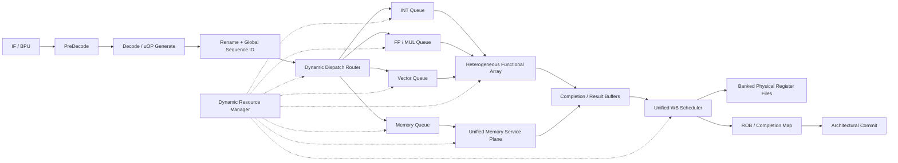
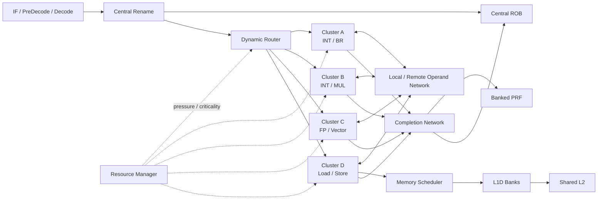
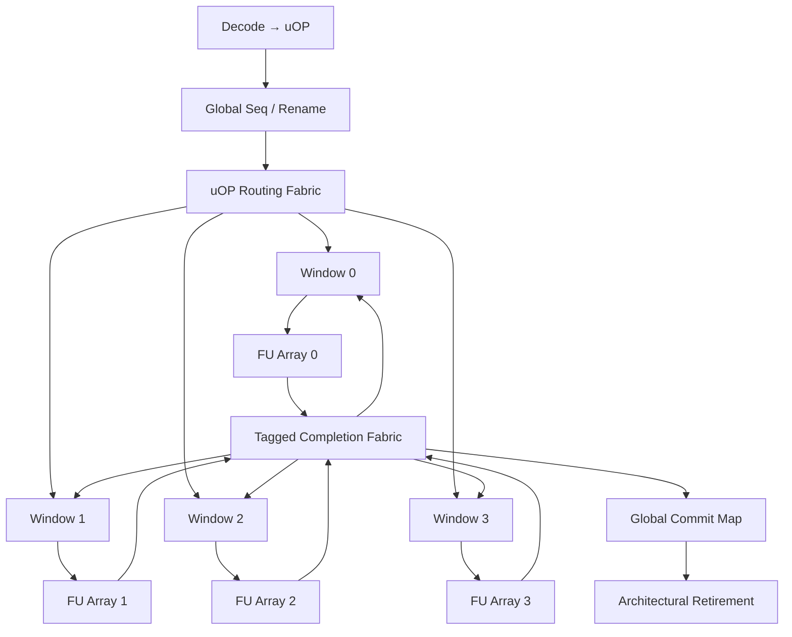
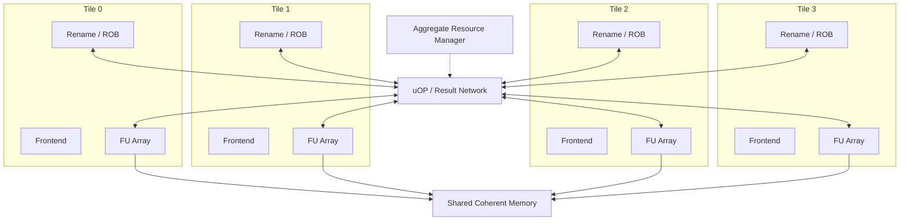

# 面向动态聚合流水线与 uOP 执行的 RISC‑V 处理器架构研究

## 执行摘要

你的设想是**可行的，而且有明确的研究价值**，但需要把“动态流水线”从“运行时改变硬件结构”重新定义为：

> **物理资源静态存在，逻辑流水拓扑、uOP 路由、资源归属、队列配额、执行宽度、线程聚合方式在运行时动态变化。**

这是整个设计能否落地的关键。ASIC 制造后不可能按指令真正“实例化/销毁”ALU、ROB 或 LSU；FPGA 的 Dynamic Function eXchange（DFX，原 Partial Reconfiguration）确实允许系统运行时替换部分逻辑，但需要预定义可重配置区域、隔离和 partial bitstream 管理，适合毫秒/粗粒度功能切换一类场景，而不是每几个 CPU cycle 改一次执行资源。因此，**per-instruction scaling 应实现为资源 activation/allocation/routing，而不是 physical instantiation**。AMD 对 DFX 的定义也明确是替换指定区域，同时其余逻辑继续运行，并提供 Decoupler、AXI Shutdown Manager 等配套隔离机制。citeturn25search0turn25search2turn25search10

我建议把你的设计定义为 **Elastic Aggregate RISC‑V Microarchitecture，弹性聚合微架构**，核心由三个层次组成：

1. **稳定的 Architectural Control Plane**：IF/PreDecode/Decode、Rename、全局顺序号、精确异常、branch checkpoint、memory-order tracking、commit。它保证 RISC‑V architectural state 始终正确。
2. **动态的 Execution Data Plane**：多个 heterogeneous Functional Array、banked issue queues、banked PRF、LSU ports、vector lanes 和 completion/write-back ports。每个 uOP 可以动态选择路径。
3. **Aggregate Fabric**：允许一个逻辑 hart 在需要时借用邻近 tile 的执行能力；也允许多个 hart 在相同 PC/控制流下形成一个“thread cohort”，一次 fetch/decode 后向多个线程上下文复制或 multicast uOP，从而得到一种**无需改变基础 RISC‑V ISA 的 SIMT-like 执行模式**。

这个方向与 XiangShan 的很多已有思想是相容而不是冲突的。昆明湖后端已经是 Decode → Rename → Dispatch → Schedule → Issue → Execute → Writeback → Retire 的 OoO 结构；当前文档描述 6-wide decode/rename/dispatch、160-entry ROB、最多 8 条退休/周期，整数/浮点/向量物理寄存器分别为 224/192/128，并支持 ROB compression、instruction fusion 和 checkpoint-based recovery。citeturn3view0turn3view2 XiangShan 在 Decode 中还会把复杂指令拆为 uOP，在 vector LSU 中进一步把 vector memory uOP 拆成 element-level 工作，然后重新合并；这为你的“ISA → uOP → 动态 Functional Array”提供了直接的工程先例。citeturn3view2turn3view4

但我的主要结论是：**不要从“完全统一、完全动态、任意 uOP 任意去处”开始。** 这样的第一版极可能被 crossbar、wakeup/select、PRF 端口、ROB recovery、memory ordering 和 FPGA routing delay 击败。经典 superscalar 研究已经指出 issue-window/wakeup/select 等结构会随着宽度和窗口增长迅速成为复杂度与时钟周期瓶颈。citeturn15search4

更好的路线是：

> **第一代：集中 Rename/ROB + 分布式 Queue/Functional Array + 分层 Completion Network。**  
> **第二代：引入 execution-cluster borrowing 和 thread cohort/SIMT-like 聚合。**  
> **第三代：再研究 segmented ROB / distributed retirement 和真正的多 tile core fusion。**

在 FPGA 上，应先选择 VCU118/XCVU9P 一类资源充分的平台；AMD 官方将 VCU118定位为 Virtex UltraScale+ XCVU9P 开发与评估平台。citeturn24search2turn24search5 一个很有价值的参考是 RSD：它证明了一个具有 speculative OoO scheduler、动态 memory disambiguation、non-blocking L1 D-cache 的 RISC-V OoO 核可以专门面向 FPGA 优化；RSD 当前公开实现是 RV32IMF、2-fetch、6-issue backend、最多 64 条 in-flight，并可在 Xilinx Zynq/ZedBoard 上运行。citeturn16view0

**综合建议：最值得做的第一版并不是一个“可变长度流水线 CPU”，而是一个“固定物理网络之上的弹性 uOP 数据流 CPU”。** 单线程 IPC 的主要收益应来自 scheduler 负载均衡、更高 MLP、减少 FU 空闲和更有效的 bypass，而真正的大规模收益来自**多个 hart/核心之间的执行资源聚合**。

## 设计边界与架构原则

你的原始流水线可以保留：

```text
IF
 ↓
PreDecode
 ↓
Decode → uOP
 ↓
Rename / Schedule / Reorder / Dispatch
 ↓
Functional Array
 ↓
Unified Memory
 ↓
Unified Write-Back
 ↓
Commit
```

但我建议把它进一步拆成**控制面与数据面**：



这里一个非常重要的原则是：

**“Unified” 应当意味着统一调度视图，而不一定意味着一个巨大单体物理结构。**

例如：

- Unified Memory 不应首先做成一个多几十端口的“万能 cache”；更实际的是 split L1 I-cache/D-cache + unified request scheduling fabric + shared/coherent L2。
- Unified Write-Back 不应做成一个巨大的全连接 Common Data Bus；更实际的是 local result buffers + banked WB arbiters + wakeup network + PRF bank network。
- Unified Queue 不应是一张 128-entry、12-port、全 CAM wakeup 的表；更适合 FPGA 的是多个较小 queue bank，通过 steering 形成逻辑统一队列。

XiangShan 本身就是这种“逻辑统一、物理分散”的很好参照：Rename/Dispatch 是宽前端，但 Dispatch 后进入 integer、floating-point、vector、memory 四类 scheduler，每类 scheduler 下又有面向不同操作类型的 issue queue；文档明确描述 issue queue 采用 in-order input、out-of-order output。citeturn3view2

### uOP 应成为真正的内部协议

我建议不要只把 uOP 看成“译码后的 instruction”。它应该是整个机器内部的**transaction packet**。

建议至少包含：

| 字段 | 作用 |
|---|---|
| `HartID` | 属于哪个 architectural hart |
| `InstSeq` | 全局/每 hart architectural instruction sequence |
| `uopIdx / uopLast` | 一个 ISA instruction 内的 uOP 编号和结束标志 |
| `ROBTag / CommitGroup` | 精确退休 |
| `SrcPhyTag[]` | 物理源寄存器 |
| `DstPhyTag` | 物理目标寄存器 |
| `ExecClass` | INT/BR/MUL/FP/VEC/LD/ST/CSR 等 |
| `AffinityMask` | 哪些 Functional Array 可以执行 |
| `MemOrderTag` | load/store/atomic/fence ordering |
| `BranchMask / CheckpointID` | speculative recovery |
| `ThreadMask` | SIMT-like cohort 中有效线程 |
| `Criticality` | scheduler critical-path hint |
| `ResultClass` | scalar/vector/memory/control result |
| `ExceptionMeta` | precise exception tracking |

XiangShan 当前控制块已经在做其中不少事情：复杂指令经过 DecodeCompunit 分裂，vector 指令根据 `vtype` 等信息确定分裂行为；Rename 阶段分配物理寄存器和 `robIdx`，并允许多个相关 uOP 共享/压缩 ROB 条目；instruction fusion 还能把相邻指令合并或重编码。citeturn3view2turn1search16

这意味着你的设计最好采用：

> **Architectural Instruction → Macro-uOP → Execution-uOP**

而不是简单的“一条 RISC-V 指令永远拆成 N 个等价 micro-op”。

简单 ADD、AND、branch 一般保持一个 uOP。复杂内存、vector、AMO、某些 long-latency operation 再进行二次分裂。否则 uOP 数量膨胀会直接吃掉 ROB、IQ、PRF、wakeup bandwidth 和 FPGA BRAM。

Vector 尤其适合分层设计：

```text
RVV architectural instruction
        ↓
1 × vector macro-uOP in ROB
        ↓
vector scheduler
        ↓
N × internal lane/element micro-operations
        ↓
merge/completion
        ↓
1 × architectural completion
```

这和 XiangShan LSU 的 VLSplit/VSSplit 很接近：vector load/store 在内部拆成 elements，由 scalar LoadUnit/StoreUnit 执行，然后重新 merge 成原 uOP。citeturn3view4

### “动态流水级数”最好改成 elastic latency

真正改变 pipeline register 数量并不现实；物理时序路径在综合/布局布线时就已经确定。因此建议把 variable-depth 定义为：

```text
Fast path:
Queue → ALU → Bypass → Consumer

Normal path:
Queue → ALU → Result Buffer → WB → PRF → Consumer

Remote path:
Queue → Interconnect → Remote FU → Result Buffer
      → Interconnect → WB/PRF
```

也就是说，一个 uOP 的**logical latency 可以动态变化**，而硬件实际是固定的多路径 elastic network。

这样既满足你的“dynamic routing”，又不会破坏 FPGA/ASIC 的静态时序模型。

## XiangShan 与参考高性能 RISC‑V 核的比较

截至本次研究，XiangShan 官方仓库仍以 Yanqihu、Nanhu、Kunminghu 多代设计演进；官方 README 在 2026 年的说明中特别提醒 Kunminghu-v3 仍快速变化，而研究、验证和下游工作更适合优先基于较稳定的 Kunminghu-v2。项目本身使用 Chisel，是目前最有价值的开放高性能 RISC‑V OoO 参考之一。citeturn2search3turn0search9

XiangShan 当前文档将后端划分为 Decode、Rename、Dispatch、Schedule、Issue、Execute、Writeback、Retire。这里应注意：**这八个是逻辑后端阶段，不应简单解释为“整个核心就是八级流水”**。BPU、IFU、cache、MMU、LSU 等内部还有各自多级 pipeline，因此昆明湖并没有一个适合所有指令统一描述的“固定 pipeline depth”。例如最新 BPU 文档就区分较早的 S1 predictor 与更准确的 S3 predictor，由后者覆盖/修正前者预测。citeturn3view0turn3view3

| 核 | Pipeline / 前后端 | uOP 模型 | Rename / ROB | Dispatch / Issue / Commit | Memory | 可伸缩性 | FPGA 适合度 |
|---|---|---|---|---|---|---|---|
| **XiangShan Kunminghu** | 后端逻辑上 Decode→Rename→Dispatch→Schedule→Issue→Execute→WB→Retire；前端/BPU/LSU 内部另有多级流水 | complex instruction split；instruction fusion；vector memory 可继续拆 element | 6-wide rename；224 INT / 192 FP / 128 Vector PRF；160-entry ROB；支持 ROB compression、RAT/RAB snapshot recovery | 6-wide decode/rename/dispatch；四大 scheduler 类；最多 8 retire/cycle | OoO LSU、load replay、store buffer、RAW/RAR violation recovery；当前 D$ 文档为 64 KiB 4-way | Chisel 模块化程度高；cache/interconnect 分层清楚，但宽 OoO 核本身很重 | **中**：非常好的研究基准，但直接完整映射 FPGA 成本高 citeturn3view0turn3view2turn3view4turn2search6 |
| **BOOM / SonicBOOM** | 文档概念上 10 阶段；当前实现合并成 Fetch、Decode/Rename、Rename/Dispatch、Issue/RegRead、Execute、Memory、Writeback，Commit 异步于此描述 | Decode 生成 Micro-Op(s) | unified PRF；circular banked ROB，ROB bank 数 `W` 与 dispatch/commit width 相关；支持 rollback 或 committed-map-table 恢复 | OoO issue；按 ROB row greedy in-order commit；参数化宽度 | LAQ、SAQ、SDQ；store 在 commit 后才允许真正写 memory | 高度参数化；Chipyard 生态便于多核/FPGA | **中高**：官方明确支持 FPGA 使用场景，且结构比 XiangShan 易裁剪 citeturn7search0turn7search11turn6view1turn7search13 |
| **RSD** | 2-fetch frontend、6-issue backend；最多 64 instruction in flight，参数可配置 | OoO internal operation scheduling | OoO instruction window；公开 README 强调 speculative scheduler + replay | 2-fetch / 6-issue 后端；exact retire width 未在 README 摘要中给出 | speculative OoO load/store、dynamic memory disambiguation、non-blocking L1 D$、AXI4 | 参数可配，但主要目标是紧凑 OoO | **很高**：SystemVerilog，专门做 FPGA RAM 优化，可综合至 Zynq/ZedBoard citeturn16view0 |
| **CVA6** | 典型 6-stage、single-issue application processor | Decode 生成 scoreboard entry，而非激进 uOP 数据流 | scoreboard 管理寄存器/FU hazard，而不是宽 OoO rename/ROB | single issue，复杂度明显低于前三者 | cache/MMU + AXI 接口；大量参数可配 | 官方文档强调 FPGA/ASIC、超过 50 个参数；适合作为简单基线 | **很高**：结构规整、已有 Vivado/FPGA 流程，是实现成本的下限参考 citeturn9search7turn9search12turn9search30turn9search33 |

这几个设计给出的最重要启示不同。

**XiangShan** 说明很宽的 RISC‑V OoO 后端、复杂 uOP 分裂、fusion、large ROB、vector 和 aggressive LSU 可以组合在一起，而且其 scheduler 已经天然分区。citeturn3view0turn3view2

**BOOM** 特别适合借鉴 ROB 与 PRF 的参数化设计。它的 ROB 不是任意 fully associative retirement structure，而是按 fetch packet 形成 rows、每行 W banks，从而控制 metadata 和 commit 复杂度。citeturn6view1

**RSD** 对你的 FPGA 目标非常重要，因为它明确在 OoO 性能和 FPGA 映射之间做设计折中，并使用 speculative scheduling/replay，而不是为了“概念纯粹”构造一个无限复杂的 scheduler。citeturn16view0

**CVA6** 则提醒一个重要事实：更简单的 pipeline 往往能获得更高频率和更好的 FPGA density。所以你最终不应只比较 IPC，而要比较：

\[
Performance = IPC \times F_{clk}
\]

以及：

\[
Perf/LUT,\quad Perf/BRAM,\quad Perf/W,\quad IPC/mm^2
\]

一个 IPC 高 15%、但 FPGA Fmax 降 25% 的“动态流水线”，实际上是失败的。

## uOP、Rename、队列和动态执行骨架

### Rename 与 ROB 不要一开始分布化

我最强的建议之一是：

> **第一代动态架构保持 centralized architectural retirement。**

也就是：

```text
Decode
  ↓
Central Rename
  ↓
Global ROB / Commit Group
  ↓
Distributed Execution
  ↓
Central / Hierarchical Completion
  ↓
In-order Architectural Commit
```

原因不是因为中央 ROB 最先进，而是因为它极大简化：

- precise exception；
- branch misprediction recovery；
- interrupt；
- CSR serializing；
- fence；
- AMO；
- store commit；
- speculative load violation；
- debug single-step；
- differential testing。

XiangShan 也没有为了更高并发而放弃 architectural ordering。Rename 分配 `robIdx`，ROB 保证最终有序退休，同时 RAB、RAT/free-list snapshot 与 branch checkpoint 一起支持快速恢复。当前文档还描述了无分支时按一定 uOP 间隔建立 snapshot，以降低 redirect recovery 成本。citeturn1search16turn3view2

因此第一版可采用：

```text
128-entry ROB
4 banks × 32 rows

Rename width = 2 → 4
Dispatch width = 2 → 4
Issue capability = 4 → 8 uOP/cycle
Commit width = 4

Execution bandwidth > Decode bandwidth
```

这里故意让 issue bandwidth 高于 rename/commit bandwidth。这样才能实验你的核心假设：**通过动态 execution capacity 吸收长 latency、queue imbalance 和 MLP，而不是单纯把整个处理器每一级都加宽。**

### 第二代再考虑 Hierarchical ROB

在单中央 ROB 成功后，可以尝试：

```text
                 Global Commit Head
                        |
             +----------+----------+
             |                     |
        ROB Segment A          ROB Segment B
             |                     |
        Cluster A/B             Cluster C/D
```

每条 instruction/uOP 有一个 monotonic `GlobalSeq`。

Cluster 可以 OoO 完成，但全局 Commit Controller 只允许最老 complete group 更新 architectural state。

这种结构的价值在于 ROB metadata 和 local completion logic 可以靠近 execution cluster，但仍保留一个很小的 global ordering plane。

真正难点不是“完成顺序”，而是：

**branch recovery + free-list recovery + memory violation recovery。**

所以第二代必须有：

```text
CheckpointID
Rename Map Snapshot
FreeList Snapshot/Delta
Load/Store Epoch
GlobalSeq Boundary
```

否则 segmented ROB 在 mispredict 下会非常痛苦。

### Queue 不要做一个巨大 Unified IQ

建议：

```text
Dispatch Router
 ├─ Q0 Integer Simple
 ├─ Q1 Branch / Integer
 ├─ Q2 MUL/DIV/FP
 ├─ Q3 Load
 ├─ Q4 Store
 └─ Q5 Vector
```

但每个 Q 的逻辑容量可以动态借用。

例如物理上是：

```text
8 × 16-entry queue banks
```

而不是：

```text
1 × 128-entry fully-connected IQ
```

Resource Manager 决定哪个 bank 当前属于哪一类：

```text
Phase A:
INT  = 3 banks
MEM  = 3 banks
FP   = 1 bank
VEC  = 1 bank

Phase B:
INT  = 2
MEM  = 2
FP   = 1
VEC  = 3
```

这才是真正 FPGA-friendly 的“dynamic scaling”。

### Dispatch 可以变成 cost-based routing

每个 ready/rename 后的 uOP 对候选 cluster 计算：

\[
Score(c)=
\alpha Q_c
+\beta L_c
+\gamma H_c
+\delta B_c
+\epsilon W_c
-\zeta C_{uop}
\]

其中：

- \(Q_c\)：queue pressure；
- \(L_c\)：预计执行 latency；
- \(H_c\)：network hop；
- \(B_c\)：目标 PRF/memory bank conflict；
- \(W_c\)：write-back pressure；
- \(C_{uop}\)：criticality。

选择最低 score 的 cluster。

不要第一版做复杂 ML scheduler。用 saturating counters + LUT + comparators 就够了，而且容易综合。

Resource Manager 则不应每周期重分全部资源，而应采用**双时间尺度控制**：

```text
每 cycle:
    uOP route / issue / bypass decision

每 64~256 cycles:
    queue quota
    cluster ownership
    active execution lanes
    thread allocation
    prefetch aggressiveness
```

再加 hysteresis，防止配置来回振荡。

## 三种具体动态聚合流水线方案

### 弹性 Clustered OoO

这是我认为**最适合作为第一代芯片/FPGA 原型**的架构。



**优点**是 precise state 仍然集中，而 execution bandwidth 可动态分布；FPGA 上可以把每个 cluster 放在一个相对局部的 placement region，大幅降低“所有 queue 到所有 FU”的 routing fanout。BOOM 的 unified PRF/OoO issue 和 XiangShan 的多个 scheduler 都证明集中 architectural ordering + 分散 execution 是成熟设计空间。citeturn7search11turn3view2

主要风险是跨 cluster operand forwarding。若任何 producer 都立即向任何 consumer 全广播，就重新变成巨大 CDB。

因此应限制：

```text
local bypass  : 0~1 cycle
remote wakeup : +1 cycle
remote data   : +1~2 cycles
```

让 scheduler 有 locality preference。

**IPC 目标假设**：相对于**相同 FU 数量、相同 ROB 容量、固定 steering 的 clustered baseline**，可以把 **+5%～12% IPC** 设为合理研究目标，而不是性能承诺。收益主要来自 queue imbalance、FU under-utilization、load latency hiding；如果基线 steering 本来就很好，则增益可能接近零。真正验收必须同时满足 Fmax 不被严重损害。

**复杂度：中。**

### Distributed Dataflow / Completion 架构

第二种更接近你的“pipeline itself routes dynamically”想法。



这里 instruction 不再沿一条固定 pipeline 走到底，而变成：

> **tagged token 在 execution graph 中流动。**

每个 Window 保有少量 ready state；result completion 通过 `(HartID, GlobalSeq, DstPhyTag)` 返回。

这样非常适合进一步扩到多个 tile。

优点：

- execution window 可以物理分散；
- wire length 更短；
- 每个 tile 可独立扩展；
- 非常接近你“sub-component 动态 route”的目标。

缺点则非常严重：

- precise exception；
- branch squash；
- PRF ownership；
- remote operand；
- store ordering；
- debug；
- deadlock/livelock；
- completion network congestion。

经典 superscalar 复杂度研究指出，随着 instruction window 与 issue width 增长，wakeup/select 的复杂度本身就可能决定时钟周期；将其分布化可以缩小 local structures，却会把一部分成本转换成网络 latency 和 steering complexity。citeturn15search4

因此我的建议是只把它作为**第二版研究核**。

**实验 IPC 目标**：在高 ILP、高 MLP workload 上以 **+8%～20%** 为研究目标；branch-heavy、短依赖链程序可能没有收益甚至倒退。这同样是待验证假设，不是已有核心实测结果。

**复杂度：高。**

### Aggregate Tile + SIMT-like Cohort

第三种最接近你说的：

> “core aggregate together”  
> “single instruction multiple thread plus multi-inst concurrent run”。

我的建议不是把四个小核真的熔成一个巨大 ROB，而是采用**Home Core + Borrowed Execution**。



例如 Tile 0 上的 hart 遇到很高 ILP，而 Tile 1 空闲：

```text
Tile 0 Rename / ROB
       |
       +--> local ALU
       |
       +--> remote Tile 1 ALU
       |
       +--> remote Tile 1 MUL
```

但所有 remote uOP 仍使用 Tile 0 的：

```text
HartID
ROBTag
GlobalSeq
CheckpointID
DstPhyTag
```

所以 Tile 1 只是 **execution donor**，而不是共同维护同一个 architectural state。

这比“共享一个跨 tile 巨型 ROB”简单很多。

而 **SIMT-like mode** 可以更进一步。

设四个 hart：

```text
Hart 0 PC = 0x1000
Hart 1 PC = 0x1000
Hart 2 PC = 0x1000
Hart 3 PC = 0x1000
```

且 predictor/control flow 一致，可以临时形成：

```text
Cohort = {0,1,2,3}
```

然后：

```text
Fetch once
Decode once
          ↓
      uOP template
     /    |    |    \
   H0    H1    H2    H3
```

每个 hart 仍有自己的：

- architectural register map；
- physical register tags；
- exception state；
- memory addresses；
- branch outcome。

只是 frontend/decode 和部分 scheduler work 被共享。

当分支结果变成：

```text
H0 H1 → taken
H2 H3 → not taken
```

cohort 拆分：

```text
Cohort A = {H0,H1}
Cohort B = {H2,H3}
```

这是一种**dynamic warp formation** 思路。

它与 RISC‑V V 扩展不同。RISC‑V ISA 将 Vector 定义为单 hart 的向量操作语义；它并没有要求多个独立 hart 采用 GPU-style reconvergence。因此，将 cohort 做成纯 microarchitecture optimization 可以保持每个 hart 的标准 architectural behavior，而不必先发明一个新 ISA。RISC‑V ISA 本身由独立的 unprivileged/privileged volumes 和可选扩展组成，Vector 亦作为独立扩展演进。citeturn20view0turn20view1

这种模式的收益不应主要看“单 hart IPC”，而应看：

\[
Aggregate\ IPC = \sum IPC_{hart}
\]

以及 frontend energy / committed instruction。

**研究目标**可以设为：四个高度 convergent 线程下 aggregate committed IPC 达到独立执行模式的 **1.5～3×**，同时 fetch/decode 能耗显著下降；对于完全 divergence 的 workload，性能目标则应是不明显劣于普通 SMT。这个范围是设计验收假设，而非现有结果。

**复杂度：很高，但研究价值最大。**

## 内存、一致性、分支预测与统一写回

### Unified Memory 最好是服务层，而不是统一 L1

推荐：

```text
           Load Queue A
           Load Queue B
           Store Queue
           Vector Mem Queue
                  ↓
        Unified Memory Scheduler
                  ↓
        Address / Bank Router
          ↓       ↓       ↓
       L1D B0   L1D B1   L1D B2
             \    |    /
              Shared L2
                  ↓
             Coherence
                  ↓
             LLC / DDR
```

不要把 I-cache 和 D-cache 的所有端口先统一到一个大 SRAM，因为：

- IF bandwidth 与 load/store access pattern 完全不同；
- FPGA BRAM 通常只有有限端口；
- unified multiported SRAM 很容易被复制成大量 BRAM/LUTRAM；
- L1 hit latency 对 IPC 极敏感。

更理想的是：

```text
L1I : private/split
L1D : banked/private
L2  : shared/unified
```

而你的“Unified Memory”实际上是：

> **统一的请求排序、资源仲裁、coherence 和 miss handling plane。**

XiangShan LSU 已展示需要处理的复杂问题：load 可因 TLB miss、D-cache miss、bank conflict、memory dependency 等进入 replay；Store Queue/SBuffer 与 D-cache forwarding 有明确优先关系；RAW/RAR violation detection 用于纠正 speculative memory ordering。citeturn3view4

这意味着 dynamic memory scheduler 至少要观察：

```text
LQ occupancy
SQ occupancy
MSHR occupancy
TLB misses
cache bank conflict
replay rate
store-forward hit
memory dependence violation
DRAM outstanding count
```

**MLP（Memory-Level Parallelism）应成为你的核心一级指标**，而不是只看 IPC。

### RVWMO 与 cache coherence 是两回事

这一点在 aggregate-core 设计中尤其重要。

RISC‑V ISA 规定 architectural memory ordering，包括基础弱内存顺序模型相关规则；具体 cache coherence protocol 则属于 microarchitecture/system implementation，而不是“RISC‑V 指令集替你解决”。RISC‑V 官方 ISA 手册维护 unprivileged 和 privileged architectural specification。citeturn20view0

所以多 tile 聚合之后至少要分别解决：

```text
RVWMO / fence / AMO
        ↑
architectural ordering
```

和：

```text
L1 ↔ L1 ↔ L2
        ↑
cache coherence
```

两套问题。

第一版单 tile FPGA 可以完全不做 coherence；第二阶段两 tile 才加入 directory/snoop protocol。

一个较安全的演进顺序是：

```text
single tile
→ 2 tile shared non-cacheable memory
→ private L1 + shared L2
→ 2 tile coherence
→ 4 tile coherence
→ execution borrowing
```

不要一开始同时验证 OoO + coherence + core fusion。

### Unified Write-Back 是最大潜在陷阱之一

如果设计：

```text
16 FUs
   ↓
16 × N crossbar
   ↓
8-port PRF
```

FPGA 很可能直接被 routing 和 mux delay 卡死。

建议改成：

```text
FU
 ↓
Local Result Buffer
 ↓
Completion Arbitration
 ├─ Wakeup Token Network
 ├─ Bypass Network
 ├─ PRF Bank Scheduler
 └─ ROB Complete
```

也就是把：

> **结果产生、依赖唤醒、forwarding、永久写 PRF、ROB completion**

解耦。

例如一个 ALU 完成：

```text
cycle N:
    ALU result valid
    → wakeup dependent uOP

cycle N+1:
    result may bypass directly

cycle N+1/N+2:
    WB scheduler finds PRF bank port
    → durable PRF write

independently:
    ROB.complete = 1
```

这使得 Unified Write-Back 真正变成一个 scheduling layer，而不是 CDB。

PRF 建议 banked：

```text
P0 P1 P2 P3
```

物理寄存器分配时直接考虑：

```text
DstPhyTag.bank
```

Rename 可以做 bank-aware allocation，降低 WB conflict。

### Branch predictor 是动态宽机器的供给瓶颈

当 backend 变得越来越宽，一个很容易发生的情况是：

```text
Execution capacity ↑↑
Frontend useful uOP supply ≈
```

最终 ALU 仍然空着。

XiangShan 的最新 BPU 文档恰好展示了高性能前端的一种策略：快速 S1 predictor 提前产生预测，较复杂、更准确的 S3 predictor 稍后覆盖/修正它；S1 层包含 FallThrough、uBTB、aBTB、uTAGE 等，而后级结合更完整 BTB、TAGE、SC、ITTAGE、RAS。citeturn3view3

这和你的动态机器很匹配：

```text
BPU confidence high
      ↓
increase fetch / dispatch aggressiveness

BPU confidence low
      ↓
do not overfill remote clusters
reduce speculation distance
```

Resource Manager 可以把 branch confidence 纳入资源策略。

例如：

\[
SpecBudget =
f(BPConfidence, ROBFree, IQFree, MemPressure)
\]

这比永远跑最大宽度更合理。

## FPGA 原型路线与实验设计

FPGA 验证是这个项目非常大的优势，但必须让架构**从第一天就 FPGA-aware**。

RSD 是很好的参考：它使用 SystemVerilog，明确支持 Vivado，并针对 FPGA RAM structure 优化，且可以部署到 Zynq/ZedBoard。citeturn16view0 BOOM 同样是可综合、参数化的 Chisel 核，并支持通过 Chipyard/FireSim 等 FPGA 环境使用。citeturn7search0 CVA6 则从设计定位上同时面向 FPGA 与 ASIC。citeturn9search33

对于较宽动态 OoO 原型，我建议使用 **AMD VCU118/XCVU9P** 作为主要目标。官方 VCU118 用户指南明确指出该板面向 Virtex UltraScale+ XCVU9P 开发和评估。citeturn24search5

以下资源数字不是声称“这个设计一定会占这么多”，而是**项目的 synthesis acceptance budget**：

| 原型 | 架构 | FPGA 预算目标 | Fmax 目标 |
|---|---|---:|---:|
| P0 | 1-wide/2-wide in-order reference | <10% LUT，<10% BRAM | ≥150 MHz |
| P1 | 2-wide Rename + 64 ROB + OoO integer | <25% LUT，<20% BRAM | ≥150 MHz |
| P2 | 4-wide dispatch、128 ROB、4 dynamic clusters | <45% LUT，<40% BRAM/URAM | ≥125 MHz |
| P3 | Completion Network + dynamic queue ownership | <55% LUT，<50% memory blocks | ≥125 MHz |
| P4 | 两个 aggregate tile | <75% LUT，<70% BRAM/URAM | ≥100 MHz |
| P5 | 四 tile / cohort SIMT experiment | 以能否 place-and-route 为研究目标 | ≥75–100 MHz |

真正的 gate 是：

> **每一阶段必须同时报告 IPC 和 Fmax。**

例如：

```text
Design A:
IPC  = 2.20
Fmax = 150 MHz
Perf = 330 MInst/s

Design B:
IPC  = 2.45
Fmax = 115 MHz
Perf = 282 MInst/s
```

B 的 IPC 高，但总体设计反而差。

### 原型步骤

| 阶段 | 要实现的内容 | 必须通过的验证 |
|---|---|---|
| **ISA 基线** | RV64I/M/A/C，先不加 Vector | architectural tests、exception/interrupt、CSR、bare-metal |
| **uOP frontend** | Decode→Macro-uOP；InstSeq/uopIdx/CommitGroup | instruction↔uOP trace 一一可追踪 |
| **Rename** | RAT、FreeList、PRF、checkpoint | RAW/WAR/WAW randomized test、branch recovery |
| **ROB** | 64-entry banked ROB、precise commit | exception、flush、interrupt、mis-predict |
| **基础 OoO** | 2-wide dispatch + 4 issue ports | dependency-chain/random OoO |
| **动态 Queue** | banked IQ + dynamic ownership | pressure switching、no starvation |
| **Functional Array** | local/remote FU routing | identical result under fixed/dynamic mode |
| **Completion** | result buffer + WB scheduler | WB collision/replay/wakeup correctness |
| **LSU** | LQ/SQ、forward、replay | alias、RAW、RAR、fence、AMO |
| **双 tile** | uOP/result network | remote execution + squash |
| **聚合模式** | execution borrowing | single-hart IPC comparison |
| **Cohort 模式** | multi-hart same-PC grouping | convergent/divergent branch tests |
| **coherence** | private L1/shared L2 | litmus + multicore stress |
| **Vector** | macro-uOP + lane micro-uOP | RVV directed/random tests |

这是比“先把完整 6-wide processor 写出来”安全得多的路线。

### 测试 workload 应专门针对假设

普通 benchmark 只能告诉你“快不快”，不能告诉你“为什么”。

所以必须先写 microbenchmarks：

```text
ALU_CHAIN
    连续 RAW dependency
    → 测 bypass / remote latency

ILP_8
    8 条完全独立 operation
    → 测 issue width / dynamic FU utilization

LOAD_MLP_1/2/4/8/16
    N 个 independent cache miss
    → 测 MLP

WB_COLLISION
    多个不同 latency FU 同周期完成
    → 测 Unified WB Scheduler

BANK_CONFLICT
    PRF / DCache targeted collisions

BRANCH_RANDOM
    → predictor/recovery cost

REMOTE_CHAIN
    producer local → consumer remote → consumer local

COHORT_SAME_PC
    2/4/8 threads identical control flow

COHORT_DIVERGE_10/25/50%
    → SIMT-like divergence penalty
```

随后再运行：

- CoreMark / Dhrystone：FPGA bring-up；
- Embench：embedded diversity；
- STREAM：memory bandwidth；
- pointer chasing：latency；
- Linux `lmbench` 类实验：cache/TLB/syscall；
- SPEC CPU：单线程 ILP/branch/memory；
- 多线程 workload：测试 aggregation；
- 自定义 graph/ML/vector kernels：测试 cohort/vector。

### 关键指标不要只收 IPC

建议硬件 PMU 至少暴露：

| 指标 | 为什么重要 |
|---|---|
| committed instructions/cycle | 基本 IPC |
| committed uOP/cycle | 判断拆分成本 |
| frontend starvation | backend 是否真的缺资源 |
| ROB occupancy | speculation depth |
| IQ occupancy per bank | dynamic queue 是否有意义 |
| FU utilization | resource scaling 是否有效 |
| remote-uOP ratio | aggregate network 使用率 |
| average remote latency | core fusion 代价 |
| WB conflict/replay | Unified WB 是否成为瓶颈 |
| L1/L2 miss | cache |
| MSHR occupancy | MLP |
| load replay | memory scheduler 质量 |
| branch MPKI | branch predictor |
| mispredict recovery cycles | pipeline 深度代价 |
| cohort width | SIMT utilization |
| cohort divergence rate | SIMT 价值 |
| PRF bank conflict | register network |
| network flits/uOP | aggregation 通信成本 |
| LUT/FF/BRAM/URAM | FPGA area |
| WNS/TNS/Fmax | timing |
| dynamic power | energy |
| IPC × Fmax | 实际 throughput |

最重要的几个复合指标应该是：

\[
Perf/LUT
\]

\[
Perf/BRAM
\]

\[
IPC/W
\]

以及多核情况下：

\[
Aggregate\ Throughput/Area
\]

否则动态结构非常容易出现“IPC 漂亮，但面积、频率和能耗全部恶化”的假象。

### Partial Reconfiguration 应放到最后

AMD DFX 可以在系统其余部分继续运行时替换一个 reconfigurable region，并提供 DFX Controller、Decoupler、AXI Shutdown Manager 等机制。citeturn25search2

因此它可以研究：

```text
Experiment A:
cluster region = 4 × INT

Experiment B:
cluster region = 2 × INT + 1 × Vector

Experiment C:
cluster region = 1 × crypto accelerator
```

但**不应该**负责：

```text
instruction N   → instantiate ALU
instruction N+4 → remove ALU
```

per-uOP scaling 应靠：

```text
valid/ready
clock enable
queue allocation
route selection
FU ownership
```

DFX 则适合**秒级/任务级/phase-level architecture morphing**。

这是两层完全不同的“dynamic”。

## 行动建议与最终架构判断

综合 XiangShan、BOOM、RSD、CVA6 的设计经验，你提出的方向不是简单的“再做一个更宽 OoO RISC‑V”，而可以形成一个明确不同的研究问题：

> **能否把传统固定 superscalar backend 重构为一组可聚合、可借用、可动态路由的 uOP execution resources，同时保持 RISC‑V architectural semantics、precise retirement 和可接受的物理实现复杂度？**

XiangShan 已经证明 aggressive decode/uOP split、6-wide rename/dispatch、large ROB、多个 scheduler、OoO LSU、vector execution 可以共存。citeturn3view0turn3view2turn3view4 BOOM 表明参数化 ROB/PRF/OoO pipeline 可以保持高度研究友好。citeturn7search11turn6view1 RSD 则证明 FPGA-oriented OoO 并非矛盾命题，但必须有意限制结构复杂度。citeturn16view0

因此，我会把最终设计收敛成下面这个体系：

```text
                 RISC-V ISA
                     │
              IF / PreDecode
                     │
            Decode → Macro-uOP
                     │
              Central Rename
                     │
          Global Seq + ROB Group
                     │
          ┌──────────┴──────────┐
          │ Dynamic uOP Router  │
          └──────────┬──────────┘
                     │
       ┌─────────────┼─────────────┐
       │             │             │
   Local Queue   Remote Queue   Memory Queue
       │             │             │
   ┌───┴─────────────┴─────────────┴───┐
   │   Heterogeneous Functional Array   │
   │ INT / BR / MUL / FP / VEC / LSU   │
   └───┬─────────────┬─────────────┬───┘
       │             │             │
       └──── Tagged Completion ────┘
                     │
              Result Buffers
                     │
            Unified WB Scheduler
              /              \
      Wakeup/Bypass         Banked PRF
              \              /
               ROB Complete
                     │
             Precise Commit
```

其上再增加两个 orthogonal mechanism：

```text
Resource Scaling
    =
queue/FU/memory/WB ownership
+ routing
+ clock-enable
+ quotas
```

以及：

```text
Core Aggregation
    =
remote execution borrowing
+ shared memory fabric
+ optional same-PC thread cohort
```

**优先级上，建议严格按照以下次序推进：**

**首先做 uOP contract，而不是 SIMT。**  
把 `InstSeq/HartID/ROBTag/uopIdx/PhyTag/Checkpoint/MemTag` 定义稳定。一旦内部 uOP protocol 稳定，后面的 cluster、network 和 tile 都可以替换。

**其次做 centralized ROB + distributed Functional Array。**  
这是最有可能获得实际 IPC 收益又不破坏 verification 的组合。

**然后实现 Completion Network，而不是大一统 WB crossbar。**  
你的 Unified Write-Back 思路是有价值的，但必须是 scheduler + result buffering，而不是“大总线”。

**再做 dynamic queue/FU ownership。**  
这是最早可以真正验证“dynamic pipeline”假设的模块。

**随后做两个 tile 的 execution borrowing。**  
先让一个 hart 可以把整数 MUL 或 ALU uOP 发到邻近 tile，而 architectural state 仍全部属于 home tile。

**然后才做 SIMT-like cohort。**  
保持多个标准 RISC‑V hart，只共享 fetch/decode/uOP template；当 PC/branch diverge 时动态拆 cohort。这样 ISA 风险远低于一开始设计新的 SIMT ISA。

**最后才研究 segmented ROB 与 DFX。**  
两者都是很有研究价值但不是第一阶段性能验证所必需的复杂度。

如果只选择一个最值得实现的 MVP，我建议规格为：

```text
RV64IMAC
2→4 wide Decode/Rename
128-entry banked ROB
~160 integer physical registers
4 issue-queue banks
4 INT/BR execution lanes
1 MUL/DIV
2 Load + 1 Store path
banked 32 KiB L1D
32 KiB L1I
shared 256–512 KiB L2
4-wide commit

Dynamic:
    queue ownership
    per-uOP execution steering
    FU lane activation
    WB arbitration
    memory request arbitration

Later:
    2 hardware threads
    2 execution tiles
    remote FU borrowing
    cohort fetch/decode
```

这已经足以验证你最重要的研究假说，同时不会直接掉进“6-wide + RVV + multicore coherence + SIMT + distributed ROB + dynamic FPGA reconfiguration”同时存在的验证深渊。

最关键的成功判据也不应写成“动态结构一定提高 IPC”，而应写成三个可以被证伪的假说：

\[
H_1:
\text{Dynamic steering improves IPC under equal physical resources}
\]

\[
H_2:
\text{Execution aggregation improves single-thread performance enough to offset network latency}
\]

\[
H_3:
\text{Thread-cohort execution improves aggregate throughput/energy when control-flow convergence is high}
\]

如果三个假说中只有 \(H_1\) 成立，你仍然得到一个有价值的 elastic OoO core；如果 \(H_1+H_2\) 成立，就得到真正的**可聚合 CPU**；而如果 \(H_3\) 也成立，那么这套架构就开始跨越传统 CPU OoO、SMT 和 GPU/SIMT 之间的边界。

从工程风险和研究回报的比例看，**“Central Architectural Control + Distributed Elastic Dataflow + Aggregate Execution Tiles” 是目前最值得推进的总体方向**。它保留了 XiangShan/BOOM 已验证的精确 OoO 基础，又把你的创新集中在 uOP routing、resource elasticity、completion scheduling 和 core aggregation 上，而不是重新发明 RISC‑V 的 architectural correctness 层。