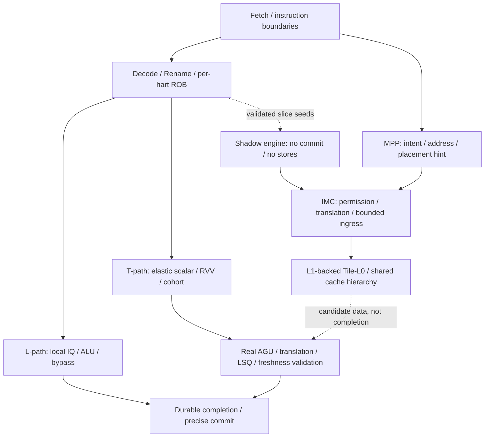

# 弹性／聚合乱序执行织构：架构审查与修订契约

> 状态：规划与研究审查，不是已实现处理器。检索日期：2026-09-29。本文不宣称已有 RTL、仿真通过、可综合结果、FPGA 适配、时序收敛或性能收益。原始报告保持原样；本文纠正、分期和补足其语义，不以替换原文的方式隐藏问题。

## 1. 结论、证据等级与完整目标

建议保留研究目标：**在标准 RISC-V 每 hart 精确体系结构状态之下，以固定物理拓扑承载可弹性排队、可动态选路、可租借和可聚合的执行资源；随后扩展到 RVV、多 hart、透明 cohort、层次化宽织构及真正 core fusion。** 不建议把“统一”实现成巨型 IQ、全局多端口 PRF、无界 crossbar 或一个覆盖所有 hart 的提交序列。

本文标签有严格含义：

- **[ISA]**：来自锁定版本的规范；只有适用的扩展／执行环境被启用时才构成约束。
- **[上游实现]**：已读取的 BOOM／XiangShan 文档描述，不等于本项目已有实现，也不等于所有版本一致。
- **[研究证据]**：已有研究展示的组织方式、模型或实验；不能迁移其数值作为本项目结果。
- **[提案]**：本项目推荐的实现契约，必须经过实现和验证才成立。
- **[假设]**：可证伪的成本／收益、初始参数与调度策略。
- **[纠正]**：报告表述错误、过强或遗漏必要条件；**[未核实]** 表示尚无可追溯证据，不等于已证明错误。

规范基准采用官方 **ISA v20260120**；RVWMO 2.0、V 1.0、A 2.1、F/D 2.2 和特权 M/S 1.13 分章读取，不能仅以文档总日期推断所有章节都发生过语义更新（AR-001～AR-010）。该版本 RVWMO 正文仍明确其形式化范围未完整覆盖 I/O、取指、页表遍历、FENCE.I、SFENCE.VMA 与向量；因此“通过标量 RVWMO litmus”不能替代这些领域的专项验证（AR-002、AR-004）。

### 1.1 推荐基线与必须保留的后续范围

仓库只有报告，语言不是从现存代码推导的。**[提案]** 采用可综合、厂商无关的 SystemVerilog 核心／testbench 与 C++ Verilator harness；XiangShan 用作设计、协议与差分验证方法参考，不把其 Chisel 代码混称为本项目源代码，也不把其整个核心当唯一 ISA oracle。

| 层次 | 首次可执行基线 | 后续必须覆盖的研究目标 |
| --- | --- | --- |
| ISA／特权 | RV64IM_Zicsr_Zifencei，M-mode；完整定义 reset、trap、CSR 与内存执行环境 | A、C、S/U、Sv39、F/D、完整 V 分别通过验收后发布能力；不是永久删除 |
| 控制平面 | 一个 hart 的 centralized rename、architectural ROB、恢复与提交 | 每 hart 独立控制域；先 remote execution borrowing，后 segmented/distributed ROB 与 core fusion |
| 执行平面 | 两个固定 cluster；动态 uOP 选路；保守真实唤醒；有界完成队列 | 动态 RF ports、局部 bypass、层次 completion、宽／异构 FU、vector lanes、可调 leasing |
| 内存 | 单 LSU、严格可解释的顺序执行参考路径；普通 RAM 与 MMIO 属性明确 | 推测 LSQ、blocking→nonblocking cache、共享／分层一致性、LLB、RVV 与跨 hart coalescing |
| 并行语义 | 标量 OoO／ILP | SMT／多 hart、RVV、透明 cohort／micro-SIMT、显式 GPU-style SIMT 的独立分支 |
| 平台 | Verilator 程序执行证据优先 | GW5A、Xilinx Zynq、Virtex UltraScale+ 实板各有证据，随后 ASIC 转换；小器件配置不冒充最终宽配置 |

### 1.2 商业基线：RVA23 与安全包
**[ISA]** MosaicRV 的最终应用处理器目标是 **RVA23S64**，不再停在 RV64IM 教学基线。首阶段 bring-up 仍从受控子集开始，但那是中间实现步骤，不是商业 profile。RVA23U64 强制 RV64I、little-endian、M/A/F/D/C/B/Zicsr/Zicntr/Zihpm、cacheability/atomic/misaligned PMA、64-byte cache block、CMO、half-precision FP、Zkt，以及新增 V、Zvfhmin、Zvbb、Zvkt、Zihintntl、Zicond、Zimop/Zcmop、Zcb、Zfa、Zawrs、Supm；RVA23S64 另强制 Zifencei、Ss1p13、Sv39/Svade/Ssccptr/Sstvecd/Sstvala/Sscounterenw/Svpbmt/Svinval/Svnapot/Sstc/Sscofpmf/Ssnpm/Ssu64xl/Sha。最终 gate 必须逐项核对，不允许把 p0/p1/p2 当 RVA23 完成（AR-022、AR-023）。

**[提案]** 商业发布分为三层：

1. **RVA23 Core**：完整 RVA23S64 hart 能力、VLEN≥128、标准 Linux/虚拟化支持。
2. **RVA23 Secure**：RVA23 Core + Zvkng（localized）、Zicfilp/Zicfiss（expansion）、Sv48/Svadu/Zkr/Sdtrig/Ssstrict/Ssaia 中选定项；每一项通过能力广告和测试后才宣称。
3. **MosaicRV Safety**：RVA23 Secure 子集或独立配置 + 可选 lockstep、ECC/parity、隔离 SoC、fault controller。它不与 RVA23 profile 名称混淆，也不由 lockstep 自动得到 ASIL/SIL。

**[纠正]** RVA23 不把 vector crypto、CFI、Sv48、Sv57、Zkr 全部变成无条件强制。Zvkng/Zvksg 是 localized options，Zicfilp/Zicfiss 是 expansion options；pointer masking 是 profile 强制能力，但其硬件控制在更高 privilege 的 Smnpm/Ss npm/Smmpm 族，Supm/Ssnpm/Sspm 是执行环境层面的能力名称。Zicfiss 依赖 Zicsr/Zimop/Zaamo，U-mode 使用还要求 S-mode，M-mode当前不支持；Shadow Stack page 的 PTE 编码、CBO 禁止、idempotency、PMP/read-write规则都要进入 memory plan（AR-024、AR-025）。Vector crypto 指令要求 data-independent timing；VLEN≥128 是 application-processor 下限，SHA-512/SM3 在 VLEN=128 时依赖 LMUL 组合（AR-026）。

非传统 backend 不改变这些软件可见合同：动态 route、cohort、LLB、coalescer、lockstep 都不能绕过 pointer masking、CFI、RVV、atomic、cache/TLB、PMA/PMP、Sv39/Sv48 或 virtualization。一个 SEE 中迁移的 harts 必须保持同一 XLEN/VLEN/cache block/endianness/extension 和实现相关选择，除非迁移不受影响的证据已证明；这点直接约束 MosaicRV 的 cohort/pod 迁移（AR-027）。

共同初始参数是**设计假设而非容量承诺**：1 hart、2 clusters、2-wide rename/dispatch、64 个 architectural ROB slots、96 个整数物理寄存器、4 个 PRF banks、每 cluster 8 项 IQ、1 个 MUL/DIV、1 个 LSU、每 cluster 2 项 local result buffer。ROB／PRF／队列允许更小的硬件 profile，但要满足寄存器初始映射、最大原子分配组和前向进展的最低要求。物理 read/write ports、RAM latency、互连 pipeline cuts 必须由后续综合与板卡资源实测确定；不能从“4 banks”推出“4 reads + 4 writes/cycle”，不能从“2 项结果队列”推出任意数量不可停顿 FU 都安全。

将阶段性功能子集称为“内部 bring-up”，不能将未完成 M 扩展的乘法子集称为 RV64IM，不能将向量整数子集称为完整 V，不能将仅 M-mode 的核称为 Linux-capable。基础执行环境采用 little-endian；自然对齐普通访问在声明范围内保证原子性，未对齐数据访问起步采用规范允许的同步 trap 策略，后续如实现拆分访问必须重新定义故障、原子性和 MMIO 边界。

### 1.3 核心假设如何被证伪

**[假设]** 资源解耦减少闲置和昂贵端口，收益可能被路由延迟、bank conflict、调度器关键路径、状态量与 drain 开销抵消。必须有相同 ISA、内存系统、FU 数、PRF 容量和 workload 的固定路由对照；单独加 FU、加 cache、降低时钟后的 IPC 增长不能归因于 fabric。若关键程序 wall time、面积／吞吐或公平性没有改善，应记录负面结果并停止该策略进入默认配置，不删除相应研究议题，更不能伪造“自然可扩展”的结论。

## 2. 固定硬件与动态逻辑边界

**[纠正]** 运行时调度不能增加 pipeline registers、制造新 ALU、改变综合后的任意连线。运行时变化的是静态合法能力集合中的目的地、路由、队列占用、端口时隙、quota 和 lease。所谓 variable-depth 应改称 **variable effective latency**：local bypass、local PRF、remote operand 与 miss/replay 路径拥有不同的已实现延迟；每条路径仍满足该 build 的时钟约束。

建议把架构分为三个平面：

1. **Hart control plane**：每 hart 的 PC、特权／CSR、rename maps、ROB、checkpoint／恢复、LSQ order、trap 与 retire。拥有体系结构效果授权权。
2. **Execution data plane**：cluster-local IQ、operand collector、PRF bank access、FU、result buffer、路由。只能执行带有效身份和授权的工作，不能自行退休。
3. **Resource management plane**：维护 capability、quota、lease 和路由配置。可以限制新工作，但不能撤销已获授权的不可逆 memory side effect，也不能阻断旧租约结果回家。

同一 hart 的 architectural retirement 是总序；不同 hart 不需要全局指令退休总序。RVWMO 的 **global memory order** 是约束合法执行的抽象内存序，不是要求实现一个“所有 hart 所有指令的 global ROB”。物理 ROB 可共享 RAM 或分 bank，但每条记录必须有唯一 hart owner 和对应的每 hart 顺序头（AR-002、AR-012）。

在 pod 内研究细粒度 borrowing，在 pod 间先使用粗粒度 task／vector descriptor／memory 传输。跨 pod 任意逐 uOP 路由、超宽 decode/issue、分布式 frontend、远程 LSQ 是后续实验项而非永久禁令；分别证明传输开销和恢复协议后才允许扩大范围。TRIPS 的多网络和分布式控制是研究先例，但其 EDGE 的编译器形成 block、block-atomic commit、显式 consumer encoding 与标准 RISC-V 不同，不能直接移植其 correctness 结论（AR-017）。

## 3. 身份、生命周期与接口所有权

### 3.1 三层身份必须解耦

- **Architectural instruction／macro identity**：每 hart 一条动态 RISC-V 指令。即使其产生多个 uOP、多个 memory beats 或多个 RVV element groups，也只有一个指令 PC／trap origin／正常退休事件。
- **Logical uOP identity**：macro 内一个已声明的计算或副作用子工作。store address 与 store data 可分别就绪，但属于同一个 architectural store 与 SQ identity。
- **Attempt／transaction identity**：同一 logical uOP replay 时的具体执行尝试，以及 memory request／operand transfer／completion 的具体事务。不能用“uOP 不变”忽略旧 attempt 的延迟回包。

**[提案]** `MacroTag={hart_id, rob_slot, rob_generation}`；独立的 `seq` 表示每 hart 年龄；`UopTag={MacroTag,uop_index}`；`AttemptTag={UopTag,attempt_generation}`。物理寄存器使用 `PhysTag={class,bank,row,allocation_generation}`。`spec_epoch`、`lease_generation`、`translation_generation` 各自只解决其所属域的问题，不是可互换的一个万能 epoch。

`FirstUop/LastUop` 只能帮助 expansion 边界，**不能单靠收到 LastUop completion 判断整条指令完成**。ROB／descriptor 保存 `expansion_closed`、已登记的 uOP 集合／计数、逐项 terminal 状态和最早异常。macro 只有在 expansion 关闭且所有必要工作得到成功结果或该 macro 已进入明确 trap／kill 路径后才能终结。错误路径取消不是成功退休；replay 不是 architectural exception。

### 3.2 wrap、ABA 与晚到消息

固定宽度 tag 必然环绕，“64-bit 基本不会 wrap”不是正确性证明。每类重用应选择并记录一种可证明策略：

- 同一 slot／PRF row／transaction ID 仅在旧代工作、网络缓冲、FU、memory response 和取消确认都不再可能引用时重用；或保持 tombstone／generation 验证直到旧响应清空。
- 若用有限 generation，重用间隔必须由 **仍可能存在的旧身份数与最长存活条件** 证明，而非仅由 ROB 容量证明。无上界外部响应不能靠有限 generation 自然解决；应在回绕前 quiesce，或将未决事务 token 隔离到完成为止。
- 每 hart `seq` 的模数年龄比较需要保证任何两个同时可比较的 live sequence 跨度小于半模数。该证明覆盖网络／LSQ／descriptor 中 retained entries，不只覆盖 ROB；否则使用 slot+generation 与显式窗口次序。
- `attempt_generation` 防止 load replay 后旧值被认作新值；PRF generation 防止 kill 后迟到 WB 写坏重分配的 row；lease generation 防止新 owner 接受旧租约信用。
- 分支只清除其年轻工作。简单地把 hart 全局 epoch 加一、拒绝一切旧 epoch，会错误丢弃更老的 load／DIV。起步可选择完整 drain/flush 到提交边界的保守恢复，或使用年龄边界＋generation；不能混用“全旧代无效”和“老指令继续执行”。

在验证中刻意使用很小的 tag width、频繁 flush／replay、长延迟回包形成 ABA 场景，必须覆盖 wrap 前一项、跨 wrap 的年龄比较、取消与成功同周期、reset 后旧响应。这里提出的是未来验收场景，不是已运行结果。

### 3.3 推荐协议字段与写权限

下表是未来接口契约，不是现成 RTL 类型。静态配置中未使用的字段可裁剪，不能让所有标量数据包携带最大 RVV／SIMT payload。调试用 instruction bits／PC 可存 ROB，通过 tag 查取，不能为了“自描述”无限复制宽字段。

| 接口／记录 | 必要字段或引用 | 唯一所有者与改变权限 | 接受／完成条件 |
| --- | --- | --- | --- |
| Decode→Rename | PC、instruction bits/length、ISA class、arch src/dst、illegal cause、expansion descriptor | decoder 产生；rename 不篡改 ISA 含义 | 同一指令的资源组原子分配，否则不前进 |
| Rename→Dispatch | MacroTag/UopTag、seq、PhysTag sources/dests、old mapping、capability、recovery boundary | rename 分配；dispatcher 只选择合法位置 | `valid && ready` 才转移所有权 |
| IQ→Operand collector | AttemptTag、source generations、required operand mask、chosen FU、result credit token | IQ 保留可重试副本直到 launch 确认 | 必需操作数和实际下游 credit 均满足 |
| FU request/result | AttemptTag、opcode class、operands／result、destination、exception/flags、lease generation | FU 只生成结果，不释放 PRF、不提交 store | 不可停顿 FU launch 前已有容纳最终结果的真实槽位 |
| Completion record | packet identity、destination fragment、data、status、`prf_ack/wakeup_ack/rob_ack` | completion owner 管理扇出子事务 | 全部必要 ack 或确认 kill 后才释放记录 |
| ROB record | macro PC、seq、expansion_closed、expected/done bitmap、dest map changes、exception metadata | 每 hart commit controller | 本 hart 最老、结果 durable、无未决重放／异常优先级冲突 |
| Memory request | AttemptTag、LQ/SQ tag、VA/PA 与翻译代、byte mask、size、PMA/PMP/permission、aq/rl、ordering class | LSQ 发起；cache 只返回内存事务状态 | 每个 request acceptance 唯一，fault/response 可追溯 |
| Vector descriptor | MacroTag、vl/vtype/vstart 入值、SEW/LMUL/EEW/EMUL、mask source version、src/dst group、progress、fault element/field、flags | vector controller；trap commit 由 hart control 授权 | 元素完成集合与 restart prefix 分开 |
| Cohort template | template ID/generation、instruction/control key、成员表引用 | cohort manager 只管理 template 生命周期 | 各成员拥有独立 MacroTag/AttemptTag/异常结果 |
| Lease record | resource set、owner domain、generation、state、new-admission quota、outstanding counter | resource manager | drain／旧消息回收确认后才能转交 |
| Retire/trap trace | hart、宏序号、PC/instruction、正常／trap、arch writes、CSR deltas、memory effect ID、RVV progress | commit／trap 边界导出 | 不把物理 issue、FU done 或 WB 冒充退休 |

payload 在 `valid && !ready` 时保持稳定；ready/valid 只表示一级 transport ownership，不自动表示 ISA completion。flush 与 handshake 同周期的优先级必须统一：接收端可以接受后标记 killed，也可以拒绝，但发送端不能既收到接受又把同一信用当未使用再次发放。

## 4. Rename、ROB、恢复与精确状态

### 4.1 保守可解释的起点

**[提案]** 整数采用 explicit PRF、speculative map 与 committed map，先不做 move elimination、多 architectural instructions 的 macro-fusion、ROB compression 或跨 hart physical mapping 共享。x0 不分配写目的地，读恒为零。相同周期 rename 的指令按程序序旁路 RAT 更新，覆盖 RAW、WAW 和 `rd==rs1`；free list／ROB／IQ／LSQ 分配作为同一握手事务，任何资源不足都不能留下半条映射。

每次 rename 记录新旧映射。正常提交更新 committed map，释放被本次提交覆盖的 old physical mapping，而不是释放当前结果。BOOM 文档明确其 stale destination 释放与分支 allocation list 机制；**仅恢复一张 free-list snapshot 会漏掉 snapshot 后先释放再分配的寄存器，造成泄漏**（AR-011）。首版宜采用逆序 ROB rollback／分配日志，逐项撤销年轻分配；优化为 checkpoint 时必须保留等价的 allocation delta 账本。

“每个物理寄存器只有一个 owner”应理解为唯一分配／写入身份，不是只能有一个 reader。若后续 move elimination 让多个 architectural mappings 别名同一 PRF entry，必须加入引用／别名恢复规则，不能沿用不支持别名的释放不变量。源 operand transport／replay 队列的持有也要在释放证明中覆盖；未消费的有效读请求不能读到下一代寄存器内容。

### 4.2 完成、退休、内存可见是不同事件

建议明确 `executed → result_durable → macro_complete → retired` 四种状态。store 的 `address/data ready` 不等于对外写入，store 的退休授权也不等于已进入 global memory order；已授权的 committed store buffer 仍可能稍后 drain。基线为简化异常处理，可让普通 store 在 ROB head 完成权限检查并完成可靠 memory acceptance 后才退休；后续将退休和 drain 分离时，要说明 bus error／异步错误模型，不能在已向外写入之后再假装把它回滚。

标量异常在本 hart 最老异常指令到达可处理边界时可见；年轻指令不能改变寄存器、CSR 或非幂等 I/O。多异常／redirect 竞争先按 architectural age 仲裁，再在同一指令内按规范异常优先级；不能固定认为 branch recovery 永远高于更老 page fault。CSR 起步串行执行，处理 CSR read/write suppression、WARL/WPRI 与隐式更新覆盖，不将读到零的普通寄存器和 `rs1=x0` 编码等同（AR-009）。

interrupt 只在合法 architectural 边界进入，pending bit 可以在等待期间保留；中断目的 hart 不因资源租借而改变。MRET、特权状态、trap vector、异常返回 PC 由 control plane 管理。debug/single-step 如加入必须绑定宏指令而非 uOP 数。计数器／时间／设备输入是差分验证中的显式环境事件，不能靠任意 skip 让结果“匹配”。

### 4.3 恢复闭环

一次恢复必须同时覆盖：前端预测／fetch buffers、RAT、free list、ROB、IQ、operand collectors、FU、result queues、completion fanout、LQ/SQ、memory transactions、vector descriptors、cohort membership、lease outstanding 账本。可取消结构立即失效；不能取消的 FU／总线事务继续接收终结消息，但其 payload 只能进入丢弃／清账路径。

恢复的完成条件不应是“广播 flush 已发出”，而是需要重用的所有身份／资源已经可安全回收。年轻 store／AMO／MMIO 在没有不可逆授权前禁止出站。普通 cache miss 的错误路径 refill 可作为微架构副作用存在，但不得变成退休值或权限绕过；若涉及安全隔离，另行评估共享状态泄漏，功能正确不等于抗侧信道。

## 5. Leasing、信用、死锁、公平性与重配置

### 5.1 时间尺度与资源真实性

每周期进行 FU／bank／route 仲裁；较慢地改变 quota／cluster lease；只有 quiescent 边界才进行 lane 归属、pod 模式和 core fusion。原报告的 100／1000 cycles 只是例子，不是控制稳定性依据。`quota` 是准入政策，`credit` 是实际可用空间，`lease` 是所有权；三者不能共用一个计数器。

起步采用组合的**一次性准入判定**：operand staging 可用、FU 可接受、输入 transport 可接受、不可停顿结果有预留槽，则 launch；未 launch 的候选不能无期限占着 WB／PRF 端口等待另一个资源。长延迟 load／DIV 预留终结容量，不预订“第 N 周期一定写回”。固定延迟的精确 WB calendar 可作为优化，但只在 latency、stall 与 replay 条件全部受控时有效；仍需证明任何冲突都有保留数据的路径。

对于容量 C 的具体 queue，定义互斥状态：`free + reserved_not_arrived + occupied = C`。本地显示 credit 与链路中返还 token 应纳入同一全局账本，不能相加后重复算 free。每一 credit 的分配、接收、释放、取消恰好一次。reset／flush 不允许简单重置成满额，除非所有旧 token 和消息已同步清空。

### 5.2 等待图，而不是“有 credit 就不会死锁”

至少记录这些依赖：IQ→operand buffer→FU→result queue→PRF write→wakeup／ROB completion；LSQ→MSHR→memory response→load result；reconfiguration→drain→completion；coherence request→invalidation ack→response。仅增加 FIFO 深度不能消除循环等待。

**[提案]** 初期使用固定无环数据路由／单跳两 cluster 路径、独立或有保留容量的 completion／cancel／credit-return 控制通道，保证清理消息不需要申请被其等待者耗尽的 IQ／新租约 credit。完成和取消路径不依赖新 dispatch。收回 lease 只能禁止新准入，不能禁止旧结果回 home 或旧请求接收 response。MSHR 释放不能依赖一个永远被新 load 抢占的 result slot。

多跳阶段需要独立 channel-dependency graph 与 protocol-dependency graph；dimension-order routing 只解决部分网络循环，不自动解决协议级死锁。可用 virtual channel／escape network，但必须证明其保留 credit 真正不被普通流量占用。多播先用有界复制队列和每 destination ack，慢 consumer 不阻塞已完成成员的 retirement；不能在持有所有已获 credit 时无限等待最后一个 recipient。

### 5.3 前向进展与调度公平

`oldest-ready` 只在一个可比较年龄域中有意义。跨 hart 不直接比较可独立回绕的 `seq`。起步建议 hart 间 round-robin／有界权重服务，hart 内 oldest-ready，locality 只在不破坏年龄进展时作 tie-break。critical load 优先级必须有 aging 和服务下限，不能让 vector／低优先级 hart 永远饥饿。

liveness 声明必须带环境假设：memory eventually responds、外部 backpressure eventually releases、没有无限到来的更高优先级 reset／trap。安全性质无条件维持；性能 watchdog 超时仅是诊断证据，不是形式化 deadlock freedom。A 扩展的 constrained LR/SC 保证是规定条件下的系统进展／livelock freedom，不等于每个 hart 有限周期内必胜；共享 cache eviction 或租约抖动也不能无限破坏该保证（AR-003）。

### 5.4 重配置协议

lease 状态建议为 `ACTIVE → FREEZE_ADMISSION → DRAIN → REVOKED → INSTALL → ACTIVE`。FREEZE 后已发工作必须保留资源或明确被取消；DRAIN 等待 IQ、operand、FU、result、memory、multicast、PRF reference 与控制消息 outstanding 归零；REVOKED 时旧 owner 已没有借出资源引用；INSTALL 更新路由／quota／generation 后才允许新 owner 准入。

若 drain 遇到外部无响应，允许控制器报告停滞并维持旧映射，不能超时强制复用活资源。更高级的 live migration 是独立实验：复制状态、原子切换目录、转发旧消息、确认旧源无引用，再释放；不能用“更新 ClusterMask”冒充迁移。改变执行 lane 数不允许改变 hart 的 VLEN/ELEN。FPGA runtime partial reconfiguration、DVFS、power gating 不是首版要求；如研究，必须在上述 quiescence 之外新增 isolation、reset、clock/power-domain 和状态保持证明。

## 6. Banked PRF、Completion 与 Wakeup 的正确性

### 6.1 PRF 的 bank 不是多端口魔法

每个物理 tag 唯一决定 home bank／row／class；路由不改变 tag 含义。初期 destination allocation 使用确定、可解释的 bank 分配，保留 bank-aware allocation 为 A/B 实验。bank 缺空位时可停 rename 或选择其他合法 bank，但不能让 affinity 导致有空闲寄存器却永久拒绝进展。

operand collector 应显式跟踪每个 source 是否已取得，处理双 source 同 bank、三个 FP operands、同一 PhysTag 被两个端口读取、同步 RAM 读延迟、WB 与 read 同址、flush 中间状态。read-during-write 采用工程指定的旁路／仲裁语义，不能依赖某厂商 BRAM 的默认模式。跨 cluster 执行先远程读固定 home PRF；“执行位置迁移”和“寄存器内容迁移”分离。后续复制／operand cache 要有 generation、引用寿命与 invalidation，不靠裸 row 编号匹配。

### 6.2 结果扇出不应产生半完成

**[提案]** 初期 completion record 仅在数据写入可靠 PRF 或有保证可读的等价 result storage 后发真实 wakeup；ROB done 也不早于所需数据 durable 与异常信息已接受。异常 completion 不发可消费的正常值。无目的寄存器的 branch/store 仍有完成和控制事件，不应为了统一格式制造假 PRF write。

逐个消费者 ack 可分周期：PRF 已写但 ROB 背压时保留 completion record；ROB ack 后 wakeup 尚未送达时仍不能丢掉唯一唤醒通知。重新投递必须有 `already_acked` bitmap，不能给一个 uOP 的 done count 加两次。若采用 level-sensitive ready table／重查机制，必须证明错过 wakeup 的 IQ 最终能观察 ready，不能仅靠一次脉冲。

推荐先禁 speculative wakeup、value prediction 与无法撤销的早期旁路。后续 speculative wakeup 需 producer/attempt tag、dependent poison／replay、不可逆副作用禁止与 replay storm 进展机制。预测 wakeup 成功率不等于正确性；错误预测必须能重建所有 dependent 状态。

XiangShan V2R2 的 WbDataPath 文档明确：variable-latency 单元能等待仲裁，fixed-latency 单元若仲裁失败则结果永久丢失，且仅成功握手的 FU 能写 ROB。其安全性依赖上游既有避冲突契约，不能抽取单个仲裁器后推断系统具有任意 backpressure 能力（AR-015）。本项目起步要求每个不可停顿 launch 预留实际结果容纳位置；固定优先级仲裁也不能不经公平性分析就搬用。

### 6.3 守恒应按同一层级计数

原报告 `accepted_completion = committed_or_flushed_completion + buffered` 混合了 macro retirement、uOP completion 与网络 packet，尤其在 replay／multicast／vector 时并不直接成立。

修订为每种身份独立的守恒：`accepted_unique_attempts = terminal_success + terminal_kill + terminal_replay + live_attempts`，终结状态互斥；replay 产生新 attempt，不复用旧成功记录。网络 packet 在边界内计 `accepted_packets = delivered_packets + discarded_with_reason + resident_packets`；multicast 在一次逻辑分叉处产生带 parent 的子 packet，并另有 child accounting。macro retirement 计数、memory side-effect 计数、PRF write 计数另列，不能借一个宽松总计掩盖重复 store。

## 7. Memory Fabric、RVWMO、Coherence 与 LLB

### 7.1 首先固定内存执行环境

[ISA] RVWMO 合法性由 preserved program order、load-value、atomicity、progress 等约束组成，而非“所有 hart 的退休顺序看起来对了”。建议初期普通内存按保守顺序发出并完成，作为后续 OoO LSU 的 executable reference；强于 RVWMO 的合法子集可作为 correctness 起点，但不得宣传已实现全部弱序性能优化（AR-002）。

每个地址范围必须明确 RAM/MMIO、cacheability、idempotence、允许访问宽度、对齐、atomic 能力与错误响应。M-mode 的物理权限／PMA 不能因没有 MMU而被忽略。cache、LLB、coalescer、prefetch、speculation 都不能绕过属性检查。外部 AXI 等事务 ID 是 transport ID，不自动代替 MacroTag／LSQ tag；response reordering 需要单独映射与生命周期。

### 7.2 LSQ 顺序域与共享执行资源

每 hart 保留逻辑 LQ/SQ 顺序域，物理存储可以 partitioned/shared；AGU/TLB/cache ports 可共享，但不共享成一个失去 hart 年龄的 FIFO。后续 memory disambiguation 必须覆盖：

- 更老 store 地址未知时阻塞，或推测并保留 violation 检测；store 地址确定后检查已执行 younger loads，找到需要 replay 的最老边界。
- store-to-load forwarding 按每字节选择**本 hart 最年轻的更老 store**，覆盖部分重叠、不同宽度、跨 beat／cache-line、地址 ready 但 data 不 ready；不能跨 hart 转发未提交 store。
- load replay 必须使旧 attempt 无法更新 PRF／ROB；若 dependent 已执行，恢复其值与副作用授权，不能只重发 load 自己。
- load-load 次序、同地址 coherence 观察、fence、aq/rl、异常与 TLB miss 都是 ordering／replay 因子；cache hit 不自动等于可退休。
- store address/data 分开调度，但权限和完整 byte mask 归同一 SQ entry，不能把两半各提交一次。

MMIO／非幂等 load 起步只在 ROB head、先前相关访问完成、无更老异常后发出一次；传输重试不能重复设备读副作用。store、AMO 及外设命令必须经过不可逆授权，不允许 wrong-path 先发再靠丢弃 response“恢复”。

### 7.3 Fence、翻译与原子操作

FENCE.I 是本 hart 的取指／显式 memory 同步；不是多 hart 自动 I-cache coherence。它必须连同 predecode／decoded-template cache／cohort template 的失效一起定义，跨 hart 程序修改需要额外协调（AR-010）。SFENCE.VMA 控制本 hart 的地址翻译同步，写 `satp` 本身不保证刷新 TLB；正在执行的 PTW 不能在 fence 后填入应已失效的旧翻译。ASID 是 hart-local，相同 ASID 数值不意味着跨 hart 地址空间相同（AR-006）。

A 阶段将 AMO 的 read-modify-write 放在明确的 cache／共享内存 serialization point；不能拆成可被别人插入的普通 load+store。LR/SC reservation 属于 hart，与 lane／cluster lease 无关；外部写入、失败 SC、context switch 协议及共享 cache eviction 对 reservation 的影响要显式定义。`aq/rl` 对 memory 与 I/O 域的作用按规范，不能当万能全系统 fence（AR-003）。

### 7.4 Coherence 不等于 consistency，scratchpad 不等于 cache

共享 banked L1 可以提供一个较简单的 coherent observation point；多个 private caches 则需明确协议。无论哪种组织，都仍需 LSQ／fence／atomic 约束。所有可写入内存的主体，包括 DMA／PS／其他核和调试加载器，要么进入 coherent domain，要么有明确的软件 cache maintenance 和所有权交接；“板上只有一个 RISC-V hart”不意味着不存在其他写者。

MemPool／TeraPool 类 shared scratchpad 思想可作为 locality/network 参考，但 scratchpad 的软件管理语义不能被改名成透明 coherent L1。本文未重新核实原报告对应规模、带宽和延迟，不能把它们用于本项目 sizing。每 lane 独立 coherent L1 保留为代价对照，而不是默认实现；否定的是未经证据就把它当低成本路径。

### 7.5 LLB：纠正“非 coherent clean copy 就安全”

**[纠正]** clean 只意味着没有本地 dirty data，不意味着内容仍新鲜。LLB 可以不拥有独立 MESI 状态机，但它只要为 architectural load 提供数据，就必须参与整体一致性证明。

推荐分三种明确模式，禁止混称：

1. **同一次 load 的 return／operand buffer**：仅重用同一事务返回值，不为后续新的 load 命中；只需身份／lifetime 正确。这不是可减少后续内存访问的通用 cache。
2. **可供新 load 使用的 L0/LLB**：由共享 L1 负责 invalidation／版本授权。每条记录包含 PA line、有效字节、数据版本／generation、权限／属性关联与 owner domain；本 hart store、其他 hart store、AMO、DMA、L1 eviction、ownership change、翻译／权限变化及 lane reassignment 都有规则。
3. **明确软件管理的只读 epoch／scratchpad**：仅当平台保证 epoch 内没有写者，或软件执行 ownership handoff 和 flush，才能省去透明 coherence。软件约束必须公开，不能宣传一般透明内存。

初期关闭模式 2；首次启用建议保守地把 LLB 作为 L1 子副本：授予写权限／确认失效前，先阻止相关 LLB 新命中并完成 invalidation ack。invalidation 与 load-hit 同周期必须在共享序列化点决定先后；过期 data 已被 speculative consumer 使用时，通过 LQ violation/replay 阻止错误退休。用 version validation 代替广播也可研究，但 validate 到 retire 的窗口必须受保护或可被再次 invalidated；版本位本身也有 wrap/ABA，不能每过若干周期直接清零。

可绕过／预测 LLB 只是性能政策；预测错误走合法 fallback，绝不跳过权限、ordering 或 coherence 检查。pre-fetch 到 LLB 的数据与 demand load 数据使用同一 freshness 约束。将 forwarded uncommitted store data 放入 LLB 必须保留 producer age／hart 和 kill 信息，不能把它当所有 hart 可读的 clean copy。

### 7.6 Coalescing 保留每个 architectural memory operation

将多个访问合并成一次 line fill 是 transport 优化，不是把多条 architectural load/store 合并成一个内存事件。coalescer 保存每个成员的 hart、MacroTag/AttemptTag、地址／byte mask、权限检查、ordering class、fault、返回 lane 和取消状态。相同 VA／PC 不是合并条件；先按各 hart 的 translation domain 验证，再对兼容 PA／属性请求共享数据搬运。

初期只合并幂等、cacheable、已验证权限的普通 load；禁止把 MMIO、AMO、LR/SC、不同安全属性或要求不同顺序的访问混作一个事务。所有 scalar load 的原子性和 load-value 检查仍独立成立。合并 store、重叠 vector scatter、跨 hart stores 属于后续门槛，必须定义 per-byte 冲突和 serialization，不能凭“同一 cache line”合成一个语义不明的写。

## 8. RVV 与浮点：宏指令完成不等于全有全无

### 8.1 VLEN 与 lane width 分开

[ISA] VLEN/ELEN 是 hart 的实现常量；借用 2／4／8 条执行 lane 只能改变每周期吞吐，不能改变 `vlenb` 或 architectural register capacity。活跃 vector state 不能任意迁移到 VLEN／ELEN 不同的 hart（AR-004）。初期选择一种固定 VLEN/ELEN profile，后续 parameter sweep 是不同 build／hart profile，不是每个 lease epoch 改 ISA。

保留一条 vector architectural instruction 对应一个 ROB macro record 和一个有界 descriptor；不要为每元素分配 architectural ROB entry，也不能只有 `done/error` 两位而丢掉 restart 状态。descriptor 保存配置快照、mask 版本、source group lifetime、old destination、element/segment progress、最早故障和 partial flags。streaming element packets 不要求一次展开整个 VL；创建 packet 前取得实际 credit，避免 descriptor 消耗无限队列。

### 8.2 可执行的保守向量起点

**[提案]** 第一个向量阶段在 ROB head 授权一个 vector descriptor，暂停本 hart 年轻指令退休；依 element／segment 顺序推进并记录连续已提交前缀。允许 scalar 前端／执行的程度另行定义，但年轻指令不得发布 architectural 效果。起步 VRF 可不 rename，或使用明确的 old/new merge；不能把未证明的 speculative vector PRF release 搬进最小原型。

随后按独立门槛加入多 descriptor、lane parallelism、chaining、vector rename、distributed VRF 和短向量 packet supply。每次放开乱序都要维护 source lifetime、mask/tail merge 与 fault prefix，而不是以一个 done counter 覆盖全部状态。Ara／SEAM-V 类组织可作为后续控制实验候选，其数值由参考汇总文档审查，不能成为 correctness 证明。

### 8.3 restart／trap 的精确规则

[ISA] precise vector trap 要求老指令已提交、年轻指令未改 architectural state、`vstart` 前相应元素已提交；在可正确重启的条件下，允许部分 `vstart` 之后元素已更新。idempotent vector store 可以有较后元素已写入，非幂等区域不能任意这样做。`*epc` 指向整条 vector instruction，`vstart` 指向恢复位置；element/segment 必须最终取得进展（AR-004 §17）。因此“任意 wrong-path 不可改 committed state”的标量原则仍成立，但“故障指令任何部分都不能可见”不能泛化到 RVV。

基线选择更保守的 prefix-only 更新，减少重启歧义；不采用当前标准未定义的 imprecise trap 模式。普通 vector 完成按规则清零 `vstart`，illegal instruction 不随意改它。segment 指令的 `vstart` 单位是 segment，mask load/store 等还有特定单位与 effective length；不能全局统一成 byte 或 uOP index。

fault-only-first load：element 0 同步 fault 触发 trap 且不改 `vl`；后续元素 fault 可缩短 `vl` 而不触发该 trap。interrupt／debug 情况不能当作普通后续 element fault 静默截短。对 `vl=0`、`vstart>=vl`、非零 vstart 不允许的 reduction 等分别使用指令族规则；whole-register transfer 的 effective length 与普通 `vl` 不同（AR-004）。

### 8.4 mask、tail、别名与内存顺序

inactive 元素不能访问内存／产生相应异常或 FP flags；prestart 元素保持；undisturbed 要读／保留 old destination。agnostic 不是任意垃圾：常规元素按规范可保持旧值或写全 1，mask destination 有其特殊允许值。参考模型比对可以采用确定的 undisturbed 实现简化，但不能把所有 mask/tail 位一概忽略，必须检查各指令允许集合。

覆盖 SEW/LMUL／fractional LMUL、EEW/EMUL、register-group 对齐、overlap restrictions、widen/narrow、v0 作为 mask 与 data、gather/scatter、slide/permutation、ordered/unordered reduction、unit/strided/indexed/segment/whole-register memory。ISA 允许 reserved encoding 的范围和项目选择的 trap 行为分开记载；合法指令不能因为复杂而长期假装“不支持 V 的可选部分”。

vector memory 在 instruction level 遵循 RVWMO；除 indexed-ordered 类外，元素顺序通常不保证；indexed-ordered 保持规定的元素序，segment 内字段又有自己的无序允许（AR-004 §7/§9）。不能将全部 RVV access 按任意到达顺序发到 MMIO，不能以 line coalescing 破坏 ordered index 的重复地址语义。

### 8.5 F/D 与 vector FP

F/D 精确含义包括舍入模式、subnormal、canonical NaN／payload-preserving moves、NaN boxing、signed zero、infinity、转换溢出和 fused multiply-add。host C++ `float/double` 并非自动满足这些规则；未来 harness 应使用合适的 ISA/FP reference，不能仅比较近似误差。FP exception flags 是 accrued `fflags`，F/D 不因普通 FP exception flag 置位自动产生 trap（AR-007、AR-008）。

`frm`／`fcsr` 的程序序依赖必须保持；起步串行化其写入，FU 使用属于本指令的有效 rounding mode。wrong-path 的 flags 不进入 architectural fflags；正确指令提交的 flags 与 explicit CSR writes 按程序序合并／覆盖。vector FP 只从 active elements 汇总 flags，并与 `FS/VS`、`vxrm/vxsat`、partial trap progress 协调。ordered FP reduction 不可随 lane 分配任意重排；unordered reduction也必须满足该指令规定的合法实现集合，不能使用误差容限掩盖错误的 flags／NaN。

## 9. Hart、Cohort、SMT 与 SIMT 的语义分界

| 术语 | 体系结构状态 | 允许共享 | 不允许偷换 |
| --- | --- | --- | --- |
| ILP／OoO | 单 hart，一个程序序 | 多 FU／cluster 与内部乱序 | 不创造程序中不存在的独立工作 |
| SMT／多 hart | 每 hart 独立 PC、CSR、rename/retire／memory order | backend ports、cache、资源配额 | 不能因共享 FU 而共享寄存器状态或异常 |
| RVV | 单 hart、一条 vector 指令和 vector state | 可变数量 physical lanes | lane 不自动是独立 hart |
| 透明 cohort | 多个标准 hart 的多个指令实例 | fetch/decode template、调度／transport 工作 | 一个模板不是一条跨 hart architectural instruction |
| 显式 GPU SIMT | 需另定 warp/lane、runtime、同步／divergence 模型 | warp 调度与 lane execution | 不能未定义扩展／软件协议就宣称纯标准 hart |

### 9.1 透明 cohort 的推荐契约

首阶段只共享已验证相同 instruction bits／长度／decode semantics 的 template，每个成员独立 rename、ROB、CSR、exception 与 memory state。形成 cohort 的 key 至少包括代码身份／fetch permission、当前 XLEN／ISA enabled state、特权／相关控制状态和 instruction bits；相同 PC 只是候选过滤，甚至相同 ASID 在不同 hart 也不足以证明同一地址空间（AR-006）。共享 fetch 时必须先证明每成员自身取指可访问和数据一致；不能借另一个 hart 的成功取指吞掉自己的 page fault。

一个物理 SIMD 运算可以产生 N 个 architectural results，但有 N 份 MacroTag、source/destination tags、flags／fault 与 branch outcome。成员可独立提交或退出，异常／interrupt／debug／branch divergence 只切分或暂停受影响成员。template 只有在所有引用已释放后才能重用 generation。不能要求所有成员同步退休，否则一个 page-fault hart 可能拖死持锁的其他 hart。

重汇合是可选调度机会，不是强制等待条件。没有其他同 PC 成员时必须独立执行；等待 cohort 的有限门槛、超时退化、aging 和最小服务配额列入 liveness。WFI、CSR、FENCE、AMO、LR/SC、MMIO 先退出 cohort 或分别执行其 per-hart 序列化路径。共享 template 的失效与 FENCE.I／代码修改一致，不能因 decode once 永远执行旧指令。

### 9.2 显式 SIMT 保留为独立研究分支

原报告提出“warp=调度单位、lane=执行单位、一个 warp ROB identity”的结构，对自定义 GPU execution environment 可以研究，但**不适用于声称每 lane 是独立标准 RISC-V hart 的透明模式**。如果要显式 warp 语义，必须定义 lane architectural state、divergence/reconvergence、barrier、exception、memory model、运行时启动与软件 ABI，再独立验收。该分支与透明 cohort 可以共用 FU／lane hardware，却不能共用含糊的退休语义。

## 10. 激进架构的分期保留与 go/no-go 门槛

以下是架构决策门槛，不是已执行任务或实现结果；详细可运行工作分解在 implementation／validation／platform 计划中。

| Gate | 保留的能力 | Go 所需可观察证据 | No-go 与不缩减研究范围的处置 |
| --- | --- | --- | --- |
| AG-01 | 单 hart scalar OoO | 完整目标 ISA 程序 trace、精确异常、rename/free-list/recovery 守恒；无未解释差分 | 保留功能基线，禁止进入动态性能比较 |
| AG-02 | 两 cluster dynamic routing | 同一程序固定／动态路由 architectural trace 等价；bank 冲突、late result、backpressure 不丢失 | 关闭有误策略，不删除 dual-cluster 接口与失败证据 |
| AG-03 | reduced RF ports／hierarchical completion | 每种端口冲突可 stall/replay；post-route 成本与公平控制对照完整 | 若性能／面积得失无优势，不设为默认，但保留论文负结果 |
| AG-04 | 推测 LSU／cache／atomic | forwarding、violation replay、RVWMO／A litmus、MMIO exactly-once、PTW/fence 证据 | 回到顺序参考路径；不能用跳过 reference memory 检查代替修复 |
| AG-05 | 多 hart与 lending | 独立 trap／retire、共享 memory 合法、资源最小服务、cancel/drain 不死锁 | 禁止 live reassignment，继续 static partition 对照 |
| AG-06 | LLB／coalescing | invalidate-hit race、DMA／store freshness、版本回绕、成员 fault/kill 独立正确 | 关闭新 load 的 LLB hit 与未经证明合并，保留 return buffer 和实验方案 |
| AG-07 | 完整 RVV／lane sharing | legal profile 指令族、vstart 重启、mask/tail、FP flags、partial stores、VLEN 固定证明 | 不宣传 V；内部子集仍推进到完整目标 |
| AG-08 | 透明 cohort | 与独立 hart 执行环境等价；不同权限／PC同值代码不同／分歧／异常／interrupt／WFI 不串状态 | 降为 independent issue；不把所有 hart 锁步作为修复 |
| AG-09 | segmented／distributed ROB | 单 hart顺序前沿、segment completion、最老异常、全域恢复与 credit 清账；延迟／重排控制消息下仍正确 | home ROB 继续作为 reference；分布式设计不进入默认 build |
| AG-10 | 真正 core fusion／split | architectural state export/import、PRF map／LSQ／cache／TLB／predictor／CSR／interrupt ownership 全部有交接证据，切换成本计入 | 不把借 ALU 冒称 fusion；保留完整 fusion 研究及失败原因 |
| AG-11 | 宽／多 pod织构 | 可证明路由／协议进展；宽度、距离、频率、area／energy 控制对照；真实 layout／板级结果 | 留在小 pod 或粗粒度跨 pod 模式，不宣传任意线性扩展 |
| AG-12 | 跨 FPGA／ASIC 转换 | 三类实际平台分别执行 architectural signature；RAM/clock/reset/CDC 契约一致；后续 ASIC 标准单元／SRAM／DFT／sign-off 证据 | 区分“功能仿真可移植”与“已物理实现”；缺板／license／PDK 是明确决策门槛，不删平台流 |

### 10.1 Distributed ROB 不能只是拆 RAM

推荐首先将 ROB metadata／completion bits 分段放置，保留一个 per-hart global commit frontier；每 segment 对该 frontier 提供带 generation 的 complete／exception／recovery 状态。global frontier 未确认之前，本地 segment 不能独立更新 architectural map 或放行 store。branch／memory redirect 要能定位所有年轻 segment；snapshot 必须是一个一致的逻辑切面，而不是各 tile 在不同周期拍下互不相容的 map/free-list。

之后再研究完全分布的 commit protocol：在有界延迟或握手确认下，证明没有更老 incomplete／exception 的指令会被绕过。Core Fusion 论文的 pre-commit head 依赖其通信延迟与同步组织；不能把其固定延迟方案直接接到任意可背压 fabric（AR-018）。需要逐个状态转移的 refinement／equivalence 证据，不能以“所有局部单元都看见 head ready”作为原子提交证明。

### 10.2 Core fusion 不是合并多个无关程序的寄存器

真正 fusion 是让某个继续存在的单 hart 指令流利用多个原先独立 core 的 frontend／rename／ROB／LSQ／执行资源；其他 hart 必须有明确定义的停驻／调度与 architectural state 保存。独立应用的 hart 状态不能相加、重命名成一个流。split 时 committed map、仍活跃 PRF 数据、CSR/PC、memory obligations、interrupt target 和 reservations 都有唯一归属；先 quiescent export/import，再研究 live fusion。

Core Fusion 正式论文确有分布式 ROB、remote operand 与 LSQ 机制，但 §3 还依靠 FUSE/SPLIT 请求及 OS-visible eligibility；其 ISA compatibility 不能被误读为已证明任意软件自动、零协议、透明融合。本文采用正式作者公开稿，不使用受限投稿稿作为引用（AR-018）。

## 11. 架构不变量与故障模型索引

这些不变量约束未来 RTL assertions、定向程序、形式验证及 Verilator 观测；不是现有测试通过声明。
### 11.1 可选 Lockstep 安全域

**[提案]** MosaicRV 把 lockstep 定义为可选安全执行配置，不改变任何 ISA 指令结果：一个 logical hart 可由两个独立 redundant control/data replicas 执行同一合法输入流，比较器在不可逆架构效果发布前比较定义过的 observation points。两个副本组成一个“fault-containment pair”；它们不是两个 architectural harts，也不能被 software 当作 SMT 双线程。

#### 安全域边界

1. **replicated**：PC/control flow、fetch/decode metadata、RAT/free-list ownership、ROB entry decision、CSR/trap/interrupt decision、FU result/flags、LSQ address/data、vector descriptor/element result、memory request、commit/exception 与最终 architectural output。
2. **shared but protected**：I$/D$/LLB/L2、external RAM、PLL/clock distribution、power、interconnect controller、debug/test infrastructure。共享部分必须有 ECC/parity/CRC/地址绑定或独立 monitor，否则它就是 lockstep comparator 看不到的单点故障。
3. **not replicated by default**：performance-only counters、debug-only metadata、非关键 PMU、非安全 accelerator path；这些不能参与未检查的 architectural decision。
4. **external observation**：同一份同步后的 interrupt/device/reset 输入在各自合法边界进入两副本；不复制异步输入信号导致 false mismatch。不可比较的合法 implementation 差异不得进入 comparator；本项目两副本默认来自同一 RTL/configuration，不把“真实微架构 OoO 差异”塞进逐拍比较。

#### 时间偏移与公平性

支持 **spatial lockstep**（同 cycle 双副本）与 **delayed lockstep**（shadow 延迟固定 D cycles，输入和 main output 分别延迟到统一比较点）。延迟只是故障检测/共因缓解属性，不改变 architectural order。D 是配置参数；所有 pending main architectural effects 在 shadow 对应证据到达之前不得永久丢弃。公平性合同要求 shadow 获得同等工作资源；不能把 shadow 永久饥饿后报告 lockstep“无错”。

#### 故障模型与动作

DCLS/DMR 只能检测非公共副本差异；它**不提供多数裁决**。单个副本输出错误可被检测，但 comparator 不能自动知道哪一边正确。默认动作是 fail-closed：阻止尚未发布的 MMIO/store/commit，向 fault controller 报告，进入 safe halt/reset 或受控 safe state。TMR 可选作后续研究：三副本加 voter；需要独立故障注入与 voter 证明。

#### 可选模式与禁止组合

- `performance`：不实例化/不启用 replica；常规资源聚合可用。
- `dcls-lockstep`：两个副本形成一个 logical hart；资源租借只能作为一对受控资源组，不让 main/shadow 在不同不可验证的 dynamic route 上自由漂移。
- `tmr-lockstep`（后续研究）：三副本加 voter；需要独立故障注入与 voter 证明。
- 禁止把 `cohort` 的一个成员直接当 shadow：cohort 成员有独立 architectural state，lockstep shadow 没有。若未来允许 runtime split/fuse，必须经过 drain/export/重新配置证明；默认可选组合是 build/profile 级，不是每 uOP 动态切换。

新增不变量：

| Invariant | 内容 | 必须触发的边界／反例 |
| --- | --- | --- |
| AI-19 | lockstep shadow 与 main 在每个声明 observation point 使用同一合法输入/输出语义 | 异步 interrupt/device 输入未同步、main/shadow资源饥饿不同、配置漂移 |
| AI-20 | mismatch 在声明 latency 内阻止未发布 architectural side effect | wrong-path、store/MMIO、CSR write、vector element、interrupt/trap 边界注入 |
| AI-21 | 共享 memory/clock/input/resource 有独立保护或被列为 residual common-mode fault | 仅比较core输出但共享RAM错误同时污染两副本 |
| AI-22 | DCLS/TMR 不能被 synthesis/DFT/动态重配置优化或拆散为无效冗余 | duplicate logic merged、shadow reset/debug状态不同、重配置只更新一边 |

| Invariant | 内容 | 必须触发的边界／反例 |
| --- | --- | --- |
| AI-01 | 每 hart 正常退休为其程序序前缀，trap 不放过年轻效果 | 双宽 commit 第二项 fault、不同 hart 一边阻塞一边继续 |
| AI-02 | 活 Macro/Uop/Attempt/Phys identity 不因 wrap／重用混淆 | tiny tags、replay 后旧 load、DIV 跨 flush、reset 外部旧响应 |
| AI-03 | PRF 分配 owner 唯一，free 与 live mapping 不相交 | 同拍 commit/free/rename、恢复中回收、future move alias |
| AI-04 | 每 macro expansion 有界且闭合，必要 uOP 恰好终结一次 | LastUop 先完成、duplicate completion、部分 expansion stall |
| AI-05 | 没有 durable value 不发真实 ready；无丢失唤醒 | WB/IQ dispatch 同拍、PRF 仲裁失败、ROB 背压 |
| AI-06 | 每个不可停顿 launch 都有 terminal storage／credit | ADD/MUL/load 同时结束、buffer 满、cancel 同拍释放 |
| AI-07 | credit 总量守恒、没有双还／越界／旧租约挪用 | wrap、flush、backpressure、多播子 ack 重复 |
| AI-08 | 恢复的年轻工作不更新正确路径 architectural 状态 | younger store/MMIO 已 ready、更老 fault 与 branch race |
| AI-09 | 资源租约可拒绝新入但必须服务旧 terminal traffic | FREEZE 时满 result queue、memory response 晚到 |
| AI-10 | 在已声明公平／环境条件下可持续前向进展 | vector flood、critical-load flood、各 hart 独立年龄回绕 |
| AI-11 | LSQ 保留每 byte 正确 producer 与 ordering | partial overlap、未知 store address、跨 line load |
| AI-12 | coherence 授权与 LLB 命中有可解释的序列化 | invalidate/hit 同拍、DMA 写、version wrap、lane reassignment |
| AI-13 | MMIO、AMO、store 不因 replay／merge 产生重复效果 | response 丢弃、cohort 退出、late cancel |
| AI-14 | 权限／地址空间与 memory payload 不串 hart | 同 ASID 不同 page tables、同 PC 不同代码、PMP 变化 |
| AI-15 | RVV trap 暴露合法 restart prefix，成员／mask 不越界 | page fault 中段、FOF、segment 部分字段、vl=0 |
| AI-16 | FP flags 与 CSR 程序序、mask 和 kill 一致 | wrong-path NaN、frm 写后 FP、inactive divide-by-zero |
| AI-17 | template 共享不改变 per-hart architectural identity | 一个成员中断、diverge、WFI、其他成员持锁 |
| AI-18 | 所有物理重配置均保持唯一状态 owner | fuse/split 中异常、旧 route 包、PRF export 未完成 |

失败分类必须区分 functional mismatch、illegal memory outcome、lost/duplicate packet、deadlock、starvation、allowed nondeterminism、性能退化和平台资源不适配。不同分类不能统一用“timeout／skip”掩盖。bounded formal 的假设和边界、随机种子、backpressure schedule、配置、工具 revision 与首个违反不变量的 trace 是未来验收证据的一部分。

## 12. 实验控制与性能结论边界

- **固定资源控制**：相同 FU／PRF／IQ／ROB／cache／ISA，比较固定 route、动态 route、locality-only、load-balance-only、age-first；逐项打开 leasing、bank-aware rename、speculative wakeup，避免多个新因素一起改变。
- **容量与物理代价控制**：分别做 equal-resource、equal-area、equal-frequency 和各自 attainable-frequency 对照，明确不能同时满足的约束。面积看 LUT/FF/BRAM/DSP 与布线，ASIC 面积／能耗需要自己的库和实现，不能用 FPGA LUT 数直接换算。
- **程序控制**：依赖链、可并行整数、branch-heavy、PRF bank-hotspot、WB collisions、pointer-chasing、streaming/gather/scatter、short-vector、mixed scalar/vector、convergent/divergent harts、持锁临界区与 I/O 分别报告；工作量、编译选项、binary hash、初始状态与输入保持一致。
- **时间控制**：包含 lease freeze/drain/install、fusion/split、cache/TLB warming、异常恢复成本；不能只统计稳定期峰值。Verilator wall time 是模拟器速度，不是目标处理器性能。cycle estimate 也必须结合实际时钟，不能等同 board wall time。
- **指标定义**：每 hart retired architectural instructions/cycle 与 aggregate IPC 分列；uOP issue rate、vector elements/cycle、有效 bytes/cycle 另列。对同工作量比较 elapsed cycles/time、weighted speedup、slowdown distribution、最差 hart service 和能量代理的限制；macro-fusion／RVV expansion 不能使 IPC 分母定义漂移。
- **统计与负结果**：随机策略记录种子，重复运行报告分布；确定性配置也保留全部 workload，而非只选收益项。threshold 在看结果前固定；原报告的倍数范围不能事后变成达标标准。正确性 gate 不以平均性能改善豁免。
- **验证参考分工**：XiangShan／BOOM 提供可读设计与工程先例；ISA reference 验证 architectural state；memory model 工具判定合法并发结果；协议守恒／形式检查验证 fabric 内部；真实 FPGA 与后续 ASIC flow 验证物理前提。任何一种不能替代其他层。

## 13. 原始章节逐项处置与阅读账本

### 13.1 SRC-01 全覆盖处置

所有范围均来自原文实际读取。`turn...`／`view...` 等聊天引用 token 不可定位，**没有**被当作可追溯来源。下表覆盖 SRC-01 1–1706，没有把未采纳想法悄悄删除。

| Source section/range | 原始想法 | 处置 | 本文落点 |
| --- | --- | --- | --- |
| SRC-01:1-71 | 从固定 OoO 到 execution resource fabric、逻辑统一物理分布 | 接受为研究方向；“方向成立”降级为待验证假设 | §1、§2、§12 |
| SRC-01:72-142 | XiangShan rename/ROB、architectural identity 与数值规模 | 接受语义分层；配置数字不作 sizing；版本必须锁定 | §1、§3、§4；AR-014/016 |
| SRC-01:143-198 | ready uOP 取得 FU/read/route/WB 资源合同 | 接受；补原子准入、信用所有权、等待图 | §3、§5 |
| SRC-01:199-230 | BOOM 动态 RF ports 机会 | 接受为 future design 讨论，不误称 BOOM 已默认实现 | §6、AG-03；AR-013 |
| SRC-01:231-240 | OpenC910／PULP-C910 FPGA/Linux、SoC glue 分离 | 保留比较与平台参考；本审查未独立核验具体板卡／Linux结论 | §1、AG-12；平台计划继续核实 |
| SRC-01:241-323 | uOP protocol、macro-to-many-uOP、vector expansion | 接受；内部协议不应对外承诺稳定 ISA；补 attempt/ABA/closed expansion | §3、§8 |
| SRC-01:324-396 | issue/resource-match/route/operand collect 分开 | 接受状态分离；拒绝持有部分资源无限等候 | §5、§6 |
| SRC-01:397-476 | clustered FU、locality、TRIPS | 接受；远端延迟不固定为 1/2 cycles；TRIPS ISA 不同 | §2、§6、§12；AR-017 |
| SRC-01:477-570 | ILP/superscalar/SMT/SIMT/RVV、Vortex/Ventus 对照 | 保留所有目标并区分语义；不从其他平台结果推本机收益 | §9 |
| SRC-01:571-625 | warp 调度单元／单 ROB、暂缓每 lane OoO | 显式 SIMT 可研究；透明独立 hart 模式拒绝单 ROB identity | §9.1/§9.2 |
| SRC-01:626-681 | Context Group、scalar/SMT/SIMT mixed allocation | 接受资源管理抽象；不允许改变 architectural hart 含义 | §2、§5、§9 |
| SRC-01:682-764 | unified memory service、per-context LSQ、AGU/TLB共享/coalescer | 接受；补权限、PMA、byte forwarding与每 hart 顺序 | §7 |
| SRC-01:765-796 | XiangShan LSU 复杂性及管线／队列数字 | 保留复杂性启示；数字未锁 commit，不用作预算 | §7、§14 |
| SRC-01:797-960 | completion packet、fixed WB reservation、elastic queue | 接受；补 durable/ack、fixed-latency 契约与丢包风险 | §5、§6；AR-015 |
| SRC-01:961-1005 | 层次 completion 而非 global CDB | 接受；局部／全局两层必须有明确 packet accounting | §2、§6、AG-11 |
| SRC-01:1006-1051 | 先资源聚合而非完整 core fusion | 接受顺序，不将完整 fusion 删除 | §10.1/§10.2；AR-018 |
| SRC-01:1052-1123 | frontend/context 与 backend tiles分离、quota表 | 接受；lease与credit与quota分离，状态不得无协议迁移 | §2、§5 |
| SRC-01:1124-1172 | 多时间尺度、慢速全局决策 | 接受；周期数仅假设，补 hysteresis/drain 成本实验 | §5、§12 |
| SRC-01:1173-1215 | credit-based elastic flow | 接受但不足以证明死锁自由；补网络及协议等待图 | §5、AI-06/07/09/10 |
| SRC-01:1216-1289 | FPGA-first、参数表、逐阶段开发、FireSim 等 | 接受 FPGA 约束和阶段方法；本项目共同参数替代未经测量 sizing；全部平台仍保留 | §1、§10、§12 |
| SRC-01:1290-1382 | 小 local IQ、banked PRF、bank-aware rename、迁移 | 接受 local结构；资源感知分配/寄存器复制为独立实验 | §6、AG-03 |
| SRC-01:1383-1435 | invariants、packet conservation、commit difftest | 接受并修正不同计数层级；补活性假设/RVV partial trap | §6.3、§8、§11 |
| SRC-01:1436-1509 | 资源虚拟化／capability-bound backend | 接受为提案；capability mask只从固定实现集合中选择 | §1、§2、§3 |
| SRC-01:1510-1556 | execution/completion解耦，QoS/replay | 接受；先真实 ready，后 speculative wakeup | §5、§6 |
| SRC-01:1557-1632 | logical core／mixed mode最终系统 | 保留完整目标；hart控制与物理tile不能混同 | §2、§9、§10 |
| SRC-01:1633-1706 | 首版限动态性、相等资源性能假设、可证伪研究 | 接受；禁止先验宣布 IPC／面积改善；负结果也交付 | §1.2、§10、§12 |

### 13.2 补充报告的实际读取范围

- **SRC-01 完整原文读取**：`1-300`、`301-600`、`601-900`、`901-1200`、`1201-1500`、`1501-1706`，均显式 `:raw`。随后仅为准确章节定位读取 heading 索引。
- **SRC-02 补充原文读取**：`209-299`（centralized/segmented ROB 与 recovery）、`515-670`（Home Core + Borrowed Execution、cohort、收益假设与内存章节开头），均显式 `:raw`。采纳集中控制与 donor 思路；修正 monotonic sequence 有限宽度、cohort异常／权限条件；其 1.5～3× 为设计假设而非结果。
- **SRC-03 补充原文读取**：`396-663`（RVV descriptor、RVV/SIMT、透明 cohort）、`790-1160`（LLB、共享 L1、coalescing）、`1273-1595`（completion、locality、per-hart commit、pod边界），均显式 `:raw`。采纳 descriptor／每 hart提交／层次结构；修正 LLB freshness、VLEN常量、partial trap和跨 hart合并条件。
- 其他两报告的全量阅读与全范围处置由总清单和其他规划文档负责；本文不冒称已读取上述范围之外的全文。本文未运行 checks、build、tests、formatter、Verilator 或硬件。

### 13.3 数值与原文断言的处理原则

SRC-01 的 XiangShan 寄存器／ROB／FU／operand／队列数量、示例 pipeline latency、FPGA 初始容量，以及资源均衡后可能提升 IPC／降低面积等，不能统一当作“事实”。部分配置数字可在 AR-016 的阶段性文档找到，但其 `commit=xxx`、v3 URL 与 V2R2 内容标签已经显示版本绑定不足。其他数字没有本审查可追溯验证的，维持未核实状态。无论是否来自论文，**都不用于本项目资源预算／性能验收线**。原报告“更适合 FPGA”“更容易 place-and-route”属于待实际映射的工程假设，不是 vendor-independent theorem。

## 14. 本地一手来源账本

以下均在 2026-09-29 通过工具读取；URL 可由总 references 文档汇总。只陈述实际读取支持的范围，动态网站没有锁到代码 SHA 时明确限制。本文没有新增或执行任何工具链命令。

| ID | 一手来源与版本／日期 | 支持的主张 | 使用限制 |
| --- | --- | --- | --- |
| AR-001 | [RISC-V Volume I, official v20260120](https://docs.riscv.org/reference/isa/v20260120/unpriv/unpriv-index.html)，2026-01-20 release | 规范版本基准、章节入口 | 总版本不是所有扩展同一天修订；未启用扩展不自动成为实现能力 |
| AR-002 | [RVWMO 2.0](https://docs.riscv.org/reference/isa/v20260120/unpriv/rvwmo.html)，v20260120 | global memory order、PPO、load-value／atomicity／progress、形式化范围限制 | 读取定义／公理部分；不能替代向量、I/O、取指、页表规则 |
| AR-003 | [A 2.1](https://docs.riscv.org/reference/isa/v20260120/unpriv/a-st-ext.html)，v20260120 | AMO、LR/SC、aq/rl域、reservation与constrained loop进展 | ISA规则不是具体cache协议；进展不是每 hart bounded成功 |
| AR-004 | [V 1.0](https://docs.riscv.org/reference/isa/v20260120/unpriv/v-st-ext.html)，v20260120，重点§2/§3/§5/§7/§9/§13/§17/§18 | VLEN/ELEN、mask/tail、vstart、FOF、memory order、FP flags、precise traps | 读取相关章节与定向条款，非全文逐指令核验；完整实现仍需逐指令矩阵 |
| AR-005 | [Machine-Level ISA 1.13](https://docs.riscv.org/reference/isa/v20260120/priv/machine.html)，v20260120 | M-mode reset／状态、misa的可观察能力定义 | 读取开篇／misa；具体CSR/trap/PMP细表由实现阶段锁定，不宣称已验证 |
| AR-006 | [Supervisor-Level ISA 1.13](https://docs.riscv.org/reference/isa/v20260120/priv/supervisor.html)，v20260120，§1/§2.1及翻译缓存条款 | S/U状态、satp不隐式刷新、SFENCE.VMA、ASID hart-local、旧PTW限制 | 本文未声称实现完整Sv39／S-mode |
| AR-007 | [F 2.2](https://docs.riscv.org/reference/isa/v20260120/unpriv/f-st-ext.html)，v20260120，§1–§4 | fcsr/frm/fflags、无普通FP异常trap、canonical NaN、subnormal | 部分特殊指令仍须逐条依据规范，不用宿主FP近似替代 |
| AR-008 | [D 2.2](https://docs.riscv.org/reference/isa/v20260120/unpriv/d-st-ext.html)，v20260120，§1–§5 | D依赖F、NaN boxing、FLD/FSD数据与原子性 | 不代表已选定FPU IP／内部recoding |
| AR-009 | [Zicsr 2.0](https://docs.riscv.org/reference/isa/v20260120/unpriv/zicsr.html)，v20260120 | CSR read/write suppression、隐式更新覆盖、程序序与I/O ordering | CSR指令规则不等于具体每个CSR都已实现 |
| AR-010 | [Zifencei 2.0](https://docs.riscv.org/reference/isa/v20260120/unpriv/zifencei.html)，v20260120 | 本hart取指同步、非自动跨hart一致性 | 不规定本项目I-cache结构；decoded-template失效是本文提案 |
| AR-011 | [BOOM Rename Stage](https://docs.boom-core.org/en/latest/sections/rename-stage.html)，latest，页面未给固定发布SHA | explicit PRF、same-cycle map bypass、stale pdst、allocation list避免snapshot泄漏 | 具体实现版本需后续pin；不能默认适用于move alias/vector partial state |
| AR-012 | [BOOM ROB](https://docs.boom-core.org/en/latest/sections/reorder-buffer.html)，latest，页面未给固定发布SHA | in-order commit、异常恢复、store commit授权、banked ROB | 文档中的简化exception来源表不是当前全ISA异常总表 |
| AR-013 | [BOOM Register Files and Bypass Network](https://docs.boom-core.org/en/latest/sections/reg-file-bypass-network.html)，latest | 静态read-port供给、未来动态端口调度需额外仲裁和reissue | 这是设计讨论，不是宣称上游默认已实现动态RF scheduling |
| AR-014 | [XiangShan official repository README](https://github.com/OpenXiangShan/XiangShan)，maintenance表更新2026-06-30 | kunminghu-v3快速变化，研究优先v2；Chisel/Verilator/difftest上游入口 | 读取README不是运行其命令；最终须锁repo/submodule/tool revisions |
| AR-015 | [XiangShan WbDataPath](https://docs.xiangshan.cc/projects/design/en/kunminghu-v2/backend/DataPath/WbDataPath/)，V2R2，2025-01-20，commit写xxx | WB仲裁、variable/fixed latency的不同契约、握手后ROB写回 | 不具备可用代码SHA；固定延迟结果安全依赖上游避免冲突，不可断言上游bug |
| AR-016 | [XiangShan Rename](https://docs.xiangshan.cc/projects/design/zh-cn/kunminghu-v3/backend/CtrlBlock/Rename/)，页面标V2R2/2025-01-20/commit xxx | robIdx/PRF分配、RAT恢复、uOP边界、snapshot组织 | URL版本与正文不一致，数值不作本项目budget；未绑定准确源revision |
| AR-017 | [Sankaralingam et al., Distributed Microarchitectural Protocols in the TRIPS Prototype Processor](https://www.cs.utexas.edu/~skeckler/pubs/micro06_trips.pdf)，MICRO 2006，作者托管稿，重点§1/§2 | 多tile／多网络控制、fetch/execute/flush/commit协议先例；EDGE block-atomic与编译器语义 | 不是RISC-V；未移用其物理规模／性能数字为本机依据 |
| AR-018 | [İpek et al., Core Fusion: Accommodating Software Diversity in Chip Multiprocessors](https://people.ece.cornell.edu/martinez/doc/isca07.pdf)，ISCA 2007正式作者公开稿，重点§2.2/§3/§4.1 | distributed ROB／LSQ、pre-commit、FUSE/SPLIT/OS eligibility、drain与重构成本 | 历史模拟与技术假设不等于现代RISC-V/FPGA实现；不用其数值作预算 |

| AR-022 | [RVA23 Profiles ratified branch source](https://raw.githubusercontent.com/riscv/riscv-profiles/rva23-rvb23-ratified/src/rva23-profile.adoc)，branch `rva23-rvb23-ratified`，访问 2026-09-29 | RVA23U64/S64 mandatory/optional/extension categories、V mandatory、Zvkng/Zvksg localized、Zicfilp/Zicfiss expansion、Supm/Ssnpm/Sspm、Sha | 分支源码不是最终构建版本固定 hash；本文不声称所有可选安全功能都是 RVA23 强制 |
| AR-023 | [RVA23 Profile v1.0](https://docs.riscv.org/reference/rva23/v1.0/index.html)，2024-10-17 ratified | 官方 ratified profile 入口与状态 | 静态页面主要证明状态；逐项内容由 ratified source 和后续规范章节固定 |
| AR-024 | [Pointer Masking Extensions v1.0.0](https://docs.riscv.org/reference/isa/v20260120/priv/zpm.html)，v20260120 | Supm/Sspm/Ssnpm/Smnpm/Smmpm、PMLEN、ignore transform、显式访问/CMO/vector/CFI覆盖范围 | 不证明当前软件栈已使用 tags；硬件 tag check 属于后续扩展 |
| AR-025 | [Control-flow Integrity](https://docs.riscv.org/reference/isa/v20260120/unpriv/unpriv-cfi.html) 与 [Privileged CFI](https://docs.riscv.org/reference/isa/v20260120/priv/priv-cfi.html)，v20260120 | Zicfilp/Zicfiss、LPAD/ELP、shadow-stack CSR/memory/PTE/trap规则 | 不自动支持 M-mode shadow stack；不能把 CFI 扩展称为 RVA23 强制 |
| AR-026 | [Vector Cryptography Extensions v1.0](https://docs.riscv.org/reference/isa/v20260120/unpriv/vector-crypto.html)，v20260120 | Zvkned/Zvknh/Zvkg/Zvksed/Zvksh/Zvkt/Zvkng/Zvksg、VLEN≥128 application guidance、DIEL | 不证明实际算法侧信道免疫；Sail覆盖需单独核实 |
| AR-027 | [RISC-V Server Platform v1.0](https://docs.riscv.org/reference/server-platform/v1.0/server_platform_requirements.html)，2026-09-29读取 | RVA23S64 server hart、Sv48/Sdtrig/Sdext/Zkr/Ssccfg/Ssstrict/Ssaia、SEE一致性、RoT/secure boot边界 | Server Platform 不是 RVA23 profile本身；RoT/TPM/UEFI是平台责任，不是core内部指令 |

架构交接的最终判定：本文件给出可实施的保守起点、不可破坏的语义边界和每个激进目标的重启门槛；它没有把尚未实现的宽 fabric、distributed ROB、完整 RVV 或 core fusion 伪装为完成品，也没有将这些最终目标从项目中删去。

## 15. 2026-10-02 修订：双速执行与第二内存准备流水线

本节是 SRC-04（`New document(2).txt`，全文 1–2232 行）的设计裁决，优先于上文历史状态快照；不修改原始研究、既有任务验收或已交付账本。仓库已有 SV RTL、Verilator harness、双 cluster、cache/MMU、LLB、coalescer 与向量子系统；实际验收以 `config/status/implementation_status.json` 和对应 reports 为准。“仓库只有报告”是初次审查时的历史状态，不再描述当前仓库。**本节所有新机制仍是 [提案]，不是已集成实现。**

### 15.1 决策与当前接入边界

采用 **短依赖 L-path + 弹性 T-path + 非提交 shadow engine**。L-path 保留本地 IQ、ALU、真实 bypass 和 durable completion；依赖链不为平均利用率被强制迁往远端。T-path 承担可容忍传输延迟的独立标量、RVV/cohort 工作。两者共用每 hart rename/ROB/LSQ 的体系结构授权，不能各自退休。现有 local bypass/steering 是接入基础，不等于已有 criticality classifier、tile register cache 或完整双速路由。

MPP 从已确认指令边界的 predecode 旁路产生 memory intent；IMC 只安排合法的提前搬运。MPP 不在 fetch/decode/rename 的 mandatory ready 链中：队列、token、带宽或预测置信度不足就丢弃 hint，普通 LSU 继续。shadow window 则执行未来地址依赖切片；它与 MPP 共用有界 memory ingress，但拥有独立 helper 身份与 scratch state。MPP 不需要先实现 shadow window，shadow window 也不创造更大的 architectural ROB。

当前 core memory path 仍有 single-outstanding ownership/response-routing 边界；`mosaic_mem_qos` 单元存在不等于 core 已接入 age/criticality arbitration。V-063 不能被 preview 流量绕过或改成“unit PASS 就完成”。进入共享 IMC 前必须冻结唯一服务模型、demand/PTW/preview 响应归属和仲裁证明。V-060 需要真实 lane-count datapath、独立 RVV reference adapter；已有 lane attribution 和 self-check 程序不替代它们。已记录 retire lane-1、NARROW、EEW/SEW、HPM 发现按最新报告确认是否修复，不能凭本设计更新关闭。

### 15.2 MPP/IMC：preview-only 是首个实现合同

1. **检测与预测**：PC-indexed Memory Intent Cache 保存 instruction/code identity、load/store/width、last validated address、stride、confidence、reuse/placement class、dependence/fusion hint。首轮只做 last-address/stride；pointer-chain/region/affine predictor 后置。训练使用真实已验证访问且可回滚，或直接退休后更新；同 PC 多次动态出现不能共享一个未分代的预测地址游标。branch/address/dependence/locality confidence 是校准后的有界 selector 输入，不把相乘的分数当独立概率证明。
2. **翻译与属性**：初版仅允许已有有效 translation 的只读 probe；TLB miss 丢弃，不启动 speculative PTW、不置 PTE A/D。无 VM 的物理模式同样检查 PMP/PMA。携带 hart、privilege/effective access privilege、地址空间/root/ASID 与 translation/protection generation；以后 H/VMID/two-stage 能力启用时必须扩展，不用 ASID 单独作全局身份。只允许已验证可读、cacheable、idempotent ordinary RAM；MMIO、AMO、LR/SC、CMO/特殊页与非幂等区排除。预测 store 初版只产生 placement/translation hint，不拿 predicted data 写 memory。
3. **准入与合并**：按合法 PA line、属性、安全域与 transaction generation 检查 resident/MSHR；不能凭 VA、PC 或相同数值 ASID 合并。已在途 refill 可共享搬运，但每个 preview/demand waiter 单独取消、验证和回收。preview 不拥有 architectural LQ/SQ credit；独立容量和 response sink。限制 outstanding 数、bytes、每 hart quota、每周期端口与 cache pollution；保留 demand、PTW、completion/cancel 进展资源，预览永远不能成为需求路径必须等待的前提。
4. **候选值消费**：real AGU 计算全部 EA，检查 width/byte mask、alignment、实际翻译与权限/PMA、最年轻更老 store 每 byte forwarding、memory order 和 L1 freshness。preview 命中不能绕过未知 store 或替代 forwarding。token 不是 completion；无 token、错误地址、过期数据、错误 tile 都回正常 LSU。地址仅预测但未被使用时不需要 squash；wrong-tile 只改合法读路径。已验证 demand 后发生的普通 ordering violation 仍按 LSQ replay 规则处理。
5. **Tile-L0**：沿用 LLB 的 L1-backed 子副本模型，不另建 per-tile autonomous coherence。entry 带 PA line、sector/byte valid、L1 authority/incarnation、version、domain/generation；invalidation 与 demand hit 在共享授权点序列化。L1 eviction/refill 同 PA 也改变 incarnation；有限 version wrap 前必须 drain/invalidate，不能只比较版本相等。版本检查到消费/退休的竞态通过 invalidation/replay 或受保护窗口闭合，单次“version 相等”不是证明。

`MemoryPreviewToken` 至少引用 `{hart, fetch_occurrence, code_generation, branch_age/path, token_slot/generation, context_generation}`，另存 predicted VA/PA/offset/width、target tile、confidence、transaction slot/generation、data location/version/valid mask 和 validated/dropped reason。PC 用于预测索引，不用于动态匹配。fetch→decode→rename 保留 occurrence 身份；token 在 rename 前没有 ROB identity，绑定后记录 MacroTag/AttemptTag，replay 不能接受旧 attempt 值。使用小 tag 强制覆盖 wrap、branch kill、slot reuse 与晚到 refill。

生命周期：`DETECTED → ELIGIBLE → ADMITTED → IN_FLIGHT → CANDIDATE → VALIDATED → RELEASED`；任意未终结阶段可转 `DROPPED/KILLED`，已接受 transport 仍接收 response 清账。kill token 不取消共享 demand waiter；不可撤销 refill 可成为普通 cache warming，但不能重新绑定到下一代 token。FENCE.I 清 code/intent 身份，SFENCE.VMA/权限变化阻止旧 translation candidate；context switch、reset、lane reassignment 必须清域或 drain，不能只清 valid 然后复用 live ID。

### 15.3 Criticality、数据放置与寄存器局部性

2-bit criticality 是性能 hint，不是 age/permission/credit。先按 capability、generation、quota、真实 transport/result credit 筛选，再按 bounded age/progress，最后最小化 queue delay、operand hops、memory placement、WB pressure 和 critical-path remote penalty 的整数 cost。源值与 consumer 都 local 的关键链默认 local；mandatory remote FU 仍可走 T-path。保留固定、age-first、load-balance-only、locality-only、criticality+locality 对照；失准退化而不改变 trace。critical 优先不能永久饿死 bulk/其他 hart。

tile register-value cache 是 PRF-backed 性能副本，key 为完整 PhysTag/class/allocation generation；tag+value remote transfer 不是 mapping 迁移。首版所有 architectural destination 仍 durable 写回 PRF 后才 ROB done/真实 ready；cache eviction 随时可回 PRF。若未来省 PRF write，必须另证唯一值 pin/refcount、replay/trap/debug materialization 和缓存满/kill 时的 backing 路径，不能把“暂时只有一个 consumer”视为永久死值。

### 15.4 ExecutionPacket 与 fusion 的精确边界

内部 packet 是可变 execution protocol，不是新增外部 ISA。pre-rename 只给 pattern hint；post-rename 验证真实 PhysTag dataflow、源寿命、年龄、合法 FU、独立异常与恢复边界。SHIFT_ADD、ALU-chain、address+load、load+ALU、ALU+store、load-modify-store 都保留成员 MacroTag、独立 ROB completion/PC/exception/counter/debug 边界和各自 LQ/SQ identity。第一阶段只减少 operand routing，保留全部 architectural intermediate PRF 值；后续省写必须证明未来 consumer、producer 已退休而 consumer fault、interrupt/single-step 等情况下仍可恢复该值。

load-modify-store 不是 AMO：load 与 store 保持原程序的非原子行为，store 仅进入本 hart SQ，等自身正常 retirement/order 授权才可写。禁止跨 branch/CSR/fence/MMIO/atomic/权限边界盲目 fusion；非相邻 fusion 额外保留中间指令年龄与恢复信息。predictor 的 fusion signature 只提示，不证明 alias/依赖。资源不足 unfuse 回独立执行；不能在已发 packet 后漏掉某成员 terminal 事件。

### 15.5 Shadow/window、表示压缩与控制器

shadow 地址切片需要有界 extraction/template、seed snapshot/source lifetime、helper-local register map、poison/valid bits、loop-bound/stride confidence、lane mask、branch divergence 和 watchdog。仅 whitelist 整数地址运算与合法 ordinary loads；未知源、异常、权限失败、非幂等访问和队列溢出终止相应 helper，不产生 architectural trap/flags/store/commit。helper 值不更新主 PRF/RAT/CSR，main 不等待 helper。128–512 shadow µOP、1–4 KiB L0、16–32 B sectors、160 ROB、8 tiles 等均是 sweep 候选，不是当前配置或承诺。

FULL_VECTOR/UNIFORM/AFFINE/SPARSE 是可选内部表示，必须保持 exact SEW 运算、overflow、mask/prestart/tail、old destination、vstart、EEW/EMUL、ordered reduction 与 FP flags。表示失效回 full representation；不能从数个采样 lane 推断全向量 uniform。lane grouping 只改物理吞吐，不改 VLEN。shadow/DVR 在向量规范与真实 lane/reference gate 后实现；未闭合门槛不得用 helper 加速掩盖现有 RVV 缺陷。

bottleneck controller 以可复核 PMU/events 观察 frontend starvation、critical-load stalls、MSHR/IQ/WB 压力、remote bytes、vector utilization。采用窗口、阈值、hysteresis、minimum dwell、freeze/drain/install；默认关闭、可固定模式回放。controller 改 quota/personality，不发明新 ALU/AGU。MPP、runahead、demand 等功能不能被同一不可靠分类器共同取消全部服务。任意 value speculation、early-consume MemSpecEpoch 和 selective dual-path branch 是独立后期研究门，不进首轮 correctness baseline。

### 15.6 分期、交接与证据门

| 顺序 | 设计子卡与负责域 | 启动/放行条件 | 当前状态 |
|---|---|---|---|
| 0 | 当前 correctness/配置/reference/QoS owner | retire/known ISA findings有处置；S-1…S-4真实消费，V-060/V-063输入闭合；旧 I/V 验收不降低 | 各项以最新 ledger/report 为准 |
| 1 | EF-01…EF-03，S1/S2 | 实测 local latency，criticality/locality 可关闭，trace等价与公平对照 | PROPOSED |
| 2 | MP-01…MP-02，S3 | intent/translation-hit-only/有界 IMC；不阻塞主路径；唯一 response ownership | PROPOSED，core服务模型门 BLOCKED |
| 3 | MP-03…MP-04，S3/S4 | occurrence token与L1-backed L0授权、kill/ABA/freshness/LSQ消费证据 | PROPOSED |
| 4 | EF-04…EF-06 与 MP-05…MP-06，S1/S2/S3 | register副本与fusion成员独立退休、中间值保留；先hint再执行优化 | PROPOSED |
| 5 | VX-01…VX-04，S4/S5 | 真实lanes/reference、shadow隔离、exact表示与控制器稳定性 | PROPOSED，lane/reference门 BLOCKED |
| 6 | MP-07…MP-08，S3/S10 | store-ownership造成失效/带宽副作用另测；安全政策；early-consume完整dependent recovery | DEFERRED，禁止默认开启 |

子卡定义/验收分别见 [S1](stage-1-scalar-control.md)、[S2](stage-2-execution-fabric.md)、[S3](stage-3-memory-system.md)、[S4](stage-4-vector-locality.md)、[S5](stage-5-multihart-aggregation.md)、[S10](stage-10-rva23-security.md)，集成顺序及负例见 [实施计划](implementation-plan.md) 与 [验证计划](validation-plan.md)。这 18 个研究子卡不新增 I/V/H 包、不自动改 239 包的完成数。领取时必须附 parent package、owned paths、contract version、passed predecessors、case IDs、feature-off trace、正负控制、artifact/hash 与状态；只有独立证据可将 PROPOSED 改为实现/验收。

### 15.7 数值、安全与 Kunminghu 比较裁决

SRC-04 全部百分比/倍数都是 [假设]，不相加、不作发布验收线。官方 Kunminghu V2 typical configuration 支持 decode/rename 6、ROB160、int PRF224、13-cycle mispredict penalty 等；不是本机某个 pinned V2R2 的实测。DVR 原论文是 x86 Sniper 模型：5-wide、ROB350、24 MSHR、有 L2/L3 与既有512-bit vector资源；2.4×是选定 graph/database/HPC 的 harmonic mean，1139 bytes 是 incremental metadata，不是 MosaicRV shadow engine 总面积。MPP收益需另测 relative-to-feature-off 和 relative-to-conventional-prefetcher，独立于 DVR。

private Tile-L0 只能限制部分 data residency；fill、TLB/PTW、MSHR、replacement、coherence/interconnect/DRAM 仍可留下可观察痕迹。preview-only 不是“错误只有无害流量”；ownership preparation 可能失效其他核副本。安全基线允许完全关闭 MPP/helpers，并清理/分区预测状态；隔离推测直到 branch resolve 只能在全路径隔离证明后宣称。早期消费 predicted data 前须定义 poison propagation、dependent slice/branch/CSR/SQ/RVV recovery 和禁止不可逆效果；未证明时不启用。可追溯 primary 与未核实数字见 [引用账本](references.md) §5。
