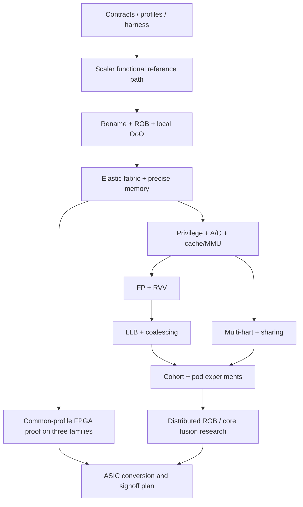

# MosaicRV 细粒度实现计划

状态：**规划，不是已实现处理器**。本次只维护文档；下列 RTL、程序、脚本、命令和结果目录均为后续交付契约，不表示它们已存在或已运行。架构裁决见 [architecture-review.md](architecture-review.md)，正确性方法见 [validation-plan.md](validation-plan.md)，板级与 ASIC 路径见 [platform-plan.md](platform-plan.md)。原始报告及逐节覆盖见 [source-inventory.md](source-inventory.md)。

## 1. 实现决策与不可变边界

采用 **portable synthesizable SystemVerilog + C++ Verilator harness + Python 标准库编排 + Make**。当前仓库只有研究文档，无现存 RTL/构建约定可继承；选择 SV 是减少 Gowin/Vivado/ASIC 间生成器与语言前端差异的工程决策，不是声称 Chisel 不可移植。XiangShan 保留它自己的 Chisel/生成 RTL/Verilator 工程，作为第二 DUT 与验证基础设施参考；不把整个 XiangShan 后端搬进本项目，也不把它当 ISA 金标准。

- 软件可见：标准 RISC-V hart、指令、CSR、异常、内存语义；每 hart 独立 architectural state。
- 硬件可变：已有 queue/FU/PRF-port/network/completion/lane 资源的分配与路由；不在每条指令中实例化硬件，不用 DFX 模拟执行发射。
- 初期控制面：每 hart 一个 home rename/ROB/LSQ ordering domain；远程执行不转移 architectural ownership。
- 采用有限、分层、带背压的网络；先 local fast path，再 remote bandwidth；不默认 global CAM/crossbar。
- 错误处理与验证接口先于性能策略；每个动态策略必须有 fixed/static 对照模式与相同可见语义。
- 最终研究范围包含 scalar OoO、资源租借、RVV、LLB/coalescing、多 hart/cohort、pod、distributed ROB/core fusion。阶段 gate 决定何时启用，不把尚未实现的研究目标静默删掉。

### 1.1 功能 profile（不是商用 ISA 认证）

| Profile | 必须实际具备的能力 | 明确不能提前声称的能力 |
|---|---|---|
| p0 | RV64IM_Zicsr_Zifencei，M-mode，bare-metal，单 hart，两个执行 cluster；先无 cache 的有序 memory endpoint | A/C/F/D/V、S/U、Sv39、Linux、多 hart |
| p1 | p0 + A/C、S/U、Sv39、PMP、cache/interrupt/timer 与 Linux 所需平台契约 | F/D/V、cohort；Linux 通过是系统证据，不是全 ISA 正确性证明 |
| p2 | p1 + F/D、RVV 1.0 全部所宣称指令及 CSR，初始 VLEN=128、ELEN=64 | 改变运行中 hart 的 VLEN；未覆盖指令不得借 full V 名义放行 |
| p3 | p2 + 两 hart 起步，资源分区/借用、same-PC cohort、shared-memory/coherence、层次扩展 | “任意串行程序自动 GPU 加速”、未经验证的不同地址空间请求合并 |

中间增量允许内部 feature flag；对外 `misa`、设备描述、compiler `-march`、reference capability 必须来自同一 manifest。未完成扩展不得对外通告。A/C 可分别开发，但 p1 gate 两者都要通过。RVV 内部 element 执行不是普通标量全有全无事务，部分 trap/vstart/FOF 以 ISA 为准 [IR-001]。

### 1.2 初始几何与缩放约束

以下仅是首轮可证伪设计点，不是 FPGA fit/Fmax 承诺：2-wide rename/dispatch，64 architectural ROB entries，96 个 integer physical registers（含 x0/architectural mappings 的分配规则），4 PRF banks，2×8 local IQ entries，2 clusters 各一 integer ALU，1 shared iterative MUL/DIV，1 LSU，LQ=8/SQ=8，每 cluster 两 entry result FIFO，2-wide maximum retire。64 ROB 不要求所有在途指令都能分配目的寄存器；free-list 不足即背压，不越配。2-issue 的 operand collector 可以多周期读取 4-bank 1R1W PRF；不能把不足的读端口隐式当成全双发射。

小型 FPGA profile 允许 ROB=32、PRF=64、较少队列/更低频率，但仍保留相同 ISA 和两个真实 cluster 以验证 fabric。先用共用 BRAM 工作集在三家族验证；完整 p2/p3 资源是否适合每块实板由 H 系列门槛决定。不得将编译器降到 RV32 或静默关闭指令来伪造“三平台通过”。如果最小共同设计仍不 fit，记录失败并请求改变器件或目标；不能将软件模拟器当 FPGA 原型。

### 1.3 RTL 接口与所有权合同

| 接口 | 最小字段/语义 | 接受与生命周期 |
|---|---|---|
| Fetch/decode | hart, PC, original instruction bits/length, fetch fault, predictor metadata | redirect 之后旧 fetch responses 丢弃；C 跨字/跨页 fault 归属原 PC |
| Macro/uOP | hart, instruction sequence, ROB slot+generation, uop index/count, epoch, op/capability, source physical tags+generation, destination tag, immediate, memory/vector descriptor handle | macro slot 可对应多个 uOP；不能仅靠 last-uOP 抵达判断全部完成 |
| Issue lease | uOP identity, owner generation, FU class, operand slots, result credit, route/queue reservation IDs | 一次原子授予或零授予；无长期持有“部分资源等剩余资源”的循环等待 |
| Operand/result | producer identity, physical tag+generation, value/byte mask, exception, destination/home, route generation | `valid && ready` 才转移；stall 时 payload 稳定；每目的 exactly-once ownership，不是广播即写入 |
| Memory request | hart/seq/epoch, virtual+physical address stages, size/mask/data, access kind, privilege, ASID/address-space identity, ordering/atomic attributes, request ID+generation | speculative RAM read 与不可逆 MMIO/committed store 分离；响应可乱序但每 ID 唯一 |
| Completion | ROB generation, uOP/element identity, data-valid/fault, PRF visibility acknowledgement, side-effect status | execution-done、value-visible、instruction-complete、retired 是四个不同事件 |
| Retire/event | per-hart monotonic order, PC/next PC/instruction/length, integer/FP/vector writes with masks, CSR deltas, trap/interrupt event, store/atomic event | architectural boundary；trap event 不冒充正常 retire；memory visibility 单独记录 |
| Reconfigure | old/new owner generation, stop-admit, drain outstanding counts, barrier ack, publish new owner | STOP_ADMIT → DRAIN → ACK → PUBLISH → RESUME；未 ack 不重用 ID/credit/state |

RTL 编码宽度由容量与寿命上界推导，禁止把“64-bit sequence”作为永不回绕的证明。调度 age 的模数必须大于最大可比较距离的两倍；tag 重用依赖所有旧响应/取消 ack 已回收，或有可证明不别名的 generation。PRF/result 的 epoch 校验必须尊重“redirect 前仍然活跃的 older instruction”，不能简单拒收全部旧 epoch。

## 2. 项目布局与命令合同

后续实现才创建：`rtl/common/`（packet/FIFO/RAM contract），`rtl/core/`（frontend/rename/ROB/LSU），`rtl/fabric/`，`rtl/vector/`，`rtl/soc/`，`platform/{generic,gowin,amd,asic}/`，`sim/`，`tests/{unit,directed,random,litmus,programs}/`，`formal/`，`config/`，`tools/`，`build/`，`results/`。公共 core 不引用 vendor primitive；器件 IP 在 platform wrapper。工具链、ISA、memory map、test corpus、reference 与 config hash 都进入 manifest。

以下是 **待 I-003/I-004 实现的本项目 CLI**，不是现有命令：

```sh
make sim PROFILE=p0
make unit CASE=rename.same_cycle_chain PROFILE=p0
python3 tools/verify.py --profile p0 --suite scalar-directed-v1 --seed 0 --out results/scalar-directed
python3 tools/experiment.py --matrix config/experiments/fixed-vs-dynamic.json --out results/fabric-ab
```

约定：命令成功退出 0；mismatch/assertion/timeout/未实现配置退出非零；输出 JSON manifest、逐项 verdict、seed、完整命令、工具版本、ELF/config/RTL/reference hash。`--suite` 不识别必须失败，不能跑空集合返回成功。后文每个 `CASE=` 名称是该任务必须交付的 case；若 case 尚未实现，该任务未完成。运行整个未知后端是不合格的替代验收。Verilator upstream 构建与 XiangShan upstream 命令以 validation-plan 的锁定版本为准。

## 3. 阶段门槛与并行边界



“functional reference path”是独立简单执行路径/测试模型，不是把新处理器替换成解释器交付；最终 p0 必须实际用两个 cluster 的 RTL 执行、存在 OoO 和争用，并完成 commit differential checking。前端、FU、SoC wrapper 可在协议冻结后并行；rename/ROB/LSQ/flush 的共享状态由同一集成责任人管理。每个任务的有效依赖是其 `Depends` 字段与下表的并集；不能以尚未通过的硬件结果反向满足 RTL 依赖。读者按合并后的 DAG 取 ready tasks，不按文件编号机械串行执行。

### 3.1 跨文档集成依赖

表中只增加依赖，不删除各任务自身前提。实现任务先交付可测试候选，V 任务验证该候选，release gate 再依赖验证；不会要求“已经 release 才允许验证”。某 V 任务覆盖后续阶段时，未启用部分必须显式保留 deferred 行，并阻断该扩展的 gate，不能阻断无关 p0 的合法基础集。I-048 是 single-hart OS 实现/冒烟，V-073 是后续含 SMP 的完整 OS 验收。

| Task | Additional Depends | 集成义务 |
|---|---|---|
| V-001 | I-001 | 已冻结 ISA 决策 |
| I-003 | V-003 | 工具环境闭包 |
| I-004 | V-008 | canonical event/ABI 已定义 |
| V-007 | I-007 | 实际 startup/linker |
| V-009 | I-004 | 实际 reset harness |
| V-010 | I-004 | 实际 C++ tick loop |
| V-013 | I-017 | 实际双宽 retire |
| V-014 | I-019 | 实际 trap/CSR |
| V-015 | I-020 | 实际 interrupt/WFI |
| V-016 | I-037 | 实际 fence.i |
| V-017 | I-019 | CSR implementation table |
| V-018 | I-036 | 实际 LSU/replay |
| V-019 | I-038 | 不可推测 MMIO |
| V-026 | I-012 | 真实 MUL/DIV |
| V-027 | I-018 | rename/恢复候选 |
| V-028 | I-029 | fixed/dynamic 两模式 |
| V-029 | I-028 | 延迟 remote response |
| V-030 | I-018 | checkpoint 实现 |
| V-031 | I-031 | owner generation |
| V-032 | I-030 | credit/fairness 合同 |
| V-033 | I-030 | 仲裁实现与进展假设 |
| V-034 | I-031 | 重配置状态机 |
| V-035 | I-031 | 重配置取消路径 |
| V-044 | I-041 | C 解码/取指 |
| V-045 | I-039 | AMO serialization |
| V-046 | I-040 | LR/SC reservation |
| V-047 | I-044 | S/U/PMP |
| V-048 | I-045 | Sv39 walker |
| V-049 | I-046 | TLB/fence |
| V-050 | I-050 | FP implementation |
| V-051 | I-050 | FP state ownership |
| V-052 | I-051 | V descriptor/profile |
| V-053 | I-052 | vset/CSR |
| V-054 | I-054 | vector integer/mask |
| V-055 | I-055 | vector FP/reduction |
| V-056 | I-056 | vector memory |
| V-057 | I-057 | FOF/restart |
| V-058 | I-057 | partial trap |
| V-059 | I-058 | chaining |
| V-060 | I-059 | lane reallocation |
| V-061 | I-060 | LLB freshness |
| V-062 | I-061 | coalescer |
| V-063 | I-062 | memory QoS |
| V-064 | I-064 | 两 hart control |
| V-065 | I-065 | shared-memory implementation |
| V-066 | I-065 | actual memory outcomes |
| V-067 | I-065 | coherence protocol |
| V-068 | I-068 | cohort issue/results |
| V-069 | I-069 | divergence/split |
| V-070 | I-070 | cross-hart merge |
| V-071 | I-071 | mixed personality |
| V-072 | I-073 | inter-pod task transfer |
| V-073 | I-048 | RISC-V OS candidate |
| V-074 | I-029, I-038 | 真实 fabric 与设备路径 |
| V-076 | I-076 | 已校准 PMU |
| V-077 | H-016, H-024, H-030 | 三家族真实板测，不依赖仿真替代 |
| I-080 | V-039, V-078 | p0 有限正确性、负控制、replay/ACT/formal 证据 |
| I-081 | H-032, V-079 | 三板与观测逻辑可移除性 |
| I-082 | V-060 | 完整声明的 F/D/V 验收链 |
| I-083 | V-066, V-067, V-071, V-072, V-080 | memory/cohort/pod/能力广告闭合 |
| I-084 | V-076 | 正确性先行的研究结论 |
| H-039 | I-084 | 最终候选 common RTL 进入 ASIC 映射 |
| I-085 | H-047 | ASIC 实际签核或明确外部阻断 |
| I-086 | V-080 | release 不超出能力证据 |

三类物理 flow 在 H-001–H-010 公共合同后可并行，H-022 是共享 Vivado runner 的校准，不要求 Virtex 等待 Zynq 实板。V-041/V-042 中有界形式证明只关闭所声明的实例/性质，不能把整个 p0 宣称为已形式化全证明。


| I-087 | I-001, I-002 | 可选lockstep profile与故障模型 |
| I-088 | I-087, I-017, I-024 | main/shadow副本与公平资源grant |
| I-089 | I-088, I-026, I-034, I-019 | architectural comparator与fail-closed发布 |
| I-090 | I-089, I-047, I-006 | shared-domain保护与综合冗余存活 |
| V-081 | I-087, V-008, V-020, V-033 | lockstep观测点/延迟校准 |
| V-082 | I-089, V-021, V-027, V-042 | replica fault injection与副作用阻断 |
| V-083 | I-090, V-015, V-034 | reset/debug/reconfigure/公平 |
| V-084 | I-090, V-067, V-079 | shared-domain与netlist冗余证据 |
| H-048 | I-089, H-010 | 三家族物理lockstep证据 |
| H-049 | I-090, H-038, H-041 | ASIC lockstep物理/DFT边界 |
| I-091 | I-080, I-083, I-090, V-081, V-082, V-083, V-084 | 可选lockstep profile验收 |

## 4. 工作包：合同、工具、可执行基线

### I-001 — 冻结 ISA 与平台配置 manifest
- Depends: none
- Inputs: 三份源报告、IR-001、profile 表、architecture-review 的修正。
- Action: 定义 config/profile schema：XLEN、extensions、privilege、VLEN/ELEN、hart 数、memory map、endianness、misalignment policy、CSR WARL/WPRI；逐项指定 p0/p1/p2/p3 值及来源。
- Outputs: config/profiles 与 ISA/CSR capability matrix。
- Pass: 每个 profile 可生成唯一 compiler/ref/DUT capability 交集；任何宣称指令有实现任务和验证任务。
- Fail: ISA 字符串包含未实现扩展，或 memory/CSR 行为未定义。
- Covers: ISA scope, configuration, SRC-01/SRC-02/SRC-03。
- Sources: IR-001, architecture-review.md。

### I-002 — 冻结 packet、tag、credit、memory contract
- Depends: I-001
- Inputs: 本文接口表、容量上界、recover/reconfigure 时序。
- Action: 为每接口写 transfer/cancel/response 状态表、owner、字段宽度推导；穷举 reset、flush、same-cycle accept/cancel、tag wrap 与 late response 组合。
- Outputs: rtl/common 的包类型设计、interface contract、identity lifetime 表。
- Pass: 每类资源有唯一分配/释放事件；所有响应可判定 live/killed/stale，模数比较上界可计算。
- Fail: 用 ROB index 或 PC 单独识别在途指令，或取消没有 credit 回收路径。
- Covers: uOP identity, ownership, recovery, network。
- Sources: architecture-review.md, SRC-01/SRC-02/SRC-03。

### I-003 — 实现可复现构建与能力拒绝
- Depends: I-001, I-002
- Inputs: SV/C++ stack、V 系列工具锁定产物、本项目 CLI contract。
- Action: 创建 file list、Make targets、配置生成器与 manifest；构建不同 profile 到独立目录；未知 feature/缺依赖立即失败而不 fallback。
- Outputs: Makefile、config validator、版本/hash 记录、CLI help。
- Pass: 清空可再生 build 后两次构建使用相同输入清单；非法 profile 确定非零且不产出成功 manifest。
- Fail: 使用宿主机隐含路径、自动改 ISA 或遗留旧二进制冒充新构建。
- Covers: reproducibility, tooling, portability。
- Sources: validation-plan.md, platform-plan.md。

### I-004 — 实现 Verilator harness 与失败输出
- Depends: I-003
- Inputs: V 系列 harness/event/reference 合同、时钟/reset 协议。
- Action: 实现 ELF/bin loader、tick、reset、memory endpoint、seed、cycle limit、retire callback、first-mismatch dump；运行 CASE=harness.reset_load_exit 和 timeout/invalid-image 负例。
- Outputs: sim/eaf-sim、确定性运行 manifest、replay command。
- Pass: 指定镜像地址和 reset PC 一致；PASS 签名与退出码配对；超时/无 retire/损坏 ELF 均非零。
- Fail: 仅 UART 打印即当正确，或 reference adapter 未连接仍返回 PASS。
- Covers: Verilator, functional prototype, reproducibility。
- Sources: validation-plan.md。

### I-005 — 实现 valid/ready FIFO 与 skid buffer
- Depends: I-002, I-003
- Inputs: transfer/reset/cancel contract，深度 1/2/3/8 的参数。
- Action: 实现不依赖 vendor primitive 的 FIFO；运行 CASE=fifo.backpressure，交错 push/pop/full/empty/reset，检查 payload 稳定和 packet 序列。
- Outputs: rtl/common/fifo 与单元属性/序列测试。
- Pass: 有界模型中 accepted=emitted+buffered+explicitly_cancelled，任何 stall 不改变头项。
- Fail: full 时丢包、empty 时伪出包、reset 后旧 valid 泄露。
- Covers: buffering, packet conservation。
- Sources: architecture-review.md。

### I-006 — 实现同步 RAM 抽象与碰撞语义
- Depends: I-002, I-003
- Inputs: platform-plan 的 RAM contract，PRF/cache 预期读延迟。
- Action: 固定 synchronous read、byte write、无全阵列 reset；外置 valid 清零；显式 bypass/serialize 同地址 read/write；运行 CASE=ram.collision_matrix。
- Outputs: generic RAM wrapper、碰撞 truth table、vendor adapter 接口。
- Pass: 全地址碰撞/不同 byte mask 的可观察结果符合一种固定 contract，平台变化只改变 wrapper。
- Fail: 仿真组合读而实板一拍读，或依赖未定义 mixed-port 行为。
- Covers: PRF/cache storage, FPGA/ASIC portability。
- Sources: platform-plan.md。

### I-007 — 实现 bare-metal 镜像与 host oracle
- Depends: I-001, I-004
- Inputs: reset PC、RAM/MMIO map、p0 compiler flags。
- Action: 写 crt0/linker/trap handler、tohost/UART result record、signature 区；生成 add/branch/load/store/mul 程序，host 独立计算整数结果。
- Outputs: 固定 ELF corpus、image manifest、expected signatures。
- Pass: reference 与 harness loader 对 segment/BSS/entry 一致；错一个 signature byte 必须失败。
- Fail: 只比较 DUT 自己产生的期望值，或 hidden libc 引入不支持指令。
- Covers: executable functional prototype, firmware。
- Sources: IR-001, validation-plan.md。

### I-008 — 实现简化标量语义路径作为 bring-up 对照
- Depends: I-004, I-007
- Inputs: p0 指令表、标准参考模型、memory contract。
- Action: 以单 issue/no speculation 的简化 RTL 路径执行相同 corpus，并接通 retire events；它只用于定位前端/ISA 错误，不替代后续 OoO fabric。
- Outputs: 可禁用的 baseline configuration、scalar-commit 首批 trace。
- Pass: directed p0 corpus 与 reference 逐 architectural event 一致；故意翻转 rd/PC 被 comparator 捕获。
- Fail: 以软件解释器的通过结果申报处理器 RTL 完成。
- Covers: scalar baseline, differential integration。
- Sources: validation-plan.md, SRC-01/SRC-02/SRC-03。

## 5. 工作包：前端、重命名、顺序架构边界

### I-009 — 实现有界 fetch 请求与 redirect
- Depends: I-002, I-005, I-008
- Inputs: PC/epoch/request-ID contract、memory response reorder 模型。
- Action: 实现最多固定数量未返回取指；redirect 后停止旧 decode，晚到 response 按 request generation 丢弃；运行 CASE=fetch.redirect_late_response。
- Outputs: fetch request table、PC redirect arbiter、fault metadata。
- Pass: 任意返回次序下 retire PC 流与 oracle 一致，错误路径 fetch fault 不产生 architectural trap。
- Fail: flush 后旧 cache line 重入 decoder 或覆盖新 request slot。
- Covers: frontend, epoch recovery。
- Sources: IR-001, architecture-review.md。

### I-010 — 实现 RV64I/M decode 与非法指令
- Depends: I-009
- Inputs: 锁定 ISA encoding、p0 capability matrix。
- Action: 写 opcode/funct/immediate 表与每类 macro-uOP；枚举保留 encoding、RV64 W 指令、shift upper bits、M 分支；运行 CASE=decode.rv64im_reserved。
- Outputs: decoder、原始 instruction/PC 追踪、unsupported trap。
- Pass: 全合法 encoding family 映射到正确 class；未启用 A/C/F/D/V 不执行任何 side effect。
- Fail: 非法 funct 退化成 ADD 或丢失 trap 的原 PC/指令值。
- Covers: decode, macro-uOP expansion。
- Sources: IR-001。

### I-011 — 实现整数 ALU 与分支目标计算
- Depends: I-010
- Inputs: RV64 arithmetic/compare/shift/W instruction semantics。
- Action: 实现 ALU、signed/unsigned compare、JAL/JALR/branch；运行 CASE=alu.boundaries，覆盖 0、全一、MIN/MAX、W sign-extension、JALR bit0 清零及 target alignment。
- Outputs: integer/branch execution units、结果与 redirect metadata。
- Pass: 边界向量和固定随机种子结果与独立模型完全一致。
- Fail: 移位量宽度、signed compare 或 W 结果符号扩展错误。
- Covers: scalar FUs, branch execution。
- Sources: IR-001。

### I-012 — 实现可取消 MUL/DIV
- Depends: I-011, I-005
- Inputs: M extension semantics、result credit/cancel contract。
- Action: 实现 iterative 单元和 busy/result handshake；测试 divide-by-zero、MIN/-1、signed high multiply、W variants、每个迭代位置 flush。
- Outputs: shared MUL/DIV、CASE=muldiv.kill_and_edges。
- Pass: 所有 corner result 与 reference 相同；flush 后 credit 回收且晚结果不写新 owner。
- Fail: long-latency 单元在结果 FIFO full 时丢结果，或 cancelled operation 永久占用。
- Covers: variable-latency FU, stale completion。
- Sources: IR-001, architecture-review.md。

### I-013 — 实现 RAT/free-list 与 x0
- Depends: I-002, I-006, I-010
- Inputs: 96-register 几何、committed/speculative mapping、x0 规则。
- Action: 写 allocation/free/update；x0 不分配真实 destination；检测 free-list exhaustion，运行 CASE=rename.single_width_ownership。
- Outputs: RAT/free-list、每 tag owner 属性、stall signal。
- Pass: 每 physical register 精确处于 free 或一个合法 live ownership；x0 永远读零。
- Fail: 当 free-list 空仍接收写 rd 指令，或 old mapping 提前释放。
- Covers: rename, register lifetime。
- Sources: architecture-review.md。

### I-014 — 实现双宽 rename 同周期依赖
- Depends: I-013
- Inputs: 一周期两 macro 的 PC 顺序、allocation result。
- Action: 为第二条源/目的依赖第一条加 bypass；atomic group 接收防止半分配；运行 CASE=rename.same_cycle_chain 覆盖 RAW/WAW/WAR/x0/仅剩一 free tag。
- Outputs: two-wide rename、allocation rollback 协议。
- Pass: 第二条使用正确新 mapping，两个 WAW 的 old tags 在各自合法 commit 时释放，无同 tag 双分配。
- Fail: 部分 dispatch stall 后 mapping/free-list 与 ROB 不一致。
- Covers: superscalar rename, allocation atomicity。
- Sources: architecture-review.md, SRC-02。

### I-015 — 实现 banked PRF 与 operand collector
- Depends: I-006, I-014
- Inputs: 4-bank 1R1W contract、generation/ready bits、operand demand。
- Action: 实现 bank decode/read arbiter/collector；对冲突多周期收集而不假定端口；运行 CASE=prf.read_bank_collision 与 same-cycle WB/read。
- Outputs: PRF banks、operand readiness/collection state。
- Pass: 所有 accepted operand 属于正确 physical generation；stall/backpressure 不重复消费或使用未写值。
- Fail: bank conflict 被当作 ready，或仅 simulation 读出初始化零掩盖未定义读。
- Covers: banked PRF, dynamic read ports。
- Sources: architecture-review.md, platform-plan.md。

### I-016 — 实现 architectural ROB 与 macro completion
- Depends: I-014, I-005
- Inputs: macro/uOP identity、64-entry circular geometry、completion bitmap。
- Action: 分配一个 macro descriptor，记录子 uOP 数/bitmap/exception；运行 CASE=rob.out_of_order_children，最后编号先到、重复到、flush/wrap 都覆盖。
- Outputs: ROB allocation/complete/head interface。
- Pass: 仅所有必需子操作满足条件才 complete；重复包不重复计数，index wrap 不复用旧 generation。
- Fail: 看见 last-uOP 就退休，或仅按 arrival count 误吞重复包。
- Covers: ROB, elastic useful-work window。
- Sources: architecture-review.md, SRC-01/SRC-03。

### I-017 — 实现 in-order retire 与 committed map
- Depends: I-016, I-015
- Inputs: oldest complete macro、PRF value-visible、store authorization 状态。
- Action: 实现最多双 retire，禁止越过未完成/异常 head；更新 committed RAT、释放 old mapping、产生 V retire events；运行 CASE=commit.head_block_and_dual。
- Outputs: architectural commit unit、精确 register state trace。
- Pass: 每 hart order 严增且与参考逐事件一致；两条同 rd commit 顺序正确。
- Fail: execution-done 当作 value-visible，或 younger instruction 越过 pending fault。
- Covers: precise retirement, Difftest interface。
- Sources: validation-plan.md, architecture-review.md。

### I-018 — 实现 branch checkpoint 与精确恢复
- Depends: I-017, I-011
- Inputs: committed/speculative RAT、branch checkpoint、live allocation history。
- Action: 选择初始保守恢复法（committed map + surviving-prefix 重建或完整 checkpoint）；实现 oldest redirect 优先；运行 CASE=recovery.nested_branch_full_queues。
- Outputs: RAT/free-list/ROB/IQ/LSQ 协调 flush 与恢复状态机。
- Pass: mispredict、older exception、同周期 allocation 组合后全部 live tags/credits 守恒；older slow result 仍可完成。
- Fail: 通过清空整个 PRF/free-list 绕开 ownership，或 kill 所有旧 epoch 导致 older head 死锁。
- Covers: speculation, branch recovery, epoch rules。
- Sources: architecture-review.md。

### I-019 — 实现 M-mode CSR 与 trap entry/return
- Depends: I-017, I-018
- Inputs: p0 CSR table、interrupt priority、WARL/WPRI 与 reset 值。
- Action: 实现 misa/mstatus/mtvec/mepc/mcause/mtval/mie/mip/mscratch 等 manifest 声明项，CSR side effects 在顺序边界执行；运行 CASE=csr.precise_trap_mret。
- Outputs: CSR file、ECALL/EBREAK/illegal/access-fault/MRET events。
- Pass: 各 trap 的 PC/cause/tval/status 与 reference 相同，faulting destination 不写回；保留位行为一致。
- Fail: speculative CSR 更新可见，或把 trap 当成功 retire 增加 instret。
- Covers: precise exceptions, CSR, M privilege。
- Sources: IR-001, validation-plan.md。

### I-020 — 实现 timer/external interrupt 与 WFI 边界
- Depends: I-019
- Inputs: timer/MMIO map、事件注入脚本、interrupt sampling policy。
- Action: 在合法 architectural boundary 采样中断；定义 WFI 可用行为；记录可重放中断事件；测试 masked/unmasked、pending+trap、long DIV、halt/resume。
- Outputs: interrupt synchronizer、CASE=interrupt.boundary_replay。
- Pass: 相同输入事件可重放到相同 trap 边界；不能吞掉 pending 中断或退休错误路径。
- Fail: 比较 DUT/reference wall-clock cycle 中断而未同步 architectural event。
- Covers: interrupts, reproducible platform behavior。
- Sources: IR-001, validation-plan.md, platform-plan.md。

### I-021 — 实现基础 BPU/BTB/RAS
- Depends: I-018
- Inputs: 无预测正确基线、fetch bandwidth、checkpoint metadata。
- Action: 从小型 bimodal+BTB+RAS 开始；训练时刻显式化；测试 call/return、别名、连续 taken branch、redirect restore。
- Outputs: predictor enabled/disabled configurations、CASE=bpu.recover_history。
- Pass: 开关 predictor 不改变 architectural trace；mispredict counter 与 trace 手工计数一致。
- Fail: prediction 改变 instruction contents，或 RAS/history 恢复丢失 older 状态。
- Covers: frontend supply, branch recovery, performance baseline。
- Sources: SRC-02/SRC-03, architecture-review.md。

## 6. 工作包：执行织构、completion 与资源管理

### I-022 — 实现 local IQ 与 oldest-ready 仲裁
- Depends: I-015, I-016, I-018
- Inputs: operand tag/ready、age 比较、8-entry queue。
- Action: 实现 insert/wakeup/select/kill；初始仅 local FU；运行 CASE=iq.wakeup_insert_select，覆盖同周期 enqueue+wakeup 与 FU backpressure。
- Outputs: 每 cluster IQ、可追踪 issue decision。
- Pass: 仅 ready/live uOP 发射一次；bounded-ready 队列不饿死 oldest entry。
- Fail: wakeup tag 不带 generation，或 grant 未被 FU 接受就移除 entry。
- Covers: distributed scheduling, wakeup。
- Sources: architecture-review.md。

### I-023 — 实现静态双 cluster 对照
- Depends: I-022, I-012, I-017
- Inputs: fixed dispatch policy、两套真实 ALU/queues、共享 MUL/DIV。
- Action: 将程序实际接入两个 cluster，先固定 affinity；执行 independent ALU 与 RAW chains，证明可同时存在多条在途/乱序完成。
- Outputs: p0 fixed-backend configuration、CASE=fabric.fixed_two_cluster。
- Pass: retire 对照正确且 trace 显示两个 cluster 执行不同 live uOP，younger 可先 complete 但不能先 retire。
- Fail: 第二 cluster 永远不被使用，或实际仍单发射解释执行却声称 OoO。
- Covers: functional OoO prototype, A/B control。
- Sources: SRC-01/SRC-02/SRC-03, validation-plan.md。

### I-024 — 实现原子资源租约
- Depends: I-023, I-005
- Inputs: FU、operand buffer、result FIFO、network credit availability。
- Action: 采用 all-or-none issue grant；只有下游有容纳结果的 credit 才接受不能 stall 的 FU；运行 CASE=lease.conflict_and_cancel。
- Outputs: resource allocator、lease IDs、credit accounting。
- Pass: 每次 grant 同时占用全部必要资源，拒绝无副作用；release/cancel 恰好一次。
- Fail: 只预留 FU 再无限等待 WB，或 flush 重复归还 credit。
- Covers: resource scheduling, deadlock avoidance。
- Sources: architecture-review.md, SRC-01。

### I-025 — 实现 per-cluster result FIFO
- Depends: I-024
- Inputs: fixed/variable FU latency、exception payload、queue contract。
- Action: 多 FU 同周期完成时按实际端口 buffer/arbitrate；对可暂停和不可暂停单元分别设计保证；运行 CASE=completion.fu_collision。
- Outputs: local completion queues、accepted-result accounting。
- Pass: 每个 issued live result 被 buffer 或明确 kill，满队列不丢值，异常不被普通结果覆盖。
- Fail: 假设 multiply/load 永不同时返回，或 valid pulse 不能保持。
- Covers: decoupled execution/completion, result conservation。
- Sources: architecture-review.md, SRC-01/SRC-02。

### I-026 — 实现 banked WB 与 value-visible wakeup
- Depends: I-025, I-015
- Inputs: 每 bank 写端口、producer generation、IQ consumer readiness。
- Action: result arbitrate 到 PRF；写入或可证明保留的 bypass 后才置 ready/complete；运行 CASE=wb.same_bank_many_producers。
- Outputs: WB arbiter、value-visible ack、wakeup routing。
- Pass: 冲突结果延迟而不丢失；同一 physical generation 只有正确 producer 写入；消费者看到已承诺 value。
- Fail: FU done 提前 wakeup，而值在后续争用中失踪。
- Covers: unified writeback without global CDB, wakeup correctness。
- Sources: architecture-review.md。

### I-027 — 实现 local bypass 快路径
- Depends: I-026
- Inputs: local dependency metadata、registered timing budget、PRF fallback。
- Action: 限定连线范围；bypass 保留 producer identity，miss/冲突回退 PRF；运行 CASE=bypass.local_raw_chain。
- Outputs: local forwarding muxes、旁路延迟/覆盖表。
- Pass: 开关 bypass trace 一致；连续 RAW chain 得到正确值且 reported latency 来自 measured cycles。
- Fail: 为追求单周期绕过 credit/identity 或形成组合 ready loop。
- Covers: latency island, local data movement。
- Sources: SRC-03, architecture-review.md。

### I-028 — 实现 remote operand/result 链路
- Depends: I-026, I-005, I-018
- Inputs: home/remote IDs、预先固定 route、分离请求/返回通道。
- Action: 实现至少一拍 registered link 与返回路径，独立背压；运行 CASE=remote.kill_with_delayed_response，注入 1/2/4/8 拍延迟。
- Outputs: inter-cluster transport、stale-response reject、link counters。
- Pass: 随机背压下数据/credit 守恒；remote response 不写已复用的 home slot。
- Fail: request/response 共用有限资源形成循环等待，或假定永远一拍返回。
- Covers: remote execution, network latency, tagged completion。
- Sources: architecture-review.md, SRC-01/SRC-02。

### I-029 — 实现动态 steering 基础策略
- Depends: I-028, I-024
- Inputs: capability matrix、queue occupancy、producer locality、fixed baseline。
- Action: 先 deterministic locality-first + least-loaded + age tie-break，不引入不可解释 predictor；同 ELF/seed 固定与动态模式对照。
- Outputs: steering policy、CASE=steering.capacity_locality、decision trace。
- Pass: incompatible FU 永不接收；资源饱和只 stall/retry，不改变架构结果。
- Fail: load balancing 无视 dependency lifetime 或为凑性能改变物理资源数。
- Covers: dynamic route scheduling, controlled experiment。
- Sources: SRC-01/SRC-02/SRC-03。

### I-030 — 实现 queue/port 配额与饥饿上界
- Depends: I-029
- Inputs: arbitration classes、最大 service time、请求/完成 credit。
- Action: 为 ready oldest 与返回通道保留逃生容量，写 fairness assumptions；测试饱和 short/long FU 混合与持续新请求。
- Outputs: bounded service policy、CASE=arbiter.forward_progress、formal assumptions。
- Pass: 在明确的“下游最终 ready/内存有界返回”假设下存在可计算等待上界，并被 assertion/压力用例覆盖。
- Fail: 用无限 timeout 当公平性证明，或高优先级 scalar 永久饿死 vector。
- Covers: deadlock, livelock, fairness, QoS。
- Sources: architecture-review.md。

### I-031 — 实现资源所有权变更状态机
- Depends: I-030, I-018
- Inputs: stop-admit/drain/ack/publish contract、outstanding counters。
- Action: 从软件受控静态配置切换开始；遍历每个 state 时的 flush/reset/error；运行 CASE=reconfigure.drain_and_generation。
- Outputs: resource broker FSM、owner generations、drain evidence。
- Pass: 旧 owner 的 uOP/结果/credit 全部结算才发布新 owner；重复控制消息幂等。
- Fail: 仅 IQ 空就认为 FU/network/LSU 已 drain，或切换时丢 architectural state。
- Covers: dynamic resource ownership, two timescales。
- Sources: SRC-01/SRC-02/SRC-03, architecture-review.md。

### I-032 — 实现 bank-aware physical allocation
- Depends: I-031, I-014
- Inputs: 普通 free-list baseline、bank pressure 与 producer locality。
- Action: 在保持合法 tag allocation 的前提下添加可关闭 bank preference；冲突时可用任何合法空闲 bank；运行 CASE=rename.bank_bias_exhaustion。
- Outputs: bank-aware allocation policy、对照配置。
- Pass: 任何偏置都不泄漏 free registers；同资源下测得 stall/WB/read 冲突变化而非先假定收益。
- Fail: 仅指定 bank 空就永久卡住，或使用未释放 physical tag。
- Covers: resource-aware rename, PRF port economy。
- Sources: SRC-01, architecture-review.md。

## 7. 工作包：内存、cache、特权与系统软件

### I-033 — 实现顺序 memory endpoint 与访问 fault
- Depends: I-019, I-007
- Inputs: RAM/MMIO map、size/sign/mask、misalignment policy。
- Action: 首先一次一个 normal-memory transaction，unsupported/misaligned 访问按声明 trap；覆盖 byte/half/word/double signed/unsigned 与 region 边界。
- Outputs: basic LSU endpoint、CASE=lsu.size_fault_boundaries。
- Pass: load 值与 byte stores 精确匹配 reference；faulting access 无部分不可逆写入。
- Fail: 读越界默认为零，或访问 UART 按普通可重试 RAM 处理。
- Covers: memory semantics, access faults。
- Sources: IR-001, validation-plan.md。

### I-034 — 实现 speculative SQ 与 store commit authorization
- Depends: I-033, I-017, I-018
- Inputs: store address/data readiness 分离、ROB authorization。
- Action: store 先进入 SQ，只有 nonfaulting in-order commit 授权才能向外可见；flush 撤销未授权项；运行 CASE=store.wrong_path_visibility。
- Outputs: SQ、committed store buffer、store event trace。
- Pass: 错误路径对 RAM/MMIO 零写入；已授权 store 在后续 flush 后仍完成且不重复。
- Fail: 用 execution-complete 代替 commit 授权，或 flush 删除已对外承诺 store。
- Covers: precise memory side effects, recovery。
- Sources: IR-001, architecture-review.md。

### I-035 — 实现 LQ 与 store-to-load forwarding
- Depends: I-034
- Inputs: byte overlap、最年轻 older store 规则、未知地址 store policy。
- Action: 初期 load 等待所有相关 older store 地址已知；逐 byte 合并 forwarding 与 memory 返回；覆盖 partial overlap、多 store、same-cycle address resolve。
- Outputs: LQ/forward search、CASE=lsu.byte_forwarding。
- Pass: 每 byte 来自程序序中最近合法 store 或 memory；不同 size alias 不漏检。
- Fail: 只比较 aligned word 地址，或 younger store 错误转发给 older load。
- Covers: LSQ, memory dependence。
- Sources: IR-001, architecture-review.md。

### I-036 — 实现 load speculation 与 violation replay
- Depends: I-035, I-018
- Inputs: conservative LSU baseline、address-resolve events、recovery identity。
- Action: 可关闭地让 load 越过未知 older store；发现 alias 时 replay load 与所有受污染 younger work，保留 committed state；运行 CASE=lsu.late_alias_replay。
- Outputs: violation detector、replay redirect、重放计数。
- Pass: speculation on/off 对同程序一致；alias 在任何 resolve cycle 被检测，重放不会饿死。
- Fail: 只重算 load 而未撤销依赖它的 younger result/store。
- Covers: dynamic memory disambiguation, recovery。
- Sources: architecture-review.md, SRC-02。

### I-037 — 实现 FENCE 与 FENCE.I
- Depends: I-034, I-009
- Inputs: memory ordering classes、I-fetch buffer/cache 状态、self-modifying code test。
- Action: 初期保守 drain 所有 relevant older access，阻止 forbidden younger access；FENCE.I 清理本 hart 旧指令视图；运行 CASE=fence.code_and_data_order。
- Outputs: fence serialization logic、instruction invalidation handshake。
- Pass: published code 修改后经规定同步可见；FENCE 不被错误等同于 cache flush 或跨 hart 自动 I-cache 同步。
- Fail: instruction stale bytes 被执行，或 fence 完成时旧 MMIO 尚未按合同完成。
- Covers: RVWMO ordering, instruction coherence。
- Sources: IR-001, validation-plan.md。

### I-038 — 实现不可推测 MMIO
- Depends: I-034, I-037
- Inputs: PMA/device map、side-effecting read/write、错误响应。
- Action: MMIO 在 ROB head/必要 drain 后执行，不与 RAM coalesce；一次 transaction ID 仅一次设备副作用；运行 CASE=mmio.exactly_once。
- Outputs: device arbiter、serialization policy、UART/timer adapter。
- Pass: wrong-path MMIO 零次访问，合法 FIFO-pop/UART 写恰好一次，错误返回精确 trap。
- Fail: reference 与 DUT 分别读两次设备，或 replay 导致重复写。
- Covers: system interface, nondeterministic device handling。
- Sources: validation-plan.md, platform-plan.md。

### I-039 — 实现 AMO 原子路径
- Depends: I-037, I-038
- Inputs: A extension operations、shared serialization point、aq/rl。
- Action: 先在共同 memory arbiter 做原子 read-modify-write，不以 load+store 松散拼接；测试所有 AMO.W/D signed/unsigned 边界及 aq/rl 顺序。
- Outputs: atomic memory transaction、CASE=amo.linearization。
- Pass: 并发 competing accesses 的历史存在合法 linearization，old value 与写入结果正确。
- Fail: 两个 hart 都读同旧值后覆盖，或把 aq/rl 当性能 hint 忽略。
- Covers: A extension, atomics, memory ordering。
- Sources: IR-001, validation-plan.md。

### I-040 — 实现 LR/SC reservation 与进展
- Depends: I-039
- Inputs: reservation granule 声明、invalidation sources、constrained LR/SC rules。
- Action: 跟踪 hart reservation、store/AMO/外部写失效；成功 SC 单次写入；测试冲突、context switch、异常、允许的失败及受限循环进展。
- Outputs: reservation manager、CASE=lrsc.reservation_progress。
- Pass: 没有 reservation 的 SC 不写，必要失效不漏；声明的 progress 条件由测试/属性检查。
- Fail: 任意永远失败也算通过，或只本 hart store 清 reservation。
- Covers: LR/SC correctness, multi-agent memory。
- Sources: IR-001, validation-plan.md。

### I-041 — 实现 C 解压与跨界取指
- Depends: I-010, I-009, I-019
- Inputs: RV64C encoding、instruction length、fault boundary。
- Action: decode 16/32-bit 混合与跨 fetch line/page；保留原 bits/length；测试 compressed reserved/hint、link PC 增量、第二半字 fault。
- Outputs: predecoder/decompressor、CASE=compressed.cross_boundary。
- Pass: 正常与 trap trace 用 original instruction PC/length，不能将 compressed PC 固定加四。
- Fail: 保留 encoding 错执行，或跨页 exception 报错 PC。
- Covers: C extension, predecode, fetch faults。
- Sources: IR-001。

### I-042 — 实现 blocking L1I/L1D
- Depends: I-006, I-035, I-037
- Inputs: cacheability/PMA、line size、write policy、RAM wrapper。
- Action: 先小 direct-mapped/低关联 cache，refill/evict 整体可追踪；初始化 valid 不重置 data RAM；运行 CASE=cache.refill_evict_fault。
- Outputs: I/D cache、cache-off 对照、refill error handling。
- Pass: conflict/refill/dirty eviction/self-modify 在 on/off 模式 architectural trace 一致。
- Fail: error refill 标 valid，或 eviction 丢 dirty bytes。
- Covers: split L1, unified memory service。
- Sources: SRC-01/SRC-02, platform-plan.md。

### I-043 — 实现 MSHR 与 nonblocking load responses
- Depends: I-042, I-036
- Inputs: miss IDs/generations、cache line merge rules、最大 outstanding。
- Action: 从两个 MSHR 开始，处理 same-line merge、不同 line 乱序返回、squash 后 refill、资源满；运行 CASE=mshr.out_of_order_merge。
- Outputs: MSHR table、response distributor、MLP counters。
- Pass: line response 正确分发给所有仍 live 请求；取消一个 load 不取消其他合法消费者。
- Fail: response ID 复用别名、MSHR 满导致丢 miss 或死锁。
- Covers: memory-level parallelism, shared return fabric。
- Sources: architecture-review.md, SRC-01/SRC-03。

### I-044 — 实现 S/U privilege 与 PMP
- Depends: I-019, I-038
- Inputs: p1 CSR/access matrix、privileged spec、PMP granularity/entry count。
- Action: 实现 delegation、SRET、privilege access checks、PMP overlap/lock/address matching；按 region 边界测试 fetch/load/store/AMO。
- Outputs: privilege control、PMP、CASE=privilege.permission_matrix。
- Pass: 每种 privilege/access/PMP 组合与 spec/reference 一致，permission fault 无 side effect。
- Fail: M/S/U mode 仅改标签不检查访问，或 lock/WARL 行为不一致。
- Covers: privilege, protection, application processor path。
- Sources: IR-001, validation-plan.md。

### I-045 — 实现 Sv39 page walker
- Depends: I-044, I-042
- Inputs: canonical VA、PTE format、A/D update policy、page fault priority。
- Action: 写多级 PTW，支持 leaf/superpage/alignment/permission/SUM/MXR 与访问 fault；先串行 PTW；运行 CASE=sv39.walk_and_faults。
- Outputs: translation engine、physical request permission metadata。
- Pass: 所有级别合法映射和错误 PTE 的 PA/cause/tval 与 reference 一致，更新 A/D 的策略明确。
- Fail: 非 canonical 地址仍访问物理 RAM，或 PTE error 当普通 cache miss。
- Covers: MMU, virtual memory, precise faults。
- Sources: IR-001, validation-plan.md。

### I-046 — 实现 TLB 与 SFENCE.VMA
- Depends: I-045
- Inputs: ASID/global mapping、satp switch、per-hart translation identity。
- Action: TLB tag 包括必要 address-space context；实现全量保守 invalidation 再优化选择性；测试同 VA 不同 ASID、global entry、修改 PTE 后 fence。
- Outputs: I/D TLB、invalidate acknowledgement、CASE=tlb.asid_sfence。
- Pass: stale translation 在要求同步后不可使用；permission result 不从别的 hart/ASID 复用。
- Fail: cohort/LLB 仅按 PC/VA 命中，或 SFENCE 被当 memory-data fence。
- Covers: translation coherency, address-space isolation。
- Sources: IR-001, architecture-review.md。

### I-047 — 实现 SoC interconnect 与 error completion
- Depends: I-038, I-020, I-042
- Inputs: core memory protocol、AXI/本地 bus wrapper、platform map。
- Action: adapter 保持 ID/byte strobes/backpressure；对 unmapped、DECERR/SLVERR、reset 中 transaction 逐一规定处理；运行 CASE=soc.bus_errors_and_ids。
- Outputs: common SoC fabric、RAM/UART/timer/interrupt peripherals。
- Pass: 所有 accepted request 恰好一个正常或错误完成；无组合 ready loop，MMIO side effects 不重复。
- Fail: AXI response error 被丢弃导致 ROB 永久等待。
- Covers: SoC glue, FPGA integration, portability。
- Sources: platform-plan.md。

### I-048 — 完成 p1 boot 与 Linux 软件契约
- Depends: I-039, I-040, I-041, I-046, I-047
- Inputs: 完整 p1 capability、firmware/DTB/SBI 选择、reference boot image。
- Action: 先 S-mode bare-metal，再匹配 manifest 的 firmware+kernel+rootfs；保留每阶段 trap/boot log；运行 userspace syscall/timer/page-fault/atomic smoke。
- Outputs: 固定 boot artifact hashes、p1 functional acceptance bundle。
- Pass: userspace 自检输出正确 signature 并正常退出，非法访问准确进入预期 handler；启用 ISA 与 DTB 一致。
- Fail: 只出现 Linux banner 即通过，或由 Zynq ARM PS 运行 Linux 冒充 RISC-V core 启动。
- Covers: standard software compatibility, Linux validation。
- Sources: IR-001, validation-plan.md, platform-plan.md。

## 8. 工作包：FP、RVV、lane memory

### I-049 — 选择并封装 F/D 运算实现
- Depends: I-001, I-025
- Inputs: F/D operation list、license review、rounding/NaN contract、latency/resource budget。
- Action: 对候选开源 FPU 或自实现做许可证与语义审计，封装标准 tagged handshake；软件 softfloat 只能做 oracle，不能替代硬件 datapath。
- Outputs: FPU selection decision、synthesizable adapter、operation capability matrix。
- Pass: 所有 F/D operations 有真实 implementation path、明确 latency/backpressure 和 license 来源。
- Fail: 不支持指令静默软件回退却宣称硬件 F/D 完整。
- Covers: FP datapath, reuse, licensing。
- Sources: IR-001, validation-plan.md。

### I-050 — 实现 FP rename/state/fflags 精确提交
- Depends: I-049, I-017, I-019
- Inputs: FP PRF、NaN-boxing、frm/fflags、mixed integer/FP moves。
- Action: 扩展 rename/commit 到 FP，speculative fflags 在 commit 合并；测试 rounding modes、sNaN/qNaN、subnormal、signed zero、conversion overflow。
- Outputs: FP state control、CASE=fp.precise_flags_and_boxing。
- Pass: 被 squash 的 FP operation 不改变 flags；F/D bits 与规范允许的 NaN 处理一致。
- Fail: 只数值近似相等就通过，或 FPU done 立即写 architectural fflags。
- Covers: F/D precise state, numerical edge cases。
- Sources: IR-001, validation-plan.md。

### I-051 — 冻结 RVV descriptor 与 profile
- Depends: I-050, I-016
- Inputs: VLEN=128/ELEN=64、全部声明 V operations、vtype/vl/vstart。
- Action: 列出每类 instruction 的 EEW/EMUL/LMUL/SEW/register overlap/legal config；descriptor 保存 macro identity/element bitmap/fault progress，不给每 element 分配独立 ROB。
- Outputs: vector capability/legality matrix、descriptor interface。
- Pass: 每种合法/非法组合有确定处理和用例；运行 lane 数变化不改变 hart 的 VLEN/architectural state。
- Fail: 动态 lane 数偷偷改变 VLEN，或 incomplete V subset 宣称 full V。
- Covers: RVV first-class fabric, macro expansion。
- Sources: IR-001, architecture-review.md。

### I-052 — 实现 vsetvl/vsetvli/vsetivli 与 vector CSRs
- Depends: I-051, I-019
- Inputs: vl/vtype/vill/vstart/vxrm/vxsat/vlenb 规则。
- Action: decode/execute 配置指令；测试 AVL 各区间、unsupported vtype、rd/rs1 特例、CSR 权限与上下文保存。
- Outputs: vector configuration unit、CASE=rvv.vset_boundaries。
- Pass: vl 的规范允许选择固定可重现，后续指令 descriptor 获得正确配置快照。
- Fail: replay 后使用较新 vtype，或 vill 未阻止非法执行。
- Covers: RVV configuration, speculative context。
- Sources: IR-001, validation-plan.md。

### I-053 — 实现 banked VRF 与 lane 映射
- Depends: I-051, I-006
- Inputs: register grouping、mask register、element EEW、lane count 2/4/8。
- Action: 定义固定 logical-element→bank/lane 映射及冲突仲裁；测试 fractional/integer LMUL、group overlap、wide operands、端口不足。
- Outputs: VRF banks、operand collector、CASE=vrf.mapping_aliases。
- Pass: 同一 logical vector 在不同 lane 数实现上读写一致；mask/source overlap 不覆盖尚未读取元素。
- Fail: lane resize 后 element 重排丢失或 VRF read latency 在平台间变化未处理。
- Covers: lane scalability, vector operand lifetime。
- Sources: IR-001, architecture-review.md, platform-plan.md。

### I-054 — 实现 vector integer/mask/permute/reduction
- Depends: I-052, I-053, I-025
- Inputs: V integer 指令类、mask/tail policy、reduction ordering。
- Action: 分 operation family 实现 packet execution；包括 widening/narrowing、saturation、slide/gather/compress、mask 与 reduction，逐类 capability gating。
- Outputs: vector integer lanes、CASE=rvv.integer_mask_permute。
- Pass: 每个声明 family 的边界/重叠/masked-off 元素行为通过 V suite，未完成 family 不进入 p2 gate。
- Fail: 只实现 vadd/vmul 就宣称 V 完成，或 masked-off 元素发起异常访问。
- Covers: complete declared RVV integer semantics。
- Sources: IR-001, validation-plan.md。

### I-055 — 实现 vector FP 与逐元素异常标志
- Depends: I-054, I-050
- Inputs: vector FP operations、rounding、ordered/unordered reductions、fflags。
- Action: 复用受测 FPU handshake；按 active elements 汇总 flags；测试 masked sNaN、转换、widening、reduction 合法结果规则。
- Outputs: vector FP packet execution、CASE=rvv.fp_flags_reduction。
- Pass: 不活跃元素不污染 flags；确定性与规范允许差异由 comparator 显式处理而非粗略浮点容差。
- Fail: 把 vector FP 顺序任意改变到规范不允许的结果。
- Covers: RVV FP, precise flags。
- Sources: IR-001, validation-plan.md。

### I-056 — 实现 vector memory packetizer
- Depends: I-054, I-043, I-046
- Inputs: unit/strided/indexed/segmented/whole-register/mask load/store 指令类、PMA/translation。
- Action: 每 element 保留 logical index、地址、byte mask、fault ownership；先无 coalescing 的正确路径，再生成 line requests；测试跨 page/line/权限边界。
- Outputs: vector LSU descriptors、CASE=rvv.memory_modes。
- Pass: 每活跃 element 的地址/数据/异常属于正确 macro，ordered-indexed 的顺序要求不被网络破坏。
- Fail: 一次 line merge 跨越不等价 permissions/MMIO，或漏实现 segment/whole-register 模式仍通告 V。
- Covers: vector memory, packetization。
- Sources: IR-001, architecture-review.md。

### I-057 — 实现 vector partial trap、vstart 与 FOF
- Depends: I-056, I-019
- Inputs: precise vector trap rules、fault-only-first、element completion/progress bitmap。
- Action: 在每个合法 element boundary 注入 page/access fault 与 interrupt；保存允许的部分状态，恢复重执行；覆盖 FOF 首元素 fault 与后续 fault/vl 缩短。
- Outputs: vector restart controller、CASE=rvv.partial_fault_restart。
- Pass: 已发生的合法 store/element 更新不被伪回滚，重启不重复不可逆副作用，trap/vstart/vl 与 spec 一致。
- Fail: 把整个 vector instruction 当标量原子事务，或仅最后 packet 到达便退休。
- Covers: RVV precise exception refinement, restart。
- Sources: IR-001, architecture-review.md, validation-plan.md。

### I-058 — 实现 vector chaining 与执行-提交解耦
- Depends: I-057, I-026
- Inputs: producer element readiness、source lifetime、VRF overlap。
- Action: 逐 element forwarding/readiness，先安全 no-chaining 对照；对 source-before-write 与 instruction cancellation 运行 CASE=rvv.chaining_hazards。
- Outputs: chaining network、element scoreboard、对照性能计数。
- Pass: 开关 chaining 的 defined architectural state 一致；WAR 源还未读完不能因其他 lane 完成而释放。
- Fail: 宏级 ready 位掩盖元素级依赖，或错误路径 packet 被新 descriptor 接收。
- Covers: sustained vector throughput, operand lifetime。
- Sources: IR-002, IR-003, architecture-review.md。

### I-059 — 实现运行时 lane 配额重分配
- Depends: I-058, I-031
- Inputs: fixed VLEN、descriptor progress、lane owner generations。
- Action: 先在 vector instruction boundary drain 后切换 2/4/8 lane 资源份额；中途 packet migration 另列实验，不默认支持。
- Outputs: lane broker、CASE=rvv.lane_resize_boundary。
- Pass: 单 workload×8 与两个 workload×4 等配置的各自输出相同；旧 lane state 清理/转移有 ack。
- Fail: 把 “lane 关闭”解释为丢弃剩余 element 或改变 visible vl/VLEN。
- Covers: dynamic RVV aggregation, resource leasing。
- Sources: SRC-03, architecture-review.md。

### I-060 — 实现严格受限的 LLB
- Depends: I-056, I-042, I-046
- Inputs: physical line identity、permission context、coherence/invalidation source list。
- Action: 初始只在不可变/明确只读区域或有完整 invalidation 协议的 normal RAM 启用；MMIO/atomic bypass；处理 store/refill/snoop/fence/context change。
- Outputs: clean-copy locality buffer、CASE=llb.stale_copy_invalidation。
- Pass: concurrent writer/alias/ASID 切换后不得返回 stale value；invalidations 与 in-flight hits 的序列规则可证明。
- Fail: 以“clean/nonarchitectural”名义免除一致性责任。
- Covers: lane-local memory, coherence correctness。
- Sources: SRC-03, architecture-review.md。

### I-061 — 实现同 hart line coalescing
- Depends: I-056, I-060
- Inputs: per-element permissions/order/fault metadata、line transaction IDs。
- Action: 仅合并语义等价 normal-memory requests；返回保留各 element masks/faults；store 合并必须处理 same-address ordering；运行 CASE=coalesce.element_faults。
- Outputs: coalescer/return distributor、transaction reduction counters。
- Pass: coalesced/uncoalesced 下所有 defined values/faults 一致，重复地址 store 的规则来自指令类型而非 lane 编号臆断。
- Fail: 隐藏每个 element 必需的访问检查或把 atomic/MMIO 合并。
- Covers: memory coalescing, vector semantics。
- Sources: IR-001, architecture-review.md。

### I-062 — 实现 criticality/QoS memory 仲裁
- Depends: I-061, I-030
- Inputs: scalar dependent load、vector bulk、prefetch 类别、finite queue bounds。
- Action: 采用 age-based escape + scalar reservation + bulk 配额；测试 scalar chain 与持续 streaming 的混合压力，记录 p50/p99 latency。
- Outputs: MEF scheduler、CASE=memory.qos_no_starvation。
- Pass: 各类在声明的 service assumptions 下满足 finite progress bound；数据结果不受优先级影响。
- Fail: scalar 永久抢占 bulk，或 performance policy 改变 memory ordering。
- Covers: CPU/GPU coexistence, latency versus throughput。
- Sources: SRC-03, architecture-review.md。

### I-063 — 实现 reuse predictor 与可关闭预取
- Depends: I-062
- Inputs: LLB/coalescer 无预测 baseline、physical/permission checks、usefulness counters。
- Action: 先记录 PC/stride/reuse 特征再启用有限 prefetch；predicted path 不绕过权限与 alias；运行 CASE=prefetch.fault_and_pollution。
- Outputs: locality predictor、LLB bypass policy、prediction-on/off experiments。
- Pass: 错预测只增加延迟/流量，不引入 architectural fault或不可逆 device read；报告有用/无用/取消请求。
- Fail: 以命中率提高直接推断能耗收益，或 predictor 成为正确性唯一来源。
- Covers: execution/memory locality prediction, hypothesis testing。
- Sources: SRC-03, IR-002。

## 9. 工作包：多 hart、cohort、pod 与完整聚合研究

### I-064 — 实现两 hart architectural domains
- Depends: I-048, I-031
- Inputs: 独立 PC/RAT/ROB/CSR/LSQ/interrupt state、shared resource contract。
- Action: 先静态分区执行资源，分别运行不同 program/ASID；任何 packet 带 hart ownership；运行 CASE=multihart.isolation。
- Outputs: p3 two-hart control planes、独立 retire streams。
- Pass: 一 hart fault/flush 不丢另一个 hart 的请求/状态；每 hart 与 reference 对照一致。
- Fail: 全局 redirect 清除其他 hart，或 hart ID 重用造成 response 混淆。
- Covers: SMT/TLP, architectural isolation。
- Sources: architecture-review.md, SRC-01/SRC-03。

### I-065 — 实现 shared memory serialization 与 coherence
- Depends: I-064, I-040, I-042
- Inputs: cache topology 选择、RVWMO rules、DMA/PS visibility、LLB source list。
- Action: 先共享 banked coherent point，private cache 若启用必须接入明确定义协议；实现 invalidation/ownership/ack transient states；测试 false sharing、dirty sharing 与 atomics。
- Outputs: shared L1/L2 or directory contract、CASE=coherence.transient_races。
- Pass: coherence invariants 与 litmus 检查均通过；单地址 coherent 不冒充整体 memory model 正确。
- Fail: 引用 scratchpad manycore 性能作为任意 coherent cache 的证明。
- Covers: cache coherence, RVWMO, shared memory fabric。
- Sources: IR-001, architecture-review.md, validation-plan.md。

### I-066 — 实现跨 hart 资源借用
- Depends: I-065, I-031, I-028
- Inputs: home ownership、borrower quotas、remote return credits。
- Action: 在不移动 RAT/ROB 的前提下让 hart0 借用 hart1 空闲 ALU/MUL；隔离故障/取消；同 ELF 对比独占/分区/借用三模式。
- Outputs: broker policy、CASE=borrow.home_state_preserved。
- Pass: remote result 只提交到原 home hart；owner 转换期间无丢包/credit leak。
- Fail: 通过迁移 OS-visible hart 身份实现所谓借用。
- Covers: core aggregation, dynamic backend ownership。
- Sources: SRC-01/SRC-02/SRC-03, architecture-review.md。

### I-067 — 实现 cohort 匹配但不共享提交
- Depends: I-064, I-041, I-046
- Inputs: per-hart PC/instruction bytes/length、privilege/ISA/config/address-space identity。
- Action: 先只合并等价 decode templates；各成员保留 RAT/ROB/CSR 与独立 operands；同 PC 不同映射/指令的负例必须拒绝。
- Outputs: cohort eligibility detector、CASE=cohort.false_match_reject。
- Pass: 只有语义等价指令模板共享；一个成员未 ready 不阻止其他 hart 合法独立执行。
- Fail: 仅 PC 相同就组队，或让多个普通 harts 共用一个 architectural ROB identity。
- Covers: transparent micro-SIMT, decode multicast。
- Sources: architecture-review.md, SRC-02/SRC-03。

### I-068 — 实现 cohort ALU 与独立 member completion
- Depends: I-067, I-026
- Inputs: member mask、每 hart producer/ROB IDs、lane assignment。
- Action: 一份 operation template 驱动多组标量 operands；每 member 单独 result/fault/commit；与独立执行的同一输入逐 hart 比较。
- Outputs: cohort issue/return mask、CASE=cohort.member_results。
- Pass: active member 恰好一次完成；inactive lane 无 write/CSR/memory side effect；少成员情况不伪造结果。
- Fail: cohort completion 被当成所有 hart 同时必须 retire。
- Covers: SIMT plus concurrent instructions, per-hart precision。
- Sources: architecture-review.md, SRC-01/SRC-03。

### I-069 — 实现 divergence/split/rejoin
- Depends: I-068, I-018, I-020
- Inputs: member PCs、branch outcomes、interrupt/fault/eligibility changes。
- Action: 分支不同即拆队，成员可独立继续；再遇完整 eligibility 可重组；测试一个 lane page fault、另一个 interrupt、不同 loop trip counts。
- Outputs: cohort membership FSM、CASE=cohort.divergence_trap。
- Pass: 0/10/25/50/100% divergence 下各 hart 输出与独立执行一致；重组不要求软件不存在的 barrier。
- Fail: 持有其他 hart 等故障成员造成语义死锁，或丢失独立 CSR/PC。
- Covers: divergence/reconvergence, precise cohort events。
- Sources: architecture-review.md, validation-plan.md。

### I-070 — 受限跨 hart load coalescing
- Depends: I-069, I-065, I-061
- Inputs: physical address/permissions/order epochs、normal-memory eligibility、independent fault contexts。
- Action: 初期仅满足同一允许观测点的 ordinary reads，排除 MMIO/LRSC/AMO/fences；不能仅因 cache line 相同强迫不合法 shared value；运行 litmus 与 competing writer。
- Outputs: merge eligibility proof、CASE=coalesce.cross_hart_ordering。
- Pass: 每 hart 的取值/异常存在 RVWMO 合法执行；merge on/off 差异仅在允许 nondeterminism 内。
- Fail: byte 相同就合并跨权限/地址空间请求，或只用 sequential reference trace 判断弱内存。
- Covers: cross-hart coalescing research, ordering。
- Sources: IR-001, architecture-review.md, validation-plan.md。

### I-071 — 实现混合 personality 控制与进展
- Depends: I-059, I-066, I-069, I-062
- Inputs: scalar latency、SMT、RVV、cohort 模式的已通过配置与资源配额。
- Action: 定义 slow-timescale policy 和 hysteresis，先显式模式切换再自适应；运行 phase-changing workload、抢占/恢复和 saturation。
- Outputs: personality broker、CASE=personality.phase_transitions。
- Pass: 切换均走 drain/generation 合同，所有模式 architectural traces 合法；策略不抖动到零有用工作。
- Fail: 以重新初始化整个 processor 代替运行时资源重配置。
- Covers: CPU-to-throughput continuum, adaptation。
- Sources: SRC-03, architecture-review.md。

### I-072 — 实现 pod 内层次网络
- Depends: I-071, I-030
- Inputs: 2/4/8 slice topology、request/response virtual channels、route depth bound。
- Action: 扩展树/分层交换网络而非 flat 全连接；加入 local/pod 路由与 credit pools；压力注入 hot bank 与 remote returns。
- Outputs: pod fabric、CASE=pod.network_progress、每 hop latency report。
- Pass: 所有 topology 通过 conservation/deadlock checks；任意 link 增加 pipeline stage 不改变 functional results。
- Fail: 层次扩大后仍依赖单 global combinational ready/wakeup 链。
- Covers: hierarchical scaling, fabric portability。
- Sources: SRC-03, architecture-review.md。

### I-073 — 实现跨 pod coarse-grain work transfer
- Depends: I-072, I-065
- Inputs: vector/task descriptor、数据位置、remote memory latency、ownership rules。
- Action: 先允许完整 task/vector packet 的受控 transfer；保留 home commit/context，记录传输成本；禁止默认单周期跨 pod ALU bypass。
- Outputs: inter-pod descriptor queue、CASE=pod.remote_task_cancel。
- Pass: remote task 的取消/错误可回到 home；数据移动与 execute latency 分开计量。
- Fail: 用零延迟网络仿真推断真实 scalable speedup。
- Covers: pod aggregation, task stealing, remote memory。
- Sources: SRC-03, architecture-review.md。

### I-074 — 研究 segmented/distributed ROB 协议
- Depends: I-073, I-017, I-018
- Inputs: centralized per-hart ROB baseline、IR-004、网络 latency/backpressure 模型。
- Action: 先编写小状态 executable model 与 ordering/exception proof，再实现 segment allocation、global sequence、retire token、跨段恢复；保留中央方案对照。
- Outputs: distributed retirement protocol、CASE=distributed_rob.oldest_fault_stall。
- Pass: 所有 segment 布局对同一程序提供同样 precise state；lost token/late fault/wrap 负例被检测。
- Fail: 单独 segment complete 就 local retire，或网络延迟导致 younger segment 越过 fault。
- Covers: elastic window, distributed ROB, advanced core fusion。
- Sources: IR-004, architecture-review.md, SRC-02/SRC-03。

### I-075 — 研究 collective frontend/core fusion
- Depends: I-074, I-021, I-046
- Inputs: per-hart control invariants、IR-004 软件/OS 协议代价、模式切换安全点。
- Action: 明确是借用资源还是合并一个 logical stream；若需新软件 hint/ABI 单独审查，不冒充透明标准行为；实现 fetch/rename/commit width 聚合的对照模型后再 RTL。
- Outputs: fusion mode contract、CASE=core_fusion.switch_and_recover、成本/收益报告。
- Pass: 切换前后 architectural identity 不变，故障可恢复；结果包含 reconfiguration/remote operand/ROB inefficiency 成本。
- Fail: 从论文摘要推导“无需任何软件协作”，或把其他 harts 的 architectural state 任意熔成一个。
- Covers: full core fusion research, software transparency boundary。
- Sources: IR-004, architecture-review.md。

## 10. 工作包：测量、扩展门槛与交付集成

### I-076 — 实现 PMU 与事件一致性
- Depends: I-029, I-043, I-021
- Inputs: event definitions、retire/issue/miss/queue/link observation points。
- Action: 统计 per-hart retired instructions、uOPs、useful elements、stall reasons、occupancy、remote traffic、WB conflicts、replays、MPKI；每 counter 用可手算 trace 对齐。
- Outputs: PMU mapping、CASE=pmu.trace_accounting、measurement schema。
- Pass: counters 与 trace 对账，sum/classification 无漏计/双计；CSR 是否可见与是否可由参考比对明确。
- Fail: 用 vector IPC 比 scalar IPC 直接判快慢，或拿 toggle count 当实测功耗。
- Covers: performance observability, experiment integrity。
- Sources: SRC-02/SRC-03, validation-plan.md。

### I-077 — 构建等资源 fixed/dynamic 实验矩阵
- Depends: I-076, I-032
- Inputs: 同一 ELF/toolchain/ISA/cache/FU/clock约束、dynamic-off baseline。
- Action: 生成 ALU_CHAIN、ILP_8、WB_COLLISION、BANK_CONFLICT、REMOTE_CHAIN、LOAD_MLP_1/2/4/8/16、BRANCH_RANDOM；每对仅改 policy，记录 synth/P&R 后频率。
- Outputs: experiment matrix、paired results、replay manifests。
- Pass: 每项输出正确，表中同时给 cycles/IPC/actual clock/useful-work-per-second/LUT/BRAM；负收益如实保留。
- Fail: fixed baseline 人为阉割资源，或只报 IPC 隐藏 Fmax 下降。
- Covers: H1 dynamic steering hypothesis, scalar benchmark controls。
- Sources: SRC-01/SRC-02/SRC-03。

### I-078 — 构建 vector/LLB/coalescing ablation
- Depends: I-063, I-059, I-077
- Inputs: 无 LLB、LLB、LLB+coalescer 配置；可选 coherent per-lane-cache 对照须单独正确实现。
- Action: 固定总 FU/memory bandwidth，比较 1×8/2×4/4×2 lane 配额、short/long VL、gather/stride、false sharing、LLB warm/cold；收集 useful work 与流量。
- Outputs: vector/MEF ablation matrix、correctness与性能联合报告。
- Pass: 每点有 output signature、cycles、data bytes/op、bank conflicts、line transactions；未实现的 cache 对照标不具备，不编造数值。
- Fail: 将 Ara-Opt/SEAM-V 的 speedup 直接套成本项目预期结果。
- Covers: RVV partitioning, locality hypothesis, coalescing benefit。
- Sources: IR-002, IR-003, SRC-03。

### I-079 — 构建 cohort/aggregation/QoS ablation
- Depends: I-071, I-077
- Inputs: 独立 hart/static partition/borrow/cohort 模式、相同 application work。
- Action: 测 0/10/25/50/100% divergence、不同 working sets、memory contention、phase lengths；包含 broker overhead 和 p99 scalar latency。
- Outputs: H2/H3 hypothesis matrix、per-workload speedup/slowdown。
- Pass: 输入/输出/资源匹配，报告 geometric mean 的样本集合与每样本值；no-go 是合法研究结论但不冒充性能成功。
- Fail: 隐藏负面 workload 或以更多线程完成更多工作却报告单线程加速。
- Covers: core aggregation benefit, cohort throughput, QoS。
- Sources: SRC-01/SRC-02/SRC-03, IR-004。

### I-080 — 完成首次真正 p0 functional prototype gate
- Depends: I-020, I-029, I-037, I-038, I-047, I-076
- Inputs: V 系列 scalar directed/differential/negative-control gates、两个 cluster RTL、p0 corpus。
- Action: 从干净配置执行 make sim PROFILE=p0 与 tools/verify.py 的 scalar-directed-v1、scalar-random-v1、metamorphic-v1、fabric-transition-v1 适用子集；检查 trace 中真实 remote route、WB collision、OoO completion。
- Outputs: p0 release candidate、完整 correctness bundle、已知限制表。
- Pass: 所有声明 p0 instructions/CSR/traps 通过、零 mismatch/未解释 skip，negative controls 正确失败；动态路径确被触发。
- Fail: 只运行简化 I-008 路径，或靠禁用所有 remote/flush corner 获得通过。
- Covers: functional processor prototype, instruction correctness。
- Sources: validation-plan.md。

### I-081 — 完成三家族共同 profile 硬件 gate
- Depends: I-080
- Inputs: platform-plan 的 GW5A/Zynq/Virtex UltraScale+ 实际 board identity、H 系列实现/时序/physical evidence。
- Action: 将同一 p0 ISA 与 corpus 在三家族都完成 vendor build、program、cold-reset、host signature comparison；差异仅允许已记录几何/clock/wrapper。
- Outputs: 三份真实 hardware evidence bundles、共同 portability matrix。
- Pass: 三个 family 各有实板 ID/bitstream hash/tool/constraints/timing/log/signature/negative control，不能以另一板代替。
- Fail: 任一家只有 synthesis 或 simulation，或 Zynq PS 执行代替 PL RISC-V core。
- Covers: GW5A, Zynq, Virtex UltraScale+, real hardware portability。
- Sources: platform-plan.md。

### I-082 — 完成 p2 vector/FP 软件可见 gate
- Depends: I-048, I-057, I-058, I-059
- Inputs: V 系列 complete capability matrix、FP/vector suites、reference state width 检查。
- Action: 逐行核对 declared operations 的 directed/random/trap coverage，运行同 workload 于 reference、定制 DUT 与兼容 XiangShan profile。
- Outputs: p2 acceptance manifest、capability intersection、版本锁。
- Pass: 所有声明 F/D/V 行均有 deterministic verdict；reference 不支持的语义由另一个受核实 oracle/性质覆盖而非 blanket skip。
- Fail: VLEN/state ABI 截断、未实现指令静默排除或 tail/mask 全部忽略。
- Covers: full advertised vector profile, XiangShan-assisted validation。
- Sources: IR-001, validation-plan.md。

### I-083 — 完成 p3 multi-hart memory/cohort gate
- Depends: I-070, I-072, I-079, I-082
- Inputs: multi-hart reference limitations、litmus/formal results、per-hart event traces。
- Action: 联合执行 coherence/RVWMO/atomic/cohort/reconfigure suites；shared memory 的合法多结果按模型判断，不强制单一 sequential trace。
- Outputs: p3 acceptance bundle、finite coverage manifest、剩余研究限制。
- Pass: 零 prohibited memory outcomes、零跨 hart state 污染，negative controls 能检测 ordering/cohort identity 错误。
- Fail: 只逐 hart Spike 比寄存器就声称证明整个 RVWMO fabric。
- Covers: multi-hart semantic correctness, cohort correctness。
- Sources: validation-plan.md, architecture-review.md。

### I-084 — 完成 advanced aggregation 决策 gate
- Depends: I-075, I-083, I-078
- Inputs: centralized/segmented ROB、local/pod/inter-pod、collective frontend 对照结果。
- Action: 分别记录语义正确性、面积/频率/throughput/latency 与协议复杂度；为每研究特性出保留/修订/拒绝结论并保存失败复现。
- Outputs: architecture decision records、可复现实验清单、最终候选配置。
- Pass: 所有原报告高级特性都有已执行研究或明确尚需的单独 gate；没有用 early p0 gate 宣称完整研究完成。
- Fail: 以“以后再做”替代 distributed ROB/core fusion 的已列任务，或隐藏不支持结论。
- Covers: source intent preservation, full processor research lifecycle。
- Sources: SRC-01/SRC-02/SRC-03, IR-004。

### I-085 — 完成 ASIC-ready portability gate
- Depends: I-081, I-084
- Inputs: H 系列 SRAM/CDC/reset/clock/DFT/STA/physical/signoff 产物、选定 PDK/library 法律访问条件。
- Action: 对最终 common RTL 实施 wrapper 替换与等价、ASIC synthesis/physical flow；逐 gate 审核，不从 FPGA Fmax 外推 silicon。
- Outputs: technology-neutral RTL release、ASIC integration/signoff evidence 或精确外部 prerequisite 状态。
- Pass: 每个必需 ASIC gate 有真报告；若 PDK/库/许可未提供，明确该阶段 blocked 且不声称 tapeout-ready。
- Fail: 仅成功运行 open-source synthesis 就宣称可流片。
- Covers: portable real design, later ASIC conversion。
- Sources: platform-plan.md。

### I-086 — 交付可复现 processor release
- Depends: I-085, I-091
- Inputs: 所有已声明 profile 的 RTL/software/tool/reference/license/hardware manifests。
- Action: 从零重建各支持配置、重放有限验收集，归档 Git commit、submodule closure、日志、失败排除理由与用户操作手册；未达 gate 的功能不标 supported。
- Outputs: 发布清单、可操作 rebuild/validate/program/run 指令、能力与限制矩阵。
- Pass: 独立执行者能用锁定输入得到相同 architectural signatures；每 hardware/ASIC claim 可追溯到具体产物。
- Fail: 引用工作目录未提交文件、变动 upstream branch 或无法恢复的本机环境。
- Covers: end-to-end deliverable, reproducibility, reference tracking。
- Sources: validation-plan.md, platform-plan.md, references.md。

### I-087 — 定义可选 lockstep profile、故障模型与输出策略
- Depends: I-001, I-002
- Inputs: architecture-review §11.1、目标安全需求、资源/面积预算、需要保护的 hart/profile。
- Action: 为每个 profile 显式声明 `none / dcls-lockstep / tmr-lockstep`、shadow delay、observation points、shared-domain保护、debug/reset/reconfiguration行为和故障动作；DCLS默认fail-closed。
- Outputs: lockstep capability manifest、fault model、residual common-mode fault list。
- Pass: 每个可复制/共享/不可比较状态逐项分类；DCLS不被描述成自动纠错；未支持TMR不宣传投票恢复。
- Fail: lockstep被混同为cohort/SMT，或未定义哪个状态被复制、哪个共享资源没有保护。
- Covers: optional lockstep semantics, safety mode boundaries。
- Sources: architecture-review.md, AR-019, AR-020, AR-021。

### I-088 — 实现 redundant replicas 与延迟输入/输出对齐
- Depends: I-087, I-017, I-024
- Inputs: 可综合single-core配置、D值、输入同步器、resource broker。
- Action: 实例化main/shadow独立状态副本，输入同步后进入shadow，main输出经D拍延迟与shadow输出比较；让两副本获得同等合法资源grant，避免shadow饥饿。
- Outputs: lockstep pair RTL、delay/alignment tables、公平grant证据。
- Pass: 同输入、同reset、同授权事件下两副本architecture-observable序列一致；D各合法值均覆盖。
- Fail: 直接复制异步输入、shadow被broker永久饿死、把main未比较输出当作已安全发布。
- Covers: DCLS construction, delayed lockstep, resource fairness。
- Sources: AR-019, AR-020。

### I-089 — 实现 architectural comparison 与 fail-closed 发布
- Depends: I-088, I-026, I-034, I-019
- Inputs: observation-point schema、commit/store/MMIO/CSR/trap授权点、multibit status。
- Action: 比较PC/next PC、指令结果、PRF/CSR deltas、trap/interrupt决策、memory request/response effect与vector element；mismatch时阻断未发布副作用并通知fault controller。
- Outputs: equivalence checker、fault event interface、blocked-side-effect audit。
- Pass: 注入任一声明点错误时检测并阻断相应不可逆副作用；无注入时输出与non-lockstep同一合法trace。
- Fail: 仅比较UART文本或周期末状态，或mismatch后仍发出store/MMIO/CSR。
- Covers: lockstep comparator, fault containment, architectural safety。
- Sources: AR-019, AR-020, validation-plan.md。

### I-090 — 保护 shared domains 与防止冗余被优化移除
- Depends: I-089, I-047, I-006
- Inputs: shared I/D cache、RAM/LLB、PLL/clock、bus、reset/debug、综合工具属性。
- Action: 对共享数据加ECC/parity/CRC/地址绑定或独立monitor；在replica边界加入可综合keep/dont_touch/size_only等工程约束或等效技术，并核对netlist；禁止lockstep与debug/DFT状态互相静默关闭。
- Outputs: shared-domain protection map、survivability netlist evidence、CDC/reset/test matrix。
- Pass: 所有shared architectural-data路径有明确保护或残留风险记录；综合后shadow与checker仍存在且可观测。
- Fail: synthesis合并duplicate logic、shared RAM corruption污染两副本却无任何检测、debug/scan状态关闭检查仍宣称启用。
- Covers: common-mode faults, synthesis survivability, physical separation。
- Sources: AR-020, HR-008, HR-009。

### I-091 — 完成 lockstep 安全 profile 验收 gate
- Depends: I-080, I-083, I-090
- Inputs: p0/p3功能基线、fault-injection结果、三板/ASIC可选物理证据、fault-controller安全状态。
- Action: 对lockstep profile重新运行全部适用ISA/fabric/memory/cohort测试，再执行fault campaign和performance/area对照；安全claim按目标标准边界书写，不冒充认证。
- Outputs: lockstep acceptance bundle、安全/性能/面积tradeoff、残余故障清单。
- Pass: normal与lockstep architectural traces合法一致，注入故障均在声明latency内检测/阻断，可选模式广告与证据闭合。
- Fail: 把DCLS当TMR、以lockstep输出错误依旧提交、安全认证或ASIL/SIL结论无正式评估证据。
- Covers: optional lockstep gate, fault containment, safety claim boundary。
- Sources: AR-019, AR-020, AR-021, validation-plan.md。

## 11. 实施顺序的解释与失败后的动作

1. I-001–I-008 建立可执行/可比较的最小语义路径；I-009–I-032 与 I-033–I-038 汇合为真实 fabric p0，不是单纯 scaffold。
2. I-080 通过后启动 H 系列三板共同 profile，避免到大型 RVV 才暴露 RAM/时钟/工具不兼容。I-039–I-048 独立推进系统级 p1。
3. I-049–I-063 完成 full advertised RVV 与 memory fabric；I-064–I-071 推进标准 harts 的透明 cohort，而非不兼容的自定义 warp ISA。
4. I-072–I-075 保留原报告完整层次化/融合目标；若实验否定性能假说，记录事实，架构 correctness 不能被性能结果替代。
5. I-081/I-082/I-083 是独立必要门槛，不能互相替代；I-085 不等于 tapeout 承诺，foundry/PDK/DFT/signoff 是真实依赖。


6. I-087–I-091 把 lockstep 作为可选安全 profile 加入：它不改变 ISA，不强制默认启用；DCLS 先 fail-closed 检测，TMR 投票是后续研究。I-091 的验收不能替代基础 p0/p3 correctness，也不能把 lockstep 输出当作安全认证。

## 12. 本计划使用的研究来源

- **IR-001** — [RISC-V ratified ISA manuals v20260120](https://docs.riscv.org/reference/isa/v20260120/index.html)，访问 2026-09-29。规范入口版本已核实；具体实现选择仍需按 extension/privilege 章节固定规范，而不是“支持最新全部 ISA”。
- **IR-002** — [Wang & Zhang, Microarchitectural Co-Optimization for Sustained Throughput of RISC-V Multi-Lane Chaining Vector Processors](https://arxiv.org/abs/2604.22314)，arXiv:2604.22314，发布日期 2026-04-24，访问 2026-09-29。已读取作者摘要：Ara-Opt 在不增加 raw bandwidth/主要配置的评估中报告 1.33×；未复现，不能推断本设计收益。尚未固定 arXiv 修订号，复现实验须在工具锁任务中固定具体版本/PDF hash。
- **IR-003** — [Wang & Zhang, SEAM-V: A Hybrid-Decoupled RISC-V Vector Processor with Backend-Visible Packet Semantics and Source-Lifetime-Aware Scheduling](https://arxiv.org/abs/2607.17899)，arXiv:2607.17899，发布日期 2026-07-20，访问 2026-09-29。当前作者摘要报告 17 个配置的 1.38×；搜索摘要另有 1.34×/旧标题，不以搜索生成摘要覆盖 primary 内容。仅用于提出实验方向，不作复现或普遍性结论；具体 revision 待复现时锁定。
- **IR-004** — [İpek, Kırman, Kırman, Martínez, Core Fusion: Accommodating Software Diversity in Chip Multiprocessors, ISCA 2007](https://people.ece.cornell.edu/martinez/doc/isca07.pdf)，访问 2026-09-29，已读取全文。§2 描述 collective frontend/backend，§3 有 FUSE/SPLIT 请求与 OS-visible eligibility；不能由摘要的 compatibility 主张推出本项目可无条件透明融合 harts。论文模拟配置不作为本项目 FPGA timing/area 预算。

- **AR-019** — [VeeR EL2 Dual-Core Lockstep documentation](https://chipsalliance.github.io/Cores-VeeR-EL2/html/main/docs_rendered/html/dual-core-lock-step.html)，访问 2026-09-29。支持 delayed shadow、共享ICCM/DCCM/Icache、输入延迟/输出比较、debug限制、synthesis barrier与验证计划；不是MosaicRV宽OoO fabric的完整证明。
- **AR-020** — [Antmicro, Dual-core Lockstep in the VeeR EL2 RISC-V core](https://antmicro.com/blog/2026/04/dual-core-lockstep-in-veer-el2)，2026-04-13，访问 2026-09-29。支持DMR/DCLS工程解释、可配置shadow delay、multibit控制/状态与错误注入；不证明MosaicRV的FPGA/ASIC故障覆盖或安全等级。
- **AR-021** — [TI, Industrial Functional Safety PLC Architecture, SDAA393, June 2026](https://www.ti.com/lit/pdf/sdaa393)，访问 2026-09-29。支持DCLS只检测、无fault tolerance、common-cause限制，以及SIL/ASIL分解需独立/diversity/traceability/justification；不是对MosaicRV符合ISO 26262/IEC 61508的证明。