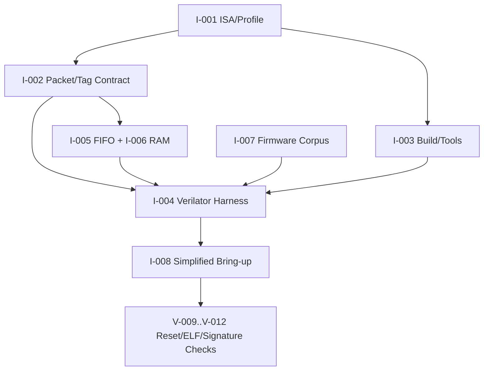

# 第0阶段：合同、工具链与最小可执行处理器

状态：**执行指南，不是已完成实现**。本分阶段文件供多人并行分配；所有命令、文件、测试和结果都必须等对应任务实现后产生。任何“完成”必须能引用真实 Git commit/artifact hash/日志，不凭口头状态。

## 1. 这个子系统是做什么的

ISA/profile、内部协议、构建、固件、harness、第一个可比较 trace 被冻结，后续团队不再凭口头约定工作。

## 2. 为什么存在 / 上游输入

- 上游输入：无真实处理器/固件/harness可比 trace。
- 已有依赖：architecture-review、source-inventory、primary references、三份原始报告。
- 本阶段输出：硬件集成、板级性能、advanced fabric性能结论。
- 首要原则：不允许构建出处理器但无法reference比对；不允许先写decoder再决定profile；不允许把latest工具当固定环境。

此阶段决定后续所有团队的合同。ISA负责人先冻结能力，协议负责人冻结packet和ownership，工具负责人冻结版本，固件与harness负责人用同一memory map做首个可执行对照。

## 3. 总体结构

图中的箭头是数据/控制依赖；性能策略不得在正确性前打开。每个分支可以分给不同负责人，但跨接口字段以 [implementation-plan.md](implementation-plan.md) §1.3 和本文件任务卡为准，不能各团队私改。

## 4. 团队分工与进度追踪

| Team | 负责任务 | 当前状态 | Owner | 证据链接 | 下一动作 | Blocker |
|---|---|---|---|---|---|---|
| 体系结构配置负责人 | I-001 | Not started | 待定 | 待填 artifact/commit | 读取任务卡并建立输入锁 | 待填 |
| 协议契约负责人 | I-002 | Not started | 待定 | 待填 artifact/commit | 读取任务卡并建立输入锁 | 待填 |
| 构建负责人 | I-003 | Not started | 待定 | 待填 artifact/commit | 读取任务卡并建立输入锁 | 待填 |
| Verilator harness负责人 | I-004 | Not started | 待定 | 待填 artifact/commit | 读取任务卡并建立输入锁 | 待填 |
| 基础RTL负责人 | I-005 | Not started | 待定 | 待填 artifact/commit | 读取任务卡并建立输入锁 | 待填 |
| memory wrapper负责人 | I-006 | Not started | 待定 | 待填 artifact/commit | 读取任务卡并建立输入锁 | 待填 |
| 固件负责人 | I-007 | Not started | 待定 | 待填 artifact/commit | 读取任务卡并建立输入锁 | 待填 |
| bring-up负责人 | I-008 | Not started | 待定 | 待填 artifact/commit | 读取任务卡并建立输入锁 | 待填 |
| 构建负责人 | I-003 | Not started | 待定 | 待填 artifact/commit | 读取任务卡并建立输入锁 | 待填 |
| 验证负责人 | V-001 | Not started | 待定 | 待填 artifact/commit | 读取任务卡并建立输入锁 | 待填 |
| 验证负责人 | V-002 | Not started | 待定 | 待填 artifact/commit | 读取任务卡并建立输入锁 | 待填 |
| 验证负责人 | V-003 | Not started | 待定 | 待填 artifact/commit | 读取任务卡并建立输入锁 | 待填 |
| 验证负责人 | V-004 | Not started | 待定 | 待填 artifact/commit | 读取任务卡并建立输入锁 | 待填 |
| 验证负责人 | V-005 | Not started | 待定 | 待填 artifact/commit | 读取任务卡并建立输入锁 | 待填 |
| 验证负责人 | V-006 | Not started | 待定 | 待填 artifact/commit | 读取任务卡并建立输入锁 | 待填 |
| 验证负责人 | V-007 | Not started | 待定 | 待填 artifact/commit | 读取任务卡并建立输入锁 | 待填 |
| 验证负责人 | V-008 | Not started | 待定 | 待填 artifact/commit | 读取任务卡并建立输入锁 | 待填 |
| 验证负责人 | V-009 | Not started | 待定 | 待填 artifact/commit | 读取任务卡并建立输入锁 | 待填 |
| 验证负责人 | V-010 | Not started | 待定 | 待填 artifact/commit | 读取任务卡并建立输入锁 | 待填 |
| 验证负责人 | V-011 | Not started | 待定 | 待填 artifact/commit | 读取任务卡并建立输入锁 | 待填 |
| 验证负责人 | V-012 | Not started | 待定 | 待填 artifact/commit | 读取任务卡并建立输入锁 | 待填 |

状态只能取 `Not started / Inputs locked / In progress / Blocked / Evidence complete / Accepted`。Accepted 需要阶段负责人和验证负责人同时签字；Blocked 必须写最小外部事实、影响范围、请求对象和下一日期，不写“快好了”。

## 5. 可跟踪任务卡

每张卡先给设计者/审查者看的工程合同，再给执行者看的自然语言说明。说明不是替代规格，而是告诉执行者如何按规格工作：先做什么、不能猜什么、什么时候停下来、拿什么证据证明完成。完成定义：对应 `Pass` 全部有直接证据，相关负控制也工作；不是“代码写完”或“仿真曾跑过”。

### I-001 — 冻结 ISA 与平台配置 manifest

- **负责/门禁**：体系结构配置负责人；ISA/profile 冻结。
- **前置依赖**：none；仍受 implementation-plan 集成依赖表约束。
- **做什么**：定义 config/profile schema：XLEN、extensions、privilege、VLEN/ELEN、hart 数、memory map、endianness、misalignment policy、CSR WARL/WPRI；逐项指定 p0/p1/p2/p3 值及来源。
- **输入数据/接口**：p0/p1/p2/p3 capability、memory/PMA、misalignment、CSR、VLEN/ELEN
- **输出与交接**：发布profiles、capability、PMA/PMP、CSR/ISA matrix
- **设计取舍**：能力交集而非并集；A/C在p1合并验收，避免只测其一
- **实现微步骤**：逐个profile列出XLEN、扩展、privilege、hart、VLEN/ELEN及来源；逐区列出RAM/MMIO、cacheability/idempotence、宽度、对齐、atomic与错误；逐项CSR列出WARL/WPRI/reset值与不可改变值；生成compiler/reference/DUT共用的机器可读manifest和说明；跑负例：广告A/C/F/D/V或非法PMA必须拒绝；reviewer确认每条宣称能力存在未来实现与V任务；经架构/验证/平台负责人三方签收版本。
- **主要阻塞风险**：提前广告扩展、CSR WARL/WPRI未定义、runtime/config漂移；阻断规则：ISA 字符串包含未实现扩展，或 memory/CSR 行为未定义。
- **验收证据**：每个 profile 可生成唯一 compiler/ref/DUT capability 交集；任何宣称指令有实现任务和验证任务。；验证口径：静态schema校验、capability交集、负例
- **失败/回退动作**：发现声明未实现时回退profile并重新冻结
- **来源覆盖**：ISA scope, configuration, SRC-01/SRC-02/SRC-03。；来源 IR-001, architecture-review.md。
- **执行者目标**：把“冻结 ISA 与平台配置 manifest”做成一个可复核的小交付：接收明确输入，产出可验证证据，并在失败时给出可回退的安全状态。
- **执行者须知**：先做合同和最小正确实现，再做优化。不要从相邻任务猜字段；所有身份、credit、reset、flush和背压边界必须来自本任务及implementation-plan。完成前至少覆盖一个正常路径、一个资源冲突和一个取消/恢复路径。
- **建议工作顺序**：逐个profile列出XLEN、扩展、privilege、hart、VLEN/ELEN及来源；逐区列出RAM/MMIO、cacheability/idempotence、宽度、对齐、atomic与错误；逐项CSR列出WARL/WPRI/reset值与不可改变值；生成compiler/reference/DUT共用的机器可读manifest和说明；跑负例：广告A/C/F/D/V或非法PMA必须拒绝；reviewer确认每条宣称能力存在未来实现与V任务；经架构/验证/平台负责人三方签收版本。
- **可接受完成**：每个 profile 可生成唯一 compiler/ref/DUT capability 交集；任何宣称指令有实现任务和验证任务。
- **何时停止求助**：主要风险是提前广告扩展、CSR WARL/WPRI未定义、runtime/config漂移。遇到缺失输入、互相矛盾的合同、工具/板卡不可用或验证无法区分错误时，不要猜测；把任务标为Blocked，记录最小事实和需要的上游决定。
- **交付说明**：交接时提供输出：发布profiles、capability、PMA/PMP、CSR/ISA matrix；同时更新Track Log、状态、证据hash/commit和下一步。不要把未验证的半成品标成Evidence complete。
- **参考资料**：IR-001, architecture-review.md。
- **进度日志**：2026-09-29 规划生成——未开始；后续每次状态变化追加日期、commit/artifact、证据和下一步。

### I-002 — 冻结 packet、tag、credit、memory contract

- **负责/门禁**：协议契约负责人；packet/tag/credit冻结。
- **前置依赖**：I-001；仍受 implementation-plan 集成依赖表约束。
- **做什么**：为每接口写 transfer/cancel/response 状态表、owner、字段宽度推导；穷举 reset、flush、same-cycle accept/cancel、tag wrap 与 late response 组合。
- **输入数据/接口**：接口、状态机、identity生命周期、ABA上界
- **输出与交接**：interfaces、ownership/lifetime、watchdog
- **设计取舍**：先可证明ownership再性能字段压缩
- **实现微步骤**：逐接口画状态转移并指定owner；为每类tag推导容量与最长存活上界；列宏/uop/attempt/PRF/transaction的分离字段；定义cancel、credit return、flush同周期优先级；构造tiny-tag ABA反例清单；由验证团队审查wait graph与可观察性；冻结schema并生成后续包类型需求。
- **主要阻塞风险**：tag wrap、last-uop误完成、重复credit、旧响应别名；阻断规则：用 ROB index 或 PC 单独识别在途指令，或取消没有 credit 回收路径。
- **验收证据**：每类资源有唯一分配/释放事件；所有响应可判定 live/killed/stale，模数比较上界可计算。；验证口径：协议状态表、反例清单、contract review
- **失败/回退动作**：重新收紧接口字段或选择全drain恢复
- **来源覆盖**：uOP identity, ownership, recovery, network。；来源 architecture-review.md, SRC-01/SRC-02/SRC-03。
- **执行者目标**：把“冻结 packet、tag、credit、memory contract”做成一个可复核的小交付：接收明确输入，产出可验证证据，并在失败时给出可回退的安全状态。
- **执行者须知**：先做合同和最小正确实现，再做优化。不要从相邻任务猜字段；所有身份、credit、reset、flush和背压边界必须来自本任务及implementation-plan。完成前至少覆盖一个正常路径、一个资源冲突和一个取消/恢复路径。
- **建议工作顺序**：逐接口画状态转移并指定owner；为每类tag推导容量与最长存活上界；列宏/uop/attempt/PRF/transaction的分离字段；定义cancel、credit return、flush同周期优先级；构造tiny-tag ABA反例清单；由验证团队审查wait graph与可观察性；冻结schema并生成后续包类型需求。
- **可接受完成**：每类资源有唯一分配/释放事件；所有响应可判定 live/killed/stale，模数比较上界可计算。
- **何时停止求助**：主要风险是tag wrap、last-uop误完成、重复credit、旧响应别名。遇到缺失输入、互相矛盾的合同、工具/板卡不可用或验证无法区分错误时，不要猜测；把任务标为Blocked，记录最小事实和需要的上游决定。
- **交付说明**：交接时提供输出：interfaces、ownership/lifetime、watchdog；同时更新Track Log、状态、证据hash/commit和下一步。不要把未验证的半成品标成Evidence complete。
- **参考资料**：architecture-review.md, SRC-01/SRC-02/SRC-03。
- **进度日志**：2026-09-29 规划生成——未开始；后续每次状态变化追加日期、commit/artifact、证据和下一步。

### I-003 — 实现可复现构建与能力拒绝

- **负责/门禁**：构建负责人；构建环境锁定。
- **前置依赖**：I-001, I-002；仍受 implementation-plan 集成依赖表约束。
- **做什么**：创建 file list、Make targets、配置生成器与 manifest；构建不同 profile 到独立目录；未知 feature/缺依赖立即失败而不 fallback。
- **输入数据/接口**：filelist、profile、tool/container、config生成
- **输出与交接**：Make/config/manifest/环境证据
- **设计取舍**：原生SV独立build与XiangShan环境隔离
- **实现微步骤**：创建通用filelist和profile生成器；固定Make目标、输出目录和manifest格式；为缺失工具/未知profile定义退出码；记录工具版本、license能力、输入hash；在错误profile/缺工具/输出不可写下跑负控制；与H工具锁和V环境校准对账；发布可复现build contract。
- **主要阻塞风险**：主机PATH、latest镜像、未实现config静默fallback；阻断规则：使用宿主机隐含路径、自动改 ISA 或遗留旧二进制冒充新构建。
- **验收证据**：清空可再生 build 后两次构建使用相同输入清单；非法 profile 确定非零且不产出成功 manifest。；验证口径：clean build、hash对账、负例退出
- **失败/回退动作**：锁定更小依赖或补生成器，不放宽profile
- **来源覆盖**：reproducibility, tooling, portability。；来源 validation-plan.md, platform-plan.md。
- **执行者目标**：把“可复现构建与能力拒绝”做成一个可复核的小交付：接收明确输入，产出可验证证据，并在失败时给出可回退的安全状态。
- **执行者须知**：先做合同和最小正确实现，再做优化。不要从相邻任务猜字段；所有身份、credit、reset、flush和背压边界必须来自本任务及implementation-plan。完成前至少覆盖一个正常路径、一个资源冲突和一个取消/恢复路径。
- **建议工作顺序**：创建通用filelist和profile生成器；固定Make目标、输出目录和manifest格式；为缺失工具/未知profile定义退出码；记录工具版本、license能力、输入hash；在错误profile/缺工具/输出不可写下跑负控制；与H工具锁和V环境校准对账；发布可复现build contract。
- **可接受完成**：清空可再生 build 后两次构建使用相同输入清单；非法 profile 确定非零且不产出成功 manifest。
- **何时停止求助**：主要风险是主机PATH、latest镜像、未实现config静默fallback。遇到缺失输入、互相矛盾的合同、工具/板卡不可用或验证无法区分错误时，不要猜测；把任务标为Blocked，记录最小事实和需要的上游决定。
- **交付说明**：交接时提供输出：Make/config/manifest/环境证据；同时更新Track Log、状态、证据hash/commit和下一步。不要把未验证的半成品标成Evidence complete。
- **参考资料**：validation-plan.md, platform-plan.md。
- **进度日志**：2026-09-29 规划生成——未开始；后续每次状态变化追加日期、commit/artifact、证据和下一步。

### I-004 — 实现 Verilator harness 与失败输出

- **负责/门禁**：Verilator harness负责人；基础可执行仿真。
- **前置依赖**：I-003；仍受 implementation-plan 集成依赖表约束。
- **做什么**：实现 ELF/bin loader、tick、reset、memory endpoint、seed、cycle limit、retire callback、first-mismatch dump；运行 CASE=harness.reset_load_exit 和 timeout/invalid-image 负例。
- **输入数据/接口**：时钟、reset、tick、ELF、退出、trace event
- **输出与交接**：eaf-sim、event stream、run manifest
- **设计取舍**：默认SV探针canonical event，Difftest包装器后置
- **实现微步骤**：实现顶层构造/reset/load/单cycle eval/final；接canonical retire callback和结果输出；实现平台/seed/event/max-cycle选项；接入ELF合法性检查与退出码；运行reset、timeout、坏ELF、注入mismatch负例；记录完整命令和可重放manifest；与V-009/V-010校准采样语义。
- **主要阻塞风险**：eval重复计数、超时假成功、错误ELF继续执行；阻断规则：仅 UART 打印即当正确，或 reference adapter 未连接仍返回 PASS。
- **验收证据**：指定镜像地址和 reset PC 一致；PASS 签名与退出码配对；超时/无 retire/损坏 ELF 均非零。；验证口径：负控制、timeout、replay、已知程序
- **失败/回退动作**：退到无timing时钟模型并修复采样
- **来源覆盖**：Verilator, functional prototype, reproducibility。；来源 validation-plan.md。
- **执行者目标**：把“Verilator harness 与失败输出”做成一个可复核的小交付：接收明确输入，产出可验证证据，并在失败时给出可回退的安全状态。
- **执行者须知**：先做合同和最小正确实现，再做优化。不要从相邻任务猜字段；所有身份、credit、reset、flush和背压边界必须来自本任务及implementation-plan。完成前至少覆盖一个正常路径、一个资源冲突和一个取消/恢复路径。
- **建议工作顺序**：实现顶层构造/reset/load/单cycle eval/final；接canonical retire callback和结果输出；实现平台/seed/event/max-cycle选项；接入ELF合法性检查与退出码；运行reset、timeout、坏ELF、注入mismatch负例；记录完整命令和可重放manifest；与V-009/V-010校准采样语义。
- **可接受完成**：指定镜像地址和 reset PC 一致；PASS 签名与退出码配对；超时/无 retire/损坏 ELF 均非零。
- **何时停止求助**：主要风险是eval重复计数、超时假成功、错误ELF继续执行。遇到缺失输入、互相矛盾的合同、工具/板卡不可用或验证无法区分错误时，不要猜测；把任务标为Blocked，记录最小事实和需要的上游决定。
- **交付说明**：交接时提供输出：eaf-sim、event stream、run manifest；同时更新Track Log、状态、证据hash/commit和下一步。不要把未验证的半成品标成Evidence complete。
- **参考资料**：validation-plan.md。
- **进度日志**：2026-09-29 规划生成——未开始；后续每次状态变化追加日期、commit/artifact、证据和下一步。

### I-005 — 实现 valid/ready FIFO 与 skid buffer

- **负责/门禁**：基础RTL负责人；packet transfer可靠。
- **前置依赖**：I-002, I-003；仍受 implementation-plan 集成依赖表约束。
- **做什么**：实现不依赖 vendor primitive 的 FIFO；运行 CASE=fifo.backpressure，交错 push/pop/full/empty/reset，检查 payload 稳定和 packet 序列。
- **输入数据/接口**：valid/ready、深度、payload稳定、reset
- **输出与交接**：rtl/common FIFO、property harness
- **设计取舍**：先透明可审计FIFO再性能skid优化
- **实现微步骤**：定义FIFO时序接口与深度参数；实现push/pop/full/empty和稳定payload；编写逐拍序列/覆盖率测试；用小深度模型做packet conservation；加入reset/cancel组合反例；lint/elaboration并记录警告disposition；供所有下游模块统一复用。
- **主要阻塞风险**：满丢包、空出包、reset旧valid、credit双返；阻断规则：full 时丢包、empty 时伪出包、reset 后旧 valid 泄露。
- **验收证据**：有界模型中 accepted=emitted+buffered+explicitly_cancelled，任何 stall 不改变头项。；验证口径：单元序列、invariant、lint
- **失败/回退动作**：禁用高级skid，仅保留透明FIFO
- **来源覆盖**：buffering, packet conservation。；来源 architecture-review.md。
- **执行者目标**：把“valid/ready FIFO 与 skid buffer”做成一个可复核的小交付：接收明确输入，产出可验证证据，并在失败时给出可回退的安全状态。
- **执行者须知**：先做合同和最小正确实现，再做优化。不要从相邻任务猜字段；所有身份、credit、reset、flush和背压边界必须来自本任务及implementation-plan。完成前至少覆盖一个正常路径、一个资源冲突和一个取消/恢复路径。
- **建议工作顺序**：定义FIFO时序接口与深度参数；实现push/pop/full/empty和稳定payload；编写逐拍序列/覆盖率测试；用小深度模型做packet conservation；加入reset/cancel组合反例；lint/elaboration并记录警告disposition；供所有下游模块统一复用。
- **可接受完成**：有界模型中 accepted=emitted+buffered+explicitly_cancelled，任何 stall 不改变头项。
- **何时停止求助**：主要风险是满丢包、空出包、reset旧valid、credit双返。遇到缺失输入、互相矛盾的合同、工具/板卡不可用或验证无法区分错误时，不要猜测；把任务标为Blocked，记录最小事实和需要的上游决定。
- **交付说明**：交接时提供输出：rtl/common FIFO、property harness；同时更新Track Log、状态、证据hash/commit和下一步。不要把未验证的半成品标成Evidence complete。
- **参考资料**：architecture-review.md。
- **进度日志**：2026-09-29 规划生成——未开始；后续每次状态变化追加日期、commit/artifact、证据和下一步。

### I-006 — 实现同步 RAM 抽象与碰撞语义

- **负责/门禁**：memory wrapper负责人；RAM语义统一。
- **前置依赖**：I-002, I-003；仍受 implementation-plan 集成依赖表约束。
- **做什么**：固定 synchronous read、byte write、无全阵列 reset；外置 valid 清零；显式 bypass/serialize 同地址 read/write；运行 CASE=ram.collision_matrix。
- **输入数据/接口**：同步读、byte enable、mixed-port collision、latency
- **输出与交接**：RAM wrapper、semantics matrix
- **设计取舍**：通用接口+平台wrapper，不假设vendor默认模式
- **实现微步骤**：定义generic RAM port/latency contract；列出每目标part支持/禁止RAM模式；实现仲裁和已知读写竞争语义；开发碰撞/边距矩阵测试；比较Verilator、厂商模型和综合推断；从common RTL删除vendor直接实例；生成适配器输出给PRF/cache/ROM。
- **主要阻塞风险**：simulation组合读、X传播差异、意外全FF reset；阻断规则：仿真组合读而实板一拍读，或依赖未定义 mixed-port 行为。
- **验收证据**：全地址碰撞/不同 byte mask 的可观察结果符合一种固定 contract，平台变化只改变 wrapper。；验证口径：collision cases、inference reports、H-004
- **失败/回退动作**：禁有风险端口或外置仲裁
- **来源覆盖**：PRF/cache storage, FPGA/ASIC portability。；来源 platform-plan.md。
- **执行者目标**：把“同步 RAM 抽象与碰撞语义”做成一个可复核的小交付：接收明确输入，产出可验证证据，并在失败时给出可回退的安全状态。
- **执行者须知**：先做合同和最小正确实现，再做优化。不要从相邻任务猜字段；所有身份、credit、reset、flush和背压边界必须来自本任务及implementation-plan。完成前至少覆盖一个正常路径、一个资源冲突和一个取消/恢复路径。
- **建议工作顺序**：定义generic RAM port/latency contract；列出每目标part支持/禁止RAM模式；实现仲裁和已知读写竞争语义；开发碰撞/边距矩阵测试；比较Verilator、厂商模型和综合推断；从common RTL删除vendor直接实例；生成适配器输出给PRF/cache/ROM。
- **可接受完成**：全地址碰撞/不同 byte mask 的可观察结果符合一种固定 contract，平台变化只改变 wrapper。
- **何时停止求助**：主要风险是simulation组合读、X传播差异、意外全FF reset。遇到缺失输入、互相矛盾的合同、工具/板卡不可用或验证无法区分错误时，不要猜测；把任务标为Blocked，记录最小事实和需要的上游决定。
- **交付说明**：交接时提供输出：RAM wrapper、semantics matrix；同时更新Track Log、状态、证据hash/commit和下一步。不要把未验证的半成品标成Evidence complete。
- **参考资料**：platform-plan.md。
- **进度日志**：2026-09-29 规划生成——未开始；后续每次状态变化追加日期、commit/artifact、证据和下一步。

### I-007 — 实现 bare-metal 镜像与 host oracle

- **负责/门禁**：固件负责人；可独立执行的ELF。
- **前置依赖**：I-001, I-004；仍受 implementation-plan 集成依赖表约束。
- **做什么**：写 crt0/linker/trap handler、tohost/UART result record、signature 区；生成 add/branch/load/store/mul 程序，host 独立计算整数结果。
- **输入数据/接口**：crt0、linker、trap、BSS、signature、tohost
- **输出与交接**：ELF corpus、loader map、expected signatures
- **设计取舍**：freestanding无隐藏libc，先p0
- **实现微步骤**：定义memory map和section/entry/stack；写启动、异常入口和结果协议；生成12程序corpus及三输入；独立host oracle计算结果和guard bytes；审计反汇编仅含p0指令；运行装载和错误输入负例；冻结ELF hash给DUT/XiangShan/reference。
- **主要阻塞风险**：默认工具链偷用C/A/F、entry/BSS不一致、host oracle不独立；阻断规则：只比较 DUT 自己产生的期望值，或 hidden libc 引入不支持指令。
- **验收证据**：reference 与 harness loader 对 segment/BSS/entry 一致；错一个 signature byte 必须失败。；验证口径：反汇编、加载字节、独立签名
- **失败/回退动作**：重编译固定march/flags或修订平台
- **来源覆盖**：executable functional prototype, firmware。；来源 IR-001, validation-plan.md。
- **执行者目标**：把“bare-metal 镜像与 host oracle”做成一个可复核的小交付：接收明确输入，产出可验证证据，并在失败时给出可回退的安全状态。
- **执行者须知**：先做合同和最小正确实现，再做优化。不要从相邻任务猜字段；所有身份、credit、reset、flush和背压边界必须来自本任务及implementation-plan。完成前至少覆盖一个正常路径、一个资源冲突和一个取消/恢复路径。
- **建议工作顺序**：定义memory map和section/entry/stack；写启动、异常入口和结果协议；生成12程序corpus及三输入；独立host oracle计算结果和guard bytes；审计反汇编仅含p0指令；运行装载和错误输入负例；冻结ELF hash给DUT/XiangShan/reference。
- **可接受完成**：reference 与 harness loader 对 segment/BSS/entry 一致；错一个 signature byte 必须失败。
- **何时停止求助**：主要风险是默认工具链偷用C/A/F、entry/BSS不一致、host oracle不独立。遇到缺失输入、互相矛盾的合同、工具/板卡不可用或验证无法区分错误时，不要猜测；把任务标为Blocked，记录最小事实和需要的上游决定。
- **交付说明**：交接时提供输出：ELF corpus、loader map、expected signatures；同时更新Track Log、状态、证据hash/commit和下一步。不要把未验证的半成品标成Evidence complete。
- **参考资料**：IR-001, validation-plan.md。
- **进度日志**：2026-09-29 规划生成——未开始；后续每次状态变化追加日期、commit/artifact、证据和下一步。

### I-008 — 实现简化标量语义路径作为 bring-up 对照

- **负责/门禁**：bring-up负责人；简化执行路径校准。
- **前置依赖**：I-004, I-007；仍受 implementation-plan 集成依赖表约束。
- **做什么**：以单 issue/no speculation 的简化 RTL 路径执行相同 corpus，并接通 retire events；它只用于定位前端/ISA 错误，不替代后续 OoO fabric。
- **输入数据/接口**：单issue/no-speculation、retire trace、initial programs
- **输出与交接**：baseline RTL、first trace、limit statement
- **设计取舍**：仅定位前端/ISA错误，绝不替代p0
- **实现微步骤**：实现直接fetch/decode/execute/commit路径；关闭speculation但仍通过event接口；跑RV64I/M directed小集；对比独立reference每个event；翻转rd/PC验证检测器；显式标注build为bring-up only；完成后停止在此配置接受性能结果。
- **主要阻塞风险**：把software/simplified path当最终core、忽略dynamic；阻断规则：以软件解释器的通过结果申报处理器 RTL 完成。
- **验收证据**：directed p0 corpus 与 reference 逐 architectural event 一致；故意翻转 rd/PC 被 comparator 捕获。；验证口径：reference diff、negative control
- **失败/回退动作**：修复decoder/memory后重跑，不扩大scope
- **来源覆盖**：scalar baseline, differential integration。；来源 validation-plan.md, SRC-01/SRC-02/SRC-03。
- **执行者目标**：把“简化标量语义路径作为 bring-up 对照”做成一个可复核的小交付：接收明确输入，产出可验证证据，并在失败时给出可回退的安全状态。
- **执行者须知**：先做合同和最小正确实现，再做优化。不要从相邻任务猜字段；所有身份、credit、reset、flush和背压边界必须来自本任务及implementation-plan。完成前至少覆盖一个正常路径、一个资源冲突和一个取消/恢复路径。
- **建议工作顺序**：实现直接fetch/decode/execute/commit路径；关闭speculation但仍通过event接口；跑RV64I/M directed小集；对比独立reference每个event；翻转rd/PC验证检测器；显式标注build为bring-up only；完成后停止在此配置接受性能结果。
- **可接受完成**：directed p0 corpus 与 reference 逐 architectural event 一致；故意翻转 rd/PC 被 comparator 捕获。
- **何时停止求助**：主要风险是把software/simplified path当最终core、忽略dynamic。遇到缺失输入、互相矛盾的合同、工具/板卡不可用或验证无法区分错误时，不要猜测；把任务标为Blocked，记录最小事实和需要的上游决定。
- **交付说明**：交接时提供输出：baseline RTL、first trace、limit statement；同时更新Track Log、状态、证据hash/commit和下一步。不要把未验证的半成品标成Evidence complete。
- **参考资料**：validation-plan.md, SRC-01/SRC-02/SRC-03。
- **进度日志**：2026-09-29 规划生成——未开始；后续每次状态变化追加日期、commit/artifact、证据和下一步。

### I-003 — 实现可复现构建与能力拒绝

- **负责/门禁**：构建负责人；构建环境锁定。
- **前置依赖**：I-001, I-002；仍受 implementation-plan 集成依赖表约束。
- **做什么**：创建 file list、Make targets、配置生成器与 manifest；构建不同 profile 到独立目录；未知 feature/缺依赖立即失败而不 fallback。
- **输入数据/接口**：filelist、profile、tool/container、config生成
- **输出与交接**：Make/config/manifest/环境证据
- **设计取舍**：原生SV独立build与XiangShan环境隔离
- **实现微步骤**：创建通用filelist和profile生成器；固定Make目标、输出目录和manifest格式；为缺失工具/未知profile定义退出码；记录工具版本、license能力、输入hash；在错误profile/缺工具/输出不可写下跑负控制；与H工具锁和V环境校准对账；发布可复现build contract。
- **主要阻塞风险**：主机PATH、latest镜像、未实现config静默fallback；阻断规则：使用宿主机隐含路径、自动改 ISA 或遗留旧二进制冒充新构建。
- **验收证据**：清空可再生 build 后两次构建使用相同输入清单；非法 profile 确定非零且不产出成功 manifest。；验证口径：clean build、hash对账、负例退出
- **失败/回退动作**：锁定更小依赖或补生成器，不放宽profile
- **来源覆盖**：reproducibility, tooling, portability。；来源 validation-plan.md, platform-plan.md。
- **执行者目标**：把“可复现构建与能力拒绝”做成一个可复核的小交付：接收明确输入，产出可验证证据，并在失败时给出可回退的安全状态。
- **执行者须知**：先做合同和最小正确实现，再做优化。不要从相邻任务猜字段；所有身份、credit、reset、flush和背压边界必须来自本任务及implementation-plan。完成前至少覆盖一个正常路径、一个资源冲突和一个取消/恢复路径。
- **建议工作顺序**：创建通用filelist和profile生成器；固定Make目标、输出目录和manifest格式；为缺失工具/未知profile定义退出码；记录工具版本、license能力、输入hash；在错误profile/缺工具/输出不可写下跑负控制；与H工具锁和V环境校准对账；发布可复现build contract。
- **可接受完成**：清空可再生 build 后两次构建使用相同输入清单；非法 profile 确定非零且不产出成功 manifest。
- **何时停止求助**：主要风险是主机PATH、latest镜像、未实现config静默fallback。遇到缺失输入、互相矛盾的合同、工具/板卡不可用或验证无法区分错误时，不要猜测；把任务标为Blocked，记录最小事实和需要的上游决定。
- **交付说明**：交接时提供输出：Make/config/manifest/环境证据；同时更新Track Log、状态、证据hash/commit和下一步。不要把未验证的半成品标成Evidence complete。
- **参考资料**：validation-plan.md, platform-plan.md。
- **进度日志**：2026-09-29 规划生成——未开始；后续每次状态变化追加日期、commit/artifact、证据和下一步。

### V-001 — 冻结上游闭包与来源账本

- **负责/门禁**：验证负责人；验证证据闭合。
- **前置依赖**：none；仍受 implementation-plan 集成依赖表约束。
- **做什么**：在实施环境收集 XiangShan 递归 gitlinks、NEMU config、参考库构建 provenance、工具版本及文件 hash；解析容器 tag 为 digest，区分源码重建库与预编译库。
- **输入数据/接口**：第 1 节 SHA、上游主源、架构 ISA 决议里程碑。
- **输出与交接**：不含浮动 branch/latest 的 source-lock 清单及来源证据。
- **设计取舍**：有限集合/模型边界明确，不用样本数冒充形式证明
- **实现微步骤**：冻结该任务输入、版本与capability交集；展开有限case/seed/budget manifest；实现真实检查器并接入负控制；执行正控制和故障注入；闭合计划/执行/通过/失败/unsupported计数；最小化失败并建立replay；阶段负责人签收或阻断后续gate。
- **主要阻塞风险**：静默skip、mock echo、空覆盖率、把deferred当成功；阻断规则：缺失子模块、配置混版、库来源未知、tag/digest 不一致或靠主机偶然 PATH。
- **验收证据**：每个可执行输入都有不可变标识、来源和许可证；表内 SHA 对应实际 checkout；未核实组合明确不进入执行 gate。；验证口径：每个可执行输入都有不可变标识、来源和许可证；表内 SHA 对应实际 checkout；未核实组合明确不进入执行 gate。
- **失败/回退动作**：缺失子模块、配置混版、库来源未知、tag/digest 不一致或靠主机偶然 PATH。
- **来源覆盖**：SRC-03 §XiangShan 的工程方法很适合借鉴；可重现性。；来源 VR-001, VR-002, VR-003, VR-004, VR-008。
- **执行者目标**：把“冻结上游闭包与来源账本”做成一个可复核的小交付：接收明确输入，产出可验证证据，并在失败时给出可回退的安全状态。
- **执行者须知**：先证明检查器能抓到真实错误，再接受正例。每个测试必须物化输入/seed/期望和排除账本；不可用空套件、mock echo或静默skip取得通过。完成前加入一个负控制并保存首个差异。
- **建议工作顺序**：冻结该任务输入、版本与capability交集；展开有限case/seed/budget manifest；实现真实检查器并接入负控制；执行正控制和故障注入；闭合计划/执行/通过/失败/unsupported计数；最小化失败并建立replay；阶段负责人签收或阻断后续gate。
- **可接受完成**：每个可执行输入都有不可变标识、来源和许可证；表内 SHA 对应实际 checkout；未核实组合明确不进入执行 gate。
- **何时停止求助**：主要风险是静默skip、mock echo、空覆盖率、把deferred当成功。遇到缺失输入、互相矛盾的合同、工具/板卡不可用或验证无法区分错误时，不要猜测；把任务标为Blocked，记录最小事实和需要的上游决定。
- **交付说明**：交接时提供输出：不含浮动 branch/latest 的 source-lock 清单及来源证据。；同时更新Track Log、状态、证据hash/commit和下一步。不要把未验证的半成品标成Evidence complete。
- **参考资料**：VR-001, VR-002, VR-003, VR-004, VR-008。
- **进度日志**：2026-09-29 规划生成——未开始；后续每次状态变化追加日期、commit/artifact、证据和下一步。

### V-002 — 建立 capability 交集而非扩展并集

- **负责/门禁**：验证负责人；验证证据闭合。
- **前置依赖**：V-001；仍受 implementation-plan 集成依赖表约束。
- **做什么**：为 DUT、XiangShan、NEMU、Spike、Sail、ACT4 分别列 XLEN、扩展版本、CSR、PMP/PMA、地址宽度、VLEN/ELEN、misaligned policy、trap 可选行为；计算逐 workload 可比交集及明确 unsupported 原因。
- **输入数据/接口**：ISA/privilege/profile 决议、编译器选项、各模型精确配置。
- **输出与交接**：capability-matrix 与每 suite 的适用/拒绝集合。
- **设计取舍**：有限集合/模型边界明确，不用样本数冒充形式证明
- **实现微步骤**：冻结该任务输入、版本与capability交集；展开有限case/seed/budget manifest；实现真实检查器并接入负控制；执行正控制和故障注入；闭合计划/执行/通过/失败/unsupported计数；最小化失败并建立replay；阶段负责人签收或阻断后续gate。
- **主要阻塞风险**：静默skip、mock echo、空覆盖率、把deferred当成功；阻断规则：把 `G` 当 IM、把 upstream config 的 V/H/Sv48 当本核承诺、缺功能被误记通过。
- **验收证据**：p0 只生成 RV64IM_Zicsr_Zifencei/M-mode 程序；交集之外的测试不能执行后才悄悄 skip；后续扩展保留待验收行。；验证口径：p0 只生成 RV64IM_Zicsr_Zifencei/M-mode 程序；交集之外的测试不能执行后才悄悄 skip；后续扩展保留待验收行。
- **失败/回退动作**：把 `G` 当 IM、把 upstream config 的 V/H/Sv48 当本核承诺、缺功能被误记通过。
- **来源覆盖**：SRC-03 §最小原型应该是 Scalar Elastic Backend、§RVV 与 CPU—GPU 连续体。；来源 VR-003, VR-005, VR-006, VR-007, VR-009, VR-013。
- **执行者目标**：把“建立 capability 交集而非扩展并集”做成一个可复核的小交付：接收明确输入，产出可验证证据，并在失败时给出可回退的安全状态。
- **执行者须知**：先证明检查器能抓到真实错误，再接受正例。每个测试必须物化输入/seed/期望和排除账本；不可用空套件、mock echo或静默skip取得通过。完成前加入一个负控制并保存首个差异。
- **建议工作顺序**：冻结该任务输入、版本与capability交集；展开有限case/seed/budget manifest；实现真实检查器并接入负控制；执行正控制和故障注入；闭合计划/执行/通过/失败/unsupported计数；最小化失败并建立replay；阶段负责人签收或阻断后续gate。
- **可接受完成**：p0 只生成 RV64IM_Zicsr_Zifencei/M-mode 程序；交集之外的测试不能执行后才悄悄 skip；后续扩展保留待验收行。
- **何时停止求助**：主要风险是静默skip、mock echo、空覆盖率、把deferred当成功。遇到缺失输入、互相矛盾的合同、工具/板卡不可用或验证无法区分错误时，不要猜测；把任务标为Blocked，记录最小事实和需要的上游决定。
- **交付说明**：交接时提供输出：capability-matrix 与每 suite 的适用/拒绝集合。；同时更新Track Log、状态、证据hash/commit和下一步。不要把未验证的半成品标成Evidence complete。
- **参考资料**：VR-003, VR-005, VR-006, VR-007, VR-009, VR-013。
- **进度日志**：2026-09-29 规划生成——未开始；后续每次状态变化追加日期、commit/artifact、证据和下一步。

### V-003 — 校准隔离环境与失败退出

- **负责/门禁**：验证负责人；验证证据闭合。
- **前置依赖**：V-001；仍受 implementation-plan 集成依赖表约束。
- **做什么**：在未来实施环境建立 A/B 两套锁定环境，运行版本/帮助检查及缺库、错误架构库、无写权限输出目录三个失败场景；记录构建资源峰值但不改硬件预算。
- **输入数据/接口**：容器/主机依赖清单、未来 CLI 契约。
- **输出与交接**：环境证据包与 CLI 退出码对照。
- **设计取舍**：有限集合/模型边界明确，不用样本数冒充形式证明
- **实现微步骤**：冻结该任务输入、版本与capability交集；展开有限case/seed/budget manifest；实现真实检查器并接入负控制；执行正控制和故障注入；闭合计划/执行/通过/失败/unsupported计数；最小化失败并建立replay；阶段负责人签收或阻断后续gate。
- **主要阻塞风险**：静默skip、mock echo、空覆盖率、把deferred当成功；阻断规则：自动回退无 reference、联网获取未锁依赖、把工具 crash 记为 DUT PASS。
- **验收证据**：所有工具与锁一致；三种故障明确非零并有诊断；从空输出目录开始可独立重建同一输入集合。；验证口径：所有工具与锁一致；三种故障明确非零并有诊断；从空输出目录开始可独立重建同一输入集合。
- **失败/回退动作**：自动回退无 reference、联网获取未锁依赖、把工具 crash 记为 DUT PASS。
- **来源覆盖**：SRC-03 §FPGA 原型与验证路线；可复现宿主环境。；来源 VR-002, VR-005, VR-006, VR-007, VR-008, VR-009。
- **执行者目标**：把“校准隔离环境与失败退出”做成一个可复核的小交付：接收明确输入，产出可验证证据，并在失败时给出可回退的安全状态。
- **执行者须知**：先证明检查器能抓到真实错误，再接受正例。每个测试必须物化输入/seed/期望和排除账本；不可用空套件、mock echo或静默skip取得通过。完成前加入一个负控制并保存首个差异。
- **建议工作顺序**：冻结该任务输入、版本与capability交集；展开有限case/seed/budget manifest；实现真实检查器并接入负控制；执行正控制和故障注入；闭合计划/执行/通过/失败/unsupported计数；最小化失败并建立replay；阶段负责人签收或阻断后续gate。
- **可接受完成**：所有工具与锁一致；三种故障明确非零并有诊断；从空输出目录开始可独立重建同一输入集合。
- **何时停止求助**：主要风险是静默skip、mock echo、空覆盖率、把deferred当成功。遇到缺失输入、互相矛盾的合同、工具/板卡不可用或验证无法区分错误时，不要猜测；把任务标为Blocked，记录最小事实和需要的上游决定。
- **交付说明**：交接时提供输出：环境证据包与 CLI 退出码对照。；同时更新Track Log、状态、证据hash/commit和下一步。不要把未验证的半成品标成Evidence complete。
- **参考资料**：VR-002, VR-005, VR-006, VR-007, VR-008, VR-009。
- **进度日志**：2026-09-29 规划生成——未开始；后续每次状态变化追加日期、commit/artifact、证据和下一步。

### V-004 — 验证 NEMU ABI 与序列化布局

- **负责/门禁**：验证负责人；验证证据闭合。
- **前置依赖**：V-001, V-002, V-003；仍受 implementation-plan 集成依赖表约束。
- **做什么**：逐符号核对原型、bool/enum/struct 布局和宏；用独立状态写入/读回、已知两条算术指令及一次 store 验证方向；再加载缺符号与错误布局库确认 fail-closed。
- **输入数据/接口**：冻结 refproxy、NEMU reference 库、canonical-state 定义。
- **输出与交接**：ABI manifest、状态 round-trip、实际 reference-step 语义与负控制日志。
- **设计取舍**：有限集合/模型边界明确，不用样本数冒充形式证明
- **实现微步骤**：冻结该任务输入、版本与capability交集；展开有限case/seed/budget manifest；实现真实检查器并接入负控制；执行正控制和故障注入；闭合计划/执行/通过/失败/unsupported计数；最小化失败并建立replay；阶段负责人签收或阻断后续gate。
- **主要阻塞风险**：静默skip、mock echo、空覆盖率、把deferred当成功；阻断规则：两参数 regcpy 误接三参数 ABI、状态截断、大小相等但字段顺序错误、缺扩展符号静默忽略。
- **验收证据**：所有字段按预期读回且 reference 真正执行产生已知结果；错库在任何 DUT 执行前拒绝；不能只做 mock echo。；验证口径：所有字段按预期读回且 reference 真正执行产生已知结果；错库在任何 DUT 执行前拒绝；不能只做 mock echo。
- **失败/回退动作**：两参数 regcpy 误接三参数 ABI、状态截断、大小相等但字段顺序错误、缺扩展符号静默忽略。
- **来源覆盖**：SRC-03 §XiangShan 的工程方法很适合借鉴；reference adapter。；来源 VR-003, VR-004, VR-005。
- **执行者目标**：把“NEMU ABI 与序列化布局”做成一个可复核的小交付：接收明确输入，产出可验证证据，并在失败时给出可回退的安全状态。
- **执行者须知**：先证明检查器能抓到真实错误，再接受正例。每个测试必须物化输入/seed/期望和排除账本；不可用空套件、mock echo或静默skip取得通过。完成前加入一个负控制并保存首个差异。
- **建议工作顺序**：冻结该任务输入、版本与capability交集；展开有限case/seed/budget manifest；实现真实检查器并接入负控制；执行正控制和故障注入；闭合计划/执行/通过/失败/unsupported计数；最小化失败并建立replay；阶段负责人签收或阻断后续gate。
- **可接受完成**：所有字段按预期读回且 reference 真正执行产生已知结果；错库在任何 DUT 执行前拒绝；不能只做 mock echo。
- **何时停止求助**：主要风险是静默skip、mock echo、空覆盖率、把deferred当成功。遇到缺失输入、互相矛盾的合同、工具/板卡不可用或验证无法区分错误时，不要猜测；把任务标为Blocked，记录最小事实和需要的上游决定。
- **交付说明**：交接时提供输出：ABI manifest、状态 round-trip、实际 reference-step 语义与负控制日志。；同时更新Track Log、状态、证据hash/commit和下一步。不要把未验证的半成品标成Evidence complete。
- **参考资料**：VR-003, VR-004, VR-005。
- **进度日志**：2026-09-29 规划生成——未开始；后续每次状态变化追加日期、commit/artifact、证据和下一步。

### V-005 — 执行 XiangShan 上游环境正控制

- **负责/门禁**：验证负责人；验证证据闭合。
- **前置依赖**：V-003, V-004；仍受 implementation-plan 集成依赖表约束。
- **做什么**：未来按第 2 节原例构建并运行 XiangShan+NEMU；保存完整 build 配置、Difftest 开启证据、退出原因及首尾 commit；不将样例迁就成 p0。
- **输入数据/接口**：来源闭合的上游组合、ready-to-run coremark、上游 README 示例。
- **输出与交接**：独立 DUT-B 环境校准记录。
- **设计取舍**：有限集合/模型边界明确，不用样本数冒充形式证明
- **实现微步骤**：冻结该任务输入、版本与capability交集；展开有限case/seed/budget manifest；实现真实检查器并接入负控制；执行正控制和故障注入；闭合计划/执行/通过/失败/unsupported计数；最小化失败并建立replay；阶段负责人签收或阻断后续gate。
- **主要阻塞风险**：静默skip、mock echo、空覆盖率、把deferred当成功；阻断规则：没加载 reference、只看进程退出 0、替换 workload/配置后仍称上游原例通过。
- **验收证据**：样例按其退出协议完成、比较器确实工作且无 mismatch；结果只证明该环境路径。；验证口径：样例按其退出协议完成、比较器确实工作且无 mismatch；结果只证明该环境路径。
- **失败/回退动作**：没加载 reference、只看进程退出 0、替换 workload/配置后仍称上游原例通过。
- **来源覆盖**：SRC-03 §XiangShan 的工程方法很适合借鉴。；来源 VR-002, VR-004。
- **执行者目标**：把“执行 XiangShan 上游环境正控制”做成一个可复核的小交付：接收明确输入，产出可验证证据，并在失败时给出可回退的安全状态。
- **执行者须知**：先证明检查器能抓到真实错误，再接受正例。每个测试必须物化输入/seed/期望和排除账本；不可用空套件、mock echo或静默skip取得通过。完成前加入一个负控制并保存首个差异。
- **建议工作顺序**：冻结该任务输入、版本与capability交集；展开有限case/seed/budget manifest；实现真实检查器并接入负控制；执行正控制和故障注入；闭合计划/执行/通过/失败/unsupported计数；最小化失败并建立replay；阶段负责人签收或阻断后续gate。
- **可接受完成**：样例按其退出协议完成、比较器确实工作且无 mismatch；结果只证明该环境路径。
- **何时停止求助**：主要风险是静默skip、mock echo、空覆盖率、把deferred当成功。遇到缺失输入、互相矛盾的合同、工具/板卡不可用或验证无法区分错误时，不要猜测；把任务标为Blocked，记录最小事实和需要的上游决定。
- **交付说明**：交接时提供输出：独立 DUT-B 环境校准记录。；同时更新Track Log、状态、证据hash/commit和下一步。不要把未验证的半成品标成Evidence complete。
- **参考资料**：VR-002, VR-004。
- **进度日志**：2026-09-29 规划生成——未开始；后续每次状态变化追加日期、commit/artifact、证据和下一步。

### V-006 — 校准独立 Spike 与 Sail 语义

- **负责/门禁**：验证负责人；验证证据闭合。
- **前置依赖**：V-002, V-003；仍受 implementation-plan 集成依赖表约束。
- **做什么**：使用各模型官方 CLI/配置运行同一 ISA 交集程序，比较寄存器/签名与明确语义；记录 C++ API 或日志 adapter 的版本边界，遇分歧最小化并查规范。
- **输入数据/接口**：主线 Spike pin、Sail 0.14.1、12 个无外设依赖的小程序。
- **输出与交接**：三参考三角对照表、模型差异记录。
- **设计取舍**：有限集合/模型边界明确，不用样本数冒充形式证明
- **实现微步骤**：冻结该任务输入、版本与capability交集；展开有限case/seed/budget manifest；实现真实检查器并接入负控制；执行正控制和故障注入；闭合计划/执行/通过/失败/unsupported计数；最小化失败并建立replay；阶段负责人签收或阻断后续gate。
- **主要阻塞风险**：静默skip、mock echo、空覆盖率、把deferred当成功；阻断规则：把主线 Spike 当 NEMU ABI `.so`、默认 Sail 最大配置冒充 p0、用二比一投票解决规范争议。
- **验收证据**：12 个程序在确定性字段一致；允许差异由规范条款解释且有独立合法性检查。；验证口径：12 个程序在确定性字段一致；允许差异由规范条款解释且有独立合法性检查。
- **失败/回退动作**：把主线 Spike 当 NEMU ABI `.so`、默认 Sail 最大配置冒充 p0、用二比一投票解决规范争议。
- **来源覆盖**：SRC-03 §Retire/architectural correctness 建议。；来源 VR-005, VR-006, VR-007。
- **执行者目标**：把“校准独立 Spike 与 Sail 语义”做成一个可复核的小交付：接收明确输入，产出可验证证据，并在失败时给出可回退的安全状态。
- **执行者须知**：先证明检查器能抓到真实错误，再接受正例。每个测试必须物化输入/seed/期望和排除账本；不可用空套件、mock echo或静默skip取得通过。完成前加入一个负控制并保存首个差异。
- **建议工作顺序**：冻结该任务输入、版本与capability交集；展开有限case/seed/budget manifest；实现真实检查器并接入负控制；执行正控制和故障注入；闭合计划/执行/通过/失败/unsupported计数；最小化失败并建立replay；阶段负责人签收或阻断后续gate。
- **可接受完成**：12 个程序在确定性字段一致；允许差异由规范条款解释且有独立合法性检查。
- **何时停止求助**：主要风险是静默skip、mock echo、空覆盖率、把deferred当成功。遇到缺失输入、互相矛盾的合同、工具/板卡不可用或验证无法区分错误时，不要猜测；把任务标为Blocked，记录最小事实和需要的上游决定。
- **交付说明**：交接时提供输出：三参考三角对照表、模型差异记录。；同时更新Track Log、状态、证据hash/commit和下一步。不要把未验证的半成品标成Evidence complete。
- **参考资料**：VR-005, VR-006, VR-007。
- **进度日志**：2026-09-29 规划生成——未开始；后续每次状态变化追加日期、commit/artifact、证据和下一步。

### V-007 — 固定通用 ELF 与平台入口

- **负责/门禁**：验证负责人；验证证据闭合。
- **前置依赖**：V-002, V-006；仍受 implementation-plan 集成依赖表约束。
- **做什么**：生成 freestanding/static LP64 ELF，反汇编审计实际 ISA，固定 entry、stack、BSS、RAM、trap vector；导出 PT_LOAD 内容及 binary 转换 provenance，禁用未经审计的 libc/编译器扩展。
- **输入数据/接口**：交叉工具链、p0 平台描述、linker/startup/退出协议实现里程碑。
- **输出与交接**：兼容 ELF 契约及首个跨环境程序包。
- **设计取舍**：有限集合/模型边界明确，不用样本数冒充形式证明
- **实现微步骤**：冻结该任务输入、版本与capability交集；展开有限case/seed/budget manifest；实现真实检查器并接入负控制；执行正控制和故障注入；闭合计划/执行/通过/失败/unsupported计数；最小化失败并建立replay；阶段负责人签收或阻断后续gate。
- **主要阻塞风险**：静默skip、mock echo、空覆盖率、把deferred当成功；阻断规则：默认编译器悄悄使用 C/A/F、把用户态 ELF 当 bare-metal、假设不同 reset ROM 相同。
- **验收证据**：指令、初始化字节、entry 与终止协议均在 DUT/ref 交集；原 ELF 与转换 image 在声明加载地址的字节一致。；验证口径：指令、初始化字节、entry 与终止协议均在 DUT/ref 交集；原 ELF 与转换 image 在声明加载地址的字节一致。
- **失败/回退动作**：默认编译器悄悄使用 C/A/F、把用户态 ELF 当 bare-metal、假设不同 reset ROM 相同。
- **来源覆盖**：SRC-03 §software sees normal RISC-V、§最小原型应该是 Scalar Elastic Backend。；来源 VR-002, VR-005, VR-006, VR-007, VR-009。
- **执行者目标**：把“固定通用 ELF 与平台入口”做成一个可复核的小交付：接收明确输入，产出可验证证据，并在失败时给出可回退的安全状态。
- **执行者须知**：先证明检查器能抓到真实错误，再接受正例。每个测试必须物化输入/seed/期望和排除账本；不可用空套件、mock echo或静默skip取得通过。完成前加入一个负控制并保存首个差异。
- **建议工作顺序**：冻结该任务输入、版本与capability交集；展开有限case/seed/budget manifest；实现真实检查器并接入负控制；执行正控制和故障注入；闭合计划/执行/通过/失败/unsupported计数；最小化失败并建立replay；阶段负责人签收或阻断后续gate。
- **可接受完成**：指令、初始化字节、entry 与终止协议均在 DUT/ref 交集；原 ELF 与转换 image 在声明加载地址的字节一致。
- **何时停止求助**：主要风险是静默skip、mock echo、空覆盖率、把deferred当成功。遇到缺失输入、互相矛盾的合同、工具/板卡不可用或验证无法区分错误时，不要猜测；把任务标为Blocked，记录最小事实和需要的上游决定。
- **交付说明**：交接时提供输出：兼容 ELF 契约及首个跨环境程序包。；同时更新Track Log、状态、证据hash/commit和下一步。不要把未验证的半成品标成Evidence complete。
- **参考资料**：VR-002, VR-005, VR-006, VR-007, VR-009。
- **进度日志**：2026-09-29 规划生成——未开始；后续每次状态变化追加日期、commit/artifact、证据和下一步。

### V-008 — 冻结 architectural event 接口

- **负责/门禁**：验证负责人；验证证据闭合。
- **前置依赖**：V-002, V-004；仍受 implementation-plan 集成依赖表约束。
- **做什么**：编写每字段宽度、有效性、边界顺序与采样时刻；对两条同周期指令加 trap、store drain 的实际序列手工推导事件，分别经 SV/C++ 序列化校验。
- **输入数据/接口**：第 3 节 event schema、退休接口实现里程碑、路线 A/B 选择。
- **输出与交接**：版本化 schema、探针映射与逐步期望事件表。
- **设计取舍**：有限集合/模型边界明确，不用样本数冒充形式证明
- **实现微步骤**：冻结该任务输入、版本与capability交集；展开有限case/seed/budget manifest；实现真实检查器并接入负控制；执行正控制和故障注入；闭合计划/执行/通过/失败/unsupported计数；最小化失败并建立replay；阶段负责人签收或阻断后续gate。
- **主要阻塞风险**：静默skip、mock echo、空覆盖率、把deferred当成功；阻断规则：只暴露执行结果不暴露退休状态、多个退休共享一份错误快照、vector 被固定截为低 128 位。
- **验收证据**：每个 architectural effect 可定位到唯一 hart/指令；没有无定义字段或跨周期错位；路线 B 生成物与软件端完全同版。；验证口径：每个 architectural effect 可定位到唯一 hart/指令；没有无定义字段或跨周期错位；路线 B 生成物与软件端完全同版。
- **失败/回退动作**：只暴露执行结果不暴露退休状态、多个退休共享一份错误快照、vector 被固定截为低 128 位。
- **来源覆盖**：SRC-03 §uOP 不应该只是传统 CPU 的 micro-op、§Per-Hart Commit Domain。；来源 VR-003, VR-008, VR-011。
- **执行者目标**：把“冻结 architectural event 接口”做成一个可复核的小交付：接收明确输入，产出可验证证据，并在失败时给出可回退的安全状态。
- **执行者须知**：先证明检查器能抓到真实错误，再接受正例。每个测试必须物化输入/seed/期望和排除账本；不可用空套件、mock echo或静默skip取得通过。完成前加入一个负控制并保存首个差异。
- **建议工作顺序**：冻结该任务输入、版本与capability交集；展开有限case/seed/budget manifest；实现真实检查器并接入负控制；执行正控制和故障注入；闭合计划/执行/通过/失败/unsupported计数；最小化失败并建立replay；阶段负责人签收或阻断后续gate。
- **可接受完成**：每个 architectural effect 可定位到唯一 hart/指令；没有无定义字段或跨周期错位；路线 B 生成物与软件端完全同版。
- **何时停止求助**：主要风险是静默skip、mock echo、空覆盖率、把deferred当成功。遇到缺失输入、互相矛盾的合同、工具/板卡不可用或验证无法区分错误时，不要猜测；把任务标为Blocked，记录最小事实和需要的上游决定。
- **交付说明**：交接时提供输出：版本化 schema、探针映射与逐步期望事件表。；同时更新Track Log、状态、证据hash/commit和下一步。不要把未验证的半成品标成Evidence complete。
- **参考资料**：VR-003, VR-008, VR-011。
- **进度日志**：2026-09-29 规划生成——未开始；后续每次状态变化追加日期、commit/artifact、证据和下一步。

### V-009 — 证明 reset 与初始状态可重放

- **负责/门禁**：验证负责人；验证证据闭合。
- **前置依赖**：V-007, V-008；仍受 implementation-plan 集成依赖表约束。
- **做什么**：在 1/2/5/17 个有效时钟 reset 长度和不同解除相位运行同一程序；reset 中断正在进行的仿真并重启；分别检查 SRAM 非复位内容的初始化合同。
- **输入数据/接口**：SV reset 实现、明确同步/异步极性、平台初值。
- **输出与交接**：reset 波形片段、首条合法退休与状态证据。
- **设计取舍**：有限集合/模型边界明确，不用样本数冒充形式证明
- **实现微步骤**：冻结该任务输入、版本与capability交集；展开有限case/seed/budget manifest；实现真实检查器并接入负控制；执行正控制和故障注入；闭合计划/执行/通过/失败/unsupported计数；最小化失败并建立replay；阶段负责人签收或阻断后续gate。
- **主要阻塞风险**：静默skip、mock echo、空覆盖率、把deferred当成功；阻断规则：依赖 C++ 内存碰巧为零、reset 期间伪提交、旧事务穿越 reset 污染新 run。
- **验收证据**：reset 期间无提交/设备写；解除后 PC/权限/CSR/queue ownership 确定；同 seed 重放状态一致。；验证口径：reset 期间无提交/设备写；解除后 PC/权限/CSR/queue ownership 确定；同 seed 重放状态一致。
- **失败/回退动作**：依赖 C++ 内存碰巧为零、reset 期间伪提交、旧事务穿越 reset 污染新 run。
- **来源覆盖**：SRC-03 §Architectural State 不动态、§precise retire。；来源 VR-008, VR-011。
- **执行者目标**：把“证明 reset 与初始状态可重放”做成一个可复核的小交付：接收明确输入，产出可验证证据，并在失败时给出可回退的安全状态。
- **执行者须知**：先证明检查器能抓到真实错误，再接受正例。每个测试必须物化输入/seed/期望和排除账本；不可用空套件、mock echo或静默skip取得通过。完成前加入一个负控制并保存首个差异。
- **建议工作顺序**：冻结该任务输入、版本与capability交集；展开有限case/seed/budget manifest；实现真实检查器并接入负控制；执行正控制和故障注入；闭合计划/执行/通过/失败/unsupported计数；最小化失败并建立replay；阶段负责人签收或阻断后续gate。
- **可接受完成**：reset 期间无提交/设备写；解除后 PC/权限/CSR/queue ownership 确定；同 seed 重放状态一致。
- **何时停止求助**：主要风险是静默skip、mock echo、空覆盖率、把deferred当成功。遇到缺失输入、互相矛盾的合同、工具/板卡不可用或验证无法区分错误时，不要猜测；把任务标为Blocked，记录最小事实和需要的上游决定。
- **交付说明**：交接时提供输出：reset 波形片段、首条合法退休与状态证据。；同时更新Track Log、状态、证据hash/commit和下一步。不要把未验证的半成品标成Evidence complete。
- **参考资料**：VR-008, VR-011。
- **进度日志**：2026-09-29 规划生成——未开始；后续每次状态变化追加日期、commit/artifact、证据和下一步。

### V-010 — 校准 Verilator 时钟与采样循环

- **负责/门禁**：验证负责人；验证证据闭合。
- **前置依赖**：V-008, V-009；仍受 implementation-plan 集成依赖表约束。
- **做什么**：明确低相驱动、高相 eval、稳定后事件采样；使用 `eval()`/`final()`，需要延迟时才启用并正确推进 `--timing` 事件；逐项施加 backpressure 检查一次握手仅记录一次。
- **输入数据/接口**：C++ harness 实现里程碑、Verilator 5.052。
- **输出与交接**：单周期时间线、重复采样检测记录。
- **设计取舍**：有限集合/模型边界明确，不用样本数冒充形式证明
- **实现微步骤**：冻结该任务输入、版本与capability交集；展开有限case/seed/budget manifest；实现真实检查器并接入负控制；执行正控制和故障注入；闭合计划/执行/通过/失败/unsupported计数；最小化失败并建立replay；阶段负责人签收或阻断后续gate。
- **主要阻塞风险**：静默skip、mock echo、空覆盖率、把deferred当成功；阻断规则：eval 被误作时钟、DPI 回调出现双计数、开启 timing 后不推进 pending event、结束前漏 final。
- **验收证据**：整数时间单位固定；每次 accept/retire 与 RTL 事件一一对应；end-of-run final assertion 执行。；验证口径：整数时间单位固定；每次 accept/retire 与 RTL 事件一一对应；end-of-run final assertion 执行。
- **失败/回退动作**：eval 被误作时钟、DPI 回调出现双计数、开启 timing 后不推进 pending event、结束前漏 final。
- **来源覆盖**：SRC-03 §Elastic Latency Execution、§Completion Fabric。；来源 VR-008。
- **执行者目标**：把“校准 Verilator 时钟与采样循环”做成一个可复核的小交付：接收明确输入，产出可验证证据，并在失败时给出可回退的安全状态。
- **执行者须知**：先证明检查器能抓到真实错误，再接受正例。每个测试必须物化输入/seed/期望和排除账本；不可用空套件、mock echo或静默skip取得通过。完成前加入一个负控制并保存首个差异。
- **建议工作顺序**：冻结该任务输入、版本与capability交集；展开有限case/seed/budget manifest；实现真实检查器并接入负控制；执行正控制和故障注入；闭合计划/执行/通过/失败/unsupported计数；最小化失败并建立replay；阶段负责人签收或阻断后续gate。
- **可接受完成**：整数时间单位固定；每次 accept/retire 与 RTL 事件一一对应；end-of-run final assertion 执行。
- **何时停止求助**：主要风险是静默skip、mock echo、空覆盖率、把deferred当成功。遇到缺失输入、互相矛盾的合同、工具/板卡不可用或验证无法区分错误时，不要猜测；把任务标为Blocked，记录最小事实和需要的上游决定。
- **交付说明**：交接时提供输出：单周期时间线、重复采样检测记录。；同时更新Track Log、状态、证据hash/commit和下一步。不要把未验证的半成品标成Evidence complete。
- **参考资料**：VR-008。
- **进度日志**：2026-09-29 规划生成——未开始；后续每次状态变化追加日期、commit/artifact、证据和下一步。

### V-011 — 验证 ELF 装载与内存边界

- **负责/门禁**：验证负责人；验证证据闭合。
- **前置依赖**：V-007, V-010；仍受 implementation-plan 集成依赖表约束。
- **做什么**：对正常多 PT_LOAD/BSS/非零 entry 和损坏 magic、端序、溢出、重叠、越界、filesz>memsz、动态 ELF 逐项执行；以已知 byte pattern 检查 load/store 字节序及边界 fault。
- **输入数据/接口**：harness loader、稀疏/连续 RAM 模型、平台 PMA。
- **输出与交接**：loader case 清单与加载后内存摘要。
- **设计取舍**：有限集合/模型边界明确，不用样本数冒充形式证明
- **实现微步骤**：冻结该任务输入、版本与capability交集；展开有限case/seed/budget manifest；实现真实检查器并接入负控制；执行正控制和故障注入；闭合计划/执行/通过/失败/unsupported计数；最小化失败并建立replay；阶段负责人签收或阻断后续gate。
- **主要阻塞风险**：静默skip、mock echo、空覆盖率、把deferred当成功；阻断规则：只加载第一个 segment、忽略 ELF entry、silent truncation、错误映像继续跑。
- **验收证据**：正常段逐字节一致、BSS 为规定零、拒绝项在开始运行前 code 2；地址错误不绕回 RAM。；验证口径：正常段逐字节一致、BSS 为规定零、拒绝项在开始运行前 code 2；地址错误不绕回 RAM。
- **失败/回退动作**：只加载第一个 segment、忽略 ELF entry、silent truncation、错误映像继续跑。
- **来源覆盖**：SRC-03 §Memory Fabric；程序镜像可移植性。；来源 VR-003, VR-007, VR-008, VR-009。
- **执行者目标**：把“ELF 装载与内存边界”做成一个可复核的小交付：接收明确输入，产出可验证证据，并在失败时给出可回退的安全状态。
- **执行者须知**：先证明检查器能抓到真实错误，再接受正例。每个测试必须物化输入/seed/期望和排除账本；不可用空套件、mock echo或静默skip取得通过。完成前加入一个负控制并保存首个差异。
- **建议工作顺序**：冻结该任务输入、版本与capability交集；展开有限case/seed/budget manifest；实现真实检查器并接入负控制；执行正控制和故障注入；闭合计划/执行/通过/失败/unsupported计数；最小化失败并建立replay；阶段负责人签收或阻断后续gate。
- **可接受完成**：正常段逐字节一致、BSS 为规定零、拒绝项在开始运行前 code 2；地址错误不绕回 RAM。
- **何时停止求助**：主要风险是静默skip、mock echo、空覆盖率、把deferred当成功。遇到缺失输入、互相矛盾的合同、工具/板卡不可用或验证无法区分错误时，不要猜测；把任务标为Blocked，记录最小事实和需要的上游决定。
- **交付说明**：交接时提供输出：loader case 清单与加载后内存摘要。；同时更新Track Log、状态、证据hash/commit和下一步。不要把未验证的半成品标成Evidence complete。
- **参考资料**：VR-003, VR-007, VR-008, VR-009。
- **进度日志**：2026-09-29 规划生成——未开始；后续每次状态变化追加日期、commit/artifact、证据和下一步。

### V-012 — 固定 signature 与终止判断

- **负责/门禁**：验证负责人；验证证据闭合。
- **前置依赖**：V-010, V-011；仍受 implementation-plan 集成依赖表约束。
- **做什么**：分别运行正常完成、显式 FAIL、无退出循环、WFI、写过 PASS 后出现 mismatch、signature 越界与末尾 pending store 的程序。
- **输入数据/接口**：startup/退出协议、signature 区间、外部设备模型。
- **输出与交接**：终止状态机证据及最终 signature/memory 文件。
- **设计取舍**：有限集合/模型边界明确，不用样本数冒充形式证明
- **实现微步骤**：冻结该任务输入、版本与capability交集；展开有限case/seed/budget manifest；实现真实检查器并接入负控制；执行正控制和故障注入；闭合计划/执行/通过/失败/unsupported计数；最小化失败并建立replay；阶段负责人签收或阻断后续gate。
- **主要阻塞风险**：静默skip、mock echo、空覆盖率、把deferred当成功；阻断规则：timeout 当成功、只匹配 UART 文本、未完成 store 就读 signature、空程序算通过。
- **验收证据**：只有完整协议完成、检查器无误且规定 drain 完成才返回 0；每种错误获得约定非零。；验证口径：只有完整协议完成、检查器无误且规定 drain 完成才返回 0；每种错误获得约定非零。
- **失败/回退动作**：timeout 当成功、只匹配 UART 文本、未完成 store 就读 signature、空程序算通过。
- **来源覆盖**：SRC-03 §precise retire、§FPGA 原型与验证路线。；来源 VR-003, VR-008, VR-009。
- **执行者目标**：把“固定 signature 与终止判断”做成一个可复核的小交付：接收明确输入，产出可验证证据，并在失败时给出可回退的安全状态。
- **执行者须知**：先证明检查器能抓到真实错误，再接受正例。每个测试必须物化输入/seed/期望和排除账本；不可用空套件、mock echo或静默skip取得通过。完成前加入一个负控制并保存首个差异。
- **建议工作顺序**：冻结该任务输入、版本与capability交集；展开有限case/seed/budget manifest；实现真实检查器并接入负控制；执行正控制和故障注入；闭合计划/执行/通过/失败/unsupported计数；最小化失败并建立replay；阶段负责人签收或阻断后续gate。
- **可接受完成**：只有完整协议完成、检查器无误且规定 drain 完成才返回 0；每种错误获得约定非零。
- **何时停止求助**：主要风险是静默skip、mock echo、空覆盖率、把deferred当成功。遇到缺失输入、互相矛盾的合同、工具/板卡不可用或验证无法区分错误时，不要猜测；把任务标为Blocked，记录最小事实和需要的上游决定。
- **交付说明**：交接时提供输出：终止状态机证据及最终 signature/memory 文件。；同时更新Track Log、状态、证据hash/commit和下一步。不要把未验证的半成品标成Evidence complete。
- **参考资料**：VR-003, VR-008, VR-009。
- **进度日志**：2026-09-29 规划生成——未开始；后续每次状态变化追加日期、commit/artifact、证据和下一步。

## 6. 阶段级阻塞清单

| Blocker | 触发条件 | 立即动作 | 责任升级 |
|---|---|---|---|
| 合同缺失或互相矛盾 | 任一输入没有版本/hash，或两文档字段不一致 | 停止新增实现，更新合同并重跑负控制 | 阶段负责人 → 架构负责人 |
| 验证不能证明 | reference不支持、检查器跳过、trace溢出或空套件 | 标UNSUPPORTED并阻断相应能力，不降级为PASS | 验证负责人 |
| 资源/时序不适配 | synthesis/P&R失败、exact board不支持、ASIC库缺失 | 记录真实报告，缩小几何或请求器件/许可/库决策 | 平台/ASIC负责人 |
| 动态协议错误 | 丢/重packet、ABA、stale response、credit泄漏、drain卡死 | 冻结动态策略，回退到本卡保守模式，建立最小replay | 对应子系统负责人 |
| 性能假设被否定 | fixed/dynamic对照负收益或隐藏资源差异 | 保留负结果，关闭该策略默认路径，不把目标改成成功案例 | 研究集成负责人 |

## 7. 阶段 Track Log（持续追加）

| 日期 | 事件 | 证据 | 负责人 | 下一步 |
|---|---|---|---|---|
| 2026-09-29 | 初始团队指南由完整架构/验证/平台计划生成 | 本文件、source-inventory、references | 规划集成 | 各团队冻结输入并更新上表 |
| 2026-09-29 | 面向较小模型/新工程师补充自然语言执行说明 | 本文件任务卡的执行者目标/须知/建议顺序/停止条件 | 规划集成 | 实施团队按卡执行并回填证据 |
| 2026-09-30 | I-001 冻结 ISA/平台配置：四个 profile 的 schema、capability ladder、memory map、PMA、geometry、CSR 表全部通过校验；47/34/30/22 条负控制全部被拒绝 | `python3 tools/check_profile.py --all`、`--profile 
 --negative`；commit c455954；`results/reports/I-001-csr-m.md`、`I-001-csr-p1p3.md` | 配置/CSR | I-008 完成后由 DUT 输出 capability map |
| 2026-09-30 | I-002 冻结 packet/tag/credit/memory contract：tag 宽度与计数模数由 geometry 表达式推导并证明；16 条负控制全部被拒绝 | `python3 tools/check_contracts.py --all`、`--negative`；生成 `build/
/rtl/mosaic_id_pkg.svh` | 协议契约 | I-013/I-016 按该合同实现 |
| 2026-09-30 | I-003 可复现构建与能力拒绝：未知 profile 退出 2 且不回退；配置不合格不产出 manifest | `make check PROFILE=p0`、`make check-docs`、`tools/gen_manifest.py` | 构建 | 每次 gate 复用同一入口 |
| 2026-09-30 | I-004 Verilator harness 与失败输出：ELF loader、内存模型、事件流、周期上限、首处不匹配 | `tools/run_unit.py --case harness.*`（4 例全 PASS） | harness | I-008 接入真实 core |
| 2026-09-30 | I-005 FIFO 与 skid buffer：四个变异体在本仓库重建后全部使用例失败 | `tools/run_unit.py --case fifo.backpressure`（97069 checks）；`results/reports/I-005-fifo.md` | 基础 RTL | 下游统一复用 |
| 2026-09-30 | I-006 同步 RAM 与碰撞语义：合同为逐字节 READ-FIRST；四个变异体全部被检出；yosys 证据显示存储阵列无复位 | `tools/run_unit.py --case ram.collision_matrix`；`results/reports/I-006-ram.md` | memory wrapper | I-015 PRF、I-042 cache 复用 |
| 2026-09-30 | I-007 bare-metal 镜像与 host oracle：12 程序 × 3 输入 = 36 ELF，审计全部为 p0 指令；Spike 交叉核对 33/36 一致，并据此发现 10 个真实缺陷 | `make -C tests/programs audit`、`tools/host_oracle.py --all`、`tests/programs/audit/spike_crosscheck.py` | 固件 | **p08_misaligned 仍未决**：Spike 不实现本项目冻结的 misaligned trap 策略且无开关可改，该项对错位策略不构成证据 |
| 2026-09-30 | I-010 RV64I/M decode 与非法指令；I-011 整数 ALU、分支比较与跳转目标 | `tools/run_unit.py --case decode.rv64im_reserved`、`--case alu.boundaries`；九个变异体全部失败；`results/reports/I-010-011-decode-alu.md` | decoder/ALU | I-008 集成 |
| 2026-09-30 | 参考模型 Spike 由源码构建成功（riscv-isa-sim commit 0bff121），可执行本项目固件并输出 commit trace | `~/mosaic-ref/install/bin/spike --log-commits` | 验证 | 与 DUT 逐事件差分 |
| 2026-09-30 | 计划文档自带检查器 `docs/verification.md` 以唯一一处声明偏差运行（实现证据排除在规划文档清单之外），其余检查全部未修改 | `python3 tools/check_docs.py` | 规划集成 | 偏差在 `tools/check_docs.py` 中显式打印 |

## 8. 2026-10-02 追加：新研究入口与合同冻结门

**本节是当前状态解释的权威追加，不改写历史记录。** 第2节“无真实处理器”和第4节 `Not started` 是规划生成时的输入/分工快照，不能当作当前状态；当前接受范围以 [`implementation_status.json`](../config/status/implementation_status.json) 的逐项证据、最新 [`PROGRESS.md`](../results/PROGRESS.md) 和对应 report 为准，`REVISION.md` 也可能落后于后续修复。本节不重算交付数量、不撤销既有交付、不把研究设想加入能力广告。

`New document(2).txt` 的 MPP/IMC、L-path/T-path、criticality/locality、register cache、shadow window/runahead、dataflow fusion、压缩 vector 表示和 bottleneck controller 全部是**新提案**。研究子卡使用 MP-01..MP-08、EF-01..EF-06、VX-01..VX-04，嵌在现有工作包和阶段内，不新增 I/V/H ID；原 98 I、90 V、51 H（239 包）及原卡 `Inputs/Action/Outputs/Pass/Fail/Depends` 保持不变。细粒度顺序与责任见 [实施计划 §13](implementation-plan.md)，语义验收见 [验证计划 §10](validation-plan.md)。

### 8.1 先关闭实际缺陷，再锁新增协议

协议负责人和验证负责人先收取当前 defect replay，而不是重新假设“只有 I-001–I-006 已实现”。有界 tag/宽度、双宽退休顺序、独立 RVV reference/adapter、实际 memory ownership/QoS 集成和 PMU 事件映射必须分别有可观察证据；原有 unit PASS 不能证明新增路径已连入 core。保留 held insert 的退休缺陷记录，未闭合不得以 fusion 扩大提交窗口。无 vector oracle 时不允许用 DUT 生成 golden signature。QoS 的 unit scheduler 与 core 的单 outstanding ownership mux 必须由唯一 memory owner 决定组合合同，不能再暗中叠一套路由/优先级模型。

### 8.2 冻结字段、权威来源与生命周期

| 合同增量 | 冻结字段与权威来源 | 生命周期及必须拒绝的情形 | Owner / 初始状态 |
|---|---|---|---|
| MPP memory intent | hart/domain、fetch sequence+generation、原 PC/原 bits/length、load/store/size、rs1/rs2/immediate、branch epoch、prediction confidence、instruction/code generation；predecode 只是提示，full decode 是合法性权威 | 检测→可丢弃预测→真实 decode 匹配；跨 fetch block/C 边界和 fault 必须保留原身份，非法/不支持编码不发请求；满队列直接 drop，不反压真实前端 | 前端+memory 协议负责人 / PROPOSED |
| `MemoryPreviewToken` | token slot+generation、hart/security domain、fetch identity、PC、spec epoch、ASID/VMID/translation root/context generation、effective privilege/SUM/MXR/MPRV、PredVA/PA/line/offset/size、memory type/PMA/PMP、permission generation、target tile/owner generation、MSHR ID+generation、data location/ready、line/sector version、dependence hint；宽度从并发量与最大晚到寿命推导 | CREATED→ADMITTED→WAITING/READY→真实 AGU/权限/LSQ/version 校验→CONSUMED 或 INVALIDATED/DROPPED→回收；redirect/reset/fence/context/owner change 均使旧关联失效；晚到数据只能命中完整身份，不得复活旧 token；generation wrap 前 drain/ack 或有 ABA 上界证明 | memory+协议负责人 / BLOCKED（依赖宽度、权限与回收合同） |
| IMC/共享 MSHR | request class demand/PTW/preview/helper/ownership、完整 context/permission key、line/sector、waiter ID+generation、age、reservation/credit、cancel 状态、error completion | 合并只允许语义兼容的请求，每 waiter 独立回收；取消一个不取消其他合法 waiter；需求与合法 PTW 保留服务下界，preview 饱和/低信心即 drop；error 不成为有效 cache/L0 数据 | memory owner / BLOCKED（依赖实际 QoS 接入） |
| L/T 与 register cache | criticality/shape/locality 是 hint；source physical tag+generation、producer hart/domain、owner/route generation、value-valid、source-lifetime/read pin、PRF durable acknowledgement | L-path 保持固定短本地链，T-path 承担可容忍远程延迟的工作；hint 错误只改变性能；RC eviction/kill/reallocation 不得丢失仍活跃的值，PRF/ROB 权威不转移给 RC | fabric+rename/PRF owner / PROPOSED |
| Fusion / compressed vector / helper | packet ID+generation、有序 member macro/ROB identities 与原 PC、每 member destination/exception/fflags/store authorization；vector descriptor snapshot/vl/vtype/vstart/mask、representation tag+payload+materialization boundary；helper domain/lease/credit/kill epoch | 多条 architectural identity 不合为一个退休边界；vector 保留 element partial progress；helper 不提交、无 architectural store/CSR/trap；资源切换 STOP_ADMIT→DRAIN→ACK→PUBLISH，取消和 credit exactly once | scalar/vector/fabric 各原 owner / BLOCKED（依赖语义与恢复证据） |

基线 preview **仅限合法 TLB-hit、cacheable 且幂等的普通内存**，重新检查有效权限/PMP/PMA；TLB miss 直接 drop，不发 PTW，不修改 PTE A/D，也不提前使 store/MMIO/AMO/CSR 可见。后续 PTW/ownership/early-consume 是独立后置模式，不能从字段已经列出推断已经支持。私有 L0 不能消除共享 cache、PTW、互连或带宽侧信道；严格安全模式先关闭预测和 helper，另行验收后才允许更强策略。

### 8.3 子卡交接和证据轨迹

每个研究子卡逐微步骤记录：`Subcard / Parent I,V,H / Stage section / Owner role / Status / Locked inputs+hash / Required fields+lifecycle / Dependency verdict / Positive+negative cases / First divergence+replay / Artifact hash / Reviewer / Next gate`。初始只允许 `PROPOSED`（设计待冻结）或 `BLOCKED`（前提未闭合）；这两个标签不是原任务表 Accepted，也不是 delivered ledger 项。负责人角色是明确责任域，个人尚未签收必须写“尚无个人签收”；尚无实现/测试证据必须写“无研究实现证据”，不能填猜测的 PASS 或性能数字。

未来冻结时保留原接口版本校验和 unknown/unsupported 的失败关闭，新增字段须同时覆盖 RTL tap、host schema、codec 和 adapter；保留被真实激活的负控制，编译失败/路径未激活不能算捕获故障。本次仅追加设计合同，未运行任何构建、测试、lint、formatter 或检查器。
