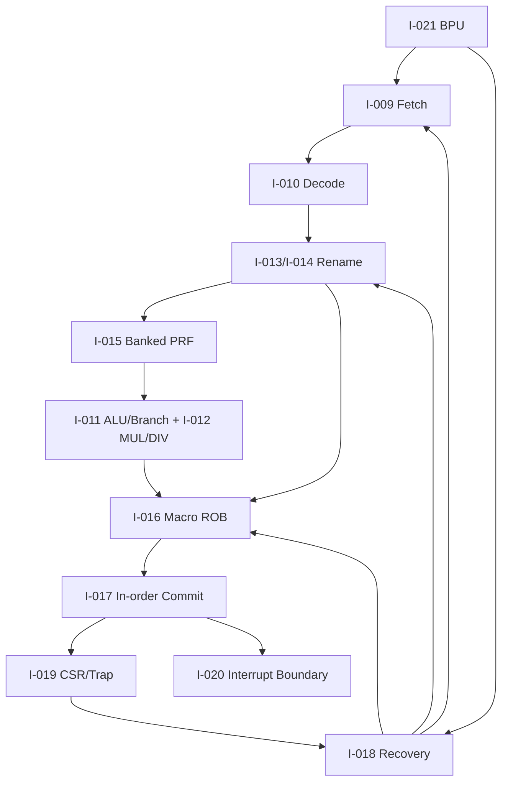

# 第1阶段：标量前端、Rename、ROB、恢复与精确提交

状态：**执行指南，不是已完成实现**。本分阶段文件供多人并行分配；所有命令、文件、测试和结果都必须等对应任务实现后产生。任何“完成”必须能引用真实 Git commit/artifact hash/日志，不凭口头状态。

## 1. 这个子系统是做什么的

一个单hart标量控制域能按程序序退休、处理精确trap/interrupt，并在branch/recovery下保持物理资源守恒。

## 2. 为什么存在 / 上游输入

- 上游输入：S0的合同和最小执行路径。
- 已有依赖：I-008、ISA/CSR规范、冻结packet协议。
- 本阶段输出：执行织构和内存推测；性能预测收益。
- 首要原则：阶段可以开始顺序单hart，但p0 gate必须等动态fabric与基础memory。分支恢复是最高风险点：不能以全清PRF或简单epoch杀死老load。

fetch/decode团队提供原始指令；rename/ROB团队保持唯一owner；commit团队只根据architectural边界产生event；CSR/interrupt团队确保错误路径不改变状态。

## 3. 总体结构

图中的箭头是数据/控制依赖；性能策略不得在正确性前打开。每个分支可以分给不同负责人，但跨接口字段以 [implementation-plan.md](implementation-plan.md) §1.3 和本文件任务卡为准，不能各团队私改。

## 4. 团队分工与进度追踪

| Team | 负责任务 | 当前状态 | Owner | 证据链接 | 下一动作 | Blocker |
|---|---|---|---|---|---|---|
| fetch负责人 | I-009 | Not started | 待定 | 待填 artifact/commit | 读取任务卡并建立输入锁 | 待填 |
| decoder负责人 | I-010 | Not started | 待定 | 待填 artifact/commit | 读取任务卡并建立输入锁 | 待填 |
| ALU/branch负责人 | I-011 | Not started | 待定 | 待填 artifact/commit | 读取任务卡并建立输入锁 | 待填 |
| M扩展负责人 | I-012 | Not started | 待定 | 待填 artifact/commit | 读取任务卡并建立输入锁 | 待填 |
| rename负责人 | I-013 | Not started | 待定 | 待填 artifact/commit | 读取任务卡并建立输入锁 | 待填 |
| rename负责人 | I-014 | Not started | 待定 | 待填 artifact/commit | 读取任务卡并建立输入锁 | 待填 |
| PRF负责人 | I-015 | Not started | 待定 | 待填 artifact/commit | 读取任务卡并建立输入锁 | 待填 |
| ROB负责人 | I-016 | Not started | 待定 | 待填 artifact/commit | 读取任务卡并建立输入锁 | 待填 |
| commit负责人 | I-017 | Not started | 待定 | 待填 artifact/commit | 读取任务卡并建立输入锁 | 待填 |
| recovery负责人 | I-018 | Not started | 待定 | 待填 artifact/commit | 读取任务卡并建立输入锁 | 待填 |
| CSR/trap负责人 | I-019 | Not started | 待定 | 待填 artifact/commit | 读取任务卡并建立输入锁 | 待填 |
| interrupt负责人 | I-020 | Not started | 待定 | 待填 artifact/commit | 读取任务卡并建立输入锁 | 待填 |
| BPU负责人 | I-021 | Not started | 待定 | 待填 artifact/commit | 读取任务卡并建立输入锁 | 待填 |
| 验证负责人 | V-013 | Not started | 待定 | 待填 artifact/commit | 读取任务卡并建立输入锁 | 待填 |
| 验证负责人 | V-014 | Not started | 待定 | 待填 artifact/commit | 读取任务卡并建立输入锁 | 待填 |
| 验证负责人 | V-015 | Not started | 待定 | 待填 artifact/commit | 读取任务卡并建立输入锁 | 待填 |
| 验证负责人 | V-016 | Not started | 待定 | 待填 artifact/commit | 读取任务卡并建立输入锁 | 待填 |
| 验证负责人 | V-017 | Not started | 待定 | 待填 artifact/commit | 读取任务卡并建立输入锁 | 待填 |
| 验证负责人 | V-021 | Not started | 待定 | 待填 artifact/commit | 读取任务卡并建立输入锁 | 待填 |
| 验证负责人 | V-022 | Not started | 待定 | 待填 artifact/commit | 读取任务卡并建立输入锁 | 待填 |
| 验证负责人 | V-025 | Not started | 待定 | 待填 artifact/commit | 读取任务卡并建立输入锁 | 待填 |
| 验证负责人 | V-026 | Not started | 待定 | 待填 artifact/commit | 读取任务卡并建立输入锁 | 待填 |
| 验证负责人 | V-027 | Not started | 待定 | 待填 artifact/commit | 读取任务卡并建立输入锁 | 待填 |
| 验证负责人 | V-030 | Not started | 待定 | 待填 artifact/commit | 读取任务卡并建立输入锁 | 待填 |
| 验证负责人 | V-041 | Not started | 待定 | 待填 artifact/commit | 读取任务卡并建立输入锁 | 待填 |
| 验证负责人 | V-043 | Not started | 待定 | 待填 artifact/commit | 读取任务卡并建立输入锁 | 待填 |
| 验证负责人 | V-044 | Not started | 待定 | 待填 artifact/commit | 读取任务卡并建立输入锁 | 待填 |

状态只能取 `Not started / Inputs locked / In progress / Blocked / Evidence complete / Accepted`。Accepted 需要阶段负责人和验证负责人同时签字；Blocked 必须写最小外部事实、影响范围、请求对象和下一日期，不写“快好了”。

## 5. 可跟踪任务卡

每张卡先给设计者/审查者看的工程合同，再给执行者看的自然语言说明。说明不是替代规格，而是告诉执行者如何按规格工作：先做什么、不能猜什么、什么时候停下来、拿什么证据证明完成。完成定义：对应 `Pass` 全部有直接证据，相关负控制也工作；不是“代码写完”或“仿真曾跑过”。

### I-009 — 实现有界 fetch 请求与 redirect

- **负责/门禁**：fetch负责人；正确取指边界。
- **前置依赖**：I-002, I-005, I-008；仍受 implementation-plan 集成依赖表约束。
- **做什么**：实现最多固定数量未返回取指；redirect 后停止旧 decode，晚到 response 按 request generation 丢弃；运行 CASE=fetch.redirect_late_response。
- **输入数据/接口**：PC、request ID、generation、redirect、fault
- **输出与交接**：fetch engine、PC event metadata
- **设计取舍**：有界outstanding fetch，牺牲带宽换恢复清晰
- **实现微步骤**：实现PC/request表和generation；定义redirect时停止decode/允许response丢弃；处理fetch fault和跨fetch行边界；实现late response过滤；跑redirect+乱序返回stress；保存PC/original bits给decode/ROB；由V-016独立复核。
- **主要阻塞风险**：旧response穿越redirect、跨行fault错误、request别名；阻断规则：flush 后旧 cache line 重入 decoder 或覆盖新 request slot。
- **验收证据**：任意返回次序下 retire PC 流与 oracle 一致，错误路径 fetch fault 不产生 architectural trap。；验证口径：乱序返回、redirect stress、fault cases
- **失败/回退动作**：保守到每次一取指
- **来源覆盖**：frontend, epoch recovery。；来源 IR-001, architecture-review.md。
- **执行者目标**：把“有界 fetch 请求与 redirect”做成一个可复核的小交付：接收明确输入，产出可验证证据，并在失败时给出可回退的安全状态。
- **执行者须知**：先做合同和最小正确实现，再做优化。不要从相邻任务猜字段；所有身份、credit、reset、flush和背压边界必须来自本任务及implementation-plan。完成前至少覆盖一个正常路径、一个资源冲突和一个取消/恢复路径。
- **建议工作顺序**：实现PC/request表和generation；定义redirect时停止decode/允许response丢弃；处理fetch fault和跨fetch行边界；实现late response过滤；跑redirect+乱序返回stress；保存PC/original bits给decode/ROB；由V-016独立复核。
- **可接受完成**：任意返回次序下 retire PC 流与 oracle 一致，错误路径 fetch fault 不产生 architectural trap。
- **何时停止求助**：主要风险是旧response穿越redirect、跨行fault错误、request别名。遇到缺失输入、互相矛盾的合同、工具/板卡不可用或验证无法区分错误时，不要猜测；把任务标为Blocked，记录最小事实和需要的上游决定。
- **交付说明**：交接时提供输出：fetch engine、PC event metadata；同时更新Track Log、状态、证据hash/commit和下一步。不要把未验证的半成品标成Evidence complete。
- **参考资料**：IR-001, architecture-review.md。
- **进度日志**：2026-09-29 规划生成——未开始；后续每次状态变化追加日期、commit/artifact、证据和下一步。

### I-010 — 实现 RV64I/M decode 与非法指令

- **负责/门禁**：decoder负责人；RV64IM编码正确。
- **前置依赖**：I-009；仍受 implementation-plan 集成依赖表约束。
- **做什么**：写 opcode/funct/immediate 表与每类 macro-uOP；枚举保留 encoding、RV64 W 指令、shift upper bits、M 分支；运行 CASE=decode.rv64im_reserved。
- **输入数据/接口**：opcode/funct/immediate、原始bits、illegal
- **输出与交接**：decoder、macro-uOP输入
- **设计取舍**：严格encoding，不做相似指令fallback
- **实现微步骤**：生成opcode/funct分类表；实现立即数和rv64W语义；逐项列举保留encoding/错误优先级；保留instruction bits/PC/length；跑合法族和保留族枚举；对decode异常输出精确cause/tval；与reference/Sail对比结果。
- **主要阻塞风险**：非法funct当合法、W语义错误、原始PC丢失；阻断规则：非法 funct 退化成 ADD 或丢失 trap 的原 PC/指令值。
- **验收证据**：全合法 encoding family 映射到正确 class；未启用 A/C/F/D/V 不执行任何 side effect。；验证口径：directed decode suite、Sail对照
- **失败/回退动作**：退回仅RV64I最小合法子集重新扩展
- **来源覆盖**：decode, macro-uOP expansion。；来源 IR-001。
- **执行者目标**：把“RV64I/M decode 与非法指令”做成一个可复核的小交付：接收明确输入，产出可验证证据，并在失败时给出可回退的安全状态。
- **执行者须知**：先做合同和最小正确实现，再做优化。不要从相邻任务猜字段；所有身份、credit、reset、flush和背压边界必须来自本任务及implementation-plan。完成前至少覆盖一个正常路径、一个资源冲突和一个取消/恢复路径。
- **建议工作顺序**：生成opcode/funct分类表；实现立即数和rv64W语义；逐项列举保留encoding/错误优先级；保留instruction bits/PC/length；跑合法族和保留族枚举；对decode异常输出精确cause/tval；与reference/Sail对比结果。
- **可接受完成**：全合法 encoding family 映射到正确 class；未启用 A/C/F/D/V 不执行任何 side effect。
- **何时停止求助**：主要风险是非法funct当合法、W语义错误、原始PC丢失。遇到缺失输入、互相矛盾的合同、工具/板卡不可用或验证无法区分错误时，不要猜测；把任务标为Blocked，记录最小事实和需要的上游决定。
- **交付说明**：交接时提供输出：decoder、macro-uOP输入；同时更新Track Log、状态、证据hash/commit和下一步。不要把未验证的半成品标成Evidence complete。
- **参考资料**：IR-001。
- **进度日志**：2026-09-29 规划生成——未开始；后续每次状态变化追加日期、commit/artifact、证据和下一步。

### I-011 — 实现整数 ALU 与分支目标计算

- **负责/门禁**：ALU/branch负责人；基础FU正确。
- **前置依赖**：I-010；仍受 implementation-plan 集成依赖表约束。
- **做什么**：实现 ALU、signed/unsigned compare、JAL/JALR/branch；运行 CASE=alu.boundaries，覆盖 0、全一、MIN/MAX、W sign-extension、JALR bit0 清零及 target alignment。
- **输入数据/接口**：add/shift/compare/W、branch/JAL/JALR
- **输出与交接**：ALU/branch unit、FU protocol
- **设计取舍**：优先位级正确，后优化时序
- **实现微步骤**：实现位宽清晰的ALU operations；实现branch条件/目标/JAL link；覆盖0、±1、MIN/MAX、shift边界；覆盖aligned/misaligned target policy；跑随机tagged handshake；加入同周期完成碰撞测试；由V-025对照reference。
- **主要阻塞风险**：移位宽度、signed compare、JALR bit0、W sign；阻断规则：移位量宽度、signed compare 或 W 结果符号扩展错误。
- **验收证据**：边界向量和固定随机种子结果与独立模型完全一致。；验证口径：boundary/random、negative injection
- **失败/回退动作**：禁优化路径，保留单功能管线
- **来源覆盖**：scalar FUs, branch execution。；来源 IR-001。
- **执行者目标**：把“整数 ALU 与分支目标计算”做成一个可复核的小交付：接收明确输入，产出可验证证据，并在失败时给出可回退的安全状态。
- **执行者须知**：先做合同和最小正确实现，再做优化。不要从相邻任务猜字段；所有身份、credit、reset、flush和背压边界必须来自本任务及implementation-plan。完成前至少覆盖一个正常路径、一个资源冲突和一个取消/恢复路径。
- **建议工作顺序**：实现位宽清晰的ALU operations；实现branch条件/目标/JAL link；覆盖0、±1、MIN/MAX、shift边界；覆盖aligned/misaligned target policy；跑随机tagged handshake；加入同周期完成碰撞测试；由V-025对照reference。
- **可接受完成**：边界向量和固定随机种子结果与独立模型完全一致。
- **何时停止求助**：主要风险是移位宽度、signed compare、JALR bit0、W sign。遇到缺失输入、互相矛盾的合同、工具/板卡不可用或验证无法区分错误时，不要猜测；把任务标为Blocked，记录最小事实和需要的上游决定。
- **交付说明**：交接时提供输出：ALU/branch unit、FU protocol；同时更新Track Log、状态、证据hash/commit和下一步。不要把未验证的半成品标成Evidence complete。
- **参考资料**：IR-001。
- **进度日志**：2026-09-29 规划生成——未开始；后续每次状态变化追加日期、commit/artifact、证据和下一步。

### I-012 — 实现可取消 MUL/DIV

- **负责/门禁**：M扩展负责人；长延迟FU可取消。
- **前置依赖**：I-011, I-005；仍受 implementation-plan 集成依赖表约束。
- **做什么**：实现 iterative 单元和 busy/result handshake；测试 divide-by-zero、MIN/-1、signed high multiply、W variants、每个迭代位置 flush。
- **输入数据/接口**：iterative MUL/DIV、busy、result credit、cancel
- **输出与交接**：MUL/DIV unit、cancellation evidence
- **设计取舍**：先慢且正确，后除法优化
- **实现微步骤**：实现M操作状态机和结果协议；为启动预留terminal result credit；实现flush/kill和generation检查；覆盖M边界与W变体；在每迭代位置注入cancel；重启动后跑reuse测试；由V-026验收。
- **主要阻塞风险**：divide-by-zero、MIN/-1、cancel迟结果、credit leak；阻断规则：long-latency 单元在结果 FIFO full 时丢结果，或 cancelled operation 永久占用。
- **验收证据**：所有 corner result 与 reference 相同；flush 后 credit 回收且晚结果不写新 owner。；验证口径：edge matrix、cancel stress
- **失败/回退动作**：串行到单次一次，仍保留真实FU
- **来源覆盖**：variable-latency FU, stale completion。；来源 IR-001, architecture-review.md。
- **执行者目标**：把“可取消 MUL/DIV”做成一个可复核的小交付：接收明确输入，产出可验证证据，并在失败时给出可回退的安全状态。
- **执行者须知**：先做合同和最小正确实现，再做优化。不要从相邻任务猜字段；所有身份、credit、reset、flush和背压边界必须来自本任务及implementation-plan。完成前至少覆盖一个正常路径、一个资源冲突和一个取消/恢复路径。
- **建议工作顺序**：实现M操作状态机和结果协议；为启动预留terminal result credit；实现flush/kill和generation检查；覆盖M边界与W变体；在每迭代位置注入cancel；重启动后跑reuse测试；由V-026验收。
- **可接受完成**：所有 corner result 与 reference 相同；flush 后 credit 回收且晚结果不写新 owner。
- **何时停止求助**：主要风险是divide-by-zero、MIN/-1、cancel迟结果、credit leak。遇到缺失输入、互相矛盾的合同、工具/板卡不可用或验证无法区分错误时，不要猜测；把任务标为Blocked，记录最小事实和需要的上游决定。
- **交付说明**：交接时提供输出：MUL/DIV unit、cancellation evidence；同时更新Track Log、状态、证据hash/commit和下一步。不要把未验证的半成品标成Evidence complete。
- **参考资料**：IR-001, architecture-review.md。
- **进度日志**：2026-09-29 规划生成——未开始；后续每次状态变化追加日期、commit/artifact、证据和下一步。

### I-013 — 实现 RAT/free-list 与 x0

- **负责/门禁**：rename负责人；单宽物理分配正确。
- **前置依赖**：I-002, I-006, I-010；仍受 implementation-plan 集成依赖表约束。
- **做什么**：写 allocation/free/update；x0 不分配真实 destination；检测 free-list exhaustion，运行 CASE=rename.single_width_ownership。
- **输入数据/接口**：RAT、free-list、PRF、x0、old mapping
- **输出与交接**：single-wide rename、PRF lifecycle
- **设计取舍**：x0特例与all-or-none分配
- **实现微步骤**：实现speculative/committed maps；实现free-list入出队/计数；分配ROB/PRF/IQ/LSQ atomic handshake；记录new/old mappings；覆盖free-list空/满和重复rd；跑ownership序列不变量；准备双宽旁路需求。
- **主要阻塞风险**：double-free、free-before-last-use、x0写；阻断规则：当 free-list 空仍接收写 rd 指令，或 old mapping 提前释放。
- **验收证据**：每 physical register 精确处于 free 或一个合法 live ownership；x0 永远读零。；验证口径：ownership invariants、negative mutation
- **失败/回退动作**：降低rename宽度到一
- **来源覆盖**：rename, register lifetime。；来源 architecture-review.md。
- **执行者目标**：把“RAT/free-list 与 x0”做成一个可复核的小交付：接收明确输入，产出可验证证据，并在失败时给出可回退的安全状态。
- **执行者须知**：先做合同和最小正确实现，再做优化。不要从相邻任务猜字段；所有身份、credit、reset、flush和背压边界必须来自本任务及implementation-plan。完成前至少覆盖一个正常路径、一个资源冲突和一个取消/恢复路径。
- **建议工作顺序**：实现speculative/committed maps；实现free-list入出队/计数；分配ROB/PRF/IQ/LSQ atomic handshake；记录new/old mappings；覆盖free-list空/满和重复rd；跑ownership序列不变量；准备双宽旁路需求。
- **可接受完成**：每 physical register 精确处于 free 或一个合法 live ownership；x0 永远读零。
- **何时停止求助**：主要风险是double-free、free-before-last-use、x0写。遇到缺失输入、互相矛盾的合同、工具/板卡不可用或验证无法区分错误时，不要猜测；把任务标为Blocked，记录最小事实和需要的上游决定。
- **交付说明**：交接时提供输出：single-wide rename、PRF lifecycle；同时更新Track Log、状态、证据hash/commit和下一步。不要把未验证的半成品标成Evidence complete。
- **参考资料**：architecture-review.md。
- **进度日志**：2026-09-29 规划生成——未开始；后续每次状态变化追加日期、commit/artifact、证据和下一步。

### I-014 — 实现双宽 rename 同周期依赖

- **负责/门禁**：rename负责人；双宽同周期映射。
- **前置依赖**：I-013；仍受 implementation-plan 集成依赖表约束。
- **做什么**：为第二条源/目的依赖第一条加 bypass；atomic group 接收防止半分配；运行 CASE=rename.same_cycle_chain 覆盖 RAW/WAW/WAR/x0/仅剩一 free tag。
- **输入数据/接口**：same-cycle RAW/WAW/WAR、partial allocation
- **输出与交接**：2-wide rename、allocation rollback
- **设计取舍**：两指令组接受或全部不接受
- **实现微步骤**：给第二instruction接入第一map bypass；处理rd==rs1/rs2和两rd相同；all-or-none资源检查；覆盖仅剩一个free tag；注入第一指令trap边界；跑same-cycle矩阵；由V-027复核。
- **主要阻塞风险**：第二条拿到旧mapping、半组分配、free-list误回收；阻断规则：部分 dispatch stall 后 mapping/free-list 与 ROB 不一致。
- **验收证据**：第二条使用正确新 mapping，两个 WAW 的 old tags 在各自合法 commit 时释放，无同 tag 双分配。；验证口径：same-cycle suite、stress
- **失败/回退动作**：返回单宽并保持接口
- **来源覆盖**：superscalar rename, allocation atomicity。；来源 architecture-review.md, SRC-02。
- **执行者目标**：把“双宽 rename 同周期依赖”做成一个可复核的小交付：接收明确输入，产出可验证证据，并在失败时给出可回退的安全状态。
- **执行者须知**：先做合同和最小正确实现，再做优化。不要从相邻任务猜字段；所有身份、credit、reset、flush和背压边界必须来自本任务及implementation-plan。完成前至少覆盖一个正常路径、一个资源冲突和一个取消/恢复路径。
- **建议工作顺序**：给第二instruction接入第一map bypass；处理rd==rs1/rs2和两rd相同；all-or-none资源检查；覆盖仅剩一个free tag；注入第一指令trap边界；跑same-cycle矩阵；由V-027复核。
- **可接受完成**：第二条使用正确新 mapping，两个 WAW 的 old tags 在各自合法 commit 时释放，无同 tag 双分配。
- **何时停止求助**：主要风险是第二条拿到旧mapping、半组分配、free-list误回收。遇到缺失输入、互相矛盾的合同、工具/板卡不可用或验证无法区分错误时，不要猜测；把任务标为Blocked，记录最小事实和需要的上游决定。
- **交付说明**：交接时提供输出：2-wide rename、allocation rollback；同时更新Track Log、状态、证据hash/commit和下一步。不要把未验证的半成品标成Evidence complete。
- **参考资料**：architecture-review.md, SRC-02。
- **进度日志**：2026-09-29 规划生成——未开始；后续每次状态变化追加日期、commit/artifact、证据和下一步。

### I-015 — 实现 banked PRF 与 operand collector

- **负责/门禁**：PRF负责人；bank/收集正确。
- **前置依赖**：I-006, I-014；仍受 implementation-plan 集成依赖表约束。
- **做什么**：实现 bank decode/read arbiter/collector；对冲突多周期收集而不假定端口；运行 CASE=prf.read_bank_collision 与 same-cycle WB/read。
- **输入数据/接口**：4 banks、1R1W、collector、WB/read collision
- **输出与交接**：banked PRF、operand collector
- **设计取舍**：不足端口多周期收集，不假装全带宽
- **实现微步骤**：建立tag到bank/row映射；实现读请求仲裁和收集状态；实现同步读延迟和collision语义；跟踪source generation和ready；覆盖两source同bank、WB同址；跑backpressure/cancel组合；由V-027复核。
- **主要阻塞风险**：bank冲突误ready、未写值读出、generation混淆；阻断规则：bank conflict 被当作 ready，或仅 simulation 读出初始化零掩盖未定义读。
- **验收证据**：所有 accepted operand 属于正确 physical generation；stall/backpressure 不重复消费或使用未写值。；验证口径：collision/invariant suites
- **失败/回退动作**：增加仲裁周期或单collector
- **来源覆盖**：banked PRF, dynamic read ports。；来源 architecture-review.md, platform-plan.md。
- **执行者目标**：把“banked PRF 与 operand collector”做成一个可复核的小交付：接收明确输入，产出可验证证据，并在失败时给出可回退的安全状态。
- **执行者须知**：先做合同和最小正确实现，再做优化。不要从相邻任务猜字段；所有身份、credit、reset、flush和背压边界必须来自本任务及implementation-plan。完成前至少覆盖一个正常路径、一个资源冲突和一个取消/恢复路径。
- **建议工作顺序**：建立tag到bank/row映射；实现读请求仲裁和收集状态；实现同步读延迟和collision语义；跟踪source generation和ready；覆盖两source同bank、WB同址；跑backpressure/cancel组合；由V-027复核。
- **可接受完成**：所有 accepted operand 属于正确 physical generation；stall/backpressure 不重复消费或使用未写值。
- **何时停止求助**：主要风险是bank冲突误ready、未写值读出、generation混淆。遇到缺失输入、互相矛盾的合同、工具/板卡不可用或验证无法区分错误时，不要猜测；把任务标为Blocked，记录最小事实和需要的上游决定。
- **交付说明**：交接时提供输出：banked PRF、operand collector；同时更新Track Log、状态、证据hash/commit和下一步。不要把未验证的半成品标成Evidence complete。
- **参考资料**：architecture-review.md, platform-plan.md。
- **进度日志**：2026-09-29 规划生成——未开始；后续每次状态变化追加日期、commit/artifact、证据和下一步。

### I-016 — 实现 architectural ROB 与 macro completion

- **负责/门禁**：ROB负责人；macro completion闭合。
- **前置依赖**：I-014, I-005；仍受 implementation-plan 集成依赖表约束。
- **做什么**：分配一个 macro descriptor，记录子 uOP 数/bitmap/exception；运行 CASE=rob.out_of_order_children，最后编号先到、重复到、flush/wrap 都覆盖。
- **输入数据/接口**：ROB slot/generation、uOP bitmap、exception
- **输出与交接**：ROB core、macro event
- **设计取舍**：descriptor/bitmap替代仅last-uop信号
- **实现微步骤**：分配macro descriptor和generation；记录expansion_closed与expected bitmap；接收乱序/重复completion；追踪最早exception/需要replay；覆盖ROB wrap与flush；跑out-of-order children matrix；由V-013复核。
- **主要阻塞风险**：duplicate completion、wrap别名、exception丢失；阻断规则：看见 last-uOP 就退休，或仅按 arrival count 误吞重复包。
- **验收证据**：仅所有必需子操作满足条件才 complete；重复包不重复计数，index wrap 不复用旧 generation。；验证口径：completion matrix、wrap stress
- **失败/回退动作**：每个macro单uOP保守实现
- **来源覆盖**：ROB, elastic useful-work window。；来源 architecture-review.md, SRC-01/SRC-03。
- **执行者目标**：把“architectural ROB 与 macro completion”做成一个可复核的小交付：接收明确输入，产出可验证证据，并在失败时给出可回退的安全状态。
- **执行者须知**：先做合同和最小正确实现，再做优化。不要从相邻任务猜字段；所有身份、credit、reset、flush和背压边界必须来自本任务及implementation-plan。完成前至少覆盖一个正常路径、一个资源冲突和一个取消/恢复路径。
- **建议工作顺序**：分配macro descriptor和generation；记录expansion_closed与expected bitmap；接收乱序/重复completion；追踪最早exception/需要replay；覆盖ROB wrap与flush；跑out-of-order children matrix；由V-013复核。
- **可接受完成**：仅所有必需子操作满足条件才 complete；重复包不重复计数，index wrap 不复用旧 generation。
- **何时停止求助**：主要风险是duplicate completion、wrap别名、exception丢失。遇到缺失输入、互相矛盾的合同、工具/板卡不可用或验证无法区分错误时，不要猜测；把任务标为Blocked，记录最小事实和需要的上游决定。
- **交付说明**：交接时提供输出：ROB core、macro event；同时更新Track Log、状态、证据hash/commit和下一步。不要把未验证的半成品标成Evidence complete。
- **参考资料**：architecture-review.md, SRC-01/SRC-03。
- **进度日志**：2026-09-29 规划生成——未开始；后续每次状态变化追加日期、commit/artifact、证据和下一步。

### I-017 — 实现 in-order retire 与 committed map

- **负责/门禁**：commit负责人；每hart顺序退休。
- **前置依赖**：I-016, I-015；仍受 implementation-plan 集成依赖表约束。
- **做什么**：实现最多双 retire，禁止越过未完成/异常 head；更新 committed RAT、释放 old mapping、产生 V retire events；运行 CASE=commit.head_block_and_dual。
- **输入数据/接口**：head、value-visible、store authorization、committed map
- **输出与交接**：architectural commit、event stream
- **设计取舍**：最多双retire但严格oldest-first
- **实现微步骤**：定义retire资格四事件；实现slot顺序和x0检查；更新committed RAT并释放old mapping；授权store但不把visibility混为commit；导出canonical event；覆盖slot0 fault/同rd双commit；由V-013/V-014验收。
- **主要阻塞风险**：执行完成当退休、younger越fault、old mapping错误释放；阻断规则：execution-done 当作 value-visible，或 younger instruction 越过 pending fault。
- **验收证据**：每 hart order 严增且与参考逐事件一致；两条同 rd commit 顺序正确。；验证口径：trace diff、fault boundary
- **失败/回退动作**：每周期单退休
- **来源覆盖**：precise retirement, Difftest interface。；来源 validation-plan.md, architecture-review.md。
- **执行者目标**：把“in-order retire 与 committed map”做成一个可复核的小交付：接收明确输入，产出可验证证据，并在失败时给出可回退的安全状态。
- **执行者须知**：先做合同和最小正确实现，再做优化。不要从相邻任务猜字段；所有身份、credit、reset、flush和背压边界必须来自本任务及implementation-plan。完成前至少覆盖一个正常路径、一个资源冲突和一个取消/恢复路径。
- **建议工作顺序**：定义retire资格四事件；实现slot顺序和x0检查；更新committed RAT并释放old mapping；授权store但不把visibility混为commit；导出canonical event；覆盖slot0 fault/同rd双commit；由V-013/V-014验收。
- **可接受完成**：每 hart order 严增且与参考逐事件一致；两条同 rd commit 顺序正确。
- **何时停止求助**：主要风险是执行完成当退休、younger越fault、old mapping错误释放。遇到缺失输入、互相矛盾的合同、工具/板卡不可用或验证无法区分错误时，不要猜测；把任务标为Blocked，记录最小事实和需要的上游决定。
- **交付说明**：交接时提供输出：architectural commit、event stream；同时更新Track Log、状态、证据hash/commit和下一步。不要把未验证的半成品标成Evidence complete。
- **参考资料**：validation-plan.md, architecture-review.md。
- **进度日志**：2026-09-29 规划生成——未开始；后续每次状态变化追加日期、commit/artifact、证据和下一步。

### I-018 — 实现 branch checkpoint 与精确恢复

- **负责/门禁**：recovery负责人；精确分支恢复。
- **前置依赖**：I-017, I-011；仍受 implementation-plan 集成依赖表约束。
- **做什么**：选择初始保守恢复法（committed map + surviving-prefix 重建或完整 checkpoint）；实现 oldest redirect 优先；运行 CASE=recovery.nested_branch_full_queues。
- **输入数据/接口**：checkpoint、ROB/IQ/LSQ/FU、generation
- **输出与交接**：recovery FSM、generation policy
- **设计取舍**：先committed map+survivor重建，避免snapshot漏洞
- **实现微步骤**：建立branch checkpoint和age边界；同时处理RAT/free-list/ROB/IQ/LSQ；保留older delayed completion；撤销younger allocation和credit；处理oldest redirect优先；跑嵌套/满队列/同周期异常；由V-030/V-029复核。
- **主要阻塞风险**：杀死older slow op、free-list泄漏、restore竞争；阻断规则：通过清空整个 PRF/free-list 绕开 ownership，或 kill 所有旧 epoch 导致 older head 死锁。
- **验收证据**：mispredict、older exception、同周期 allocation 组合后全部 live tags/credits 守恒；older slow result 仍可完成。；验证口径：nested branch、stale completion
- **失败/回退动作**：全pipeline drain恢复
- **来源覆盖**：speculation, branch recovery, epoch rules。；来源 architecture-review.md。
- **执行者目标**：把“branch checkpoint 与精确恢复”做成一个可复核的小交付：接收明确输入，产出可验证证据，并在失败时给出可回退的安全状态。
- **执行者须知**：先做合同和最小正确实现，再做优化。不要从相邻任务猜字段；所有身份、credit、reset、flush和背压边界必须来自本任务及implementation-plan。完成前至少覆盖一个正常路径、一个资源冲突和一个取消/恢复路径。
- **建议工作顺序**：建立branch checkpoint和age边界；同时处理RAT/free-list/ROB/IQ/LSQ；保留older delayed completion；撤销younger allocation和credit；处理oldest redirect优先；跑嵌套/满队列/同周期异常；由V-030/V-029复核。
- **可接受完成**：mispredict、older exception、同周期 allocation 组合后全部 live tags/credits 守恒；older slow result 仍可完成。
- **何时停止求助**：主要风险是杀死older slow op、free-list泄漏、restore竞争。遇到缺失输入、互相矛盾的合同、工具/板卡不可用或验证无法区分错误时，不要猜测；把任务标为Blocked，记录最小事实和需要的上游决定。
- **交付说明**：交接时提供输出：recovery FSM、generation policy；同时更新Track Log、状态、证据hash/commit和下一步。不要把未验证的半成品标成Evidence complete。
- **参考资料**：architecture-review.md。
- **进度日志**：2026-09-29 规划生成——未开始；后续每次状态变化追加日期、commit/artifact、证据和下一步。

### I-019 — 实现 M-mode CSR 与 trap entry/return

- **负责/门禁**：CSR/trap负责人；M-mode精确异常。
- **前置依赖**：I-017, I-018；仍受 implementation-plan 集成依赖表约束。
- **做什么**：实现 misa/mstatus/mtvec/mepc/mcause/mtval/mie/mip/mscratch 等 manifest 声明项，CSR side effects 在顺序边界执行；运行 CASE=csr.precise_trap_mret。
- **输入数据/接口**：mstatus/mepc/mcause/mtval/misa等、WARL/WPRI
- **输出与交接**：CSR file、trap controller
- **设计取舍**：CSR在顺序边界执行，先串行
- **实现微步骤**：实现最小CSR set和read/write rules；实现ECALL/EBREAK/illegal/access faults；按age/规范优先级选择trap；实现MRET与状态恢复；输出CSR delta而非全字段mask；覆盖每fault PC/cause/tval；由V-014/V-017验收。
- **主要阻塞风险**：speculative CSR可见、trap当退休、mtval全屏蔽；阻断规则：speculative CSR 更新可见，或把 trap 当成功 retire 增加 instret。
- **验收证据**：各 trap 的 PC/cause/tval/status 与 reference 相同，faulting destination 不写回；保留位行为一致。；验证口径：trap/CSR matrix、reference
- **失败/回退动作**：禁实现不完整CSR并WARL拒绝
- **来源覆盖**：precise exceptions, CSR, M privilege。；来源 IR-001, validation-plan.md。
- **执行者目标**：把“M-mode CSR 与 trap entry/return”做成一个可复核的小交付：接收明确输入，产出可验证证据，并在失败时给出可回退的安全状态。
- **执行者须知**：先做合同和最小正确实现，再做优化。不要从相邻任务猜字段；所有身份、credit、reset、flush和背压边界必须来自本任务及implementation-plan。完成前至少覆盖一个正常路径、一个资源冲突和一个取消/恢复路径。
- **建议工作顺序**：实现最小CSR set和read/write rules；实现ECALL/EBREAK/illegal/access faults；按age/规范优先级选择trap；实现MRET与状态恢复；输出CSR delta而非全字段mask；覆盖每fault PC/cause/tval；由V-014/V-017验收。
- **可接受完成**：各 trap 的 PC/cause/tval/status 与 reference 相同，faulting destination 不写回；保留位行为一致。
- **何时停止求助**：主要风险是speculative CSR可见、trap当退休、mtval全屏蔽。遇到缺失输入、互相矛盾的合同、工具/板卡不可用或验证无法区分错误时，不要猜测；把任务标为Blocked，记录最小事实和需要的上游决定。
- **交付说明**：交接时提供输出：CSR file、trap controller；同时更新Track Log、状态、证据hash/commit和下一步。不要把未验证的半成品标成Evidence complete。
- **参考资料**：IR-001, validation-plan.md。
- **进度日志**：2026-09-29 规划生成——未开始；后续每次状态变化追加日期、commit/artifact、证据和下一步。

### I-020 — 实现 timer/external interrupt 与 WFI 边界

- **负责/门禁**：interrupt负责人；可重放异步事件。
- **前置依赖**：I-019；仍受 implementation-plan 集成依赖表约束。
- **做什么**：在合法 architectural boundary 采样中断；定义 WFI 可用行为；记录可重放中断事件；测试 masked/unmasked、pending+trap、long DIV、halt/resume。
- **输入数据/接口**：mie/mip、timer/external、WFI、event injection
- **输出与交接**：interrupt controller、event replay
- **设计取舍**：事件驱动的边界注入，不比wall-clock
- **实现微步骤**：同步/锁存外部中断输入；定义architectural接受边界；实现pending/enable/delegation判定；事件文件记录assert/accept；覆盖trap竞争和长DIV；WFI区分合法暂停和deadlock；由V-015/V-033复核。
- **主要阻塞风险**：吞pending、中断错hart、不可重放、WFI假死；阻断规则：比较 DUT/reference wall-clock cycle 中断而未同步 architectural event。
- **验收证据**：相同输入事件可重放到相同 trap 边界；不能吞掉 pending 中断或退休错误路径。；验证口径：replay、priority、negative cases
- **失败/回退动作**：禁WFI或轮询校准
- **来源覆盖**：interrupts, reproducible platform behavior。；来源 IR-001, validation-plan.md, platform-plan.md。
- **执行者目标**：把“timer/external interrupt 与 WFI 边界”做成一个可复核的小交付：接收明确输入，产出可验证证据，并在失败时给出可回退的安全状态。
- **执行者须知**：先做合同和最小正确实现，再做优化。不要从相邻任务猜字段；所有身份、credit、reset、flush和背压边界必须来自本任务及implementation-plan。完成前至少覆盖一个正常路径、一个资源冲突和一个取消/恢复路径。
- **建议工作顺序**：同步/锁存外部中断输入；定义architectural接受边界；实现pending/enable/delegation判定；事件文件记录assert/accept；覆盖trap竞争和长DIV；WFI区分合法暂停和deadlock；由V-015/V-033复核。
- **可接受完成**：相同输入事件可重放到相同 trap 边界；不能吞掉 pending 中断或退休错误路径。
- **何时停止求助**：主要风险是吞pending、中断错hart、不可重放、WFI假死。遇到缺失输入、互相矛盾的合同、工具/板卡不可用或验证无法区分错误时，不要猜测；把任务标为Blocked，记录最小事实和需要的上游决定。
- **交付说明**：交接时提供输出：interrupt controller、event replay；同时更新Track Log、状态、证据hash/commit和下一步。不要把未验证的半成品标成Evidence complete。
- **参考资料**：IR-001, validation-plan.md, platform-plan.md。
- **进度日志**：2026-09-29 规划生成——未开始；后续每次状态变化追加日期、commit/artifact、证据和下一步。

### I-021 — 实现基础 BPU/BTB/RAS

- **负责/门禁**：BPU负责人；常规预测供给。
- **前置依赖**：I-018；仍受 implementation-plan 集成依赖表约束。
- **做什么**：从小型 bimodal+BTB+RAS 开始；训练时刻显式化；测试 call/return、别名、连续 taken branch、redirect restore。
- **输入数据/接口**：bimodal/BTB/RAS、history checkpoint
- **输出与交接**：predictor、on/off baseline
- **设计取舍**：先小而可验证，再高级predictor
- **实现微步骤**：实现无预测correct fallback；实现小BTB/bimodal与RAS；更新/恢复由明确事件驱动；覆盖call/return/alias/连续taken；开关predictor做metamorphic；校准MPKI/recovery cycles；由V-016/V-076复核。
- **主要阻塞风险**：预测改变ISA、RAS/history恢复错、MPKI指标假；阻断规则：prediction 改变 instruction contents，或 RAS/history 恢复丢失 older 状态。
- **验收证据**：开关 predictor 不改变 architectural trace；mispredict counter 与 trace 手工计数一致。；验证口径：same architectural trace、counter accounting
- **失败/回退动作**：禁用预测保持功能
- **来源覆盖**：frontend supply, branch recovery, performance baseline。；来源 SRC-02/SRC-03, architecture-review.md。
- **执行者目标**：把“基础 BPU/BTB/RAS”做成一个可复核的小交付：接收明确输入，产出可验证证据，并在失败时给出可回退的安全状态。
- **执行者须知**：先做合同和最小正确实现，再做优化。不要从相邻任务猜字段；所有身份、credit、reset、flush和背压边界必须来自本任务及implementation-plan。完成前至少覆盖一个正常路径、一个资源冲突和一个取消/恢复路径。
- **建议工作顺序**：实现无预测correct fallback；实现小BTB/bimodal与RAS；更新/恢复由明确事件驱动；覆盖call/return/alias/连续taken；开关predictor做metamorphic；校准MPKI/recovery cycles；由V-016/V-076复核。
- **可接受完成**：开关 predictor 不改变 architectural trace；mispredict counter 与 trace 手工计数一致。
- **何时停止求助**：主要风险是预测改变ISA、RAS/history恢复错、MPKI指标假。遇到缺失输入、互相矛盾的合同、工具/板卡不可用或验证无法区分错误时，不要猜测；把任务标为Blocked，记录最小事实和需要的上游决定。
- **交付说明**：交接时提供输出：predictor、on/off baseline；同时更新Track Log、状态、证据hash/commit和下一步。不要把未验证的半成品标成Evidence complete。
- **参考资料**：SRC-02/SRC-03, architecture-review.md。
- **进度日志**：2026-09-29 规划生成——未开始；后续每次状态变化追加日期、commit/artifact、证据和下一步。

### V-013 — 比较多退休宽度与顺序

- **负责/门禁**：验证负责人；验证证据闭合。
- **前置依赖**：V-008, V-012；仍受 implementation-plan 集成依赖表约束。
- **做什么**：执行同周期相同 rd 两次写、x0 写、branch 后指令、slot0 trap/slot1 普通指令、store/load 相邻，按每 hart program order 逐条 step reference。
- **输入数据/接口**：1/2-wide 退休实现、GPR 全快照重建。
- **输出与交接**：每 slot architectural delta 与比较记录。
- **设计取舍**：有限集合/模型边界明确，不用样本数冒充形式证明
- **实现微步骤**：冻结该任务输入、版本与capability交集；展开有限case/seed/budget manifest；实现真实检查器并接入负控制；执行正控制和故障注入；闭合计划/执行/通过/失败/unsupported计数；最小化失败并建立replay；阶段负责人签收或阻断后续gate。
- **主要阻塞风险**：静默skip、mock echo、空覆盖率、把deferred当成功；阻断规则：周期末状态污染早 slot、slot 顺序靠回调偶然排列、x0 被改、trace gap 未报错。
- **验收证据**：older-before-younger、无重复/跳漏 retire_order；slot0 异常阻止非法 younger retirement。；验证口径：older-before-younger、无重复/跳漏 retire_order；slot0 异常阻止非法 younger retirement。
- **失败/回退动作**：周期末状态污染早 slot、slot 顺序靠回调偶然排列、x0 被改、trace gap 未报错。
- **来源覆盖**：SRC-03 §从 Giant ROB 转向 Per-Hart Commit Domain。；来源 VR-003, VR-011。
- **执行者目标**：把“比较多退休宽度与顺序”做成一个可复核的小交付：接收明确输入，产出可验证证据，并在失败时给出可回退的安全状态。
- **执行者须知**：先证明检查器能抓到真实错误，再接受正例。每个测试必须物化输入/seed/期望和排除账本；不可用空套件、mock echo或静默skip取得通过。完成前加入一个负控制并保存首个差异。
- **建议工作顺序**：冻结该任务输入、版本与capability交集；展开有限case/seed/budget manifest；实现真实检查器并接入负控制；执行正控制和故障注入；闭合计划/执行/通过/失败/unsupported计数；最小化失败并建立replay；阶段负责人签收或阻断后续gate。
- **可接受完成**：older-before-younger、无重复/跳漏 retire_order；slot0 异常阻止非法 younger retirement。
- **何时停止求助**：主要风险是静默skip、mock echo、空覆盖率、把deferred当成功。遇到缺失输入、互相矛盾的合同、工具/板卡不可用或验证无法区分错误时，不要猜测；把任务标为Blocked，记录最小事实和需要的上游决定。
- **交付说明**：交接时提供输出：每 slot architectural delta 与比较记录。；同时更新Track Log、状态、证据hash/commit和下一步。不要把未验证的半成品标成Evidence complete。
- **参考资料**：VR-003, VR-011。
- **进度日志**：2026-09-29 规划生成——未开始；后续每次状态变化追加日期、commit/artifact、证据和下一步。

### V-014 — 比较同步 trap 与精确状态

- **负责/门禁**：验证负责人；验证证据闭合。
- **前置依赖**：V-013；仍受 implementation-plan 集成依赖表约束。
- **做什么**：将每种 trap 放在 ROB 头/非头、长延迟前后与同周期完成场景；核对 fault PC、cause、tval、mepc、mstatus、handler PC 和 mret 恢复。
- **输入数据/接口**：illegal/ecall/ebreak/对齐/访问错误注入程序、M trap 实现。
- **输出与交接**：逐种 trap 的 pre/post state、被 squash 的 younger 证据。
- **设计取舍**：有限集合/模型边界明确，不用样本数冒充形式证明
- **实现微步骤**：冻结该任务输入、版本与capability交集；展开有限case/seed/budget manifest；实现真实检查器并接入负控制；执行正控制和故障注入；闭合计划/执行/通过/失败/unsupported计数；最小化失败并建立replay；阶段负责人签收或阻断后续gate。
- **主要阻塞风险**：静默skip、mock echo、空覆盖率、把deferred当成功；阻断规则：exception 写回先污染 rd、错误 tval 被全屏蔽、reference 多走一步、trap 后重放丢指令。
- **验收证据**：fault 指令不记成功退休；older effect 完整、younger 不可见；规定 CSR 和 PC 全部正确。；验证口径：fault 指令不记成功退休；older effect 完整、younger 不可见；规定 CSR 和 PC 全部正确。
- **失败/回退动作**：exception 写回先污染 rd、错误 tval 被全屏蔽、reference 多走一步、trap 后重放丢指令。
- **来源覆盖**：SRC-03 §Ordered Commit / Precise State、§No instruction retires before older unresolved exception。；来源 VR-003, VR-007, VR-012。
- **执行者目标**：把“比较同步 trap 与精确状态”做成一个可复核的小交付：接收明确输入，产出可验证证据，并在失败时给出可回退的安全状态。
- **执行者须知**：先证明检查器能抓到真实错误，再接受正例。每个测试必须物化输入/seed/期望和排除账本；不可用空套件、mock echo或静默skip取得通过。完成前加入一个负控制并保存首个差异。
- **建议工作顺序**：冻结该任务输入、版本与capability交集；展开有限case/seed/budget manifest；实现真实检查器并接入负控制；执行正控制和故障注入；闭合计划/执行/通过/失败/unsupported计数；最小化失败并建立replay；阶段负责人签收或阻断后续gate。
- **可接受完成**：fault 指令不记成功退休；older effect 完整、younger 不可见；规定 CSR 和 PC 全部正确。
- **何时停止求助**：主要风险是静默skip、mock echo、空覆盖率、把deferred当成功。遇到缺失输入、互相矛盾的合同、工具/板卡不可用或验证无法区分错误时，不要猜测；把任务标为Blocked，记录最小事实和需要的上游决定。
- **交付说明**：交接时提供输出：逐种 trap 的 pre/post state、被 squash 的 younger 证据。；同时更新Track Log、状态、证据hash/commit和下一步。不要把未验证的半成品标成Evidence complete。
- **参考资料**：VR-003, VR-007, VR-012。
- **进度日志**：2026-09-29 规划生成——未开始；后续每次状态变化追加日期、commit/artifact、证据和下一步。

### V-015 — 驱动可重放的异步中断

- **负责/门禁**：验证负责人；验证证据闭合。
- **前置依赖**：V-014；仍受 implementation-plan 集成依赖表约束。
- **做什么**：在已编号退休边界 assert/deassert timer/software/external IRQ，覆盖 pending-but-disabled、使能 CSR 紧邻、同步 trap 竞争、WFI 唤醒；分别记录 asserted 与 accepted 边界。
- **输入数据/接口**：event 文件、M interrupt 控制器模型、WFI 合同。
- **输出与交接**：可重放 IRQ 时间线及优先级/屏蔽测试记录。
- **设计取舍**：有限集合/模型边界明确，不用样本数冒充形式证明
- **实现微步骤**：冻结该任务输入、版本与capability交集；展开有限case/seed/budget manifest；实现真实检查器并接入负控制；执行正控制和故障注入；闭合计划/执行/通过/失败/unsupported计数；最小化失败并建立replay；阶段负责人签收或阻断后续gate。
- **主要阻塞风险**：静默skip、mock echo、空覆盖率、把deferred当成功；阻断规则：用 host wall time 注入、绕过 DUT enable 判定给参考补状态、把 IRQ 当一条普通退休指令。
- **验收证据**：接受满足 profile 规范优先级、epc/目标权限正确；同刺激 replay 同 architectural 接受边界；未接受 IRQ 不被丢失。；验证口径：接受满足 profile 规范优先级、epc/目标权限正确；同刺激 replay 同 architectural 接受边界；未接受 IRQ 不被丢失。
- **失败/回退动作**：用 host wall time 注入、绕过 DUT enable 判定给参考补状态、把 IRQ 当一条普通退休指令。
- **来源覆盖**：SRC-03 §compatible exception/control state、§precise exception。；来源 VR-003, VR-012。
- **执行者目标**：把“驱动可重放的异步中断”做成一个可复核的小交付：接收明确输入，产出可验证证据，并在失败时给出可回退的安全状态。
- **执行者须知**：先证明检查器能抓到真实错误，再接受正例。每个测试必须物化输入/seed/期望和排除账本；不可用空套件、mock echo或静默skip取得通过。完成前加入一个负控制并保存首个差异。
- **建议工作顺序**：冻结该任务输入、版本与capability交集；展开有限case/seed/budget manifest；实现真实检查器并接入负控制；执行正控制和故障注入；闭合计划/执行/通过/失败/unsupported计数；最小化失败并建立replay；阶段负责人签收或阻断后续gate。
- **可接受完成**：接受满足 profile 规范优先级、epc/目标权限正确；同刺激 replay 同 architectural 接受边界；未接受 IRQ 不被丢失。
- **何时停止求助**：主要风险是静默skip、mock echo、空覆盖率、把deferred当成功。遇到缺失输入、互相矛盾的合同、工具/板卡不可用或验证无法区分错误时，不要猜测；把任务标为Blocked，记录最小事实和需要的上游决定。
- **交付说明**：交接时提供输出：可重放 IRQ 时间线及优先级/屏蔽测试记录。；同时更新Track Log、状态、证据hash/commit和下一步。不要把未验证的半成品标成Evidence complete。
- **参考资料**：VR-003, VR-012。
- **进度日志**：2026-09-29 规划生成——未开始；后续每次状态变化追加日期、commit/artifact、证据和下一步。

### V-016 — 校验 PC、取指及 fence.i

- **负责/门禁**：验证负责人；验证证据闭合。
- **前置依赖**：V-014；仍受 implementation-plan 集成依赖表约束。
- **做什么**：覆盖 JAL/JALR bit0 清除、正负分支、取指跨行/页前边界、对齐 fault、修改代码后 fence.i，以及错误路径取指异常。
- **输入数据/接口**：p0 fetch/branch/fence.i 实现、自修改代码测试。
- **输出与交接**：PC 转移与取指可见性用例证据。
- **设计取舍**：有限集合/模型边界明确，不用样本数冒充形式证明
- **实现微步骤**：冻结该任务输入、版本与capability交集；展开有限case/seed/budget manifest；实现真实检查器并接入负控制；执行正控制和故障注入；闭合计划/执行/通过/失败/unsupported计数；最小化失败并建立replay；阶段负责人签收或阻断后续gate。
- **主要阻塞风险**：静默skip、mock echo、空覆盖率、把deferred当成功；阻断规则：避免 mismatch 而 mask PC 高位/低位、将 cache 命中等价于正确取指、p0 私自执行 C。
- **验收证据**：逐条 pc_before/after 正确；fence.i 后观察到规定的新代码；错误路径异常不泄漏。；验证口径：逐条 pc_before/after 正确；fence.i 后观察到规定的新代码；错误路径异常不泄漏。
- **失败/回退动作**：避免 mismatch 而 mask PC 高位/低位、将 cache 命中等价于正确取指、p0 私自执行 C。
- **来源覆盖**：SRC-03 §不要把 Frontend 也完全 Fabric 化、§Branch Prediction 不应该被过度 Fabric 化。；来源 VR-012, VR-014。
- **执行者目标**：把“校验 PC、取指及 fence.i”做成一个可复核的小交付：接收明确输入，产出可验证证据，并在失败时给出可回退的安全状态。
- **执行者须知**：先证明检查器能抓到真实错误，再接受正例。每个测试必须物化输入/seed/期望和排除账本；不可用空套件、mock echo或静默skip取得通过。完成前加入一个负控制并保存首个差异。
- **建议工作顺序**：冻结该任务输入、版本与capability交集；展开有限case/seed/budget manifest；实现真实检查器并接入负控制；执行正控制和故障注入；闭合计划/执行/通过/失败/unsupported计数；最小化失败并建立replay；阶段负责人签收或阻断后续gate。
- **可接受完成**：逐条 pc_before/after 正确；fence.i 后观察到规定的新代码；错误路径异常不泄漏。
- **何时停止求助**：主要风险是静默skip、mock echo、空覆盖率、把deferred当成功。遇到缺失输入、互相矛盾的合同、工具/板卡不可用或验证无法区分错误时，不要猜测；把任务标为Blocked，记录最小事实和需要的上游决定。
- **交付说明**：交接时提供输出：PC 转移与取指可见性用例证据。；同时更新Track Log、状态、证据hash/commit和下一步。不要把未验证的半成品标成Evidence complete。
- **参考资料**：VR-012, VR-014。
- **进度日志**：2026-09-29 规划生成——未开始；后续每次状态变化追加日期、commit/artifact、证据和下一步。

### V-017 — 建立 CSR 合法关系比较器

- **负责/门禁**：验证负责人；验证证据闭合。
- **前置依赖**：V-014, V-015；仍受 implementation-plan 集成依赖表约束。
- **做什么**：每个实现 CSR 覆盖合法写、保留/WARL 值、只读写、权限错误、alias；独立测试计数器读写/暂停/权限与 FS/VS 合法提前 Dirty 规则。
- **输入数据/接口**：CSR 实现表、规范版本、comparison-rule schema。
- **输出与交接**：CSR 逐位规则账本、每条规则的正反例。
- **设计取舍**：有限集合/模型边界明确，不用样本数冒充形式证明
- **实现微步骤**：冻结该任务输入、版本与capability交集；展开有限case/seed/budget manifest；实现真实检查器并接入负控制；执行正控制和故障注入；闭合计划/执行/通过/失败/unsupported计数；最小化失败并建立replay；阶段负责人签收或阻断后续gate。
- **主要阻塞风险**：静默skip、mock echo、空覆盖率、把deferred当成功；阻断规则：整个 mstatus/mip 不比较、从差异自动生成 waiver、未实现 CSR 按零无条件接受。
- **验收证据**：确定字段严格比较；允许关系能接受至少一个合法不同结果并拒绝相邻非法结果；规则带条款和适用前提。；验证口径：确定字段严格比较；允许关系能接受至少一个合法不同结果并拒绝相邻非法结果；规则带条款和适用前提。
- **失败/回退动作**：整个 mstatus/mip 不比较、从差异自动生成 waiver、未实现 CSR 按零无条件接受。
- **来源覆盖**：SRC-03 §Architectural State 不动态；CSR 可观测行为。；来源 VR-003, VR-007, VR-012, VR-013。
- **执行者目标**：把“建立 CSR 合法关系比较器”做成一个可复核的小交付：接收明确输入，产出可验证证据，并在失败时给出可回退的安全状态。
- **执行者须知**：先证明检查器能抓到真实错误，再接受正例。每个测试必须物化输入/seed/期望和排除账本；不可用空套件、mock echo或静默skip取得通过。完成前加入一个负控制并保存首个差异。
- **建议工作顺序**：冻结该任务输入、版本与capability交集；展开有限case/seed/budget manifest；实现真实检查器并接入负控制；执行正控制和故障注入；闭合计划/执行/通过/失败/unsupported计数；最小化失败并建立replay；阶段负责人签收或阻断后续gate。
- **可接受完成**：确定字段严格比较；允许关系能接受至少一个合法不同结果并拒绝相邻非法结果；规则带条款和适用前提。
- **何时停止求助**：主要风险是静默skip、mock echo、空覆盖率、把deferred当成功。遇到缺失输入、互相矛盾的合同、工具/板卡不可用或验证无法区分错误时，不要猜测；把任务标为Blocked，记录最小事实和需要的上游决定。
- **交付说明**：交接时提供输出：CSR 逐位规则账本、每条规则的正反例。；同时更新Track Log、状态、证据hash/commit和下一步。不要把未验证的半成品标成Evidence complete。
- **参考资料**：VR-003, VR-007, VR-012, VR-013。
- **进度日志**：2026-09-29 规划生成——未开始；后续每次状态变化追加日期、commit/artifact、证据和下一步。

### V-021 — 注入真实整数与 CSR 差异

- **负责/门禁**：验证负责人；验证证据闭合。
- **前置依赖**：V-013, V-017, V-020；仍受 implementation-plan 集成依赖表约束。
- **做什么**：在已执行路径翻转 ALU add 结果、x0 写保护、sign extension、CSR 一位；F 启用后额外破坏 sticky fflags；同程序运行无故障/有故障两构建，保存首次受影响 retire。
- **输入数据/接口**：可运行 DUT 及独立故障注入构建、calibration-v1。
- **输出与交接**：故障 site→checker→首次差异矩阵。
- **设计取舍**：有限集合/模型边界明确，不用样本数冒充形式证明
- **实现微步骤**：冻结该任务输入、版本与capability交集；展开有限case/seed/budget manifest；实现真实检查器并接入负控制；执行正控制和故障注入；闭合计划/执行/通过/失败/unsupported计数；最小化失败并建立replay；阶段负责人签收或阻断后续gate。
- **主要阻塞风险**：静默skip、mock echo、空覆盖率、把deferred当成功；阻断规则：只改 expected 文件、mock mismatch、注入点没执行、错误被状态同步消掉、仅检测最终 checksum 却漏首差异。
- **验收证据**：无故障正控制全过；每个注入确实改变 DUT architectural state，且比较器在首个应检查边界报非零。；验证口径：无故障正控制全过；每个注入确实改变 DUT architectural state，且比较器在首个应检查边界报非零。
- **失败/回退动作**：只改 expected 文件、mock mismatch、注入点没执行、错误被状态同步消掉、仅检测最终 checksum 却漏首差异。
- **来源覆盖**：SRC-03 §Retire architectural destination/CSR effects。；来源 VR-003, VR-011。
- **执行者目标**：把“注入真实整数与 CSR 差异”做成一个可复核的小交付：接收明确输入，产出可验证证据，并在失败时给出可回退的安全状态。
- **执行者须知**：先证明检查器能抓到真实错误，再接受正例。每个测试必须物化输入/seed/期望和排除账本；不可用空套件、mock echo或静默skip取得通过。完成前加入一个负控制并保存首个差异。
- **建议工作顺序**：冻结该任务输入、版本与capability交集；展开有限case/seed/budget manifest；实现真实检查器并接入负控制；执行正控制和故障注入；闭合计划/执行/通过/失败/unsupported计数；最小化失败并建立replay；阶段负责人签收或阻断后续gate。
- **可接受完成**：无故障正控制全过；每个注入确实改变 DUT architectural state，且比较器在首个应检查边界报非零。
- **何时停止求助**：主要风险是静默skip、mock echo、空覆盖率、把deferred当成功。遇到缺失输入、互相矛盾的合同、工具/板卡不可用或验证无法区分错误时，不要猜测；把任务标为Blocked，记录最小事实和需要的上游决定。
- **交付说明**：交接时提供输出：故障 site→checker→首次差异矩阵。；同时更新Track Log、状态、证据hash/commit和下一步。不要把未验证的半成品标成Evidence complete。
- **参考资料**：VR-003, VR-011。
- **进度日志**：2026-09-29 规划生成——未开始；后续每次状态变化追加日期、commit/artifact、证据和下一步。

### V-022 — 注入 PC、trap 与 interrupt 错误

- **负责/门禁**：验证负责人；验证证据闭合。
- **前置依赖**：V-014, V-015, V-016, V-020；仍受 implementation-plan 集成依赖表约束。
- **做什么**：分别改 branch target 一位、mepc 偏移、mcause、IRQ enable 判断、trap 后 younger-retire；对每项证明路径激活后检查器报告对应字段。
- **输入数据/接口**：branch/trap/IRQ 正控制、可定位 RTL 注入点。
- **输出与交接**：控制流故障检测证据。
- **设计取舍**：有限集合/模型边界明确，不用样本数冒充形式证明
- **实现微步骤**：冻结该任务输入、版本与capability交集；展开有限case/seed/budget manifest；实现真实检查器并接入负控制；执行正控制和故障注入；闭合计划/执行/通过/失败/unsupported计数；最小化失败并建立replay；阶段负责人签收或阻断后续gate。
- **主要阻塞风险**：静默skip、mock echo、空覆盖率、把deferred当成功；阻断规则：checker 只看 rd 无法发现错误 PC/trap，缺 IRQ event 被当合法延迟，timeout 被当 mismatch 的替代证据。
- **验收证据**：所有实际注入均在正确事件定位；trap 没有成功退休时仍能检出。；验证口径：所有实际注入均在正确事件定位；trap 没有成功退休时仍能检出。
- **失败/回退动作**：checker 只看 rd 无法发现错误 PC/trap，缺 IRQ event 被当合法延迟，timeout 被当 mismatch 的替代证据。
- **来源覆盖**：SRC-03 §No older unresolved exception、§Branch recovery。；来源 VR-003, VR-012。
- **执行者目标**：把“注入 PC、trap 与 interrupt 错误”做成一个可复核的小交付：接收明确输入，产出可验证证据，并在失败时给出可回退的安全状态。
- **执行者须知**：先证明检查器能抓到真实错误，再接受正例。每个测试必须物化输入/seed/期望和排除账本；不可用空套件、mock echo或静默skip取得通过。完成前加入一个负控制并保存首个差异。
- **建议工作顺序**：冻结该任务输入、版本与capability交集；展开有限case/seed/budget manifest；实现真实检查器并接入负控制；执行正控制和故障注入；闭合计划/执行/通过/失败/unsupported计数；最小化失败并建立replay；阶段负责人签收或阻断后续gate。
- **可接受完成**：所有实际注入均在正确事件定位；trap 没有成功退休时仍能检出。
- **何时停止求助**：主要风险是静默skip、mock echo、空覆盖率、把deferred当成功。遇到缺失输入、互相矛盾的合同、工具/板卡不可用或验证无法区分错误时，不要猜测；把任务标为Blocked，记录最小事实和需要的上游决定。
- **交付说明**：交接时提供输出：控制流故障检测证据。；同时更新Track Log、状态、证据hash/commit和下一步。不要把未验证的半成品标成Evidence complete。
- **参考资料**：VR-003, VR-012。
- **进度日志**：2026-09-29 规划生成——未开始；后续每次状态变化追加日期、commit/artifact、证据和下一步。

### V-025 — 执行 RV64I 与 M-mode 定向基础集

- **负责/门禁**：验证负责人；验证证据闭合。
- **前置依赖**：V-012, V-021, V-022, V-023, V-024；仍受 implementation-plan 集成依赖表约束。
- **做什么**：逐 case 执行固定输入的 0/−1/min/max、shift 边界、32-bit W sign-extension、立即数、分支目标与异常；每个 case 使用独立期望值而非 DUT 生成 expected。
- **输入数据/接口**：scalar-directed-v1 的整数、branch、memory、CSR/trap 子集。
- **输出与交接**：256-case 清单中已完成子集与功能 bins。
- **设计取舍**：有限集合/模型边界明确，不用样本数冒充形式证明
- **实现微步骤**：冻结该任务输入、版本与capability交集；展开有限case/seed/budget manifest；实现真实检查器并接入负控制；执行正控制和故障注入；闭合计划/执行/通过/失败/unsupported计数；最小化失败并建立replay；阶段负责人签收或阻断后续gate。
- **主要阻塞风险**：静默skip、mock echo、空覆盖率、把deferred当成功；阻断规则：部分 opcode 未生成、signed/unsigned 混淆、只记录“跑过若干指令”。
- **验收证据**：全部适用条目成功终止，规定结果/异常与 reference 一致，边界 bins 实际命中。；验证口径：全部适用条目成功终止，规定结果/异常与 reference 一致，边界 bins 实际命中。
- **失败/回退动作**：部分 opcode 未生成、signed/unsigned 混淆、只记录“跑过若干指令”。
- **来源覆盖**：SRC-03 §最小原型应该是 Scalar Elastic Backend。；来源 VR-007, VR-009, VR-012。
- **执行者目标**：把“执行 RV64I 与 M-mode 定向基础集”做成一个可复核的小交付：接收明确输入，产出可验证证据，并在失败时给出可回退的安全状态。
- **执行者须知**：先证明检查器能抓到真实错误，再接受正例。每个测试必须物化输入/seed/期望和排除账本；不可用空套件、mock echo或静默skip取得通过。完成前加入一个负控制并保存首个差异。
- **建议工作顺序**：冻结该任务输入、版本与capability交集；展开有限case/seed/budget manifest；实现真实检查器并接入负控制；执行正控制和故障注入；闭合计划/执行/通过/失败/unsupported计数；最小化失败并建立replay；阶段负责人签收或阻断后续gate。
- **可接受完成**：全部适用条目成功终止，规定结果/异常与 reference 一致，边界 bins 实际命中。
- **何时停止求助**：主要风险是静默skip、mock echo、空覆盖率、把deferred当成功。遇到缺失输入、互相矛盾的合同、工具/板卡不可用或验证无法区分错误时，不要猜测；把任务标为Blocked，记录最小事实和需要的上游决定。
- **交付说明**：交接时提供输出：256-case 清单中已完成子集与功能 bins。；同时更新Track Log、状态、证据hash/commit和下一步。不要把未验证的半成品标成Evidence complete。
- **参考资料**：VR-007, VR-009, VR-012。
- **进度日志**：2026-09-29 规划生成——未开始；后续每次状态变化追加日期、commit/artifact、证据和下一步。

### V-026 — 执行 M 的长延迟与边界测试

- **负责/门禁**：验证负责人；验证证据闭合。
- **前置依赖**：V-025；仍受 implementation-plan 集成依赖表约束。
- **做什么**：覆盖 high multiply signed 组合、W 结果、除零、min/−1、商余符号、相同 tag 资源复用；运算中插入 flush/reset/重配请求。
- **输入数据/接口**：32 个 M 定向 case、可变延迟 MUL/DIV 实现。
- **输出与交接**：M 语义结果及 long-latency cancellation 记录。
- **设计取舍**：有限集合/模型边界明确，不用样本数冒充形式证明
- **实现微步骤**：冻结该任务输入、版本与capability交集；展开有限case/seed/budget manifest；实现真实检查器并接入负控制；执行正控制和故障注入；闭合计划/执行/通过/失败/unsupported计数；最小化失败并建立replay；阶段负责人签收或阻断后续gate。
- **主要阻塞风险**：静默skip、mock echo、空覆盖率、把deferred当成功；阻断规则：除零 host exception、溢出处理不符、旧 DIV 完成命中新 tag、资源永不释放。
- **验收证据**：结果符合指令规则，取消运算不写新 owner，单位恢复接受后续合法操作。；验证口径：结果符合指令规则，取消运算不写新 owner，单位恢复接受后续合法操作。
- **失败/回退动作**：除零 host exception、溢出处理不符、旧 DIV 完成命中新 tag、资源永不释放。
- **来源覆盖**：SRC-03 §Elastic Latency Execution、§Dynamic FU routing。；来源 VR-007, VR-012。
- **执行者目标**：把“执行 M 的长延迟与边界测试”做成一个可复核的小交付：接收明确输入，产出可验证证据，并在失败时给出可回退的安全状态。
- **执行者须知**：先证明检查器能抓到真实错误，再接受正例。每个测试必须物化输入/seed/期望和排除账本；不可用空套件、mock echo或静默skip取得通过。完成前加入一个负控制并保存首个差异。
- **建议工作顺序**：冻结该任务输入、版本与capability交集；展开有限case/seed/budget manifest；实现真实检查器并接入负控制；执行正控制和故障注入；闭合计划/执行/通过/失败/unsupported计数；最小化失败并建立replay；阶段负责人签收或阻断后续gate。
- **可接受完成**：结果符合指令规则，取消运算不写新 owner，单位恢复接受后续合法操作。
- **何时停止求助**：主要风险是静默skip、mock echo、空覆盖率、把deferred当成功。遇到缺失输入、互相矛盾的合同、工具/板卡不可用或验证无法区分错误时，不要猜测；把任务标为Blocked，记录最小事实和需要的上游决定。
- **交付说明**：交接时提供输出：M 语义结果及 long-latency cancellation 记录。；同时更新Track Log、状态、证据hash/commit和下一步。不要把未验证的半成品标成Evidence complete。
- **参考资料**：VR-007, VR-012。
- **进度日志**：2026-09-29 规划生成——未开始；后续每次状态变化追加日期、commit/artifact、证据和下一步。

### V-027 — 验证 rename、PRF 与唯一 producer

- **负责/门禁**：验证负责人；验证证据闭合。
- **前置依赖**：V-013, V-025；仍受 implementation-plan 集成依赖表约束。
- **做什么**：构造 RAW/WAR/WAW、同周期 rename bypass、PRF bank 冲突、free-list 满/空、ROB wrap；追踪每个活跃物理目的的 producer 与回收时刻。
- **输入数据/接口**：rename/PRF/free-list 实现里程碑、小容量与研究容量两组配置。
- **输出与交接**：tag ownership invariant 与 architectural signature。
- **设计取舍**：有限集合/模型边界明确，不用样本数冒充形式证明
- **实现微步骤**：冻结该任务输入、版本与capability交集；展开有限case/seed/budget manifest；实现真实检查器并接入负控制；执行正控制和故障注入；闭合计划/执行/通过/失败/unsupported计数；最小化失败并建立replay；阶段负责人签收或阻断后续gate。
- **主要阻塞风险**：静默skip、mock echo、空覆盖率、把deferred当成功；阻断规则：false-ready、提前 free、回收后旧响应污染、仲裁下无声 drop。
- **验收证据**：每个活跃目的恰有一个合法 producer，旧值存活到最后消费者；bank stall 不丢写；容量参数变动不改语义。；验证口径：每个活跃目的恰有一个合法 producer，旧值存活到最后消费者；bank stall 不丢写；容量参数变动不改语义。
- **失败/回退动作**：false-ready、提前 free、回收后旧响应污染、仲裁下无声 drop。
- **来源覆盖**：SRC-03 §Every physical destination has exactly one valid producer、§Elastic Window。；来源 SRC-03:130-229, SRC-03:1929-1996, VR-011。
- **执行者目标**：把“rename、PRF 与唯一 producer”做成一个可复核的小交付：接收明确输入，产出可验证证据，并在失败时给出可回退的安全状态。
- **执行者须知**：先证明检查器能抓到真实错误，再接受正例。每个测试必须物化输入/seed/期望和排除账本；不可用空套件、mock echo或静默skip取得通过。完成前加入一个负控制并保存首个差异。
- **建议工作顺序**：冻结该任务输入、版本与capability交集；展开有限case/seed/budget manifest；实现真实检查器并接入负控制；执行正控制和故障注入；闭合计划/执行/通过/失败/unsupported计数；最小化失败并建立replay；阶段负责人签收或阻断后续gate。
- **可接受完成**：每个活跃目的恰有一个合法 producer，旧值存活到最后消费者；bank stall 不丢写；容量参数变动不改语义。
- **何时停止求助**：主要风险是静默skip、mock echo、空覆盖率、把deferred当成功。遇到缺失输入、互相矛盾的合同、工具/板卡不可用或验证无法区分错误时，不要猜测；把任务标为Blocked，记录最小事实和需要的上游决定。
- **交付说明**：交接时提供输出：tag ownership invariant 与 architectural signature。；同时更新Track Log、状态、证据hash/commit和下一步。不要把未验证的半成品标成Evidence complete。
- **参考资料**：SRC-03:130-229, SRC-03:1929-1996, VR-011。
- **进度日志**：2026-09-29 规划生成——未开始；后续每次状态变化追加日期、commit/artifact、证据和下一步。

### V-030 — 检验 checkpoint 回收与嵌套分支

- **负责/门禁**：验证负责人；验证证据闭合。
- **前置依赖**：V-027, V-029；仍受 implementation-plan 集成依赖表约束。
- **做什么**：覆盖两层及最大配置深度嵌套、checkpoint 耗尽、oldest/youngest mispredict、异常与 mispredict 同周期、回滚后立即重命名。
- **输入数据/接口**：branch checkpoint/ROB/free-list 实现。
- **输出与交接**：rename map/free-list/branch-mask 恢复对照。
- **设计取舍**：有限集合/模型边界明确，不用样本数冒充形式证明
- **实现微步骤**：冻结该任务输入、版本与capability交集；展开有限case/seed/budget manifest；实现真实检查器并接入负控制；执行正控制和故障注入；闭合计划/执行/通过/失败/unsupported计数；最小化失败并建立replay；阶段负责人签收或阻断后续gate。
- **主要阻塞风险**：静默skip、mock echo、空覆盖率、把deferred当成功；阻断规则：全清导致 older 丢失、checkpoint 污染下一分支、回收不足形成永久假满。
- **验收证据**：恢复目标精确、存活 older producer 保留、被杀 younger 所有资源最终回收且无双 free。；验证口径：恢复目标精确、存活 older producer 保留、被杀 younger 所有资源最终回收且无双 free。
- **失败/回退动作**：全清导致 older 丢失、checkpoint 污染下一分支、回收不足形成永久假满。
- **来源覆盖**：SRC-03 §Branch Prediction 不应该被过度 Fabric 化、§Elastic Window。；来源 SRC-03:1878-1996, VR-011。
- **执行者目标**：把“检验 checkpoint 回收与嵌套分支”做成一个可复核的小交付：接收明确输入，产出可验证证据，并在失败时给出可回退的安全状态。
- **执行者须知**：先证明检查器能抓到真实错误，再接受正例。每个测试必须物化输入/seed/期望和排除账本；不可用空套件、mock echo或静默skip取得通过。完成前加入一个负控制并保存首个差异。
- **建议工作顺序**：冻结该任务输入、版本与capability交集；展开有限case/seed/budget manifest；实现真实检查器并接入负控制；执行正控制和故障注入；闭合计划/执行/通过/失败/unsupported计数；最小化失败并建立replay；阶段负责人签收或阻断后续gate。
- **可接受完成**：恢复目标精确、存活 older producer 保留、被杀 younger 所有资源最终回收且无双 free。
- **何时停止求助**：主要风险是静默skip、mock echo、空覆盖率、把deferred当成功。遇到缺失输入、互相矛盾的合同、工具/板卡不可用或验证无法区分错误时，不要猜测；把任务标为Blocked，记录最小事实和需要的上游决定。
- **交付说明**：交接时提供输出：rename map/free-list/branch-mask 恢复对照。；同时更新Track Log、状态、证据hash/commit和下一步。不要把未验证的半成品标成Evidence complete。
- **参考资料**：SRC-03:1878-1996, VR-011。
- **进度日志**：2026-09-29 规划生成——未开始；后续每次状态变化追加日期、commit/artifact、证据和下一步。

### V-041 — 绑定 RVFI 并验证标量形式性质

- **负责/门禁**：验证负责人；验证证据闭合。
- **前置依赖**：V-008, V-025；仍受 implementation-plan 集成依赖表约束。
- **做什么**：对已覆盖指令与 commit 数据建立 RVFI，运行指令/寄存器/PC/唯一性/因果检查；明确每项 bounded/unbounded、深度、环境 assume，并加入 reachability cover 防 vacuity。
- **输入数据/接口**：RVFI wrapper 实现、riscv-formal/Yosys/solver 锁、RV64I 支持范围。
- **输出与交接**：proof manifest、proof/cex、assumption/coverage 报告。
- **设计取舍**：有限集合/模型边界明确，不用样本数冒充形式证明
- **实现微步骤**：冻结该任务输入、版本与capability交集；展开有限case/seed/budget manifest；实现真实检查器并接入负控制；执行正控制和故障注入；闭合计划/执行/通过/失败/unsupported计数；最小化失败并建立replay；阶段负责人签收或阻断后续gate。
- **主要阻塞风险**：静默skip、mock echo、空覆盖率、把deferred当成功；阻断规则：一次 bounded PASS 称全处理器证明、假设 DUT 结论本身、宣称现成 riscv-formal 完整证明 RVV/多 hart。
- **验收证据**：声称证明的范围均有有效 proof，关键状态可达；未知/timeout 独立失败；trace wrapper 不改变功能有证据。；验证口径：声称证明的范围均有有效 proof，关键状态可达；未知/timeout 独立失败；trace wrapper 不改变功能有证据。
- **失败/回退动作**：一次 bounded PASS 称全处理器证明、假设 DUT 结论本身、宣称现成 riscv-formal 完整证明 RVV/多 hart。
- **来源覆盖**：SRC-03 §architectural order、§precise retire。；来源 VR-011。
- **执行者目标**：把“绑定 RVFI 并标量形式性质”做成一个可复核的小交付：接收明确输入，产出可验证证据，并在失败时给出可回退的安全状态。
- **执行者须知**：先证明检查器能抓到真实错误，再接受正例。每个测试必须物化输入/seed/期望和排除账本；不可用空套件、mock echo或静默skip取得通过。完成前加入一个负控制并保存首个差异。
- **建议工作顺序**：冻结该任务输入、版本与capability交集；展开有限case/seed/budget manifest；实现真实检查器并接入负控制；执行正控制和故障注入；闭合计划/执行/通过/失败/unsupported计数；最小化失败并建立replay；阶段负责人签收或阻断后续gate。
- **可接受完成**：声称证明的范围均有有效 proof，关键状态可达；未知/timeout 独立失败；trace wrapper 不改变功能有证据。
- **何时停止求助**：主要风险是静默skip、mock echo、空覆盖率、把deferred当成功。遇到缺失输入、互相矛盾的合同、工具/板卡不可用或验证无法区分错误时，不要猜测；把任务标为Blocked，记录最小事实和需要的上游决定。
- **交付说明**：交接时提供输出：proof manifest、proof/cex、assumption/coverage 报告。；同时更新Track Log、状态、证据hash/commit和下一步。不要把未验证的半成品标成Evidence complete。
- **参考资料**：VR-011。
- **进度日志**：2026-09-29 规划生成——未开始；后续每次状态变化追加日期、commit/artifact、证据和下一步。

### V-043 — 运行 ACT4 全部适用 architectural tests

- **负责/门禁**：验证负责人；验证证据闭合。
- **前置依赖**：V-007, V-017, V-020, V-025, V-036；仍受 implementation-plan 集成依赖表约束。
- **做什么**：对齐 UDB/sail.json/rvtest_config 与平台；展开默认 EXCLUDE_EXTENSIONS 与 include_priv_tests，生成全部适用 ELF，记录精确 N 后在 DUT 执行并捕获每个 pass/fail。
- **输入数据/接口**：ACT4/UDB/Sail 版本闭包、DUT linker/rvmodel_macros、实际支持 profile。
- **输出与交接**：N 个 ELF hash/结果、签名来源、规范 coverpoint 与排除 ledger。
- **设计取舍**：有限集合/模型边界明确，不用样本数冒充形式证明
- **实现微步骤**：冻结该任务输入、版本与capability交集；展开有限case/seed/budget manifest；实现真实检查器并接入负控制；执行正控制和故障注入；闭合计划/执行/通过/失败/unsupported计数；最小化失败并建立replay；阶段负责人签收或阻断后续gate。
- **主要阻塞风险**：静默skip、mock echo、空覆盖率、把deferred当成功；阻断规则：沿用废弃 RISCOF 命令而不锁旧流程、只运行样例、默认排除已承诺 S 功能、Sail 配置不符。
- **验收证据**：N 个实际运行全部通过，N 与生成清单闭合；自检 PASS 宏已校准；不把官方测试视作充分验证/认证授权。；验证口径：N 个实际运行全部通过，N 与生成清单闭合；自检 PASS 宏已校准；不把官方测试视作充分验证/认证授权。
- **失败/回退动作**：沿用废弃 RISCOF 命令而不锁旧流程、只运行样例、默认排除已承诺 S 功能、Sail 配置不符。
- **来源覆盖**：SRC-03 §software sees normal RISC-V、§retirement verification。；来源 VR-007, VR-009。
- **执行者目标**：把“运行 ACT4 全部适用 architectural tests”做成一个可复核的小交付：接收明确输入，产出可验证证据，并在失败时给出可回退的安全状态。
- **执行者须知**：先证明检查器能抓到真实错误，再接受正例。每个测试必须物化输入/seed/期望和排除账本；不可用空套件、mock echo或静默skip取得通过。完成前加入一个负控制并保存首个差异。
- **建议工作顺序**：冻结该任务输入、版本与capability交集；展开有限case/seed/budget manifest；实现真实检查器并接入负控制；执行正控制和故障注入；闭合计划/执行/通过/失败/unsupported计数；最小化失败并建立replay；阶段负责人签收或阻断后续gate。
- **可接受完成**：N 个实际运行全部通过，N 与生成清单闭合；自检 PASS 宏已校准；不把官方测试视作充分验证/认证授权。
- **何时停止求助**：主要风险是静默skip、mock echo、空覆盖率、把deferred当成功。遇到缺失输入、互相矛盾的合同、工具/板卡不可用或验证无法区分错误时，不要猜测；把任务标为Blocked，记录最小事实和需要的上游决定。
- **交付说明**：交接时提供输出：N 个 ELF hash/结果、签名来源、规范 coverpoint 与排除 ledger。；同时更新Track Log、状态、证据hash/commit和下一步。不要把未验证的半成品标成Evidence complete。
- **参考资料**：VR-007, VR-009。
- **进度日志**：2026-09-29 规划生成——未开始；后续每次状态变化追加日期、commit/artifact、证据和下一步。

### V-044 — 验收压缩指令与混合长度取指

- **负责/门禁**：验证负责人；验证证据闭合。
- **前置依赖**：V-016, V-043；仍受 implementation-plan 集成依赖表约束。
- **做什么**：执行每个必需 C 指令和 reserved encoding，覆盖 16/32-bit 混排、跨 fetch line/页、JALR/branch/exception epc、instruction length trace。
- **输入数据/接口**：C 实现里程碑、64 个 C 定向 case、C 扩展能力更新。
- **输出与交接**：C 指令/长度/边界 coverage 与 capability 更新证据。
- **设计取舍**：有限集合/模型边界明确，不用样本数冒充形式证明
- **实现微步骤**：冻结该任务输入、版本与capability交集；展开有限case/seed/budget manifest；实现真实检查器并接入负控制；执行正控制和故障注入；闭合计划/执行/通过/失败/unsupported计数；最小化失败并建立replay；阶段负责人签收或阻断后续gate。
- **主要阻塞风险**：静默skip、mock echo、空覆盖率、把deferred当成功；阻断规则：以 isRVC 猜 PC 而不核实 target、跨页第二半取指故障丢失、编译器启 C 早于硬件验收。
- **验收证据**：64 个 case 和全部适用 C ACT 通过；非法 encodings 正确分类；退休长度正确。；验证口径：64 个 case 和全部适用 C ACT 通过；非法 encodings 正确分类；退休长度正确。
- **失败/回退动作**：以 isRVC 猜 PC 而不核实 target、跨页第二半取指故障丢失、编译器启 C 早于硬件验收。
- **来源覆盖**：SRC-03 §普通 RISC-V binary 兼容。；来源 VR-003, VR-006, VR-007, VR-012。
- **执行者目标**：把“验收压缩指令与混合长度取指”做成一个可复核的小交付：接收明确输入，产出可验证证据，并在失败时给出可回退的安全状态。
- **执行者须知**：先证明检查器能抓到真实错误，再接受正例。每个测试必须物化输入/seed/期望和排除账本；不可用空套件、mock echo或静默skip取得通过。完成前加入一个负控制并保存首个差异。
- **建议工作顺序**：冻结该任务输入、版本与capability交集；展开有限case/seed/budget manifest；实现真实检查器并接入负控制；执行正控制和故障注入；闭合计划/执行/通过/失败/unsupported计数；最小化失败并建立replay；阶段负责人签收或阻断后续gate。
- **可接受完成**：64 个 case 和全部适用 C ACT 通过；非法 encodings 正确分类；退休长度正确。
- **何时停止求助**：主要风险是静默skip、mock echo、空覆盖率、把deferred当成功。遇到缺失输入、互相矛盾的合同、工具/板卡不可用或验证无法区分错误时，不要猜测；把任务标为Blocked，记录最小事实和需要的上游决定。
- **交付说明**：交接时提供输出：C 指令/长度/边界 coverage 与 capability 更新证据。；同时更新Track Log、状态、证据hash/commit和下一步。不要把未验证的半成品标成Evidence complete。
- **参考资料**：VR-003, VR-006, VR-007, VR-012。
- **进度日志**：2026-09-29 规划生成——未开始；后续每次状态变化追加日期、commit/artifact、证据和下一步。

## 6. 阶段级阻塞清单

| Blocker | 触发条件 | 立即动作 | 责任升级 |
|---|---|---|---|
| 合同缺失或互相矛盾 | 任一输入没有版本/hash，或两文档字段不一致 | 停止新增实现，更新合同并重跑负控制 | 阶段负责人 → 架构负责人 |
| 验证不能证明 | reference不支持、检查器跳过、trace溢出或空套件 | 标UNSUPPORTED并阻断相应能力，不降级为PASS | 验证负责人 |
| 资源/时序不适配 | synthesis/P&R失败、exact board不支持、ASIC库缺失 | 记录真实报告，缩小几何或请求器件/许可/库决策 | 平台/ASIC负责人 |
| 动态协议错误 | 丢/重packet、ABA、stale response、credit泄漏、drain卡死 | 冻结动态策略，回退到本卡保守模式，建立最小replay | 对应子系统负责人 |
| 性能假设被否定 | fixed/dynamic对照负收益或隐藏资源差异 | 保留负结果，关闭该策略默认路径，不把目标改成成功案例 | 研究集成负责人 |

## 7. 阶段 Track Log（持续追加）

| 日期 | 事件 | 证据 | 负责人 | 下一步 |
|---|---|---|---|---|
| 2026-09-29 | 初始团队指南由完整架构/验证/平台计划生成 | 本文件、source-inventory、references | 规划集成 | 各团队冻结输入并更新上表 |
| 2026-09-29 | 面向较小模型/新工程师补充自然语言执行说明 | 本文件任务卡的执行者目标/须知/建议顺序/停止条件 | 规划集成 | 实施团队按卡执行并回填证据 |
