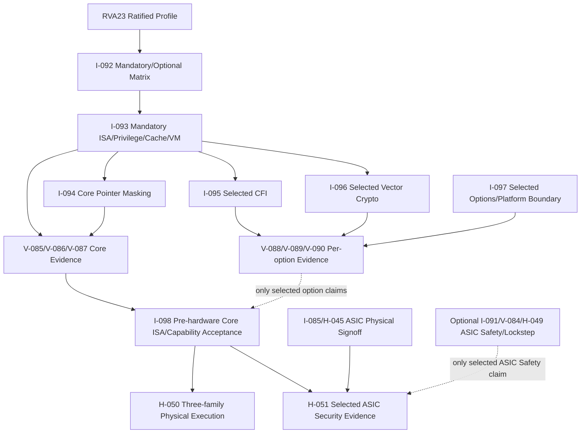

# 第10阶段：RVA23 Core / 项目选定「RVA23 Secure」选项包

状态：**规划，不是已实现 RVA23 处理器**。「RVA23 Secure」是项目自选扩展包，**不是 ratified profile**；ratified profile 只有 RVA23U64/RVA23S64。本阶段目标是两者全部 mandatory 条款，而非只跑 Linux 或少数指令。I-098 签预硬件 ISA/能力证据；H-050 后续逐板验证，H-051 仅为所选 ASIC 安全声明提供物理证据；I-091/lockstep 为独立可选 Safety 路径。

## 1. 这个子系统是做什么的

把非常规 execution fabric 包装成软件可依赖的标准 64-bit little-endian 应用处理器：完整 RVA23U64/RVA23S64 mandatory（含 V、Zkt/Zvkt、Supm/Ssnpm、Sha、PMA/VM/CSR），并按**每个选项**决定实现、发现和声明。Linux/Server Platform、RoT/TPM/secure boot/IOPMP、Ssaia 平台接口不是 RVA23 profile 的同义词，也不能由 ISA 门禁代替平台证明。

## 2. 为什么存在 / 上游输入

- 上游输入：ratified RVA23 profile（AR-022/AR-023）、现有 ISA/特权/指针/向量规范与选项发现约定；任何与 profile 不一致的产品愿望单独列项目选项。
- 已有依赖：S0-S9 基础处理器、memory/RVV/multihart、验证质量、三 FPGA、ASIC、可选 lockstep。
- 本阶段输出：I-098 Core 预硬件义务签收、每个所选选项单独签收、H-050 三家族物理执行证据、所选 ASIC 声明的 H-051 证据。
- 首要原则：p0/p1/p2/p3 不是 RVA23 证明；任一 mandatory 缺失阻断 Core；未选/未闭合选项只撤对应广告，不用可选项补 mandatory。

## 3. 总体结构

### 本阶段小模型执行核对表（每个声明单独一行）

| 声明/目标 | 先作决定与输入 | 必交证据/下游交接 | 失败时的处理 |
|---|---|---|---|
| RVA23 Core 预硬件 | I-092 冻结 U64+S64 全部 mandatory 和发现值；I-093/I-094/I-082 逐条实现，V-085/V-086/V-087 逐条实测，Zkt/Zvkt DIEL 单列 | 条款→owner→执行与 oracle→正反例→hash 的 ledger、应用/VM/RVV 实际运行交 I-098；明确标注预硬件；H-050 对每板重测 mandatory Zkt/Zvkt 数据值 DIEL | 任一 mandatory 缺路径/证据阻断 Core；某板 DIEL 失败只阻断该板物理 Core 声明；可选 crypto/CFI/Safety 不代偿 |
| 项目「RVA23 Secure」各选项 | I-092 逐项记录选/未选及软件发现：CFI→I-095/V-088，Zvkng/Zvksg→I-096/V-089，其余所选项→对应 I/V 实现与 V-090 集成 | 每项的规范行为/负例、适用 KAT/DIEL/CSR/PMA/VM 与独立 claim 交 I-098；Ssaia 和平台组件另写责任与边界 | 缺证据只撤对应选项声明；不得因此写「Secure ratified profile」或以 Server Platform 代替 RVA23 |
| 三家族 RVA23 FPGA | 每家族单独选 Core/所选项，读取 I-098 bundle、板能力、device tree 与软件 hash | H-050 各板真实运行、发现与负例交 I-086 | 缺板或板上能力阻断该家族对应声明，I-098 不是板证据 |
| ASIC 安全 | 选择 ASIC 安全/物理声明；收 I-098、同候选 I-085/H-045 与所需选项/平台证据 | H-051 DFT/故障/侧信道/残余风险交 I-086；另选 ASIC Safety 才收 I-091/V-084/H-049 | 缺物理证据仅阻断对应 ASIC 声明，既不撤 Core 预硬件也不强制 Safety |

操作顺序：逐行登记 profile 类别、选择/未选、软件发现、负责人与可观察的正反例；保存原始报告 hash。未闭合必需项维持 blocked，不把静态 Depends 当可选门禁。

## 4. 团队分工与进度追踪

| Team | 负责任务 | 当前状态 | Owner | 证据链接 | 下一动作 | Blocker |
|---|---|---|---|---|---|---|
| RVA23合规负责人 | I-092 | Not started | 待定 | 待填 artifact/commit | 冻结mandatory/optional矩阵 | 待填 |
| RVA23实现负责人 | I-093 | Not started | 待定 | 待填 artifact/commit | 实现mandatory扩展 | 待填 |
| Pointer masking负责人 | I-094 | Not started | 待定 | 待填 artifact/commit | 定义地址transform边界 | 待填 |
| CFI负责人 | I-095 | Not started | 待定 | 待填 artifact/commit | 实现LPAD/SS | 待填 |
| Vector crypto负责人 | I-096 | Not started | 待定 | 待填 artifact/commit | 逐套件选择Zvkng/Zvksg；Zvbc单独选 | 待填 |
| 平台安全负责人 | I-097 | Not started | 待定 | 待填 artifact/commit | 定义core/平台责任 | 待填 |
| RVA23验收负责人 | I-098 | Not started | 待定 | 待填 artifact/commit | Core预硬件ISA/能力验收；所选Secure项分别签收 | 待填 |
| RVA23验证负责人 | V-085 | Not started | 待定 | 待填 artifact/commit | 建立mandatory验证manifest | 待填 |
| Memory验证负责人 | V-086 | Not started | 待定 | 待填 artifact/commit | 验证CMO/PMA/misaligned | 待填 |
| Pointer验证负责人 | V-087 | Not started | 待定 | 待填 artifact/commit | 验证全部显式访问 | 待填 |
| CFI验证负责人 | V-088 | Not started | 待定 | 待填 artifact/commit | 验证LPAD/SS攻击面 | 待填 |
| Crypto验证负责人 | V-089 | Not started | 待定 | 待填 artifact/commit | 验证KAT/DIEL | 待填 |
| 平台安全验证负责人 | V-090 | Not started | 待定 | 待填 artifact/commit | 验证core/平台边界 | 待填 |
| RVA23硬件负责人 | H-050 | Not started | 待定 | 待填 artifact/commit | 三家族执行RVA23软件 | 待填 |
| ASIC安全负责人 | H-051 | Not started | 待定 | 待填 artifact/commit | ASIC安全物理/DFT边界 | 待填 |

## 5. 可跟踪任务卡

### I-092 — 构建完整 RVA23 合规矩阵

- **负责/门禁**：RVA23合规负责人；ratified RVA23U64/S64 条款与逐选项声明冻结。
- **前置依赖**：I-001。
- **做什么**：把下表每个名称展开为**独立一行**（不按套件合并）记录 profile 类别、spec 条款、owner、实现/验证任务、适用配置、软件发现值、选择状态、证据 hash、未完成时广告负例；逐行对比 ratified 原文，不从「Secure」营销名称推导义务。
- **输入数据/接口**：AR-022 ratified source、AR-023 官方 profile、现有 ISA/manual 与编译器/OS 发现机制、拟发布目标/配置。
- **输出与交接**：逐声明 U64/S64 mandatory ledger 交 I-093/V-085/I-098；逐选项 decision/发现/正反例和独立 owner 交对应 I/V 卡、V-090/I-098。
- **设计取舍**：S64 叠加 U64 mandatory；仅 ratified 原文属 profile。选项分类只描述未来/可选性质，不产生当前 Core 义务。
- **实现微步骤**：逐行抄录下面的基线与选项；按目标配置填 owner/输入/输出/负例和 I/V/H handoff；比对 U/S 发现值和失效配置；逐个所选项冻结 claim；让架构、验证、软件负责人分别签收 missing-coverage ledger。
- **主要阻塞风险**：遗漏一个 mandatory、把开发选项写成当前 mandatory、把 Ssaia/Server Platform 混进 profile；阻断规则：任一 mandatory 无 owner/证据路径或软件发现与实装冲突则 Core blocked。
- **验收证据**：下表所有 mandatory 名称均有逐条 owner/输入/可观察输出/失败负例与 V 卡；每个 ratified 选项都有独立可发现选择/未选行及 claim 边界。

I-092 **mandatory 分母**（斜线仅节省印刷空间，交接 ledger 必须按名称拆行；每行 owner=I-093 或 I-082/I-094，验证=V-085 加相应 V-086/V-087；输入=该条规范与目标配置；输出=执行 trace/oracle/hash 和发现值；负例=非法/权限/失效配置不得仍广告，任一缺口阻断 Core）：

| Profile | 必须逐项登记的原文名称 | 特别交接与反例 |
|---|---|---|
| RVA23U64 基础/标量 | RV64I little-endian；M、A、F、D、C、B、Zicsr、Zicntr、Zihpm、Zihintpause、Zfhmin、Zkt；Zihintntl、Zicond、Zimop、Zcmop、Zcb、Zfa、Zawrs | FU/PRF/FP 状态、解码与错误编码；Zkt 的数据值无关延迟为 Core，不移交可选 crypto DIEL |
| RVA23U64 memory/PMA | Ziccif、Ziccrse、Ziccamoa、Zicclsm、Za64rs、Zic64b、Zicbom、Zicbop、Zicboz | V-086：coherent+cacheable 主存取指至 32 bit 自然对齐原子、LR/SC RsrvEventual、全部 A atomics、misaligned **loads/stores**（非 misaligned AMO）、≤64B 连续自然对齐 reservation、64B cache block；负例跨 PMA/权限/非 coherent agent |
| RVA23U64 vector/pointer | V（完整 V、VLEN≥128）、Zvfhmin、Zvbb、Zvkt、Supm | I-082/V-085：VRF/掩码/重启和 Zvkt DIEL；I-094/V-087：Supm 环境至少可选 PMLEN=0/7；负例取指/DMA 错误掩码 |
| RVA23S64 叠加 | Zifencei、Ss1p13、Svbare、Sv39、Svade、Ssccptr、Sstvecd、Sstvala、Sscounterenw、Svpbmt、Svinval、Svnapot、Sstc、Sscofpmf、Ssnpm、Ssu64xl | VM/CSR/中断、I-cache 可见性、PTE/PTW、fault address/instruction；Ssnpm 的 senvcfg.PME/henvcfg.PME 至少 0/7；负例 guest/S 权限与 A/D fault |
| RVA23S64 Sha 分解 | H、Ssstateen、Shcounterenw、Shvstvala、Shtvala、Shvstvecd、Shvsatpa、Shgatpa | S/VS/HS guest CSR 与两阶段翻译；sstateen0–3/hstateen0–3、可写 hcounteren、vstval/htval、vstvec Direct、vsatp 同 satp modes、hgatp 同 SvNNx4 加 Bare；任一 guest mode/陷阱/CSR 缺口阻断 Core |

I-092 **ratified 可选库存**：以下每个单元格中的名称各为独立选项，**不是**一项联合要求；为每项单列选择、发现、实现 owner、验证 owner、输入/可观察输出/失败负例（未选不得广告，已选失败只阻断该项）。U 指 RVA23U64；S 指 RVA23S64 额外特权项；S 继承 U 选项。

| 类别 | 独立选项（每个逗号隔开的名称各建 ledger 行） | 被选时实现→验证/负例交接 |
|---|---|---|
| U localized | Zvkng，Zvksg | I-096→V-089；各自完整 suite/KAT/DIEL，错 GHASH/宣称未选 suite 单项 blocked |
| U development | Zabha，Zacas，Ziccamoc，Zvbc，Zama16b | Zabha/Zacas/Ziccamoc/Zama16b：I-093 memory→V-086（Ziccamoc 与 Zacas 相关 PMA，Zama16b 16B granule 原子边界）；Zvbc：I-082/I-096→V-085/V-089 CLMUL；错误原子性/异常或冒充 suite 只阻断相应选项 |
| U expansion | Zfh，Zbc，Zicfilp，Zicfiss，Zvfh，Zfbfmin，Zvfbfmin，Zvfbfwma | Zfh/Zbc/Zfbfmin→I-093/V-085；Zicfilp/Zicfiss→I-095/V-088 各自选择与发现；Zvfh/Zvfbfmin/Zvfbfwma→I-082/V-085；结果/权限/异常负例按项交 V-090/I-098，不能凭 Zfh 代替 Zfhmin |
| S localized/development | **无特权选项** | 不虚构扩展或发现位 |
| S expansion | Sv48，Sv57，Zkr，Svadu，Sdtrig，Ssstrict，Svvptc，Sspm | Sv48/Sv57/Svadu/Svvptc→I-093 VM/V-085；Zkr/Sdtrig/Ssstrict→I-097/V-090；Sspm→I-094/V-087；每项检查 CSR/模式/故障或保留编码负例、发现与所选配置一致 |
| U/S transitory | **无** | 不生成假义务 |

Ssaia、RoT/TPM/secure boot/IOPMP、Server Platform 要求是**profile 之外**的项目/平台决策，若选择在 I-097/V-090 独立记录 owner、接口与证据；安全或 Server Platform 不能作为上表类别。Zkt/Zvkt 是 mandatory，不能挪到 Zvkng/Zvksg 可选项。
- **失败/回退动作**：退回已有p2/p3能力，不发布RVA23声明。
- **来源覆盖**：RVA23 Core, commercial ISA baseline；来源 AR-022, AR-023。
- **执行者目标**：把RVA23从“一个名字”变成一张可以逐项打勾的义务表。
- **执行者须知**：先读ratified source；不要把博文或产品宣传当规范。每个mandatory项都要能找到实现任务和验证任务。
- **建议工作顺序**：读RVA23；列mandatory；列localized/development/expansion；映射I/V/H任务；定义广告规则；跑负例。
- **可接受完成**：矩阵完整、无未分配mandatory、无提前广告。
- **何时停止求助**：规范条款不明确或reference无法覆盖时不要猜，标Blocked。
- **交付说明**：提交compliance matrix和capability contract；更新Track Log。
- **参考资料**：AR-022, AR-023。
- **进度日志**：2026-09-29 用户新增RVA23商业目标后规划——未开始。

### I-093 — 实现 RVA23 mandatory scalar/privilege/cache 扩展

- **负责/门禁**：RVA23实现负责人；mandatory扩展实现。
- **前置依赖**：I-092, I-041, I-048。
- **做什么**：逐行实现 I-092 的完整 U64+S64 mandatory，已有模块必须复核实际结果，不因旧 stage 已标 done 而免测。非常规 fabric 必须让 frontend/FU/PRF/VRF/LSU/CSR/VM 与 packet replay/reconfiguration 保存同一架构语义。
- **输入数据/接口**：I-092 每项规范、已有 decode/rename/packet/commit、FU/PRF/VRF/LSU/MMU/PMA/CSR 配置与软件发现值。
- **输出与交接**：每组配置、指令/CSR/PMA 差异、成功执行 trace 和故障 trace 交 V-085/V-086；I-082 向量清单与 I-094 pointer 路径分别交 V-085/V-087，再交 I-098。
- **设计取舍**：spec 条款驱动实现，不只改 ISA 字符串；每一项的 decode、退休、副作用和能力发现必须对应同一硬件配置。
- **实现微步骤**：逐项认领 I-092 行；对下面每批记录 owner、规范输入、可观测输出、失败负例；先核成功/故障路径再查 replay/reconfiguration 中途的唯一提交；交对应 V 卡；最后对全矩阵逐行查缺。

I-093 内部子交付（只拆执行批次，不增任务 ID；下表每行 owner=I-093 RVA23 实现负责人，标出的外部 owner 分别交接；任何 mandatory 行失败均阻断 Core）：

| 子交付及输入 | 实现/交接的可观测输出 | 失败负例/阻断 |
|---|---|---|
| 基础标量与 FU/PRF：RV64I little-endian、M/A/B、C、Zicond、Zimop/Zcmop、Zcb、Zawrs、Zihintntl/Zihintpause | frontend 对齐/压缩展开，FU 运算、PRF 重命名与结果提交；hint/MOP 按规范执行，不把未选 CFI 指令错误变成保护；reservation 等待唤醒、非法编码 trap/软件发现交 V-085 | FU 争用、speculation flush/packet replay 或更换映射时不可重复副作用/丢结果；不支持编码/未授权路径不能假装已实现 |
| FP 与 vector 接口：F/D/Zfhmin/Zfa/Zicsr；I-082 的完整 V（VLEN≥128）、Zvfhmin、Zvbb、Zvkt | FPR/PRF 舍入、NaN、fflags/frm 与向量 VRF vtype/vl/vstart、mask/tail/restart 的逐条结果交 V-085；Zkt **已实现且列入 Zkt 清单**的标量指令及 Zvkt 清单中的向量指令另列 mandatory DIEL 观测点 | 错舍入/flags、replay 后重复 FP flag、向量部分写错误、操作数数据值改变适用指令延迟都阻断 Core；loads/stores/条件分支不在 Zkt 范围，可选 crypto DIEL 不代替 |
| 取指与缓存：Ziccif、Zic64b、Zicbom/Zicbop/Zicboz、S64 Zifencei | coherent+cacheable 主存自然对齐至 32-bit 取指原子；64B 自然对齐 block，CBO 权限/PMA/ordering 与写代码后 FENCE.I 可见性，前端 invalidate 与 packet 取消交 V-086 | torn fetch、陈旧指令跨 FENCE.I、noop CBO、错误权限上发生 cache 副作用均阻断 Core |
| LSU/原子/PMA：A、Ziccrse、Ziccamoa、Zicclsm、Za64rs、Ssccptr | 主存双 PMA 下 LR/SC RsrvEventual、A 全部 AMO、misaligned **load/store** 支持（不擅自宣称原子）、≤64B 连续自然对齐 reservation、PTW 主存读；跨 packet 的原子/异常/取消及独立 agent 观测交 V-086 | starvation 或 reservation 跨界、misaligned 访问错误值/越权、错误 PMA 上合法化操作即阻断 Core；misaligned AMO/Zama16b **不是** mandatory |
| Counter/CSR：Zicntr/Zihpm、Sscounterenw、Sstc/Sscofpmf、Ssu64xl | read/write 权限、WARL、counter 过滤/overflow、timer pending/interrupt 与 sstatus.UXL=2 trace 交 V-085 | 错 mode、只更新 shadow CSR、replay 双计数、不可写适用 scounteren bit 阻断 Core |
| S64 VM/trap：Ss1p13、Svbare/Sv39/Svade/Svpbmt/Svinval/Svnapot、Sstvecd/Sstvala | satp Bare/Sv39、A/D fault、NAPOT/PBMT、地址翻译缓存失效与 stvec Direct/有效四字节对齐 BASE、stval fault address/指令；翻译/异常优先级交 V-085/V-086 | 错 PTE 或负例权限仍可访问、旧翻译跨 reconfiguration/replay 存活、stval/异常优先级错阻断 Core；Sv48/Svadu 是可选 |
| Sha 各组成：H、Ssstateen、Shcounterenw、Shvstvala、Shtvala、Shvstvecd、Shvsatpa、Shgatpa | VS/HS 两阶段 VM 与 guest exit，sstateen0–3/hstateen0–3，适用 hcounteren 可写，vstval/htval 故障地址，vstvec Direct BASE，vsatp 同 satp modes，hgatp 对应 SvNNx4 及 Bare；逐个 CSR/guest 配置交 V-085 | 只支持 H decode、缺一个 CSR/VS/guest 翻译 mode、guest fault 错归宿或跨 packet/reconfiguration 泄露前一 VM 状态均阻断 Core |
| Pointer：I-094 owner 实现 Supm/Ssnpm 最少 PMLEN=0/7 | 有效 privilege/PMM 与 scalar/FP/vector/AMO/CMO CPU 显式访存（含 MMIO）变换接口交 V-087 | CPU 显式 MMIO 漏 mask、取指/PTW/DMA 错 mask、fault/tval/debug 未同步则阻断 Core |

- **主要阻塞风险**：遗漏矩阵条款、CSR/PMA/VM 副作用或把可选项混入 mandatory；阻断规则：ISA 字符串过关却无执行路径、未完成 mandatory 项仍广告 Core。
- **验收证据**：每个子交付及 I-092 其余 mandatory 行均有 RTL、能力发现值、对应 V 卡实际执行/reference 或独立 oracle 结果，零未分配义务。
- **失败/回退动作**：未闭合 mandatory 任一项则阻断 Core 预硬件验收；独立可选扩展失败只撤其单项广告。
- **来源覆盖**：RVA23 mandatory extensions, hypervisor, cache management；来源 AR-022, AR-024, AR-027。
- **执行者目标**：让 RVA23 每个软件可见 mandatory 行有真实路径与可移交的细粒度证据。
- **执行者须知**：只按 ratified source/I-092 定 Core 义务；不要从编译器支持猜硬件义务，I-094 负责地址 transform 实现。
- **建议工作顺序**：逐行认领矩阵；按表八组小批实现并交 V-085/V-086/V-087；核对 I-082 vector 结果；独立查缺漏与广告值。
- **可接受完成**：全部 mandatory（含未展示的基础义务）分配、实现和验证闭合，I-098 可逐行打勾。
- **何时停止求助**：规范行为、CSR WARL、PMA 或 VM 合同不明时标阻断项，不猜测替代。
- **交付说明**：提交八组实现/结果链接和完整 mandatory 矩阵交 V-085/I-098；更新 Track Log。
- **参考资料**：AR-022, AR-024, AR-027。
- **进度日志**：2026-09-29 用户新增RVA23商业目标后规划——未开始。

### I-094 — 实现 pointer masking 与地址传播边界

- **负责/门禁**：Pointer masking负责人；地址mask语义。
- **前置依赖**：I-093, I-045, I-046, I-056。
- **做什么**：在 CPU 指令显式 memory access 的 AGU/memory packetizer 统一执行 ignore transform，包括访问 MMIO 的显式 load/store/AMO/CMO 等；排除取指、PTW、IOMMU、DMA/设备自产生的访问；以变换后地址供 TLB/PMP/PMA/debug trigger/stval/vector/CMO/SS 使用，不改变权限和异常语义。
- **输入数据/接口**：Supm/Ssnpm/Sspm 执行环境合同、Smnpm/Smmpm 控制、PMLEN=0/7/16 策略、Bare/Sv39/Sv48、CPU 显式访问与设备来源列表（含 MMIO）。
- **输出与交接**：pointer-mask transform unit、按发起者/访问类型划分的覆盖矩阵，交 V-087 与 LSU/MMU/debug 集成。
- **设计取舍**：统一 CPU 显式访问转换，不以目标为 MMIO 作为免 mask 理由；设备自产生访问不转换。
- **实现微步骤**：定义 PMLEN/有效 privilege；接入 CPU scalar/FP/vector/AMO/CMO/SS 和 CPU 指令访问 MMIO；核对 TLB/PMP/PMA/debug/stval；排除取指/PTW/IOMMU/DMA/设备访问；覆盖 misaligned、MPRV/MXR 与 guest/physical；与规范矩阵验收。
- **主要阻塞风险**：只测标量、误按目标地址排除 MMIO、误 mask 设备来源；阻断规则：CPU 对 MMIO 的显式访问漏 mask，或取指/PTW/DMA/设备来源被 mask。
- **验收证据**：所有适用 CPU 显式访问按当前有效 privilege/mode/PMM 转换；隐式与设备来源不被错误 mask；MMIO/misaligned/vector/CMO/SS 边界通过。
- **失败/回退动作**：阻断 RVA23 Core mandatory pointer masking 签收；不得仅关闭广告而仍称 Core。
- **来源覆盖**：pointer integrity, tagged addressing, memory safety；来源 AR-024。
- **执行者目标**：让所有需要mask的地址路径都走同一套规则，所有不该mask的路径都明确排除。
- **执行者须知**：pointer masking 不是 tag check；CPU 指令对 MMIO 的显式访问仍受 mask，DMA/设备自己产生的访问不受 mask；不要改变权限或取指/PTW 的地址。
- **建议工作顺序**：定义配置和 transform；按发起者与指令列访问；接入每路径；测 CPU→MMIO 与 DMA→MMIO 对照、misaligned/vector/CMO/SS；测 fault/tval/debug。
- **可接受完成**：CPU 显式访问和设备/隐式排除矩阵均通过。
- **何时停止求助**：某类访问是否受mask不明确时停止查规范，不要假设。
- **交付说明**：提交transform实现、矩阵和证据；更新Track Log。
- **参考资料**：AR-024。
- **进度日志**：2026-09-29 用户新增RVA23商业目标后规划——未开始。

### I-095 — 实现 CFI：landing pad 与 shadow stack

- **负责/门禁**：CFI负责人；LPAD/SS实现。
- **前置依赖**：I-093, I-045, I-047。
- **做什么**：实现LPAD/ELP、shadow-stack instructions、ssp CSR、SS page permission、CBO禁止、idempotency检查、trap save/restore、software-check cause/tval。
- **输入数据/接口**：Zicfilp/Zicfiss规范、Zimop/Zcmop/Zaamo依赖、ELP/ssp状态、PTE/PMA/PMP规则、trap priority。
- **输出与交接**：CFI implementation、SS memory contract、trap/permission evidence。
- **设计取舍**：CFI只在明确启用时生效；未实现时MOP/LPAD保持规范行为。
- **实现微步骤**：实现LPAD/ELP和label；实现ssp CSR与SS instructions；实现SS page permission/CBO/idempotency/PMP；实现trap save/restore；覆盖direct/indirect/return/debug；跑合法/非法控制流矩阵；与reference和formal属性验收。
- **主要阻塞风险**：SS被普通store写、trap丢ELP/ssp、LPAD当noop、权限错；阻断规则：把LPAD当普通hint而不启用ELP、允许任意store写SS page、忽略trap优先级或M/U限制。
- **验收证据**：direct/indirect/return/trap/debug边界符合规范；SS memory只能由合法指令写，非幂等或错误PTE/PMP被拒绝。
- **失败/回退动作**：禁CFI扩展广告。
- **来源覆盖**：control-flow integrity, software security；来源 AR-025。
- **执行者目标**：让间接跳转和返回在硬件上有可证明的前向/后向保护。
- **执行者须知**：LPAD不是普通注释；shadow stack不是普通内存。所有trap、debug、context switch都要保存正确状态。
- **建议工作顺序**：实现LPAD；实现ELP；实现ssp；实现SS instructions；接PTE/PMA/PMP；测trap/debug；测攻击负例。
- **可接受完成**：合法程序通过，非法目标/SS写/return mismatch按规范失败。
- **何时停止求助**：无法保证SS页面不被普通写或trap状态不完整时停止。
- **交付说明**：提交CFI RTL、测试证据和已知边界；更新Track Log。
- **参考资料**：AR-025。
- **进度日志**：2026-09-29 用户新增RVA23商业目标后规划——未开始。

### I-096 — 实现 vector crypto 与 data-independent latency

- **负责/门禁**：Vector crypto负责人；仅对选定的 Zvkng/Zvksg 等扩展分别验收。
- **前置依赖**：I-082, I-093。
- **做什么**：在 RVV datapath 上实现选定的 NIST/ShangMi 套件：Zvkng=Zvkn+Zvkg，Zvksg=Zvks+Zvkg；Zvkg 提供 GHASH/GCM，Zvbc 提供另行选择的 CLMUL（不是两套件的隐含要求）；实现各自规范要求的数据独立执行延迟，VLEN=128 时用 LMUL 组成 256-bit element group。
- **输入数据/接口**：Core 的 Zvbb/Zvkt、选定的 Zvkng/Zvksg/Zvbc、VLEN≥128、EGW/EEW/EGS/LMUL/vstart 与每条指令的 reserved/illegal 规则。
- **输出与交接**：按选定 suite 展开的操作矩阵、vector crypto units、延迟观测点，交 V-089/I-098。
- **设计取舍**：先完整 suite 语义再性能；DIEL 是限定的数据值时序保证，不是全侧信道免疫；未选 Zvbc 不阻断 Zvkng/Zvksg。
- **实现微步骤**：先查官方 suite 成员并选择广告；实现各自 AES/SHA 或 SM4/SM3 与共同 Zvkg GHASH；Zvbc CLMUL 仅在单独选择时实现；逐指令处理 EGW/LMUL/vstart/overlap 与 reserved/illegal；接 KAT、边界及 DIEL 观测；比较 VLEN=128/256。
- **主要阻塞风险**：子集冒充 suite、混淆 GHASH/CLMUL、把 reserved 一律强制 trap、VLEN/EGW 或数据时序错误；阻断规则：未完整实现选定 suite 却广告，或按 Zvbc 替代必需的 Zvkg。
- **验收证据**：选定 suite 全部指令的结果、element grouping、overlap、vstart、mask/tail 和规范规定的非法异常通过；reserved 组合仅按规范处理，不额外要求一律 trap；规定范围内延迟不依赖数据值。
- **失败/回退动作**：不发布vector crypto suite。
- **来源覆盖**：vector cryptography, side-channel-aware datapath；来源 AR-026。
- **执行者目标**：把RVA23 Secure的crypto能力做成完整套件，而不是几个演示指令。
- **执行者须知**：Zvkg 的 GHASH 与 Zvbc 的 CLMUL 分开列；vstart/vl/SEW 等 reserved 不自动等于 mandatory illegal-instruction，LMUL×VLEN<EGW 明确要求非法指令异常。
- **建议工作顺序**：锁定 suite 成员；实现 AES/SHA 或 SM4/SM3 与 Zvkg；可选实现 Zvbc；测 LMUL/EGW 和 KAT；测 DIEL；逐项审广告。
- **可接受完成**：仅声明且完整验证所选 suite，Zvbc 单独决策，DIEL 范围与 VLEN 约束明确。
- **何时停止求助**：KAT 缺失、reserved/illegal 规则不清或延迟差异无法消除时停止并撤回相应声明。
- **交付说明**：提交 suite 展开表、crypto 实现、KAT/DIEL 报告给 V-089/I-098；更新 Track Log。
- **参考资料**：AR-026。
- **进度日志**：2026-09-29 用户新增RVA23商业目标后规划——未开始。

### I-097 — 实现 commercial security/platform package

- **负责/门禁**：平台安全负责人；RVA23 Secure边界。
- **前置依赖**：I-093。
- **做什么**：把 I-092 的**所有**所选 ratified 选项交由各专属实现/验证 owner（含 Sv57、Svvptc、Sspm、各 U 开发/扩展项），本卡只为所选 Zkr/Sdtrig/Ssstrict 等集成及项目另选 Ssaia/平台边界补接口，不将平台接口冒充 RVA23 扩展。
- **输入数据/接口**：I-092 逐选项 ledger 与对应 I-093/I-082/I-094/I-095/I-096 证据；Sv48/Sv57/Svadu/Svvptc/Zkr/Sdtrig/Ssstrict/Sspm 规范；独立项目 Ssaia 和平台 RoT/TPM/secure boot/IOPMP 责任。
- **输出与交接**：每项名称/类别/选择/发现/owner/实现与负例引用的集成包，平台独立责任矩阵，交 V-090/I-098；不输出未选项的成功声明。
- **设计取舍**：ratified RVA23 option 与 Server Platform/项目 bundle 两套声明边界；CFI/crypto 或平台组件仅在分别选择并宣称时要求其证据。
- **实现微步骤**：沿 I-092 逐个选项取专属 owner 结果，给 Zkr/Sdtrig/Ssstrict 补 CSR/debug/编码边界；另选 Ssaia 才接 AIA/APLIC/IMSIC；平台组件逐个标 owner/输入/输出/失败负例，运行匹配 VM/crypto/CFI 软件并核广告。
- **主要阻塞风险**：把 RVA23 Core 当 Server Platform 安全、把 Ssaia 当 ratified RVA23 选项、把 I-095/I-096 当所有可选项前置，或未实现的选项仍广告。
- **验收证据**：每个所选项实现/验证与发现一致，失效配置的负例不广告；宣称的外部平台项有 owner/接口/执行证据。
- **失败/回退动作**：撤回缺证据的对应 Secure/平台声明，已闭合的 Core 和其他独立可选项继续独立验收。
- **来源覆盖**：security package, platform security, server requirements；来源 AR-027, HR-014。
- **执行者目标**：把“核心能做”和“平台必须提供”分开，避免商业声明越界。
- **执行者须知**：RVA23 profile 不等于 server platform；RoT、TPM、Secure Boot、IOPMP 都不是 core 指令；只选一项不自动选择整套 Secure。
- **建议工作顺序**：列所选 core 项；逐项实现/验证；列平台 owner；定义接口；跑匹配软件；审广告。
- **可接受完成**：所选功能逐项有归属和证据，未选项不广告，平台缺失不隐藏。
- **何时停止求助**：所宣称的平台组件不可用或正式安全评估缺失时仅阻断对应声明。
- **交付说明**：提交逐选项 security package、责任矩阵和 claim 审查交 V-090/I-098；更新 Track Log。
- **参考资料**：AR-027, HR-014。
- **进度日志**：2026-09-29 用户新增RVA23商业目标后规划——未开始。

### I-098 — 完成 RVA23 Core ISA/能力预硬件验收与选定 Secure 项签收

- **负责/门禁**：RVA23验收负责人；Core mandatory ISA/能力预硬件验收，所选 Secure 项分别签收；不是最终物理硬件发布 gate。
- **前置依赖**：I-082, I-092, I-093, I-094, V-085, V-086, V-087。
- **做什么**：严格以 I-092 ratified 分母逐行签 RVA23U64+S64 完整 mandatory（含 Sha 八组成、Zkt/Zvkt、atomic fetch/LR-SC/misaligned load/store、VLEN≥128、PMLEN=0/7）；另为每个**选定** ratified 选项或独立项目/平台选项签一行，不产生统一 ratified「RVA23 Secure」证书。
- **输入数据/接口**：I-092 按项发现/选择/claim ledger、I-093/I-082/I-094 配置及 V-085/V-086/V-087 原始 Core traces/oracles/负例、被选项对应 I/V 证据；I-091 仅在另选 Safety 时适用。
- **输出与交接**：owner=I-098；Core 预硬件 acceptance bundle（逐条输入、观察结果、失败负例、hash/限制造册）交 H-050 逐家族物理验证与 I-086 目标声明；所选 ASIC 安全声明**才**交 H-051，未选/缺证据的选项各记 blocked，不混入 Core。
- **设计取舍**：I-098 签 ISA/能力而非板级/ASIC、Server Platform 或正式安全认证；H-050 必须随后对各板实际执行，H-051 只为实际选择的 ASIC 安全声明，I-091/H-049 仅为独立 Safety/lockstep。
- **实现微步骤**：逐行比 I-092 的 U/S mandatory 与 V-085–087 是否齐全，核 FU/PRF/VRF/LSU/CSR/VM/packet replay/reconfiguration trace；运行实际 U/S 程序、VM/guest、向量和错误权限/失效配置负例；缺任一 Core 行立刻阻断 Core；再按每个选项逐行核选择值/发现/对应 I/V/KAT/异常负例；标未选不得广告、所选缺证据只撤该项；交 H-050 和条件 H-051。
- **主要阻塞风险**：Linux boot/ISA 字符串冒充全条款、引用模拟器无 oracle、H-050 未跑先作物理宣称；Core mandatory 失败不能用 CFI/crypto/可选 Safety 掩盖。
- **验收证据**：U64/S64 mandatory 每行有输入配置、owner、规范期望/实际结果、负例与 oracle/hash；所选选项每行有独立记录与限制，明确标记 H-050/H-051 未完成，不声称物理通过。
- **失败/回退动作**：Core 缺口阻断 Core 声明；所选 Secure 项缺口只撤回对应可选声明；I-091 不通过只阻断另行选择的 Safety 声明。
- **来源覆盖**：commercial RVA23 ISA acceptance, security capability acceptance；来源 AR-022, AR-023, AR-024, AR-025, AR-026, AR-027。
- **执行者目标**：预硬件 Core 全部 mandatory 真实闭合，且每个选定 Secure 项可追溯，后续硬件仍需单独证明。
- **执行者须知**：本门禁不承诺三家族/ASIC 已通过；I-091 是独立 Safety 路径，不是 Core 完成条件。
- **建议工作顺序**：定声明；签 Core；逐项签所选 Secure；核软件发现；复跑；标后续 H-050/H-051；交 I-086。
- **可接受完成**：Core 预硬件证据完整，所选 Secure 与未选能力边界明确，物理门禁标为待办而非已通过。
- **何时停止求助**：任何 Core mandatory 无可核查证据时阻断 Core；某选项无证据时仅阻断该选项。
- **交付说明**：提交 acceptance bundle、逐声明 capability map/限制及 H-050/H-051 handoff；更新 Track Log。
- **参考资料**：AR-022, AR-023, AR-024, AR-025, AR-026, AR-027。
- **进度日志**：2026-09-29 用户新增RVA23商业目标后规划——未开始。

### V-085 — 闭合 RVA23 mandatory capability 与 reference 覆盖

- **负责/门禁**：RVA23验证负责人；RVA23覆盖闭合。
- **前置依赖**：V-002, V-020, V-043, V-080。
- **做什么**：用 I-092 每个 U64/S64 mandatory 条款作分母，按下列非 ID 小批跑实际程序/CSR/内存访问与正反例；reference 不支持时补独立 oracle/formal/定向证明，不能 skip 为 pass。
- **输入数据/接口**：I-092 ledger、I-093 的八批接口、I-082 完整 V/Zvfhmin/Zvbb/Zvkt、ACT/Sail/Spike/NEMU 支持清单；V-086/V-087 消费本任务的 case manifest，而非其前置。
- **输出与交接**：owner=V-085；逐行输入配置、程序、期望/RTL 结果、oracle、负例、hash 与缺口 ledger；memory 交 V-086，pointer 交 V-087，基础及汇总交 I-098。
- **设计取舍**：旧基础条款也必须运行；以参数化模式覆盖成功、权限/非法、flush/replay、重配置，不把 optional 随 Core 检查。
- **实现微步骤**：下表每批分别建固定种子程序、oracle 与负例，逐行存结果/发现值；交换目标配置和 guest 模式复跑；审 skip 与证据 hash；缺一行标 blocked 并反馈实现 owner。

V-085 内部验证批次（不增 ID；每行 owner=V-085 RVA23 验证负责人，所列 V-086/V-087 为独立细项 owner；任一 mandatory 未闭合阻断 Core）：

| 输入批次 | 可观测输出与交接 | 失败负例 |
|---|---|---|
| RV64I little-endian、M/A/B/C/Zicond/Zimop/Zcmop/Zcb/Zawrs/hints；I-093 FU/PRF | 逐指令值、PC/trap 与物理寄存器提交/packet flush/replay 对照 oracle 交 I-098 | 非法编码错误提交、flush 后错结果或同一次 AMO 重复退休 |
| F/D/Zicsr/Zfhmin/Zfa 与 I-082 完整 V（VLEN≥128）/Zvfhmin/Zvbb | 舍入/flags、vtype/vl/vstart、mask/tail、vector load/store/重启状态与 VRF 结果交 I-098 | FP flags 重复、向量部分退休错、以仅 Zve 或可选 Zvfh 代替 mandatory |
| Zkt、Zvkt mandatory DIEL；I-093 标量 FU、I-082 VRF/FU | 对 Zkt **已实现且列入清单**的标量指令和 Zvkt 已实现清单的向量指令，固定配置逐数据值比较延迟；OoO fuse/crack/route 可变但不得由 operand data 决定；Zvkt 包括非活动 data operand，vl/vtype/作为执行控制的 mask 不在保证内；交 I-098 | 数据值依赖的 FU/route/replay 时延阻断 Core；Zkt 不约束 loads/stores/条件分支，不冒充整机 constant-time 或 V-089 可选 crypto DIEL（[Zkt](https://docs.riscv.org/reference/isa/v20260120/unpriv/scalar-crypto.html#crypto_scalar_zkt)、[Zvkt](https://docs.riscv.org/reference/isa/v20260120/unpriv/vector-crypto.html#zvkt)） |
| Ziccif/Ziccrse/Ziccamoa/Zicclsm/Za64rs/Zic64b/CMO/Ssccptr/Zifencei | 取指原子性、LR/SC eventual progress、misaligned load/store、PMA/CMO、PTW 与 FENCE.I case manifest 和基础 oracle 交 V-086 | torn fetch、reservation 不前进、PMA 错授权、陈旧取指；Zama16b/misaligned AMO 不属于此 mandatory |
| Zicntr/Zihpm/Sscounterenw/Sstc/Sscofpmf/Ssu64xl | CSR WARL/权限、非零 counter enable 可写性、中断/溢出及 replay 后计数 trace 交 I-098 | wrong-mode 访问被接纳、timer 丢失、CSR shadow 更新而读回错误 |
| Ss1p13/Svbare/Sv39/Svade/Ssccptr/Svpbmt/Svinval/Svnapot/Sstvecd/Sstvala | Bare/paged PTE/PBMT/NAPOT、TLB 失效、fault address/指令和 guest 负例 oracle 交 I-098/V-086 | 旧 TLB surviving reconfiguration、A/D 未 fault、stval 错误 |
| Sha：H/Ssstateen/Shcounterenw/Shvstvala/Shtvala/Shvstvecd/Shvsatpa/Shgatpa | VS/HS/guest 两阶段、stateen 与 counter WARL、vstval/htval、vstvec、vsatp/hgatp Bare/SvNNx4 的各项 case 交 I-098 | 任一 guest mode/CSR/trap 缺失、fault 归属混乱、VM 跨 packet 泄露 |
| Supm/Ssnpm（最少 PMLEN=0/7） | effective privilege/PMM、CPU RAM/MMIO 显式访问与 DMA 对照的 case manifest 交 V-087，最终 V-087 证据交 I-098 | CPU MMIO 漏 mask 或 fetch/PTW/DMA 错 mask，缺 V-087 不可签 Core |

- **主要阻塞风险**：ISA 字符串/flag 有值但无运行证据，或用 optional 覆盖 mandatory 缺口；阻断规则：指令/CSR/PMA 条款未执行而仍称 Core。
- **验收证据**：每个 mandatory 能力有规范条款、实际执行结果与可信 oracle；八批次和基础 mandatory 项均无未登记排除。
- **失败/回退动作**：任一 Core mandatory 行无证据则阻断 I-098 Core 预硬件验收；optional 证据另走 V-088..090。
- **来源覆盖**：RVA23 Core verification, binary compatibility；来源 AR-022, AR-023, VR-005, VR-007, VR-009。
- **执行者目标**：以小批次证明每个 mandatory 项在真实执行中被检查，不只是编译器识别。
- **执行者须知**：参考模型不支持不是通过；为该行选第二 oracle/formal/定向证据并写缺口账本。
- **建议工作顺序**：读矩阵；分八批建 case；核 oracle 交集；跑程序；审 skip；签小批与总矩阵。
- **可接受完成**：所有 mandatory 行有条款、oracle、执行证据，零未登记排除。
- **何时停止求助**：找不到可信 oracle 或规范条款冲突时阻断对应行并反馈 I-093/I-092。
- **交付说明**：提交八批 verification manifest 和逐条 missing coverage ledger 交 I-098；更新 Track Log。
- **参考资料**：AR-022, AR-023, VR-005, VR-007, VR-009。
- **进度日志**：2026-09-29 用户新增RVA23商业目标后规划——未开始。

### V-086 — 验证 RVA23 cache/PMA/atomic/misaligned 合同

- **负责/门禁**：Memory验证负责人；RVA23 memory/PMA。
- **前置依赖**：I-093, V-018, V-045, V-085；仅多 hart 共享内存声明增加 V-065/V-067。
- **做什么**：Core 单 hart 以独立外部 agent 验证 cacheable+coherent 主存 PMA 的四条**不同** mandatory 义务：Ziccif 自然对齐至 32-bit 原子取指、Ziccrse LR/SC RsrvEventual、Ziccamoa 全 A AMO、Zicclsm misaligned **load/store**；再验 Za64rs、Zic64b、CMO、Zifencei、Ssccptr。多 hart claim 另收 V-065/V-067 的跨 hart 一致性/PPO，不以 cache hit 作证明。
- **输入数据/接口**：I-093/I-092 属性图及 V-085 memory manifest、FU→LSU packet/retire/replay 路径、coherent/noncoherent 外部 agent、PMA/权限表；Zama16b/Zacas/Ziccamoc 等只有各自**被选**时另建测试行。
- **输出与交接**：owner=V-086；下表每行输入/期望/实测 transaction 与外部 agent trace、负例/hash，连同独立多 hart 状态交 I-098；可选原子项单独交 I-098 选项记录。
- **设计取舍**：misaligned AMO **不是** Zicclsm 强制项；主存 PMA 与非主存/MMIO 的合法性分开；LR/SC 进展不能由单次成功替代，CMO 权限和 ordering 不能由最终值替代。
- **实现微步骤**：固定 PMA/权限与两种 agent；分别跑下表正反例并比较请求、响应、重试、退休及取指结果；插入 packet flush/replay/reconfiguration，确保无幽灵 store/AMO/CBO 与 reservation 泄漏；保存 trace 和 oracle。

| mandatory 输入/owner | 可观察输出与交接 | 失败负例 |
|---|---|---|
| V-086：Ziccif + Zifencei；双 PMA 主存/代码自修改 | 自然对齐且至 32-bit 的每种 power-of-two fetch 大小均不撕裂，按适用同步/FENCE.I 后新指令可见、front-end 清除过期 packet；交 I-098 | 已同步并执行 FENCE.I 后仍退休旧/混合编码，或错误权限依然取指 |
| V-086：Ziccrse/Za64rs/A；与竞争 agent 的受约束 LR/SC | reservation 连续/自然对齐且 ≤64B，指定主存满足 RsrvEventual；replay/竞争情况下保存进展与唯一 commit trace | 符合规范的受约束 LR/SC 序列持续无进展、reservation 超界、flush 后重复写；非 coherent/MMIO 不冒充主存承诺 |
| V-086：Ziccamoa/Zicclsm/Ssccptr；双 PMA 主存 | A 全 AMO 和 scalar/FP/vector misaligned load/store、PTW 读；跨边界拆分仍符合权限/异常和数据观察，允许规范未保证原子性的合法撕裂 | 错误值/丢失/重复 load/store、错误 PMA/PTW 或部分访问侧作用被隐藏；misaligned AMO 不作 mandatory，不能无依据要求 misaligned load/store 原子 |
| V-086：Zic64b/Zicbom/Zicbop/Zicboz | 64B 自然对齐 block，INVAL/CLEAN/FLUSH/PREFETCH/ZERO 的 PMA/权限、可见数据、ordering 与 agent 结果 | CMO noop、错误权限仍写零/污染 cache、packet replay 重复 side effect |
| V-086：独立被选 Zabha/Zacas/Ziccamoc/Zama16b | 每项独立输入与发现值；byte/halfword AMO、CAS/PMA 或 16B granule 原子边界实际输出 | 任一选项负例失败只撤**该项**，不可反向阻断完整 Core |

- **主要阻塞风险**：把单次 LR/SC 成功当 eventual progress、把 cache hit 当 coherence、把 misaligned AMO 当 Core 或漏掉 fetch 原子性；Core PMA 义务缺一即 blocked。
- **验收证据**：每个 mandatory 输入均有独立 agent 下正反例与 oracle、packet replay 一次性 side effect 及权限/ordering trace。
- **失败/回退动作**：任一 mandatory memory/PMA 行失败阻断 I-098 Core；可选行失败仅撤对应发现/claim。
- **来源覆盖**：RVA23 memory contract, CMO, PMA；来源 AR-022, AR-024, VR-014。
- **执行者目标**：在真实 LSU/fetch 路径分别证明原子取指、LR/SC 进展、misaligned load/store、A atomics 与缓存管理。
- **执行者须知**：CMO 不是 nop；Zama16b/misaligned AMO 可选，必须和 Zicclsm 区分；错误权限及 agent 行为不可凭 cache 内部命中猜测。
- **建议工作顺序**：列 PMA/权限矩阵；逐行跑 agent 正反例；施加 replay/重配置；保存 traces 交 I-098。
- **可接受完成**：上述每个 mandatory case 和负控制均闭合，选项各记各的状态。
- **何时停止求助**：无法判断memory ordering或PMA语义时停止。
- **交付说明**：提交CMO/PMA矩阵和memory traces；更新Track Log。
- **参考资料**：AR-022, AR-024, VR-014。
- **进度日志**：2026-09-29 用户新增RVA23商业目标后规划——未开始。

### V-087 — 验证 pointer masking 全访问覆盖

- **负责/门禁**：Pointer验证负责人；pointer masking覆盖。
- **前置依赖**：V-049, V-056, V-085。
- **做什么**：覆盖 CPU 指令 scalar/FP/vector/AMO/CMO/CFI/SS（含显式访问 MMIO）、debug trigger、stval、MPRV/MXR、Bare/Sv39/Sv48 与 guest/physical；验证隐式 fetch/PTW 和 IOMMU/DMA/设备自行生成的访问不被 mask，不能仅因目标是 MMIO 就排除 CPU 显式访问。
- **输入数据/接口**：pointer masking 实现、PMLEN/有效 privilege 配置、按发起者区分的显式访问列表及 MMIO/RAM memory map。
- **输出与交接**：CPU→MMIO 与设备→MMIO 对照的 pointer masking case matrix、transform/fault/debug 证据交 I-098。
- **设计取舍**：按发起者和指令族覆盖，不以目标地址是否 MMIO 决定 mask。
- **实现微步骤**：配置 PMLEN/privilege；逐 CPU 显式访问生成 RAM/MMIO 地址并比对 transform；以同一 MMIO 目标检查 DMA/设备自产生请求不变；排除 fetch/PTW/IOMMU；测 MPRV/MXR、guest/physical、misaligned、stval/debug 和负例。
- **主要阻塞风险**：CPU→MMIO 漏 mask、设备来源误 mask、debug/tval、vector/CMO/SS 漏测；阻断规则：只测 load/store，或按 MMIO 目的地址直接排除 mask。
- **验收证据**：每个适用 CPU 指令（包括 MMIO）的变换地址、fault、tval/debug 符合规范；隐式与设备发起路径不被变换。
- **失败/回退动作**：撤回 pointer masking/Core 声明直至 mandatory 缺口闭合。
- **来源覆盖**：pointer masking, tagged addressing, security；来源 AR-024。
- **执行者目标**：区分 CPU 显式 MMIO 访问与设备自行产生的 MMIO/DMA 访问，保证每条正反路径实际被测。
- **执行者须知**：目标为 MMIO 不豁免 CPU 指令；IOMMU/DMA/设备自产生的地址不是 CPU 显式访问。
- **建议工作顺序**：列发起者/指令矩阵；测 PMLEN 与 transform；同目标测 CPU 和设备；测 fault/debug；保存证据。
- **可接受完成**：CPU 显式/隐式/设备来源的边界全部闭合。
- **何时停止求助**：某类访问的规范归属不明确时停止。
- **交付说明**：提交pointer masking矩阵和证据；更新Track Log。
- **参考资料**：AR-024。
- **进度日志**：2026-09-29 用户新增RVA23商业目标后规划——未开始。

### V-088 — 验证 CFI landing pad 与 shadow stack

- **负责/门禁**：CFI验证负责人；LPAD/SS正确性。
- **前置依赖**：V-016, V-044, V-047, V-087。
- **做什么**：覆盖LPAD/label/ELP、trap save/restore、SSPUSH/SSPOPCHK/SSRDP/SSAMOSWAP、错误页面/非幂等memory/跨权限、direct call/return与speculation路径。
- **输入数据/接口**：Zicfilp/Zicfiss实现、合法/非法indirect control flow、SS PTE/PMA/PMP、trap/debug状态。
- **输出与交接**：CFI directed suite、fault/trap evidence、speculation boundary report。
- **设计取舍**：合法路径与攻击路径都要测，speculation不改变架构状态。
- **实现微步骤**：测LPAD/label/ELP；测trap save/restore；测SSPUSH/SSPOPCHK/SSRDP/SSAMOSWAP；测错误PTE/PMA/PMP；测debug/中断/返回；测speculation路径；跑攻击负例。
- **主要阻塞风险**：SS被普通store写、trap丢状态、LPAD不启用；阻断规则：LPAD被全局当hint、SS page被普通store写入、trap丢失ELP/ssp。
- **验收证据**：合法路径通过；非法landing/shadow-store/return mismatch在正确异常优先级失败；speculative错误路径不改变architectural state。
- **失败/回退动作**：禁CFI。
- **来源覆盖**：CFI, landing pad, shadow stack；来源 AR-025。
- **执行者目标**：证明攻击者不能只靠改返回地址或跳转目标就绕过控制流保护。
- **执行者须知**：既要跑合法程序，也要跑刻意破坏的负例；trap/debug和speculation边界最容易漏。
- **建议工作顺序**：跑合法LPAD/SS；破坏目标/返回地址；测异常优先级；测trap/debug；测页面权限；保存证据。
- **可接受完成**：合法通过、非法失败、状态恢复正确。
- **何时停止求助**：异常优先级或SS权限语义不确定时停止。
- **交付说明**：提交CFI suite和负例证据；更新Track Log。
- **参考资料**：AR-025。
- **进度日志**：2026-09-29 用户新增RVA23商业目标后规划——未开始。

### V-089 — 验证 vector crypto 结果与 DIEL

- **负责/门禁**：Crypto验证负责人；vector crypto/DIEL。
- **前置依赖**：I-096, V-052, V-059, V-085；仅宣称性能归因/PMU 时另验 V-076。
- **做什么**：按所选套件逐指令跑 AES/SHA 或 SM4/SM3 与 Zvkg GHASH KAT；Zvbc CLMUL 单独选择/测试，不作为 Zvkng/Zvksg 必需条件；检查 EGW/EEW/EGS、LMUL/vstart/vl/mask/tail/overlap 和规范要求的非法异常；扫描数据值验证规范范围内 DIEL。
- **输入数据/接口**：I-096 选定 suite/单独 Zvbc 清单、官方 KAT 来源、逐指令 reserved/illegal 约束、DIEL instrumentation。
- **输出与交接**：分套件 crypto correctness/KAT 矩阵、DIEL 与 reserved/illegal 记录、side-channel 限制交 I-098。
- **设计取舍**：DIEL 不宣称全侧信道免疫；不把 reserved 编码默认等同必须 trap。
- **实现微步骤**：展开 Zvkng=Zvkn+Zvkg、Zvksg=Zvks+Zvkg；跑各自 AES/SHA/SM4/SM3 和 GHASH KAT；仅选 Zvbc 时跑 CLMUL KAT；按规范分别测 LMUL×VLEN<EGW 的 illegal-instruction 与 reserved vl/vstart/SEW（不得无依据要求 trap）；测 overlap、mask/tail；扫输入值时序，比较 VLEN=128/256；记录限制。
- **主要阻塞风险**：少数 AES KAT 冒充套件、混淆 GHASH 与 CLMUL、reserved 误判成必 trap、masked inactive 影响时序；阻断规则：Zvkg 缺失却广告 Zvkng/Zvksg，或 DIEL 冒充完整侧信道免疫。
- **验收证据**：选定 suite 全部指令结果/合法边界通过；要求非法的条件正确抛异常、reserved 不设额外 trap 门槛；声明范围内延迟不依赖数据值；可选 Zvbc 单独记账。
- **失败/回退动作**：撤回未闭合的对应 crypto 扩展广告，不阻断 Core。
- **来源覆盖**：vector crypto, side-channel timing, RVA23 Secure；来源 AR-026。
- **执行者目标**：证明所选套件的 GHASH 和逐指令结果，而不是用 CLMUL 替代 Zvkg；按规范而非猜测处理 reserved。
- **执行者须知**：Zvkng/Zvksg 要 Zvkg；Zvbc 是另一种 CLMUL 路径；reserved 不自动要求非法指令异常。
- **建议工作顺序**：核 suite 成员；跑 KAT；核 LMUL illegal 与 reserved 约束；测 DIEL；交所选项签收。
- **可接受完成**：所选 suite 的正确性与时序证据闭合，未选 Zvbc 不影响对应套件。
- **何时停止求助**：KAT来源不足或时序差异无法解释时停止。
- **交付说明**：提交KAT/DIEL矩阵和限制说明；更新Track Log。
- **参考资料**：AR-026。
- **进度日志**：2026-09-29 用户新增RVA23商业目标后规划——未开始。

### V-090 — 验证 RVA23 Secure platform 边界

- **负责/门禁**：平台安全验证负责人；仅所选 RVA23 Secure 能力与平台声明边界。
- **前置依赖**：V-073, V-085。
- **做什么**：owner=V-090 平台安全验证负责人；收 I-092 **每个所选选项**的输入配置、真实实现/专属验证 trace、软件发现与失效配置负例，逐项签收；对项目另选 Ssaia/平台服务另列 owner/接口/负例。未选项不运行来伪称已选，其他已闭合项不因一个选项失败作废。
- **输入数据/接口**：I-092 每项决策与 I-097 实现；CFI 选 Zicfilp/Zicfiss 时各取 I-095/V-088，Zvkng/Zvksg 时各取 I-096/V-089；其他选项按 I-092 表的实现→验证 handoff 收 V-085/V-086/V-087/V-090 对应条款；平台 RoT/TPM/secure boot/IOPMP 与 Ssaia 另取 owner、接口、独立证据。
- **输出与交接**：逐项选择/未选发现值、正反例、oracles/hash、限制与平台责任表交 I-098；仅实际所选 ASIC 安全声明的相应项转 H-051。
- **设计取舍**：「RVA23 Secure」是项目所选选项包，**非 ratified profile**；Server Platform 与 RVA23 分离。V-090 聚合不覆盖各专属验证 owner，未选 crypto/CFI 不成为别的项门槛。
- **实现微步骤**：逐条对 I-092 category/name/软件发现；每个选项冻结输入与 owner，按 handoff 取正反例、执行日志/hash，再以错误配置/未选发现负例复核；选 Sv48/Sv57 查相应 satp/vsatp/hgatp mode，选 Svadu/Svvptc 查 A/D/PTE 可见性，选 Zkr/Sdtrig/Ssstrict 查 CSR/debug/标准及保留编码 contained trap，选 Sspm 查 pointer PMM；Ssaia 仅按独立平台选择查中断接口；逐项交 I-098。
- **主要阻塞风险**：把 Ssaia 说成 ratified expansion、把缺平台组件的 Core 写成 Server Platform、或一个选项失败强制撤销 Core；按名称独立 blocked/撤广告。
- **验收证据**：每个所选项均有具体 owner、输入、规范期望/实测、负例/发现值，未选项发现不广告；平台声明须有独立组件 owner 与可执行证据。
- **失败/回退动作**：撤回不合格的 Secure/平台项；Core 的 mandatory 证据不因可选项失败作废。
- **来源覆盖**：commercial security acceptance, server boundary；来源 AR-027, HR-014。
- **执行者目标**：确保所选 RVA23 Secure 声明只覆盖真实存在的 core/平台能力。
- **执行者须知**：Core 通过不等于平台安全；未选扩展不成为必过门槛，平台缺失必须明确写出。
- **建议工作顺序**：定项；验 core；仅按选项核 CFI/crypto；核平台 owner；跑综合程序；签证据。
- **可接受完成**：所选项的 core/平台责任矩阵闭合，未选项不广告。
- **何时停止求助**：所宣称的平台组件或正式安全评估缺失时只阻断相应声明。
- **交付说明**：提交Secure verification bundle和平台矩阵；更新Track Log。
- **参考资料**：AR-027, HR-014。
- **进度日志**：2026-09-29 用户新增RVA23商业目标后规划——未开始。

### H-050 — 验证 RVA23 软件包在三家族的物理执行

- **负责/门禁**：RVA23硬件负责人；I-098 之后逐家族物理执行，不是 Core 预硬件验收的前置。
- **前置依赖**：H-032, I-098。
- **做什么**：在三家族**每块真实板**执行签收 Core 的 U/S corpus、VM guest、Linux 应用、完整 RVV/pointer、异常负例，且对 mandatory Zkt/Zvkt 做板上数据值延迟复测；只有该板选择的选项才运行对应 CFI/crypto/其他专项测试。
- **输入数据/接口**：owner=H-050 RVA23 硬件负责人；I-098 各条款程序、V-085 Zkt/Zvkt 清单与受约束 DIEL 比较方法、板的硬件计时/执行观测点、binary hash、device tree/能力发现/内存图及固定控制/竞争配置。
- **输出与交接**：每家族各板 Core 与所选选项物理结果、opcode/control/数据值/latency 原始记录、负例与能力发现/软件 hash，交 I-086 对应家族发布声明；H-051 不以板结果代 ASIC 证据。
- **设计取舍**：每板单独验证，不把 simulator 或另一家族替代；DIEL 只对 Zkt 已实现清单与 Zvkt 已实现清单的受保障指令/数据操作数，**不**宣称整个处理器/应用恒时或物理侧信道免疫。
- **实现微步骤**：逐板选择 claim 与部署一致的 binary；跑 Core corpus/VM/向量/权限负例；固定 opcode、vl/vtype/作为控制的 mask、竞争负载与路由环境，改变适用标量 operand 和向量 active/**inactive data operands**，分别采板上 latency/route/replay 结果及噪声/仪器限制；不把控制值变化混作 DIEL；核选项发现与负例后逐板签收。
- **主要阻塞风险**：VLEN/guest/mandatory 缺失、Zkt/Zvkt 板上数据值依赖仍广告 Core、host 模拟冒充板或某板结果冒充全三家族；所选 crypto DIEL 失败仅撤该板对应 crypto 选项。
- **验收证据**：每板 mandatory Core 程序与 Zkt/Zvkt 受保障数据值 DIEL 比较、发现值/故障负例均有板上可复查记录；仅各板所选选项另有专项证据，绝不据此宣称无侧信道。
- **失败/回退动作**：该 family 对应 RVA23/Secure 声明 blocked，不抹去别的家族或 I-098 预硬件结论。
- **来源覆盖**：RVA23 hardware portability, real-board commercial evidence；来源 AR-022, AR-023, AR-024, AR-025, AR-026。
- **执行者目标**：证明RVA23软件在真实FPGA上能发现并使用正确能力。
- **执行者须知**：不要用host模拟器代替板；每块板的能力可能不同，device tree必须反映真实硬件。
- **建议工作顺序**：选板；构建；部署软件；跑corpus；核对capability；跑负例；记录限制。
- **可接受完成**：三家族各自闭合或明确blocked。
- **何时停止求助**：板资源不足或软件无法运行时停止并记录真实限制。
- **交付说明**：提交每板bundle和运行日志；更新Track Log。
- **参考资料**：AR-022, AR-023, AR-024, AR-025, AR-026。
- **进度日志**：2026-09-29 用户新增RVA23商业目标后规划——未开始。

### H-051 — 验证 ASIC security features 的物理与制造边界

- **负责/门禁**：ASIC安全负责人；仅所选 ASIC Secure/安全物理声明的后续证据门禁，不阻塞预硬件 Core。
- **前置依赖**：I-085, H-045, I-097, V-090, I-098。
- **做什么**：在所选 ASIC Secure 候选对应的工艺签核基础上，把所选 pointer masking、CFI、vector crypto、entropy、debug trigger、AIA 等声明纳入 physical/DFT/security 审查；仅在另选 ASIC Safety/lockstep 声明时依 I-091/V-084/H-049 补证据；明确 RoT/TPM/secure boot/IOPMP 外部 owner；执行综合后故障和 side-channel 观测。
- **输入数据/接口**：I-098 所选 Secure 候选及 I-085/H-045 同候选物理签核、I-097/V-090 平台边界、SRAM/ECC/DFT/scan 与物理安全约束；所选 ASIC Safety 才加 I-091/V-084/H-049，H-048 仅用于另行声明的 FPGA Safety。
- **输出与交接**：同候选 ASIC security signoff bundle、platform dependency ledger、residual risk report，交相应 I-086 ASIC 声明。
- **设计取舍**：FPGA 软件不替代 ASIC signoff；DIEL 不等于物理免疫；不选 Safety 就不要求 lockstep/ H-049。
- **实现微步骤**：列 ASIC 安全声明；审 RoT/IOPMP/AIA 边界；核 SRAM/ECC/clock/power、scan/MBIST/ATPG；仅选 ASIC lockstep 时审 I-091/V-084/H-049；跑综合后故障/侧信道观测；审 STA/等价/物理报告；签残余风险或阻断。
- **主要阻塞风险**：共享 SRAM/clock 未保护、DFT 漏 replica、安全声明越界；阻断规则：用 FPGA 软件替代 ASIC 安全验证，或把 crypto DIEL 当完整物理侧信道免疫。
- **验收证据**：每项声明的 core 内安全机制有 ASIC 物理/制造证据路径，平台责任明确；无正式 side-channel/security evaluation 不宣称相关合规。
- **失败/回退动作**：仅相应 ASIC Secure/Safety 声明 blocked；不撤销独立 Core 预硬件验收。
- **来源覆盖**：ASIC commercial security, physical signoff boundary；来源 AR-024, AR-025, AR-026, AR-027, HR-014。
- **执行者目标**：把 ASIC 安全声明限制在真正经过物理/制造/安全证据支持的范围。
- **执行者须知**：H-051 在 I-098 之后；I-091/H-049 只服务选定 Safety/lockstep，不是 Core prerequisite。
- **建议工作顺序**：选 ASIC claim；核平台、SRAM/ECC/clock 和 DFT；适用时收 Safety 证据；跑物理观测；签风险。
- **可接受完成**：每个已声明机制有物理证据，缺失项只阻断对应 ASIC 声明。
- **何时停止求助**：所选 ASIC 物理证据所需 PDK/library/tester/安全评估不可用时阻断对应声明。
- **交付说明**：提交ASIC security bundle和claim边界；更新Track Log。
- **参考资料**：AR-024, AR-025, AR-026, AR-027, HR-014。
- **进度日志**：2026-09-29 用户新增RVA23商业目标后规划——未开始。

## 6. 阶段级阻塞清单

| Blocker | 触发条件 | 立即动作 | 责任升级 |
|---|---|---|---|
| RVA23矩阵缺口 | Core mandatory 项没有实现/验证责任或证据 | 阻断 Core 预硬件签收及其目标声明，补任务并重跑 | RVA23合规负责人 |
| 可选功能误称 mandatory | crypto/CFI/Sv48/Zkr/Safety 被写成无条件 Core 前置 | 修正逐声明矩阵和广告；不反向阻断已闭合 Core | RVA23验收负责人 |
| 地址安全边界错误 | CPU 显式 MMIO 漏 mask 或设备/DMA 来源误 mask；mandatory vector 绕过 | 阻断 pointer masking/Core 并重跑 V-087；选定 CFI/SS 的绕过仅阻断相应 CFI 选项 | Memory/CFI负责人 |
| Mandatory Zkt/Zvkt DIEL 失败 | 规范覆盖的已实现标量/向量指令延迟依赖 operand data（含 Zvkt 非活动数据） | 修 FU/VRF/route 后重跑 V-085；阻断 Core，不用可选 crypto 结果代替 | RVA23实现/验证负责人 |
| 所选 crypto DIEL 失败 | 数据值影响选定 Zvkng/Zvksg 指令 latency | 修实现或撤回相应 suite 广告，不阻断已闭合 Core | Vector crypto负责人 |
| 平台安全责任缺失 | 宣称的 RoT/TPM/IOPMP/secure boot 没有 owner 或证据 | 不宣称对应平台安全，保留独立 Core 能力 | 平台安全负责人 |
| 商业声明越界 | ISA 字符串/单次 Linux boot 或 I-098 被当物理 signoff | 阻断相应 release 声明，完成 H-050 或 H-051 的目标证据 | RVA23验收负责人 |

## 7. 阶段 Track Log（持续追加）

| 日期 | 事件 | 证据 | 负责人 | 下一步 |
|---|---|---|---|---|
| 2026-09-29 | 用户新增RVA23/RVV/安全商业目标；读取RVA23 ratified source、pointer masking、CFI、vector crypto、server-platform主源 | architecture-review §1.2、I-092–I-098、V-085–V-090、H-050/H-051、AR-022–AR-027/HR-015/HR-016 | 规划集成 | 冻结RVA23 compliance matrix |

## 8. 2026-10-02 研究增补：memory preview 的权限与侧信道边界

本节为原 I-092–I-098/V-085–V-090/H-050/H-051 合同的**增量安全交接**，不改原任务、mandatory 分母、所选选项或 delivered 状态。来源：[New document(2).txt](../New%20document%282%29.txt) 2139–2168 行的 wrong-path/cache 风险，修订其“private Tile-L0 即安全解决方案”的过强暗示；具体实现设计以[第3阶段 §8](stage-3-memory-system.md) 为单一 MPP/IMC/MemoryPreviewToken 合同。MPP、IMC、shadow window/helper、early consume 都是研究提案，不因当前 LLB、prefetch、权限 unit 有报告就算已实现或已通过安全验证。

### 8.1 威胁模型和不能宣传的性质

需分别登记攻击者能否控制 branch/地址流、同 hart 不同 privilege/context、同 tile 后继租用者、同 pod/其他 hart、共享 cache/TLB/interconnect、设备/DMA，以及可观测 cycle/PMU/功耗/电磁信号。把 architectural 权限正确与 microarchitectural information leakage 分开：preview 不退休、不写 architectural register、wrong-path store 零外显，是必要条件，不是 speculative non-interference 的证明。

- **private L0 不等于安全隔离**：fill 数据依然可能经过共享 L1/L2（若将来实现）、translation/cache lookup、return fabric、bank/queue/MSHR、replacement/coherence 和 interconnect；wrong-path 流量、timing、ownership 失效、功耗仍可能泄露。branch resolve 后才 promote 只能限制部分共享安装，不能抹掉已经产生的共享请求或竞争。
- **TLB-hit-only 也不是零侧信道**：lookup/替换策略/端口竞争可能可见。基线禁止 preview PTW 和 A/D 更新降低了攻击面，但不能宣称 TLB 不泄露；将来 preview walk 必须重新评估 page-table cache/PTW/共享总线和两阶段 VM 风险。
- **confidence 不是权限或安全证明**：高 branch/address confidence 不能越过 PMP/PMA/PTE/security-domain gate。`DataReady`、PC 一致、VA 一致、L0 hit、相同物理 line 均不能替代同动态 occurrence/context/attempt 的合法性和 freshness。
- **DIEL 范围不扩大**：Zkt/Zvkt 与所选 crypto 仍按原卡的指令/operand-data 范围验收，不能将 preview/route/controller 的行为写成整机 constant-time。若新增策略使受保障指令的 operand data 决定 latency/route/replay，仍阻断相应 mandatory/所选选项 gate；loads/stores 不在 Zkt 保证内也不意味着其泄露风险可以忽略。

### 8.2 必需字段、生命周期与权限负例

接口 owner（frontend/MMU/LSQ/IMC/locality/security）使用第3阶段 MP-01..MP-08 的同一字段版本，不另起安全 token 或第二 memory service model。

| 边界 / Owner | 输入字段与策略 | 可观察验收 / 必需负例 |
|---|---|---|
| occurrence 与预测表域 / frontend+security | hart、security/context generation、fetch sequence/generation、block slot、PC/bits/length、branch/spec epoch；predictor domain/code generation | 同 PC loop 与跨 context 不能重认领 token；FENCE.I 后旧签名/旧 fetch 取消；刻意注入 PC-only attach、ASID 复用、generation wrap 必须被拒绝 |
| preview 发起 / MMU+IMC | 当前 privilege/MPRV/SUM/MXR、ASID/root/translation generation、PMP/PMA generation、PredVA→PA、memory type/byte范围/permission verdict | TLB miss、A/D 清、非法 PTE、PMP 拒绝、跨 region/page、device/MMIO/非幂等必须零 preview bus 请求；preview 零 PTW/零 A/D 写、零软件 trap；真实 fault 仍按 demand 报告 |
| physical merge / IMC+LSQ | PA line 与 memory/coherence/security domain key、每 consumer 独立 permissions/context/token generation/offset/size | 同 VA 不同 PA 不合并；同 PA 不同权限的拒绝 consumer 不搭便车；取消 wrong-path waiter 不抹掉合法 demand，也不向被取消 token 交数据 |
| clean copy 与消费 / locality+LSQ | sector valid、line instance/generation、version/invalidation generation、source bank、actual AGU/PA/byte range、older SQ forwarding 与权限再检查 | store/AMO/snoop/evict/permission revoke 与 fill/use race 阻断旧 copy；地址预测正确但 stale byte 仍失败；wrong tile 只能合法路由/normal fallback，不能复用前租户敏感值 |
| speculative stores / store+coherence | baseline 只读准备；store authorization 与 accepted drain obligation；MP-07 ownership 独立选择 | 零 predicted store data/dirty byte/提前 SQ commit；MP-07 RFO 虽不写数据仍产生失效与侧信道，未证实协议/公平性前关闭；普通 fused load-modify-store 不升级成 AMO |
| cancel/disable / recovery+security | token/transport/lease generation、inflight refs、domain切换、fence/reset/disable | 先停发/撤 pending，再 drain/absorb accepted response，拒旧 install/attach/wakeup；不能清表后立即复用 ID、丢 demand error 或删除已授权 store |

权限检查不仅在真正 AGU 上进行，也必须在 preview traffic **发出前**进行；以后 demand 再检查不能追溯撤回已经触碰 MMIO、越权 cache line 或引起 coherence 的副作用。未实现 guest/两阶段 VM/pointer transform 的配置，不支持其 preview，而不是猜一个 tag。未来所选 Supm/Ssnpm 地址变换遵守 I-094/V-087：CPU 显式地址统一 transform，PTW/DMA/设备源不误 transform；MMIO 即使 transform 合法也不允许 preview。

### 8.3 可部署 disable 模式与选择边界

安全基线为 `MPP off + IMC preview admission off + helper/shadow memory traffic off + ownership preparation off + early consume off`；普通 demand ISA/LSQ/权限/设备语义不变。控制 owner 必须给出 reset 默认、适用 privilege/软件发现、运行时切换的 stop/drain/clear 语义，不凭空增加未定义 CSR。安全域切换先拒新 preview、取消 token、drain/absorb 旧 transport，再清或代隔离 intent/predictor/L0 与 lease；不宣称只翻一个 enable bit 能抹掉已有 cache 痕迹。

允许将 private clean L0、只读 TLB-hit-only、低 preview budget 作为**风险缩减策略**分别测量，但不能命名为已证明 secure isolation。没有明确 threat model/隔离或 non-interference 证据时，安全敏感工作负载使用关闭模式；若宣称高安全模式，必须另给 threat/assumption/观测面与残余风险，不从 private L0 推导认证。

### 8.4 安全 handoff、状态与 release gate

下表是既有卡内的小批交接，不增加研究 ID，也不把可选性能机制变成 RVA23 mandatory。所有研究行当前为 PROPOSED/BLOCKED；验收证据必须来自未来实际路径，不能复制外部研究百分比或当前 unit PASS。

| 小批交接 / 接收原卡 | 依赖 | Owner / 当前状态 | 必交证据与放行条件 |
|---|---|---|---|
| preview 权限/地址表 → I-093/I-094、V-086/V-087 | MP-01/03；已选 profile 的当前 MMU/PMA/PMP 与 pointer 规范 | MMU+Memory验证，待认领；PROPOSED | 同一 occurrence 的 preview/demand trace、权限/类型/byte范围、TLB hit/miss/A-D/PMP/MMIO 负例；mandatory 功能不因 preview 关闭或错预测而改变 |
| cancel/context/有限身份 → I-097、V-090 | MP-03/04；reset/fence/ASID/domain/lease 合同 | recovery+平台安全验证，待认领；BLOCKED（接口未实装） | cancel+late response、fill+revoke、旧 token→新 slot、domain切换/有限 generation wrap 的真实负控制；任何跨域数据消费阻断 preview 启用 |
| mixed-traffic 与 disable → I-062/V-063、V-090 | MP-02 与唯一 core service model 决定；原 age/fairness 义务 | memory service+security，待认领；BLOCKED（core QoS 未接） | off/on 相同架构输出/设备副作用、demand最大等待与有限预算；bulk/preview/PTW 压力、永久不响应诊断；保持 V-063 原验收，unit 结果不得替代 core |
| fusion/ownership/early consume → I-097/V-090 | MP-05..08 与 EF fusion/完整 I-036 污染恢复 | LSQ+coherence+security，待认领；BLOCKED（明确后置） | 各 child 精确异常/退休、零 speculative store；错地址/late alias/stale value 的全 dependent poison 与恢复；ownership 额外失效/流量/侧信道单列；早消费未证明则维持关闭 |
| 安全声明审查 → I-098 | 上述适用行、I-092 全 mandatory、每项所选 option ledger | RVA23验收+安全评审，待认领；PROPOSED | preview 是否启用、threat/assumption/disable/残余风险写入 acceptance bundle；不能把 p0/p1/LLB 报告或私有缓存称为 RVA23 Secure 证明 |
| FPGA/ASIC 物理声称 → H-050/H-051 | 同候选 I-098、实际配置/物理前置；仅所选声明 | 各板/ASIC安全负责人，待认领；BLOCKED（无新物理证据） | 每目标真实 timing/side-channel/功耗观测与仪器限制；H-050 DIEL 仍受原范围约束；无正式评估不宣称物理免疫/相关认证 |

**发布否决**：漏 pre-issue 权限 gate、speculative MMIO 或 store 外显、跨域 stale copy/token 接受、取消后新 owner 接受旧回应、未知 source 的数据消费、无法关闭/无法 drain、研究改写 V-063 缩小测试分母，均阻断相应 preview/安全声明并回退 off。原 Core mandatory 有缺口仍阻断 Core；单纯未选择 MP-07/08 不反向阻断已证明 preview-only，更不能用“preview off”绕开普通 Core 的权限、CMO、VM、DIEL 或已承诺能力验收。

| 日期 | 事件 | 证据范围 | Owner | 下一动作 |
|---|---|---|---|---|
| 2026-10-02 | 将 memory preview 安全风险/disable/权限/取消/物理声明边界纳入原安全阶段 | 原研究与第3阶段 MP 合同；仅文档设计、未运行或认证 | 安全研究集成 | MP-01 冻结 threat/权限负例；core service 决定前所有新增 preview 保持关闭 |
