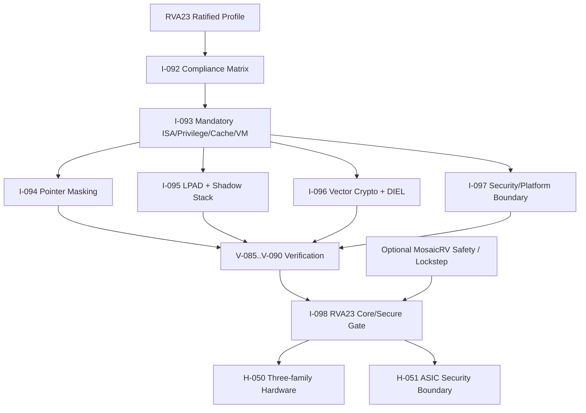

# 第10阶段：RVA23 Core / RVA23 Secure 商业化能力

状态：**规划，不是已实现 RVA23 处理器**。本阶段把用户新增的 RV64/RVA23/RVV/安全需求作为最终商业目标。早期 p0/p1/p2 仍是 bring-up 阶段；只有本阶段证据闭合后，才能对外宣称 RVA23 Core 或 RVA23 Secure。

## 1. 这个子系统是做什么的

把非常规 execution fabric 包装成软件可依赖的标准应用处理器：RV64 little-endian、RVA23S64 完整 mandatory能力、VLEN≥128 的 RVV、pointer masking、hypervisor、cache/atomic/misaligned PMA、CMO、timer/counter、虚拟化和 Linux；再分层加入 vector crypto、CFI、Sv48/Zkr/Sdtrig/Ssstrict/Ssaia 与可选 lockstep。

## 2. 为什么存在 / 上游输入

- 上游输入：用户明确要求 RV64、RVA23、RVV 与社区接受的安全功能；ratified RVA23 profile；ISA pointer masking/CFI/vector crypto；server-platform安全边界。
- 已有依赖：S0-S9 的基础处理器、memory/RVV/multihart、验证质量、三FPGA、ASIC、lockstep。
- 本阶段输出：RVA23 Core、可选 RVA23 Secure、三家族物理执行证据、ASIC安全边界。
- 首要原则：不把 p0/p1/p2 当 RVA23；RVV是 mandatory；可选安全功能逐项证据闭合后才宣称；RoT/TPM/secure boot/IOPMP是平台责任。

## 3. 总体结构

## 4. 团队分工与进度追踪

| Team | 负责任务 | 当前状态 | Owner | 证据链接 | 下一动作 | Blocker |
|---|---|---|---|---|---|---|
| RVA23合规负责人 | I-092 | Not started | 待定 | 待填 artifact/commit | 冻结mandatory/optional矩阵 | 待填 |
| RVA23实现负责人 | I-093 | Not started | 待定 | 待填 artifact/commit | 实现mandatory扩展 | 待填 |
| Pointer masking负责人 | I-094 | Not started | 待定 | 待填 artifact/commit | 定义地址transform边界 | 待填 |
| CFI负责人 | I-095 | Not started | 待定 | 待填 artifact/commit | 实现LPAD/SS | 待填 |
| Vector crypto负责人 | I-096 | Not started | 待定 | 待填 artifact/commit | 实现Zvkt/Zvkng/Zvksg | 待填 |
| 平台安全负责人 | I-097 | Not started | 待定 | 待填 artifact/commit | 定义core/平台责任 | 待填 |
| RVA23发布负责人 | I-098 | Not started | 待定 | 待填 artifact/commit | 闭合发布证据 | 待填 |
| RVA23验证负责人 | V-085 | Not started | 待定 | 待填 artifact/commit | 建立mandatory验证manifest | 待填 |
| Memory验证负责人 | V-086 | Not started | 待定 | 待填 artifact/commit | 验证CMO/PMA/misaligned | 待填 |
| Pointer验证负责人 | V-087 | Not started | 待定 | 待填 artifact/commit | 验证全部显式访问 | 待填 |
| CFI验证负责人 | V-088 | Not started | 待定 | 待填 artifact/commit | 验证LPAD/SS攻击面 | 待填 |
| Crypto验证负责人 | V-089 | Not started | 待定 | 待填 artifact/commit | 验证KAT/DIEL | 待填 |
| 平台安全验证负责人 | V-090 | Not started | 待定 | 待填 artifact/commit | 验证core/平台边界 | 待填 |
| RVA23硬件负责人 | H-050 | Not started | 待定 | 待填 artifact/commit | 三家族执行RVA23软件 | 待填 |
| ASIC安全负责人 | H-051 | Not started | 待定 | 待填 artifact/commit | ASIC安全物理/DFT边界 | 待填 |

## 5. 可跟踪任务卡

### I-092 — 构建完整 RVA23 合规矩阵

- **负责/门禁**：RVA23合规负责人；商业profile冻结。
- **前置依赖**：I-001。
- **做什么**：逐项建立 RVA23U64/S64 mandatory/localized/development/expansion/extension matrix，标出每项的实现任务、验证任务、capability bit、软件发现方式和当前状态。
- **输入数据/接口**：ratified RVA23 profile source、当前 profile 表、ISA/manual references。
- **输出与交接**：RVA23 compliance matrix、capability contract、不得提前广告清单。
- **设计取舍**：先建立完整义务，再实现；可选与mandatory严格分开。
- **实现微步骤**：读取ratified RVA23 source；逐项列mandatory/localized/development/expansion；映射实现/验证任务和capability；冻结软件发现与广告规则；建立负例：未完成项广告必须失败；由架构/验证/软件负责人签收。
- **主要阻塞风险**：把p0当RVA23、把可选当mandatory、reference覆盖缺口；阻断规则：把p0/p1/p2误称RVA23，或把optional feature误列为mandatory。
- **验收证据**：每个mandatory extension有唯一实现和验证责任；RVA23不通过时没有任何binary发布宣称兼容。
- **失败/回退动作**：退回已有p2/p3能力，不发布RVA23声明。
- **来源覆盖**：RVA23 Core, commercial ISA baseline；来源 AR-022, AR-023。
- **执行者目标**：把RVA23从“一个名字”变成一张可以逐项打勾的义务表。
- **执行者须知**：先读ratified source；不要把博文或产品宣传当规范。每个mandatory项都要能找到实现任务和验证任务。
- **建议工作顺序**：读RVA23；列mandatory；列localized/development/expansion；映射I/V/H任务；定义广告规则；跑负例。
- **可接受完成**：矩阵完整、无未分配mandatory、无提前广告。
- **何时停止求助**：规范条款不明确或reference无法覆盖时不要猜，标Blocked。
- **交付说明**：提交compliance matrix和capability contract；更新Track Log。
- **参考资料**：AR-022, AR-023。
- **进度日志**：2026-09-29 用户新增RVA23商业目标后规划——未开始。

### I-093 — 实现 RVA23 mandatory scalar/privilege/cache 扩展

- **负责/门禁**：RVA23实现负责人；mandatory扩展实现。
- **前置依赖**：I-092, I-041, I-048。
- **做什么**：将RVA23强制但尚未覆盖的指令/CSR/PMA/计时/计数/缓存和虚拟化行为拆成实现项，接入现有frontend、memory、CSR、MMU和SoC合同。
- **输入数据/接口**：B/Zicond/Zimop/Zcmop/Zcb/Zfa/Zfhmin/Zkt、CMO/Zic64b、misaligned/atomic PMA、Zicntr/Zihpm、Sv39/Svnapot/Svinval/Svpbmt/Sstc/Sscofpmf/Ssu64xl、Sha。
- **输出与交接**：RVA23 mandatory implementation set、CSR/trap/PMA/PMU更新、Sha hypervisor候选。
- **设计取舍**：逐项真实实现，不只改ISA字符串。
- **实现微步骤**：按compliance matrix拆任务；实现标量/压缩/FP/计时扩展；实现CMO/PMA/misaligned/atomic；实现Sv39/Svnapot/Svinval/Svpbmt；实现Sstc/Sscofpmf/PMU；实现Sha hypervisor；接directed/reference测试并回归。
- **主要阻塞风险**：CSR/PMA/虚拟化副作用遗漏、CMO权限错误、hypervisor状态不完整；阻断规则：只对齐编译器misa/ISA字符串，不实现指令；或忽略PMA/CSR/特权副作用。
- **验收证据**：每项都有真实RTL和对应directed/reference检查；不是仅ISA字符串更新。
- **失败/回退动作**：禁未完成扩展并阻断RVA23广告。
- **来源覆盖**：RVA23 mandatory extensions, hypervisor, cache management；来源 AR-022, AR-024, AR-027。
- **执行者目标**：让RVA23要求的每个软件可见行为都有真实硬件路径。
- **执行者须知**：不要从编译器支持的指令反推硬件义务；每个mandatory项按规范条款实现和测试。
- **建议工作顺序**：读矩阵；按模块分组；先标量/CSR，再cache/PMA，再MMU/hypervisor；逐项写测试；回归。
- **可接受完成**：每项有RTL和reference证据，RVA23矩阵可打勾。
- **何时停止求助**：规范行为、CSR WARL或PMA不明确时停止并升级。
- **交付说明**：提交实现、测试证据和更新后的矩阵；更新Track Log。
- **参考资料**：AR-022, AR-024, AR-027。
- **进度日志**：2026-09-29 用户新增RVA23商业目标后规划——未开始。

### I-094 — 实现 pointer masking 与地址传播边界

- **负责/门禁**：Pointer masking负责人；地址mask语义。
- **前置依赖**：I-093, I-045, I-046, I-056。
- **做什么**：在AGU和memory packetizer统一执行ignore transform；排除implicit fetch/PTW/DMA；把mask后的地址用于TLB/PMP/PMA/debug trigger/stval/vector/CMO/SS访问；保留权限、地址空间和错误报告语义。
- **输入数据/接口**：Supm/Ssnpm/Sspm执行环境合同、Smnpm/Smmpm控制、PMLEN=0/7/16策略、Sv39/Sv48、scalar/FP/vector/AMO/CMO/CFI显式访问列表。
- **输出与交接**：pointer-mask transform unit、per-access coverage matrix、integration into LSU/MMU/debug。
- **设计取舍**：统一AGU转换，不逐指令临时修补。
- **实现微步骤**：定义PMLEN和privilege配置；实现ignore transform；接入scalar/FP/vector/AMO/CMO/SS；接入TLB/PMP/PMA/debug/stval；排除fetch/PTW/DMA；覆盖misaligned和guest/physical边界；与reference/规范矩阵验收。
- **主要阻塞风险**：只测标量、错误mask implicit/vector/CMO/SS/debug路径；阻断规则：只在标量load/store加mask，或错误mask取指、PTW、DMA和trap handler地址。
- **验收证据**：所有显式访问按当前 privilege/mode/PMM 转换；implicit access不被错误mask；跨misaligned/vector/CMO/shadow-stack的语义逐项通过。
- **失败/回退动作**：禁pointer masking profile。
- **来源覆盖**：pointer integrity, tagged addressing, memory safety；来源 AR-024。
- **执行者目标**：让所有需要mask的地址路径都走同一套规则，所有不该mask的路径都明确排除。
- **执行者须知**：pointer masking不是tag check本身；不要改变权限语义，也不要对取指/PTW/DMA应用mask。
- **建议工作顺序**：定义配置；实现transform；枚举访问类型；接入每路径；测misaligned/vector/CMO/SS；测fault/tval/debug。
- **可接受完成**：全部显式访问矩阵通过，implicit路径负例通过。
- **何时停止求助**：某类访问是否受mask不明确时停止查规范，不要假设。
- **交付说明**：提交transform实现、矩阵和证据；更新Track Log。
- **参考资料**：AR-024。
- **进度日志**：2026-09-29 用户新增RVA23商业目标后规划——未开始。

### I-095 — 实现 CFI：landing pad 与 shadow stack

- **负责/门禁**：CFI负责人；LPAD/SS实现。
- **前置依赖**：I-093, I-045, I-047。
- **做什么**：实现LPAD/ELP、shadow-stack instructions、ssp CSR、SS page permission、CBO禁止、idempotency检查、trap save/restore、software-check cause/tval。
- **输入数据/接口**：Zicfilp/Zicfiss规范、Zimop/Zcmop/Zaamo依赖、ELP/ssp状态、PTE/PMA/PMP规则、trap priority。
- **输出与交接**：CFI implementation、SS memory contract、trap/permission evidence。
- **设计取舍**：CFI只在明确启用时生效；未实现时MOP/LPAD保持规范行为。
- **实现微步骤**：实现LPAD/ELP和label；实现ssp CSR与SS instructions；实现SS page permission/CBO/idempotency/PMP；实现trap save/restore；覆盖direct/indirect/return/debug；跑合法/非法控制流矩阵；与reference和formal属性验收。
- **主要阻塞风险**：SS被普通store写、trap丢ELP/ssp、LPAD当noop、权限错；阻断规则：把LPAD当普通hint而不启用ELP、允许任意store写SS page、忽略trap优先级或M/U限制。
- **验收证据**：direct/indirect/return/trap/debug边界符合规范；SS memory只能由合法指令写，非幂等或错误PTE/PMP被拒绝。
- **失败/回退动作**：禁CFI扩展广告。
- **来源覆盖**：control-flow integrity, software security；来源 AR-025。
- **执行者目标**：让间接跳转和返回在硬件上有可证明的前向/后向保护。
- **执行者须知**：LPAD不是普通注释；shadow stack不是普通内存。所有trap、debug、context switch都要保存正确状态。
- **建议工作顺序**：实现LPAD；实现ELP；实现ssp；实现SS instructions；接PTE/PMA/PMP；测trap/debug；测攻击负例。
- **可接受完成**：合法程序通过，非法目标/SS写/return mismatch按规范失败。
- **何时停止求助**：无法保证SS页面不被普通写或trap状态不完整时停止。
- **交付说明**：提交CFI RTL、测试证据和已知边界；更新Track Log。
- **参考资料**：AR-025。
- **进度日志**：2026-09-29 用户新增RVA23商业目标后规划——未开始。

### I-096 — 实现 vector crypto 与 data-independent latency

- **负责/门禁**：Vector crypto负责人；Zvkng/Zvksg/DIEL。
- **前置依赖**：I-082, I-093。
- **做什么**：在RVV datapath上实现选定的NIST/ShangMi suites、GCM/GHASH、carryless multiply、SHA-2/SM3、AES/SM4及Zvkt DIEL规则；VLEN=128时用LMUL组合256-bit group。
- **输入数据/接口**：Zvbb/Zvkt、Zvkng/Zvksg localized options、VLEN≥128、EGW/EEW/EGS/LMUL/vstart约束。
- **输出与交接**：vector crypto units、operation matrix、constant-latency evidence hooks。
- **设计取舍**：先完整suite语义，再性能；DIEL是明确范围不是全侧信道免疫。
- **实现微步骤**：实现Zvbb/Zvkt基础；实现AES/SM4/SHA/SM3/GHASH/CLMUL；处理EGW/LMUL/vstart/overlap；加DIEL时序观测；用KAT和边界矩阵验证；比较VLEN=128/256路径；决定localized suite广告。
- **主要阻塞风险**：只实现AES/SHA子集、VLEN/EGW错误、masked inactive影响timing；阻断规则：只实现AES/SHA子集却宣称Zvkng/Zvksg；VLEN<128仍宣称application vector crypto；允许masked inactive元素改变timing。
- **验收证据**：每个声明suite的element grouping、overlap、illegal/reserved、vstart、mask/tail和结果正确；DIEL模式对数据值不表现可测时序差异。
- **失败/回退动作**：不发布vector crypto suite。
- **来源覆盖**：vector cryptography, side-channel-aware datapath；来源 AR-026。
- **执行者目标**：把RVA23 Secure的crypto能力做成完整套件，而不是几个演示指令。
- **执行者须知**：crypto指令有EGW/EGS/EEW约束；masked/tail/inactive元素也不能改变声明的时序行为。
- **建议工作顺序**：先实现基础vector crypto；再AES/SHA/GCM/SM；处理LMUL/EGW；跑KAT；测DIEL；审查广告。
- **可接受完成**：声明suite全部指令通过，DIEL证据清楚，VLEN约束明确。
- **何时停止求助**：KAT缺失、规范约束不清或时序差异无法消除时停止。
- **交付说明**：提交crypto单元、KAT/DIEL报告和矩阵；更新Track Log。
- **参考资料**：AR-026。
- **进度日志**：2026-09-29 用户新增RVA23商业目标后规划——未开始。

### I-097 — 实现 commercial security/platform package

- **负责/门禁**：平台安全负责人；RVA23 Secure边界。
- **前置依赖**：I-093, I-095, I-096。
- **做什么**：将core内扩展与SoC责任分离：实现/验证Sv48、Svadu、entropy CSR、debug triggers、AIA/APLIC/IMSIC接口；定义RoT/TPM/secure boot/IOPMP为平台任务，不把core能力冒充平台合规。
- **输入数据/接口**：RVA23 Secure选定项、Sv48/Svadu/Zkr/Sdtrig/Ssstrict/Ssaia、平台RoT/TPM/secure boot/IOPMP边界。
- **输出与交接**：commercial security integration package、platform responsibility matrix、selected capability manifest。
- **设计取舍**：core内功能与平台责任分开；没有外部组件不宣称平台安全。
- **实现微步骤**：选择RVA23 Secure项；实现Sv48/Svadu/Zkr/Sdtrig/Ssstrict/Ssaia接口；定义RoT/TPM/secure boot owner；定义IOPMP集成边界；写platform responsibility matrix；综合Linux/VM/crypto/CFI软件；审阅claim边界。
- **主要阻塞风险**：把RVA23 Core当server安全、把IOPMP/CoVE/WorldGuard写成已实现；阻断规则：用RVA23 Core宣称server-platform合规，或把未实现的CoVE/WorldGuard/IOPMP写成当前支持。
- **验收证据**：每项core功能有实现/测试；平台功能有明确owner和接口；不声称无RoT/IOPMP实现的平台安全。
- **失败/回退动作**：只发布RVA23 Core，不发布Secure平台声明。
- **来源覆盖**：security package, platform security, server requirements；来源 AR-027, HR-014。
- **执行者目标**：把“核心能做”和“平台必须提供”分开，避免商业声明越界。
- **执行者须知**：RVA23 profile不等于server platform；RoT、TPM、Secure Boot、IOPMP都不是一条core指令。
- **建议工作顺序**：列core项；实现/验证；列平台owner；定义接口；跑综合软件；审阅claim。
- **可接受完成**：每项功能有归属和证据，平台缺失不被隐藏。
- **何时停止求助**：平台组件不可用或安全声明需要正式评估时停止。
- **交付说明**：提交security package、responsibility matrix和claim审查；更新Track Log。
- **参考资料**：AR-027, HR-014。
- **进度日志**：2026-09-29 用户新增RVA23商业目标后规划——未开始。

### I-098 — 完成 RVA23 Core/Secure 发布 gate

- **负责/门禁**：RVA23发布负责人；RVA23 Core/Secure发布。
- **前置依赖**：I-082, I-091, I-096, I-097。
- **做什么**：逐项闭合RVA23 mandatory与选定optional能力，运行应用/VM/RVV/crypto/CFI软件集合；生成合规性声明模板和已知限制。
- **输入数据/接口**：全部RVA23/RVV/crypto/CFI/pointer masking证据、reference coverage、platform manifests。
- **输出与交接**：RVA23 Core/Secure acceptance bundle、binary compatibility evidence、capability map。
- **设计取舍**：二进制兼容由实际软件集合证明，不由profile名称推断。
- **实现微步骤**：闭合mandatory矩阵；闭合选定Secure项；运行应用/VM/RVV/crypto/CFI集合；核对capability discovery；审阅已知限制和claim；独立执行者复跑；发布或阻断。
- **主要阻塞风险**：缺mandatory项、reference不支持、单个Linux boot冒充完整合规；阻断规则：用build flag、ISA字符串或单个Linux boot代替profile闭合；未实现mandatory项仍发布RVA23。
- **验收证据**：所有宣称能力有实现、reference/formal/ACT/程序证据；binary compatibility从同profile软件运行结果证明。
- **失败/回退动作**：阻断RVA23发布。
- **来源覆盖**：commercial RVA23 release, security acceptance；来源 AR-022, AR-023, AR-024, AR-025, AR-026, AR-027。
- **执行者目标**：只有当证据完整时才把MosaicRV标成RVA23 Core或RVA23 Secure。
- **执行者须知**：发布不是“大部分能跑”；每个mandatory项都要闭合，每个可选项都要明确是否支持。
- **建议工作顺序**：收证据；核对矩阵；跑软件集合；审查广告；复跑；写已知限制；签收。
- **可接受完成**：所有宣称能力证据闭合，未知/失败项明确。
- **何时停止求助**：缺mandatory证据或reference无法证明时停止。
- **交付说明**：提交acceptance bundle、capability map和限制清单；更新Track Log。
- **参考资料**：AR-022, AR-023, AR-024, AR-025, AR-026, AR-027。
- **进度日志**：2026-09-29 用户新增RVA23商业目标后规划——未开始。

### V-085 — 闭合 RVA23 mandatory capability 与 reference 覆盖

- **负责/门禁**：RVA23验证负责人；RVA23覆盖闭合。
- **前置依赖**：V-002, V-020, V-043, V-080。
- **做什么**：逐项生成RVA23U64/S64测试义务，覆盖mandatory scalar/FP/vector/privilege/cache/PMA/PMU/hypervisor行为；为reference不支持的项建立第二oracle或形式/定向证据。
- **输入数据/接口**：RVA23 compliance matrix、每个mandatory extension的实现里程碑、ACT/Sail/Spike/NEMU能力表。
- **输出与交接**：RVA23 verification manifest、capability intersection、missing coverage ledger。
- **设计取舍**：reference不支持时用第二oracle/形式证据，不blanket skip。
- **实现微步骤**：生成RVA23义务；对照各参考能力；为缺口选第二oracle；跑directed/ACT/程序；闭合排除账本；审阅mandatory项；签收或阻断。
- **主要阻塞风险**：ISA字符串通过但无执行证据；阻断规则：ISA字符串/build flag通过但指令/CSR/PMA无执行证据。
- **验收证据**：每项mandatory capability有至少一个真实执行证据和对应spec条款；没有未登记排除。
- **失败/回退动作**：阻断RVA23 gate。
- **来源覆盖**：RVA23 Core verification, binary compatibility；来源 AR-022, AR-023, VR-005, VR-007, VR-009。
- **执行者目标**：证明每个RVA23 mandatory项真的被执行并检查，而不是只被编译器认识。
- **执行者须知**：参考模型不支持不是自动通过；要选择第二oracle、formal或定向证据。
- **建议工作顺序**：读矩阵；列reference能力；生成case；跑程序；审计skip；写覆盖账本。
- **可接受完成**：每个mandatory项有证据和条款，零未登记排除。
- **何时停止求助**：无法找到任何可信oracle或条款冲突时停止。
- **交付说明**：提交verification manifest和missing coverage ledger；更新Track Log。
- **参考资料**：AR-022, AR-023, VR-005, VR-007, VR-009。
- **进度日志**：2026-09-29 用户新增RVA23商业目标后规划——未开始。

### V-086 — 验证 RVA23 cache/PMA/atomic/misaligned 合同

- **负责/门禁**：Memory验证负责人；RVA23 memory/PMA。
- **前置依赖**：V-018, V-045, V-065, V-085。
- **做什么**：测试CBO.INVAL/CLEAN/FLUSH/ZERO/PREFETCH、misaligned load/store/AMO、64-byte block、跨cache/非coherent agent和错误权限；记录PPO/load-value规则与trap。
- **输入数据/接口**：CMO/Zic64b、misaligned/atomic PMA、coherence agents、cache hierarchy。
- **输出与交接**：CMO/PMA evidence、memory execution traces、negative controls。
- **设计取舍**：CMO权限和ordering单独测，不把cache命中当一致性。
- **实现微步骤**：生成CMO/PMA矩阵；测INVAL/CLEAN/FLUSH/ZERO/PREFETCH；测misaligned load/store/AMO；测64-byte block；测非coherent/错误权限；记录PPO/load-value证据；跑负控制。
- **主要阻塞风险**：CMO noop、权限绕过、misaligned/atomic只测标量；阻断规则：CMO当noop忽略权限、misaligned只测标量不测vector/atomic、把cache hit当一致性证明。
- **验收证据**：每个CMO按PMA/权限/ordering执行；misaligned/atomic能力与profile广告一致；错误权限和非幂等路径被拒绝。
- **失败/回退动作**：禁对应PMA/CMO能力。
- **来源覆盖**：RVA23 memory contract, CMO, PMA；来源 AR-022, AR-024, VR-014。
- **执行者目标**：证明缓存管理、原子、misaligned访问和PMA规则在真实memory路径中一致。
- **执行者须知**：CMO不是nop；misaligned不是只对齐标量load；cache行为必须和权限/ordering一起测。
- **建议工作顺序**：列CMO/PMA矩阵；实现每类访问；测权限；测ordering；测错误路径；保存memory trace。
- **可接受完成**：每个CMO/PMA组合有证据，负控制有效。
- **何时停止求助**：无法判断memory ordering或PMA语义时停止。
- **交付说明**：提交CMO/PMA矩阵和memory traces；更新Track Log。
- **参考资料**：AR-022, AR-024, VR-014。
- **进度日志**：2026-09-29 用户新增RVA23商业目标后规划——未开始。

### V-087 — 验证 pointer masking 全访问覆盖

- **负责/门禁**：Pointer验证负责人；pointer masking覆盖。
- **前置依赖**：V-049, V-056, V-085。
- **做什么**：覆盖scalar/FP/vector/AMO/CMO/CFI/SS、debug trigger、stval、MPRV/MXR、Bare/Sv39/Sv48、guest/physical边界；验证implicit fetch/PTW/DMA不被mask。
- **输入数据/接口**：pointer masking implementation、PMLEN配置、全部显式访问类型。
- **输出与交接**：pointer masking case matrix、address transform evidence。
- **设计取舍**：按指令族覆盖，不只测普通load/store。
- **实现微步骤**：配置PMLEN/privilege；逐访问类型生成地址；验证transform结果；排除fetch/PTW/DMA；测MPRV/MXR和guest/physical；测stval/debug；跑负例。
- **主要阻塞风险**：implicit被mask、debug trigger错、tval错、vector/CMO/SS遗漏；阻断规则：只测普通load/store，或对implicit/设备访问应用mask。
- **验收证据**：每个适用指令的transformed address、fault、tval和debug匹配符合规范；错误mask路径被检测。
- **失败/回退动作**：禁pointer masking。
- **来源覆盖**：pointer masking, tagged addressing, security；来源 AR-024。
- **执行者目标**：确保每一个需要mask和不需要mask的路径都被实际测试。
- **执行者须知**：不要只看普通load/store；vector、CMO、CFI、shadow stack、debug、stval都有独立规则。
- **建议工作顺序**：列访问类型；配置PMLEN；跑transform；测排除路径；测fault/debug；保存矩阵。
- **可接受完成**：显式/隐式边界全部闭合，错误路径被检测。
- **何时停止求助**：某类访问的规范归属不明确时停止。
- **交付说明**：提交pointer masking矩阵和证据；更新Track Log。
- **参考资料**：AR-024。
- **进度日志**：2026-09-29 用户新增RVA23商业目标后规划——未开始。

### V-088 — 验证 CFI landing pad 与 shadow stack

- **负责/门禁**：CFI验证负责人；LPAD/SS正确性。
- **前置依赖**：V-016, V-044, V-047, V-087。
- **做什么**：覆盖LPAD/label/ELP、trap save/restore、SSPUSH/SSPOPCHK/SSRDP/SSAMOSWAP、错误页面/非幂等memory/跨权限、direct call/return与speculation路径。
- **输入数据/接口**：Zicfilp/Zicfiss实现、合法/非法indirect control flow、SS PTE/PMA/PMP、trap/debug状态。
- **输出与交接**：CFI directed suite、fault/trap evidence、speculation boundary report。
- **设计取舍**：合法路径与攻击路径都要测，speculation不改变架构状态。
- **实现微步骤**：测LPAD/label/ELP；测trap save/restore；测SSPUSH/SSPOPCHK/SSRDP/SSAMOSWAP；测错误PTE/PMA/PMP；测debug/中断/返回；测speculation路径；跑攻击负例。
- **主要阻塞风险**：SS被普通store写、trap丢状态、LPAD不启用；阻断规则：LPAD被全局当hint、SS page被普通store写入、trap丢失ELP/ssp。
- **验收证据**：合法路径通过；非法landing/shadow-store/return mismatch在正确异常优先级失败；speculative错误路径不改变architectural state。
- **失败/回退动作**：禁CFI。
- **来源覆盖**：CFI, landing pad, shadow stack；来源 AR-025。
- **执行者目标**：证明攻击者不能只靠改返回地址或跳转目标就绕过控制流保护。
- **执行者须知**：既要跑合法程序，也要跑刻意破坏的负例；trap/debug和speculation边界最容易漏。
- **建议工作顺序**：跑合法LPAD/SS；破坏目标/返回地址；测异常优先级；测trap/debug；测页面权限；保存证据。
- **可接受完成**：合法通过、非法失败、状态恢复正确。
- **何时停止求助**：异常优先级或SS权限语义不确定时停止。
- **交付说明**：提交CFI suite和负例证据；更新Track Log。
- **参考资料**：AR-025。
- **进度日志**：2026-09-29 用户新增RVA23商业目标后规划——未开始。

### V-089 — 验证 vector crypto 结果与 DIEL

- **负责/门禁**：Crypto验证负责人；vector crypto/DIEL。
- **前置依赖**：V-052, V-059, V-076, V-085。
- **做什么**：逐指令跑AES/SM4/SHA/SM3/GHASH/CLMUL和Zvbb/Zvkt覆盖，检查EGW/EEW/EGS、LMUL/vstart/mask/tail/overlap；对数据值扫描执行时间，验证DIEL不在数据上变化。
- **输入数据/接口**：vector crypto units、官方known-answer/KAT来源、DIEL instrumentation。
- **输出与交接**：crypto correctness matrix、DIEL evidence、side-channel limitation statement。
- **设计取舍**：DIEL只覆盖定义的数据时序，不宣称全侧信道免疫。
- **实现微步骤**：跑AES/SM4/SHA/SM3/GHASH/CLMUL KAT；测EGW/EGS/LMUL/vstart/mask/tail；扫输入值时序；比较VLEN=128/256；测reserved constraints；记录side-channel限制；闭合suite广告。
- **主要阻塞风险**：KAT不足、masked inactive影响timing、VLEN错误；阻断规则：用少数AES KAT宣称完整Zvkng/Zvksg；masked inactive数据影响timing；DIEL被宣传为完整侧信道免疫。
- **验收证据**：声明suite全部通过，reserved constraints正确拒绝，数据值不改变声明范围内时序。
- **失败/回退动作**：不发布vector crypto。
- **来源覆盖**：vector crypto, side-channel timing, RVA23 Secure；来源 AR-026。
- **执行者目标**：证明crypto指令结果正确，并在规定范围内不随秘密数据改变时间。
- **执行者须知**：DIEL不是“无侧信道”；只证明规范定义的数据独立时序范围。
- **建议工作顺序**：跑KAT；测EGW/LMUL/vstart/mask；扫数据值时序；比较VLEN配置；写限制说明。
- **可接受完成**：结果和时序证据都闭合，广告不越界。
- **何时停止求助**：KAT来源不足或时序差异无法解释时停止。
- **交付说明**：提交KAT/DIEL矩阵和限制说明；更新Track Log。
- **参考资料**：AR-026。
- **进度日志**：2026-09-29 用户新增RVA23商业目标后规划——未开始。

### V-090 — 验证 RVA23 Secure platform 边界

- **负责/门禁**：平台安全验证负责人；RVA23 Secure边界。
- **前置依赖**：V-073, V-085, V-088, V-089。
- **做什么**：对core内扩展逐项验证；对平台项核对owner、接口和证据；禁止把缺失平台组件写成core能力；运行server-style boot/VM/vector/crypto/CFI综合程序。
- **输入数据/接口**：Sv48/Svadu/Zkr/Sdtrig/Ssstrict/Ssaia实现、平台RoT/TPM/secure boot/IOPMP owner。
- **输出与交接**：RVA23 Secure verification bundle、platform responsibility matrix、综合程序证据。
- **设计取舍**：core和平台证据分开，不互相替代。
- **实现微步骤**：验证core内扩展；核对平台owner和证据；运行server-style boot/VM/RVV/crypto/CFI程序；审查capability广告；闭合残余风险；发布或阻断Secure。
- **主要阻塞风险**：缺RoT/IOPMP却宣称平台安全；阻断规则：用RVA23 profile通过代替server platform安全、把未实现扩展写成已支持。
- **验收证据**：core与平台责任分离，所有宣称功能有真实证据；没有RoT/IOPMP时不宣称平台安全合规。
- **失败/回退动作**：只发布Core或阻断。
- **来源覆盖**：commercial security acceptance, server boundary；来源 AR-027, HR-014。
- **执行者目标**：确保RVA23 Secure声明只覆盖实际存在的core和平台能力。
- **执行者须知**：core通过不等于平台安全；平台缺失必须写出来，不能藏在“后续支持”。
- **建议工作顺序**：验证core项；核对平台owner；跑综合程序；审广告；写残余风险；签收或阻断。
- **可接受完成**：core/平台责任矩阵闭合，声明不越界。
- **何时停止求助**：平台组件或正式安全评估缺失时停止。
- **交付说明**：提交Secure verification bundle和平台矩阵；更新Track Log。
- **参考资料**：AR-027, HR-014。
- **进度日志**：2026-09-29 用户新增RVA23商业目标后规划——未开始。

### H-050 — 验证 RVA23 软件包在三家族的物理执行

- **负责/门禁**：RVA23硬件负责人；三家族RVA23物理证据。
- **前置依赖**：H-032, I-098。
- **做什么**：在每块真实板执行RVA23-directed corpus、Linux应用、RVV workloads、pointer masking、CFI、vector crypto和故障负例；记录binary hash、device tree、capability discovery和性能。
- **输入数据/接口**：RVA23 Core/Secure acceptance bundle、Linux/RVV/crypto/CFI/PM软件包、三家族实际资源和memory map。
- **输出与交接**：three-family RVA23 evidence bundles、capability/runtime logs。
- **设计取舍**：每板独立验证软件发现与执行，不用host模拟替代。
- **实现微步骤**：选board profile；部署RVA23软件包；跑Linux/RVV/crypto/CFI/PM；核对capability discovery；跑负例；记录性能/限制；三家族闭合。
- **主要阻塞风险**：不支持VLEN/crypto/CFI却宣称完整profile；阻断规则：只在host模拟器运行RVA23，或用不支持VLEN/crypto/CFI的板宣称完整commercial profile。
- **验收证据**：每家族支持声明与实际执行一致；软件发现机制读到真实能力；无RVA23能力时不能运行profile binary并称成功。
- **失败/回退动作**：该family RVA23 profile blocked。
- **来源覆盖**：RVA23 hardware portability, real-board commercial evidence；来源 AR-022, AR-023, AR-024, AR-025, AR-026。
- **执行者目标**：证明RVA23软件在真实FPGA上能发现并使用正确能力。
- **执行者须知**：不要用host模拟器代替板；每块板的能力可能不同，device tree必须反映真实硬件。
- **建议工作顺序**：选板；构建；部署软件；跑corpus；核对capability；跑负例；记录限制。
- **可接受完成**：三家族各自闭合或明确blocked。
- **何时停止求助**：板资源不足或软件无法运行时停止并记录真实限制。
- **交付说明**：提交每板bundle和运行日志；更新Track Log。
- **参考资料**：AR-022, AR-023, AR-024, AR-025, AR-026。
- **进度日志**：2026-09-29 用户新增RVA23商业目标后规划——未开始。

### H-051 — 验证 ASIC security features 的物理与制造边界

- **负责/门禁**：ASIC安全负责人；ASIC安全物理边界。
- **前置依赖**：H-049, I-097, I-098。
- **做什么**：把pointer masking、CFI、vector crypto、entropy、debug trigger、AIA和lockstep纳入ASIC physical/DFT/security审查；明确RoT/TPM/secure boot/IOPMP的外部owner；执行综合后故障和side-channel观测。
- **输入数据/接口**：RVA23 Secure候选、RoT/IOPMP/AIA接口、SRAM/ECC、DFT/scan、物理安全约束。
- **输出与交接**：ASIC security signoff bundle、platform dependency ledger、residual risk report。
- **设计取舍**：FPGA软件通过不能代替ASIC signoff；DIEL不等于物理免疫。
- **实现微步骤**：审查RoT/IOPMP/AIA边界；审查SRAM/ECC/clock/power；纳入scan/MBIST/ATPG；跑综合后故障/侧信道观测；审阅STA/等价/物理报告；写残余风险；签收或阻断。
- **主要阻塞风险**：共享SRAM/clock未保护、DFT漏replica、安全claim越界；阻断规则：用FPGA软件通过代替ASIC安全验证，或把vector crypto DIEL说成完整物理侧信道免疫。
- **验收证据**：core内功能有硅级证据路径，平台责任明确；无正式side-channel/security evaluation时不宣称合规。
- **失败/回退动作**：ASIC Secure profile blocked。
- **来源覆盖**：ASIC commercial security, physical signoff boundary；来源 AR-024, AR-025, AR-026, AR-027, HR-014。
- **执行者目标**：把ASIC安全声明限制在真正经过物理/制造/安全证据支持的范围。
- **执行者须知**：FPGA结果不能替代ASIC signoff；DIEL也不是完整物理侧信道证明。
- **建议工作顺序**：列平台边界；审查SRAM/ECC/clock；纳入DFT；跑综合后测试；写残余风险；审claim。
- **可接受完成**：每个声明机制有证据路径，缺失项明确blocked。
- **何时停止求助**：PDK/library/tester/安全评估不可用时停止。
- **交付说明**：提交ASIC security bundle和claim边界；更新Track Log。
- **参考资料**：AR-024, AR-025, AR-026, AR-027, HR-014。
- **进度日志**：2026-09-29 用户新增RVA23商业目标后规划——未开始。

## 6. 阶段级阻塞清单

| Blocker | 触发条件 | 立即动作 | 责任升级 |
|---|---|---|---|
| RVA23矩阵缺口 | mandatory项没有实现/验证责任 | 停止RVA23发布，补任务并重跑 | RVA23合规负责人 |
| 可选功能误称mandatory | crypto/CFI/Sv48/Zkr等被写成无条件强制 | 修正profile文档和广告 | RVA23发布负责人 |
| 地址安全边界错误 | pointer masking/CFI/shadow stack/vector memory互相绕过 | 冻结相关功能并重跑memory/CFI矩阵 | Memory/CFI负责人 |
| Crypto时序不满足DIEL | 数据值影响声明指令latency | 修实现或撤回suite广告 | Vector crypto负责人 |
| 平台安全责任缺失 | RoT/TPM/IOPMP/secure boot没有owner或证据 | 不宣称平台安全，只发布core能力 | 平台安全负责人 |
| 商业声明越界 | ISA字符串/单次Linux boot被当RVA23合规 | 阻断release，重跑完整证据 | RVA23发布负责人 |

## 7. 阶段 Track Log（持续追加）

| 日期 | 事件 | 证据 | 负责人 | 下一步 |
|---|---|---|---|---|
| 2026-09-29 | 用户新增RVA23/RVV/安全商业目标；读取RVA23 ratified source、pointer masking、CFI、vector crypto、server-platform主源 | architecture-review §1.2、I-092–I-098、V-085–V-090、H-050/H-051、AR-022–AR-027/HR-015/HR-016 | 规划集成 | 冻结RVA23 compliance matrix |
