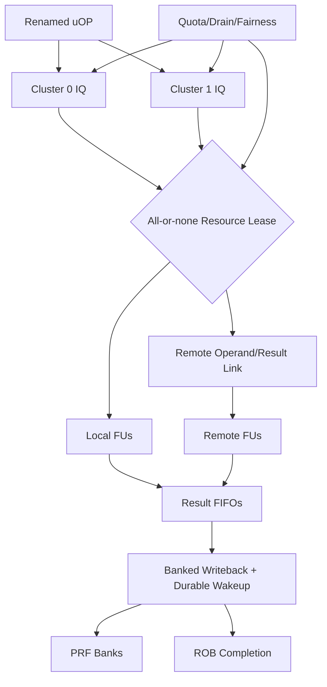

# 第2阶段：分布式执行织构、资源租赁与Completion

状态：**执行指南，不是已完成实现**。本分阶段文件供多人并行分配；所有命令、文件、测试和结果都必须等对应任务实现后产生。任何“完成”必须能引用真实 Git commit/artifact hash/日志，不凭口头状态。

## 1. 这个子系统是做什么的

两个物理cluster真实执行OoO uOP，资源可动态路由/租赁，结果在背压、kill、重配下不丢、不重、不旧代污染。

## 2. 为什么存在 / 上游输入

- 上游输入：S0协议、S1 rename/ROB和基础FU。
- 已有依赖：S0/S1 deliverables、RAM wrapper、resource contract。
- 本阶段输出：真实多hart cohort和最终性能结论；LSU完整推测在S3。
- 首要原则：p0必须证明真实双cluster，不得用解释器/simplified path。不可停顿FU必须预留terminal slot；completion credit和PRF value-visible是首要正确性。

issue团队负责ready/age；broker团队负责all-or-none资源；completion团队负责durable value和ack；network团队负责远程返回与取消；共同做fixed/dynamic A/B。

## 3. 总体结构

图中的箭头是数据/控制依赖；性能策略不得在正确性前打开。每个分支可以分给不同负责人，但跨接口字段以 [implementation-plan.md](implementation-plan.md) §1.3 和本文件任务卡为准，不能各团队私改。

## 4. 团队分工与进度追踪

| Team | 负责任务 | 当前状态 | Owner | 证据链接 | 下一动作 | Blocker |
|---|---|---|---|---|---|---|
| issue负责人 | I-022 | Not started | 待定 | 待填 artifact/commit | 读取任务卡并建立输入锁 | 待填 |
| fabric负责人 | I-023 | Not started | 待定 | 待填 artifact/commit | 读取任务卡并建立输入锁 | 待填 |
| resource broker负责人 | I-024 | Not started | 待定 | 待填 artifact/commit | 读取任务卡并建立输入锁 | 待填 |
| completion负责人 | I-025 | Not started | 待定 | 待填 artifact/commit | 读取任务卡并建立输入锁 | 待填 |
| writeback负责人 | I-026 | Not started | 待定 | 待填 artifact/commit | 读取任务卡并建立输入锁 | 待填 |
| locality负责人 | I-027 | Not started | 待定 | 待填 artifact/commit | 读取任务卡并建立输入锁 | 待填 |
| interconnect负责人 | I-028 | Not started | 待定 | 待填 artifact/commit | 读取任务卡并建立输入锁 | 待填 |
| scheduler负责人 | I-029 | Not started | 待定 | 待填 artifact/commit | 读取任务卡并建立输入锁 | 待填 |
| fairness负责人 | I-030 | Not started | 待定 | 待填 artifact/commit | 读取任务卡并建立输入锁 | 待填 |
| reconfiguration负责人 | I-031 | Not started | 待定 | 待填 artifact/commit | 读取任务卡并建立输入锁 | 待填 |
| rename性能负责人 | I-032 | Not started | 待定 | 待填 artifact/commit | 读取任务卡并建立输入锁 | 待填 |
| 验证负责人 | V-018 | Not started | 待定 | 待填 artifact/commit | 读取任务卡并建立输入锁 | 待填 |
| 验证负责人 | V-024 | Not started | 待定 | 待填 artifact/commit | 读取任务卡并建立输入锁 | 待填 |
| 验证负责人 | V-028 | Not started | 待定 | 待填 artifact/commit | 读取任务卡并建立输入锁 | 待填 |
| 验证负责人 | V-029 | Not started | 待定 | 待填 artifact/commit | 读取任务卡并建立输入锁 | 待填 |
| 验证负责人 | V-031 | Not started | 待定 | 待填 artifact/commit | 读取任务卡并建立输入锁 | 待填 |
| 验证负责人 | V-032 | Not started | 待定 | 待填 artifact/commit | 读取任务卡并建立输入锁 | 待填 |
| 验证负责人 | V-033 | Not started | 待定 | 待填 artifact/commit | 读取任务卡并建立输入锁 | 待填 |
| 验证负责人 | V-034 | Not started | 待定 | 待填 artifact/commit | 读取任务卡并建立输入锁 | 待填 |
| 验证负责人 | V-035 | Not started | 待定 | 待填 artifact/commit | 读取任务卡并建立输入锁 | 待填 |
| 验证负责人 | V-042 | Not started | 待定 | 待填 artifact/commit | 读取任务卡并建立输入锁 | 待填 |
| 多hart验证负责人 | V-076 | Not started | 待定 | 待填 artifact/commit | 读取任务卡并建立输入锁 | 待填 |

状态只能取 `Not started / Inputs locked / In progress / Blocked / Evidence complete / Accepted`。Accepted 需要阶段负责人和验证负责人同时签字；Blocked 必须写最小外部事实、影响范围、请求对象和下一日期，不写“快好了”。

## 5. 可跟踪任务卡

每张卡含实现接口、数据、设计取舍、步骤、交接、验证和回退。完成定义：对应 `Pass` 全部有直接证据，相关负控制也工作；不是“代码写完”或“仿真曾跑过”。

### I-022 — 实现 local IQ 与 oldest-ready 仲裁

- **负责/门禁**：issue负责人；local ready选择。
- **前置依赖**：I-015, I-016, I-018；仍受 implementation-plan 集成依赖表约束。
- **做什么**：实现 insert/wakeup/select/kill；初始仅 local FU；运行 CASE=iq.wakeup_insert_select，覆盖同周期 enqueue+wakeup 与 FU backpressure。
- **输入数据/接口**：IQ、ready tag+generation、age、FU grant
- **输出与交接**：local IQ、issue decisions
- **设计取舍**：保守durable wakeup，不做speculative ready
- **实现微步骤**：实现entry valid/ready/age/identity；接受durable wakeup并匹配generation；oldest-ready选择并处理insert同拍；grant后等待FU/lease确认；kill/flush保留必要entry；跑wakeup/insert/select压力；由V-027/V-032复核。
- **主要阻塞风险**：丢失/重复wakeup、tag alias、grant未接受；阻断规则：wakeup tag 不带 generation，或 grant 未被 FU 接受就移除 entry。
- **验收证据**：仅 ready/live uOP 发射一次；bounded-ready 队列不饿死 oldest entry。；验证口径：tag ownership、backpressure
- **失败/回退动作**：单队列顺序发射
- **来源覆盖**：distributed scheduling, wakeup。；来源 architecture-review.md。
- **进度日志**：2026-09-29 规划生成——未开始；后续每次状态变化追加日期、commit/artifact、证据和下一步。

### I-023 — 实现静态双 cluster 对照

- **负责/门禁**：fabric负责人；真实双cluster执行。
- **前置依赖**：I-022, I-012, I-017；仍受 implementation-plan 集成依赖表约束。
- **做什么**：将程序实际接入两个 cluster，先固定 affinity；执行 independent ALU 与 RAW chains，证明可同时存在多条在途/乱序完成。
- **输入数据/接口**：两cluster、共享M/DIV、fixed affinity
- **输出与交接**：fixed dual-cluster p0 candidate
- **设计取舍**：先证明并行资源，不先证明动态收益
- **实现微步骤**：实例化两套IQ/ALU/PRF bank route；固定初始dispatch affinity；接入共享MUL/DIV仲裁；执行独立与RAW程序；trace检查两cluster实际工作；同reference比较每event；由V-028复核。
- **主要阻塞风险**：第二cluster未用、仍解释器式单执行、OoO假象；阻断规则：第二 cluster 永远不被使用，或实际仍单发射解释执行却声称 OoO。
- **验收证据**：retire 对照正确且 trace 显示两个 cluster 执行不同 live uOP，younger 可先 complete 但不能先 retire。；验证口径：dynamic activity trace、diff
- **失败/回退动作**：第二cluster关为测试模式并阻断p0
- **来源覆盖**：functional OoO prototype, A/B control。；来源 SRC-01/SRC-02/SRC-03, validation-plan.md。
- **进度日志**：2026-09-29 规划生成——未开始；后续每次状态变化追加日期、commit/artifact、证据和下一步。

### I-024 — 实现原子资源租约

- **负责/门禁**：resource broker负责人；原子租赁。
- **前置依赖**：I-023, I-005；仍受 implementation-plan 集成依赖表约束。
- **做什么**：采用 all-or-none issue grant；只有下游有容纳结果的 credit 才接受不能 stall 的 FU；运行 CASE=lease.conflict_and_cancel。
- **输入数据/接口**：FU/operand/route/result credit、lease generation
- **输出与交接**：resource allocator、ledger
- **设计取舍**：all-or-none launch，不用部分占用等待
- **实现微步骤**：定义issue所需资源集合；原子检查并同时扣credit；拒绝不修改状态；绑定lease generation；cancel/complete恰一次归还；跑冲突/取消矩阵；由V-032/V-034复核。
- **主要阻塞风险**：部分资源死锁、double return、旧owner credit；阻断规则：只预留 FU 再无限等待 WB，或 flush 重复归还 credit。
- **验收证据**：每次 grant 同时占用全部必要资源，拒绝无副作用；release/cancel 恰好一次。；验证口径：credit conservation、stress
- **失败/回退动作**：所有长延迟操作预留真实终端槽
- **来源覆盖**：resource scheduling, deadlock avoidance。；来源 architecture-review.md, SRC-01。
- **进度日志**：2026-09-29 规划生成——未开始；后续每次状态变化追加日期、commit/artifact、证据和下一步。

### I-025 — 实现 per-cluster result FIFO

- **负责/门禁**：completion负责人；结果不丢失。
- **前置依赖**：I-024；仍受 implementation-plan 集成依赖表约束。
- **做什么**：多 FU 同周期完成时按实际端口 buffer/arbitrate；对可暂停和不可暂停单元分别设计保证；运行 CASE=completion.fu_collision。
- **输入数据/接口**：result FIFO、fixed/variable latency、exception
- **输出与交接**：result queues、completion packets
- **设计取舍**：不可停顿单元需预分配结果槽
- **实现微步骤**：为每FU分类可/不可停顿；接入local result FIFO；同周期多结果arbitrate；为异常和数据分字段/优先级；满队列backpressure；跑ALU/MUL/load同拍完成；由V-026/V-032复核。
- **主要阻塞风险**：WB collision丢数据、异常被普通结果覆盖；阻断规则：假设 multiply/load 永不同时返回，或 valid pulse 不能保持。
- **验收证据**：每个 issued live result 被 buffer 或明确 kill，满队列不丢值，异常不被普通结果覆盖。；验证口径：collision/conservation
- **失败/回退动作**：限制同拍启动直到能力证明
- **来源覆盖**：decoupled execution/completion, result conservation。；来源 architecture-review.md, SRC-01/SRC-02。
- **进度日志**：2026-09-29 规划生成——未开始；后续每次状态变化追加日期、commit/artifact、证据和下一步。

### I-026 — 实现 banked WB 与 value-visible wakeup

- **负责/门禁**：writeback负责人；值可见才唤醒。
- **前置依赖**：I-025, I-015；仍受 implementation-plan 集成依赖表约束。
- **做什么**：result arbitrate 到 PRF；写入或可证明保留的 bypass 后才置 ready/complete；运行 CASE=wb.same_bank_many_producers。
- **输入数据/接口**：PRF ack、wakeup、ROB ack、bank arbitration
- **输出与交接**：WB scheduler、durable wakeup
- **设计取舍**：真实ready，不预测WB成功
- **实现微步骤**：仲裁completion到PRF bank；写入/等价可读后发value-visible；分别跟踪PRF/ROB/wakeup ack；重新投递但bitmap防重复；同bank多producer stress；x0/exception不发消费值；由V-013/V-027复核。
- **主要阻塞风险**：值未durable就ready、ack丢失、双producer；阻断规则：FU done 提前 wakeup，而值在后续争用中失踪。
- **验收证据**：冲突结果延迟而不丢失；同一 physical generation 只有正确 producer 写入；消费者看到已承诺 value。；验证口径：collision/ack invariants
- **失败/回退动作**：无bypass全PRF路径
- **来源覆盖**：unified writeback without global CDB, wakeup correctness。；来源 architecture-review.md。
- **进度日志**：2026-09-29 规划生成——未开始；后续每次状态变化追加日期、commit/artifact、证据和下一步。

### I-027 — 实现 local bypass 快路径

- **负责/门禁**：locality负责人；local快路径。
- **前置依赖**：I-026；仍受 implementation-plan 集成依赖表约束。
- **做什么**：限定连线范围；bypass 保留 producer identity，miss/冲突回退 PRF；运行 CASE=bypass.local_raw_chain。
- **输入数据/接口**：local bypass、registered route、dependency chain
- **输出与交接**：local bypass、latency evidence
- **设计取舍**：只优化同cluster依赖，错误时PRF fallback
- **实现微步骤**：识别本地consumer/producer；实现限定mux与tag/generation检查；保留PRF读取fallback；测量0/1-cycle local path；跑RAW chain on/off；报告cycles而非虚构latency；由V-028复核。
- **主要阻塞风险**：组合环、错tag转发、latency未实测；阻断规则：为追求单周期绕过 credit/identity 或形成组合 ready loop。
- **验收证据**：开关 bypass trace 一致；连续 RAW chain 得到正确值且 reported latency 来自 measured cycles。；验证口径：metamorphic trace、timing
- **失败/回退动作**：禁用bypass
- **来源覆盖**：latency island, local data movement。；来源 SRC-03, architecture-review.md。
- **进度日志**：2026-09-29 规划生成——未开始；后续每次状态变化追加日期、commit/artifact、证据和下一步。

### I-028 — 实现 remote operand/result 链路

- **负责/门禁**：interconnect负责人；远程路由可靠。
- **前置依赖**：I-026, I-005, I-018；仍受 implementation-plan 集成依赖表约束。
- **做什么**：实现至少一拍 registered link 与返回路径，独立背压；运行 CASE=remote.kill_with_delayed_response，注入 1/2/4/8 拍延迟。
- **输入数据/接口**：request/return channels、route generation、latencies
- **输出与交接**：remote fabric link
- **设计取舍**：registered单跳起点，不默认全互连
- **实现微步骤**：实现独立request/response path；绑定home/remote IDs和generation；注册1-cycle起步链路并参数化；实现cancel/late response丢弃；随机注入1/2/4/8拍返回；跑credit守恒与progress；由V-029/V-032复核。
- **主要阻塞风险**：循环等待、旧response别名、无限背压；阻断规则：request/response 共用有限资源形成循环等待，或假定永远一拍返回。
- **验收证据**：随机背压下数据/credit 守恒；remote response 不写已复用的 home slot。；验证口径：backpressure/stale/cancel suites
- **失败/回退动作**：禁远程issue保持双cluster独立
- **来源覆盖**：remote execution, network latency, tagged completion。；来源 architecture-review.md, SRC-01/SRC-02。
- **进度日志**：2026-09-29 规划生成——未开始；后续每次状态变化追加日期、commit/artifact、证据和下一步。

### I-029 — 实现动态 steering 基础策略

- **负责/门禁**：scheduler负责人；确定性动态调度。
- **前置依赖**：I-028, I-024；仍受 implementation-plan 集成依赖表约束。
- **做什么**：先 deterministic locality-first + least-loaded + age tie-break，不引入不可解释 predictor；同 ELF/seed 固定与动态模式对照。
- **输入数据/接口**：capability、queue occupancy、locality、age
- **输出与交接**：steering policy、decision log
- **设计取舍**：先解释性强policy，不先ML/neural
- **实现微步骤**：计算每个候选cluster合法性；本地依赖优先，再least loaded；age作为进展tie-break/escalation；导出决策reason trace；与fixed模式同资源对比；跑capacity/locality矩阵；由V-028/V-033复核。
- **主要阻塞风险**：资源不等对照、capability错配、饥饿；阻断规则：load balancing 无视 dependency lifetime 或为凑性能改变物理资源数。
- **验收证据**：incompatible FU 永不接收；资源饱和只 stall/retry，不改变架构结果。；验证口径：same trace、coverage
- **失败/回退动作**：固定affinity模式
- **来源覆盖**：dynamic route scheduling, controlled experiment。；来源 SRC-01/SRC-02/SRC-03。
- **进度日志**：2026-09-29 规划生成——未开始；后续每次状态变化追加日期、commit/artifact、证据和下一步。

### I-030 — 实现 queue/port 配额与饥饿上界

- **负责/门禁**：fairness负责人；前向进展。
- **前置依赖**：I-029；仍受 implementation-plan 集成依赖表约束。
- **做什么**：为 ready oldest 与返回通道保留逃生容量，写 fairness assumptions；测试饱和 short/long FU 混合与持续新请求。
- **输入数据/接口**：aging、服务下界、escape capacity、假设
- **输出与交接**：fairness policy、proof assumptions
- **设计取舍**：安全无条件，liveness依赖明确环境
- **实现微步骤**：列出wait graph和环境响应假设；给completion/cancel保留容量；实现age escalation和配额；计算配置下服务上界；跑持续高优先级压力；区分环境timeout与deadlock；由V-033/formal复核。
- **主要阻塞风险**：scalar永久抢占、无限假设、timeout误deadlock；阻断规则：用无限 timeout 当公平性证明，或高优先级 scalar 永久饿死 vector。
- **验收证据**：在明确的“下游最终 ready/内存有界返回”假设下存在可计算等待上界，并被 assertion/压力用例覆盖。；验证口径：progress tests、formal small instance
- **失败/回退动作**：静态quota保证
- **来源覆盖**：deadlock, livelock, fairness, QoS。；来源 architecture-review.md。
- **进度日志**：2026-09-29 规划生成——未开始；后续每次状态变化追加日期、commit/artifact、证据和下一步。

### I-031 — 实现资源所有权变更状态机

- **负责/门禁**：reconfiguration负责人；所有权安全切换。
- **前置依赖**：I-030, I-018；仍受 implementation-plan 集成依赖表约束。
- **做什么**：从软件受控静态配置切换开始；遍历每个 state 时的 flush/reset/error；运行 CASE=reconfigure.drain_and_generation。
- **输入数据/接口**：FREEZE/DRAIN/REVOKED/INSTALL、outstanding、generation
- **输出与交接**：resource broker FSM
- **设计取舍**：先指令边界drain，再live migration
- **实现微步骤**：实现状态机与幂等控制消息；分别计IQ/FU/result/memory/return outstanding；冻结新准入但服务旧工作；全部ack后发布new owner generation；异常/reset/cancel分支覆盖；由V-034/V-035复核；记录切换成本。
- **主要阻塞风险**：只看IQ空、半发布、旧route包、cancel卡死；阻断规则：仅 IQ 空就认为 FU/network/LSU 已 drain，或切换时丢 architectural state。
- **验收证据**：旧 owner 的 uOP/结果/credit 全部结算才发布新 owner；重复控制消息幂等。；验证口径：drain matrix、race cases
- **失败/回退动作**：保留旧配置并报告停滞
- **来源覆盖**：dynamic resource ownership, two timescales。；来源 SRC-01/SRC-02/SRC-03, architecture-review.md。
- **进度日志**：2026-09-29 规划生成——未开始；后续每次状态变化追加日期、commit/artifact、证据和下一步。

### I-032 — 实现 bank-aware physical allocation

- **负责/门禁**：rename性能负责人；bank-aware分配优化。
- **前置依赖**：I-031, I-014；仍受 implementation-plan 集成依赖表约束。
- **做什么**：在保持合法 tag allocation 的前提下添加可关闭 bank preference；冲突时可用任何合法空闲 bank；运行 CASE=rename.bank_bias_exhaustion。
- **输入数据/接口**：bank pressure、producer locality、fallback
- **输出与交接**：bank-aware allocation、A/B result
- **设计取舍**：合法空闲bank always acceptable，affinity不是正确性
- **实现微步骤**：以普通free-list为正确baseline；实现bank preference计数；冲突时选择任何合法空闲bank；开关对照WB/read conflicts；跑exhaustion和bias矩阵；决定是否默认开启；由V-027/V-076复核。
- **主要阻塞风险**：银行永久假满、泄漏、收益未测量；阻断规则：仅指定 bank 空就永久卡住，或使用未释放 physical tag。
- **验收证据**：任何偏置都不泄漏 free registers；同资源下测得 stall/WB/read 冲突变化而非先假定收益。；验证口径：ownership+performance pairing
- **失败/回退动作**：关闭preference
- **来源覆盖**：resource-aware rename, PRF port economy。；来源 SRC-01, architecture-review.md。
- **进度日志**：2026-09-29 规划生成——未开始；后续每次状态变化追加日期、commit/artifact、证据和下一步。

### V-018 — 分开 architectural memory 与可见 store

- **负责/门禁**：验证负责人；验证证据闭合。
- **前置依赖**：V-011, V-013；仍受 implementation-plan 集成依赖表约束。
- **做什么**：覆盖所有 load/store 宽度、符号扩展、部分 byte mask、forwarding、跨行、错误路径 store；记录 store commit 与真正 drain，比较 reference memory 及最后 byte signature。
- **输入数据/接口**：LSU/store-buffer 实现、memory-operation schema。
- **输出与交接**：有因果 ID 的 load/store/visibility trace。
- **设计取舍**：有限集合/模型边界明确，不用样本数冒充形式证明
- **实现微步骤**：冻结该任务输入、版本与capability交集；展开有限case/seed/budget manifest；实现真实检查器并接入负控制；执行正控制和故障注入；闭合计划/执行/通过/失败/unsupported计数；最小化失败并建立replay；阶段负责人签收或阻断后续gate。
- **主要阻塞风险**：静默skip、mock echo、空覆盖率、把deferred当成功；阻断规则：仅比较 rd 漏掉错误 store、将 cache refill 当 load effect、重复 drain、用 DUT memory 覆盖 reference 后宣称一致。
- **验收证据**：每个可见 byte 有合法已提交 producer，load 返回值与允许来源相符，取消 store 不外泄。；验证口径：每个可见 byte 有合法已提交 producer，load 返回值与允许来源相符，取消 store 不外泄。
- **失败/回退动作**：仅比较 rd 漏掉错误 store、将 cache refill 当 load effect、重复 drain、用 DUT memory 覆盖 reference 后宣称一致。
- **来源覆盖**：SRC-03 §Memory Operation 也应该成为 Packet、§Store visibility obeys selected model。；来源 VR-003, VR-014。
- **进度日志**：2026-09-29 规划生成——未开始；后续每次状态变化追加日期、commit/artifact、证据和下一步。

### V-024 — 注入 trace 丢失、重复与乱序

- **负责/门禁**：验证负责人；验证证据闭合。
- **前置依赖**：V-008, V-020；仍受 implementation-plan 集成依赖表约束。
- **做什么**：在 DUT 事件传输边界丢一个 commit、复制一个 store、交换同 hart 相邻事件、错 hart ID、截断文件；与原始 trace 分别 replay。
- **输入数据/接口**：真实 DUT canonical event trace、transport checker。
- **输出与交接**：事件完整性故障检测记录。
- **设计取舍**：有限集合/模型边界明确，不用样本数冒充形式证明
- **实现微步骤**：冻结该任务输入、版本与capability交集；展开有限case/seed/budget manifest；实现真实检查器并接入负控制；执行正控制和故障注入；闭合计划/执行/通过/失败/unsupported计数；最小化失败并建立replay；阶段负责人签收或阻断后续gate。
- **主要阻塞风险**：静默skip、mock echo、空覆盖率、把deferred当成功；阻断规则：只以末尾 pass magic 判成功、按 PC 去重合法重复 loop、跨 hart 事件串扰未报。
- **验收证据**：五类故障均因明确完整性/语义检查失败；不能通过补齐猜测事件得到 PASS。；验证口径：五类故障均因明确完整性/语义检查失败；不能通过补齐猜测事件得到 PASS。
- **失败/回退动作**：只以末尾 pass magic 判成功、按 PC 去重合法重复 loop、跨 hart 事件串扰未报。
- **来源覆盖**：SRC-03 §Hierarchical completion fabric、§per-hart retirement。；来源 VR-003, VR-011。
- **进度日志**：2026-09-29 规划生成——未开始；后续每次状态变化追加日期、commit/artifact、证据和下一步。

### V-028 — 对比 fixed/local/remote 调度语义

- **负责/门禁**：验证负责人；验证证据闭合。
- **前置依赖**：V-026, V-027；仍受 implementation-plan 集成依赖表约束。
- **做什么**：对每程序固定输入和 external stream，在 fixed/local/remote/reconfigured 四种调度下运行；故意改变完成先后与网络延迟，比较 canonical architectural trace。
- **输入数据/接口**：同资源固定与弹性后端里程碑、64 个无竞争确定性程序。
- **输出与交接**：64×4 metamorphic 结果及 route 延迟记录。
- **设计取舍**：有限集合/模型边界明确，不用样本数冒充形式证明
- **实现微步骤**：冻结该任务输入、版本与capability交集；展开有限case/seed/budget manifest；实现真实检查器并接入负控制；执行正控制和故障注入；闭合计划/执行/通过/失败/unsupported计数；最小化失败并建立replay；阶段负责人签收或阻断后续gate。
- **主要阻塞风险**：静默skip、mock echo、空覆盖率、把deferred当成功；阻断规则：以不同调度不同结果当合法、通过禁用远程模式规避失败、同程序多次运行却未改变拓扑。
- **验收证据**：规定确定性架构状态和内存结果一致；只有 cycle/route 等微架构指标变化。；验证口径：规定确定性架构状态和内存结果一致；只有 cycle/route 等微架构指标变化。
- **失败/回退动作**：以不同调度不同结果当合法、通过禁用远程模式规避失败、同程序多次运行却未改变拓扑。
- **来源覆盖**：SRC-03 §architectural order 固定 execution topology 动态、§Fast Local Execution Island。；来源 SRC-03:55-369, SRC-03:1735-1818, VR-014。
- **进度日志**：2026-09-29 规划生成——未开始；后续每次状态变化追加日期、commit/artifact、证据和下一步。

### V-029 — 在回滚后投递 stale completion

- **负责/门禁**：验证负责人；验证证据闭合。
- **前置依赖**：V-028；仍受 implementation-plan 集成依赖表约束。
- **做什么**：分别将 ALU、DIV、load、vector packet（启用后）完成延迟到 branch kill 后、新 owner 租用后与 tag 重用后；对应 32 个命名回滚时点×4 排列。
- **输入数据/接口**：epoch/lease/producer generation 实现、可延迟 completion transport。
- **输出与交接**：被拒绝 stale message 计数与无 architectural 污染证据。
- **设计取舍**：有限集合/模型边界明确，不用样本数冒充形式证明
- **实现微步骤**：冻结该任务输入、版本与capability交集；展开有限case/seed/budget manifest；实现真实检查器并接入负控制；执行正控制和故障注入；闭合计划/执行/通过/失败/unsupported计数；最小化失败并建立replay；阶段负责人签收或阻断后续gate。
- **主要阻塞风险**：静默skip、mock echo、空覆盖率、把deferred当成功；阻断规则：只检查 ROB 但错误写回 PRF、旧 ready 唤醒新消费者、无限占用 credit。
- **验收证据**：stale 消息不能改 PRF/VRF/ready/ROB/memory；被丢弃事务仍正确释放信用；所有活跃新指令可继续。；验证口径：stale 消息不能改 PRF/VRF/ready/ROB/memory；被丢弃事务仍正确释放信用；所有活跃新指令可继续。
- **失败/回退动作**：只检查 ROB 但错误写回 PRF、旧 ready 唤醒新消费者、无限占用 credit。
- **来源覆盖**：SRC-03 §No wrong-epoch uOP can update architectural state、§Branch Mask/Epoch。；来源 SRC-03:1878-1928, VR-011。
- **进度日志**：2026-09-29 规划生成——未开始；后续每次状态变化追加日期、commit/artifact、证据和下一步。

### V-031 — 检验 epoch 与 lease 计数回绕

- **负责/门禁**：验证负责人；验证证据闭合。
- **前置依赖**：V-029, V-030；仍受 implementation-plan 集成依赖表约束。
- **做什么**：让回滚/租约切换超过两轮完整 generation 空间，保留最旧消息直到同低位 tag 再现；证明 drain 或足够宽计数阻止 ABA。
- **输入数据/接口**：generation 位宽与最迟响应寿命合同、缩小位宽验证配置。
- **输出与交接**：回绕反例搜索及寿命界证明记录。
- **设计取舍**：有限集合/模型边界明确，不用样本数冒充形式证明
- **实现微步骤**：冻结该任务输入、版本与capability交集；展开有限case/seed/budget manifest；实现真实检查器并接入负控制；执行正控制和故障注入；闭合计划/执行/通过/失败/unsupported计数；最小化失败并建立replay；阶段负责人签收或阻断后续gate。
- **主要阻塞风险**：静默skip、mock echo、空覆盖率、把deferred当成功；阻断规则：“64 位不会回绕”替代参数化证明、小配置 alias 未检查、overflow 静默复用。
- **验收证据**：不能把跨完整回绕旧事务识别为新事务；位宽约束由最大存活时间/排空协议推导。；验证口径：不能把跨完整回绕旧事务识别为新事务；位宽约束由最大存活时间/排空协议推导。
- **失败/回退动作**：“64 位不会回绕”替代参数化证明、小配置 alias 未检查、overflow 静默复用。
- **来源覆盖**：SRC-03 §Epoch ID、§coarse-grain resource reconfiguration。；来源 SRC-03:282-323, SRC-03:1878-1928, VR-011。
- **进度日志**：2026-09-29 规划生成——未开始；后续每次状态变化追加日期、commit/artifact、证据和下一步。

### V-032 — 检验网络 credit 守恒和背压

- **负责/门禁**：验证负责人；验证证据闭合。
- **前置依赖**：V-028；仍受 implementation-plan 集成依赖表约束。
- **做什么**：填满每一输入/输出队列，逐个释放，覆盖同时 push/pop、kill+pop、重复返回信用、下游长期 stall；逐端口核算 issued−returned。
- **输入数据/接口**：router/IQ/result buffer credit 协议、2-entry local result buffer 候选。
- **输出与交接**：credit 守恒证明与饱和状态 trace。
- **设计取舍**：有限集合/模型边界明确，不用样本数冒充形式证明
- **实现微步骤**：冻结该任务输入、版本与capability交集；展开有限case/seed/budget manifest；实现真实检查器并接入负控制；执行正控制和故障注入；闭合计划/执行/通过/失败/unsupported计数；最小化失败并建立replay；阶段负责人签收或阻断后续gate。
- **主要阻塞风险**：静默skip、mock echo、空覆盖率、把deferred当成功；阻断规则：信用超发、kill 双还、packet 永久滞留、绕过 backpressure 覆盖未消费结果。
- **验收证据**：对每条通道 free+occupied+inflight 恒等于容量；不丢包、不重复、无组合 ready 环依赖。；验证口径：对每条通道 free+occupied+inflight 恒等于容量；不丢包、不重复、无组合 ready 环依赖。
- **失败/回退动作**：信用超发、kill 双还、packet 永久滞留、绕过 backpressure 覆盖未消费结果。
- **来源覆盖**：SRC-03 §Scheduler Hierarchy、§Completion Fabric、§distributed waiting state。；来源 SRC-03:230-281, SRC-03:1273-1342, VR-011。
- **进度日志**：2026-09-29 规划生成——未开始；后续每次状态变化追加日期、commit/artifact、证据和下一步。

### V-033 — 在有界环境下验证 forward progress

- **负责/门禁**：验证负责人；验证证据闭合。
- **前置依赖**：V-026, V-032；仍受 implementation-plan 集成依赖表约束。
- **做什么**：为 ALU/DIV/load/return/commit 等资源构造循环等待压力；在每 64 cycles 至少一个响应的约束下检查有界完成；另注入永久不响应确认 code 3 与挂起资源诊断。
- **输入数据/接口**：环境响应上界、仲裁公平性合同、wait-for graph。
- **输出与交接**：环境假设、计算的进展界与 watchdog 命中证据。
- **设计取舍**：有限集合/模型边界明确，不用样本数冒充形式证明
- **实现微步骤**：冻结该任务输入、版本与capability交集；展开有限case/seed/budget manifest；实现真实检查器并接入负控制；执行正控制和故障注入；闭合计划/执行/通过/失败/unsupported计数；最小化失败并建立replay；阶段负责人签收或阻断后续gate。
- **主要阻塞风险**：静默skip、mock echo、空覆盖率、把deferred当成功；阻断规则：只有平均吞吐、用不现实公平性 assume 掩盖设计饥饿、无法区分合法 WFI 与 deadlock。
- **验收证据**：有界场景中每个 eligible oldest 工作在合同内进展；永久不响应归类环境 timeout 而非通过。；验证口径：有界场景中每个 eligible oldest 工作在合同内进展；永久不响应归类环境 timeout 而非通过。
- **失败/回退动作**：只有平均吞吐、用不现实公平性 assume 掩盖设计饥饿、无法区分合法 WFI 与 deadlock。
- **来源覆盖**：SRC-03 §Criticality/age scheduling、§Elastic Latency Execution。；来源 SRC-03:1200-1256, SRC-03:1343-1424, VR-011。
- **进度日志**：2026-09-29 规划生成——未开始；后续每次状态变化追加日期、commit/artifact、证据和下一步。

### V-034 — 验证资源重配置 drain 与原子发布

- **负责/门禁**：验证负责人；验证证据闭合。
- **前置依赖**：V-031, V-033；仍受 implementation-plan 集成依赖表约束。
- **做什么**：在 IQ/PRF consumer/result buffer/LSQ/store buffer/vector descriptor 各有未完成事务时请求重配；观察停止接收、完成/取消、依赖与数据保留、ownership 新代发布。
- **输入数据/接口**：lease 协议状态机、重配实现里程碑、16 drain 状态×8 刺激矩阵。
- **输出与交接**：每类资源 drain ledger 与 reconfiguration transition trace。
- **设计取舍**：有限集合/模型边界明确，不用样本数冒充形式证明
- **实现微步骤**：冻结该任务输入、版本与capability交集；展开有限case/seed/budget manifest；实现真实检查器并接入负控制；执行正控制和故障注入；闭合计划/执行/通过/失败/unsupported计数；最小化失败并建立replay；阶段负责人签收或阻断后续gate。
- **主要阻塞风险**：静默skip、mock echo、空覆盖率、把deferred当成功；阻断规则：只看 IQ 空忽略 memory/return in-flight，非幂等访问重做，资源一度同时归两 hart。
- **验收证据**：所有规定旧代引用解除后才授予新 owner；未迁移 architectural state 不丢失；确认后旧代请求全部拒绝。；验证口径：所有规定旧代引用解除后才授予新 owner；未迁移 architectural state 不丢失；确认后旧代请求全部拒绝。
- **失败/回退动作**：只看 IQ 空忽略 memory/return in-flight，非幂等访问重做，资源一度同时归两 hart。
- **来源覆盖**：SRC-03 §Dynamic scaling 两个时间尺度、§Execution Ownership 动态。；来源 SRC-03:282-323, SRC-03:2347-2528, VR-011。
- **进度日志**：2026-09-29 规划生成——未开始；后续每次状态变化追加日期、commit/artifact、证据和下一步。

### V-035 — 验证重配置与异常/取消的竞争

- **负责/门禁**：验证负责人；验证证据闭合。
- **前置依赖**：V-014, V-015, V-034；仍受 implementation-plan 集成依赖表约束。
- **做什么**：在 prepare/drain/publish/ack 四边界分别注入 trap、IRQ、请求撤销与 reset；验证失败重配保留旧配置或进入明确恢复状态。
- **输入数据/接口**：重配协议、trap/IRQ/reset/软件取消请求。
- **输出与交接**：竞争优先级表及逐分支 state trace。
- **设计取舍**：有限集合/模型边界明确，不用样本数冒充形式证明
- **实现微步骤**：冻结该任务输入、版本与capability交集；展开有限case/seed/budget manifest；实现真实检查器并接入负控制；执行正控制和故障注入；闭合计划/执行/通过/失败/unsupported计数；最小化失败并建立replay；阶段负责人签收或阻断后续gate。
- **主要阻塞风险**：静默skip、mock echo、空覆盖率、把deferred当成功；阻断规则：cancel 后永久等 ack、IRQ 错 hart、恢复路径只在普通成功时有效。
- **验收证据**：没有半发布配置；trap 精确且资源无泄漏；取消不吞已接受事务；所有失败路径可继续运行。；验证口径：没有半发布配置；trap 精确且资源无泄漏；取消不吞已接受事务；所有失败路径可继续运行。
- **失败/回退动作**：cancel 后永久等 ack、IRQ 错 hart、恢复路径只在普通成功时有效。
- **来源覆盖**：SRC-03 §precise exceptions、§resource leasing、§five personalities。；来源 SRC-03:282-323, SRC-03:727-789, VR-012。
- **进度日志**：2026-09-29 规划生成——未开始；后续每次状态变化追加日期、commit/artifact、证据和下一步。

### V-042 — 证明 Fabric 局部协议不变量

- **负责/门禁**：验证负责人；验证证据闭合。
- **前置依赖**：V-031, V-032, V-034；仍受 implementation-plan 集成依赖表约束。
- **做什么**：分别证明无双 owner、无 stale write、credit conservation、kill 后不能 commit、重配发布前旧代排空；用非空 traffic cover 和故意移除 guard 的变异版检验性质非空。
- **输入数据/接口**：小实例 formal wrappers、tag/credit/lease 不变量。
- **输出与交接**：每不变量独立 proof/反例与参数推广边界。
- **设计取舍**：有限集合/模型边界明确，不用样本数冒充形式证明
- **实现微步骤**：冻结该任务输入、版本与capability交集；展开有限case/seed/budget manifest；实现真实检查器并接入负控制；执行正控制和故障注入；闭合计划/执行/通过/失败/unsupported计数；最小化失败并建立replay；阶段负责人签收或阻断后续gate。
- **主要阻塞风险**：静默skip、mock echo、空覆盖率、把deferred当成功；阻断规则：所有输入 assume 无冲突、无 cover、只检查 final output 忽略中间 architectural 污染。
- **验收证据**：小实例性质证明且 mutant 至少产生预期反例；大容量参数推广有数学/归纳说明，否则只宣称小实例。；验证口径：小实例性质证明且 mutant 至少产生预期反例；大容量参数推广有数学/归纳说明，否则只宣称小实例。
- **失败/回退动作**：所有输入 assume 无冲突、无 cover、只检查 final output 忽略中间 architectural 污染。
- **来源覆盖**：SRC-03 §uOP tags、§Completion Fabric、§Dynamic reconfiguration。；来源 SRC-03:130-369, SRC-03:1273-1595, VR-011。
- **进度日志**：2026-09-29 规划生成——未开始；后续每次状态变化追加日期、commit/artifact、证据和下一步。

### V-076 — 分离正确性 gate 与性能归因

- **负责/门禁**：多hart验证负责人；验证证据闭合。
- **前置依赖**：V-028, V-060, V-063, V-071, V-075；仍受 implementation-plan 集成依赖表约束。
- **做什么**：固定 resource/compiler/input 后比较 fixed vs elastic、L1-only vs LLB vs LLB+coalescer、cohort off/on、1×8/2×4/4×2；记录 useful work、cycles、retire/hart、network bytes、wait/occupancy、frequency 来源与能耗代理范围。
- **输入数据/接口**：已全部通过正确性检查的 workload、固定资源对照、未来 experiment CLI。
- **输出与交接**：带置信边界和失败样例的因果实验矩阵。
- **设计取舍**：有限集合/模型边界明确，不用样本数冒充形式证明
- **实现微步骤**：冻结该任务输入、版本与capability交集；展开有限case/seed/budget manifest；实现真实检查器并接入负控制；执行正控制和故障注入；闭合计划/执行/通过/失败/unsupported计数；最小化失败并建立replay；阶段负责人签收或阻断后续gate。
- **主要阻塞风险**：静默skip、mock echo、空覆盖率、把deferred当成功；阻断规则：比较不同资源/时钟却声称调度改进、把源报告 1.33/1.38/95% 等未复现实验变本项目 gate。
- **验收证据**：每个性能点附相同输入的正确性证据；注明 Verilator cycle 不等于板上频率、toggle proxy 不等于真实能耗；负收益同样保留。；验证口径：每个性能点附相同输入的正确性证据；注明 Verilator cycle 不等于板上频率、toggle proxy 不等于真实能耗；负收益同样保留。
- **失败/回退动作**：比较不同资源/时钟却声称调度改进、把源报告 1.33/1.38/95% 等未复现实验变本项目 gate。
- **来源覆盖**：SRC-03 §IPC/Throughput、§Ara-Opt/SEAM-V 论据、§各 FPGA A/B 方案。；来源 SRC-03:1596-1877, SRC-03:2017-2270；外部性能原始文献由架构/参考总账核验。
- **进度日志**：2026-09-29 规划生成——未开始；后续每次状态变化追加日期、commit/artifact、证据和下一步。

## 6. 阶段级阻塞清单

| Blocker | 触发条件 | 立即动作 | 责任升级 |
|---|---|---|---|
| 合同缺失或互相矛盾 | 任一输入没有版本/hash，或两文档字段不一致 | 停止新增实现，更新合同并重跑负控制 | 阶段负责人 → 架构负责人 |
| 验证不能证明 | reference不支持、检查器跳过、trace溢出或空套件 | 标UNSUPPORTED并阻断相应能力，不降级为PASS | 验证负责人 |
| 资源/时序不适配 | synthesis/P&R失败、exact board不支持、ASIC库缺失 | 记录真实报告，缩小几何或请求器件/许可/库决策 | 平台/ASIC负责人 |
| 动态协议错误 | 丢/重packet、ABA、stale response、credit泄漏、drain卡死 | 冻结动态策略，回退到本卡保守模式，建立最小replay | 对应子系统负责人 |
| 性能假设被否定 | fixed/dynamic对照负收益或隐藏资源差异 | 保留负结果，关闭该策略默认路径，不把目标改成成功案例 | 研究集成负责人 |

## 7. 阶段 Track Log（持续追加）

| 日期 | 事件 | 证据 | 负责人 | 下一步 |
|---|---|---|---|---|
| 2026-09-29 | 初始团队指南由完整架构/验证/平台计划生成 | 本文件、source-inventory、references | 规划集成 | 各团队冻结输入并更新上表 |
