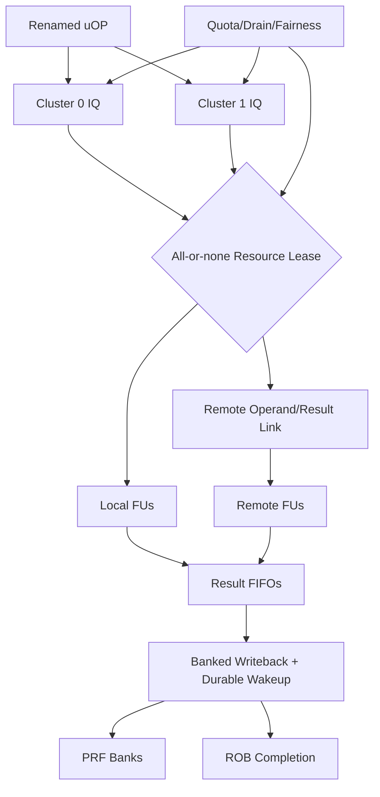

# 第2阶段：分布式执行织构、资源租赁与Completion

状态：**执行指南，不是已完成实现**。本分阶段文件供多人并行分配；所有命令、文件、测试和结果都必须等对应任务实现后产生。任何“完成”必须能引用真实 Git commit/artifact hash/日志，不凭口头状态。

## 1. 这个子系统是做什么的

两个物理cluster真实执行OoO uOP，资源可动态路由/租赁，结果在背压、kill、重配下不丢、不重、不旧代污染。

## 2. 为什么存在 / 上游输入

- 上游输入：S0协议、S1 rename/ROB和基础FU。
- 已有依赖：S0/S1 deliverables、RAM wrapper、resource contract。
- 本阶段输出：真实多hart cohort和最终性能结论；LSU完整推测在S3。
- 首要原则：p0必须证明真实双cluster，不得用解释器/simplified path。不可停顿FU必须预留terminal slot；completion credit和PRF value-visible是首要正确性。

issue团队负责ready/age；broker团队负责all-or-none资源；completion团队负责durable value和ack；network团队负责远程返回与取消；共同做fixed/dynamic A/B。

## 3. 总体结构

图中的箭头是数据/控制依赖；性能策略不得在正确性前打开。每个分支可以分给不同负责人，但跨接口字段以 [implementation-plan.md](implementation-plan.md) §1.3 和本文件任务卡为准，不能各团队私改。

## 4. 团队分工与进度追踪

| Team | 负责任务 | 当前状态 | Owner | 证据链接 | 下一动作 | Blocker |
|---|---|---|---|---|---|---|
| issue负责人 | I-022 | Not started | 待定 | 待填 artifact/commit | 读取任务卡并建立输入锁 | 待填 |
| fabric负责人 | I-023 | Not started | 待定 | 待填 artifact/commit | 读取任务卡并建立输入锁 | 待填 |
| resource broker负责人 | I-024 | Not started | 待定 | 待填 artifact/commit | 读取任务卡并建立输入锁 | 待填 |
| completion负责人 | I-025 | Not started | 待定 | 待填 artifact/commit | 读取任务卡并建立输入锁 | 待填 |
| writeback负责人 | I-026 | Not started | 待定 | 待填 artifact/commit | 读取任务卡并建立输入锁 | 待填 |
| locality负责人 | I-027 | Not started | 待定 | 待填 artifact/commit | 读取任务卡并建立输入锁 | 待填 |
| interconnect负责人 | I-028 | Not started | 待定 | 待填 artifact/commit | 读取任务卡并建立输入锁 | 待填 |
| scheduler负责人 | I-029 | Not started | 待定 | 待填 artifact/commit | 读取任务卡并建立输入锁 | 待填 |
| fairness负责人 | I-030 | Not started | 待定 | 待填 artifact/commit | 读取任务卡并建立输入锁 | 待填 |
| reconfiguration负责人 | I-031 | Not started | 待定 | 待填 artifact/commit | 读取任务卡并建立输入锁 | 待填 |
| rename性能负责人 | I-032 | Not started | 待定 | 待填 artifact/commit | 读取任务卡并建立输入锁 | 待填 |
| 验证负责人 | V-018 | Not started | 待定 | 待填 artifact/commit | 读取任务卡并建立输入锁 | 待填 |
| 验证负责人 | V-024 | Not started | 待定 | 待填 artifact/commit | 读取任务卡并建立输入锁 | 待填 |
| 验证负责人 | V-028 | Not started | 待定 | 待填 artifact/commit | 读取任务卡并建立输入锁 | 待填 |
| 验证负责人 | V-029 | Not started | 待定 | 待填 artifact/commit | 读取任务卡并建立输入锁 | 待填 |
| 验证负责人 | V-031 | Not started | 待定 | 待填 artifact/commit | 读取任务卡并建立输入锁 | 待填 |
| 验证负责人 | V-032 | Not started | 待定 | 待填 artifact/commit | 读取任务卡并建立输入锁 | 待填 |
| 验证负责人 | V-033 | Not started | 待定 | 待填 artifact/commit | 读取任务卡并建立输入锁 | 待填 |
| 验证负责人 | V-034 | Not started | 待定 | 待填 artifact/commit | 读取任务卡并建立输入锁 | 待填 |
| 验证负责人 | V-035 | Not started | 待定 | 待填 artifact/commit | 读取任务卡并建立输入锁 | 待填 |
| 验证负责人 | V-042 | Not started | 待定 | 待填 artifact/commit | 读取任务卡并建立输入锁 | 待填 |
| 多hart验证负责人 | V-076 | Not started | 待定 | 待填 artifact/commit | 读取任务卡并建立输入锁 | 待填 |

状态只能取 `Not started / Inputs locked / In progress / Blocked / Evidence complete / Accepted`。Accepted 需要阶段负责人和验证负责人同时签字；Blocked 必须写最小外部事实、影响范围、请求对象和下一日期，不写“快好了”。

## 5. 可跟踪任务卡

每张卡先给设计者/审查者看的工程合同，再给执行者看的自然语言说明。说明不是替代规格，而是告诉执行者如何按规格工作：先做什么、不能猜什么、什么时候停下来、拿什么证据证明完成。完成定义：对应 `Pass` 全部有直接证据，相关负控制也工作；不是“代码写完”或“仿真曾跑过”。

### I-022 — 实现 local IQ 与 oldest-ready 仲裁

- **负责/门禁**：issue负责人；local ready选择。
- **前置依赖**：I-015, I-016, I-018；仍受 implementation-plan 集成依赖表约束。
- **做什么**：实现 insert/wakeup/select/kill；初始仅 local FU；运行 CASE=iq.wakeup_insert_select，覆盖同周期 enqueue+wakeup 与 FU backpressure。
- **输入数据/接口**：IQ、ready tag+generation、age、FU grant
- **输出与交接**：local IQ、issue decisions
- **设计取舍**：保守durable wakeup，不做speculative ready
- **实现微步骤**：实现entry valid/ready/age/identity；接受durable wakeup并匹配generation；oldest-ready选择并处理insert同拍；grant后等待FU/lease确认；kill/flush保留必要entry；跑wakeup/insert/select压力；由V-027/V-032复核。
- **主要阻塞风险**：丢失/重复wakeup、tag alias、grant未接受；阻断规则：wakeup tag 不带 generation，或 grant 未被 FU 接受就移除 entry。
- **验收证据**：仅 ready/live uOP 发射一次；bounded-ready 队列不饿死 oldest entry。；验证口径：tag ownership、backpressure
- **失败/回退动作**：单队列顺序发射
- **来源覆盖**：distributed scheduling, wakeup。；来源 architecture-review.md。
- **执行者目标**：把“local IQ 与 oldest-ready 仲裁”做成一个可复核的小交付：接收明确输入，产出可验证证据，并在失败时给出可回退的安全状态。
- **执行者须知**：先做合同和最小正确实现，再做优化。不要从相邻任务猜字段；所有身份、credit、reset、flush和背压边界必须来自本任务及implementation-plan。完成前至少覆盖一个正常路径、一个资源冲突和一个取消/恢复路径。
- **建议工作顺序**：实现entry valid/ready/age/identity；接受durable wakeup并匹配generation；oldest-ready选择并处理insert同拍；grant后等待FU/lease确认；kill/flush保留必要entry；跑wakeup/insert/select压力；由V-027/V-032复核。
- **可接受完成**：仅 ready/live uOP 发射一次；bounded-ready 队列不饿死 oldest entry。
- **何时停止求助**：主要风险是丢失/重复wakeup、tag alias、grant未接受。遇到缺失输入、互相矛盾的合同、工具/板卡不可用或验证无法区分错误时，不要猜测；把任务标为Blocked，记录最小事实和需要的上游决定。
- **交付说明**：交接时提供输出：local IQ、issue decisions；同时更新Track Log、状态、证据hash/commit和下一步。不要把未验证的半成品标成Evidence complete。
- **参考资料**：architecture-review.md。
- **进度日志**：2026-09-29 规划生成——未开始；后续每次状态变化追加日期、commit/artifact、证据和下一步。

### I-023 — 实现静态双 cluster 对照

- **负责/门禁**：fabric负责人；真实双cluster执行。
- **前置依赖**：I-022, I-012, I-017；仍受 implementation-plan 集成依赖表约束。
- **做什么**：将程序实际接入两个 cluster，先固定 affinity；执行 independent ALU 与 RAW chains，证明可同时存在多条在途/乱序完成。
- **输入数据/接口**：两cluster、共享M/DIV、fixed affinity
- **输出与交接**：fixed dual-cluster p0 candidate
- **设计取舍**：先证明并行资源，不先证明动态收益
- **实现微步骤**：实例化两套IQ/ALU/PRF bank route；固定初始dispatch affinity；接入共享MUL/DIV仲裁；执行独立与RAW程序；trace检查两cluster实际工作；同reference比较每event；由V-028复核。
- **主要阻塞风险**：第二cluster未用、仍解释器式单执行、OoO假象；阻断规则：第二 cluster 永远不被使用，或实际仍单发射解释执行却声称 OoO。
- **验收证据**：retire 对照正确且 trace 显示两个 cluster 执行不同 live uOP，younger 可先 complete 但不能先 retire。；验证口径：dynamic activity trace、diff
- **失败/回退动作**：第二cluster关为测试模式并阻断p0
- **来源覆盖**：functional OoO prototype, A/B control。；来源 SRC-01/SRC-02/SRC-03, validation-plan.md。
- **执行者目标**：把“静态双 cluster 对照”做成一个可复核的小交付：接收明确输入，产出可验证证据，并在失败时给出可回退的安全状态。
- **执行者须知**：先做合同和最小正确实现，再做优化。不要从相邻任务猜字段；所有身份、credit、reset、flush和背压边界必须来自本任务及implementation-plan。完成前至少覆盖一个正常路径、一个资源冲突和一个取消/恢复路径。
- **建议工作顺序**：实例化两套IQ/ALU/PRF bank route；固定初始dispatch affinity；接入共享MUL/DIV仲裁；执行独立与RAW程序；trace检查两cluster实际工作；同reference比较每event；由V-028复核。
- **可接受完成**：retire 对照正确且 trace 显示两个 cluster 执行不同 live uOP，younger 可先 complete 但不能先 retire。
- **何时停止求助**：主要风险是第二cluster未用、仍解释器式单执行、OoO假象。遇到缺失输入、互相矛盾的合同、工具/板卡不可用或验证无法区分错误时，不要猜测；把任务标为Blocked，记录最小事实和需要的上游决定。
- **交付说明**：交接时提供输出：fixed dual-cluster p0 candidate；同时更新Track Log、状态、证据hash/commit和下一步。不要把未验证的半成品标成Evidence complete。
- **参考资料**：SRC-01/SRC-02/SRC-03, validation-plan.md。
- **进度日志**：2026-09-29 规划生成——未开始；后续每次状态变化追加日期、commit/artifact、证据和下一步。

### I-024 — 实现原子资源租约

- **负责/门禁**：resource broker负责人；原子租赁。
- **前置依赖**：I-023, I-005；仍受 implementation-plan 集成依赖表约束。
- **做什么**：采用 all-or-none issue grant；只有下游有容纳结果的 credit 才接受不能 stall 的 FU；运行 CASE=lease.conflict_and_cancel。
- **输入数据/接口**：FU/operand/route/result credit、lease generation
- **输出与交接**：resource allocator、ledger
- **设计取舍**：all-or-none launch，不用部分占用等待
- **实现微步骤**：定义issue所需资源集合；原子检查并同时扣credit；拒绝不修改状态；绑定lease generation；cancel/complete恰一次归还；跑冲突/取消矩阵；由V-032/V-034复核。
- **主要阻塞风险**：部分资源死锁、double return、旧owner credit；阻断规则：只预留 FU 再无限等待 WB，或 flush 重复归还 credit。
- **验收证据**：每次 grant 同时占用全部必要资源，拒绝无副作用；release/cancel 恰好一次。；验证口径：credit conservation、stress
- **失败/回退动作**：所有长延迟操作预留真实终端槽
- **来源覆盖**：resource scheduling, deadlock avoidance。；来源 architecture-review.md, SRC-01。
- **执行者目标**：把“原子资源租约”做成一个可复核的小交付：接收明确输入，产出可验证证据，并在失败时给出可回退的安全状态。
- **执行者须知**：先做合同和最小正确实现，再做优化。不要从相邻任务猜字段；所有身份、credit、reset、flush和背压边界必须来自本任务及implementation-plan。完成前至少覆盖一个正常路径、一个资源冲突和一个取消/恢复路径。
- **建议工作顺序**：定义issue所需资源集合；原子检查并同时扣credit；拒绝不修改状态；绑定lease generation；cancel/complete恰一次归还；跑冲突/取消矩阵；由V-032/V-034复核。
- **可接受完成**：每次 grant 同时占用全部必要资源，拒绝无副作用；release/cancel 恰好一次。
- **何时停止求助**：主要风险是部分资源死锁、double return、旧owner credit。遇到缺失输入、互相矛盾的合同、工具/板卡不可用或验证无法区分错误时，不要猜测；把任务标为Blocked，记录最小事实和需要的上游决定。
- **交付说明**：交接时提供输出：resource allocator、ledger；同时更新Track Log、状态、证据hash/commit和下一步。不要把未验证的半成品标成Evidence complete。
- **参考资料**：architecture-review.md, SRC-01。
- **进度日志**：2026-09-29 规划生成——未开始；后续每次状态变化追加日期、commit/artifact、证据和下一步。

### I-025 — 实现 per-cluster result FIFO

- **负责/门禁**：completion负责人；结果不丢失。
- **前置依赖**：I-024；仍受 implementation-plan 集成依赖表约束。
- **做什么**：多 FU 同周期完成时按实际端口 buffer/arbitrate；对可暂停和不可暂停单元分别设计保证；运行 CASE=completion.fu_collision。
- **输入数据/接口**：result FIFO、fixed/variable latency、exception
- **输出与交接**：result queues、completion packets
- **设计取舍**：不可停顿单元需预分配结果槽
- **实现微步骤**：为每FU分类可/不可停顿；接入local result FIFO；同周期多结果arbitrate；为异常和数据分字段/优先级；满队列backpressure；跑ALU/MUL/load同拍完成；由V-026/V-032复核。
- **主要阻塞风险**：WB collision丢数据、异常被普通结果覆盖；阻断规则：假设 multiply/load 永不同时返回，或 valid pulse 不能保持。
- **验收证据**：每个 issued live result 被 buffer 或明确 kill，满队列不丢值，异常不被普通结果覆盖。；验证口径：collision/conservation
- **失败/回退动作**：限制同拍启动直到能力证明
- **来源覆盖**：decoupled execution/completion, result conservation。；来源 architecture-review.md, SRC-01/SRC-02。
- **执行者目标**：把“per-cluster result FIFO”做成一个可复核的小交付：接收明确输入，产出可验证证据，并在失败时给出可回退的安全状态。
- **执行者须知**：先做合同和最小正确实现，再做优化。不要从相邻任务猜字段；所有身份、credit、reset、flush和背压边界必须来自本任务及implementation-plan。完成前至少覆盖一个正常路径、一个资源冲突和一个取消/恢复路径。
- **建议工作顺序**：为每FU分类可/不可停顿；接入local result FIFO；同周期多结果arbitrate；为异常和数据分字段/优先级；满队列backpressure；跑ALU/MUL/load同拍完成；由V-026/V-032复核。
- **可接受完成**：每个 issued live result 被 buffer 或明确 kill，满队列不丢值，异常不被普通结果覆盖。
- **何时停止求助**：主要风险是WB collision丢数据、异常被普通结果覆盖。遇到缺失输入、互相矛盾的合同、工具/板卡不可用或验证无法区分错误时，不要猜测；把任务标为Blocked，记录最小事实和需要的上游决定。
- **交付说明**：交接时提供输出：result queues、completion packets；同时更新Track Log、状态、证据hash/commit和下一步。不要把未验证的半成品标成Evidence complete。
- **参考资料**：architecture-review.md, SRC-01/SRC-02。
- **进度日志**：2026-09-29 规划生成——未开始；后续每次状态变化追加日期、commit/artifact、证据和下一步。

### I-026 — 实现 banked WB 与 value-visible wakeup

- **负责/门禁**：writeback负责人；值可见才唤醒。
- **前置依赖**：I-025, I-015；仍受 implementation-plan 集成依赖表约束。
- **做什么**：result arbitrate 到 PRF；写入或可证明保留的 bypass 后才置 ready/complete；运行 CASE=wb.same_bank_many_producers。
- **输入数据/接口**：PRF ack、wakeup、ROB ack、bank arbitration
- **输出与交接**：WB scheduler、durable wakeup
- **设计取舍**：真实ready，不预测WB成功
- **实现微步骤**：仲裁completion到PRF bank；写入/等价可读后发value-visible；分别跟踪PRF/ROB/wakeup ack；重新投递但bitmap防重复；同bank多producer stress；x0/exception不发消费值；由V-013/V-027复核。
- **主要阻塞风险**：值未durable就ready、ack丢失、双producer；阻断规则：FU done 提前 wakeup，而值在后续争用中失踪。
- **验收证据**：冲突结果延迟而不丢失；同一 physical generation 只有正确 producer 写入；消费者看到已承诺 value。；验证口径：collision/ack invariants
- **失败/回退动作**：无bypass全PRF路径
- **来源覆盖**：unified writeback without global CDB, wakeup correctness。；来源 architecture-review.md。
- **执行者目标**：把“banked WB 与 value-visible wakeup”做成一个可复核的小交付：接收明确输入，产出可验证证据，并在失败时给出可回退的安全状态。
- **执行者须知**：先做合同和最小正确实现，再做优化。不要从相邻任务猜字段；所有身份、credit、reset、flush和背压边界必须来自本任务及implementation-plan。完成前至少覆盖一个正常路径、一个资源冲突和一个取消/恢复路径。
- **建议工作顺序**：仲裁completion到PRF bank；写入/等价可读后发value-visible；分别跟踪PRF/ROB/wakeup ack；重新投递但bitmap防重复；同bank多producer stress；x0/exception不发消费值；由V-013/V-027复核。
- **可接受完成**：冲突结果延迟而不丢失；同一 physical generation 只有正确 producer 写入；消费者看到已承诺 value。
- **何时停止求助**：主要风险是值未durable就ready、ack丢失、双producer。遇到缺失输入、互相矛盾的合同、工具/板卡不可用或验证无法区分错误时，不要猜测；把任务标为Blocked，记录最小事实和需要的上游决定。
- **交付说明**：交接时提供输出：WB scheduler、durable wakeup；同时更新Track Log、状态、证据hash/commit和下一步。不要把未验证的半成品标成Evidence complete。
- **参考资料**：architecture-review.md。
- **进度日志**：2026-09-29 规划生成——未开始；后续每次状态变化追加日期、commit/artifact、证据和下一步。

### I-027 — 实现 local bypass 快路径

- **负责/门禁**：locality负责人；local快路径。
- **前置依赖**：I-026；仍受 implementation-plan 集成依赖表约束。
- **做什么**：限定连线范围；bypass 保留 producer identity，miss/冲突回退 PRF；运行 CASE=bypass.local_raw_chain。
- **输入数据/接口**：local bypass、registered route、dependency chain
- **输出与交接**：local bypass、latency evidence
- **设计取舍**：只优化同cluster依赖，错误时PRF fallback
- **实现微步骤**：识别本地consumer/producer；实现限定mux与tag/generation检查；保留PRF读取fallback；测量0/1-cycle local path；跑RAW chain on/off；报告cycles而非虚构latency；由V-028复核。
- **主要阻塞风险**：组合环、错tag转发、latency未实测；阻断规则：为追求单周期绕过 credit/identity 或形成组合 ready loop。
- **验收证据**：开关 bypass trace 一致；连续 RAW chain 得到正确值且 reported latency 来自 measured cycles。；验证口径：metamorphic trace、timing
- **失败/回退动作**：禁用bypass
- **来源覆盖**：latency island, local data movement。；来源 SRC-03, architecture-review.md。
- **执行者目标**：把“local bypass 快路径”做成一个可复核的小交付：接收明确输入，产出可验证证据，并在失败时给出可回退的安全状态。
- **执行者须知**：先做合同和最小正确实现，再做优化。不要从相邻任务猜字段；所有身份、credit、reset、flush和背压边界必须来自本任务及implementation-plan。完成前至少覆盖一个正常路径、一个资源冲突和一个取消/恢复路径。
- **建议工作顺序**：识别本地consumer/producer；实现限定mux与tag/generation检查；保留PRF读取fallback；测量0/1-cycle local path；跑RAW chain on/off；报告cycles而非虚构latency；由V-028复核。
- **可接受完成**：开关 bypass trace 一致；连续 RAW chain 得到正确值且 reported latency 来自 measured cycles。
- **何时停止求助**：主要风险是组合环、错tag转发、latency未实测。遇到缺失输入、互相矛盾的合同、工具/板卡不可用或验证无法区分错误时，不要猜测；把任务标为Blocked，记录最小事实和需要的上游决定。
- **交付说明**：交接时提供输出：local bypass、latency evidence；同时更新Track Log、状态、证据hash/commit和下一步。不要把未验证的半成品标成Evidence complete。
- **参考资料**：SRC-03, architecture-review.md。
- **进度日志**：2026-09-29 规划生成——未开始；后续每次状态变化追加日期、commit/artifact、证据和下一步。

### I-028 — 实现 remote operand/result 链路

- **负责/门禁**：interconnect负责人；远程路由可靠。
- **前置依赖**：I-026, I-005, I-018；仍受 implementation-plan 集成依赖表约束。
- **做什么**：实现至少一拍 registered link 与返回路径，独立背压；运行 CASE=remote.kill_with_delayed_response，注入 1/2/4/8 拍延迟。
- **输入数据/接口**：request/return channels、route generation、latencies
- **输出与交接**：remote fabric link
- **设计取舍**：registered单跳起点，不默认全互连
- **实现微步骤**：实现独立request/response path；绑定home/remote IDs和generation；注册1-cycle起步链路并参数化；实现cancel/late response丢弃；随机注入1/2/4/8拍返回；跑credit守恒与progress；由V-029/V-032复核。
- **主要阻塞风险**：循环等待、旧response别名、无限背压；阻断规则：request/response 共用有限资源形成循环等待，或假定永远一拍返回。
- **验收证据**：随机背压下数据/credit 守恒；remote response 不写已复用的 home slot。；验证口径：backpressure/stale/cancel suites
- **失败/回退动作**：禁远程issue保持双cluster独立
- **来源覆盖**：remote execution, network latency, tagged completion。；来源 architecture-review.md, SRC-01/SRC-02。
- **执行者目标**：把“remote operand/result 链路”做成一个可复核的小交付：接收明确输入，产出可验证证据，并在失败时给出可回退的安全状态。
- **执行者须知**：先做合同和最小正确实现，再做优化。不要从相邻任务猜字段；所有身份、credit、reset、flush和背压边界必须来自本任务及implementation-plan。完成前至少覆盖一个正常路径、一个资源冲突和一个取消/恢复路径。
- **建议工作顺序**：实现独立request/response path；绑定home/remote IDs和generation；注册1-cycle起步链路并参数化；实现cancel/late response丢弃；随机注入1/2/4/8拍返回；跑credit守恒与progress；由V-029/V-032复核。
- **可接受完成**：随机背压下数据/credit 守恒；remote response 不写已复用的 home slot。
- **何时停止求助**：主要风险是循环等待、旧response别名、无限背压。遇到缺失输入、互相矛盾的合同、工具/板卡不可用或验证无法区分错误时，不要猜测；把任务标为Blocked，记录最小事实和需要的上游决定。
- **交付说明**：交接时提供输出：remote fabric link；同时更新Track Log、状态、证据hash/commit和下一步。不要把未验证的半成品标成Evidence complete。
- **参考资料**：architecture-review.md, SRC-01/SRC-02。
- **进度日志**：2026-09-29 规划生成——未开始；后续每次状态变化追加日期、commit/artifact、证据和下一步。

### I-029 — 实现动态 steering 基础策略

- **负责/门禁**：scheduler负责人；确定性动态调度。
- **前置依赖**：I-028, I-024；仍受 implementation-plan 集成依赖表约束。
- **做什么**：先 deterministic locality-first + least-loaded + age tie-break，不引入不可解释 predictor；同 ELF/seed 固定与动态模式对照。
- **输入数据/接口**：capability、queue occupancy、locality、age
- **输出与交接**：steering policy、decision log
- **设计取舍**：先解释性强policy，不先ML/neural
- **实现微步骤**：计算每个候选cluster合法性；本地依赖优先，再least loaded；age作为进展tie-break/escalation；导出决策reason trace；与fixed模式同资源对比；跑capacity/locality矩阵；由V-028/V-033复核。
- **主要阻塞风险**：资源不等对照、capability错配、饥饿；阻断规则：load balancing 无视 dependency lifetime 或为凑性能改变物理资源数。
- **验收证据**：incompatible FU 永不接收；资源饱和只 stall/retry，不改变架构结果。；验证口径：same trace、coverage
- **失败/回退动作**：固定affinity模式
- **来源覆盖**：dynamic route scheduling, controlled experiment。；来源 SRC-01/SRC-02/SRC-03。
- **执行者目标**：把“动态 steering 基础策略”做成一个可复核的小交付：接收明确输入，产出可验证证据，并在失败时给出可回退的安全状态。
- **执行者须知**：先做合同和最小正确实现，再做优化。不要从相邻任务猜字段；所有身份、credit、reset、flush和背压边界必须来自本任务及implementation-plan。完成前至少覆盖一个正常路径、一个资源冲突和一个取消/恢复路径。
- **建议工作顺序**：计算每个候选cluster合法性；本地依赖优先，再least loaded；age作为进展tie-break/escalation；导出决策reason trace；与fixed模式同资源对比；跑capacity/locality矩阵；由V-028/V-033复核。
- **可接受完成**：incompatible FU 永不接收；资源饱和只 stall/retry，不改变架构结果。
- **何时停止求助**：主要风险是资源不等对照、capability错配、饥饿。遇到缺失输入、互相矛盾的合同、工具/板卡不可用或验证无法区分错误时，不要猜测；把任务标为Blocked，记录最小事实和需要的上游决定。
- **交付说明**：交接时提供输出：steering policy、decision log；同时更新Track Log、状态、证据hash/commit和下一步。不要把未验证的半成品标成Evidence complete。
- **参考资料**：SRC-01/SRC-02/SRC-03。
- **进度日志**：2026-09-29 规划生成——未开始；后续每次状态变化追加日期、commit/artifact、证据和下一步。

### I-030 — 实现 queue/port 配额与饥饿上界

- **负责/门禁**：fairness负责人；前向进展。
- **前置依赖**：I-029；仍受 implementation-plan 集成依赖表约束。
- **做什么**：为 ready oldest 与返回通道保留逃生容量，写 fairness assumptions；测试饱和 short/long FU 混合与持续新请求。
- **输入数据/接口**：aging、服务下界、escape capacity、假设
- **输出与交接**：fairness policy、proof assumptions
- **设计取舍**：安全无条件，liveness依赖明确环境
- **实现微步骤**：列出wait graph和环境响应假设；给completion/cancel保留容量；实现age escalation和配额；计算配置下服务上界；跑持续高优先级压力；区分环境timeout与deadlock；由V-033/formal复核。
- **主要阻塞风险**：scalar永久抢占、无限假设、timeout误deadlock；阻断规则：用无限 timeout 当公平性证明，或高优先级 scalar 永久饿死 vector。
- **验收证据**：在明确的“下游最终 ready/内存有界返回”假设下存在可计算等待上界，并被 assertion/压力用例覆盖。；验证口径：progress tests、formal small instance
- **失败/回退动作**：静态quota保证
- **来源覆盖**：deadlock, livelock, fairness, QoS。；来源 architecture-review.md。
- **执行者目标**：把“queue/port 配额与饥饿上界”做成一个可复核的小交付：接收明确输入，产出可验证证据，并在失败时给出可回退的安全状态。
- **执行者须知**：先做合同和最小正确实现，再做优化。不要从相邻任务猜字段；所有身份、credit、reset、flush和背压边界必须来自本任务及implementation-plan。完成前至少覆盖一个正常路径、一个资源冲突和一个取消/恢复路径。
- **建议工作顺序**：列出wait graph和环境响应假设；给completion/cancel保留容量；实现age escalation和配额；计算配置下服务上界；跑持续高优先级压力；区分环境timeout与deadlock；由V-033/formal复核。
- **可接受完成**：在明确的“下游最终 ready/内存有界返回”假设下存在可计算等待上界，并被 assertion/压力用例覆盖。
- **何时停止求助**：主要风险是scalar永久抢占、无限假设、timeout误deadlock。遇到缺失输入、互相矛盾的合同、工具/板卡不可用或验证无法区分错误时，不要猜测；把任务标为Blocked，记录最小事实和需要的上游决定。
- **交付说明**：交接时提供输出：fairness policy、proof assumptions；同时更新Track Log、状态、证据hash/commit和下一步。不要把未验证的半成品标成Evidence complete。
- **参考资料**：architecture-review.md。
- **进度日志**：2026-09-29 规划生成——未开始；后续每次状态变化追加日期、commit/artifact、证据和下一步。

### I-031 — 实现资源所有权变更状态机

- **负责/门禁**：reconfiguration负责人；所有权安全切换。
- **前置依赖**：I-030, I-018；仍受 implementation-plan 集成依赖表约束。
- **做什么**：从软件受控静态配置切换开始；遍历每个 state 时的 flush/reset/error；运行 CASE=reconfigure.drain_and_generation。
- **输入数据/接口**：FREEZE/DRAIN/REVOKED/INSTALL、outstanding、generation
- **输出与交接**：resource broker FSM
- **设计取舍**：先指令边界drain，再live migration
- **实现微步骤**：实现状态机与幂等控制消息；分别计IQ/FU/result/memory/return outstanding；冻结新准入但服务旧工作；全部ack后发布new owner generation；异常/reset/cancel分支覆盖；由V-034/V-035复核；记录切换成本。
- **主要阻塞风险**：只看IQ空、半发布、旧route包、cancel卡死；阻断规则：仅 IQ 空就认为 FU/network/LSU 已 drain，或切换时丢 architectural state。
- **验收证据**：旧 owner 的 uOP/结果/credit 全部结算才发布新 owner；重复控制消息幂等。；验证口径：drain matrix、race cases
- **失败/回退动作**：保留旧配置并报告停滞
- **来源覆盖**：dynamic resource ownership, two timescales。；来源 SRC-01/SRC-02/SRC-03, architecture-review.md。
- **执行者目标**：把“资源所有权变更状态机”做成一个可复核的小交付：接收明确输入，产出可验证证据，并在失败时给出可回退的安全状态。
- **执行者须知**：先做合同和最小正确实现，再做优化。不要从相邻任务猜字段；所有身份、credit、reset、flush和背压边界必须来自本任务及implementation-plan。完成前至少覆盖一个正常路径、一个资源冲突和一个取消/恢复路径。
- **建议工作顺序**：实现状态机与幂等控制消息；分别计IQ/FU/result/memory/return outstanding；冻结新准入但服务旧工作；全部ack后发布new owner generation；异常/reset/cancel分支覆盖；由V-034/V-035复核；记录切换成本。
- **可接受完成**：旧 owner 的 uOP/结果/credit 全部结算才发布新 owner；重复控制消息幂等。
- **何时停止求助**：主要风险是只看IQ空、半发布、旧route包、cancel卡死。遇到缺失输入、互相矛盾的合同、工具/板卡不可用或验证无法区分错误时，不要猜测；把任务标为Blocked，记录最小事实和需要的上游决定。
- **交付说明**：交接时提供输出：resource broker FSM；同时更新Track Log、状态、证据hash/commit和下一步。不要把未验证的半成品标成Evidence complete。
- **参考资料**：SRC-01/SRC-02/SRC-03, architecture-review.md。
- **进度日志**：2026-09-29 规划生成——未开始；后续每次状态变化追加日期、commit/artifact、证据和下一步。

### I-032 — 实现 bank-aware physical allocation

- **负责/门禁**：rename性能负责人；bank-aware分配优化。
- **前置依赖**：I-031, I-014；仍受 implementation-plan 集成依赖表约束。
- **做什么**：在保持合法 tag allocation 的前提下添加可关闭 bank preference；冲突时可用任何合法空闲 bank；运行 CASE=rename.bank_bias_exhaustion。
- **输入数据/接口**：bank pressure、producer locality、fallback
- **输出与交接**：bank-aware allocation、A/B result
- **设计取舍**：合法空闲bank always acceptable，affinity不是正确性
- **实现微步骤**：以普通free-list为正确baseline；实现bank preference计数；冲突时选择任何合法空闲bank；开关对照WB/read conflicts；跑exhaustion和bias矩阵；决定是否默认开启；由V-027/V-076复核。
- **主要阻塞风险**：银行永久假满、泄漏、收益未测量；阻断规则：仅指定 bank 空就永久卡住，或使用未释放 physical tag。
- **验收证据**：任何偏置都不泄漏 free registers；同资源下测得 stall/WB/read 冲突变化而非先假定收益。；验证口径：ownership+performance pairing
- **失败/回退动作**：关闭preference
- **来源覆盖**：resource-aware rename, PRF port economy。；来源 SRC-01, architecture-review.md。
- **执行者目标**：把“bank-aware physical allocation”做成一个可复核的小交付：接收明确输入，产出可验证证据，并在失败时给出可回退的安全状态。
- **执行者须知**：先做合同和最小正确实现，再做优化。不要从相邻任务猜字段；所有身份、credit、reset、flush和背压边界必须来自本任务及implementation-plan。完成前至少覆盖一个正常路径、一个资源冲突和一个取消/恢复路径。
- **建议工作顺序**：以普通free-list为正确baseline；实现bank preference计数；冲突时选择任何合法空闲bank；开关对照WB/read conflicts；跑exhaustion和bias矩阵；决定是否默认开启；由V-027/V-076复核。
- **可接受完成**：任何偏置都不泄漏 free registers；同资源下测得 stall/WB/read 冲突变化而非先假定收益。
- **何时停止求助**：主要风险是银行永久假满、泄漏、收益未测量。遇到缺失输入、互相矛盾的合同、工具/板卡不可用或验证无法区分错误时，不要猜测；把任务标为Blocked，记录最小事实和需要的上游决定。
- **交付说明**：交接时提供输出：bank-aware allocation、A/B result；同时更新Track Log、状态、证据hash/commit和下一步。不要把未验证的半成品标成Evidence complete。
- **参考资料**：SRC-01, architecture-review.md。
- **进度日志**：2026-09-29 规划生成——未开始；后续每次状态变化追加日期、commit/artifact、证据和下一步。

### V-018 — 分开 architectural memory 与可见 store

- **负责/门禁**：验证负责人；验证证据闭合。
- **前置依赖**：V-011, V-013；仍受 implementation-plan 集成依赖表约束。
- **做什么**：覆盖所有 load/store 宽度、符号扩展、部分 byte mask、forwarding、跨行、错误路径 store；记录 store commit 与真正 drain，比较 reference memory 及最后 byte signature。
- **输入数据/接口**：LSU/store-buffer 实现、memory-operation schema。
- **输出与交接**：有因果 ID 的 load/store/visibility trace。
- **设计取舍**：有限集合/模型边界明确，不用样本数冒充形式证明
- **实现微步骤**：冻结该任务输入、版本与capability交集；展开有限case/seed/budget manifest；实现真实检查器并接入负控制；执行正控制和故障注入；闭合计划/执行/通过/失败/unsupported计数；最小化失败并建立replay；阶段负责人签收或阻断后续gate。
- **主要阻塞风险**：静默skip、mock echo、空覆盖率、把deferred当成功；阻断规则：仅比较 rd 漏掉错误 store、将 cache refill 当 load effect、重复 drain、用 DUT memory 覆盖 reference 后宣称一致。
- **验收证据**：每个可见 byte 有合法已提交 producer，load 返回值与允许来源相符，取消 store 不外泄。；验证口径：每个可见 byte 有合法已提交 producer，load 返回值与允许来源相符，取消 store 不外泄。
- **失败/回退动作**：仅比较 rd 漏掉错误 store、将 cache refill 当 load effect、重复 drain、用 DUT memory 覆盖 reference 后宣称一致。
- **来源覆盖**：SRC-03 §Memory Operation 也应该成为 Packet、§Store visibility obeys selected model。；来源 VR-003, VR-014。
- **执行者目标**：把“分开 architectural memory 与可见 store”做成一个可复核的小交付：接收明确输入，产出可验证证据，并在失败时给出可回退的安全状态。
- **执行者须知**：先证明检查器能抓到真实错误，再接受正例。每个测试必须物化输入/seed/期望和排除账本；不可用空套件、mock echo或静默skip取得通过。完成前加入一个负控制并保存首个差异。
- **建议工作顺序**：冻结该任务输入、版本与capability交集；展开有限case/seed/budget manifest；实现真实检查器并接入负控制；执行正控制和故障注入；闭合计划/执行/通过/失败/unsupported计数；最小化失败并建立replay；阶段负责人签收或阻断后续gate。
- **可接受完成**：每个可见 byte 有合法已提交 producer，load 返回值与允许来源相符，取消 store 不外泄。
- **何时停止求助**：主要风险是静默skip、mock echo、空覆盖率、把deferred当成功。遇到缺失输入、互相矛盾的合同、工具/板卡不可用或验证无法区分错误时，不要猜测；把任务标为Blocked，记录最小事实和需要的上游决定。
- **交付说明**：交接时提供输出：有因果 ID 的 load/store/visibility trace。；同时更新Track Log、状态、证据hash/commit和下一步。不要把未验证的半成品标成Evidence complete。
- **参考资料**：VR-003, VR-014。
- **进度日志**：2026-09-29 规划生成——未开始；后续每次状态变化追加日期、commit/artifact、证据和下一步。

### V-024 — 注入 trace 丢失、重复与乱序

- **负责/门禁**：验证负责人；验证证据闭合。
- **前置依赖**：V-008, V-020；仍受 implementation-plan 集成依赖表约束。
- **做什么**：在 DUT 事件传输边界丢一个 commit、复制一个 store、交换同 hart 相邻事件、错 hart ID、截断文件；与原始 trace 分别 replay。
- **输入数据/接口**：真实 DUT canonical event trace、transport checker。
- **输出与交接**：事件完整性故障检测记录。
- **设计取舍**：有限集合/模型边界明确，不用样本数冒充形式证明
- **实现微步骤**：冻结该任务输入、版本与capability交集；展开有限case/seed/budget manifest；实现真实检查器并接入负控制；执行正控制和故障注入；闭合计划/执行/通过/失败/unsupported计数；最小化失败并建立replay；阶段负责人签收或阻断后续gate。
- **主要阻塞风险**：静默skip、mock echo、空覆盖率、把deferred当成功；阻断规则：只以末尾 pass magic 判成功、按 PC 去重合法重复 loop、跨 hart 事件串扰未报。
- **验收证据**：五类故障均因明确完整性/语义检查失败；不能通过补齐猜测事件得到 PASS。；验证口径：五类故障均因明确完整性/语义检查失败；不能通过补齐猜测事件得到 PASS。
- **失败/回退动作**：只以末尾 pass magic 判成功、按 PC 去重合法重复 loop、跨 hart 事件串扰未报。
- **来源覆盖**：SRC-03 §Hierarchical completion fabric、§per-hart retirement。；来源 VR-003, VR-011。
- **执行者目标**：把“注入 trace 丢失、重复与乱序”做成一个可复核的小交付：接收明确输入，产出可验证证据，并在失败时给出可回退的安全状态。
- **执行者须知**：先证明检查器能抓到真实错误，再接受正例。每个测试必须物化输入/seed/期望和排除账本；不可用空套件、mock echo或静默skip取得通过。完成前加入一个负控制并保存首个差异。
- **建议工作顺序**：冻结该任务输入、版本与capability交集；展开有限case/seed/budget manifest；实现真实检查器并接入负控制；执行正控制和故障注入；闭合计划/执行/通过/失败/unsupported计数；最小化失败并建立replay；阶段负责人签收或阻断后续gate。
- **可接受完成**：五类故障均因明确完整性/语义检查失败；不能通过补齐猜测事件得到 PASS。
- **何时停止求助**：主要风险是静默skip、mock echo、空覆盖率、把deferred当成功。遇到缺失输入、互相矛盾的合同、工具/板卡不可用或验证无法区分错误时，不要猜测；把任务标为Blocked，记录最小事实和需要的上游决定。
- **交付说明**：交接时提供输出：事件完整性故障检测记录。；同时更新Track Log、状态、证据hash/commit和下一步。不要把未验证的半成品标成Evidence complete。
- **参考资料**：VR-003, VR-011。
- **进度日志**：2026-09-29 规划生成——未开始；后续每次状态变化追加日期、commit/artifact、证据和下一步。

### V-028 — 对比 fixed/local/remote 调度语义

- **负责/门禁**：验证负责人；验证证据闭合。
- **前置依赖**：V-026, V-027；仍受 implementation-plan 集成依赖表约束。
- **做什么**：对每程序固定输入和 external stream，在 fixed/local/remote/reconfigured 四种调度下运行；故意改变完成先后与网络延迟，比较 canonical architectural trace。
- **输入数据/接口**：同资源固定与弹性后端里程碑、64 个无竞争确定性程序。
- **输出与交接**：64×4 metamorphic 结果及 route 延迟记录。
- **设计取舍**：有限集合/模型边界明确，不用样本数冒充形式证明
- **实现微步骤**：冻结该任务输入、版本与capability交集；展开有限case/seed/budget manifest；实现真实检查器并接入负控制；执行正控制和故障注入；闭合计划/执行/通过/失败/unsupported计数；最小化失败并建立replay；阶段负责人签收或阻断后续gate。
- **主要阻塞风险**：静默skip、mock echo、空覆盖率、把deferred当成功；阻断规则：以不同调度不同结果当合法、通过禁用远程模式规避失败、同程序多次运行却未改变拓扑。
- **验收证据**：规定确定性架构状态和内存结果一致；只有 cycle/route 等微架构指标变化。；验证口径：规定确定性架构状态和内存结果一致；只有 cycle/route 等微架构指标变化。
- **失败/回退动作**：以不同调度不同结果当合法、通过禁用远程模式规避失败、同程序多次运行却未改变拓扑。
- **来源覆盖**：SRC-03 §architectural order 固定 execution topology 动态、§Fast Local Execution Island。；来源 SRC-03:55-369, SRC-03:1735-1818, VR-014。
- **执行者目标**：把“对比 fixed/local/remote 调度语义”做成一个可复核的小交付：接收明确输入，产出可验证证据，并在失败时给出可回退的安全状态。
- **执行者须知**：先证明检查器能抓到真实错误，再接受正例。每个测试必须物化输入/seed/期望和排除账本；不可用空套件、mock echo或静默skip取得通过。完成前加入一个负控制并保存首个差异。
- **建议工作顺序**：冻结该任务输入、版本与capability交集；展开有限case/seed/budget manifest；实现真实检查器并接入负控制；执行正控制和故障注入；闭合计划/执行/通过/失败/unsupported计数；最小化失败并建立replay；阶段负责人签收或阻断后续gate。
- **可接受完成**：规定确定性架构状态和内存结果一致；只有 cycle/route 等微架构指标变化。
- **何时停止求助**：主要风险是静默skip、mock echo、空覆盖率、把deferred当成功。遇到缺失输入、互相矛盾的合同、工具/板卡不可用或验证无法区分错误时，不要猜测；把任务标为Blocked，记录最小事实和需要的上游决定。
- **交付说明**：交接时提供输出：64×4 metamorphic 结果及 route 延迟记录。；同时更新Track Log、状态、证据hash/commit和下一步。不要把未验证的半成品标成Evidence complete。
- **参考资料**：SRC-03:55-369, SRC-03:1735-1818, VR-014。
- **进度日志**：2026-09-29 规划生成——未开始；后续每次状态变化追加日期、commit/artifact、证据和下一步。

### V-029 — 在回滚后投递 stale completion

- **负责/门禁**：验证负责人；验证证据闭合。
- **前置依赖**：V-028；仍受 implementation-plan 集成依赖表约束。
- **做什么**：分别将 ALU、DIV、load、vector packet（启用后）完成延迟到 branch kill 后、新 owner 租用后与 tag 重用后；对应 32 个命名回滚时点×4 排列。
- **输入数据/接口**：epoch/lease/producer generation 实现、可延迟 completion transport。
- **输出与交接**：被拒绝 stale message 计数与无 architectural 污染证据。
- **设计取舍**：有限集合/模型边界明确，不用样本数冒充形式证明
- **实现微步骤**：冻结该任务输入、版本与capability交集；展开有限case/seed/budget manifest；实现真实检查器并接入负控制；执行正控制和故障注入；闭合计划/执行/通过/失败/unsupported计数；最小化失败并建立replay；阶段负责人签收或阻断后续gate。
- **主要阻塞风险**：静默skip、mock echo、空覆盖率、把deferred当成功；阻断规则：只检查 ROB 但错误写回 PRF、旧 ready 唤醒新消费者、无限占用 credit。
- **验收证据**：stale 消息不能改 PRF/VRF/ready/ROB/memory；被丢弃事务仍正确释放信用；所有活跃新指令可继续。；验证口径：stale 消息不能改 PRF/VRF/ready/ROB/memory；被丢弃事务仍正确释放信用；所有活跃新指令可继续。
- **失败/回退动作**：只检查 ROB 但错误写回 PRF、旧 ready 唤醒新消费者、无限占用 credit。
- **来源覆盖**：SRC-03 §No wrong-epoch uOP can update architectural state、§Branch Mask/Epoch。；来源 SRC-03:1878-1928, VR-011。
- **执行者目标**：把“在回滚后投递 stale completion”做成一个可复核的小交付：接收明确输入，产出可验证证据，并在失败时给出可回退的安全状态。
- **执行者须知**：先证明检查器能抓到真实错误，再接受正例。每个测试必须物化输入/seed/期望和排除账本；不可用空套件、mock echo或静默skip取得通过。完成前加入一个负控制并保存首个差异。
- **建议工作顺序**：冻结该任务输入、版本与capability交集；展开有限case/seed/budget manifest；实现真实检查器并接入负控制；执行正控制和故障注入；闭合计划/执行/通过/失败/unsupported计数；最小化失败并建立replay；阶段负责人签收或阻断后续gate。
- **可接受完成**：stale 消息不能改 PRF/VRF/ready/ROB/memory；被丢弃事务仍正确释放信用；所有活跃新指令可继续。
- **何时停止求助**：主要风险是静默skip、mock echo、空覆盖率、把deferred当成功。遇到缺失输入、互相矛盾的合同、工具/板卡不可用或验证无法区分错误时，不要猜测；把任务标为Blocked，记录最小事实和需要的上游决定。
- **交付说明**：交接时提供输出：被拒绝 stale message 计数与无 architectural 污染证据。；同时更新Track Log、状态、证据hash/commit和下一步。不要把未验证的半成品标成Evidence complete。
- **参考资料**：SRC-03:1878-1928, VR-011。
- **进度日志**：2026-09-29 规划生成——未开始；后续每次状态变化追加日期、commit/artifact、证据和下一步。

### V-031 — 检验 epoch 与 lease 计数回绕

- **负责/门禁**：验证负责人；验证证据闭合。
- **前置依赖**：V-029, V-030；仍受 implementation-plan 集成依赖表约束。
- **做什么**：让回滚/租约切换超过两轮完整 generation 空间，保留最旧消息直到同低位 tag 再现；证明 drain 或足够宽计数阻止 ABA。
- **输入数据/接口**：generation 位宽与最迟响应寿命合同、缩小位宽验证配置。
- **输出与交接**：回绕反例搜索及寿命界证明记录。
- **设计取舍**：有限集合/模型边界明确，不用样本数冒充形式证明
- **实现微步骤**：冻结该任务输入、版本与capability交集；展开有限case/seed/budget manifest；实现真实检查器并接入负控制；执行正控制和故障注入；闭合计划/执行/通过/失败/unsupported计数；最小化失败并建立replay；阶段负责人签收或阻断后续gate。
- **主要阻塞风险**：静默skip、mock echo、空覆盖率、把deferred当成功；阻断规则：“64 位不会回绕”替代参数化证明、小配置 alias 未检查、overflow 静默复用。
- **验收证据**：不能把跨完整回绕旧事务识别为新事务；位宽约束由最大存活时间/排空协议推导。；验证口径：不能把跨完整回绕旧事务识别为新事务；位宽约束由最大存活时间/排空协议推导。
- **失败/回退动作**：“64 位不会回绕”替代参数化证明、小配置 alias 未检查、overflow 静默复用。
- **来源覆盖**：SRC-03 §Epoch ID、§coarse-grain resource reconfiguration。；来源 SRC-03:282-323, SRC-03:1878-1928, VR-011。
- **执行者目标**：把“检验 epoch 与 lease 计数回绕”做成一个可复核的小交付：接收明确输入，产出可验证证据，并在失败时给出可回退的安全状态。
- **执行者须知**：先证明检查器能抓到真实错误，再接受正例。每个测试必须物化输入/seed/期望和排除账本；不可用空套件、mock echo或静默skip取得通过。完成前加入一个负控制并保存首个差异。
- **建议工作顺序**：冻结该任务输入、版本与capability交集；展开有限case/seed/budget manifest；实现真实检查器并接入负控制；执行正控制和故障注入；闭合计划/执行/通过/失败/unsupported计数；最小化失败并建立replay；阶段负责人签收或阻断后续gate。
- **可接受完成**：不能把跨完整回绕旧事务识别为新事务；位宽约束由最大存活时间/排空协议推导。
- **何时停止求助**：主要风险是静默skip、mock echo、空覆盖率、把deferred当成功。遇到缺失输入、互相矛盾的合同、工具/板卡不可用或验证无法区分错误时，不要猜测；把任务标为Blocked，记录最小事实和需要的上游决定。
- **交付说明**：交接时提供输出：回绕反例搜索及寿命界证明记录。；同时更新Track Log、状态、证据hash/commit和下一步。不要把未验证的半成品标成Evidence complete。
- **参考资料**：SRC-03:282-323, SRC-03:1878-1928, VR-011。
- **进度日志**：2026-09-29 规划生成——未开始；后续每次状态变化追加日期、commit/artifact、证据和下一步。

### V-032 — 检验网络 credit 守恒和背压

- **负责/门禁**：验证负责人；验证证据闭合。
- **前置依赖**：V-028；仍受 implementation-plan 集成依赖表约束。
- **做什么**：填满每一输入/输出队列，逐个释放，覆盖同时 push/pop、kill+pop、重复返回信用、下游长期 stall；逐端口核算 issued−returned。
- **输入数据/接口**：router/IQ/result buffer credit 协议、2-entry local result buffer 候选。
- **输出与交接**：credit 守恒证明与饱和状态 trace。
- **设计取舍**：有限集合/模型边界明确，不用样本数冒充形式证明
- **实现微步骤**：冻结该任务输入、版本与capability交集；展开有限case/seed/budget manifest；实现真实检查器并接入负控制；执行正控制和故障注入；闭合计划/执行/通过/失败/unsupported计数；最小化失败并建立replay；阶段负责人签收或阻断后续gate。
- **主要阻塞风险**：静默skip、mock echo、空覆盖率、把deferred当成功；阻断规则：信用超发、kill 双还、packet 永久滞留、绕过 backpressure 覆盖未消费结果。
- **验收证据**：对每条通道 free+occupied+inflight 恒等于容量；不丢包、不重复、无组合 ready 环依赖。；验证口径：对每条通道 free+occupied+inflight 恒等于容量；不丢包、不重复、无组合 ready 环依赖。
- **失败/回退动作**：信用超发、kill 双还、packet 永久滞留、绕过 backpressure 覆盖未消费结果。
- **来源覆盖**：SRC-03 §Scheduler Hierarchy、§Completion Fabric、§distributed waiting state。；来源 SRC-03:230-281, SRC-03:1273-1342, VR-011。
- **执行者目标**：把“检验网络 credit 守恒和背压”做成一个可复核的小交付：接收明确输入，产出可验证证据，并在失败时给出可回退的安全状态。
- **执行者须知**：先证明检查器能抓到真实错误，再接受正例。每个测试必须物化输入/seed/期望和排除账本；不可用空套件、mock echo或静默skip取得通过。完成前加入一个负控制并保存首个差异。
- **建议工作顺序**：冻结该任务输入、版本与capability交集；展开有限case/seed/budget manifest；实现真实检查器并接入负控制；执行正控制和故障注入；闭合计划/执行/通过/失败/unsupported计数；最小化失败并建立replay；阶段负责人签收或阻断后续gate。
- **可接受完成**：对每条通道 free+occupied+inflight 恒等于容量；不丢包、不重复、无组合 ready 环依赖。
- **何时停止求助**：主要风险是静默skip、mock echo、空覆盖率、把deferred当成功。遇到缺失输入、互相矛盾的合同、工具/板卡不可用或验证无法区分错误时，不要猜测；把任务标为Blocked，记录最小事实和需要的上游决定。
- **交付说明**：交接时提供输出：credit 守恒证明与饱和状态 trace。；同时更新Track Log、状态、证据hash/commit和下一步。不要把未验证的半成品标成Evidence complete。
- **参考资料**：SRC-03:230-281, SRC-03:1273-1342, VR-011。
- **进度日志**：2026-09-29 规划生成——未开始；后续每次状态变化追加日期、commit/artifact、证据和下一步。

### V-033 — 在有界环境下验证 forward progress

- **负责/门禁**：验证负责人；验证证据闭合。
- **前置依赖**：V-026, V-032；仍受 implementation-plan 集成依赖表约束。
- **做什么**：为 ALU/DIV/load/return/commit 等资源构造循环等待压力；在每 64 cycles 至少一个响应的约束下检查有界完成；另注入永久不响应确认 code 3 与挂起资源诊断。
- **输入数据/接口**：环境响应上界、仲裁公平性合同、wait-for graph。
- **输出与交接**：环境假设、计算的进展界与 watchdog 命中证据。
- **设计取舍**：有限集合/模型边界明确，不用样本数冒充形式证明
- **实现微步骤**：冻结该任务输入、版本与capability交集；展开有限case/seed/budget manifest；实现真实检查器并接入负控制；执行正控制和故障注入；闭合计划/执行/通过/失败/unsupported计数；最小化失败并建立replay；阶段负责人签收或阻断后续gate。
- **主要阻塞风险**：静默skip、mock echo、空覆盖率、把deferred当成功；阻断规则：只有平均吞吐、用不现实公平性 assume 掩盖设计饥饿、无法区分合法 WFI 与 deadlock。
- **验收证据**：有界场景中每个 eligible oldest 工作在合同内进展；永久不响应归类环境 timeout 而非通过。；验证口径：有界场景中每个 eligible oldest 工作在合同内进展；永久不响应归类环境 timeout 而非通过。
- **失败/回退动作**：只有平均吞吐、用不现实公平性 assume 掩盖设计饥饿、无法区分合法 WFI 与 deadlock。
- **来源覆盖**：SRC-03 §Criticality/age scheduling、§Elastic Latency Execution。；来源 SRC-03:1200-1256, SRC-03:1343-1424, VR-011。
- **执行者目标**：把“在有界环境下 forward progress”做成一个可复核的小交付：接收明确输入，产出可验证证据，并在失败时给出可回退的安全状态。
- **执行者须知**：先证明检查器能抓到真实错误，再接受正例。每个测试必须物化输入/seed/期望和排除账本；不可用空套件、mock echo或静默skip取得通过。完成前加入一个负控制并保存首个差异。
- **建议工作顺序**：冻结该任务输入、版本与capability交集；展开有限case/seed/budget manifest；实现真实检查器并接入负控制；执行正控制和故障注入；闭合计划/执行/通过/失败/unsupported计数；最小化失败并建立replay；阶段负责人签收或阻断后续gate。
- **可接受完成**：有界场景中每个 eligible oldest 工作在合同内进展；永久不响应归类环境 timeout 而非通过。
- **何时停止求助**：主要风险是静默skip、mock echo、空覆盖率、把deferred当成功。遇到缺失输入、互相矛盾的合同、工具/板卡不可用或验证无法区分错误时，不要猜测；把任务标为Blocked，记录最小事实和需要的上游决定。
- **交付说明**：交接时提供输出：环境假设、计算的进展界与 watchdog 命中证据。；同时更新Track Log、状态、证据hash/commit和下一步。不要把未验证的半成品标成Evidence complete。
- **参考资料**：SRC-03:1200-1256, SRC-03:1343-1424, VR-011。
- **进度日志**：2026-09-29 规划生成——未开始；后续每次状态变化追加日期、commit/artifact、证据和下一步。

### V-034 — 验证资源重配置 drain 与原子发布

- **负责/门禁**：验证负责人；验证证据闭合。
- **前置依赖**：V-031, V-033；仍受 implementation-plan 集成依赖表约束。
- **做什么**：在 IQ/PRF consumer/result buffer/LSQ/store buffer/vector descriptor 各有未完成事务时请求重配；观察停止接收、完成/取消、依赖与数据保留、ownership 新代发布。
- **输入数据/接口**：lease 协议状态机、重配实现里程碑、16 drain 状态×8 刺激矩阵。
- **输出与交接**：每类资源 drain ledger 与 reconfiguration transition trace。
- **设计取舍**：有限集合/模型边界明确，不用样本数冒充形式证明
- **实现微步骤**：冻结该任务输入、版本与capability交集；展开有限case/seed/budget manifest；实现真实检查器并接入负控制；执行正控制和故障注入；闭合计划/执行/通过/失败/unsupported计数；最小化失败并建立replay；阶段负责人签收或阻断后续gate。
- **主要阻塞风险**：静默skip、mock echo、空覆盖率、把deferred当成功；阻断规则：只看 IQ 空忽略 memory/return in-flight，非幂等访问重做，资源一度同时归两 hart。
- **验收证据**：所有规定旧代引用解除后才授予新 owner；未迁移 architectural state 不丢失；确认后旧代请求全部拒绝。；验证口径：所有规定旧代引用解除后才授予新 owner；未迁移 architectural state 不丢失；确认后旧代请求全部拒绝。
- **失败/回退动作**：只看 IQ 空忽略 memory/return in-flight，非幂等访问重做，资源一度同时归两 hart。
- **来源覆盖**：SRC-03 §Dynamic scaling 两个时间尺度、§Execution Ownership 动态。；来源 SRC-03:282-323, SRC-03:2347-2528, VR-011。
- **执行者目标**：把“资源重配置 drain 与原子发布”做成一个可复核的小交付：接收明确输入，产出可验证证据，并在失败时给出可回退的安全状态。
- **执行者须知**：先证明检查器能抓到真实错误，再接受正例。每个测试必须物化输入/seed/期望和排除账本；不可用空套件、mock echo或静默skip取得通过。完成前加入一个负控制并保存首个差异。
- **建议工作顺序**：冻结该任务输入、版本与capability交集；展开有限case/seed/budget manifest；实现真实检查器并接入负控制；执行正控制和故障注入；闭合计划/执行/通过/失败/unsupported计数；最小化失败并建立replay；阶段负责人签收或阻断后续gate。
- **可接受完成**：所有规定旧代引用解除后才授予新 owner；未迁移 architectural state 不丢失；确认后旧代请求全部拒绝。
- **何时停止求助**：主要风险是静默skip、mock echo、空覆盖率、把deferred当成功。遇到缺失输入、互相矛盾的合同、工具/板卡不可用或验证无法区分错误时，不要猜测；把任务标为Blocked，记录最小事实和需要的上游决定。
- **交付说明**：交接时提供输出：每类资源 drain ledger 与 reconfiguration transition trace。；同时更新Track Log、状态、证据hash/commit和下一步。不要把未验证的半成品标成Evidence complete。
- **参考资料**：SRC-03:282-323, SRC-03:2347-2528, VR-011。
- **进度日志**：2026-09-29 规划生成——未开始；后续每次状态变化追加日期、commit/artifact、证据和下一步。

### V-035 — 验证重配置与异常/取消的竞争

- **负责/门禁**：验证负责人；验证证据闭合。
- **前置依赖**：V-014, V-015, V-034；仍受 implementation-plan 集成依赖表约束。
- **做什么**：在 prepare/drain/publish/ack 四边界分别注入 trap、IRQ、请求撤销与 reset；验证失败重配保留旧配置或进入明确恢复状态。
- **输入数据/接口**：重配协议、trap/IRQ/reset/软件取消请求。
- **输出与交接**：竞争优先级表及逐分支 state trace。
- **设计取舍**：有限集合/模型边界明确，不用样本数冒充形式证明
- **实现微步骤**：冻结该任务输入、版本与capability交集；展开有限case/seed/budget manifest；实现真实检查器并接入负控制；执行正控制和故障注入；闭合计划/执行/通过/失败/unsupported计数；最小化失败并建立replay；阶段负责人签收或阻断后续gate。
- **主要阻塞风险**：静默skip、mock echo、空覆盖率、把deferred当成功；阻断规则：cancel 后永久等 ack、IRQ 错 hart、恢复路径只在普通成功时有效。
- **验收证据**：没有半发布配置；trap 精确且资源无泄漏；取消不吞已接受事务；所有失败路径可继续运行。；验证口径：没有半发布配置；trap 精确且资源无泄漏；取消不吞已接受事务；所有失败路径可继续运行。
- **失败/回退动作**：cancel 后永久等 ack、IRQ 错 hart、恢复路径只在普通成功时有效。
- **来源覆盖**：SRC-03 §precise exceptions、§resource leasing、§five personalities。；来源 SRC-03:282-323, SRC-03:727-789, VR-012。
- **执行者目标**：把“重配置与异常/取消的竞争”做成一个可复核的小交付：接收明确输入，产出可验证证据，并在失败时给出可回退的安全状态。
- **执行者须知**：先证明检查器能抓到真实错误，再接受正例。每个测试必须物化输入/seed/期望和排除账本；不可用空套件、mock echo或静默skip取得通过。完成前加入一个负控制并保存首个差异。
- **建议工作顺序**：冻结该任务输入、版本与capability交集；展开有限case/seed/budget manifest；实现真实检查器并接入负控制；执行正控制和故障注入；闭合计划/执行/通过/失败/unsupported计数；最小化失败并建立replay；阶段负责人签收或阻断后续gate。
- **可接受完成**：没有半发布配置；trap 精确且资源无泄漏；取消不吞已接受事务；所有失败路径可继续运行。
- **何时停止求助**：主要风险是静默skip、mock echo、空覆盖率、把deferred当成功。遇到缺失输入、互相矛盾的合同、工具/板卡不可用或验证无法区分错误时，不要猜测；把任务标为Blocked，记录最小事实和需要的上游决定。
- **交付说明**：交接时提供输出：竞争优先级表及逐分支 state trace。；同时更新Track Log、状态、证据hash/commit和下一步。不要把未验证的半成品标成Evidence complete。
- **参考资料**：SRC-03:282-323, SRC-03:727-789, VR-012。
- **进度日志**：2026-09-29 规划生成——未开始；后续每次状态变化追加日期、commit/artifact、证据和下一步。

### V-042 — 证明 Fabric 局部协议不变量

- **负责/门禁**：验证负责人；验证证据闭合。
- **前置依赖**：V-031, V-032, V-034；仍受 implementation-plan 集成依赖表约束。
- **做什么**：分别证明无双 owner、无 stale write、credit conservation、kill 后不能 commit、重配发布前旧代排空；用非空 traffic cover 和故意移除 guard 的变异版检验性质非空。
- **输入数据/接口**：小实例 formal wrappers、tag/credit/lease 不变量。
- **输出与交接**：每不变量独立 proof/反例与参数推广边界。
- **设计取舍**：有限集合/模型边界明确，不用样本数冒充形式证明
- **实现微步骤**：冻结该任务输入、版本与capability交集；展开有限case/seed/budget manifest；实现真实检查器并接入负控制；执行正控制和故障注入；闭合计划/执行/通过/失败/unsupported计数；最小化失败并建立replay；阶段负责人签收或阻断后续gate。
- **主要阻塞风险**：静默skip、mock echo、空覆盖率、把deferred当成功；阻断规则：所有输入 assume 无冲突、无 cover、只检查 final output 忽略中间 architectural 污染。
- **验收证据**：小实例性质证明且 mutant 至少产生预期反例；大容量参数推广有数学/归纳说明，否则只宣称小实例。；验证口径：小实例性质证明且 mutant 至少产生预期反例；大容量参数推广有数学/归纳说明，否则只宣称小实例。
- **失败/回退动作**：所有输入 assume 无冲突、无 cover、只检查 final output 忽略中间 architectural 污染。
- **来源覆盖**：SRC-03 §uOP tags、§Completion Fabric、§Dynamic reconfiguration。；来源 SRC-03:130-369, SRC-03:1273-1595, VR-011。
- **执行者目标**：把“证明 Fabric 局部协议不变量”做成一个可复核的小交付：接收明确输入，产出可验证证据，并在失败时给出可回退的安全状态。
- **执行者须知**：先证明检查器能抓到真实错误，再接受正例。每个测试必须物化输入/seed/期望和排除账本；不可用空套件、mock echo或静默skip取得通过。完成前加入一个负控制并保存首个差异。
- **建议工作顺序**：冻结该任务输入、版本与capability交集；展开有限case/seed/budget manifest；实现真实检查器并接入负控制；执行正控制和故障注入；闭合计划/执行/通过/失败/unsupported计数；最小化失败并建立replay；阶段负责人签收或阻断后续gate。
- **可接受完成**：小实例性质证明且 mutant 至少产生预期反例；大容量参数推广有数学/归纳说明，否则只宣称小实例。
- **何时停止求助**：主要风险是静默skip、mock echo、空覆盖率、把deferred当成功。遇到缺失输入、互相矛盾的合同、工具/板卡不可用或验证无法区分错误时，不要猜测；把任务标为Blocked，记录最小事实和需要的上游决定。
- **交付说明**：交接时提供输出：每不变量独立 proof/反例与参数推广边界。；同时更新Track Log、状态、证据hash/commit和下一步。不要把未验证的半成品标成Evidence complete。
- **参考资料**：SRC-03:130-369, SRC-03:1273-1595, VR-011。
- **进度日志**：2026-09-29 规划生成——未开始；后续每次状态变化追加日期、commit/artifact、证据和下一步。

### V-076 — 分离正确性 gate 与性能归因

- **负责/门禁**：多hart验证负责人；验证证据闭合。
- **前置依赖**：V-028, V-060, V-063, V-071, V-075；仍受 implementation-plan 集成依赖表约束。
- **做什么**：固定 resource/compiler/input 后比较 fixed vs elastic、L1-only vs LLB vs LLB+coalescer、cohort off/on、1×8/2×4/4×2；记录 useful work、cycles、retire/hart、network bytes、wait/occupancy、frequency 来源与能耗代理范围。
- **输入数据/接口**：已全部通过正确性检查的 workload、固定资源对照、未来 experiment CLI。
- **输出与交接**：带置信边界和失败样例的因果实验矩阵。
- **设计取舍**：有限集合/模型边界明确，不用样本数冒充形式证明
- **实现微步骤**：冻结该任务输入、版本与capability交集；展开有限case/seed/budget manifest；实现真实检查器并接入负控制；执行正控制和故障注入；闭合计划/执行/通过/失败/unsupported计数；最小化失败并建立replay；阶段负责人签收或阻断后续gate。
- **主要阻塞风险**：静默skip、mock echo、空覆盖率、把deferred当成功；阻断规则：比较不同资源/时钟却声称调度改进、把源报告 1.33/1.38/95% 等未复现实验变本项目 gate。
- **验收证据**：每个性能点附相同输入的正确性证据；注明 Verilator cycle 不等于板上频率、toggle proxy 不等于真实能耗；负收益同样保留。；验证口径：每个性能点附相同输入的正确性证据；注明 Verilator cycle 不等于板上频率、toggle proxy 不等于真实能耗；负收益同样保留。
- **失败/回退动作**：比较不同资源/时钟却声称调度改进、把源报告 1.33/1.38/95% 等未复现实验变本项目 gate。
- **来源覆盖**：SRC-03 §IPC/Throughput、§Ara-Opt/SEAM-V 论据、§各 FPGA A/B 方案。；来源 SRC-03:1596-1877, SRC-03:2017-2270；外部性能原始文献由架构/参考总账核验。
- **执行者目标**：把“分离正确性 gate 与性能归因”做成一个可复核的小交付：接收明确输入，产出可验证证据，并在失败时给出可回退的安全状态。
- **执行者须知**：先证明检查器能抓到真实错误，再接受正例。每个测试必须物化输入/seed/期望和排除账本；不可用空套件、mock echo或静默skip取得通过。完成前加入一个负控制并保存首个差异。
- **建议工作顺序**：冻结该任务输入、版本与capability交集；展开有限case/seed/budget manifest；实现真实检查器并接入负控制；执行正控制和故障注入；闭合计划/执行/通过/失败/unsupported计数；最小化失败并建立replay；阶段负责人签收或阻断后续gate。
- **可接受完成**：每个性能点附相同输入的正确性证据；注明 Verilator cycle 不等于板上频率、toggle proxy 不等于真实能耗；负收益同样保留。
- **何时停止求助**：主要风险是静默skip、mock echo、空覆盖率、把deferred当成功。遇到缺失输入、互相矛盾的合同、工具/板卡不可用或验证无法区分错误时，不要猜测；把任务标为Blocked，记录最小事实和需要的上游决定。
- **交付说明**：交接时提供输出：带置信边界和失败样例的因果实验矩阵。；同时更新Track Log、状态、证据hash/commit和下一步。不要把未验证的半成品标成Evidence complete。
- **参考资料**：SRC-03:1596-1877, SRC-03:2017-2270；外部性能原始文献由架构/参考总账核验。
- **进度日志**：2026-09-29 规划生成——未开始；后续每次状态变化追加日期、commit/artifact、证据和下一步。

## 6. 阶段级阻塞清单

| Blocker | 触发条件 | 立即动作 | 责任升级 |
|---|---|---|---|
| 合同缺失或互相矛盾 | 任一输入没有版本/hash，或两文档字段不一致 | 停止新增实现，更新合同并重跑负控制 | 阶段负责人 → 架构负责人 |
| 验证不能证明 | reference不支持、检查器跳过、trace溢出或空套件 | 标UNSUPPORTED并阻断相应能力，不降级为PASS | 验证负责人 |
| 资源/时序不适配 | synthesis/P&R失败、exact board不支持、ASIC库缺失 | 记录真实报告，缩小几何或请求器件/许可/库决策 | 平台/ASIC负责人 |
| 动态协议错误 | 丢/重packet、ABA、stale response、credit泄漏、drain卡死 | 冻结动态策略，回退到本卡保守模式，建立最小replay | 对应子系统负责人 |
| 性能假设被否定 | fixed/dynamic对照负收益或隐藏资源差异 | 保留负结果，关闭该策略默认路径，不把目标改成成功案例 | 研究集成负责人 |

## 7. 阶段 Track Log（持续追加）

| 日期 | 事件 | 证据 | 负责人 | 下一步 |
|---|---|---|---|---|
| 2026-09-29 | 初始团队指南由完整架构/验证/平台计划生成 | 本文件、source-inventory、references | 规划集成 | 各团队冻结输入并更新上表 |
| 2026-09-29 | 面向较小模型/新工程师补充自然语言执行说明 | 本文件任务卡的执行者目标/须知/建议顺序/停止条件 | 规划集成 | 实施团队按卡执行并回填证据 |

## 8. 2026-10-02 权威补充：L-path / T-path 与 Dynamic Dataflow Fusion

本节为追加的研究合同。历史 §4 `Not started` 不覆盖 [实现账本](../config/status/implementation_status.json)；EF 子卡是已有 I/V 卡内纵切，不增加 239 个 ID，也不降低原验收。研究状态与宿主包 delivered 分开：**当前所有 EF 研究机制均为 PROPOSED/BLOCKED，不能由现有 bypass、steering 的 PASS 推导其已实现。**

### 8.1 RTL 事实与设计决策

`mosaic_core.sv` 的 `fab_dyn_i` 接通 bank preference、steering 和 registered local bypass；`mosaic_cluster_bypass.sv` 是带 physical/ROB generation 的**单槽**快路径，durable PRF/WB 路径独立保存每个结果。`mosaic_steering.sv` 按 capability→locality preference→occupancy→grant-age 排序，但 [I-090 集成报告](../results/reports/I-090-fabric.md) 明确 `req_locality_en` tied low，缺 producer-cluster provenance，真实集成只用 load/age；memory 保持固定路径。报告的同 ELF dynamic 比 fixed 多 62 cycles 是该历史输入/几何的负结果，不是本轮测量，也不是通用性能结论。

因此 L-path 是现有局部执行岛的**进一步研究合同**，T-path 是 elastic throughput/remote/vector 域；不是新增 architectural hart，也不是所有 ADD 都经过全球租赁网络。L-path 的本地 dependent scalar chain 优先、T-path 承接 independent/long-latency work；两者保持同一 home hart 的 RAT/ROB/LSQ/commit 和相同 completion 身份。源文“0/1-cycle”“保留本地 ALU/优先 WB/cache”只在资源与时序证据支持时启用，不能越过 terminal-credit、唯一 producer、durable value 与 fairness。

### EF-02 — L-path / T-path 分层执行与进展

- **Owner / Status / 宿主**：fabric/locality + completion 负责人；`PROPOSED`；I-022–I-028/I-030，验证 V-028/V-029/V-032/V-033。
- **Depends / Inputs**：现有 IQ、PRF/WB、lease/remote-link 合同和 EF-01 实际供给；输入为 live MacroTag/uOP、source generations、capability、queue/return credits、home owner 与路径允许集。
- **Action / 字段**：冻结 `path_class={L,T}`、`home_hart`、`local_cluster`、`route_generation`、`required_capability`、`producer identity`、`terminal reservation`。准入先检查合法性/全资源，后按 policy 选路；registered local bypass 不以 global network 为每条短链必经环节。T-path 的可变延迟不靠“第 N 拍必返回”。
- **生命周期 / Recovery**：classify→reserve-all-or-none→launch→execution-done→durable value-visible→macro-complete→retire；kill 只撤销 younger，older slow result 保留；late return 按完整身份拒绝但 credit 恰一次结算。路径不拥有第二份 architectural commit。
- **Outputs / Handoff**：给 EF-03 的 legal path/capacity 表、给 completion owner 的 ack/wakeup 表、给 V-028 的 fixed/L/T trace 和每跳 measured-cycle 定义，含 local chain、独立 ILP、长 FU 混合、result-full。
- **Pass**：相同输入所有路径 defined state 一致；不可停顿 FU 先有结果槽；saturation、kill+return、full-wrap、local unavailable 时每 live oldest 在声明下游响应界内进展。必须观察真实 L/T 活动与 bypass off 的正对照；不要求 speedup。
- **Fail / 回退**：用低延迟借身份、全局 ready 环、global route 阻塞本地链、T 永久饿死或以远程改 hart；关闭新分层 policy 回既有 fixed affinity，保留原 V obligations。
- **来源**：新源 15–75、867–906；旧源 230–369、1735–1818。

### EF-03 — 有界 criticality 与 data-centric placement

- **Owner / Status / 宿主**：scheduler + rename/provenance + MP placement owner；`PROPOSED`；I-029/I-030/I-032，验证 V-027/V-028/V-033/V-076。
- **Depends / Inputs**：EF-02、真实 producer location/generation、各 route/FU/WB 的可用空间；MPP/IMC target tile 只作可丢 hint，内存位置必须来自有有效 generation 的 token/line provenance，不以预测代替权限/顺序检查。
- **Action / 字段**：先 bounded 2-bit `criticality`（0 background、1 independent、2 likely、3 chain-critical）与有界饱和计数，再冻结整数 `score` 的 queue/FU/WB pressure、operand/memory distance、critical-path penalty 权重/范围/确定性 tie-break；以 capability、owner、credit 为不可绕过 filter。age escape、local 最大等待界和 T-path 最小服务保留优先于性能评分；不把 critical=3 永久 pin 本地。
- **生命周期 / Recovery**：每 physical destination 更新 `{tag, generation, producer cluster, durable location}`；reuse/flush 撤销错误代 provenance，回绕前 drain。criticality 训练采样点固定，context change reset/partition；预测错误只改变路由/等待，wrong tile 可以一次有界请求或 shared PRF/L1 fallback，不 squash 正确指令。
- **Outputs / Handoff**：给 EF-04 的 location/refcount 合同、给 MP owner 的 soft placement hint（租约有限 TTL，不能提前夺 demand terminal credits）、给实验的 reason trace 与逐权重 off/on 矩阵。
- **Pass**：source 多位置/无位置、两源冲突、preferred tile 满、错误 token/owner、priority 洪泛、age wrap 和持续 T-demand 均有正反例；同资源架构一致，最坏等待按合同可计算。移除 capability、关闭 escape、使用 stale producer-location 的负控制须激活并失败。
- **Fail / 回退**：错误来源/预测成为正确性来源、空 preferred bank 永久 stall、critical 流夺所有 bandwidth、未定义溢出 score；关闭评分回确定性 baseline。原 I-030 fairness 不能被“critical 优先”削弱。
- **来源**：新源 204–328、1282–1312、1698–1714、1828–1856；旧源 1343–1424。

### EF-04 — tile register-value locality cache 与 durable completion

- **Owner / Status / 宿主**：PRF、locality、writeback 负责人；`PROPOSED`；I-015/I-025/I-026/I-027，验证 V-027/V-029/V-031/V-032。
- **Depends / Inputs**：EF-03 provenance、现有 PRF generation/free-list、result reservation 与 ack；当前单槽 bypass 不是此 cache。
- **字段 / 生命周期**：entry 为 `{hart, physical tag+generation, producer MacroTag/uOP, owner/route generation, value, valid, durable state, consumer holds}`；fill 只接受同代 live producer；cache hit/remote packet 保留全身份；miss 走真实 PRF/collector。第一步 write-through backing PRF，replacement 永不丢唯一副本；cache fill 不是新的唯一 producer。
- **正确性 / Recovery**：`execution-done` 不等于 durable。ready 广播/ROB complete 仍等待 PRF 写 ack 或已冻结且可读的 durable backing；单槽 best-effort bypass 可提前供已识别消费者，但每结果仍独立持久化。write-elision 只在另有 retention/refcount/flush materialization 证明后研究，不凭“only one consumer”删除 architectural value。recycle、kill、context/owner change invalidate/refuse stale；generation 回绕先排空引用。
- **Outputs / Handoff**：cache/backing/refcount 状态表给 EF-05 和 recovery owner；V-027 逐代所有权/eviction/remote return 矩阵；实验 raw PRF reads、WB conflicts、network bytes，Fmax/功耗列无物理证据则不填数。
- **Pass**：hit/miss/off 全 trace 相同；WB backpressure、evict-before-PRF-ack、late remote value、same-index different-gen、consumer cancel 与满 holds 的负例均拒绝且守恒；被保留值可在任何合法 trap/debug/interrupt 边界恢复。
- **Fail / 回退**：lossy slot 成唯一 storage、cache hit 绕过 generation、提前 free、未持久化 ready；关闭 RC 回既有 PRF+registered bypass；不删除原 durable wakeup/credit 验收。
- **来源**：新源 333–382；旧源 1273–1342。

### EF-05 — 两遍 Dynamic Dataflow Fusion 与中间值恢复

- **Owner / Status / 宿主**：decoder/rename + ROB/commit + tile execution 负责人；`BLOCKED`（多指令 packet 与中间值恢复合同未冻结）；I-010/I-014/I-016/I-017/I-018/I-027，验证 V-013/V-014/V-015/V-027/V-028/V-030。
- **Depends / Inputs**：EF-01 candidate hint、EF-02/EF-04、原始各指令身份和完整 source use/lifetime；不是现有 single-macro 多 child uOP 的别名，也不是跨 hart cohort。
- **Action / 微步骤**：Pass A rename 前从 bits/architectural register 检出 SHIFT_ADD、ALU chain、ADDI+LOAD、LOAD+ALU、ALU+STORE、相邻 loads/stores 候选；Pass B rename 后核验 physical RAW/WAW/WAR、真实 consumers、intervening branch/CSR/fence/memory/debug hazard、tile/capability/credit。有限 group size/scan window，不融合未知消费者；非相邻候选保留中间独立指令及其顺序，发现新 consumer 时取消候选或提供 durable 值。memory forms 还须 EF-06。
- **字段 / 生命周期**：`ExecutionPacket{packet ID+generation, members[]}` 中每 member 保留独立 `{hart, PC, bits, length, sequence, MacroTag/ROB generation, new/old destination mappings, completion/fault/replay, boundary state}`；每内部 edge 保留 source tag+generation，中间结果有 recoverable value/location/holds；candidate→validated→reserved→execute children→逐 member durable/completion→逐 member retire。一个 packet 恰可关联多 ROB identities，不能合成一个 retirement identity。
- **正确性 / Recovery**：融合可省内部 PRF traffic **不能省 architectural state**。第一条结果即使只喂后一条，也须在两条之间的 interrupt、debug single-step、后一条 fault 或非相邻 intervening fault 时可物化；不能事后用已改变 source 重算。保留 PRF 值/受保证结果槽或拒绝融合是合法方案。每 member `instret` 独立计数，最老 exception 精确；部分成员已退役时不可回滚其值，younger kill/replay 按身份切开 packet，surviving older completion 仍完成。
- **Outputs / Handoff**：packet/member/edge 合同、中间值 materialization 表与 boundary replay 输入交 ROB/CSR/debug owner；融合 off/on 每指令 event 与 intermediate snapshots 交 V owners。
- **Pass**：SHIFT_ADD/ALU chain 正例；两指令之间 IRQ/debug、第二指令 fault、non-adjacent intervening fault、multi-consumer、x0/同 rd/branch、flush+completion、packet slot wrap、full result queue 均有有限正负矩阵。删除 member identity/中间值、合并 counters 或 whole-packet squash older 的 mutant 须失败；复合外 execution 保持逐指令 trace。
- **Fail / 回退**：only-one-consumer 误作“不需 architectural rd”、单 ROB/单 event、跨边界不可恢复或未证明 elision；拆回 ordinary uOP，原 I-016 completion bitmap 与 V-013/V-014 验收不变。
- **来源**：新源 387–454、1359–1391、1894–2039。源文“intermediate never permanently written”被修正为仅在 durable/recovery 证明成立时省流量。

### EF-06 — 非原子 compound memory forms

- **Owner / Status / 宿主**：fusion、LSQ/memory-order、commit 负责人；`BLOCKED`（EF-05 与 MP validation/普通 LSQ 集成）；I-016/I-017/I-034/I-035/I-036，验证 V-018/V-029/V-045/V-065/V-066。
- **Depends / Inputs**：EF-05、真实 AGU/translation/PMP/PMA、load validation/store authorization、完整 byte forwarding；MPP fusion signature/MemoryPreviewToken 只有 hint 权限。
- **Action / 字段**：分别登记 `LOAD_ALU`、`ALU_STORE`、`AGU_LOAD`、`LOAD_MODIFY_STORE` 候选；保留各 member 的 ROB/physical generations、每 load 的 LQ、每 store 的 SQ、VA/PA/size/byte mask/order/context/fault 与 preview handle。load→ALU 内转发也需真实地址/ordering/freshness 校验；普通 base-update architectural value 不得消失。
- **生命周期 / Recovery**：load observe→验证并形成独立 load value→ALU 独立值→store data-ready/addr-ready→SQ 等其自身退休/order permission→正常 store visibility。**普通 ld/add/sd 永远不是 AMO、atomic RMW 或一笔不可分割事务**；其他 hart 可在 load 和 store 间合法写入，compound 不锁 line、不提前更新 memory、不把 store 的 fault 回填为 load fault。
- **排除 / 正确性**：MMIO/device/non-idempotent、AMO/LRSC、fence/aq/rl 不兼容与无法证明边界的访问不准入；相邻 loads/stores 的 transaction 合并另受原 coalescer/reads-from/byte 顺序合同，候选不即批准合并。store address/data 可独立进展，但 speculative store never visible；错误预测走普通 LSU，不改变内存模型。
- **Outputs / Handoff**：各 form allow/reject 表、packet→member→LQ/SQ/visibility 可逆映射交 MP/LSQ owner；fault-between-members、第三方 writer 和普通/compound on/off RVWMO witness 交 V owners。
- **Pass**：load fault、ALU 后 IRQ、store fault、older unresolved alias/部分 byte forwarding、跨页/line、MMIO/atomic 拒绝、squash store、competing writer 非原子结果均检查；early-store、atomic-upgrade、漏 SQ identity 或复用旧 preview value 的 mutant 须失败。
- **Fail / 回退**：三指令变一个 trap/retire、预览批准 store、普通序列被增强为原子、load 校验绕过；拆回独立 LSQ/uOP。原内存/退休 acceptance 不削弱。
- **来源**：新源 1317–1533、1979–2039；MPP 具体权限/freshness 由 Stage 3 MP 子卡冻结。

### 8.2 细粒度研究 handoff 与进度

每微门独立记录 input hash、产物 hash、实际激活的正/负例、架构/验证双签与阻断请求/复审日期；完成设计表不等于完成 RTL，不等于宿主卡或 capability delivered。EF-01 在 Stage 1；VX 与 helper/controller 在 Stage 4/5；arbitrary value/dual-path 不是本节默认路径。

| 子卡微门 | 初始状态 | Owner | 输出 / 下游 | 阻断依据 |
|---|---|---|---|---|
| EF-02.a L/T 合法路径/terminal 预算 | PROPOSED | fabric/completion | capacity+ack 表 / V-032 | 无新增执行成果 |
| EF-02.b stale/kill/escape | PROPOSED | recovery/fairness | finite replay 矩阵 / V-029、V-033 | 不能借 latency 绕过 correctness |
| EF-03.a producer provenance | PROPOSED | rename/PRF | generation-location 表 / EF-04 | 当前 integrated locality key inactive |
| EF-03.b bounded scoring/age quotas | PROPOSED | scheduler | integer policy+reason trace / V-033 | criticality 非现有真实路径 |
| EF-03.c placement hint attach/drop | BLOCKED | MP+fabric | soft hint/TTL / memory owner | token/placement 合同待冻结 |
| EF-04.a write-through RC identity | PROPOSED | locality/PRF | backing lifecycle / V-027 | 单槽 bypass 不能当 register cache |
| EF-04.b eviction/remote/recovery | BLOCKED | completion/recovery | holds+materialization / EF-05 | durable 唯一副本证明未有 |
| EF-05.a pre/post-rename candidate | BLOCKED | decoder/rename | bounded matcher / EF-01 | member/consumer 合同缺失 |
| EF-05.b intermediate/boundary state | BLOCKED | ROB/commit | 逐边界值恢复 / V-013–V-015 | 中间值不能丢弃 |
| EF-05.c execution/partial-kill | BLOCKED | tile/recovery | split-packet replay / V-028、V-030 | 前两门未签收 |
| EF-06.a form eligibility/LSQ identity | BLOCKED | LSQ/fusion | allow/reject+mapping / V-018 | EF-05 未签收 |
| EF-06.b non-atomic/order/store visibility | BLOCKED | memory-order/commit | writer/fault witness / V-065、V-066 | validation 与 store gate 未冻结 |
| EF-02–EF-06 配对归因 | BLOCKED | V-076 实验 | 逐策略 off/on 含负收益 / 集成 | 每个启用微门先独立正确性 |

2026-10-02：仅把新研究纳入原 stage/卡合同，未修改 RTL、原文、交付账本或历史成绩；论文收益和源文估计不相加，也不作为验收门槛。
