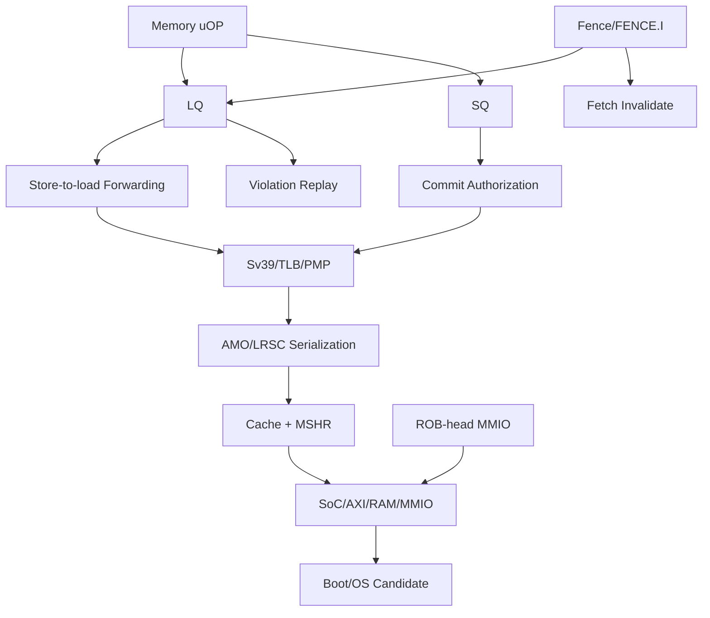

# 第3阶段：LSU、内存顺序、原子、Cache/MMU与SoC

状态：**执行指南，不是已完成实现**。本分阶段文件供多人并行分配；所有命令、文件、测试和结果都必须等对应任务实现后产生。任何“完成”必须能引用真实 Git commit/artifact hash/日志，不凭口头状态。

## 1. 这个子系统是做什么的

每个hart的memory ordering、权限、cache/TLB、MMIO、atomics和OS平台正确，既支持后续fabric，也不把弱内存与一致性混为一谈。

## 2. 为什么存在 / 上游输入

- 上游输入：S1精确状态、S2 backpressure/恢复、S0平台配置。
- 已有依赖：S1/S2候选、RAM/SoC合同、ISA/privilege规范。
- 本阶段输出：跨hart coalescing、完整coherence性能、ASIC signoff。
- 首要原则：memory错误最危险：MMIO/wrong-path store不可重来，不能等到性能优化后补。先串行保守正确，再打开MSHR/speculative LSQ；每次增加都重跑全部负控制。

LSU团队保持byte/age/fault；memory fabric团队管cache/MSHR/SoC；MMU团队管翻译权限；atomic团队管单一linearization；OS团队只在硬件gate后接入系统软件。

## 3. 总体结构

图中的箭头是数据/控制依赖；性能策略不得在正确性前打开。每个分支可以分给不同负责人，但跨接口字段以 [implementation-plan.md](implementation-plan.md) §1.3 和本文件任务卡为准，不能各团队私改。

## 4. 团队分工与进度追踪

| Team | 负责任务 | 当前状态 | Owner | 证据链接 | 下一动作 | Blocker |
|---|---|---|---|---|---|---|
| LSU负责人 | I-033 | Not started | 待定 | 待填 artifact/commit | 读取任务卡并建立输入锁 | 待填 |
| LSU负责人 | I-034 | Not started | 待定 | 待填 artifact/commit | 读取任务卡并建立输入锁 | 待填 |
| LSU负责人 | I-035 | Not started | 待定 | 待填 artifact/commit | 读取任务卡并建立输入锁 | 待填 |
| LSU负责人 | I-036 | Not started | 待定 | 待填 artifact/commit | 读取任务卡并建立输入锁 | 待填 |
| fence负责人 | I-037 | Not started | 待定 | 待填 artifact/commit | 读取任务卡并建立输入锁 | 待填 |
| MMIO负责人 | I-038 | Not started | 待定 | 待填 artifact/commit | 读取任务卡并建立输入锁 | 待填 |
| atomics负责人 | I-039 | Not started | 待定 | 待填 artifact/commit | 读取任务卡并建立输入锁 | 待填 |
| atomics负责人 | I-040 | Not started | 待定 | 待填 artifact/commit | 读取任务卡并建立输入锁 | 待填 |
| C扩展负责人 | I-041 | Not started | 待定 | 待填 artifact/commit | 读取任务卡并建立输入锁 | 待填 |
| cache负责人 | I-042 | Not started | 待定 | 待填 artifact/commit | 读取任务卡并建立输入锁 | 待填 |
| MSHR负责人 | I-043 | Not started | 待定 | 待填 artifact/commit | 读取任务卡并建立输入锁 | 待填 |
| privilege负责人 | I-044 | Not started | 待定 | 待填 artifact/commit | 读取任务卡并建立输入锁 | 待填 |
| MMU负责人 | I-045 | Not started | 待定 | 待填 artifact/commit | 读取任务卡并建立输入锁 | 待填 |
| TLB负责人 | I-046 | Not started | 待定 | 待填 artifact/commit | 读取任务卡并建立输入锁 | 待填 |
| SoC负责人 | I-047 | Not started | 待定 | 待填 artifact/commit | 读取任务卡并建立输入锁 | 待填 |
| OS负责人 | I-048 | Not started | 待定 | 待填 artifact/commit | 读取任务卡并建立输入锁 | 待填 |
| 验证负责人 | V-018 | Not started | 待定 | 待填 artifact/commit | 读取任务卡并建立输入锁 | 待填 |
| 验证负责人 | V-019 | Not started | 待定 | 待填 artifact/commit | 读取任务卡并建立输入锁 | 待填 |
| 验证负责人 | V-020 | Not started | 待定 | 待填 artifact/commit | 读取任务卡并建立输入锁 | 待填 |
| 验证负责人 | V-023 | Not started | 待定 | 待填 artifact/commit | 读取任务卡并建立输入锁 | 待填 |
| 验证负责人 | V-033 | Not started | 待定 | 待填 artifact/commit | 读取任务卡并建立输入锁 | 待填 |
| 验证负责人 | V-036 | Not started | 待定 | 待填 artifact/commit | 读取任务卡并建立输入锁 | 待填 |
| 验证负责人 | V-037 | Not started | 待定 | 待填 artifact/commit | 读取任务卡并建立输入锁 | 待填 |
| 验证负责人 | V-038 | Not started | 待定 | 待填 artifact/commit | 读取任务卡并建立输入锁 | 待填 |
| 验证负责人 | V-039 | Not started | 待定 | 待填 artifact/commit | 读取任务卡并建立输入锁 | 待填 |
| 验证负责人 | V-040 | Not started | 待定 | 待填 artifact/commit | 读取任务卡并建立输入锁 | 待填 |
| 验证负责人 | V-045 | Not started | 待定 | 待填 artifact/commit | 读取任务卡并建立输入锁 | 待填 |
| 验证负责人 | V-046 | Not started | 待定 | 待填 artifact/commit | 读取任务卡并建立输入锁 | 待填 |
| 验证负责人 | V-047 | Not started | 待定 | 待填 artifact/commit | 读取任务卡并建立输入锁 | 待填 |
| 验证负责人 | V-048 | Not started | 待定 | 待填 artifact/commit | 读取任务卡并建立输入锁 | 待填 |
| 验证负责人 | V-049 | Not started | 待定 | 待填 artifact/commit | 读取任务卡并建立输入锁 | 待填 |
| 多hart验证负责人 | V-065 | Not started | 待定 | 待填 artifact/commit | 读取任务卡并建立输入锁 | 待填 |
| 多hart验证负责人 | V-066 | Not started | 待定 | 待填 artifact/commit | 读取任务卡并建立输入锁 | 待填 |
| 多hart验证负责人 | V-067 | Not started | 待定 | 待填 artifact/commit | 读取任务卡并建立输入锁 | 待填 |
| 多hart验证负责人 | V-073 | Not started | 待定 | 待填 artifact/commit | 读取任务卡并建立输入锁 | 待填 |
| 多hart验证负责人 | V-074 | Not started | 待定 | 待填 artifact/commit | 读取任务卡并建立输入锁 | 待填 |

状态只能取 `Not started / Inputs locked / In progress / Blocked / Evidence complete / Accepted`。Accepted 需要阶段负责人和验证负责人同时签字；Blocked 必须写最小外部事实、影响范围、请求对象和下一日期，不写“快好了”。

## 5. 可跟踪任务卡

每张卡先给设计者/审查者看的工程合同，再给执行者看的自然语言说明。说明不是替代规格，而是告诉执行者如何按规格工作：先做什么、不能猜什么、什么时候停下来、拿什么证据证明完成。完成定义：对应 `Pass` 全部有直接证据，相关负控制也工作；不是“代码写完”或“仿真曾跑过”。

### I-033 — 实现顺序 memory endpoint 与访问 fault

- **负责/门禁**：LSU负责人；基础内存访问正确。
- **前置依赖**：I-019, I-007；仍受 implementation-plan 集成依赖表约束。
- **做什么**：首先一次一个 normal-memory transaction，unsupported/misaligned 访问按声明 trap；覆盖 byte/half/word/double signed/unsigned 与 region 边界。
- **输入数据/接口**：load/store size/sign、misalignment、access fault
- **输出与交接**：basic LSU endpoint
- **设计取舍**：先一次一个普通内存事务
- **实现微步骤**：实现address/size/byte mask；处理signed/unsigned load；声明misaligned trap策略；区分normal RAM/MMIO和fault；覆盖region边界；跑reference byte检查；由V-018复核。
- **主要阻塞风险**：越界默认零、partial store、fault副作用；阻断规则：读越界默认为零，或访问 UART 按普通可重试 RAM 处理。
- **验收证据**：load 值与 byte stores 精确匹配 reference；faulting access 无部分不可逆写入。；验证口径：size/fault/boundary suite
- **失败/回退动作**：串行访存路径
- **来源覆盖**：memory semantics, access faults。；来源 IR-001, validation-plan.md。
- **执行者目标**：把“顺序 memory endpoint 与访问 fault”做成一个可复核的小交付：接收明确输入，产出可验证证据，并在失败时给出可回退的安全状态。
- **执行者须知**：先做合同和最小正确实现，再做优化。不要从相邻任务猜字段；所有身份、credit、reset、flush和背压边界必须来自本任务及implementation-plan。完成前至少覆盖一个正常路径、一个资源冲突和一个取消/恢复路径。
- **建议工作顺序**：实现address/size/byte mask；处理signed/unsigned load；声明misaligned trap策略；区分normal RAM/MMIO和fault；覆盖region边界；跑reference byte检查；由V-018复核。
- **可接受完成**：load 值与 byte stores 精确匹配 reference；faulting access 无部分不可逆写入。
- **何时停止求助**：主要风险是越界默认零、partial store、fault副作用。遇到缺失输入、互相矛盾的合同、工具/板卡不可用或验证无法区分错误时，不要猜测；把任务标为Blocked，记录最小事实和需要的上游决定。
- **交付说明**：交接时提供输出：basic LSU endpoint；同时更新Track Log、状态、证据hash/commit和下一步。不要把未验证的半成品标成Evidence complete。
- **参考资料**：IR-001, validation-plan.md。
- **进度日志**：2026-09-29 规划生成——未开始；后续每次状态变化追加日期、commit/artifact、证据和下一步。

### I-034 — 实现 speculative SQ 与 store commit authorization

- **负责/门禁**：LSU负责人；store精确授权。
- **前置依赖**：I-033, I-017, I-018；仍受 implementation-plan 集成依赖表约束。
- **做什么**：store 先进入 SQ，只有 nonfaulting in-order commit 授权才能向外可见；flush 撤销未授权项；运行 CASE=store.wrong_path_visibility。
- **输入数据/接口**：SQ、address/data、ROB authorization、wrong-path
- **输出与交接**：SQ/commit store path
- **设计取舍**：先head-complete授权，后store-buffer drain
- **实现微步骤**：SQ记录address/data readiness；ROB head/older complete时授权；未授权flush撤销；授权后保留drain obligation；设备store恰好一次；跑wrong path/同周期授权；由V-018复核。
- **主要阻塞风险**：wrong-path可见、授权store被flush、重复写；阻断规则：用 execution-complete 代替 commit 授权，或 flush 删除已对外承诺 store。
- **验收证据**：错误路径对 RAM/MMIO 零写入；已授权 store 在后续 flush 后仍完成且不重复。；验证口径：visibility and replay suites
- **失败/回退动作**：store commit即同步外发
- **来源覆盖**：precise memory side effects, recovery。；来源 IR-001, architecture-review.md。
- **执行者目标**：把“speculative SQ 与 store commit authorization”做成一个可复核的小交付：接收明确输入，产出可验证证据，并在失败时给出可回退的安全状态。
- **执行者须知**：先做合同和最小正确实现，再做优化。不要从相邻任务猜字段；所有身份、credit、reset、flush和背压边界必须来自本任务及implementation-plan。完成前至少覆盖一个正常路径、一个资源冲突和一个取消/恢复路径。
- **建议工作顺序**：SQ记录address/data readiness；ROB head/older complete时授权；未授权flush撤销；授权后保留drain obligation；设备store恰好一次；跑wrong path/同周期授权；由V-018复核。
- **可接受完成**：错误路径对 RAM/MMIO 零写入；已授权 store 在后续 flush 后仍完成且不重复。
- **何时停止求助**：主要风险是wrong-path可见、授权store被flush、重复写。遇到缺失输入、互相矛盾的合同、工具/板卡不可用或验证无法区分错误时，不要猜测；把任务标为Blocked，记录最小事实和需要的上游决定。
- **交付说明**：交接时提供输出：SQ/commit store path；同时更新Track Log、状态、证据hash/commit和下一步。不要把未验证的半成品标成Evidence complete。
- **参考资料**：IR-001, architecture-review.md。
- **进度日志**：2026-09-29 规划生成——未开始；后续每次状态变化追加日期、commit/artifact、证据和下一步。

### I-035 — 实现 LQ 与 store-to-load forwarding

- **负责/门禁**：LSU负责人；forwarding每字节正确。
- **前置依赖**：I-034；仍受 implementation-plan 集成依赖表约束。
- **做什么**：初期 load 等待所有相关 older store 地址已知；逐 byte 合并 forwarding 与 memory 返回；覆盖 partial overlap、多 store、same-cycle address resolve。
- **输入数据/接口**：LQ、younger older store、partial overlap、unknown address
- **输出与交接**：load/store forwarding
- **设计取舍**：先保守等待，后精确预测
- **实现微步骤**：LQ按age检索older SQ；逐byte选择最近合法producer；未知older store先阻塞；处理data未ready与address ready；覆盖不同size/multi-store；与memory响应合并；由V-018复核。
- **主要阻塞风险**：只按aligned word、younger store错转发、跨line；阻断规则：只比较 aligned word 地址，或 younger store 错误转发给 older load。
- **验收证据**：每 byte 来自程序序中最近合法 store 或 memory；不同 size alias 不漏检。；验证口径：alias/byte matrix
- **失败/回退动作**：禁跨store转发
- **来源覆盖**：LSQ, memory dependence。；来源 IR-001, architecture-review.md。
- **执行者目标**：把“LQ 与 store-to-load forwarding”做成一个可复核的小交付：接收明确输入，产出可验证证据，并在失败时给出可回退的安全状态。
- **执行者须知**：先做合同和最小正确实现，再做优化。不要从相邻任务猜字段；所有身份、credit、reset、flush和背压边界必须来自本任务及implementation-plan。完成前至少覆盖一个正常路径、一个资源冲突和一个取消/恢复路径。
- **建议工作顺序**：LQ按age检索older SQ；逐byte选择最近合法producer；未知older store先阻塞；处理data未ready与address ready；覆盖不同size/multi-store；与memory响应合并；由V-018复核。
- **可接受完成**：每 byte 来自程序序中最近合法 store 或 memory；不同 size alias 不漏检。
- **何时停止求助**：主要风险是只按aligned word、younger store错转发、跨line。遇到缺失输入、互相矛盾的合同、工具/板卡不可用或验证无法区分错误时，不要猜测；把任务标为Blocked，记录最小事实和需要的上游决定。
- **交付说明**：交接时提供输出：load/store forwarding；同时更新Track Log、状态、证据hash/commit和下一步。不要把未验证的半成品标成Evidence complete。
- **参考资料**：IR-001, architecture-review.md。
- **进度日志**：2026-09-29 规划生成——未开始；后续每次状态变化追加日期、commit/artifact、证据和下一步。

### I-036 — 实现 load speculation 与 violation replay

- **负责/门禁**：LSU负责人；memory speculation可撤销。
- **前置依赖**：I-035, I-018；仍受 implementation-plan 集成依赖表约束。
- **做什么**：可关闭地让 load 越过未知 older store；发现 alias 时 replay load 与所有受污染 younger work，保留 committed state；运行 CASE=lsu.late_alias_replay。
- **输入数据/接口**：late alias、replay、dependent poison、progress
- **输出与交接**：LSQ replay controller
- **设计取舍**：独立replay attempt，恢复全部污染工作
- **实现微步骤**：检测older store address解析冲突；选择最老受影响load/replay边界；invalidate load attempt及dependent results；保留committed state和授权store；重发并防重复memory effect；跑所有resolve cycle；由V-029/V-018复核。
- **主要阻塞风险**：只重发load、replay storm、旧attempt写新owner；阻断规则：只重算 load 而未撤销依赖它的 younger result/store。
- **验收证据**：speculation on/off 对同程序一致；alias 在任何 resolve cycle 被检测，重放不会饿死。；验证口径：late alias matrix、progress
- **失败/回退动作**：关闭load speculation
- **来源覆盖**：dynamic memory disambiguation, recovery。；来源 architecture-review.md, SRC-02。
- **执行者目标**：把“load speculation 与 violation replay”做成一个可复核的小交付：接收明确输入，产出可验证证据，并在失败时给出可回退的安全状态。
- **执行者须知**：先做合同和最小正确实现，再做优化。不要从相邻任务猜字段；所有身份、credit、reset、flush和背压边界必须来自本任务及implementation-plan。完成前至少覆盖一个正常路径、一个资源冲突和一个取消/恢复路径。
- **建议工作顺序**：检测older store address解析冲突；选择最老受影响load/replay边界；invalidate load attempt及dependent results；保留committed state和授权store；重发并防重复memory effect；跑所有resolve cycle；由V-029/V-018复核。
- **可接受完成**：speculation on/off 对同程序一致；alias 在任何 resolve cycle 被检测，重放不会饿死。
- **何时停止求助**：主要风险是只重发load、replay storm、旧attempt写新owner。遇到缺失输入、互相矛盾的合同、工具/板卡不可用或验证无法区分错误时，不要猜测；把任务标为Blocked，记录最小事实和需要的上游决定。
- **交付说明**：交接时提供输出：LSQ replay controller；同时更新Track Log、状态、证据hash/commit和下一步。不要把未验证的半成品标成Evidence complete。
- **参考资料**：architecture-review.md, SRC-02。
- **进度日志**：2026-09-29 规划生成——未开始；后续每次状态变化追加日期、commit/artifact、证据和下一步。

### I-037 — 实现 FENCE 与 FENCE.I

- **负责/门禁**：fence负责人；FENCE/FENCE.I。
- **前置依赖**：I-034, I-009；仍受 implementation-plan 集成依赖表约束。
- **做什么**：初期保守 drain 所有 relevant older access，阻止 forbidden younger access；FENCE.I 清理本 hart 旧指令视图；运行 CASE=fence.code_and_data_order。
- **输入数据/接口**：memory drain、fetch/predecode invalidate、SMC
- **输出与交接**：fence controller
- **设计取舍**：先保守全drain，不实现隐式跨hart I coherence
- **实现微步骤**：映射FENCE predecessor/successor；阻止forbidden younger access；FENCE.I清fetch/predecode/template；自修改代码测试；定义跨hart同步仍需软件机制；覆盖错误路径store/MMIO；由V-016复核。
- **主要阻塞风险**：旧code执行、fence当cache flush、MMIO未完成；阻断规则：instruction stale bytes 被执行，或 fence 完成时旧 MMIO 尚未按合同完成。
- **验收证据**：published code 修改后经规定同步可见；FENCE 不被错误等同于 cache flush 或跨 hart 自动 I-cache 同步。；验证口径：SMC/order suites
- **失败/回退动作**：强制序列化fence指令
- **来源覆盖**：RVWMO ordering, instruction coherence。；来源 IR-001, validation-plan.md。
- **执行者目标**：把“FENCE 与 FENCE.I”做成一个可复核的小交付：接收明确输入，产出可验证证据，并在失败时给出可回退的安全状态。
- **执行者须知**：先做合同和最小正确实现，再做优化。不要从相邻任务猜字段；所有身份、credit、reset、flush和背压边界必须来自本任务及implementation-plan。完成前至少覆盖一个正常路径、一个资源冲突和一个取消/恢复路径。
- **建议工作顺序**：映射FENCE predecessor/successor；阻止forbidden younger access；FENCE.I清fetch/predecode/template；自修改代码测试；定义跨hart同步仍需软件机制；覆盖错误路径store/MMIO；由V-016复核。
- **可接受完成**：published code 修改后经规定同步可见；FENCE 不被错误等同于 cache flush 或跨 hart 自动 I-cache 同步。
- **何时停止求助**：主要风险是旧code执行、fence当cache flush、MMIO未完成。遇到缺失输入、互相矛盾的合同、工具/板卡不可用或验证无法区分错误时，不要猜测；把任务标为Blocked，记录最小事实和需要的上游决定。
- **交付说明**：交接时提供输出：fence controller；同时更新Track Log、状态、证据hash/commit和下一步。不要把未验证的半成品标成Evidence complete。
- **参考资料**：IR-001, validation-plan.md。
- **进度日志**：2026-09-29 规划生成——未开始；后续每次状态变化追加日期、commit/artifact、证据和下一步。

### I-038 — 实现不可推测 MMIO

- **负责/门禁**：MMIO负责人；设备副作用一次。
- **前置依赖**：I-034, I-037；仍受 implementation-plan 集成依赖表约束。
- **做什么**：MMIO 在 ROB head/必要 drain 后执行，不与 RAM coalesce；一次 transaction ID 仅一次设备副作用；运行 CASE=mmio.exactly_once。
- **输入数据/接口**：PMA、ROB head、device model、ID
- **输出与交接**：MMIO path、device protocol
- **设计取舍**：非幂等只在授权边界访问一次
- **实现微步骤**：建立MMIO map与transaction ID；只授权后发起设备访问；transport retry不重复side effect；模型独立记录设备状态；覆盖错误路径/错误响应；同reference校准设备输入；由V-019复核。
- **主要阻塞风险**：重复UART写、读破坏性寄存器、错误默认零；阻断规则：reference 与 DUT 分别读两次设备，或 replay 导致重复写。
- **验收证据**：wrong-path MMIO 零次访问，合法 FIFO-pop/UART 写恰好一次，错误返回精确 trap。；验证口径：exactly-once、negative mutation
- **失败/回退动作**：未建模设备访问拒绝
- **来源覆盖**：system interface, nondeterministic device handling。；来源 validation-plan.md, platform-plan.md。
- **执行者目标**：把“不可推测 MMIO”做成一个可复核的小交付：接收明确输入，产出可验证证据，并在失败时给出可回退的安全状态。
- **执行者须知**：先做合同和最小正确实现，再做优化。不要从相邻任务猜字段；所有身份、credit、reset、flush和背压边界必须来自本任务及implementation-plan。完成前至少覆盖一个正常路径、一个资源冲突和一个取消/恢复路径。
- **建议工作顺序**：建立MMIO map与transaction ID；只授权后发起设备访问；transport retry不重复side effect；模型独立记录设备状态；覆盖错误路径/错误响应；同reference校准设备输入；由V-019复核。
- **可接受完成**：wrong-path MMIO 零次访问，合法 FIFO-pop/UART 写恰好一次，错误返回精确 trap。
- **何时停止求助**：主要风险是重复UART写、读破坏性寄存器、错误默认零。遇到缺失输入、互相矛盾的合同、工具/板卡不可用或验证无法区分错误时，不要猜测；把任务标为Blocked，记录最小事实和需要的上游决定。
- **交付说明**：交接时提供输出：MMIO path、device protocol；同时更新Track Log、状态、证据hash/commit和下一步。不要把未验证的半成品标成Evidence complete。
- **参考资料**：validation-plan.md, platform-plan.md。
- **进度日志**：2026-09-29 规划生成——未开始；后续每次状态变化追加日期、commit/artifact、证据和下一步。

### I-039 — 实现 AMO 原子路径

- **负责/门禁**：atomics负责人；AMO线性化。
- **前置依赖**：I-037, I-038；仍受 implementation-plan 集成依赖表约束。
- **做什么**：先在共同 memory arbiter 做原子 read-modify-write，不以 load+store 松散拼接；测试所有 AMO.W/D signed/unsigned 边界及 aq/rl 顺序。
- **输入数据/接口**：RMW、aq/rl、serialization point
- **输出与交接**：AMO execution path
- **设计取舍**：集中arbiter先做正确，后distributed
- **实现微步骤**：为AMO保留atomic transaction type；在共享点完成read-modify-write；返回old value并处理W sign；实现aq/rl ordering；测试竞争写/异常/PMA；记录linearization点；由V-045复核。
- **主要阻塞风险**：两个RMW穿插、W sign错误、权限被绕过；阻断规则：两个 hart 都读同旧值后覆盖，或把 aq/rl 当性能 hint 忽略。
- **验收证据**：并发 competing accesses 的历史存在合法 linearization，old value 与写入结果正确。；验证口径：race/fault/aqrl suites
- **失败/回退动作**：软件不支持A并拒绝广告
- **来源覆盖**：A extension, atomics, memory ordering。；来源 IR-001, validation-plan.md。
- **执行者目标**：把“AMO 原子路径”做成一个可复核的小交付：接收明确输入，产出可验证证据，并在失败时给出可回退的安全状态。
- **执行者须知**：先做合同和最小正确实现，再做优化。不要从相邻任务猜字段；所有身份、credit、reset、flush和背压边界必须来自本任务及implementation-plan。完成前至少覆盖一个正常路径、一个资源冲突和一个取消/恢复路径。
- **建议工作顺序**：为AMO保留atomic transaction type；在共享点完成read-modify-write；返回old value并处理W sign；实现aq/rl ordering；测试竞争写/异常/PMA；记录linearization点；由V-045复核。
- **可接受完成**：并发 competing accesses 的历史存在合法 linearization，old value 与写入结果正确。
- **何时停止求助**：主要风险是两个RMW穿插、W sign错误、权限被绕过。遇到缺失输入、互相矛盾的合同、工具/板卡不可用或验证无法区分错误时，不要猜测；把任务标为Blocked，记录最小事实和需要的上游决定。
- **交付说明**：交接时提供输出：AMO execution path；同时更新Track Log、状态、证据hash/commit和下一步。不要把未验证的半成品标成Evidence complete。
- **参考资料**：IR-001, validation-plan.md。
- **进度日志**：2026-09-29 规划生成——未开始；后续每次状态变化追加日期、commit/artifact、证据和下一步。

### I-040 — 实现 LR/SC reservation 与进展

- **负责/门禁**：atomics负责人；LR/SC合法进展。
- **前置依赖**：I-039；仍受 implementation-plan 集成依赖表约束。
- **做什么**：跟踪 hart reservation、store/AMO/外部写失效；成功 SC 单次写入；测试冲突、context switch、异常、允许的失败及受限循环进展。
- **输入数据/接口**：reservation、invalidation、context、constrained loop
- **输出与交接**：LR/SC controller
- **设计取舍**：成功不强制匹配参考；独立合法性
- **实现微步骤**：实现每hart reservation状态；处理store/AMO/异常/context失效；SC只在合法reservation写一次；测试同/异址与部分重叠；定义受限循环进展条件；由V-046验收；保留concurrent litmus。
- **主要阻塞风险**：永久失败、reservation粒度不明、外部写忽略；阻断规则：任意永远失败也算通过，或只本 hart store 清 reservation。
- **验收证据**：没有 reservation 的 SC 不写，必要失效不漏；声明的 progress 条件由测试/属性检查。；验证口径：reservation matrix、progress
- **失败/回退动作**：禁LR/SC同时禁A广告
- **来源覆盖**：LR/SC correctness, multi-agent memory。；来源 IR-001, validation-plan.md。
- **执行者目标**：把“LR/SC reservation 与进展”做成一个可复核的小交付：接收明确输入，产出可验证证据，并在失败时给出可回退的安全状态。
- **执行者须知**：先做合同和最小正确实现，再做优化。不要从相邻任务猜字段；所有身份、credit、reset、flush和背压边界必须来自本任务及implementation-plan。完成前至少覆盖一个正常路径、一个资源冲突和一个取消/恢复路径。
- **建议工作顺序**：实现每hart reservation状态；处理store/AMO/异常/context失效；SC只在合法reservation写一次；测试同/异址与部分重叠；定义受限循环进展条件；由V-046验收；保留concurrent litmus。
- **可接受完成**：没有 reservation 的 SC 不写，必要失效不漏；声明的 progress 条件由测试/属性检查。
- **何时停止求助**：主要风险是永久失败、reservation粒度不明、外部写忽略。遇到缺失输入、互相矛盾的合同、工具/板卡不可用或验证无法区分错误时，不要猜测；把任务标为Blocked，记录最小事实和需要的上游决定。
- **交付说明**：交接时提供输出：LR/SC controller；同时更新Track Log、状态、证据hash/commit和下一步。不要把未验证的半成品标成Evidence complete。
- **参考资料**：IR-001, validation-plan.md。
- **进度日志**：2026-09-29 规划生成——未开始；后续每次状态变化追加日期、commit/artifact、证据和下一步。

### I-041 — 实现 C 解压与跨界取指

- **负责/门禁**：C扩展负责人；混合长度取指。
- **前置依赖**：I-010, I-009, I-019；仍受 implementation-plan 集成依赖表约束。
- **做什么**：decode 16/32-bit 混合与跨 fetch line/page；保留原 bits/length；测试 compressed reserved/hint、link PC 增量、第二半字 fault。
- **输入数据/接口**：16/32-bit、cross-line/page、original length
- **输出与交接**：C decoder/predecoder
- **设计取舍**：strict original PC/length，不固定+4
- **实现微步骤**：实现predecode length classifier；解压到明确内部operation；保留原instruction bits/length；处理跨fetch line/page边界；覆盖hint/reserved encodings；测JALR/branch/trap epc；由V-044验收。
- **主要阻塞风险**：跨页fault错PC、reserved编码执行、epc错误；阻断规则：保留 encoding 错执行，或跨页 exception 报错 PC。
- **验收证据**：正常与 trap trace 用 original instruction PC/length，不能将 compressed PC 固定加四。；验证口径：mixed-length matrix
- **失败/回退动作**：禁C直到全case
- **来源覆盖**：C extension, predecode, fetch faults。；来源 IR-001。
- **执行者目标**：把“C 解压与跨界取指”做成一个可复核的小交付：接收明确输入，产出可验证证据，并在失败时给出可回退的安全状态。
- **执行者须知**：先做合同和最小正确实现，再做优化。不要从相邻任务猜字段；所有身份、credit、reset、flush和背压边界必须来自本任务及implementation-plan。完成前至少覆盖一个正常路径、一个资源冲突和一个取消/恢复路径。
- **建议工作顺序**：实现predecode length classifier；解压到明确内部operation；保留原instruction bits/length；处理跨fetch line/page边界；覆盖hint/reserved encodings；测JALR/branch/trap epc；由V-044验收。
- **可接受完成**：正常与 trap trace 用 original instruction PC/length，不能将 compressed PC 固定加四。
- **何时停止求助**：主要风险是跨页fault错PC、reserved编码执行、epc错误。遇到缺失输入、互相矛盾的合同、工具/板卡不可用或验证无法区分错误时，不要猜测；把任务标为Blocked，记录最小事实和需要的上游决定。
- **交付说明**：交接时提供输出：C decoder/predecoder；同时更新Track Log、状态、证据hash/commit和下一步。不要把未验证的半成品标成Evidence complete。
- **参考资料**：IR-001。
- **进度日志**：2026-09-29 规划生成——未开始；后续每次状态变化追加日期、commit/artifact、证据和下一步。

### I-042 — 实现 blocking L1I/L1D

- **负责/门禁**：cache负责人；基础L1正确。
- **前置依赖**：I-006, I-035, I-037；仍受 implementation-plan 集成依赖表约束。
- **做什么**：先小 direct-mapped/低关联 cache，refill/evict 整体可追踪；初始化 valid 不重置 data RAM；运行 CASE=cache.refill_evict_fault。
- **输入数据/接口**：I/D cache、valid、refill/evict、error
- **输出与交接**：blocking caches
- **设计取舍**：先blocking小cache，保正确
- **实现微步骤**：实现tag/valid/line data wrapper；定义write policy和refill/evict；初始化valid而非全data；处理refill error；cache on/off相同trace；覆盖conflict/dirty/SMC；由V-018/V-067复核。
- **主要阻塞风险**：错误refill标valid、dirty丢失、valid reset不足；阻断规则：error refill 标 valid，或 eviction 丢 dirty bytes。
- **验收证据**：conflict/refill/dirty eviction/self-modify 在 on/off 模式 architectural trace 一致。；验证口径：on/off equivalence、fault
- **失败/回退动作**：禁cache路径
- **来源覆盖**：split L1, unified memory service。；来源 SRC-01/SRC-02, platform-plan.md。
- **执行者目标**：把“blocking L1I/L1D”做成一个可复核的小交付：接收明确输入，产出可验证证据，并在失败时给出可回退的安全状态。
- **执行者须知**：先做合同和最小正确实现，再做优化。不要从相邻任务猜字段；所有身份、credit、reset、flush和背压边界必须来自本任务及implementation-plan。完成前至少覆盖一个正常路径、一个资源冲突和一个取消/恢复路径。
- **建议工作顺序**：实现tag/valid/line data wrapper；定义write policy和refill/evict；初始化valid而非全data；处理refill error；cache on/off相同trace；覆盖conflict/dirty/SMC；由V-018/V-067复核。
- **可接受完成**：conflict/refill/dirty eviction/self-modify 在 on/off 模式 architectural trace 一致。
- **何时停止求助**：主要风险是错误refill标valid、dirty丢失、valid reset不足。遇到缺失输入、互相矛盾的合同、工具/板卡不可用或验证无法区分错误时，不要猜测；把任务标为Blocked，记录最小事实和需要的上游决定。
- **交付说明**：交接时提供输出：blocking caches；同时更新Track Log、状态、证据hash/commit和下一步。不要把未验证的半成品标成Evidence complete。
- **参考资料**：SRC-01/SRC-02, platform-plan.md。
- **进度日志**：2026-09-29 规划生成——未开始；后续每次状态变化追加日期、commit/artifact、证据和下一步。

### I-043 — 实现 MSHR 与 nonblocking load responses

- **负责/门禁**：MSHR负责人；有限MLP。
- **前置依赖**：I-042, I-036；仍受 implementation-plan 集成依赖表约束。
- **做什么**：从两个 MSHR 开始，处理 same-line merge、不同 line 乱序返回、squash 后 refill、资源满；运行 CASE=mshr.out_of_order_merge。
- **输入数据/接口**：miss ID、same-line merge、response reorder、cancel
- **输出与交接**：nonblocking cache path
- **设计取舍**：两MSHR起点，避免资源爆炸
- **实现微步骤**：分配transaction IDs和consumer bitmap；merge同line请求保留独立consumer；乱序response分发；处理squash后的refill；MSHR full有backpressure/进展；跑cancel与乱序矩阵；由V-033/V-018复核。
- **主要阻塞风险**：response alias、取消共享请求、full死锁；阻断规则：response ID 复用别名、MSHR 满导致丢 miss 或死锁。
- **验收证据**：line response 正确分发给所有仍 live 请求；取消一个 load 不取消其他合法消费者。；验证口径：response/invariant suites
- **失败/回退动作**：blocking cache profile
- **来源覆盖**：memory-level parallelism, shared return fabric。；来源 architecture-review.md, SRC-01/SRC-03。
- **执行者目标**：把“MSHR 与 nonblocking load responses”做成一个可复核的小交付：接收明确输入，产出可验证证据，并在失败时给出可回退的安全状态。
- **执行者须知**：先做合同和最小正确实现，再做优化。不要从相邻任务猜字段；所有身份、credit、reset、flush和背压边界必须来自本任务及implementation-plan。完成前至少覆盖一个正常路径、一个资源冲突和一个取消/恢复路径。
- **建议工作顺序**：分配transaction IDs和consumer bitmap；merge同line请求保留独立consumer；乱序response分发；处理squash后的refill；MSHR full有backpressure/进展；跑cancel与乱序矩阵；由V-033/V-018复核。
- **可接受完成**：line response 正确分发给所有仍 live 请求；取消一个 load 不取消其他合法消费者。
- **何时停止求助**：主要风险是response alias、取消共享请求、full死锁。遇到缺失输入、互相矛盾的合同、工具/板卡不可用或验证无法区分错误时，不要猜测；把任务标为Blocked，记录最小事实和需要的上游决定。
- **交付说明**：交接时提供输出：nonblocking cache path；同时更新Track Log、状态、证据hash/commit和下一步。不要把未验证的半成品标成Evidence complete。
- **参考资料**：architecture-review.md, SRC-01/SRC-03。
- **进度日志**：2026-09-29 规划生成——未开始；后续每次状态变化追加日期、commit/artifact、证据和下一步。

### I-044 — 实现 S/U privilege 与 PMP

- **负责/门禁**：privilege负责人；S/U/PMP边界。
- **前置依赖**：I-019, I-038；仍受 implementation-plan 集成依赖表约束。
- **做什么**：实现 delegation、SRET、privilege access checks、PMP overlap/lock/address matching；按 region 边界测试 fetch/load/store/AMO。
- **输入数据/接口**：delegation、SRET、MPRV/SUM/MXR、PMP entries
- **输出与交接**：privilege/PMP implementation
- **设计取舍**：逐CSR/mode permission矩阵
- **实现微步骤**：实现S/U CSR和状态转移；实现delegation/interrupt handling；接入fetch/load/store permission；实现PMP region/lock/address match；覆盖每mode/access组合；由V-047验收；与Sv39接口隔离。
- **主要阻塞风险**：全权限旁路、delegate priority错、PMP lock/WARL；阻断规则：M/S/U mode 仅改标签不检查访问，或 lock/WARL 行为不一致。
- **验收证据**：每种 privilege/access/PMP 组合与 spec/reference 一致，permission fault 无 side effect。；验证口径：permission matrix
- **失败/回退动作**：p1阻断，不宣称Linux
- **来源覆盖**：privilege, protection, application processor path。；来源 IR-001, validation-plan.md。
- **执行者目标**：把“S/U privilege 与 PMP”做成一个可复核的小交付：接收明确输入，产出可验证证据，并在失败时给出可回退的安全状态。
- **执行者须知**：先做合同和最小正确实现，再做优化。不要从相邻任务猜字段；所有身份、credit、reset、flush和背压边界必须来自本任务及implementation-plan。完成前至少覆盖一个正常路径、一个资源冲突和一个取消/恢复路径。
- **建议工作顺序**：实现S/U CSR和状态转移；实现delegation/interrupt handling；接入fetch/load/store permission；实现PMP region/lock/address match；覆盖每mode/access组合；由V-047验收；与Sv39接口隔离。
- **可接受完成**：每种 privilege/access/PMP 组合与 spec/reference 一致，permission fault 无 side effect。
- **何时停止求助**：主要风险是全权限旁路、delegate priority错、PMP lock/WARL。遇到缺失输入、互相矛盾的合同、工具/板卡不可用或验证无法区分错误时，不要猜测；把任务标为Blocked，记录最小事实和需要的上游决定。
- **交付说明**：交接时提供输出：privilege/PMP implementation；同时更新Track Log、状态、证据hash/commit和下一步。不要把未验证的半成品标成Evidence complete。
- **参考资料**：IR-001, validation-plan.md。
- **进度日志**：2026-09-29 规划生成——未开始；后续每次状态变化追加日期、commit/artifact、证据和下一步。

### I-045 — 实现 Sv39 page walker

- **负责/门禁**：MMU负责人；Sv39翻译正确。
- **前置依赖**：I-044, I-042；仍受 implementation-plan 集成依赖表约束。
- **做什么**：写多级 PTW，支持 leaf/superpage/alignment/permission/SUM/MXR 与访问 fault；先串行 PTW；运行 CASE=sv39.walk_and_faults。
- **输入数据/接口**：PTW、PTE、canonical、permissions、A/D policy
- **输出与交接**：Sv39 walker
- **设计取舍**：先串行PTW再并行优化
- **实现微步骤**：实现satp mode/ASID；逐级walk与leaf detection；检查R/W/X/U及A/D策略；处理access/page fault优先级；覆盖4K/2M/1G/跨页；由V-048验收；与PMP/PMA级联。
- **主要阻塞风险**：非法VA访问物理RAM、superpage对齐、错误cause/tval；阻断规则：非 canonical 地址仍访问物理 RAM，或 PTE error 当普通 cache miss。
- **验收证据**：所有级别合法映射和错误 PTE 的 PA/cause/tval 与 reference 一致，更新 A/D 的策略明确。；验证口径：walk/fault matrix
- **失败/回退动作**：物理地址p1不宣称virtual memory
- **来源覆盖**：MMU, virtual memory, precise faults。；来源 IR-001, validation-plan.md。
- **执行者目标**：把“Sv39 page walker”做成一个可复核的小交付：接收明确输入，产出可验证证据，并在失败时给出可回退的安全状态。
- **执行者须知**：先做合同和最小正确实现，再做优化。不要从相邻任务猜字段；所有身份、credit、reset、flush和背压边界必须来自本任务及implementation-plan。完成前至少覆盖一个正常路径、一个资源冲突和一个取消/恢复路径。
- **建议工作顺序**：实现satp mode/ASID；逐级walk与leaf detection；检查R/W/X/U及A/D策略；处理access/page fault优先级；覆盖4K/2M/1G/跨页；由V-048验收；与PMP/PMA级联。
- **可接受完成**：所有级别合法映射和错误 PTE 的 PA/cause/tval 与 reference 一致，更新 A/D 的策略明确。
- **何时停止求助**：主要风险是非法VA访问物理RAM、superpage对齐、错误cause/tval。遇到缺失输入、互相矛盾的合同、工具/板卡不可用或验证无法区分错误时，不要猜测；把任务标为Blocked，记录最小事实和需要的上游决定。
- **交付说明**：交接时提供输出：Sv39 walker；同时更新Track Log、状态、证据hash/commit和下一步。不要把未验证的半成品标成Evidence complete。
- **参考资料**：IR-001, validation-plan.md。
- **进度日志**：2026-09-29 规划生成——未开始；后续每次状态变化追加日期、commit/artifact、证据和下一步。

### I-046 — 实现 TLB 与 SFENCE.VMA

- **负责/门禁**：TLB负责人；翻译缓存隔离。
- **前置依赖**：I-045；仍受 implementation-plan 集成依赖表约束。
- **做什么**：TLB tag 包括必要 address-space context；实现全量保守 invalidation 再优化选择性；测试同 VA 不同 ASID、global entry、修改 PTE 后 fence。
- **输入数据/接口**：ASID/global、SFENCE.VMA、late PTW response
- **输出与交接**：TLB/translation generation
- **设计取舍**：先保守全清，后选择性invalidate
- **实现微步骤**：TLB tag含hart/ASID/global/permissions；satp切换与新代管理；SFENCE按规则invalidate；旧PTW response代检查；多hart shootdown单独协议；测global和ASID复用；由V-049验收。
- **主要阻塞风险**：stale translation、ASID跨hart混用、inflight PTW重插；阻断规则：cohort/LLB 仅按 PC/VA 命中，或 SFENCE 被当 memory-data fence。
- **验收证据**：stale translation 在要求同步后不可使用；permission result 不从别的 hart/ASID 复用。；验证口径：stale/late response cases
- **失败/回退动作**：禁TLB直接PTW
- **来源覆盖**：translation coherency, address-space isolation。；来源 IR-001, architecture-review.md。
- **执行者目标**：把“TLB 与 SFENCE.VMA”做成一个可复核的小交付：接收明确输入，产出可验证证据，并在失败时给出可回退的安全状态。
- **执行者须知**：先做合同和最小正确实现，再做优化。不要从相邻任务猜字段；所有身份、credit、reset、flush和背压边界必须来自本任务及implementation-plan。完成前至少覆盖一个正常路径、一个资源冲突和一个取消/恢复路径。
- **建议工作顺序**：TLB tag含hart/ASID/global/permissions；satp切换与新代管理；SFENCE按规则invalidate；旧PTW response代检查；多hart shootdown单独协议；测global和ASID复用；由V-049验收。
- **可接受完成**：stale translation 在要求同步后不可使用；permission result 不从别的 hart/ASID 复用。
- **何时停止求助**：主要风险是stale translation、ASID跨hart混用、inflight PTW重插。遇到缺失输入、互相矛盾的合同、工具/板卡不可用或验证无法区分错误时，不要猜测；把任务标为Blocked，记录最小事实和需要的上游决定。
- **交付说明**：交接时提供输出：TLB/translation generation；同时更新Track Log、状态、证据hash/commit和下一步。不要把未验证的半成品标成Evidence complete。
- **参考资料**：IR-001, architecture-review.md。
- **进度日志**：2026-09-29 规划生成——未开始；后续每次状态变化追加日期、commit/artifact、证据和下一步。

### I-047 — 实现 SoC interconnect 与 error completion

- **负责/门禁**：SoC负责人；可移植系统互连。
- **前置依赖**：I-038, I-020, I-042；仍受 implementation-plan 集成依赖表约束。
- **做什么**：adapter 保持 ID/byte strobes/backpressure；对 unmapped、DECERR/SLVERR、reset 中 transaction 逐一规定处理；运行 CASE=soc.bus_errors_and_ids。
- **输入数据/接口**：bus IDs、backpressure、errors、peripherals
- **输出与交接**：SoC fabric、error evidence
- **设计取舍**：core transport与ISA顺序分离
- **实现微步骤**：定义内部request/response protocol；实现AXI/local adapters；处理unmapped/错误response；挂RAM/UART/timer/interrupt；覆盖backpressure和reset；由H/V联合复核；不先假设coherence。
- **主要阻塞风险**：response error丢失、组合ready环、ID串扰；阻断规则：AXI response error 被丢弃导致 ROB 永久等待。
- **验收证据**：所有 accepted request 恰好一个正常或错误完成；无组合 ready loop，MMIO side effects 不重复。；验证口径：bus stress、ID/error suites
- **失败/回退动作**：用简单同步memory bus
- **来源覆盖**：SoC glue, FPGA integration, portability。；来源 platform-plan.md。
- **执行者目标**：把“SoC interconnect 与 error completion”做成一个可复核的小交付：接收明确输入，产出可验证证据，并在失败时给出可回退的安全状态。
- **执行者须知**：先做合同和最小正确实现，再做优化。不要从相邻任务猜字段；所有身份、credit、reset、flush和背压边界必须来自本任务及implementation-plan。完成前至少覆盖一个正常路径、一个资源冲突和一个取消/恢复路径。
- **建议工作顺序**：定义内部request/response protocol；实现AXI/local adapters；处理unmapped/错误response；挂RAM/UART/timer/interrupt；覆盖backpressure和reset；由H/V联合复核；不先假设coherence。
- **可接受完成**：所有 accepted request 恰好一个正常或错误完成；无组合 ready loop，MMIO side effects 不重复。
- **何时停止求助**：主要风险是response error丢失、组合ready环、ID串扰。遇到缺失输入、互相矛盾的合同、工具/板卡不可用或验证无法区分错误时，不要猜测；把任务标为Blocked，记录最小事实和需要的上游决定。
- **交付说明**：交接时提供输出：SoC fabric、error evidence；同时更新Track Log、状态、证据hash/commit和下一步。不要把未验证的半成品标成Evidence complete。
- **参考资料**：platform-plan.md。
- **进度日志**：2026-09-29 规划生成——未开始；后续每次状态变化追加日期、commit/artifact、证据和下一步。

### I-048 — 完成 p1 boot 与 Linux 软件契约

- **负责/门禁**：OS负责人；RISC-V系统软件候选。
- **前置依赖**：I-039, I-040, I-041, I-046, I-047；仍受 implementation-plan 集成依赖表约束。
- **做什么**：先 S-mode bare-metal，再匹配 manifest 的 firmware+kernel+rootfs；保留每阶段 trap/boot log；运行 userspace syscall/timer/page-fault/atomic smoke。
- **输入数据/接口**：SBI/firmware/DTB/kernel/rootfs、timer/VM/atomic
- **输出与交接**：OS image and boot evidence
- **设计取舍**：先可重放小镜像，后Linux性能
- **实现微步骤**：审计镜像所需ISA/platform；准备firmware/DTB/entry和device；启动到S-mode程序再userspace；跑syscall/timer/page fault/atomic smoke；记录完整artifact hash；失败最小化到首个architectural event；由V-073验收。
- **主要阻塞风险**：banner当成功、PS ARM冒充、ISA/DTB矛盾；阻断规则：只出现 Linux banner 即通过，或由 Zynq ARM PS 运行 Linux 冒充 RISC-V core 启动。
- **验收证据**：userspace 自检输出正确 signature 并正常退出，非法访问准确进入预期 handler；启用 ISA 与 DTB 一致。；验证口径：defined signature/exit
- **失败/回退动作**：退到bare-metal p1 smoke
- **来源覆盖**：standard software compatibility, Linux validation。；来源 IR-001, validation-plan.md, platform-plan.md。
- **执行者目标**：把“p1 boot 与 Linux 软件契约”做成一个可复核的小交付：接收明确输入，产出可验证证据，并在失败时给出可回退的安全状态。
- **执行者须知**：先做合同和最小正确实现，再做优化。不要从相邻任务猜字段；所有身份、credit、reset、flush和背压边界必须来自本任务及implementation-plan。完成前至少覆盖一个正常路径、一个资源冲突和一个取消/恢复路径。
- **建议工作顺序**：审计镜像所需ISA/platform；准备firmware/DTB/entry和device；启动到S-mode程序再userspace；跑syscall/timer/page fault/atomic smoke；记录完整artifact hash；失败最小化到首个architectural event；由V-073验收。
- **可接受完成**：userspace 自检输出正确 signature 并正常退出，非法访问准确进入预期 handler；启用 ISA 与 DTB 一致。
- **何时停止求助**：主要风险是banner当成功、PS ARM冒充、ISA/DTB矛盾。遇到缺失输入、互相矛盾的合同、工具/板卡不可用或验证无法区分错误时，不要猜测；把任务标为Blocked，记录最小事实和需要的上游决定。
- **交付说明**：交接时提供输出：OS image and boot evidence；同时更新Track Log、状态、证据hash/commit和下一步。不要把未验证的半成品标成Evidence complete。
- **参考资料**：IR-001, validation-plan.md, platform-plan.md。
- **进度日志**：2026-09-29 规划生成——未开始；后续每次状态变化追加日期、commit/artifact、证据和下一步。

### V-018 — 分开 architectural memory 与可见 store

- **负责/门禁**：验证负责人；验证证据闭合。
- **前置依赖**：V-011, V-013；仍受 implementation-plan 集成依赖表约束。
- **做什么**：覆盖所有 load/store 宽度、符号扩展、部分 byte mask、forwarding、跨行、错误路径 store；记录 store commit 与真正 drain，比较 reference memory 及最后 byte signature。
- **输入数据/接口**：LSU/store-buffer 实现、memory-operation schema。
- **输出与交接**：有因果 ID 的 load/store/visibility trace。
- **设计取舍**：有限集合/模型边界明确，不用样本数冒充形式证明
- **实现微步骤**：冻结该任务输入、版本与capability交集；展开有限case/seed/budget manifest；实现真实检查器并接入负控制；执行正控制和故障注入；闭合计划/执行/通过/失败/unsupported计数；最小化失败并建立replay；阶段负责人签收或阻断后续gate。
- **主要阻塞风险**：静默skip、mock echo、空覆盖率、把deferred当成功；阻断规则：仅比较 rd 漏掉错误 store、将 cache refill 当 load effect、重复 drain、用 DUT memory 覆盖 reference 后宣称一致。
- **验收证据**：每个可见 byte 有合法已提交 producer，load 返回值与允许来源相符，取消 store 不外泄。；验证口径：每个可见 byte 有合法已提交 producer，load 返回值与允许来源相符，取消 store 不外泄。
- **失败/回退动作**：仅比较 rd 漏掉错误 store、将 cache refill 当 load effect、重复 drain、用 DUT memory 覆盖 reference 后宣称一致。
- **来源覆盖**：SRC-03 §Memory Operation 也应该成为 Packet、§Store visibility obeys selected model。；来源 VR-003, VR-014。
- **执行者目标**：把“分开 architectural memory 与可见 store”做成一个可复核的小交付：接收明确输入，产出可验证证据，并在失败时给出可回退的安全状态。
- **执行者须知**：先证明检查器能抓到真实错误，再接受正例。每个测试必须物化输入/seed/期望和排除账本；不可用空套件、mock echo或静默skip取得通过。完成前加入一个负控制并保存首个差异。
- **建议工作顺序**：冻结该任务输入、版本与capability交集；展开有限case/seed/budget manifest；实现真实检查器并接入负控制；执行正控制和故障注入；闭合计划/执行/通过/失败/unsupported计数；最小化失败并建立replay；阶段负责人签收或阻断后续gate。
- **可接受完成**：每个可见 byte 有合法已提交 producer，load 返回值与允许来源相符，取消 store 不外泄。
- **何时停止求助**：主要风险是静默skip、mock echo、空覆盖率、把deferred当成功。遇到缺失输入、互相矛盾的合同、工具/板卡不可用或验证无法区分错误时，不要猜测；把任务标为Blocked，记录最小事实和需要的上游决定。
- **交付说明**：交接时提供输出：有因果 ID 的 load/store/visibility trace。；同时更新Track Log、状态、证据hash/commit和下一步。不要把未验证的半成品标成Evidence complete。
- **参考资料**：VR-003, VR-014。
- **进度日志**：2026-09-29 规划生成——未开始；后续每次状态变化追加日期、commit/artifact、证据和下一步。

### V-019 — 实现独立 MMIO 副作用模型

- **负责/门禁**：验证负责人；验证证据闭合。
- **前置依赖**：V-015, V-018；仍受 implementation-plan 集成依赖表约束。
- **做什么**：运行 destructive-read、partial-write、非法宽度、未映射地址、flush 中 speculative MMIO；同一个已锁事件给 DUT/reference，独立计数实际副作用。
- **输入数据/接口**：UART/timer/测试结束寄存器模型、PMA 非幂等区域表。
- **输出与交接**：设备 I/O 事务日志与差分设备状态。
- **设计取舍**：有限集合/模型边界明确，不用样本数冒充形式证明
- **实现微步骤**：冻结该任务输入、版本与capability交集；展开有限case/seed/budget manifest；实现真实检查器并接入负控制；执行正控制和故障注入；闭合计划/执行/通过/失败/unsupported计数；最小化失败并建立replay；阶段负责人签收或阻断后续gate。
- **主要阻塞风险**：静默skip、mock echo、空覆盖率、把deferred当成功；阻断规则：读两次破坏设备状态、默认所有 MMIO skip、错误路径设备写、未建模设备默认为零。
- **验收证据**：每项副作用仅一次且顺序/字节使能正确；被取消访问无副作用；MMIO rd 数据相同不掩盖错误地址。；验证口径：每项副作用仅一次且顺序/字节使能正确；被取消访问无副作用；MMIO rd 数据相同不掩盖错误地址。
- **失败/回退动作**：读两次破坏设备状态、默认所有 MMIO skip、错误路径设备写、未建模设备默认为零。
- **来源覆盖**：SRC-03 §Memory Fabric、§coalesced memory 的例外边界。；来源 VR-003, VR-005, VR-012, VR-014。
- **执行者目标**：把“独立 MMIO 副作用模型”做成一个可复核的小交付：接收明确输入，产出可验证证据，并在失败时给出可回退的安全状态。
- **执行者须知**：先证明检查器能抓到真实错误，再接受正例。每个测试必须物化输入/seed/期望和排除账本；不可用空套件、mock echo或静默skip取得通过。完成前加入一个负控制并保存首个差异。
- **建议工作顺序**：冻结该任务输入、版本与capability交集；展开有限case/seed/budget manifest；实现真实检查器并接入负控制；执行正控制和故障注入；闭合计划/执行/通过/失败/unsupported计数；最小化失败并建立replay；阶段负责人签收或阻断后续gate。
- **可接受完成**：每项副作用仅一次且顺序/字节使能正确；被取消访问无副作用；MMIO rd 数据相同不掩盖错误地址。
- **何时停止求助**：主要风险是静默skip、mock echo、空覆盖率、把deferred当成功。遇到缺失输入、互相矛盾的合同、工具/板卡不可用或验证无法区分错误时，不要猜测；把任务标为Blocked，记录最小事实和需要的上游决定。
- **交付说明**：交接时提供输出：设备 I/O 事务日志与差分设备状态。；同时更新Track Log、状态、证据hash/commit和下一步。不要把未验证的半成品标成Evidence complete。
- **参考资料**：VR-003, VR-005, VR-012, VR-014。
- **进度日志**：2026-09-29 规划生成——未开始；后续每次状态变化追加日期、commit/artifact、证据和下一步。

### V-020 — 禁止静默 exclusions 与 reference skip

- **负责/门禁**：验证负责人；验证证据闭合。
- **前置依赖**：V-017, V-019；仍受 implementation-plan 集成依赖表约束。
- **做什么**：枚举所有禁用 checker、skip、CSR waive、未实现 reference feature、超时与生成失败；每项记录原因、规范依据、替代验证、受影响 case/字段和结束条件；未登记项故意触发拒绝。
- **输入数据/接口**：每个 source/profile 比较规则、ACT4 默认 exclusion、Difftest waive/skip 路径。
- **输出与交接**：机器可读 exclusion ledger 与计数闭合报告。
- **设计取舍**：有限集合/模型边界明确，不用样本数冒充形式证明
- **实现微步骤**：冻结该任务输入、版本与capability交集；展开有限case/seed/budget manifest；实现真实检查器并接入负控制；执行正控制和故障注入；闭合计划/执行/通过/失败/unsupported计数；最小化失败并建立replay；阶段负责人签收或阻断后续gate。
- **主要阻塞风险**：静默skip、mock echo、空覆盖率、把deferred当成功；阻断规则：用 broad skip/ignore_illegal_mem_access 掩盖错误，测试被 filter 后不在总数，waive 同步 DUT→REF 后缺独立检查。
- **验收证据**：未登记排除为 0；任何已承诺功能不能仅以 waiver 获得验收；新规则必须通过负控制。；验证口径：未登记排除为 0；任何已承诺功能不能仅以 waiver 获得验收；新规则必须通过负控制。
- **失败/回退动作**：用 broad skip/ignore_illegal_mem_access 掩盖错误，测试被 filter 后不在总数，waive 同步 DUT→REF 后缺独立检查。
- **来源覆盖**：SRC-03 §architectural verification retirement boundary；验证可信性。；来源 VR-003, VR-009。
- **执行者目标**：把“禁止静默 exclusions 与 reference skip”做成一个可复核的小交付：接收明确输入，产出可验证证据，并在失败时给出可回退的安全状态。
- **执行者须知**：先证明检查器能抓到真实错误，再接受正例。每个测试必须物化输入/seed/期望和排除账本；不可用空套件、mock echo或静默skip取得通过。完成前加入一个负控制并保存首个差异。
- **建议工作顺序**：冻结该任务输入、版本与capability交集；展开有限case/seed/budget manifest；实现真实检查器并接入负控制；执行正控制和故障注入；闭合计划/执行/通过/失败/unsupported计数；最小化失败并建立replay；阶段负责人签收或阻断后续gate。
- **可接受完成**：未登记排除为 0；任何已承诺功能不能仅以 waiver 获得验收；新规则必须通过负控制。
- **何时停止求助**：主要风险是静默skip、mock echo、空覆盖率、把deferred当成功。遇到缺失输入、互相矛盾的合同、工具/板卡不可用或验证无法区分错误时，不要猜测；把任务标为Blocked，记录最小事实和需要的上游决定。
- **交付说明**：交接时提供输出：机器可读 exclusion ledger 与计数闭合报告。；同时更新Track Log、状态、证据hash/commit和下一步。不要把未验证的半成品标成Evidence complete。
- **参考资料**：VR-003, VR-009。
- **进度日志**：2026-09-29 规划生成——未开始；后续每次状态变化追加日期、commit/artifact、证据和下一步。

### V-023 — 注入 store、MMIO 与 vector 高位错误

- **负责/门禁**：验证负责人；验证证据闭合。
- **前置依赖**：V-018, V-019, V-020；仍受 implementation-plan 集成依赖表约束。
- **做什么**：修改 store byte-enable、PA、数据，制造重复 MMIO 写；V 启用后改变向量高 64-bit、mask bit、vstart、被保护 inactive element 与 FOF 最终 vl，分别运行。
- **输入数据/接口**：memory/设备正控制；vector 里程碑启用时追加高位正控制。
- **输出与交接**：不依赖普通 GPR 的故障检测矩阵。
- **设计取舍**：有限集合/模型边界明确，不用样本数冒充形式证明
- **实现微步骤**：冻结该任务输入、版本与capability交集；展开有限case/seed/budget manifest；实现真实检查器并接入负控制；执行正控制和故障注入；闭合计划/执行/通过/失败/unsupported计数；最小化失败并建立replay；阶段负责人签收或阻断后续gate。
- **主要阻塞风险**：静默skip、mock echo、空覆盖率、把deferred当成功；阻断规则：仅最终 GPR 一致便通过、vec trace 截断、全屏蔽 agnostic region 导致非法值通过。
- **验收证据**：可见内存/设备/向量错误全部被对应 checker 检出；未启用 vector 明确为 deferred 且阻止 V gate。；验证口径：可见内存/设备/向量错误全部被对应 checker 检出；未启用 vector 明确为 deferred 且阻止 V gate。
- **失败/回退动作**：仅最终 GPR 一致便通过、vec trace 截断、全屏蔽 agnostic region 导致非法值通过。
- **来源覆盖**：SRC-03 §Memory Fabric、§Vector Macro-uOP、§precise semantics。；来源 VR-003, VR-013, VR-014。
- **执行者目标**：把“注入 store、MMIO 与 vector 高位错误”做成一个可复核的小交付：接收明确输入，产出可验证证据，并在失败时给出可回退的安全状态。
- **执行者须知**：先证明检查器能抓到真实错误，再接受正例。每个测试必须物化输入/seed/期望和排除账本；不可用空套件、mock echo或静默skip取得通过。完成前加入一个负控制并保存首个差异。
- **建议工作顺序**：冻结该任务输入、版本与capability交集；展开有限case/seed/budget manifest；实现真实检查器并接入负控制；执行正控制和故障注入；闭合计划/执行/通过/失败/unsupported计数；最小化失败并建立replay；阶段负责人签收或阻断后续gate。
- **可接受完成**：可见内存/设备/向量错误全部被对应 checker 检出；未启用 vector 明确为 deferred 且阻止 V gate。
- **何时停止求助**：主要风险是静默skip、mock echo、空覆盖率、把deferred当成功。遇到缺失输入、互相矛盾的合同、工具/板卡不可用或验证无法区分错误时，不要猜测；把任务标为Blocked，记录最小事实和需要的上游决定。
- **交付说明**：交接时提供输出：不依赖普通 GPR 的故障检测矩阵。；同时更新Track Log、状态、证据hash/commit和下一步。不要把未验证的半成品标成Evidence complete。
- **参考资料**：VR-003, VR-013, VR-014。
- **进度日志**：2026-09-29 规划生成——未开始；后续每次状态变化追加日期、commit/artifact、证据和下一步。

### V-033 — 在有界环境下验证 forward progress

- **负责/门禁**：验证负责人；验证证据闭合。
- **前置依赖**：V-026, V-032；仍受 implementation-plan 集成依赖表约束。
- **做什么**：为 ALU/DIV/load/return/commit 等资源构造循环等待压力；在每 64 cycles 至少一个响应的约束下检查有界完成；另注入永久不响应确认 code 3 与挂起资源诊断。
- **输入数据/接口**：环境响应上界、仲裁公平性合同、wait-for graph。
- **输出与交接**：环境假设、计算的进展界与 watchdog 命中证据。
- **设计取舍**：有限集合/模型边界明确，不用样本数冒充形式证明
- **实现微步骤**：冻结该任务输入、版本与capability交集；展开有限case/seed/budget manifest；实现真实检查器并接入负控制；执行正控制和故障注入；闭合计划/执行/通过/失败/unsupported计数；最小化失败并建立replay；阶段负责人签收或阻断后续gate。
- **主要阻塞风险**：静默skip、mock echo、空覆盖率、把deferred当成功；阻断规则：只有平均吞吐、用不现实公平性 assume 掩盖设计饥饿、无法区分合法 WFI 与 deadlock。
- **验收证据**：有界场景中每个 eligible oldest 工作在合同内进展；永久不响应归类环境 timeout 而非通过。；验证口径：有界场景中每个 eligible oldest 工作在合同内进展；永久不响应归类环境 timeout 而非通过。
- **失败/回退动作**：只有平均吞吐、用不现实公平性 assume 掩盖设计饥饿、无法区分合法 WFI 与 deadlock。
- **来源覆盖**：SRC-03 §Criticality/age scheduling、§Elastic Latency Execution。；来源 SRC-03:1200-1256, SRC-03:1343-1424, VR-011。
- **执行者目标**：把“在有界环境下 forward progress”做成一个可复核的小交付：接收明确输入，产出可验证证据，并在失败时给出可回退的安全状态。
- **执行者须知**：先证明检查器能抓到真实错误，再接受正例。每个测试必须物化输入/seed/期望和排除账本；不可用空套件、mock echo或静默skip取得通过。完成前加入一个负控制并保存首个差异。
- **建议工作顺序**：冻结该任务输入、版本与capability交集；展开有限case/seed/budget manifest；实现真实检查器并接入负控制；执行正控制和故障注入；闭合计划/执行/通过/失败/unsupported计数；最小化失败并建立replay；阶段负责人签收或阻断后续gate。
- **可接受完成**：有界场景中每个 eligible oldest 工作在合同内进展；永久不响应归类环境 timeout 而非通过。
- **何时停止求助**：主要风险是静默skip、mock echo、空覆盖率、把deferred当成功。遇到缺失输入、互相矛盾的合同、工具/板卡不可用或验证无法区分错误时，不要猜测；把任务标为Blocked，记录最小事实和需要的上游决定。
- **交付说明**：交接时提供输出：环境假设、计算的进展界与 watchdog 命中证据。；同时更新Track Log、状态、证据hash/commit和下一步。不要把未验证的半成品标成Evidence complete。
- **参考资料**：SRC-03:1200-1256, SRC-03:1343-1424, VR-011。
- **进度日志**：2026-09-29 规划生成——未开始；后续每次状态变化追加日期、commit/artifact、证据和下一步。

### V-036 — 物化 seed、刺激与套件 manifest

- **负责/门禁**：验证负责人；验证证据闭合。
- **前置依赖**：V-002, V-020；仍受 implementation-plan 集成依赖表约束。
- **做什么**：运行前展开每 case 及 seed，分离生成 seed、内存延迟 seed、外部事件 seed；冻结程序 hash、预算与 expected termination，验证重复/缺失 ID 被拒绝。
- **输入数据/接口**：第 4 节有限集合、generator/tool locks、future verify CLI。
- **输出与交接**：可审计 suite-manifest 与覆盖分母。
- **设计取舍**：有限集合/模型边界明确，不用样本数冒充形式证明
- **实现微步骤**：冻结该任务输入、版本与capability交集；展开有限case/seed/budget manifest；实现真实检查器并接入负控制；执行正控制和故障注入；闭合计划/执行/通过/失败/unsupported计数；最小化失败并建立replay；阶段负责人签收或阻断后续gate。
- **主要阻塞风险**：静默skip、mock echo、空覆盖率、把deferred当成功；阻断规则：只保留一个 PRNG seed 却漏 host nondeterminism、生成失败未计数、case collision。
- **验收证据**：每个计划实例唯一可定位；种子足以配合锁版本重建输入；运行后不能改 manifest 解释失败。；验证口径：每个计划实例唯一可定位；种子足以配合锁版本重建输入；运行后不能改 manifest 解释失败。
- **失败/回退动作**：只保留一个 PRNG seed 却漏 host nondeterminism、生成失败未计数、case collision。
- **来源覆盖**：SRC-03 §FPGA 原型与验证路线；确定性测试管理。；来源 VR-009, VR-010。
- **执行者目标**：把“物化 seed、刺激与套件 manifest”做成一个可复核的小交付：接收明确输入，产出可验证证据，并在失败时给出可回退的安全状态。
- **执行者须知**：先证明检查器能抓到真实错误，再接受正例。每个测试必须物化输入/seed/期望和排除账本；不可用空套件、mock echo或静默skip取得通过。完成前加入一个负控制并保存首个差异。
- **建议工作顺序**：冻结该任务输入、版本与capability交集；展开有限case/seed/budget manifest；实现真实检查器并接入负控制；执行正控制和故障注入；闭合计划/执行/通过/失败/unsupported计数；最小化失败并建立replay；阶段负责人签收或阻断后续gate。
- **可接受完成**：每个计划实例唯一可定位；种子足以配合锁版本重建输入；运行后不能改 manifest 解释失败。
- **何时停止求助**：主要风险是静默skip、mock echo、空覆盖率、把deferred当成功。遇到缺失输入、互相矛盾的合同、工具/板卡不可用或验证无法区分错误时，不要猜测；把任务标为Blocked，记录最小事实和需要的上游决定。
- **交付说明**：交接时提供输出：可审计 suite-manifest 与覆盖分母。；同时更新Track Log、状态、证据hash/commit和下一步。不要把未验证的半成品标成Evidence complete。
- **参考资料**：VR-009, VR-010。
- **进度日志**：2026-09-29 规划生成——未开始；后续每次状态变化追加日期、commit/artifact、证据和下一步。

### V-037 — 执行标量 constrained fuzz

- **负责/门禁**：验证负责人；验证证据闭合。
- **前置依赖**：V-025, V-026, V-036；仍受 implementation-plan 集成依赖表约束。
- **做什么**：生成 seeds 0–999 的合法/定向非法混合程序，控制可终止分支、地址区域、陷阱恢复与寄存器依赖；每例 2,048 目标指令，运行四种确定性 memory-delay 配置。
- **输入数据/接口**：scalar-random-v1、能力交集与已校准比较器。
- **输出与交接**：所有 ELF/输入 hash、功能 bin 及每例结果。
- **设计取舍**：有限集合/模型边界明确，不用样本数冒充形式证明
- **实现微步骤**：冻结该任务输入、版本与capability交集；展开有限case/seed/budget manifest；实现真实检查器并接入负控制；执行正控制和故障注入；闭合计划/执行/通过/失败/unsupported计数；最小化失败并建立replay；阶段负责人签收或阻断后续gate。
- **主要阻塞风险**：静默skip、mock echo、空覆盖率、把deferred当成功；阻断规则：RISCV-DV README 未承诺的 RVV 能力被假定存在、UVM generator 未验证可在 Verilator 使用、超时 program 被重抽 seed 替换。
- **验收证据**：所有实例完成或给出可定位失败；非法指令按预期 trap 而非删去；达到预先声明的依赖/异常 bins。；验证口径：所有实例完成或给出可定位失败；非法指令按预期 trap 而非删去；达到预先声明的依赖/异常 bins。
- **失败/回退动作**：RISCV-DV README 未承诺的 RVV 能力被假定存在、UVM generator 未验证可在 Verilator 使用、超时 program 被重抽 seed 替换。
- **来源覆盖**：SRC-03 §Scalar Elastic Backend、§useful work in flight。；来源 VR-010；若不用 UVM，项目生成器必须另行独立校准。
- **执行者目标**：把“执行标量 constrained fuzz”做成一个可复核的小交付：接收明确输入，产出可验证证据，并在失败时给出可回退的安全状态。
- **执行者须知**：先证明检查器能抓到真实错误，再接受正例。每个测试必须物化输入/seed/期望和排除账本；不可用空套件、mock echo或静默skip取得通过。完成前加入一个负控制并保存首个差异。
- **建议工作顺序**：冻结该任务输入、版本与capability交集；展开有限case/seed/budget manifest；实现真实检查器并接入负控制；执行正控制和故障注入；闭合计划/执行/通过/失败/unsupported计数；最小化失败并建立replay；阶段负责人签收或阻断后续gate。
- **可接受完成**：所有实例完成或给出可定位失败；非法指令按预期 trap 而非删去；达到预先声明的依赖/异常 bins。
- **何时停止求助**：主要风险是静默skip、mock echo、空覆盖率、把deferred当成功。遇到缺失输入、互相矛盾的合同、工具/板卡不可用或验证无法区分错误时，不要猜测；把任务标为Blocked，记录最小事实和需要的上游决定。
- **交付说明**：交接时提供输出：所有 ELF/输入 hash、功能 bin 及每例结果。；同时更新Track Log、状态、证据hash/commit和下一步。不要把未验证的半成品标成Evidence complete。
- **参考资料**：VR-010；若不用 UVM，项目生成器必须另行独立校准。
- **进度日志**：2026-09-29 规划生成——未开始；后续每次状态变化追加日期、commit/artifact、证据和下一步。

### V-038 — 最小化失败而不改变故障性质

- **负责/门禁**：验证负责人；验证证据闭合。
- **前置依赖**：V-024, V-037；仍受 implementation-plan 集成依赖表约束。
- **做什么**：删除无关指令/数据/刺激，保持目标 opcode、trap 前提、hart 数与调度故障可达；每次缩减用实际 DUT+REF 复核，禁止以改变 skip/mask 换取“复现”。
- **输入数据/接口**：真实 mismatch case、首差异指纹与 immutable manifest。
- **输出与交接**：最小 ELF、原始到最小化 provenance 与 reduction log。
- **设计取舍**：有限集合/模型边界明确，不用样本数冒充形式证明
- **实现微步骤**：冻结该任务输入、版本与capability交集；展开有限case/seed/budget manifest；实现真实检查器并接入负控制；执行正控制和故障注入；闭合计划/执行/通过/失败/unsupported计数；最小化失败并建立replay；阶段负责人签收或阻断后续gate。
- **主要阻塞风险**：静默skip、mock echo、空覆盖率、把deferred当成功；阻断规则：mismatch 缩成另一个 timeout、只在 reference 运行、改平台/异常前提却宣称同一 bug。
- **验收证据**：最小 case 在固定环境重复三次产生同一首差异类别和相关字段；原始 case 永久保留。；验证口径：最小 case 在固定环境重复三次产生同一首差异类别和相关字段；原始 case 永久保留。
- **失败/回退动作**：mismatch 缩成另一个 timeout、只在 reference 运行、改平台/异常前提却宣称同一 bug。
- **来源覆盖**：SRC-03 §XiangShan 工程方法；failure triage。；来源 VR-003, VR-010。
- **执行者目标**：把“最小化失败而不改变故障性质”做成一个可复核的小交付：接收明确输入，产出可验证证据，并在失败时给出可回退的安全状态。
- **执行者须知**：先证明检查器能抓到真实错误，再接受正例。每个测试必须物化输入/seed/期望和排除账本；不可用空套件、mock echo或静默skip取得通过。完成前加入一个负控制并保存首个差异。
- **建议工作顺序**：冻结该任务输入、版本与capability交集；展开有限case/seed/budget manifest；实现真实检查器并接入负控制；执行正控制和故障注入；闭合计划/执行/通过/失败/unsupported计数；最小化失败并建立replay；阶段负责人签收或阻断后续gate。
- **可接受完成**：最小 case 在固定环境重复三次产生同一首差异类别和相关字段；原始 case 永久保留。
- **何时停止求助**：主要风险是静默skip、mock echo、空覆盖率、把deferred当成功。遇到缺失输入、互相矛盾的合同、工具/板卡不可用或验证无法区分错误时，不要猜测；把任务标为Blocked，记录最小事实和需要的上游决定。
- **交付说明**：交接时提供输出：最小 ELF、原始到最小化 provenance 与 reduction log。；同时更新Track Log、状态、证据hash/commit和下一步。不要把未验证的半成品标成Evidence complete。
- **参考资料**：VR-003, VR-010。
- **进度日志**：2026-09-29 规划生成——未开始；后续每次状态变化追加日期、commit/artifact、证据和下一步。

### V-039 — 验证从零与 checkpoint 的 replay

- **负责/门禁**：验证负责人；验证证据闭合。
- **前置依赖**：V-038；仍受 implementation-plan 集成依赖表约束。
- **做什么**：对一个真实故障分别从 reset 和最近 snapshot 重放，比较事件 hash 直到首差异；若采用 LightSSS，遵循其禁止混用的 debug flags 并验证 fork/thread 行为。
- **输入数据/接口**：DUT/reference/RAM/device/PRNG/lease/event cursor 状态、波形 ROI。
- **输出与交接**：replay bundle 与状态完整性证明。
- **设计取舍**：有限集合/模型边界明确，不用样本数冒充形式证明
- **实现微步骤**：冻结该任务输入、版本与capability交集；展开有限case/seed/budget manifest；实现真实检查器并接入负控制；执行正控制和故障注入；闭合计划/执行/通过/失败/unsupported计数；最小化失败并建立replay；阶段负责人签收或阻断后续gate。
- **主要阻塞风险**：静默skip、mock echo、空覆盖率、把deferred当成功；阻断规则：只保存 CPU register、fork 后线程丢失、device/host time 未固定、打开 trace 改变故障但无解释。
- **验收证据**：两条重放路径复现同一首差异；snapshot 显式包括全部外部非确定性和事务状态。；验证口径：两条重放路径复现同一首差异；snapshot 显式包括全部外部非确定性和事务状态。
- **失败/回退动作**：只保存 CPU register、fork 后线程丢失、device/host time 未固定、打开 trace 改变故障但无解释。
- **来源覆盖**：SRC-03 §XiangShan 的工程方法很适合借鉴。；来源 VR-003, VR-008。
- **执行者目标**：把“从零与 checkpoint 的 replay”做成一个可复核的小交付：接收明确输入，产出可验证证据，并在失败时给出可回退的安全状态。
- **执行者须知**：先证明检查器能抓到真实错误，再接受正例。每个测试必须物化输入/seed/期望和排除账本；不可用空套件、mock echo或静默skip取得通过。完成前加入一个负控制并保存首个差异。
- **建议工作顺序**：冻结该任务输入、版本与capability交集；展开有限case/seed/budget manifest；实现真实检查器并接入负控制；执行正控制和故障注入；闭合计划/执行/通过/失败/unsupported计数；最小化失败并建立replay；阶段负责人签收或阻断后续gate。
- **可接受完成**：两条重放路径复现同一首差异；snapshot 显式包括全部外部非确定性和事务状态。
- **何时停止求助**：主要风险是静默skip、mock echo、空覆盖率、把deferred当成功。遇到缺失输入、互相矛盾的合同、工具/板卡不可用或验证无法区分错误时，不要猜测；把任务标为Blocked，记录最小事实和需要的上游决定。
- **交付说明**：交接时提供输出：replay bundle 与状态完整性证明。；同时更新Track Log、状态、证据hash/commit和下一步。不要把未验证的半成品标成Evidence complete。
- **参考资料**：VR-003, VR-008。
- **进度日志**：2026-09-29 规划生成——未开始；后续每次状态变化追加日期、commit/artifact、证据和下一步。

### V-040 — 关闭 functional coverage 空洞

- **负责/门禁**：验证负责人；验证证据闭合。
- **前置依赖**：V-028, V-035, V-037；仍受 implementation-plan 集成依赖表约束。
- **做什么**：审查 opcode×依赖×异常×route×backpressure 的必需组合，逐一补充最小确定性 case；对不可达 bin 给出设计/形式证据，不用代码覆盖百分比替代。
- **输入数据/接口**：requirement→case→bin 映射、实际 hit/miss 数据。
- **输出与交接**：功能覆盖义务闭合表与不可达证明。
- **设计取舍**：有限集合/模型边界明确，不用样本数冒充形式证明
- **实现微步骤**：冻结该任务输入、版本与capability交集；展开有限case/seed/budget manifest；实现真实检查器并接入负控制；执行正控制和故障注入；闭合计划/执行/通过/失败/unsupported计数；最小化失败并建立replay；阶段负责人签收或阻断后续gate。
- **主要阻塞风险**：静默skip、mock echo、空覆盖率、把deferred当成功；阻断规则：用 line/toggle 大数字代替异常/恢复覆盖、将失败 bin 标为不可达、只统计总退休数。
- **验收证据**：所有声明 mandatory bin 均已命中或有可审阅的不可达证据；未达项明确阻断相关 gate。；验证口径：所有声明 mandatory bin 均已命中或有可审阅的不可达证据；未达项明确阻断相关 gate。
- **失败/回退动作**：用 line/toggle 大数字代替异常/恢复覆盖、将失败 bin 标为不可达、只统计总退休数。
- **来源覆盖**：SRC-03 §全部验证 invariants、§IPC/throughput 指标区别。；来源 VR-009, VR-010, VR-011。
- **执行者目标**：把“关闭 functional coverage 空洞”做成一个可复核的小交付：接收明确输入，产出可验证证据，并在失败时给出可回退的安全状态。
- **执行者须知**：先证明检查器能抓到真实错误，再接受正例。每个测试必须物化输入/seed/期望和排除账本；不可用空套件、mock echo或静默skip取得通过。完成前加入一个负控制并保存首个差异。
- **建议工作顺序**：冻结该任务输入、版本与capability交集；展开有限case/seed/budget manifest；实现真实检查器并接入负控制；执行正控制和故障注入；闭合计划/执行/通过/失败/unsupported计数；最小化失败并建立replay；阶段负责人签收或阻断后续gate。
- **可接受完成**：所有声明 mandatory bin 均已命中或有可审阅的不可达证据；未达项明确阻断相关 gate。
- **何时停止求助**：主要风险是静默skip、mock echo、空覆盖率、把deferred当成功。遇到缺失输入、互相矛盾的合同、工具/板卡不可用或验证无法区分错误时，不要猜测；把任务标为Blocked，记录最小事实和需要的上游决定。
- **交付说明**：交接时提供输出：功能覆盖义务闭合表与不可达证明。；同时更新Track Log、状态、证据hash/commit和下一步。不要把未验证的半成品标成Evidence complete。
- **参考资料**：VR-009, VR-010, VR-011。
- **进度日志**：2026-09-29 规划生成——未开始；后续每次状态变化追加日期、commit/artifact、证据和下一步。

### V-045 — 验收 AMO 原子性与 aq/rl

- **负责/门禁**：验证负责人；验证证据闭合。
- **前置依赖**：V-018, V-043；仍受 implementation-plan 集成依赖表约束。
- **做什么**：测 W/D、signed/unsigned min/max、原值返回、对齐/PMA fault、aq/rl 四组合；竞争 hart 在 RMW 中间尝试写同地址。
- **输入数据/接口**：A 实现里程碑、128-case A 清单中的 AMO 子集、共享内存操作记录。
- **输出与交接**：AMO 原子事务 trace、返回值与最终 memory 对照。
- **设计取舍**：有限集合/模型边界明确，不用样本数冒充形式证明
- **实现微步骤**：冻结该任务输入、版本与capability交集；展开有限case/seed/budget manifest；实现真实检查器并接入负控制；执行正控制和故障注入；闭合计划/执行/通过/失败/unsupported计数；最小化失败并建立replay；阶段负责人签收或阻断后续gate。
- **主要阻塞风险**：静默skip、mock echo、空覆盖率、把deferred当成功；阻断规则：RMW 暴露中间值、错误原值、aq/rl 被当性能 hint 忽略、AMO merge 成普通 store。
- **验收证据**：AMO 是单一合法线性化操作，W sign-extension 正确，禁止访问按 PMA trap，排序规则成立。；验证口径：AMO 是单一合法线性化操作，W sign-extension 正确，禁止访问按 PMA trap，排序规则成立。
- **失败/回退动作**：RMW 暴露中间值、错误原值、aq/rl 被当性能 hint 忽略、AMO merge 成普通 store。
- **来源覆盖**：SRC-03 §Store visibility obeys memory model、§shared MEF。；来源 VR-012, VR-014。
- **执行者目标**：把“验收 AMO 原子性与 aq/rl”做成一个可复核的小交付：接收明确输入，产出可验证证据，并在失败时给出可回退的安全状态。
- **执行者须知**：先证明检查器能抓到真实错误，再接受正例。每个测试必须物化输入/seed/期望和排除账本；不可用空套件、mock echo或静默skip取得通过。完成前加入一个负控制并保存首个差异。
- **建议工作顺序**：冻结该任务输入、版本与capability交集；展开有限case/seed/budget manifest；实现真实检查器并接入负控制；执行正控制和故障注入；闭合计划/执行/通过/失败/unsupported计数；最小化失败并建立replay；阶段负责人签收或阻断后续gate。
- **可接受完成**：AMO 是单一合法线性化操作，W sign-extension 正确，禁止访问按 PMA trap，排序规则成立。
- **何时停止求助**：主要风险是静默skip、mock echo、空覆盖率、把deferred当成功。遇到缺失输入、互相矛盾的合同、工具/板卡不可用或验证无法区分错误时，不要猜测；把任务标为Blocked，记录最小事实和需要的上游决定。
- **交付说明**：交接时提供输出：AMO 原子事务 trace、返回值与最终 memory 对照。；同时更新Track Log、状态、证据hash/commit和下一步。不要把未验证的半成品标成Evidence complete。
- **参考资料**：VR-012, VR-014。
- **进度日志**：2026-09-29 规划生成——未开始；后续每次状态变化追加日期、commit/artifact、证据和下一步。

### V-046 — 验收 LR/SC 预约与有限进展

- **负责/门禁**：验证负责人；验证证据闭合。
- **前置依赖**：V-045, V-033；仍受 implementation-plan 集成依赖表约束。
- **做什么**：覆盖成功、无 LR、同/异址 SC、他 hart/设备冲突、context switch/异常、虚实地址别名与部分重叠写；对规范受限 LR/SC 循环检验在公平环境下进展。
- **输入数据/接口**：reservation-set/PMA 规范、A 清单 LR/SC 子集、允许失败策略。
- **输出与交接**：每次 SC 的可成功/必须失败/允许失败判据及结果。
- **设计取舍**：有限集合/模型边界明确，不用样本数冒充形式证明
- **实现微步骤**：冻结该任务输入、版本与capability交集；展开有限case/seed/budget manifest；实现真实检查器并接入负控制；执行正控制和故障注入；闭合计划/执行/通过/失败/unsupported计数；最小化失败并建立replay；阶段负责人签收或阻断后续gate。
- **主要阻塞风险**：静默skip、mock echo、空覆盖率、把deferred当成功；阻断规则：强制所有 SC 匹配参考同一次成功选择、无限“允许失败”掩盖 livelock、失败仍写 memory。
- **验收证据**：成功 SC 有合法预约且原子写；失败 SC 不产生 store；受限循环满足实现给定有界测试目标并由协议论证补充。；验证口径：成功 SC 有合法预约且原子写；失败 SC 不产生 store；受限循环满足实现给定有界测试目标并由协议论证补充。
- **失败/回退动作**：强制所有 SC 匹配参考同一次成功选择、无限“允许失败”掩盖 livelock、失败仍写 memory。
- **来源覆盖**：SRC-03 §per-hart store ordering state、§forward progress。；来源 VR-003, VR-012, VR-014。
- **执行者目标**：把“验收 LR/SC 预约与有限进展”做成一个可复核的小交付：接收明确输入，产出可验证证据，并在失败时给出可回退的安全状态。
- **执行者须知**：先证明检查器能抓到真实错误，再接受正例。每个测试必须物化输入/seed/期望和排除账本；不可用空套件、mock echo或静默skip取得通过。完成前加入一个负控制并保存首个差异。
- **建议工作顺序**：冻结该任务输入、版本与capability交集；展开有限case/seed/budget manifest；实现真实检查器并接入负控制；执行正控制和故障注入；闭合计划/执行/通过/失败/unsupported计数；最小化失败并建立replay；阶段负责人签收或阻断后续gate。
- **可接受完成**：成功 SC 有合法预约且原子写；失败 SC 不产生 store；受限循环满足实现给定有界测试目标并由协议论证补充。
- **何时停止求助**：主要风险是静默skip、mock echo、空覆盖率、把deferred当成功。遇到缺失输入、互相矛盾的合同、工具/板卡不可用或验证无法区分错误时，不要猜测；把任务标为Blocked，记录最小事实和需要的上游决定。
- **交付说明**：交接时提供输出：每次 SC 的可成功/必须失败/允许失败判据及结果。；同时更新Track Log、状态、证据hash/commit和下一步。不要把未验证的半成品标成Evidence complete。
- **参考资料**：VR-003, VR-012, VR-014。
- **进度日志**：2026-09-29 规划生成——未开始；后续每次状态变化追加日期、commit/artifact、证据和下一步。

### V-047 — 验收 S/U 权限与委托

- **负责/门禁**：验证负责人；验证证据闭合。
- **前置依赖**：V-014, V-015, V-017, V-043；仍受 implementation-plan 集成依赖表约束。
- **做什么**：逐层验证 ecall、mret/sret、medeleg/mideleg、S/U 非法 CSR、MPRV/SUM/MXR、WFI/TW 等 profile 规定字段；同 hart 在权限切换前后执行相同地址访问。
- **输入数据/接口**：S/U 实现里程碑、192-case privileged 清单中的控制子集。
- **输出与交接**：权限转移矩阵与 trap state。
- **设计取舍**：有限集合/模型边界明确，不用样本数冒充形式证明
- **实现微步骤**：冻结该任务输入、版本与capability交集；展开有限case/seed/budget manifest；实现真实检查器并接入负控制；执行正控制和故障注入；闭合计划/执行/通过/失败/unsupported计数；最小化失败并建立replay；阶段负责人签收或阻断后续gate。
- **主要阻塞风险**：静默skip、mock echo、空覆盖率、把deferred当成功；阻断规则：通过全权限 reference 绕过错误、delegate priority 错、错误 CSR 用零值应答而非 trap。
- **验收证据**：每种来源/目标权限、epc/cause/status 与访问许可准确；没有把 M-mode 访问规则泄到 U-mode。；验证口径：每种来源/目标权限、epc/cause/status 与访问许可准确；没有把 M-mode 访问规则泄到 U-mode。
- **失败/回退动作**：通过全权限 reference 绕过错误、delegate priority 错、错误 CSR 用零值应答而非 trap。
- **来源覆盖**：SRC-03 §正常 harts/virtual memory/Linux 路线。；来源 VR-007, VR-009, VR-012。
- **执行者目标**：把“验收 S/U 权限与委托”做成一个可复核的小交付：接收明确输入，产出可验证证据，并在失败时给出可回退的安全状态。
- **执行者须知**：先证明检查器能抓到真实错误，再接受正例。每个测试必须物化输入/seed/期望和排除账本；不可用空套件、mock echo或静默skip取得通过。完成前加入一个负控制并保存首个差异。
- **建议工作顺序**：冻结该任务输入、版本与capability交集；展开有限case/seed/budget manifest；实现真实检查器并接入负控制；执行正控制和故障注入；闭合计划/执行/通过/失败/unsupported计数；最小化失败并建立replay；阶段负责人签收或阻断后续gate。
- **可接受完成**：每种来源/目标权限、epc/cause/status 与访问许可准确；没有把 M-mode 访问规则泄到 U-mode。
- **何时停止求助**：主要风险是静默skip、mock echo、空覆盖率、把deferred当成功。遇到缺失输入、互相矛盾的合同、工具/板卡不可用或验证无法区分错误时，不要猜测；把任务标为Blocked，记录最小事实和需要的上游决定。
- **交付说明**：交接时提供输出：权限转移矩阵与 trap state。；同时更新Track Log、状态、证据hash/commit和下一步。不要把未验证的半成品标成Evidence complete。
- **参考资料**：VR-007, VR-009, VR-012。
- **进度日志**：2026-09-29 规划生成——未开始；后续每次状态变化追加日期、commit/artifact、证据和下一步。

### V-048 — 验收 Sv39 page walk 与 fault

- **负责/门禁**：验证负责人；验证证据闭合。
- **前置依赖**：V-018, V-047；仍受 implementation-plan 集成依赖表约束。
- **做什么**：覆盖 4 KiB/2 MiB/1 GiB leaf、非 canonical VA、非法 PTE、superpage 对齐、R/W/X/U、A/D 位策略、page-table access fault、跨页 load/store 与 PMP 优先级。
- **输入数据/接口**：Sv39/PTW 实现、PA/ASID/PMP/PMA/A-D policy、privileged 清单 VM 子集。
- **输出与交接**：VA→PA/permission/fault 逐项 trace。
- **设计取舍**：有限集合/模型边界明确，不用样本数冒充形式证明
- **实现微步骤**：冻结该任务输入、版本与capability交集；展开有限case/seed/budget manifest；实现真实检查器并接入负控制；执行正控制和故障注入；闭合计划/执行/通过/失败/unsupported计数；最小化失败并建立replay；阶段负责人签收或阻断后续gate。
- **主要阻塞风险**：静默skip、mock echo、空覆盖率、把deferred当成功；阻断规则：把 upstream NEMU Sv48 config 直接当 Sv39 验证、只测普通命中、跨页前半错误可见而不按平台合同处理。
- **验收证据**：所有翻译和 fault 与同配置参考一致；不支持的 satp mode 按 WARL 处理；页表物理访问也受规定权限限制。；验证口径：所有翻译和 fault 与同配置参考一致；不支持的 satp mode 按 WARL 处理；页表物理访问也受规定权限限制。
- **失败/回退动作**：把 upstream NEMU Sv48 config 直接当 Sv39 验证、只测普通命中、跨页前半错误可见而不按平台合同处理。
- **来源覆盖**：SRC-03 §normal virtual memory、§memory packets。；来源 VR-005, VR-007, VR-012。
- **执行者目标**：把“验收 Sv39 page walk 与 fault”做成一个可复核的小交付：接收明确输入，产出可验证证据，并在失败时给出可回退的安全状态。
- **执行者须知**：先证明检查器能抓到真实错误，再接受正例。每个测试必须物化输入/seed/期望和排除账本；不可用空套件、mock echo或静默skip取得通过。完成前加入一个负控制并保存首个差异。
- **建议工作顺序**：冻结该任务输入、版本与capability交集；展开有限case/seed/budget manifest；实现真实检查器并接入负控制；执行正控制和故障注入；闭合计划/执行/通过/失败/unsupported计数；最小化失败并建立replay；阶段负责人签收或阻断后续gate。
- **可接受完成**：所有翻译和 fault 与同配置参考一致；不支持的 satp mode 按 WARL 处理；页表物理访问也受规定权限限制。
- **何时停止求助**：主要风险是静默skip、mock echo、空覆盖率、把deferred当成功。遇到缺失输入、互相矛盾的合同、工具/板卡不可用或验证无法区分错误时，不要猜测；把任务标为Blocked，记录最小事实和需要的上游决定。
- **交付说明**：交接时提供输出：VA→PA/permission/fault 逐项 trace。；同时更新Track Log、状态、证据hash/commit和下一步。不要把未验证的半成品标成Evidence complete。
- **参考资料**：VR-005, VR-007, VR-012。
- **进度日志**：2026-09-29 规划生成——未开始；后续每次状态变化追加日期、commit/artifact、证据和下一步。

### V-049 — 验收 TLB shootdown 与地址域隔离

- **负责/门禁**：验证负责人；验证证据闭合。
- **前置依赖**：V-048；仍受 implementation-plan 集成依赖表约束。
- **做什么**：对页表映射/权限修改运行有/无 SFENCE.VMA 对照，覆盖 rs1/rs2 各种零/非零组合、global mapping、ASID 复用；多 hart 阶段用软件同步执行远程 fence。
- **输入数据/接口**：TLB/ASID/SFENCE.VMA、后续多 hart shootdown 协议。
- **输出与交接**：翻译缓存一致性及旧响应失效记录。
- **设计取舍**：有限集合/模型边界明确，不用样本数冒充形式证明
- **实现微步骤**：冻结该任务输入、版本与capability交集；展开有限case/seed/budget manifest；实现真实检查器并接入负控制；执行正控制和故障注入；闭合计划/执行/通过/失败/unsupported计数；最小化失败并建立replay；阶段负责人签收或阻断后续gate。
- **主要阻塞风险**：静默skip、mock echo、空覆盖率、把deferred当成功；阻断规则：将 SFENCE.VMA 当普通 memory fence、只清当前 TLB 忽略 PTW、cohort 共用错误 ASID。
- **验收证据**：必须失效的条目不可继续使用；晚到旧 PTW response 不重新插入 stale translation；未承诺的自动全系统 fence 不被假设。；验证口径：必须失效的条目不可继续使用；晚到旧 PTW response 不重新插入 stale translation；未承诺的自动全系统 fence 不被假设。
- **失败/回退动作**：将 SFENCE.VMA 当普通 memory fence、只清当前 TLB 忽略 PTW、cohort 共用错误 ASID。
- **来源覆盖**：SRC-03 §per-hart architectural state、§Cross-Hart Coalescing 的地址前提。；来源 VR-012, VR-014。
- **执行者目标**：把“验收 TLB shootdown 与地址域隔离”做成一个可复核的小交付：接收明确输入，产出可验证证据，并在失败时给出可回退的安全状态。
- **执行者须知**：先证明检查器能抓到真实错误，再接受正例。每个测试必须物化输入/seed/期望和排除账本；不可用空套件、mock echo或静默skip取得通过。完成前加入一个负控制并保存首个差异。
- **建议工作顺序**：冻结该任务输入、版本与capability交集；展开有限case/seed/budget manifest；实现真实检查器并接入负控制；执行正控制和故障注入；闭合计划/执行/通过/失败/unsupported计数；最小化失败并建立replay；阶段负责人签收或阻断后续gate。
- **可接受完成**：必须失效的条目不可继续使用；晚到旧 PTW response 不重新插入 stale translation；未承诺的自动全系统 fence 不被假设。
- **何时停止求助**：主要风险是静默skip、mock echo、空覆盖率、把deferred当成功。遇到缺失输入、互相矛盾的合同、工具/板卡不可用或验证无法区分错误时，不要猜测；把任务标为Blocked，记录最小事实和需要的上游决定。
- **交付说明**：交接时提供输出：翻译缓存一致性及旧响应失效记录。；同时更新Track Log、状态、证据hash/commit和下一步。不要把未验证的半成品标成Evidence complete。
- **参考资料**：VR-012, VR-014。
- **进度日志**：2026-09-29 规划生成——未开始；后续每次状态变化追加日期、commit/artifact、证据和下一步。

### V-065 — 建立独立的多 hart memory trace checker

- **负责/门禁**：多hart验证负责人；验证证据闭合。
- **前置依赖**：V-045, V-046, V-062, V-064；仍受 implementation-plan 集成依赖表约束。
- **做什么**：将每个内存原语映射到 po/rf/co/依赖/fence/aq/rl 约束；明确 Difftest golden-memory patch 的使用点，独立重验 load 值与 store 来源，不以 patched reference state 当 memory proof。
- **输入数据/接口**：per-hart program order、reads-from/version、store visibility、coherence 事件。
- **输出与交接**：可审计执行图及内存约束检查结果。
- **设计取舍**：有限集合/模型边界明确，不用样本数冒充形式证明
- **实现微步骤**：冻结该任务输入、版本与capability交集；展开有限case/seed/budget manifest；实现真实检查器并接入负控制；执行正控制和故障注入；闭合计划/执行/通过/失败/unsupported计数；最小化失败并建立replay；阶段负责人签收或阻断后续gate。
- **主要阻塞风险**：静默skip、mock echo、空覆盖率、把deferred当成功；阻断规则：简单按 retirement 排列全局 store、SC 模型拒绝合法弱行为、patch DUT load 到 REF 后就跳过 memory 检查。
- **验收证据**：每个观察到的值有合法来源与满足适用模型的执行见证；缺失 provenance 阻断多 hart memory 验收。；验证口径：每个观察到的值有合法来源与满足适用模型的执行见证；缺失 provenance 阻断多 hart memory 验收。
- **失败/回退动作**：简单按 retirement 排列全局 store、SC 模型拒绝合法弱行为、patch DUT load 到 REF 后就跳过 memory 检查。
- **来源覆盖**：SRC-03 §Store visibility obeys selected RISC-V model、§cross-hart fusion。；来源 VR-003, VR-006, VR-014, VR-015。
- **执行者目标**：把“建立独立的多 hart memory trace checker”做成一个可复核的小交付：接收明确输入，产出可验证证据，并在失败时给出可回退的安全状态。
- **执行者须知**：先证明检查器能抓到真实错误，再接受正例。每个测试必须物化输入/seed/期望和排除账本；不可用空套件、mock echo或静默skip取得通过。完成前加入一个负控制并保存首个差异。
- **建议工作顺序**：冻结该任务输入、版本与capability交集；展开有限case/seed/budget manifest；实现真实检查器并接入负控制；执行正控制和故障注入；闭合计划/执行/通过/失败/unsupported计数；最小化失败并建立replay；阶段负责人签收或阻断后续gate。
- **可接受完成**：每个观察到的值有合法来源与满足适用模型的执行见证；缺失 provenance 阻断多 hart memory 验收。
- **何时停止求助**：主要风险是静默skip、mock echo、空覆盖率、把deferred当成功。遇到缺失输入、互相矛盾的合同、工具/板卡不可用或验证无法区分错误时，不要猜测；把任务标为Blocked，记录最小事实和需要的上游决定。
- **交付说明**：交接时提供输出：可审计执行图及内存约束检查结果。；同时更新Track Log、状态、证据hash/commit和下一步。不要把未验证的半成品标成Evidence complete。
- **参考资料**：VR-003, VR-006, VR-014, VR-015。
- **进度日志**：2026-09-29 规划生成——未开始；后续每次状态变化追加日期、commit/artifact、证据和下一步。

### V-066 — 执行 RVWMO litmus 并标明形式化边界

- **负责/门禁**：多hart验证负责人；验证证据闭合。
- **前置依赖**：V-065, V-036；仍受 implementation-plan 集成依赖表约束。
- **做什么**：先以 model checker 求每例允许/禁止结果；在 DUT 2/4 hart 上对 seeds 0–199 各运行 1,000 iterations；采样 store-buffer、延迟、bank conflict 变化；另把一个禁止结果注入结果检查器做负控制。
- **输入数据/接口**：48 个 litmus-v1 程序、冻结 herd7/`.cat`、生成的允许结果集。
- **输出与交接**：精确运行矩阵、outcome histogram、模型见证与禁止结果检测日志。
- **设计取舍**：有限集合/模型边界明确，不用样本数冒充形式证明
- **实现微步骤**：冻结该任务输入、版本与capability交集；展开有限case/seed/budget manifest；实现真实检查器并接入负控制；执行正控制和故障注入；闭合计划/执行/通过/失败/unsupported计数；最小化失败并建立replay；阶段负责人签收或阻断后续gate。
- **主要阻塞风险**：静默skip、mock echo、空覆盖率、把deferred当成功；阻断规则：以 Spike SC 对照替代 RVWMO、仅跑 fenced case、必须观察每个允许结果才通过、隐藏未支持 litmus。
- **验收证据**：所有观测结果在允许集，禁止结果注入被拒绝；报告“未观察到”不等于“不可能”；I/O/PTW/vector 未形式化范围单列语义检查。；验证口径：所有观测结果在允许集，禁止结果注入被拒绝；报告“未观察到”不等于“不可能”；I/O/PTW/vector 未形式化范围单列语义检查。
- **失败/回退动作**：以 Spike SC 对照替代 RVWMO、仅跑 fenced case、必须观察每个允许结果才通过、隐藏未支持 litmus。
- **来源覆盖**：SRC-03 §memory ordering、§多 hart 与 cohort。；来源 VR-006, VR-014, VR-015。
- **执行者目标**：把“执行 RVWMO litmus 并标明形式化边界”做成一个可复核的小交付：接收明确输入，产出可验证证据，并在失败时给出可回退的安全状态。
- **执行者须知**：先证明检查器能抓到真实错误，再接受正例。每个测试必须物化输入/seed/期望和排除账本；不可用空套件、mock echo或静默skip取得通过。完成前加入一个负控制并保存首个差异。
- **建议工作顺序**：冻结该任务输入、版本与capability交集；展开有限case/seed/budget manifest；实现真实检查器并接入负控制；执行正控制和故障注入；闭合计划/执行/通过/失败/unsupported计数；最小化失败并建立replay；阶段负责人签收或阻断后续gate。
- **可接受完成**：所有观测结果在允许集，禁止结果注入被拒绝；报告“未观察到”不等于“不可能”；I/O/PTW/vector 未形式化范围单列语义检查。
- **何时停止求助**：主要风险是静默skip、mock echo、空覆盖率、把deferred当成功。遇到缺失输入、互相矛盾的合同、工具/板卡不可用或验证无法区分错误时，不要猜测；把任务标为Blocked，记录最小事实和需要的上游决定。
- **交付说明**：交接时提供输出：精确运行矩阵、outcome histogram、模型见证与禁止结果检测日志。；同时更新Track Log、状态、证据hash/commit和下一步。不要把未验证的半成品标成Evidence complete。
- **参考资料**：VR-006, VR-014, VR-015。
- **进度日志**：2026-09-29 规划生成——未开始；后续每次状态变化追加日期、commit/artifact、证据和下一步。

### V-067 — 验证共享缓存一致性与外部写入

- **负责/门禁**：多hart验证负责人；验证证据闭合。
- **前置依赖**：V-061, V-065；仍受 implementation-plan 集成依赖表约束。
- **做什么**：构造 dirty eviction、ownership transfer、同址读写竞争、失效与 fill 竞争、false sharing、DMA 写入后 CPU 读取；无硬件一致性的 DMA profile 必须执行明确软件维护协议。
- **输入数据/接口**：shared-L1/multi-pod coherence 实现里程碑、DMA/缓存维护平台协议。
- **输出与交接**：每 cache line ownership/version history 与最终 memory。
- **设计取舍**：有限集合/模型边界明确，不用样本数冒充形式证明
- **实现微步骤**：冻结该任务输入、版本与capability交集；展开有限case/seed/budget manifest；实现真实检查器并接入负控制；执行正控制和故障注入；闭合计划/执行/通过/失败/unsupported计数；最小化失败并建立replay；阶段负责人签收或阻断后续gate。
- **主要阻塞风险**：静默skip、mock echo、空覆盖率、把deferred当成功；阻断规则：“统一 L1”被当一致性证明、返还旧 fill 覆盖新值、不同 FPGA 平台的 DMA 假设混用。
- **验收证据**：单写者/允许多读者、不丢 dirty 数据、失效后 stale hit 不可见；DMA 协议按实际平台而不是默认 coherent。；验证口径：单写者/允许多读者、不丢 dirty 数据、失效后 stale hit 不可见；DMA 协议按实际平台而不是默认 coherent。
- **失败/回退动作**：“统一 L1”被当一致性证明、返还旧 fill 覆盖新值、不同 FPGA 平台的 DMA 假设混用。
- **来源覆盖**：SRC-03 §per-lane cache 风险、§shared banked L1、§pod memory sharing。；来源 SRC-03:790-985, SRC-03:2235-2270, VR-014。
- **执行者目标**：把“共享缓存一致性与外部写入”做成一个可复核的小交付：接收明确输入，产出可验证证据，并在失败时给出可回退的安全状态。
- **执行者须知**：先证明检查器能抓到真实错误，再接受正例。每个测试必须物化输入/seed/期望和排除账本；不可用空套件、mock echo或静默skip取得通过。完成前加入一个负控制并保存首个差异。
- **建议工作顺序**：冻结该任务输入、版本与capability交集；展开有限case/seed/budget manifest；实现真实检查器并接入负控制；执行正控制和故障注入；闭合计划/执行/通过/失败/unsupported计数；最小化失败并建立replay；阶段负责人签收或阻断后续gate。
- **可接受完成**：单写者/允许多读者、不丢 dirty 数据、失效后 stale hit 不可见；DMA 协议按实际平台而不是默认 coherent。
- **何时停止求助**：主要风险是静默skip、mock echo、空覆盖率、把deferred当成功。遇到缺失输入、互相矛盾的合同、工具/板卡不可用或验证无法区分错误时，不要猜测；把任务标为Blocked，记录最小事实和需要的上游决定。
- **交付说明**：交接时提供输出：每 cache line ownership/version history 与最终 memory。；同时更新Track Log、状态、证据hash/commit和下一步。不要把未验证的半成品标成Evidence complete。
- **参考资料**：SRC-03:790-985, SRC-03:2235-2270, VR-014。
- **进度日志**：2026-09-29 规划生成——未开始；后续每次状态变化追加日期、commit/artifact、证据和下一步。

### V-073 — 验证后续 Linux 启动与运行环境

- **负责/门禁**：多hart验证负责人；验证证据闭合。
- **前置依赖**：V-043, V-044, V-046, V-047, V-049, V-064；仍受 implementation-plan 集成依赖表约束。
- **做什么**：先审计实际二进制所需扩展及设备，再从 reset 启动到 init，运行固定用户程序、异常/系统调用、timer、进程切换与 SMP 同步；保存 boot milestone 与退出签名。
- **输入数据/接口**：满足选定 Linux/OpenSBI ISA/平台需求的实现里程碑、锁定 firmware/kernel/rootfs/DTB。
- **输出与交接**：可重放 OS 镜像闭包和程序结果；必要额外扩展用 capability gate 补齐。
- **设计取舍**：有限集合/模型边界明确，不用样本数冒充形式证明
- **实现微步骤**：冻结该任务输入、版本与capability交集；展开有限case/seed/budget manifest；实现真实检查器并接入负控制；执行正控制和故障注入；闭合计划/执行/通过/失败/unsupported计数；最小化失败并建立replay；阶段负责人签收或阻断后续gate。
- **主要阻塞风险**：静默skip、mock echo、空覆盖率、把deferred当成功；阻断规则：在 p0 宣称 Linux、使用未审计 prebuilt linux.bin、屏蔽 boot 全段差分、不支持必要硬件仍声称可运行。
- **验收证据**：boot 到用户程序终止且差分/设备检查有效；进程上下文、页表和 IRQ 正确；没有把日志出现 Linux 字样当成功。；验证口径：boot 到用户程序终止且差分/设备检查有效；进程上下文、页表和 IRQ 正确；没有把日志出现 Linux 字样当成功。
- **失败/回退动作**：在 p0 宣称 Linux、使用未审计 prebuilt linux.bin、屏蔽 boot 全段差分、不支持必要硬件仍声称可运行。
- **来源覆盖**：SRC-03 §normal Linux/virtual memory、多线程软件路线。；来源 VR-004, VR-005, VR-007, VR-012。
- **执行者目标**：把“后续 Linux 启动与运行环境”做成一个可复核的小交付：接收明确输入，产出可验证证据，并在失败时给出可回退的安全状态。
- **执行者须知**：先证明检查器能抓到真实错误，再接受正例。每个测试必须物化输入/seed/期望和排除账本；不可用空套件、mock echo或静默skip取得通过。完成前加入一个负控制并保存首个差异。
- **建议工作顺序**：冻结该任务输入、版本与capability交集；展开有限case/seed/budget manifest；实现真实检查器并接入负控制；执行正控制和故障注入；闭合计划/执行/通过/失败/unsupported计数；最小化失败并建立replay；阶段负责人签收或阻断后续gate。
- **可接受完成**：boot 到用户程序终止且差分/设备检查有效；进程上下文、页表和 IRQ 正确；没有把日志出现 Linux 字样当成功。
- **何时停止求助**：主要风险是静默skip、mock echo、空覆盖率、把deferred当成功。遇到缺失输入、互相矛盾的合同、工具/板卡不可用或验证无法区分错误时，不要猜测；把任务标为Blocked，记录最小事实和需要的上游决定。
- **交付说明**：交接时提供输出：可重放 OS 镜像闭包和程序结果；必要额外扩展用 capability gate 补齐。；同时更新Track Log、状态、证据hash/commit和下一步。不要把未验证的半成品标成Evidence complete。
- **参考资料**：VR-004, VR-005, VR-007, VR-012。
- **进度日志**：2026-09-29 规划生成——未开始；后续每次状态变化追加日期、commit/artifact、证据和下一步。

### V-074 — 执行应用级有限程序集合

- **负责/门禁**：多hart验证负责人；验证证据闭合。
- **前置依赖**：V-025, V-036；仍受 implementation-plan 集成依赖表约束。
- **做什么**：运行整数排序/CRC/hash/链表/整数矩阵/memory overlap/分支状态机等程序；后续按 capability 加 F/V/SMP 变体，固定 work count、校验输出与内存 guard。
- **输入数据/接口**：programs-v1 的 12 程序×3 输入、reference 独立期望、ISA audit。
- **输出与交接**：程序级结果矩阵、ELF/source/input provenance。
- **设计取舍**：有限集合/模型边界明确，不用样本数冒充形式证明
- **实现微步骤**：冻结该任务输入、版本与capability交集；展开有限case/seed/budget manifest；实现真实检查器并接入负控制；执行正控制和故障注入；闭合计划/执行/通过/失败/unsupported计数；最小化失败并建立replay；阶段负责人签收或阻断后续gate。
- **主要阻塞风险**：静默skip、mock echo、空覆盖率、把deferred当成功；阻断规则：只跑空 loop、用 benchmark score 代替计算结果、不同 binary/输入混成“同程序”。
- **验收证据**：36 个 baseline 实例完整退出且结果正确；扩展变体单列，数据边界和错误输入有明确期望。；验证口径：36 个 baseline 实例完整退出且结果正确；扩展变体单列，数据边界和错误输入有明确期望。
- **失败/回退动作**：只跑空 loop、用 benchmark score 代替计算结果、不同 binary/输入混成“同程序”。
- **来源覆盖**：SRC-03 §ILP/MLP/DLP/TLP 工作负载、§FPGA 原型验证路线。；来源 SRC-03:370-395, SRC-03:664-726, VR-005, VR-006, VR-007。
- **执行者目标**：把“执行应用级有限程序集合”做成一个可复核的小交付：接收明确输入，产出可验证证据，并在失败时给出可回退的安全状态。
- **执行者须知**：先证明检查器能抓到真实错误，再接受正例。每个测试必须物化输入/seed/期望和排除账本；不可用空套件、mock echo或静默skip取得通过。完成前加入一个负控制并保存首个差异。
- **建议工作顺序**：冻结该任务输入、版本与capability交集；展开有限case/seed/budget manifest；实现真实检查器并接入负控制；执行正控制和故障注入；闭合计划/执行/通过/失败/unsupported计数；最小化失败并建立replay；阶段负责人签收或阻断后续gate。
- **可接受完成**：36 个 baseline 实例完整退出且结果正确；扩展变体单列，数据边界和错误输入有明确期望。
- **何时停止求助**：主要风险是静默skip、mock echo、空覆盖率、把deferred当成功。遇到缺失输入、互相矛盾的合同、工具/板卡不可用或验证无法区分错误时，不要猜测；把任务标为Blocked，记录最小事实和需要的上游决定。
- **交付说明**：交接时提供输出：程序级结果矩阵、ELF/source/input provenance。；同时更新Track Log、状态、证据hash/commit和下一步。不要把未验证的半成品标成Evidence complete。
- **参考资料**：SRC-03:370-395, SRC-03:664-726, VR-005, VR-006, VR-007。
- **进度日志**：2026-09-29 规划生成——未开始；后续每次状态变化追加日期、commit/artifact、证据和下一步。

## 6. 阶段级阻塞清单

| Blocker | 触发条件 | 立即动作 | 责任升级 |
|---|---|---|---|
| 合同缺失或互相矛盾 | 任一输入没有版本/hash，或两文档字段不一致 | 停止新增实现，更新合同并重跑负控制 | 阶段负责人 → 架构负责人 |
| 验证不能证明 | reference不支持、检查器跳过、trace溢出或空套件 | 标UNSUPPORTED并阻断相应能力，不降级为PASS | 验证负责人 |
| 资源/时序不适配 | synthesis/P&R失败、exact board不支持、ASIC库缺失 | 记录真实报告，缩小几何或请求器件/许可/库决策 | 平台/ASIC负责人 |
| 动态协议错误 | 丢/重packet、ABA、stale response、credit泄漏、drain卡死 | 冻结动态策略，回退到本卡保守模式，建立最小replay | 对应子系统负责人 |
| 性能假设被否定 | fixed/dynamic对照负收益或隐藏资源差异 | 保留负结果，关闭该策略默认路径，不把目标改成成功案例 | 研究集成负责人 |

## 7. 阶段 Track Log（持续追加）

| 日期 | 事件 | 证据 | 负责人 | 下一步 |
|---|---|---|---|---|
| 2026-09-29 | 初始团队指南由完整架构/验证/平台计划生成 | 本文件、source-inventory、references | 规划集成 | 各团队冻结输入并更新上表 |
| 2026-09-29 | 面向较小模型/新工程师补充自然语言执行说明 | 本文件任务卡的执行者目标/须知/建议顺序/停止条件 | 规划集成 | 实施团队按卡执行并回填证据 |
