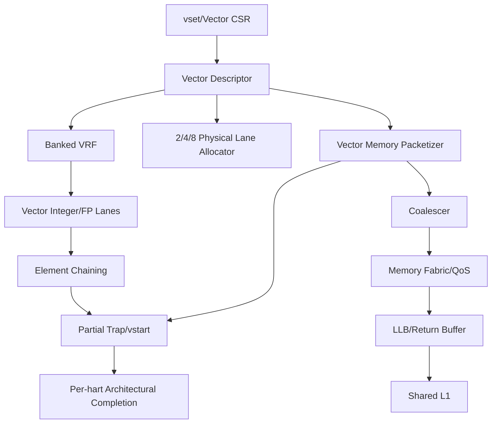

# 第4阶段：F/D、RVV、Lane Locality与Memory Coalescing

状态：**执行指南，不是已完成实现**。本分阶段文件供多人并行分配；所有命令、文件、测试和结果都必须等对应任务实现后产生。任何“完成”必须能引用真实 Git commit/artifact hash/日志，不凭口头状态。

## 1. 这个子系统是做什么的

完整声明的F/D与RVV能力、固定VLEN的物理lane配额、可证明freshness的LLB与语义等价coalescing。

## 2. 为什么存在 / 上游输入

- 上游输入：S0 profile、S1/S2/S3正确基线。
- 已有依赖：scalar/privilege/memory candidates、FPU、VRF、reference capability。
- 本阶段输出：性能收益、跨hart合并、完整多pod扩展。
- 首要原则：p2只发布全部通过的能力；几个vector demo不能称full V。partial trap/vstart和LLB stale是最大正确性风险；lane数是吞吐资源不是ISA宽度。

FPU团队负责数值/flags；RVV控制团队负责descriptor/restart；VRF/lane团队管映射；vector LSU/MEF团队管packet/freshness/QoS；实验团队最后做ablation。

## 3. 总体结构

图中的箭头是数据/控制依赖；性能策略不得在正确性前打开。每个分支可以分给不同负责人，但跨接口字段以 [implementation-plan.md](implementation-plan.md) §1.3 和本文件任务卡为准，不能各团队私改。

## 4. 团队分工与进度追踪

| Team | 负责任务 | 当前状态 | Owner | 证据链接 | 下一动作 | Blocker |
|---|---|---|---|---|---|---|
| FPU负责人 | I-049 | Not started | 待定 | 待填 artifact/commit | 读取任务卡并建立输入锁 | 待填 |
| FP state负责人 | I-050 | Not started | 待定 | 待填 artifact/commit | 读取任务卡并建立输入锁 | 待填 |
| RVV负责人 | I-051 | Not started | 待定 | 待填 artifact/commit | 读取任务卡并建立输入锁 | 待填 |
| RVV配置负责人 | I-052 | Not started | 待定 | 待填 artifact/commit | 读取任务卡并建立输入锁 | 待填 |
| VRF负责人 | I-053 | Not started | 待定 | 待填 artifact/commit | 读取任务卡并建立输入锁 | 待填 |
| vector ALU负责人 | I-054 | Not started | 待定 | 待填 artifact/commit | 读取任务卡并建立输入锁 | 待填 |
| vector FP负责人 | I-055 | Not started | 待定 | 待填 artifact/commit | 读取任务卡并建立输入锁 | 待填 |
| vector LSU负责人 | I-056 | Not started | 待定 | 待填 artifact/commit | 读取任务卡并建立输入锁 | 待填 |
| vector recovery负责人 | I-057 | Not started | 待定 | 待填 artifact/commit | 读取任务卡并建立输入锁 | 待填 |
| vector chaining负责人 | I-058 | Not started | 待定 | 待填 artifact/commit | 读取任务卡并建立输入锁 | 待填 |
| lane broker负责人 | I-059 | Not started | 待定 | 待填 artifact/commit | 读取任务卡并建立输入锁 | 待填 |
| LLB负责人 | I-060 | Not started | 待定 | 待填 artifact/commit | 读取任务卡并建立输入锁 | 待填 |
| coalescer负责人 | I-061 | Not started | 待定 | 待填 artifact/commit | 读取任务卡并建立输入锁 | 待填 |
| MEF负责人 | I-062 | Not started | 待定 | 待填 artifact/commit | 读取任务卡并建立输入锁 | 待填 |
| locality predictor负责人 | I-063 | Not started | 待定 | 待填 artifact/commit | 读取任务卡并建立输入锁 | 待填 |
| 扩展验证负责人 | V-050 | Not started | 待定 | 待填 artifact/commit | 读取任务卡并建立输入锁 | 待填 |
| 扩展验证负责人 | V-051 | Not started | 待定 | 待填 artifact/commit | 读取任务卡并建立输入锁 | 待填 |
| 扩展验证负责人 | V-052 | Not started | 待定 | 待填 artifact/commit | 读取任务卡并建立输入锁 | 待填 |
| 扩展验证负责人 | V-053 | Not started | 待定 | 待填 artifact/commit | 读取任务卡并建立输入锁 | 待填 |
| 扩展验证负责人 | V-054 | Not started | 待定 | 待填 artifact/commit | 读取任务卡并建立输入锁 | 待填 |
| 扩展验证负责人 | V-055 | Not started | 待定 | 待填 artifact/commit | 读取任务卡并建立输入锁 | 待填 |
| 扩展验证负责人 | V-056 | Not started | 待定 | 待填 artifact/commit | 读取任务卡并建立输入锁 | 待填 |
| 扩展验证负责人 | V-057 | Not started | 待定 | 待填 artifact/commit | 读取任务卡并建立输入锁 | 待填 |
| 扩展验证负责人 | V-058 | Not started | 待定 | 待填 artifact/commit | 读取任务卡并建立输入锁 | 待填 |
| 扩展验证负责人 | V-059 | Not started | 待定 | 待填 artifact/commit | 读取任务卡并建立输入锁 | 待填 |
| 扩展验证负责人 | V-060 | Not started | 待定 | 待填 artifact/commit | 读取任务卡并建立输入锁 | 待填 |
| 扩展验证负责人 | V-061 | Not started | 待定 | 待填 artifact/commit | 读取任务卡并建立输入锁 | 待填 |
| 扩展验证负责人 | V-062 | Not started | 待定 | 待填 artifact/commit | 读取任务卡并建立输入锁 | 待填 |
| 扩展验证负责人 | V-063 | Not started | 待定 | 待填 artifact/commit | 读取任务卡并建立输入锁 | 待填 |
| 多hart验证负责人 | V-076 | Not started | 待定 | 待填 artifact/commit | 读取任务卡并建立输入锁 | 待填 |
| 多hart验证负责人 | V-078 | Not started | 待定 | 待填 artifact/commit | 读取任务卡并建立输入锁 | 待填 |
| 多hart验证负责人 | V-080 | Not started | 待定 | 待填 artifact/commit | 读取任务卡并建立输入锁 | 待填 |

状态只能取 `Not started / Inputs locked / In progress / Blocked / Evidence complete / Accepted`。Accepted 需要阶段负责人和验证负责人同时签字；Blocked 必须写最小外部事实、影响范围、请求对象和下一日期，不写“快好了”。

## 5. 可跟踪任务卡

每张卡含实现接口、数据、设计取舍、步骤、交接、验证和回退。完成定义：对应 `Pass` 全部有直接证据，相关负控制也工作；不是“代码写完”或“仿真曾跑过”。

### I-049 — 选择并封装 F/D 运算实现

- **负责/门禁**：FPU负责人；F/D实现选择。
- **前置依赖**：I-001, I-025；仍受 implementation-plan 集成依赖表约束。
- **做什么**：对候选开源 FPU 或自实现做许可证与语义审计，封装标准 tagged handshake；软件 softfloat 只能做 oracle，不能替代硬件 datapath。
- **输入数据/接口**：license、operations、latency、rounding/NaN
- **输出与交接**：FPU adapter、capability matrix
- **设计取舍**：复用经审计开源或自研，不用softfloat冒充硬件
- **实现微步骤**：列全部F/D operation需求；评估候选实现的语义与许可；封装标准tagged handshake；验证rounding/denormal/NaN路径；综合资源/时序反馈；由V-050复核；无合法路径则阻断F/D广告。
- **主要阻塞风险**：license、subnormal/NaN、后台回退；阻断规则：不支持指令静默软件回退却宣称硬件 F/D 完整。
- **验收证据**：所有 F/D operations 有真实 implementation path、明确 latency/backpressure 和 license 来源。；验证口径：directed FP + license audit
- **失败/回退动作**：F/D deferred
- **来源覆盖**：FP datapath, reuse, licensing。；来源 IR-001, validation-plan.md。
- **进度日志**：2026-09-29 规划生成——未开始；后续每次状态变化追加日期、commit/artifact、证据和下一步。

### I-050 — 实现 FP rename/state/fflags 精确提交

- **负责/门禁**：FP state负责人；FFlags/NaN-boxing精确。
- **前置依赖**：I-049, I-017, I-019；仍受 implementation-plan 集成依赖表约束。
- **做什么**：扩展 rename/commit 到 FP，speculative fflags 在 commit 合并；测试 rounding modes、sNaN/qNaN、subnormal、signed zero、conversion overflow。
- **输入数据/接口**：FP PRF、frm/fflags、conversion、NaN boxing
- **输出与交接**：FP state control
- **设计取舍**：speculative flags只在commit合并
- **实现微步骤**：扩展rename/commit至FP regs；实现fcsr read/write/suppression；每operation捕获local flags；commit顺序合并flags；测试NaN/signed zero/subnormal；覆盖长延迟kill；由V-050/V-051验收。
- **主要阻塞风险**：wrong-path flags、host近似、NaN payload错；阻断规则：只数值近似相等就通过，或 FPU done 立即写 architectural fflags。
- **验收证据**：被 squash 的 FP operation 不改变 flags；F/D bits 与规范允许的 NaN 处理一致。；验证口径：bit/flags precise suites
- **失败/回退动作**：禁动态frm写入
- **来源覆盖**：F/D precise state, numerical edge cases。；来源 IR-001, validation-plan.md。
- **进度日志**：2026-09-29 规划生成——未开始；后续每次状态变化追加日期、commit/artifact、证据和下一步。

### I-051 — 冻结 RVV descriptor 与 profile

- **负责/门禁**：RVV负责人；V descriptor冻结。
- **前置依赖**：I-050, I-016；仍受 implementation-plan 集成依赖表约束。
- **做什么**：列出每类 instruction 的 EEW/EMUL/LMUL/SEW/register overlap/legal config；descriptor 保存 macro identity/element bitmap/fault progress，不给每 element 分配独立 ROB。
- **输入数据/接口**：VLEN/ELEN、SEW/LMUL/EEW/EMUL、groups、descriptor
- **输出与交接**：V profile and descriptor contract
- **设计取舍**：完整宣称矩阵先行，physical lanes不改VLEN
- **实现微步骤**：固定VLEN/ELEN和依赖扩展；列所有instruction families/legal configs；定义descriptor identity/progress/fault；定义v0/group overlap规则；生成capacity/queue bounds；未实现行显式deferred；由V-052验收。
- **主要阻塞风险**：只实现子集称full V、group overlap、运行中改vlenb；阻断规则：动态 lane 数偷偷改变 VLEN，或 incomplete V subset 宣称 full V。
- **验收证据**：每种合法/非法组合有确定处理和用例；运行 lane 数变化不改变 hart 的 VLEN/architectural state。；验证口径：legality matrix、state width
- **失败/回退动作**：禁V广告
- **来源覆盖**：RVV first-class fabric, macro expansion。；来源 IR-001, architecture-review.md。
- **进度日志**：2026-09-29 规划生成——未开始；后续每次状态变化追加日期、commit/artifact、证据和下一步。

### I-052 — 实现 vsetvl/vsetvli/vsetivli 与 vector CSRs

- **负责/门禁**：RVV配置负责人；vset/CSR正确。
- **前置依赖**：I-051, I-019；仍受 implementation-plan 集成依赖表约束。
- **做什么**：decode/execute 配置指令；测试 AVL 各区间、unsupported vtype、rd/rs1 特例、CSR 权限与上下文保存。
- **输入数据/接口**：vsetvl/vsetvli/vsetivli、vtype/vl/vstart/vill
- **输出与交接**：vector config unit
- **设计取舍**：合法vl选择固定可重放，但不强迫所有实现同一合法值
- **实现微步骤**：实现AVL区间和rd/rs1特例；实现vtype编码/vill；保存每instruction配置快照；处理VS权限/context；覆盖vstart非零/reset；由V-053验收；接入reference state。
- **主要阻塞风险**：非法vtype执行、replay使用新vtype、vstart规则混；阻断规则：replay 后使用较新 vtype，或 vill 未阻止非法执行。
- **验收证据**：vl 的规范允许选择固定可重现，后续指令 descriptor 获得正确配置快照。；验证口径：vset boundaries、reference
- **失败/回退动作**：禁V配置指令
- **来源覆盖**：RVV configuration, speculative context。；来源 IR-001, validation-plan.md。
- **进度日志**：2026-09-29 规划生成——未开始；后续每次状态变化追加日期、commit/artifact、证据和下一步。

### I-053 — 实现 banked VRF 与 lane 映射

- **负责/门禁**：VRF负责人；element/bank映射。
- **前置依赖**：I-051, I-006；仍受 implementation-plan 集成依赖表约束。
- **做什么**：定义固定 logical-element→bank/lane 映射及冲突仲裁；测试 fractional/integer LMUL、group overlap、wide operands、端口不足。
- **输入数据/接口**：32 vector regs、lanes、LMUL、mask、EEW
- **输出与交接**：VRF banks
- **设计取舍**：固定logical-to-physical映射，lane配额改吞吐不改布局
- **实现微步骤**：定义element→bank/lane mapping；实现VRF synchronous read/write；处理register groups/alias；收集多source与mask版本；覆盖LMUL fractions/overlap；lane数参数化；由V-054复核。
- **主要阻塞风险**：fractional LMUL、source overwrite、平台读延迟；阻断规则：lane resize 后 element 重排丢失或 VRF read latency 在平台间变化未处理。
- **验收证据**：同一 logical vector 在不同 lane 数实现上读写一致；mask/source overlap 不覆盖尚未读取元素。；验证口径：mapping alias matrix
- **失败/回退动作**：减少并行lane但固定映射
- **来源覆盖**：lane scalability, vector operand lifetime。；来源 IR-001, architecture-review.md, platform-plan.md。
- **进度日志**：2026-09-29 规划生成——未开始；后续每次状态变化追加日期、commit/artifact、证据和下一步。

### I-054 — 实现 vector integer/mask/permute/reduction

- **负责/门禁**：vector ALU负责人；整数/mask/permutation语义。
- **前置依赖**：I-052, I-053, I-025；仍受 implementation-plan 集成依赖表约束。
- **做什么**：分 operation family 实现 packet execution；包括 widening/narrowing、saturation、slide/gather/compress、mask 与 reduction，逐类 capability gating。
- **输入数据/接口**：arithmetic/saturation、mask、slide/gather/compress、reduction
- **输出与交接**：vector integer lanes
- **设计取舍**：逐family验收，不用少数opcode凑数
- **实现微步骤**：按family实现arithmetic/logic/shift；实现mask/tail/undisturbed规则；实现saturation/rounding flags；实现permute/reduction合法顺序；跨SEW/LMUL/mask矩阵；由V-054/V-055验收；deferred family阻断p2。
- **主要阻塞风险**：inactive异常、carry/lane分配、reduction顺序；阻断规则：只实现 vadd/vmul 就宣称 V 完成，或 masked-off 元素发起异常访问。
- **验收证据**：每个声明 family 的边界/重叠/masked-off 元素行为通过 V suite，未完成 family 不进入 p2 gate。；验证口径：element-wise rules
- **失败/回退动作**：内部子集不广告V
- **来源覆盖**：complete declared RVV integer semantics。；来源 IR-001, validation-plan.md。
- **进度日志**：2026-09-29 规划生成——未开始；后续每次状态变化追加日期、commit/artifact、证据和下一步。

### I-055 — 实现 vector FP 与逐元素异常标志

- **负责/门禁**：vector FP负责人；vector FP精确。
- **前置依赖**：I-054, I-050；仍受 implementation-plan 集成依赖表约束。
- **做什么**：复用受测 FPU handshake；按 active elements 汇总 flags；测试 masked sNaN、转换、widening、reduction 合法结果规则。
- **输入数据/接口**：active flags、rounding、ordered/unordered reductions
- **输出与交接**：vector FP path
- **设计取舍**：复用已验FPU，flags逐active element
- **实现微步骤**：把FPU接入vector lanes；按active element收集flags；实现ordered reduction顺序；定义unordered合法集合/关系；测mask sNaN/转换/widen；由V-055/V-058复核；保留FP状态隔离。
- **主要阻塞风险**：inactive污染flags、unordered结果误判、NaN；阻断规则：把 vector FP 顺序任意改变到规范不允许的结果。
- **验收证据**：不活跃元素不污染 flags；确定性与规范允许差异由 comparator 显式处理而非粗略浮点容差。；验证口径：flags/reduction suites
- **失败/回退动作**：vector FP子集不宣称full V
- **来源覆盖**：RVV FP, precise flags。；来源 IR-001, validation-plan.md。
- **进度日志**：2026-09-29 规划生成——未开始；后续每次状态变化追加日期、commit/artifact、证据和下一步。

### I-056 — 实现 vector memory packetizer

- **负责/门禁**：vector LSU负责人；vector memory packet。
- **前置依赖**：I-054, I-043, I-046；仍受 implementation-plan 集成依赖表约束。
- **做什么**：每 element 保留 logical index、地址、byte mask、fault ownership；先无 coalescing 的正确路径，再生成 line requests；测试跨 page/line/权限边界。
- **输入数据/接口**：unit/strided/indexed/segmented/whole-register、permissions
- **输出与交接**：vector LSU descriptors
- **设计取舍**：先无合并正确路径，再coalesce
- **实现微步骤**：生成每element address/mask/identity；按指令族处理ordering；接入translation/PMA/permissions；处理跨line/page；先逐项事务，后line packet；返回保留element关系；由V-056验收。
- **主要阻塞风险**：跨权限合并、element fault丢失、ordered index破坏；阻断规则：一次 line merge 跨越不等价 permissions/MMIO，或漏实现 segment/whole-register 模式仍通告 V。
- **验收证据**：每活跃 element 的地址/数据/异常属于正确 macro，ordered-indexed 的顺序要求不被网络破坏。；验证口径：memory mode matrix
- **失败/回退动作**：禁复杂vector memory子集
- **来源覆盖**：vector memory, packetization。；来源 IR-001, architecture-review.md。
- **进度日志**：2026-09-29 规划生成——未开始；后续每次状态变化追加日期、commit/artifact、证据和下一步。

### I-057 — 实现 vector partial trap、vstart 与 FOF

- **负责/门禁**：vector recovery负责人；partial trap/FOF/vstart。
- **前置依赖**：I-056, I-019；仍受 implementation-plan 集成依赖表约束。
- **做什么**：在每个合法 element boundary 注入 page/access fault 与 interrupt；保存允许的部分状态，恢复重执行；覆盖 FOF 首元素 fault 与后续 fault/vl 缩短。
- **输入数据/接口**：element progress、epc/vstart、FOF、partial stores
- **输出与交接**：vector restart controller
- **设计取舍**：先prefix-only，最保守合法
- **实现微步骤**：记录连续prefix和element bitmap；fault时选择允许状态/边界；设置epc/vstart/vl规则；修复后从同instruction恢复；区分FOF element0/later/masked；覆盖每packet边界；由V-057/V-058验收。
- **主要阻塞风险**：全指令原子错误、重复side effect、FOF首元素规则；阻断规则：把整个 vector instruction 当标量原子事务，或仅最后 packet 到达便退休。
- **验收证据**：已发生的合法 store/element 更新不被伪回滚，重启不重复不可逆副作用，trap/vstart/vl 与 spec 一致。；验证口径：partial fault matrix
- **失败/回退动作**：禁V直到重启正确
- **来源覆盖**：RVV precise exception refinement, restart。；来源 IR-001, architecture-review.md, validation-plan.md。
- **进度日志**：2026-09-29 规划生成——未开始；后续每次状态变化追加日期、commit/artifact、证据和下一步。

### I-058 — 实现 vector chaining 与执行-提交解耦

- **负责/门禁**：vector chaining负责人；元素级依赖。
- **前置依赖**：I-057, I-026；仍受 implementation-plan 集成依赖表约束。
- **做什么**：逐 element forwarding/readiness，先安全 no-chaining 对照；对 source-before-write 与 instruction cancellation 运行 CASE=rvv.chaining_hazards。
- **输入数据/接口**：element ready、producer lifetime、packet rollback
- **输出与交接**：vector chaining network
- **设计取舍**：先no-chaining，后受控forwarding
- **实现微步骤**：跟踪每个element producer/generation；consumer只读已完成合法元素；fault/kill传播给dependent packets；保留mask/source lifetime；乱序packet stress；由V-059复核；对照no-chain。
- **主要阻塞风险**：partial producer fault、stale packet、v0 alias；阻断规则：宏级 ready 位掩盖元素级依赖，或错误路径 packet 被新 descriptor 接收。
- **验收证据**：开关 chaining 的 defined architectural state 一致；WAR 源还未读完不能因其他 lane 完成而释放。；验证口径：hazard/rollback suites
- **失败/回退动作**：禁用chaining
- **来源覆盖**：sustained vector throughput, operand lifetime。；来源 IR-002, IR-003, architecture-review.md。
- **进度日志**：2026-09-29 规划生成——未开始；后续每次状态变化追加日期、commit/artifact、证据和下一步。

### I-059 — 实现运行时 lane 配额重分配

- **负责/门禁**：lane broker负责人；运行时lane配额。
- **前置依赖**：I-058, I-031；仍受 implementation-plan 集成依赖表约束。
- **做什么**：先在 vector instruction boundary drain 后切换 2/4/8 lane 资源份额；中途 packet migration 另列实验，不默认支持。
- **输入数据/接口**：2/4/8 lanes、ownership generation、drain boundary
- **输出与交接**：lane reallocation FSM
- **设计取舍**：先在instruction boundary切换，再live migration
- **实现微步骤**：记录active descriptor progress；冻结新vector dispatch；drain/结算旧lane packets；发布新lane ownership generation；恢复后续elements；同ELF多配置对照；由V-060验收。
- **主要阻塞风险**：丢element、VLEN变化、mask/vstart迁移；阻断规则：把 “lane 关闭”解释为丢弃剩余 element 或改变 visible vl/VLEN。
- **验收证据**：单 workload×8 与两个 workload×4 等配置的各自输出相同；旧 lane state 清理/转移有 ack。；验证口径：metamorphic configs
- **失败/回退动作**：禁运行中lane切换
- **来源覆盖**：dynamic RVV aggregation, resource leasing。；来源 SRC-03, architecture-review.md。
- **进度日志**：2026-09-29 规划生成——未开始；后续每次状态变化追加日期、commit/artifact、证据和下一步。

### I-060 — 实现严格受限的 LLB

- **负责/门禁**：LLB负责人；lane-local freshness。
- **前置依赖**：I-056, I-042, I-046；仍受 implementation-plan 集成依赖表约束。
- **做什么**：初始只在不可变/明确只读区域或有完整 invalidation 协议的 normal RAM 启用；MMIO/atomic bypass；处理 store/refill/snoop/fence/context change。
- **输入数据/接口**：LLB entries、PA/version/permission、invalidation
- **输出与交接**：LLB modes and protocol
- **设计取舍**：初始只同transaction return，后新load L0
- **实现微步骤**：实现return buffer作为基础；为新-load LLB建立L1授权/invalidation；绑定PA/permissions/owner；处理hit/invalidate同拍；覆盖lane reassignment/DMA；由V-061验收；默认关闭模式2。
- **主要阻塞风险**：clean副本stale、DMA/ASID、version wrap；阻断规则：以“clean/nonarchitectural”名义免除一致性责任。
- **验收证据**：concurrent writer/alias/ASID 切换后不得返回 stale value；invalidations 与 in-flight hits 的序列规则可证明。；验证口径：freshness race matrix
- **失败/回退动作**：只保留return buffer
- **来源覆盖**：lane-local memory, coherence correctness。；来源 SRC-03, architecture-review.md。
- **进度日志**：2026-09-29 规划生成——未开始；后续每次状态变化追加日期、commit/artifact、证据和下一步。

### I-061 — 实现同 hart line coalescing

- **负责/门禁**：coalescer负责人；语义等价合并。
- **前置依赖**：I-056, I-060；仍受 implementation-plan 集成依赖表约束。
- **做什么**：仅合并语义等价 normal-memory requests；返回保留各 element masks/faults；store 合并必须处理 same-address ordering；运行 CASE=coalesce.element_faults。
- **输入数据/接口**：line grouping、byte masks、permissions、faults
- **输出与交接**：coalescer/distributor
- **设计取舍**：先同hart ordinary loads，再受限cross-hart
- **实现微步骤**：按PA line/attribute匹配请求；保留每request mask/fault/consumer；禁止AMO/MMIO/不兼容order合并；返回分发且不丢consumer；重复地址store独立规则；由V-062/V-070验收；记录transaction reduction。
- **主要阻塞风险**：跨MMIO/权限、重复地址store、丢fault；阻断规则：隐藏每个 element 必需的访问检查或把 atomic/MMIO 合并。
- **验收证据**：coalesced/uncoalesced 下所有 defined values/faults 一致，重复地址 store 的规则来自指令类型而非 lane 编号臆断。；验证口径：merge equivalence matrix
- **失败/回退动作**：全请求不合并
- **来源覆盖**：memory coalescing, vector semantics。；来源 IR-001, architecture-review.md。
- **进度日志**：2026-09-29 规划生成——未开始；后续每次状态变化追加日期、commit/artifact、证据和下一步。

### I-062 — 实现 criticality/QoS memory 仲裁

- **负责/门禁**：MEF负责人；内存QoS。
- **前置依赖**：I-061, I-030；仍受 implementation-plan 集成依赖表约束。
- **做什么**：采用 age-based escape + scalar reservation + bulk 配额；测试 scalar chain 与持续 streaming 的混合压力，记录 p50/p99 latency。
- **输入数据/接口**：address/transaction/criticality、aging、bulk/scalar
- **输出与交接**：memory scheduler
- **设计取舍**：critical优先+aging，避免双方饥饿
- **实现微步骤**：为请求分类latency/throughput/prefetch；实现age escalation和reserved service；接入bank/return backpressure；运行持续bulk+critical压力；计算并验证服务上界；由V-063复核；不修改ordering。
- **主要阻塞风险**：bulk被吞、prefetch抢占、QoS改语义；阻断规则：scalar 永久抢占 bulk，或 performance policy 改变 memory ordering。
- **验收证据**：各类在声明的 service assumptions 下满足 finite progress bound；数据结果不受优先级影响。；验证口径：progress/latency suites
- **失败/回退动作**：静态配额
- **来源覆盖**：CPU/GPU coexistence, latency versus throughput。；来源 SRC-03, architecture-review.md。
- **进度日志**：2026-09-29 规划生成——未开始；后续每次状态变化追加日期、commit/artifact、证据和下一步。

### I-063 — 实现 reuse predictor 与可关闭预取

- **负责/门禁**：locality predictor负责人；可关闭预测。
- **前置依赖**：I-062；仍受 implementation-plan 集成依赖表约束。
- **做什么**：先记录 PC/stride/reuse 特征再启用有限 prefetch；predicted path 不绕过权限与 alias；运行 CASE=prefetch.fault_and_pollution。
- **输入数据/接口**：PC/reuse/stride、prefetch、usefulness counters
- **输出与交接**：locality predictor
- **设计取舍**：预测仅性能，fallback绝不绕过检查
- **实现微步骤**：收集PC/stride/reuse特征；实现有界prefetch queue；预取仍检查permission/PMA；记录有用/无用/取消；on/off/cold/warm对照；由V-063/V-076复核；负收益不默认开启。
- **主要阻塞风险**：错误fault/device read、污染、把命中当能耗；阻断规则：以命中率提高直接推断能耗收益，或 predictor 成为正确性唯一来源。
- **验收证据**：错预测只增加延迟/流量，不引入 architectural fault或不可逆 device read；报告有用/无用/取消请求。；验证口径：fault/pollution suites
- **失败/回退动作**：禁用预测
- **来源覆盖**：execution/memory locality prediction, hypothesis testing。；来源 SRC-03, IR-002。
- **进度日志**：2026-09-29 规划生成——未开始；后续每次状态变化追加日期、commit/artifact、证据和下一步。

### V-050 — 验收 F/D 数值与舍入

- **负责/门禁**：扩展验证负责人；验证证据闭合。
- **前置依赖**：V-025, V-043；仍受 implementation-plan 集成依赖表约束。
- **做什么**：覆盖 ±0、subnormal、±∞、qNaN/sNaN、NaN-boxing、五种合法 rounding mode、动态 frm、FMA 非融合对照、转换边界、比较/min/max；D 前确保 F 依赖。
- **输入数据/接口**：F/D 实现里程碑、256-case FP 清单、参考 FP 配置。
- **输出与交接**：数值/flags/rounding 功能矩阵。
- **设计取舍**：有限集合/模型边界明确，不用样本数冒充形式证明
- **实现微步骤**：冻结该任务输入、版本与capability交集；展开有限case/seed/budget manifest；实现真实检查器并接入负控制；执行正控制和故障注入；闭合计划/执行/通过/失败/unsupported计数；最小化失败并建立replay；阶段负责人签收或阻断后续gate。
- **主要阻塞风险**：静默skip、mock echo、空覆盖率、把deferred当成功；阻断规则：使用 host double 默认舍入当全部 oracle、FTZ 偷改语义、只比较近似误差不比较 architectural bits/fflags。
- **验收证据**：确定结果与 IEEE/RISC-V 指定行为一致，合法 NaN 选择按精确规则比较；所有必需操作有定向与 ACT 证据。；验证口径：确定结果与 IEEE/RISC-V 指定行为一致，合法 NaN 选择按精确规则比较；所有必需操作有定向与 ACT 证据。
- **失败/回退动作**：使用 host double 默认舍入当全部 oracle、FTZ 偷改语义、只比较近似误差不比较 architectural bits/fflags。
- **来源覆盖**：SRC-03 §FP/FMA slices、§共享 datapath。；来源 VR-006, VR-007, VR-012。
- **进度日志**：2026-09-29 规划生成——未开始；后续每次状态变化追加日期、commit/artifact、证据和下一步。

### V-051 — 验收 FP 状态、异常与共享隔离

- **负责/门禁**：扩展验证负责人；验证证据闭合。
- **前置依赖**：V-050, V-017；仍受 implementation-plan 集成依赖表约束。
- **做什么**：交错两种 rounding context、fs=Off、sticky fflags、异常/flush 中的长延迟 FP；测试 CSR 写与 FP 完成同周期顺序。
- **输入数据/接口**：fcsr/FS/context save-restore、共享 FPU 调度。
- **输出与交接**：每 hart FP state 与 event trace。
- **设计取舍**：有限集合/模型边界明确，不用样本数冒充形式证明
- **实现微步骤**：冻结该任务输入、版本与capability交集；展开有限case/seed/budget manifest；实现真实检查器并接入负控制；执行正控制和故障注入；闭合计划/执行/通过/失败/unsupported计数；最小化失败并建立replay；阶段负责人签收或阻断后续gate。
- **主要阻塞风险**：静默skip、mock echo、空覆盖率、把deferred当成功；阻断规则：跨 hart frm 串扰、错误路径累计 flags、CSR 更新顺序取决于物理完成。
- **验收证据**：fflags/frm/FS 归属准确、被取消 FP 不更新 architectural flags，allowed Dirty 关系不屏蔽数值错误。；验证口径：fflags/frm/FS 归属准确、被取消 FP 不更新 architectural flags，allowed Dirty 关系不屏蔽数值错误。
- **失败/回退动作**：跨 hart frm 串扰、错误路径累计 flags、CSR 更新顺序取决于物理完成。
- **来源覆盖**：SRC-03 §Execution resources shared retirement local。；来源 VR-003, VR-007, VR-012。
- **进度日志**：2026-09-29 规划生成——未开始；后续每次状态变化追加日期、commit/artifact、证据和下一步。

### V-052 — 冻结 V 完整能力与宽状态传输

- **负责/门禁**：扩展验证负责人；验证证据闭合。
- **前置依赖**：V-002, V-008, V-050, V-051；仍受 implementation-plan 集成依赖表约束。
- **做什么**：固定每 hart VLEN/ELEN、完整 V 所需 F/D 等依赖与全部指令覆盖表；验证所有 vector bits 的参考传输，超过冻结 Difftest 128-bit 形状时先完成适配器扩展校准。
- **输入数据/接口**：V 实现里程碑、VLEN/ELEN/LMUL 能力、必需指令列表。
- **输出与交接**：V capability manifest 与高位负控制证据。
- **设计取舍**：有限集合/模型边界明确，不用样本数冒充形式证明
- **实现微步骤**：冻结该任务输入、版本与capability交集；展开有限case/seed/budget manifest；实现真实检查器并接入负控制；执行正控制和故障注入；闭合计划/执行/通过/失败/unsupported计数；最小化失败并建立replay；阶段负责人签收或阻断后续gate。
- **主要阻塞风险**：静默skip、mock echo、空覆盖率、把deferred当成功；阻断规则：只实现 vadd 就广告 RVV、默认任何 NEMU 构建支持任意 VLEN、忽略高位、把 lane 数写成 VLEN。
- **验收证据**：全 32 个 vector register 的完整 VLEN 均可比较；lane 数变化不改 vlenb；未完成完整 V 只能称明确子集实验。；验证口径：全 32 个 vector register 的完整 VLEN 均可比较；lane 数变化不改 vlenb；未完成完整 V 只能称明确子集实验。
- **失败/回退动作**：只实现 vadd 就广告 RVV、默认任何 NEMU 构建支持任意 VLEN、忽略高位、把 lane 数写成 VLEN。
- **来源覆盖**：SRC-03 §RVV 第一等公民、§runtime lane aggregation。；来源 VR-003, VR-005, VR-007, VR-013。
- **进度日志**：2026-09-29 规划生成——未开始；后续每次状态变化追加日期、commit/artifact、证据和下一步。

### V-053 — 验证 vset、vl/vtype 与重启入口

- **负责/门禁**：扩展验证负责人；验证证据闭合。
- **前置依赖**：V-052；仍受 implementation-plan 集成依赖表约束。
- **做什么**：覆盖 AVL=0/1/VLMAX−1/VLMAX/VLMAX+1/2VLMAX−1/2VLMAX、rd/rs1 零组合、各合法/非法 SEW/LMUL、vill、vstart 非零与 VS=Off。
- **输入数据/接口**：V 512-case 清单配置子集、vector CSR 实现。
- **输出与交接**：vl 选择合法区间、vtype/vstart/异常状态表。
- **设计取舍**：有限集合/模型边界明确，不用样本数冒充形式证明
- **实现微步骤**：冻结该任务输入、版本与capability交集；展开有限case/seed/budget manifest；实现真实检查器并接入负控制；执行正控制和故障注入；闭合计划/执行/通过/失败/unsupported计数；最小化失败并建立replay；阶段负责人签收或阻断后续gate。
- **主要阻塞风险**：静默skip、mock echo、空覆盖率、把deferred当成功；阻断规则：以参考某个合法 vl 选择强迫所有实现完全相同、非法配置静默当 m1、配置动作更改 architectural VLEN。
- **验收证据**：选择满足规范并在同配置要求下可重放；非法 vtype 按 vill/vl 规则；vstart 重置/保留符合指令规定。；验证口径：选择满足规范并在同配置要求下可重放；非法 vtype 按 vill/vl 规则；vstart 重置/保留符合指令规定。
- **失败/回退动作**：以参考某个合法 vl 选择强迫所有实现完全相同、非法配置静默当 m1、配置动作更改 architectural VLEN。
- **来源覆盖**：SRC-03 §VectorDescriptor 中 vl/sew/mask、§RVV lane allocation。；来源 VR-007, VR-013。
- **进度日志**：2026-09-29 规划生成——未开始；后续每次状态变化追加日期、commit/artifact、证据和下一步。

### V-054 — 验证 RVV 算术、mask 与 tail

- **负责/门禁**：扩展验证负责人；验证证据闭合。
- **前置依赖**：V-053, V-023；仍受 implementation-plan 集成依赖表约束。
- **做什么**：交叉 SEW/合法 LMUL、vl=0/短/满、四种 vta/vma、全零/全一/交替/单 bit mask；测 v0 alias、prestart、saturation/vxrm/vxsat，并对非法 agnostic 值注入故障。
- **输入数据/接口**：V 清单算术/固定点子集、逐元素合法关系比较器。
- **输出与交接**：active/inactive/tail/prestart 分区逐元素结果。
- **设计取舍**：有限集合/模型边界明确，不用样本数冒充形式证明
- **实现微步骤**：冻结该任务输入、版本与capability交集；展开有限case/seed/budget manifest；实现真实检查器并接入负控制；执行正控制和故障注入；闭合计划/执行/通过/失败/unsupported计数；最小化失败并建立replay；阶段负责人签收或阻断后续gate。
- **主要阻塞风险**：静默skip、mock echo、空覆盖率、把deferred当成功；阻断规则：inactive 全不比较、vl=0 仍改 tail、v0 位顺序错误、以“vector 宏提交”跳过 element 结果。
- **验收证据**：active 值准确，tu/mu/prestart 保留，agnostic 仅接受规范允许值；无效元素不产生 memory fault；flags 正确。；验证口径：active 值准确，tu/mu/prestart 保留，agnostic 仅接受规范允许值；无效元素不产生 memory fault；flags 正确。
- **失败/回退动作**：inactive 全不比较、vl=0 仍改 tail、v0 位顺序错误、以“vector 宏提交”跳过 element 结果。
- **来源覆盖**：SRC-03 §Vector Macro-uOP、§packet completion semantics。；来源 VR-013。
- **进度日志**：2026-09-29 规划生成——未开始；后续每次状态变化追加日期、commit/artifact、证据和下一步。

### V-055 — 验证跨 lane 排列、归约与重叠

- **负责/门禁**：扩展验证负责人；验证证据闭合。
- **前置依赖**：V-054；仍受 implementation-plan 集成依赖表约束。
- **做什么**：覆盖 slide/gather/compress、mask 生成、整数/FP reduction、widen/narrow 的 EEW/EMUL 与寄存器重叠限制；验证有序 FP reduction 与无序 reduction 的不同合法性关系。
- **输入数据/接口**：V 清单 permutation/reduction/widen/narrow 子集。
- **输出与交接**：跨 lane 数据映射及合法结果集合检查。
- **设计取舍**：有限集合/模型边界明确，不用样本数冒充形式证明
- **实现微步骤**：冻结该任务输入、版本与capability交集；展开有限case/seed/budget manifest；实现真实检查器并接入负控制；执行正控制和故障注入；闭合计划/执行/通过/失败/unsupported计数；最小化失败并建立replay；阶段负责人签收或阻断后续gate。
- **主要阻塞风险**：静默skip、mock echo、空覆盖率、把deferred当成功；阻断规则：动态 lane 分配丢 carry/排列、mask tail 普通化、非零 vstart 对不支持重启的指令被随意接受。
- **验收证据**：index 边界与 illegal overlap 正确，ordered reduction 顺序精确；unordered 不被错误要求与另一树 bitwise 相同但仍满足规范算法约束。；验证口径：index 边界与 illegal overlap 正确，ordered reduction 顺序精确；unordered 不被错误要求与另一树 bitwise 相同但仍满足规范算法约束。
- **失败/回退动作**：动态 lane 分配丢 carry/排列、mask tail 普通化、非零 vstart 对不支持重启的指令被随意接受。
- **来源覆盖**：SRC-03 §lane groups、§chaining/forwarding、§shared ALU/FMA。；来源 VR-007, VR-013。
- **进度日志**：2026-09-29 规划生成——未开始；后续每次状态变化追加日期、commit/artifact、证据和下一步。

### V-056 — 验证 vector memory packet 与权限

- **负责/门禁**：扩展验证负责人；验证证据闭合。
- **前置依赖**：V-048, V-054；仍受 implementation-plan 集成依赖表约束。
- **做什么**：覆盖正/负/零 stride、ordered/unordered index、重复地址、跨 line/page、EEW≠SEW、EMUL 边界与 masked-off 无效地址；逐 element/segment 保留原始事务对应关系。
- **输入数据/接口**：V 清单 unit/strided/indexed/segment/whole-register/mask memory 子集、MEF packetizer。
- **输出与交接**：instruction→element→memory transaction→result 的可逆映射。
- **设计取舍**：有限集合/模型边界明确，不用样本数冒充形式证明
- **实现微步骤**：冻结该任务输入、版本与capability交集；展开有限case/seed/budget manifest；实现真实检查器并接入负控制；执行正控制和故障注入；闭合计划/执行/通过/失败/unsupported计数；最小化失败并建立replay；阶段负责人签收或阻断后续gate。
- **主要阻塞风险**：静默skip、mock echo、空覆盖率、把deferred当成功；阻断规则：coalescing 丢元素、误合跨权限请求、将 unordered 结果硬排成参考顺序或任意放行。
- **验收证据**：每 active 元素读取/写入其允许值，inactive/tail 不访问禁区；fault 归属正确；同址写入按该指令定义的顺序/无序范围检查。；验证口径：每 active 元素读取/写入其允许值，inactive/tail 不访问禁区；fault 归属正确；同址写入按该指令定义的顺序/无序范围检查。
- **失败/回退动作**：coalescing 丢元素、误合跨权限请求、将 unordered 结果硬排成参考顺序或任意放行。
- **来源覆盖**：SRC-03 §Memory Operation 也应该成为 Packet、§VectorDescriptor。；来源 VR-013, VR-014。
- **进度日志**：2026-09-29 规划生成——未开始；后续每次状态变化追加日期、commit/artifact、证据和下一步。

### V-057 — 验证 fault-only-first 的三种终局

- **负责/门禁**：扩展验证负责人；验证证据闭合。
- **前置依赖**：V-053, V-056；仍受 implementation-plan 集成依赖表约束。
- **做什么**：分别在元素 0、后续 active 元素、被 mask 元素和 segment 内 field 制造 fault；再无 fault 运行允许主动缩短 vl 的关系测试，及 IRQ 中断后恢复。
- **输入数据/接口**：FOF load 实现、可控 page/access fault 与 IRQ。
- **输出与交接**：FOF 的 trap/vl-trim/正常完成分类与部分写入证据。
- **设计取舍**：有限集合/模型边界明确，不用样本数冒充形式证明
- **实现微步骤**：冻结该任务输入、版本与capability交集；展开有限case/seed/budget manifest；实现真实检查器并接入负控制；执行正控制和故障注入；闭合计划/执行/通过/失败/unsupported计数；最小化失败并建立replay；阶段负责人签收或阻断后续gate。
- **主要阻塞风险**：静默skip、mock echo、空覆盖率、把deferred当成功；阻断规则：所有 fault 都 suppress、错把“首个 active 元素”普遍替代规范元素 0、vl=0 被当成功处理所有错误、非幂等访问可重做。
- **验收证据**：元素 0 同步 fault 保留 vl 并 trap；后续同步 fault 按规范截短 vl 不取同类 trap；mask 不造 fault；IRQ 与同步缩短分开处理，spurious writes 仅限允许范围。；验证口径：元素 0 同步 fault 保留 vl 并 trap；后续同步 fault 按规范截短 vl 不取同类 trap；mask 不造 fault；IRQ 与同步缩短分开处理，spurious writes 仅限允许范围。
- **失败/回退动作**：所有 fault 都 suppress、错把“首个 active 元素”普遍替代规范元素 0、vl=0 被当成功处理所有错误、非幂等访问可重做。
- **来源覆盖**：SRC-03 §RVV packet completion 的 ISA 例外修正。；来源 VR-013。
- **进度日志**：2026-09-29 规划生成——未开始；后续每次状态变化追加日期、commit/artifact、证据和下一步。

### V-058 — 验证部分完成、vstart 与精确重启

- **负责/门禁**：扩展验证负责人；验证证据闭合。
- **前置依赖**：V-014, V-056, V-057；仍受 implementation-plan 集成依赖表约束。
- **做什么**：在每个 packet 边界及 segment 中间触发可恢复 fault，检查 pre-vstart 已完成内容、epc/vstart、允许后续更新，修复 fault 后从同指令重启；追加不支持非零 vstart 的指令非法测试。
- **输入数据/接口**：vector partial-trap event、fault handler、可恢复页面映射。
- **输出与交接**：trap 前后及 restart 后 vector/memory 的三阶段证据。
- **设计取舍**：有限集合/模型边界明确，不用样本数冒充形式证明
- **实现微步骤**：冻结该任务输入、版本与capability交集；展开有限case/seed/budget manifest；实现真实检查器并接入负控制；执行正控制和故障注入；闭合计划/执行/通过/失败/unsupported计数；最小化失败并建立replay；阶段负责人签收或阻断后续gate。
- **主要阻塞风险**：静默skip、mock echo、空覆盖率、把deferred当成功；阻断规则：宣称 vector instruction 全有或全无、清空整个 destination 后重跑、丢失 vstart、借 mask 屏蔽 fault element 错误。
- **验收证据**：older 指令已提交、younger 无影响，完整重启结果符合规范；store/非幂等副作用不非法重复；合法部分状态没有被 reference 全指令 step 覆盖。；验证口径：older 指令已提交、younger 无影响，完整重启结果符合规范；store/非幂等副作用不非法重复；合法部分状态没有被 reference 全指令 step 覆盖。
- **失败/回退动作**：宣称 vector instruction 全有或全无、清空整个 destination 后重跑、丢失 vstart、借 mask 屏蔽 fault element 错误。
- **来源覆盖**：SRC-03 §一个 ROB Entry/VectorDescriptor、§precise vector completion 修正。；来源 VR-013。
- **进度日志**：2026-09-29 规划生成——未开始；后续每次状态变化追加日期、commit/artifact、证据和下一步。

### V-059 — 验证 vector chaining 与回滚隔离

- **负责/门禁**：扩展验证负责人；验证证据闭合。
- **前置依赖**：V-029, V-055, V-058；仍受 implementation-plan 集成依赖表约束。
- **做什么**：构造 producer-consumer 部分 forwarding、WAW、v0 dependency、packet 乱序返回；producer partial fault 或 branch squash 后晚到旧 packet，检验 consumer 禁止使用未定义数据。
- **输入数据/接口**：chaining/VRF rename 实现、completion bitmap、vector descriptor epoch。
- **输出与交接**：element-ready/producer 关系及 fault/kill trace。
- **设计取舍**：有限集合/模型边界明确，不用样本数冒充形式证明
- **实现微步骤**：冻结该任务输入、版本与capability交集；展开有限case/seed/budget manifest；实现真实检查器并接入负控制；执行正控制和故障注入；闭合计划/执行/通过/失败/unsupported计数；最小化失败并建立replay；阶段负责人签收或阻断后续gate。
- **主要阻塞风险**：静默skip、mock echo、空覆盖率、把deferred当成功；阻断规则：一个 packet done 当整条指令 done、partial producer fault 后 younger 退休、跨 hart vector tag alias。
- **验收证据**：只有同代合法已可用元素可 forwarding；bitmap 不能因重复 packet 提前完成；squash 不污染新 descriptor。；验证口径：只有同代合法已可用元素可 forwarding；bitmap 不能因重复 packet 提前完成；squash 不污染新 descriptor。
- **失败/回退动作**：一个 packet done 当整条指令 done、partial producer fault 后 younger 退休、跨 hart vector tag alias。
- **来源覆盖**：SRC-03 §Vector completion bitmap、§chaining/forwarding、§No wrong-epoch update。；来源 SRC-03:449-539, SRC-03:2078-2128, VR-013。
- **进度日志**：2026-09-29 规划生成——未开始；后续每次状态变化追加日期、commit/artifact、证据和下一步。

### V-060 — 验证 lane partition 与迁移语义不变

- **负责/门禁**：扩展验证负责人；验证证据闭合。
- **前置依赖**：V-034, V-059；仍受 implementation-plan 集成依赖表约束。
- **做什么**：对同 ELF/输入在不同物理 lane 数、静态分区及安全边界重配下运行；两 hart/四 hart partition 的上下文所有权逐项保存；执行中请求迁移必须 drain 或拒绝。
- **输入数据/接口**：2/4/8 lanes 研究配置、固定 architectural VLEN、64 个 vector 程序。
- **输出与交接**：vector metamorphic 64 组结果与 lane/VRF ownership 记录。
- **设计取舍**：有限集合/模型边界明确，不用样本数冒充形式证明
- **实现微步骤**：冻结该任务输入、版本与capability交集；展开有限case/seed/budget manifest；实现真实检查器并接入负控制；执行正控制和故障注入；闭合计划/执行/通过/失败/unsupported计数；最小化失败并建立replay；阶段负责人签收或阻断后续gate。
- **主要阻塞风险**：静默skip、mock echo、空覆盖率、把deferred当成功；阻断规则：2 lanes 不够就缩小 vlenb、迁移时 vector state 混 hart、只比较吞吐不检查部分故障。
- **验收证据**：规定 architectural 结果关系不变，VLEN/ELEN 不变化，少 lane 只是更多时间片；重配不丢 mask/vstart。；验证口径：规定 architectural 结果关系不变，VLEN/ELEN 不变化，少 lane 只是更多时间片；重配不丢 mask/vstart。
- **失败/回退动作**：2 lanes 不够就缩小 vlenb、迁移时 vector state 混 hart、只比较吞吐不检查部分故障。
- **来源覆盖**：SRC-03 §RVV 第一等公民、§one×8 vs two×4 vs four×2。；来源 SRC-03:396-448, SRC-03:2078-2128, VR-013。
- **进度日志**：2026-09-29 规划生成——未开始；后续每次状态变化追加日期、commit/artifact、证据和下一步。

### V-061 — 验证 LLB 新鲜性、失效与 ownership

- **负责/门禁**：扩展验证负责人；验证证据闭合。
- **前置依赖**：V-018, V-034；仍受 implementation-plan 集成依赖表约束。
- **做什么**：对 LLB hit/miss/bypass、他 hart store、DMA、同址别名、PMA 不缓存区域、lane reassignment、错预测与 invalidation 竞争执行定向序列。
- **输入数据/接口**：LLB 实现、共享 L1 一致性/版本协议、L1-only 对照。
- **输出与交接**：LLB 数据来源/版本链与对照结果。
- **设计取舍**：有限集合/模型边界明确，不用样本数冒充形式证明
- **实现微步骤**：冻结该任务输入、版本与capability交集；展开有限case/seed/budget manifest；实现真实检查器并接入负控制；执行正控制和故障注入；闭合计划/执行/通过/失败/unsupported计数；最小化失败并建立replay；阶段负责人签收或阻断后续gate。
- **主要阻塞风险**：静默skip、mock echo、空覆盖率、把deferred当成功；阻断规则：clean copy 被误当无需一致性、重配后旧 owner 数据泄漏、predictor 错误导致错误值而非仅延迟变化。
- **验收证据**：每次 hit 都能证明与允许 memory observation 一致；失效确认/版本检查完整；不可缓存与非幂等地址不进入 LLB。；验证口径：每次 hit 都能证明与允许 memory observation 一致；失效确认/版本检查完整；不可缓存与非幂等地址不进入 LLB。
- **失败/回退动作**：clean copy 被误当无需一致性、重配后旧 owner 数据泄漏、predictor 错误导致错误值而非仅延迟变化。
- **来源覆盖**：SRC-03 §LLB 最适合作为非 coherent structure、§reuse-directed routing。；来源 SRC-03:790-1041, VR-014。
- **进度日志**：2026-09-29 规划生成——未开始；后续每次状态变化追加日期、commit/artifact、证据和下一步。

### V-062 — 验证 coalescer 拆合与地址域边界

- **负责/门禁**：扩展验证负责人；验证证据闭合。
- **前置依赖**：V-056, V-061；仍受 implementation-plan 集成依赖表约束。
- **做什么**：枚举相同 line 不同 byte、重复 byte、跨 line/page、权限不同、VA 相同 PA 不同、PA 相同 VA 不同；合并 load 必须保留每请求独立 fault/返回，store 仅按已定义规则合并。
- **输入数据/接口**：line/byte coalescer、translation/PMA/访问权限标签。
- **输出与交接**：merge/split 关系及多播逐消费者校验。
- **设计取舍**：有限集合/模型边界明确，不用样本数冒充形式证明
- **实现微步骤**：冻结该任务输入、版本与capability交集；展开有限case/seed/budget manifest；实现真实检查器并接入负控制；执行正控制和故障注入；闭合计划/执行/通过/失败/unsupported计数；最小化失败并建立replay；阶段负责人签收或阻断后续gate。
- **主要阻塞风险**：静默skip、mock echo、空覆盖率、把deferred当成功；阻断规则：只按 VA/低地址匹配、丢 byte-enable、把请求减少当正确性、错误消费者共享 fault。
- **验收证据**：合并前后 architectural observation 等价；MMIO/AMO/不兼容排序不合并；取消一消费者不取消其他合法消费者。；验证口径：合并前后 architectural observation 等价；MMIO/AMO/不兼容排序不合并；取消一消费者不取消其他合法消费者。
- **失败/回退动作**：只按 VA/低地址匹配、丢 byte-enable、把请求减少当正确性、错误消费者共享 fault。
- **来源覆盖**：SRC-03 §Memory Packetizer、§Cross-Hart Coalescing。；来源 SRC-03:1042-1160, VR-013, VR-014。
- **进度日志**：2026-09-29 规划生成——未开始；后续每次状态变化追加日期、commit/artifact、证据和下一步。

### V-063 — 验证 MEF QoS 不饥饿及关键负载

- **负责/门禁**：扩展验证负责人；验证证据闭合。
- **前置依赖**：V-033, V-062；仍受 implementation-plan 集成依赖表约束。
- **做什么**：同时注入依赖 scalar load、bulk vector、prefetch 和热点 bank 流，固定每流有限输入；观察优先级提升、age 升级、取消、queue full 与返回背压。
- **输入数据/接口**：地址/transaction/criticality 三层调度实现、age 公平性合同。
- **输出与交接**：每类请求等待界、实际服务次序、结果正确性。
- **设计取舍**：有限集合/模型边界明确，不用样本数冒充形式证明
- **实现微步骤**：冻结该任务输入、版本与capability交集；展开有限case/seed/budget manifest；实现真实检查器并接入负控制；执行正控制和故障注入；闭合计划/执行/通过/失败/unsupported计数；最小化失败并建立replay；阶段负责人签收或阻断后续gate。
- **主要阻塞风险**：静默skip、mock echo、空覆盖率、把deferred当成功；阻断规则：CPU 延迟改善靠吞 vector 请求、无限 prefetch 抢占、平均等待掩盖单项 starvation。
- **验收证据**：critical path 获得规定服务；非 critical 合法需求也在公平合同内完成；无请求被优先级永久饿死。；验证口径：critical path 获得规定服务；非 critical 合法需求也在公平合同内完成；无请求被优先级永久饿死。
- **失败/回退动作**：CPU 延迟改善靠吞 vector 请求、无限 prefetch 抢占、平均等待掩盖单项 starvation。
- **来源覆盖**：SRC-03 §Memory Fabric 三层调度、§Critical Load、§Ara-Opt 归因假设。；来源 SRC-03:1161-1272, VR-014。
- **进度日志**：2026-09-29 规划生成——未开始；后续每次状态变化追加日期、commit/artifact、证据和下一步。

### V-076 — 分离正确性 gate 与性能归因

- **负责/门禁**：多hart验证负责人；验证证据闭合。
- **前置依赖**：V-028, V-060, V-063, V-071, V-075；仍受 implementation-plan 集成依赖表约束。
- **做什么**：固定 resource/compiler/input 后比较 fixed vs elastic、L1-only vs LLB vs LLB+coalescer、cohort off/on、1×8/2×4/4×2；记录 useful work、cycles、retire/hart、network bytes、wait/occupancy、frequency 来源与能耗代理范围。
- **输入数据/接口**：已全部通过正确性检查的 workload、固定资源对照、未来 experiment CLI。
- **输出与交接**：带置信边界和失败样例的因果实验矩阵。
- **设计取舍**：有限集合/模型边界明确，不用样本数冒充形式证明
- **实现微步骤**：冻结该任务输入、版本与capability交集；展开有限case/seed/budget manifest；实现真实检查器并接入负控制；执行正控制和故障注入；闭合计划/执行/通过/失败/unsupported计数；最小化失败并建立replay；阶段负责人签收或阻断后续gate。
- **主要阻塞风险**：静默skip、mock echo、空覆盖率、把deferred当成功；阻断规则：比较不同资源/时钟却声称调度改进、把源报告 1.33/1.38/95% 等未复现实验变本项目 gate。
- **验收证据**：每个性能点附相同输入的正确性证据；注明 Verilator cycle 不等于板上频率、toggle proxy 不等于真实能耗；负收益同样保留。；验证口径：每个性能点附相同输入的正确性证据；注明 Verilator cycle 不等于板上频率、toggle proxy 不等于真实能耗；负收益同样保留。
- **失败/回退动作**：比较不同资源/时钟却声称调度改进、把源报告 1.33/1.38/95% 等未复现实验变本项目 gate。
- **来源覆盖**：SRC-03 §IPC/Throughput、§Ara-Opt/SEAM-V 论据、§各 FPGA A/B 方案。；来源 SRC-03:1596-1877, SRC-03:2017-2270；外部性能原始文献由架构/参考总账核验。
- **进度日志**：2026-09-29 规划生成——未开始；后续每次状态变化追加日期、commit/artifact、证据和下一步。

### V-078 — 生成分阶段验收证据与阻断结论

- **负责/门禁**：多hart验证负责人；验证证据闭合。
- **前置依赖**：V-040, V-041, V-042, V-043, V-075；仍受 implementation-plan 集成依赖表约束。
- **做什么**：对每个阶段计算计划/执行/通过/失败/unsupported/infra/timeout 闭合；列未完成后续功能，不允许为了发布缩小已承诺能力；每项性能实验也链接 correctness run。
- **输入数据/接口**：全部运行 manifests、失败 triage、源覆盖图、阶段 capability。
- **输出与交接**：阶段验收报告、可复现命令和 artifact hash 索引。
- **设计取舍**：有限集合/模型边界明确，不用样本数冒充形式证明
- **实现微步骤**：冻结该任务输入、版本与capability交集；展开有限case/seed/budget manifest；实现真实检查器并接入负控制；执行正控制和故障注入；闭合计划/执行/通过/失败/unsupported计数；最小化失败并建立replay；阶段负责人签收或阻断后续gate。
- **主要阻塞风险**：静默skip、mock echo、空覆盖率、把deferred当成功；阻断规则：以本任务 Depends 的最小基础列表代替后续阶段全部义务、未完成任务说成 future optional、任何未知状态被统计为通过。
- **验收证据**：baseline 必需项全过且零未登记 exclusions；后续 V/C/A/priv/FP/cohort/pod/硬件阶段各引用对应 V 任务证据后才放行。；验证口径：baseline 必需项全过且零未登记 exclusions；后续 V/C/A/priv/FP/cohort/pod/硬件阶段各引用对应 V 任务证据后才放行。
- **失败/回退动作**：以本任务 Depends 的最小基础列表代替后续阶段全部义务、未完成任务说成 future optional、任何未知状态被统计为通过。
- **来源覆盖**：SRC-03 全部架构与验证路线；完整交付边界。；来源 SRC-03:1-2528, VR-001–VR-015。
- **进度日志**：2026-09-29 规划生成——未开始；后续每次状态变化追加日期、commit/artifact、证据和下一步。

### V-080 — 防止扩展广告超出实际验收

- **负责/门禁**：多hart验证负责人；验证证据闭合。
- **前置依赖**：V-002, V-043, V-078；仍受 implementation-plan 集成依赖表约束。
- **做什么**：逐项核对声明与通过证据；对 A/C/F/D/V/S/U/Sv39 尚未启用的指令/CSR/mode 执行规定非法或 WARL 测试；启用后撤销对应拒绝预期并运行全套扩展义务。
- **输入数据/接口**：每阶段 capability/ISA 字符串、misa、compiler flags、OS DTB/hwprobe 描述。
- **输出与交接**：软件可发现能力与验证证据的闭合矩阵。
- **设计取舍**：有限集合/模型边界明确，不用样本数冒充形式证明
- **实现微步骤**：冻结该任务输入、版本与capability交集；展开有限case/seed/budget manifest；实现真实检查器并接入负控制；执行正控制和故障注入；闭合计划/执行/通过/失败/unsupported计数；最小化失败并建立replay；阶段负责人签收或阻断后续gate。
- **主要阻塞风险**：静默skip、mock echo、空覆盖率、把deferred当成功；阻断规则：提前标 RV64GCV/RVA profile、misa 与编译器/设备树互相矛盾、缺少必选 V 指令仍声明 V、把 deferred 当 rejected 消失。
- **验收证据**：所有声明均有对应阶段完整证据；非法/保留行为符合冻结规范；完整 V/Linux 所需能力不由少数 demo 推断。；验证口径：所有声明均有对应阶段完整证据；非法/保留行为符合冻结规范；完整 V/Linux 所需能力不由少数 demo 推断。
- **失败/回退动作**：提前标 RV64GCV/RVA profile、misa 与编译器/设备树互相矛盾、缺少必选 V 指令仍声明 V、把 deferred 当 rejected 消失。
- **来源覆盖**：SRC-03 §保持标准 software model、§最终 EAF-V/MosaicRV 架构。；来源 VR-007, VR-009, VR-012, VR-013。
- **进度日志**：2026-09-29 规划生成——未开始；后续每次状态变化追加日期、commit/artifact、证据和下一步。

## 6. 阶段级阻塞清单

| Blocker | 触发条件 | 立即动作 | 责任升级 |
|---|---|---|---|
| 合同缺失或互相矛盾 | 任一输入没有版本/hash，或两文档字段不一致 | 停止新增实现，更新合同并重跑负控制 | 阶段负责人 → 架构负责人 |
| 验证不能证明 | reference不支持、检查器跳过、trace溢出或空套件 | 标UNSUPPORTED并阻断相应能力，不降级为PASS | 验证负责人 |
| 资源/时序不适配 | synthesis/P&R失败、exact board不支持、ASIC库缺失 | 记录真实报告，缩小几何或请求器件/许可/库决策 | 平台/ASIC负责人 |
| 动态协议错误 | 丢/重packet、ABA、stale response、credit泄漏、drain卡死 | 冻结动态策略，回退到本卡保守模式，建立最小replay | 对应子系统负责人 |
| 性能假设被否定 | fixed/dynamic对照负收益或隐藏资源差异 | 保留负结果，关闭该策略默认路径，不把目标改成成功案例 | 研究集成负责人 |

## 7. 阶段 Track Log（持续追加）

| 日期 | 事件 | 证据 | 负责人 | 下一步 |
|---|---|---|---|---|
| 2026-09-29 | 初始团队指南由完整架构/验证/平台计划生成 | 本文件、source-inventory、references | 规划集成 | 各团队冻结输入并更新上表 |
