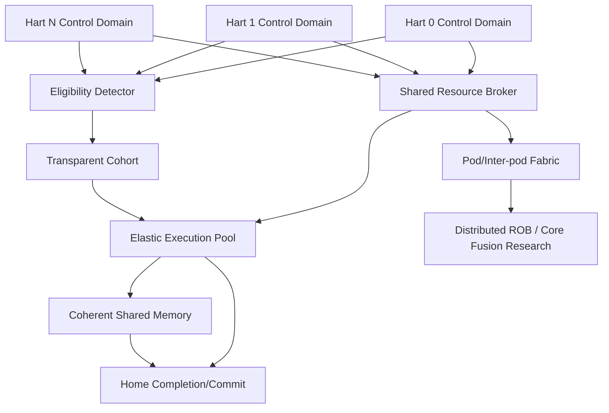

# 第5阶段：多 Hart、透明 Cohort、Pod与完整 Core-Fusion 研究

状态：**执行指南，不是已完成实现**。本分阶段文件供多人并行分配；所有命令、文件、测试和结果都必须等对应任务实现后产生。任何“完成”必须能引用真实 Git commit/artifact hash/日志，不凭口头状态。

## 1. 这个子系统是做什么的

多个标准hart共享执行/内存资源而保持独立PC/CSR/trap/commit；透明cohort只做已证明等价协作；完整distributed ROB/core fusion有独立门槛。

## 2. 为什么存在 / 上游输入

- 上游输入：S0-S4完整候选。
- 已有依赖：p0/p1/p2、resource broker、shared memory、PMU。
- 本阶段输出：不承诺任意单线程GPU化；不把explicit SIMT语义混进标准hart。
- 首要原则：S5所有feature可因正确性或性能no-go关闭，但研究任务仍保留。same PC不证明同地址空间；一个warp ROB不符合独立hart。

多hart团队隔离控制域；coherence团队管memory order/ownership；cohort团队管template/member；pod/fusion团队处理迁移/恢复；实验团队测H2/H3。

## 3. 总体结构

图中的箭头是数据/控制依赖；性能策略不得在正确性前打开。每个分支可以分给不同负责人，但跨接口字段以 [implementation-plan.md](implementation-plan.md) §1.3 和本文件任务卡为准，不能各团队私改。

## 4. 团队分工与进度追踪

| Team | 负责任务 | 当前状态 | Owner | 证据链接 | 下一动作 | Blocker |
|---|---|---|---|---|---|---|
| 多hart负责人 | I-064 | Not started | 待定 | 待填 artifact/commit | 读取任务卡并建立输入锁 | 待填 |
| coherence负责人 | I-065 | Not started | 待定 | 待填 artifact/commit | 读取任务卡并建立输入锁 | 待填 |
| aggregate负责人 | I-066 | Not started | 待定 | 待填 artifact/commit | 读取任务卡并建立输入锁 | 待填 |
| cohort负责人 | I-067 | Not started | 待定 | 待填 artifact/commit | 读取任务卡并建立输入锁 | 待填 |
| cohort负责人 | I-068 | Not started | 待定 | 待填 artifact/commit | 读取任务卡并建立输入锁 | 待填 |
| cohort负责人 | I-069 | Not started | 待定 | 待填 artifact/commit | 读取任务卡并建立输入锁 | 待填 |
| cross-hart memory负责人 | I-070 | Not started | 待定 | 待填 artifact/commit | 读取任务卡并建立输入锁 | 待填 |
| personality负责人 | I-071 | Not started | 待定 | 待填 artifact/commit | 读取任务卡并建立输入锁 | 待填 |
| pod网络负责人 | I-072 | Not started | 待定 | 待填 artifact/commit | 读取任务卡并建立输入锁 | 待填 |
| pod负责人 | I-073 | Not started | 待定 | 待填 artifact/commit | 读取任务卡并建立输入锁 | 待填 |
| distributed ROB负责人 | I-074 | Not started | 待定 | 待填 artifact/commit | 读取任务卡并建立输入锁 | 待填 |
| core fusion负责人 | I-075 | Not started | 待定 | 待填 artifact/commit | 读取任务卡并建立输入锁 | 待填 |
| PMU负责人 | I-076 | Not started | 待定 | 待填 artifact/commit | 读取任务卡并建立输入锁 | 待填 |
| 实验负责人 | I-077 | Not started | 待定 | 待填 artifact/commit | 读取任务卡并建立输入锁 | 待填 |
| vector实验负责人 | I-078 | Not started | 待定 | 待填 artifact/commit | 读取任务卡并建立输入锁 | 待填 |
| aggregate实验负责人 | I-079 | Not started | 待定 | 待填 artifact/commit | 读取任务卡并建立输入锁 | 待填 |
| 多hart验证负责人 | V-064 | Not started | 待定 | 待填 artifact/commit | 读取任务卡并建立输入锁 | 待填 |
| 多hart验证负责人 | V-065 | Not started | 待定 | 待填 artifact/commit | 读取任务卡并建立输入锁 | 待填 |
| 多hart验证负责人 | V-066 | Not started | 待定 | 待填 artifact/commit | 读取任务卡并建立输入锁 | 待填 |
| 多hart验证负责人 | V-067 | Not started | 待定 | 待填 artifact/commit | 读取任务卡并建立输入锁 | 待填 |
| 多hart验证负责人 | V-068 | Not started | 待定 | 待填 artifact/commit | 读取任务卡并建立输入锁 | 待填 |
| 多hart验证负责人 | V-069 | Not started | 待定 | 待填 artifact/commit | 读取任务卡并建立输入锁 | 待填 |
| 多hart验证负责人 | V-070 | Not started | 待定 | 待填 artifact/commit | 读取任务卡并建立输入锁 | 待填 |
| 多hart验证负责人 | V-071 | Not started | 待定 | 待填 artifact/commit | 读取任务卡并建立输入锁 | 待填 |
| 多hart验证负责人 | V-072 | Not started | 待定 | 待填 artifact/commit | 读取任务卡并建立输入锁 | 待填 |
| 多hart验证负责人 | V-076 | Not started | 待定 | 待填 artifact/commit | 读取任务卡并建立输入锁 | 待填 |
| 多hart验证负责人 | V-078 | Not started | 待定 | 待填 artifact/commit | 读取任务卡并建立输入锁 | 待填 |
| 多hart验证负责人 | V-079 | Not started | 待定 | 待填 artifact/commit | 读取任务卡并建立输入锁 | 待填 |
| 多hart验证负责人 | V-080 | Not started | 待定 | 待填 artifact/commit | 读取任务卡并建立输入锁 | 待填 |

状态只能取 `Not started / Inputs locked / In progress / Blocked / Evidence complete / Accepted`。Accepted 需要阶段负责人和验证负责人同时签字；Blocked 必须写最小外部事实、影响范围、请求对象和下一日期，不写“快好了”。

## 5. 可跟踪任务卡

每张卡先给设计者/审查者看的工程合同，再给执行者看的自然语言说明。说明不是替代规格，而是告诉执行者如何按规格工作：先做什么、不能猜什么、什么时候停下来、拿什么证据证明完成。完成定义：对应 `Pass` 全部有直接证据，相关负控制也工作；不是“代码写完”或“仿真曾跑过”。

### I-064 — 实现两 hart architectural domains

- **负责/门禁**：多hart负责人；独立控制域。
- **前置依赖**：I-048, I-031；仍受 implementation-plan 集成依赖表约束。
- **做什么**：先静态分区执行资源，分别运行不同 program/ASID；任何 packet 带 hart ownership；运行 CASE=multihart.isolation。
- **输入数据/接口**：两hart PC/RAT/ROB/CSR/LSQ/interrupt
- **输出与交接**：two-hart control planes
- **设计取舍**：静态资源分区起点
- **实现微步骤**：复制control-plane状态并隔离；每packet绑定hart ID+generation；独立event/reference streams；共享资源带quota/公平；一hart故障另一hart继续；由V-064验收；记录partition baseline。
- **主要阻塞风险**：全局redirect串扰、response错hart、host伪全局顺序；阻断规则：全局 redirect 清除其他 hart，或 hart ID 重用造成 response 混淆。
- **验收证据**：一 hart fault/flush 不丢另一个 hart 的请求/状态；每 hart 与 reference 对照一致。；验证口径：isolation matrix
- **失败/回退动作**：保持单hart p0
- **来源覆盖**：SMT/TLP, architectural isolation。；来源 architecture-review.md, SRC-01/SRC-03。
- **执行者目标**：把“两 hart architectural domains”做成一个可复核的小交付：接收明确输入，产出可验证证据，并在失败时给出可回退的安全状态。
- **执行者须知**：先做合同和最小正确实现，再做优化。不要从相邻任务猜字段；所有身份、credit、reset、flush和背压边界必须来自本任务及implementation-plan。完成前至少覆盖一个正常路径、一个资源冲突和一个取消/恢复路径。
- **建议工作顺序**：复制control-plane状态并隔离；每packet绑定hart ID+generation；独立event/reference streams；共享资源带quota/公平；一hart故障另一hart继续；由V-064验收；记录partition baseline。
- **可接受完成**：一 hart fault/flush 不丢另一个 hart 的请求/状态；每 hart 与 reference 对照一致。
- **何时停止求助**：主要风险是全局redirect串扰、response错hart、host伪全局顺序。遇到缺失输入、互相矛盾的合同、工具/板卡不可用或验证无法区分错误时，不要猜测；把任务标为Blocked，记录最小事实和需要的上游决定。
- **交付说明**：交接时提供输出：two-hart control planes；同时更新Track Log、状态、证据hash/commit和下一步。不要把未验证的半成品标成Evidence complete。
- **参考资料**：architecture-review.md, SRC-01/SRC-03。
- **进度日志**：2026-09-29 规划生成——未开始；后续每次状态变化追加日期、commit/artifact、证据和下一步。

### I-065 — 实现 shared memory serialization 与 coherence

- **负责/门禁**：coherence负责人；共享内存一致性。
- **前置依赖**：I-064, I-040, I-042；仍受 implementation-plan 集成依赖表约束。
- **做什么**：先共享 banked coherent point，private cache 若启用必须接入明确定义协议；实现 invalidation/ownership/ack transient states；测试 false sharing、dirty sharing 与 atomics。
- **输入数据/接口**：shared point/private protocol、ownership、invalidations
- **输出与交接**：coherence implementation
- **设计取舍**：先简单共享点，再private caches
- **实现微步骤**：定义每个line owner/version；实现request/response/ack transient FSM；接入LSQ/fence/atomics；处理DMA/PS外部writer；跑dirty sharing/false sharing；由V-067/V-065验收；不使用scratchpad冒充cache。
- **主要阻塞风险**：stale dirty、transient states、DMA假设；阻断规则：引用 scratchpad manycore 性能作为任意 coherent cache 的证明。
- **验收证据**：coherence invariants 与 litmus 检查均通过；单地址 coherent 不冒充整体 memory model 正确。；验证口径：coherence race matrix
- **失败/回退动作**：单shared serialization point
- **来源覆盖**：cache coherence, RVWMO, shared memory fabric。；来源 IR-001, architecture-review.md, validation-plan.md。
- **执行者目标**：把“shared memory serialization 与 coherence”做成一个可复核的小交付：接收明确输入，产出可验证证据，并在失败时给出可回退的安全状态。
- **执行者须知**：先做合同和最小正确实现，再做优化。不要从相邻任务猜字段；所有身份、credit、reset、flush和背压边界必须来自本任务及implementation-plan。完成前至少覆盖一个正常路径、一个资源冲突和一个取消/恢复路径。
- **建议工作顺序**：定义每个line owner/version；实现request/response/ack transient FSM；接入LSQ/fence/atomics；处理DMA/PS外部writer；跑dirty sharing/false sharing；由V-067/V-065验收；不使用scratchpad冒充cache。
- **可接受完成**：coherence invariants 与 litmus 检查均通过；单地址 coherent 不冒充整体 memory model 正确。
- **何时停止求助**：主要风险是stale dirty、transient states、DMA假设。遇到缺失输入、互相矛盾的合同、工具/板卡不可用或验证无法区分错误时，不要猜测；把任务标为Blocked，记录最小事实和需要的上游决定。
- **交付说明**：交接时提供输出：coherence implementation；同时更新Track Log、状态、证据hash/commit和下一步。不要把未验证的半成品标成Evidence complete。
- **参考资料**：IR-001, architecture-review.md, validation-plan.md。
- **进度日志**：2026-09-29 规划生成——未开始；后续每次状态变化追加日期、commit/artifact、证据和下一步。

### I-066 — 实现跨 hart 资源借用

- **负责/门禁**：aggregate负责人；资源借用。
- **前置依赖**：I-065, I-031, I-028；仍受 implementation-plan 集成依赖表约束。
- **做什么**：在不移动 RAT/ROB 的前提下让 hart0 借用 hart1 空闲 ALU/MUL；隔离故障/取消；同 ELF 对比独占/分区/借用三模式。
- **输入数据/接口**：home identity、donor resources、return credits
- **输出与交接**：execution borrowing
- **设计取舍**：borrow不改变RAT/ROB ownership
- **实现微步骤**：donor冻结/出租计算资源；packet保留home MacroTag；结果经home completion/PRF；donor owner变化遵循drain；同ELF三种模式对照；由V-072复核；统计借用成本。
- **主要阻塞风险**：hart身份迁移、结果回家错误、lease死锁；阻断规则：通过迁移 OS-visible hart 身份实现所谓借用。
- **验收证据**：remote result 只提交到原 home hart；owner 转换期间无丢包/credit leak。；验证口径：home-state preservation
- **失败/回退动作**：静态partition
- **来源覆盖**：core aggregation, dynamic backend ownership。；来源 SRC-01/SRC-02/SRC-03, architecture-review.md。
- **执行者目标**：把“跨 hart 资源借用”做成一个可复核的小交付：接收明确输入，产出可验证证据，并在失败时给出可回退的安全状态。
- **执行者须知**：先做合同和最小正确实现，再做优化。不要从相邻任务猜字段；所有身份、credit、reset、flush和背压边界必须来自本任务及implementation-plan。完成前至少覆盖一个正常路径、一个资源冲突和一个取消/恢复路径。
- **建议工作顺序**：donor冻结/出租计算资源；packet保留home MacroTag；结果经home completion/PRF；donor owner变化遵循drain；同ELF三种模式对照；由V-072复核；统计借用成本。
- **可接受完成**：remote result 只提交到原 home hart；owner 转换期间无丢包/credit leak。
- **何时停止求助**：主要风险是hart身份迁移、结果回家错误、lease死锁。遇到缺失输入、互相矛盾的合同、工具/板卡不可用或验证无法区分错误时，不要猜测；把任务标为Blocked，记录最小事实和需要的上游决定。
- **交付说明**：交接时提供输出：execution borrowing；同时更新Track Log、状态、证据hash/commit和下一步。不要把未验证的半成品标成Evidence complete。
- **参考资料**：SRC-01/SRC-02/SRC-03, architecture-review.md。
- **进度日志**：2026-09-29 规划生成——未开始；后续每次状态变化追加日期、commit/artifact、证据和下一步。

### I-067 — 实现 cohort 匹配但不共享提交

- **负责/门禁**：cohort负责人；template eligibility。
- **前置依赖**：I-064, I-041, I-046；仍受 implementation-plan 集成依赖表约束。
- **做什么**：先只合并等价 decode templates；各成员保留 RAT/ROB/CSR 与独立 operands；同 PC 不同映射/指令的负例必须拒绝。
- **输入数据/接口**：instruction bits/length、privilege/config、per-member state
- **输出与交接**：cohort template detector
- **设计取舍**：shared template，不共享退休身份
- **实现微步骤**：为每instruction生成语义key；核对privilege/ISA/config/fetch permission；成员各自ROB/RAT/CSR/exception；template generation与引用计数；同PC负例/self-modifying code；由V-068验收；不同步强制退休。
- **主要阻塞风险**：same-PC不同代码、同ASID不同映射、FENCE.I stale；阻断规则：仅 PC 相同就组队，或让多个普通 harts 共用一个 architectural ROB identity。
- **验收证据**：只有语义等价指令模板共享；一个成员未 ready 不阻止其他 hart 合法独立执行。；验证口径：false-match rejection
- **失败/回退动作**：独立decode每hart
- **来源覆盖**：transparent micro-SIMT, decode multicast。；来源 architecture-review.md, SRC-02/SRC-03。
- **执行者目标**：把“cohort 匹配但不共享提交”做成一个可复核的小交付：接收明确输入，产出可验证证据，并在失败时给出可回退的安全状态。
- **执行者须知**：先做合同和最小正确实现，再做优化。不要从相邻任务猜字段；所有身份、credit、reset、flush和背压边界必须来自本任务及implementation-plan。完成前至少覆盖一个正常路径、一个资源冲突和一个取消/恢复路径。
- **建议工作顺序**：为每instruction生成语义key；核对privilege/ISA/config/fetch permission；成员各自ROB/RAT/CSR/exception；template generation与引用计数；同PC负例/self-modifying code；由V-068验收；不同步强制退休。
- **可接受完成**：只有语义等价指令模板共享；一个成员未 ready 不阻止其他 hart 合法独立执行。
- **何时停止求助**：主要风险是same-PC不同代码、同ASID不同映射、FENCE.I stale。遇到缺失输入、互相矛盾的合同、工具/板卡不可用或验证无法区分错误时，不要猜测；把任务标为Blocked，记录最小事实和需要的上游决定。
- **交付说明**：交接时提供输出：cohort template detector；同时更新Track Log、状态、证据hash/commit和下一步。不要把未验证的半成品标成Evidence complete。
- **参考资料**：architecture-review.md, SRC-02/SRC-03。
- **进度日志**：2026-09-29 规划生成——未开始；后续每次状态变化追加日期、commit/artifact、证据和下一步。

### I-068 — 实现 cohort ALU 与独立 member completion

- **负责/门禁**：cohort负责人；多member结果。
- **前置依赖**：I-067, I-026；仍受 implementation-plan 集成依赖表约束。
- **做什么**：一份 operation template 驱动多组标量 operands；每 member 单独 result/fault/commit；与独立执行的同一输入逐 hart 比较。
- **输入数据/接口**：member mask、per-hart source/destination、independent fault
- **输出与交接**：cohort ALU path
- **设计取舍**：warp schedule可作显式分支，透明模式per-member commit
- **实现微步骤**：把eligible pure ALU打为成员组；按member分发独立operands；结果回各自PRF/ROB；inactive/member退出不写；一个fault仅split该member；与独立执行对照；由V-069验收。
- **主要阻塞风险**：inactive写、fault广播、少member假完成；阻断规则：cohort completion 被当成所有 hart 同时必须 retire。
- **验收证据**：active member 恰好一次完成；inactive lane 无 write/CSR/memory side effect；少成员情况不伪造结果。；验证口径：member result matrix
- **失败/回退动作**：禁cohort issue
- **来源覆盖**：SIMT plus concurrent instructions, per-hart precision。；来源 architecture-review.md, SRC-01/SRC-03。
- **执行者目标**：把“cohort ALU 与独立 member completion”做成一个可复核的小交付：接收明确输入，产出可验证证据，并在失败时给出可回退的安全状态。
- **执行者须知**：先做合同和最小正确实现，再做优化。不要从相邻任务猜字段；所有身份、credit、reset、flush和背压边界必须来自本任务及implementation-plan。完成前至少覆盖一个正常路径、一个资源冲突和一个取消/恢复路径。
- **建议工作顺序**：把eligible pure ALU打为成员组；按member分发独立operands；结果回各自PRF/ROB；inactive/member退出不写；一个fault仅split该member；与独立执行对照；由V-069验收。
- **可接受完成**：active member 恰好一次完成；inactive lane 无 write/CSR/memory side effect；少成员情况不伪造结果。
- **何时停止求助**：主要风险是inactive写、fault广播、少member假完成。遇到缺失输入、互相矛盾的合同、工具/板卡不可用或验证无法区分错误时，不要猜测；把任务标为Blocked，记录最小事实和需要的上游决定。
- **交付说明**：交接时提供输出：cohort ALU path；同时更新Track Log、状态、证据hash/commit和下一步。不要把未验证的半成品标成Evidence complete。
- **参考资料**：architecture-review.md, SRC-01/SRC-03。
- **进度日志**：2026-09-29 规划生成——未开始；后续每次状态变化追加日期、commit/artifact、证据和下一步。

### I-069 — 实现 divergence/split/rejoin

- **负责/门禁**：cohort负责人；分歧/再汇合。
- **前置依赖**：I-068, I-018, I-020；仍受 implementation-plan 集成依赖表约束。
- **做什么**：分支不同即拆队，成员可独立继续；再遇完整 eligibility 可重组；测试一个 lane page fault、另一个 interrupt、不同 loop trip counts。
- **输入数据/接口**：branch/trap/IRQ/WFI split、optional rejoin
- **输出与交接**：cohort membership FSM
- **设计取舍**：rejoin是机会，不是等待barrier
- **实现微步骤**：按PC/branch outcome分裂members；每member独立处理fault/interrupt；允许其他hart独立issue；满足完整key时才重组；覆盖0/10/25/50/100% divergence；由V-069/V-071验收；检查credit守恒。
- **主要阻塞风险**：一hart拖死所有、trap复制、credit泄漏；阻断规则：持有其他 hart 等故障成员造成语义死锁，或丢失独立 CSR/PC。
- **验收证据**：0/10/25/50/100% divergence 下各 hart 输出与独立执行一致；重组不要求软件不存在的 barrier。；验证口径：divergence matrix
- **失败/回退动作**：永久独立执行
- **来源覆盖**：divergence/reconvergence, precise cohort events。；来源 architecture-review.md, validation-plan.md。
- **执行者目标**：把“divergence/split/rejoin”做成一个可复核的小交付：接收明确输入，产出可验证证据，并在失败时给出可回退的安全状态。
- **执行者须知**：先做合同和最小正确实现，再做优化。不要从相邻任务猜字段；所有身份、credit、reset、flush和背压边界必须来自本任务及implementation-plan。完成前至少覆盖一个正常路径、一个资源冲突和一个取消/恢复路径。
- **建议工作顺序**：按PC/branch outcome分裂members；每member独立处理fault/interrupt；允许其他hart独立issue；满足完整key时才重组；覆盖0/10/25/50/100% divergence；由V-069/V-071验收；检查credit守恒。
- **可接受完成**：0/10/25/50/100% divergence 下各 hart 输出与独立执行一致；重组不要求软件不存在的 barrier。
- **何时停止求助**：主要风险是一hart拖死所有、trap复制、credit泄漏。遇到缺失输入、互相矛盾的合同、工具/板卡不可用或验证无法区分错误时，不要猜测；把任务标为Blocked，记录最小事实和需要的上游决定。
- **交付说明**：交接时提供输出：cohort membership FSM；同时更新Track Log、状态、证据hash/commit和下一步。不要把未验证的半成品标成Evidence complete。
- **参考资料**：architecture-review.md, validation-plan.md。
- **进度日志**：2026-09-29 规划生成——未开始；后续每次状态变化追加日期、commit/artifact、证据和下一步。

### I-070 — 受限跨 hart load coalescing

- **负责/门禁**：cross-hart memory负责人；受限跨hart合并。
- **前置依赖**：I-069, I-065, I-061；仍受 implementation-plan 集成依赖表约束。
- **做什么**：初期仅满足同一允许观测点的 ordinary reads，排除 MMIO/LRSC/AMO/fences；不能仅因 cache line 相同强迫不合法 shared value；运行 litmus 与 competing writer。
- **输入数据/接口**：PA/permission/order、independent consumer/fault
- **输出与交接**：cross-hart load merge
- **设计取舍**：只合并允许的ordinary cacheable reads
- **实现微步骤**：translation/PMA/permission先行；过滤MMIO/AMO/LRSC/fence；保存每member reads-from/fault；第三方store插入litmus；取消member不取消他人；由V-070验收；merge on/off对照。
- **主要阻塞风险**：非法broadcast、跨地址空间、stale read；阻断规则：byte 相同就合并跨权限/地址空间请求，或只用 sequential reference trace 判断弱内存。
- **验收证据**：每 hart 的取值/异常存在 RVWMO 合法执行；merge on/off 差异仅在允许 nondeterminism 内。；验证口径：memory execution witness
- **失败/回退动作**：禁跨hart合并
- **来源覆盖**：cross-hart coalescing research, ordering。；来源 IR-001, architecture-review.md, validation-plan.md。
- **执行者目标**：把“受限跨 hart load coalescing”做成一个可复核的小交付：接收明确输入，产出可验证证据，并在失败时给出可回退的安全状态。
- **执行者须知**：先做合同和最小正确实现，再做优化。不要从相邻任务猜字段；所有身份、credit、reset、flush和背压边界必须来自本任务及implementation-plan。完成前至少覆盖一个正常路径、一个资源冲突和一个取消/恢复路径。
- **建议工作顺序**：translation/PMA/permission先行；过滤MMIO/AMO/LRSC/fence；保存每member reads-from/fault；第三方store插入litmus；取消member不取消他人；由V-070验收；merge on/off对照。
- **可接受完成**：每 hart 的取值/异常存在 RVWMO 合法执行；merge on/off 差异仅在允许 nondeterminism 内。
- **何时停止求助**：主要风险是非法broadcast、跨地址空间、stale read。遇到缺失输入、互相矛盾的合同、工具/板卡不可用或验证无法区分错误时，不要猜测；把任务标为Blocked，记录最小事实和需要的上游决定。
- **交付说明**：交接时提供输出：cross-hart load merge；同时更新Track Log、状态、证据hash/commit和下一步。不要把未验证的半成品标成Evidence complete。
- **参考资料**：IR-001, architecture-review.md, validation-plan.md。
- **进度日志**：2026-09-29 规划生成——未开始；后续每次状态变化追加日期、commit/artifact、证据和下一步。

### I-071 — 实现混合 personality 控制与进展

- **负责/门禁**：personality负责人；混合模式调度。
- **前置依赖**：I-059, I-066, I-069, I-062；仍受 implementation-plan 集成依赖表约束。
- **做什么**：定义 slow-timescale policy 和 hysteresis，先显式模式切换再自适应；运行 phase-changing workload、抢占/恢复和 saturation。
- **输入数据/接口**：scalar/SMT/RVV/cohort、phase detection、hysteresis
- **输出与交接**：personality broker
- **设计取舍**：显式模式起点，后自适应
- **实现微步骤**：定义每个模式资源配额；实现切换阈值和hysteresis；走统一drain/generation合同；运行phase-changing workload；记录模式时间/成本；由V-071/V-076验收；负收益保留。
- **主要阻塞风险**：模式抖动、架构状态迁移、零进展；阻断规则：以重新初始化整个 processor 代替运行时资源重配置。
- **验收证据**：切换均走 drain/generation 合同，所有模式 architectural traces 合法；策略不抖动到零有用工作。；验证口径：phase transition evidence
- **失败/回退动作**：固定模式运行
- **来源覆盖**：CPU-to-throughput continuum, adaptation。；来源 SRC-03, architecture-review.md。
- **执行者目标**：把“混合 personality 控制与进展”做成一个可复核的小交付：接收明确输入，产出可验证证据，并在失败时给出可回退的安全状态。
- **执行者须知**：先做合同和最小正确实现，再做优化。不要从相邻任务猜字段；所有身份、credit、reset、flush和背压边界必须来自本任务及implementation-plan。完成前至少覆盖一个正常路径、一个资源冲突和一个取消/恢复路径。
- **建议工作顺序**：定义每个模式资源配额；实现切换阈值和hysteresis；走统一drain/generation合同；运行phase-changing workload；记录模式时间/成本；由V-071/V-076验收；负收益保留。
- **可接受完成**：切换均走 drain/generation 合同，所有模式 architectural traces 合法；策略不抖动到零有用工作。
- **何时停止求助**：主要风险是模式抖动、架构状态迁移、零进展。遇到缺失输入、互相矛盾的合同、工具/板卡不可用或验证无法区分错误时，不要猜测；把任务标为Blocked，记录最小事实和需要的上游决定。
- **交付说明**：交接时提供输出：personality broker；同时更新Track Log、状态、证据hash/commit和下一步。不要把未验证的半成品标成Evidence complete。
- **参考资料**：SRC-03, architecture-review.md。
- **进度日志**：2026-09-29 规划生成——未开始；后续每次状态变化追加日期、commit/artifact、证据和下一步。

### I-072 — 实现 pod 内层次网络

- **负责/门禁**：pod网络负责人；层次互连。
- **前置依赖**：I-071, I-030；仍受 implementation-plan 集成依赖表约束。
- **做什么**：扩展树/分层交换网络而非 flat 全连接；加入 local/pod 路由与 credit pools；压力注入 hot bank 与 remote returns。
- **输入数据/接口**：local/pod tree、virtual channels、route credits
- **输出与交接**：pod fabric
- **设计取舍**：层次网络而非flat crossbar
- **实现微步骤**：实现local switch和pod uplink；独立request/response/cancel通道；credit池和route depth bound；压力hot bank/returns；任意增加pipeline cut回归；由V-072复核；记录hop latency。
- **主要阻塞风险**：协议级死锁、全局ready链、长距离latency；阻断规则：层次扩大后仍依赖单 global combinational ready/wakeup 链。
- **验收证据**：所有 topology 通过 conservation/deadlock checks；任意 link 增加 pipeline stage 不改变 functional results。；验证口径：network progress tests
- **失败/回退动作**：单pod小拓扑
- **来源覆盖**：hierarchical scaling, fabric portability。；来源 SRC-03, architecture-review.md。
- **执行者目标**：把“pod 内层次网络”做成一个可复核的小交付：接收明确输入，产出可验证证据，并在失败时给出可回退的安全状态。
- **执行者须知**：先做合同和最小正确实现，再做优化。不要从相邻任务猜字段；所有身份、credit、reset、flush和背压边界必须来自本任务及implementation-plan。完成前至少覆盖一个正常路径、一个资源冲突和一个取消/恢复路径。
- **建议工作顺序**：实现local switch和pod uplink；独立request/response/cancel通道；credit池和route depth bound；压力hot bank/returns；任意增加pipeline cut回归；由V-072复核；记录hop latency。
- **可接受完成**：所有 topology 通过 conservation/deadlock checks；任意 link 增加 pipeline stage 不改变 functional results。
- **何时停止求助**：主要风险是协议级死锁、全局ready链、长距离latency。遇到缺失输入、互相矛盾的合同、工具/板卡不可用或验证无法区分错误时，不要猜测；把任务标为Blocked，记录最小事实和需要的上游决定。
- **交付说明**：交接时提供输出：pod fabric；同时更新Track Log、状态、证据hash/commit和下一步。不要把未验证的半成品标成Evidence complete。
- **参考资料**：SRC-03, architecture-review.md。
- **进度日志**：2026-09-29 规划生成——未开始；后续每次状态变化追加日期、commit/artifact、证据和下一步。

### I-073 — 实现跨 pod coarse-grain work transfer

- **负责/门禁**：pod负责人；粗粒度跨pod。
- **前置依赖**：I-072, I-065；仍受 implementation-plan 集成依赖表约束。
- **做什么**：先允许完整 task/vector packet 的受控 transfer；保留 home commit/context，记录传输成本；禁止默认单周期跨 pod ALU bypass。
- **输入数据/接口**：task/vector descriptor、data placement、home commit
- **输出与交接**：inter-pod task fabric
- **设计取舍**：先task/vector packet迁移，不做任意单cycle remote ALU
- **实现微步骤**：定义task descriptor和ownership；跨pod迁移完整可取消工作；结果/异常返回home；测remote memory/execute latency；取消/失败恢复；由V-072验收；与细粒度借用对照。
- **主要阻塞风险**：远程异常丢source、数据移动成本、重复副作用；阻断规则：用零延迟网络仿真推断真实 scalable speedup。
- **验收证据**：remote task 的取消/错误可回到 home；数据移动与 execute latency 分开计量。；验证口径：task exactly-once
- **失败/回退动作**：仅pod内资源
- **来源覆盖**：pod aggregation, task stealing, remote memory。；来源 SRC-03, architecture-review.md。
- **执行者目标**：把“跨 pod coarse-grain work transfer”做成一个可复核的小交付：接收明确输入，产出可验证证据，并在失败时给出可回退的安全状态。
- **执行者须知**：先做合同和最小正确实现，再做优化。不要从相邻任务猜字段；所有身份、credit、reset、flush和背压边界必须来自本任务及implementation-plan。完成前至少覆盖一个正常路径、一个资源冲突和一个取消/恢复路径。
- **建议工作顺序**：定义task descriptor和ownership；跨pod迁移完整可取消工作；结果/异常返回home；测remote memory/execute latency；取消/失败恢复；由V-072验收；与细粒度借用对照。
- **可接受完成**：remote task 的取消/错误可回到 home；数据移动与 execute latency 分开计量。
- **何时停止求助**：主要风险是远程异常丢source、数据移动成本、重复副作用。遇到缺失输入、互相矛盾的合同、工具/板卡不可用或验证无法区分错误时，不要猜测；把任务标为Blocked，记录最小事实和需要的上游决定。
- **交付说明**：交接时提供输出：inter-pod task fabric；同时更新Track Log、状态、证据hash/commit和下一步。不要把未验证的半成品标成Evidence complete。
- **参考资料**：SRC-03, architecture-review.md。
- **进度日志**：2026-09-29 规划生成——未开始；后续每次状态变化追加日期、commit/artifact、证据和下一步。

### I-074 — 研究 segmented/distributed ROB 协议

- **负责/门禁**：distributed ROB负责人；分段ROB协议。
- **前置依赖**：I-073, I-017, I-018；仍受 implementation-plan 集成依赖表约束。
- **做什么**：先编写小状态 executable model 与 ordering/exception proof，再实现 segment allocation、global sequence、retire token、跨段恢复；保留中央方案对照。
- **输入数据/接口**：global frontier、segments、generation、recovery
- **输出与交接**：distributed retirement protocol
- **设计取舍**：先小状态模型/refinement，再RTL
- **实现微步骤**：保留每hart global commit frontier；segment只提供complete/exception状态；late/乱序消息下更新frontier；所有younger segments统一恢复；建立等价模型和负例；由formal/对照复核；未证明不默认启用。
- **主要阻塞风险**：本地segment独立commit、older fault绕过、lost token；阻断规则：单独 segment complete 就 local retire，或网络延迟导致 younger segment 越过 fault。
- **验收证据**：所有 segment 布局对同一程序提供同样 precise state；lost token/late fault/wrap 负例被检测。；验证口径：oldest fault/recovery evidence
- **失败/回退动作**：central per-hart ROB
- **来源覆盖**：elastic window, distributed ROB, advanced core fusion。；来源 IR-004, architecture-review.md, SRC-02/SRC-03。
- **执行者目标**：把“研究 segmented/distributed ROB 协议”做成一个可复核的小交付：接收明确输入，产出可验证证据，并在失败时给出可回退的安全状态。
- **执行者须知**：先做合同和最小正确实现，再做优化。不要从相邻任务猜字段；所有身份、credit、reset、flush和背压边界必须来自本任务及implementation-plan。完成前至少覆盖一个正常路径、一个资源冲突和一个取消/恢复路径。
- **建议工作顺序**：保留每hart global commit frontier；segment只提供complete/exception状态；late/乱序消息下更新frontier；所有younger segments统一恢复；建立等价模型和负例；由formal/对照复核；未证明不默认启用。
- **可接受完成**：所有 segment 布局对同一程序提供同样 precise state；lost token/late fault/wrap 负例被检测。
- **何时停止求助**：主要风险是本地segment独立commit、older fault绕过、lost token。遇到缺失输入、互相矛盾的合同、工具/板卡不可用或验证无法区分错误时，不要猜测；把任务标为Blocked，记录最小事实和需要的上游决定。
- **交付说明**：交接时提供输出：distributed retirement protocol；同时更新Track Log、状态、证据hash/commit和下一步。不要把未验证的半成品标成Evidence complete。
- **参考资料**：IR-004, architecture-review.md, SRC-02/SRC-03。
- **进度日志**：2026-09-29 规划生成——未开始；后续每次状态变化追加日期、commit/artifact、证据和下一步。

### I-075 — 研究 collective frontend/core fusion

- **负责/门禁**：core fusion负责人；完整fusion研究。
- **前置依赖**：I-074, I-021, I-046；仍受 implementation-plan 集成依赖表约束。
- **做什么**：明确是借用资源还是合并一个 logical stream；若需新软件 hint/ABI 单独审查，不冒充透明标准行为；实现 fetch/rename/commit width 聚合的对照模型后再 RTL。
- **输入数据/接口**：frontend/rename/ROB/LSQ/cache/CSR/interrupt ownership
- **输出与交接**：fusion contract and experiment
- **设计取舍**：先quiescent export/import，不自动透明融合
- **实现微步骤**：区分resource borrowing与logical-stream fusion；导出committed state和in-flight obligations；冻结/导入到fused control domain；定义FUSE/SPLIT软件/OS协议；恢复split时唯一归属；计入重构成本；由AG-10验收。
- **主要阻塞风险**：把借ALU叫fusion、软件协议被隐藏、PRF/LSQ状态丢失；阻断规则：从论文摘要推导“无需任何软件协作”，或把其他 harts 的 architectural state 任意熔成一个。
- **验收证据**：切换前后 architectural identity 不变，故障可恢复；结果包含 reconfiguration/remote operand/ROB inefficiency 成本。；验证口径：switch/recovery evidence
- **失败/回退动作**：保留aggregate tiles，不宣称fusion
- **来源覆盖**：full core fusion research, software transparency boundary。；来源 IR-004, architecture-review.md。
- **执行者目标**：把“研究 collective frontend/core fusion”做成一个可复核的小交付：接收明确输入，产出可验证证据，并在失败时给出可回退的安全状态。
- **执行者须知**：先做合同和最小正确实现，再做优化。不要从相邻任务猜字段；所有身份、credit、reset、flush和背压边界必须来自本任务及implementation-plan。完成前至少覆盖一个正常路径、一个资源冲突和一个取消/恢复路径。
- **建议工作顺序**：区分resource borrowing与logical-stream fusion；导出committed state和in-flight obligations；冻结/导入到fused control domain；定义FUSE/SPLIT软件/OS协议；恢复split时唯一归属；计入重构成本；由AG-10验收。
- **可接受完成**：切换前后 architectural identity 不变，故障可恢复；结果包含 reconfiguration/remote operand/ROB inefficiency 成本。
- **何时停止求助**：主要风险是把借ALU叫fusion、软件协议被隐藏、PRF/LSQ状态丢失。遇到缺失输入、互相矛盾的合同、工具/板卡不可用或验证无法区分错误时，不要猜测；把任务标为Blocked，记录最小事实和需要的上游决定。
- **交付说明**：交接时提供输出：fusion contract and experiment；同时更新Track Log、状态、证据hash/commit和下一步。不要把未验证的半成品标成Evidence complete。
- **参考资料**：IR-004, architecture-review.md。
- **进度日志**：2026-09-29 规划生成——未开始；后续每次状态变化追加日期、commit/artifact、证据和下一步。

### I-076 — 实现 PMU 与事件一致性

- **负责/门禁**：PMU负责人；指标可解释。
- **前置依赖**：I-029, I-043, I-021；仍受 implementation-plan 集成依赖表约束。
- **做什么**：统计 per-hart retired instructions、uOPs、useful elements、stall reasons、occupancy、remote traffic、WB conflicts、replays、MPKI；每 counter 用可手算 trace 对齐。
- **输入数据/接口**：retired instr/uops、occupancy、routes、replay、MPKI
- **输出与交接**：PMU schema
- **设计取舍**：计数器按trace校准，性能与correctness分离
- **实现微步骤**：定义每个事件唯一采样点；实现hart/aggregate计数器；用小trace手算校准；报告work、bytes、stall reasons；标出CSR是否参考可比；由V-076复核；禁用未校准指标。
- **主要阻塞风险**：IPC向量/标量混、double count、toggle当功耗；阻断规则：用 vector IPC 比 scalar IPC 直接判快慢，或拿 toggle count 当实测功耗。
- **验收证据**：counters 与 trace 对账，sum/classification 无漏计/双计；CSR 是否可见与是否可由参考比对明确。；验证口径：trace accounting
- **失败/回退动作**：只导出raw events
- **来源覆盖**：performance observability, experiment integrity。；来源 SRC-02/SRC-03, validation-plan.md。
- **执行者目标**：把“PMU 与事件一致性”做成一个可复核的小交付：接收明确输入，产出可验证证据，并在失败时给出可回退的安全状态。
- **执行者须知**：先做合同和最小正确实现，再做优化。不要从相邻任务猜字段；所有身份、credit、reset、flush和背压边界必须来自本任务及implementation-plan。完成前至少覆盖一个正常路径、一个资源冲突和一个取消/恢复路径。
- **建议工作顺序**：定义每个事件唯一采样点；实现hart/aggregate计数器；用小trace手算校准；报告work、bytes、stall reasons；标出CSR是否参考可比；由V-076复核；禁用未校准指标。
- **可接受完成**：counters 与 trace 对账，sum/classification 无漏计/双计；CSR 是否可见与是否可由参考比对明确。
- **何时停止求助**：主要风险是IPC向量/标量混、double count、toggle当功耗。遇到缺失输入、互相矛盾的合同、工具/板卡不可用或验证无法区分错误时，不要猜测；把任务标为Blocked，记录最小事实和需要的上游决定。
- **交付说明**：交接时提供输出：PMU schema；同时更新Track Log、状态、证据hash/commit和下一步。不要把未验证的半成品标成Evidence complete。
- **参考资料**：SRC-02/SRC-03, validation-plan.md。
- **进度日志**：2026-09-29 规划生成——未开始；后续每次状态变化追加日期、commit/artifact、证据和下一步。

### I-077 — 构建等资源 fixed/dynamic 实验矩阵

- **负责/门禁**：实验负责人；fixed/dynamic等资源。
- **前置依赖**：I-076, I-032；仍受 implementation-plan 集成依赖表约束。
- **做什么**：生成 ALU_CHAIN、ILP_8、WB_COLLISION、BANK_CONFLICT、REMOTE_CHAIN、LOAD_MLP_1/2/4/8/16、BRANCH_RANDOM；每对仅改 policy，记录 synth/P&R 后频率。
- **输入数据/接口**：same ELF/resources/compiler、microbenchmarks、route policy
- **输出与交接**：H1 experiment matrix
- **设计取舍**：只改一个变量，频率/面积同报
- **实现微步骤**：构建fixed baseline和dynamic build；生成ALU/ILP/WB/bank/remote/MLP/branch用例；同ELF同输入跑对照；收集cycles/Fmax/LUT/BRAM；独立统计显著性/分布；由V-076验收；保留no-go结果。
- **主要阻塞风险**：隐藏资源差异、只报IPC、负面样本删除；阻断规则：fixed baseline 人为阉割资源，或只报 IPC 隐藏 Fmax 下降。
- **验收证据**：每项输出正确，表中同时给 cycles/IPC/actual clock/useful-work-per-second/LUT/BRAM；负收益如实保留。；验证口径：paired evidence
- **失败/回退动作**：暂停性能结论
- **来源覆盖**：H1 dynamic steering hypothesis, scalar benchmark controls。；来源 SRC-01/SRC-02/SRC-03。
- **执行者目标**：把“构建等资源 fixed/dynamic 实验矩阵”做成一个可复核的小交付：接收明确输入，产出可验证证据，并在失败时给出可回退的安全状态。
- **执行者须知**：先做合同和最小正确实现，再做优化。不要从相邻任务猜字段；所有身份、credit、reset、flush和背压边界必须来自本任务及implementation-plan。完成前至少覆盖一个正常路径、一个资源冲突和一个取消/恢复路径。
- **建议工作顺序**：构建fixed baseline和dynamic build；生成ALU/ILP/WB/bank/remote/MLP/branch用例；同ELF同输入跑对照；收集cycles/Fmax/LUT/BRAM；独立统计显著性/分布；由V-076验收；保留no-go结果。
- **可接受完成**：每项输出正确，表中同时给 cycles/IPC/actual clock/useful-work-per-second/LUT/BRAM；负收益如实保留。
- **何时停止求助**：主要风险是隐藏资源差异、只报IPC、负面样本删除。遇到缺失输入、互相矛盾的合同、工具/板卡不可用或验证无法区分错误时，不要猜测；把任务标为Blocked，记录最小事实和需要的上游决定。
- **交付说明**：交接时提供输出：H1 experiment matrix；同时更新Track Log、状态、证据hash/commit和下一步。不要把未验证的半成品标成Evidence complete。
- **参考资料**：SRC-01/SRC-02/SRC-03。
- **进度日志**：2026-09-29 规划生成——未开始；后续每次状态变化追加日期、commit/artifact、证据和下一步。

### I-078 — 构建 vector/LLB/coalescing ablation

- **负责/门禁**：vector实验负责人；RVV/memory ablation。
- **前置依赖**：I-063, I-059, I-077；仍受 implementation-plan 集成依赖表约束。
- **做什么**：固定总 FU/memory bandwidth，比较 1×8/2×4/4×2 lane 配额、short/long VL、gather/stride、false sharing、LLB warm/cold；收集 useful work 与流量。
- **输入数据/接口**：L1-only/LLB/coalescer、1x8/2x4/4x2 lanes、traffic
- **输出与交接**：RVV/MEF ablation
- **设计取舍**：固定FU和bandwidth，correctness先过
- **实现微步骤**：准备无LLB/LLB/coalescer配置；固定vector和memory资源；执行stream/stride/gather/short VL；收集useful work/bytes/conflicts；真实SRAM/时序成本入表；由V-076验收；负收益保留。
- **主要阻塞风险**：per-lane coherent cache成本未计、外部论文数值套用；阻断规则：将 Ara-Opt/SEAM-V 的 speedup 直接套成本项目预期结果。
- **验收证据**：每点有 output signature、cycles、data bytes/op、bank conflicts、line transactions；未实现的 cache 对照标不具备，不编造数值。；验证口径：paired correctness/performance
- **失败/回退动作**：只报告scalar baseline
- **来源覆盖**：RVV partitioning, locality hypothesis, coalescing benefit。；来源 IR-002, IR-003, SRC-03。
- **执行者目标**：把“构建 vector/LLB/coalescing ablation”做成一个可复核的小交付：接收明确输入，产出可验证证据，并在失败时给出可回退的安全状态。
- **执行者须知**：先做合同和最小正确实现，再做优化。不要从相邻任务猜字段；所有身份、credit、reset、flush和背压边界必须来自本任务及implementation-plan。完成前至少覆盖一个正常路径、一个资源冲突和一个取消/恢复路径。
- **建议工作顺序**：准备无LLB/LLB/coalescer配置；固定vector和memory资源；执行stream/stride/gather/short VL；收集useful work/bytes/conflicts；真实SRAM/时序成本入表；由V-076验收；负收益保留。
- **可接受完成**：每点有 output signature、cycles、data bytes/op、bank conflicts、line transactions；未实现的 cache 对照标不具备，不编造数值。
- **何时停止求助**：主要风险是per-lane coherent cache成本未计、外部论文数值套用。遇到缺失输入、互相矛盾的合同、工具/板卡不可用或验证无法区分错误时，不要猜测；把任务标为Blocked，记录最小事实和需要的上游决定。
- **交付说明**：交接时提供输出：RVV/MEF ablation；同时更新Track Log、状态、证据hash/commit和下一步。不要把未验证的半成品标成Evidence complete。
- **参考资料**：IR-002, IR-003, SRC-03。
- **进度日志**：2026-09-29 规划生成——未开始；后续每次状态变化追加日期、commit/artifact、证据和下一步。

### I-079 — 构建 cohort/aggregation/QoS ablation

- **负责/门禁**：aggregate实验负责人；cohort/aggregation对照。
- **前置依赖**：I-071, I-077；仍受 implementation-plan 集成依赖表约束。
- **做什么**：测 0/10/25/50/100% divergence、不同 working sets、memory contention、phase lengths；包含 broker overhead 和 p99 scalar latency。
- **输入数据/接口**：independent/partition/borrow/cohort、divergence、QoS
- **输出与交接**：H2/H3 experiment matrix
- **设计取舍**：相同应用work和同步，不虚假单线程加速
- **实现微步骤**：准备相同workload四模式；扫0-100% divergence和phase长度；收集每hart与aggregate useful work；加入memory contention和locks；检查公平/p99；由V-076验收；输出H2/H3结论。
- **主要阻塞风险**：更多线程更多work、隐藏broker开销、p99恶化；阻断规则：隐藏负面 workload 或以更多线程完成更多工作却报告单线程加速。
- **验收证据**：输入/输出/资源匹配，报告 geometric mean 的样本集合与每样本值；no-go 是合法研究结论但不冒充性能成功。；验证口径：paired evidence
- **失败/回退动作**：只交付资源借用结果
- **来源覆盖**：core aggregation benefit, cohort throughput, QoS。；来源 SRC-01/SRC-02/SRC-03, IR-004。
- **执行者目标**：把“构建 cohort/aggregation/QoS ablation”做成一个可复核的小交付：接收明确输入，产出可验证证据，并在失败时给出可回退的安全状态。
- **执行者须知**：先做合同和最小正确实现，再做优化。不要从相邻任务猜字段；所有身份、credit、reset、flush和背压边界必须来自本任务及implementation-plan。完成前至少覆盖一个正常路径、一个资源冲突和一个取消/恢复路径。
- **建议工作顺序**：准备相同workload四模式；扫0-100% divergence和phase长度；收集每hart与aggregate useful work；加入memory contention和locks；检查公平/p99；由V-076验收；输出H2/H3结论。
- **可接受完成**：输入/输出/资源匹配，报告 geometric mean 的样本集合与每样本值；no-go 是合法研究结论但不冒充性能成功。
- **何时停止求助**：主要风险是更多线程更多work、隐藏broker开销、p99恶化。遇到缺失输入、互相矛盾的合同、工具/板卡不可用或验证无法区分错误时，不要猜测；把任务标为Blocked，记录最小事实和需要的上游决定。
- **交付说明**：交接时提供输出：H2/H3 experiment matrix；同时更新Track Log、状态、证据hash/commit和下一步。不要把未验证的半成品标成Evidence complete。
- **参考资料**：SRC-01/SRC-02/SRC-03, IR-004。
- **进度日志**：2026-09-29 规划生成——未开始；后续每次状态变化追加日期、commit/artifact、证据和下一步。

### V-064 — 验证多 hart architectural context 隔离

- **负责/门禁**：多hart验证负责人；验证证据闭合。
- **前置依赖**：V-017, V-034, V-047；仍受 implementation-plan 集成依赖表约束。
- **做什么**：在 2/4-hart 配置交错相同 PC 不同 GPR/权限/ASID/FP/vector 状态，分别触发 trap、IRQ、WFI 与 halt；参考实例必须具备独立 state 与已定义共享 memory。
- **输入数据/接口**：多 hart 实现里程碑、hart ID/CSR/reset/interrupt 分配。
- **输出与交接**：hart-context 对照、state isolation trace。
- **设计取舍**：有限集合/模型边界明确，不用样本数冒充形式证明
- **实现微步骤**：冻结该任务输入、版本与capability交集；展开有限case/seed/budget manifest；实现真实检查器并接入负控制；执行正控制和故障注入；闭合计划/执行/通过/失败/unsupported计数；最小化失败并建立replay；阶段负责人签收或阻断后续gate。
- **主要阻塞风险**：静默skip、mock echo、空覆盖率、把deferred当成功；阻断规则：把多个软件线程当一个 RVV hart、共用参考寄存器状态、按 host 调度创建伪全局 retire 顺序。
- **验收证据**：每 hart PC/rename/commit/trap/CSR 独立，mhartid 稳定，某 hart 停止不隐式停止其他 hart。；验证口径：每 hart PC/rename/commit/trap/CSR 独立，mhartid 稳定，某 hart 停止不隐式停止其他 hart。
- **失败/回退动作**：把多个软件线程当一个 RVV hart、共用参考寄存器状态、按 host 调度创建伪全局 retire 顺序。
- **来源覆盖**：SRC-03 §Per-Hart Commit Domain、§RVV 和 SIMT 不能等同。；来源 SRC-03:540-663, SRC-03:1425-1536, VR-003, VR-012。
- **执行者目标**：把“多 hart architectural context 隔离”做成一个可复核的小交付：接收明确输入，产出可验证证据，并在失败时给出可回退的安全状态。
- **执行者须知**：先证明检查器能抓到真实错误，再接受正例。每个测试必须物化输入/seed/期望和排除账本；不可用空套件、mock echo或静默skip取得通过。完成前加入一个负控制并保存首个差异。
- **建议工作顺序**：冻结该任务输入、版本与capability交集；展开有限case/seed/budget manifest；实现真实检查器并接入负控制；执行正控制和故障注入；闭合计划/执行/通过/失败/unsupported计数；最小化失败并建立replay；阶段负责人签收或阻断后续gate。
- **可接受完成**：每 hart PC/rename/commit/trap/CSR 独立，mhartid 稳定，某 hart 停止不隐式停止其他 hart。
- **何时停止求助**：主要风险是静默skip、mock echo、空覆盖率、把deferred当成功。遇到缺失输入、互相矛盾的合同、工具/板卡不可用或验证无法区分错误时，不要猜测；把任务标为Blocked，记录最小事实和需要的上游决定。
- **交付说明**：交接时提供输出：hart-context 对照、state isolation trace。；同时更新Track Log、状态、证据hash/commit和下一步。不要把未验证的半成品标成Evidence complete。
- **参考资料**：SRC-03:540-663, SRC-03:1425-1536, VR-003, VR-012。
- **进度日志**：2026-09-29 规划生成——未开始；后续每次状态变化追加日期、commit/artifact、证据和下一步。

### V-065 — 建立独立的多 hart memory trace checker

- **负责/门禁**：多hart验证负责人；验证证据闭合。
- **前置依赖**：V-045, V-046, V-062, V-064；仍受 implementation-plan 集成依赖表约束。
- **做什么**：将每个内存原语映射到 po/rf/co/依赖/fence/aq/rl 约束；明确 Difftest golden-memory patch 的使用点，独立重验 load 值与 store 来源，不以 patched reference state 当 memory proof。
- **输入数据/接口**：per-hart program order、reads-from/version、store visibility、coherence 事件。
- **输出与交接**：可审计执行图及内存约束检查结果。
- **设计取舍**：有限集合/模型边界明确，不用样本数冒充形式证明
- **实现微步骤**：冻结该任务输入、版本与capability交集；展开有限case/seed/budget manifest；实现真实检查器并接入负控制；执行正控制和故障注入；闭合计划/执行/通过/失败/unsupported计数；最小化失败并建立replay；阶段负责人签收或阻断后续gate。
- **主要阻塞风险**：静默skip、mock echo、空覆盖率、把deferred当成功；阻断规则：简单按 retirement 排列全局 store、SC 模型拒绝合法弱行为、patch DUT load 到 REF 后就跳过 memory 检查。
- **验收证据**：每个观察到的值有合法来源与满足适用模型的执行见证；缺失 provenance 阻断多 hart memory 验收。；验证口径：每个观察到的值有合法来源与满足适用模型的执行见证；缺失 provenance 阻断多 hart memory 验收。
- **失败/回退动作**：简单按 retirement 排列全局 store、SC 模型拒绝合法弱行为、patch DUT load 到 REF 后就跳过 memory 检查。
- **来源覆盖**：SRC-03 §Store visibility obeys selected RISC-V model、§cross-hart fusion。；来源 VR-003, VR-006, VR-014, VR-015。
- **执行者目标**：把“建立独立的多 hart memory trace checker”做成一个可复核的小交付：接收明确输入，产出可验证证据，并在失败时给出可回退的安全状态。
- **执行者须知**：先证明检查器能抓到真实错误，再接受正例。每个测试必须物化输入/seed/期望和排除账本；不可用空套件、mock echo或静默skip取得通过。完成前加入一个负控制并保存首个差异。
- **建议工作顺序**：冻结该任务输入、版本与capability交集；展开有限case/seed/budget manifest；实现真实检查器并接入负控制；执行正控制和故障注入；闭合计划/执行/通过/失败/unsupported计数；最小化失败并建立replay；阶段负责人签收或阻断后续gate。
- **可接受完成**：每个观察到的值有合法来源与满足适用模型的执行见证；缺失 provenance 阻断多 hart memory 验收。
- **何时停止求助**：主要风险是静默skip、mock echo、空覆盖率、把deferred当成功。遇到缺失输入、互相矛盾的合同、工具/板卡不可用或验证无法区分错误时，不要猜测；把任务标为Blocked，记录最小事实和需要的上游决定。
- **交付说明**：交接时提供输出：可审计执行图及内存约束检查结果。；同时更新Track Log、状态、证据hash/commit和下一步。不要把未验证的半成品标成Evidence complete。
- **参考资料**：VR-003, VR-006, VR-014, VR-015。
- **进度日志**：2026-09-29 规划生成——未开始；后续每次状态变化追加日期、commit/artifact、证据和下一步。

### V-066 — 执行 RVWMO litmus 并标明形式化边界

- **负责/门禁**：多hart验证负责人；验证证据闭合。
- **前置依赖**：V-065, V-036；仍受 implementation-plan 集成依赖表约束。
- **做什么**：先以 model checker 求每例允许/禁止结果；在 DUT 2/4 hart 上对 seeds 0–199 各运行 1,000 iterations；采样 store-buffer、延迟、bank conflict 变化；另把一个禁止结果注入结果检查器做负控制。
- **输入数据/接口**：48 个 litmus-v1 程序、冻结 herd7/`.cat`、生成的允许结果集。
- **输出与交接**：精确运行矩阵、outcome histogram、模型见证与禁止结果检测日志。
- **设计取舍**：有限集合/模型边界明确，不用样本数冒充形式证明
- **实现微步骤**：冻结该任务输入、版本与capability交集；展开有限case/seed/budget manifest；实现真实检查器并接入负控制；执行正控制和故障注入；闭合计划/执行/通过/失败/unsupported计数；最小化失败并建立replay；阶段负责人签收或阻断后续gate。
- **主要阻塞风险**：静默skip、mock echo、空覆盖率、把deferred当成功；阻断规则：以 Spike SC 对照替代 RVWMO、仅跑 fenced case、必须观察每个允许结果才通过、隐藏未支持 litmus。
- **验收证据**：所有观测结果在允许集，禁止结果注入被拒绝；报告“未观察到”不等于“不可能”；I/O/PTW/vector 未形式化范围单列语义检查。；验证口径：所有观测结果在允许集，禁止结果注入被拒绝；报告“未观察到”不等于“不可能”；I/O/PTW/vector 未形式化范围单列语义检查。
- **失败/回退动作**：以 Spike SC 对照替代 RVWMO、仅跑 fenced case、必须观察每个允许结果才通过、隐藏未支持 litmus。
- **来源覆盖**：SRC-03 §memory ordering、§多 hart 与 cohort。；来源 VR-006, VR-014, VR-015。
- **执行者目标**：把“执行 RVWMO litmus 并标明形式化边界”做成一个可复核的小交付：接收明确输入，产出可验证证据，并在失败时给出可回退的安全状态。
- **执行者须知**：先证明检查器能抓到真实错误，再接受正例。每个测试必须物化输入/seed/期望和排除账本；不可用空套件、mock echo或静默skip取得通过。完成前加入一个负控制并保存首个差异。
- **建议工作顺序**：冻结该任务输入、版本与capability交集；展开有限case/seed/budget manifest；实现真实检查器并接入负控制；执行正控制和故障注入；闭合计划/执行/通过/失败/unsupported计数；最小化失败并建立replay；阶段负责人签收或阻断后续gate。
- **可接受完成**：所有观测结果在允许集，禁止结果注入被拒绝；报告“未观察到”不等于“不可能”；I/O/PTW/vector 未形式化范围单列语义检查。
- **何时停止求助**：主要风险是静默skip、mock echo、空覆盖率、把deferred当成功。遇到缺失输入、互相矛盾的合同、工具/板卡不可用或验证无法区分错误时，不要猜测；把任务标为Blocked，记录最小事实和需要的上游决定。
- **交付说明**：交接时提供输出：精确运行矩阵、outcome histogram、模型见证与禁止结果检测日志。；同时更新Track Log、状态、证据hash/commit和下一步。不要把未验证的半成品标成Evidence complete。
- **参考资料**：VR-006, VR-014, VR-015。
- **进度日志**：2026-09-29 规划生成——未开始；后续每次状态变化追加日期、commit/artifact、证据和下一步。

### V-067 — 验证共享缓存一致性与外部写入

- **负责/门禁**：多hart验证负责人；验证证据闭合。
- **前置依赖**：V-061, V-065；仍受 implementation-plan 集成依赖表约束。
- **做什么**：构造 dirty eviction、ownership transfer、同址读写竞争、失效与 fill 竞争、false sharing、DMA 写入后 CPU 读取；无硬件一致性的 DMA profile 必须执行明确软件维护协议。
- **输入数据/接口**：shared-L1/multi-pod coherence 实现里程碑、DMA/缓存维护平台协议。
- **输出与交接**：每 cache line ownership/version history 与最终 memory。
- **设计取舍**：有限集合/模型边界明确，不用样本数冒充形式证明
- **实现微步骤**：冻结该任务输入、版本与capability交集；展开有限case/seed/budget manifest；实现真实检查器并接入负控制；执行正控制和故障注入；闭合计划/执行/通过/失败/unsupported计数；最小化失败并建立replay；阶段负责人签收或阻断后续gate。
- **主要阻塞风险**：静默skip、mock echo、空覆盖率、把deferred当成功；阻断规则：“统一 L1”被当一致性证明、返还旧 fill 覆盖新值、不同 FPGA 平台的 DMA 假设混用。
- **验收证据**：单写者/允许多读者、不丢 dirty 数据、失效后 stale hit 不可见；DMA 协议按实际平台而不是默认 coherent。；验证口径：单写者/允许多读者、不丢 dirty 数据、失效后 stale hit 不可见；DMA 协议按实际平台而不是默认 coherent。
- **失败/回退动作**：“统一 L1”被当一致性证明、返还旧 fill 覆盖新值、不同 FPGA 平台的 DMA 假设混用。
- **来源覆盖**：SRC-03 §per-lane cache 风险、§shared banked L1、§pod memory sharing。；来源 SRC-03:790-985, SRC-03:2235-2270, VR-014。
- **执行者目标**：把“共享缓存一致性与外部写入”做成一个可复核的小交付：接收明确输入，产出可验证证据，并在失败时给出可回退的安全状态。
- **执行者须知**：先证明检查器能抓到真实错误，再接受正例。每个测试必须物化输入/seed/期望和排除账本；不可用空套件、mock echo或静默skip取得通过。完成前加入一个负控制并保存首个差异。
- **建议工作顺序**：冻结该任务输入、版本与capability交集；展开有限case/seed/budget manifest；实现真实检查器并接入负控制；执行正控制和故障注入；闭合计划/执行/通过/失败/unsupported计数；最小化失败并建立replay；阶段负责人签收或阻断后续gate。
- **可接受完成**：单写者/允许多读者、不丢 dirty 数据、失效后 stale hit 不可见；DMA 协议按实际平台而不是默认 coherent。
- **何时停止求助**：主要风险是静默skip、mock echo、空覆盖率、把deferred当成功。遇到缺失输入、互相矛盾的合同、工具/板卡不可用或验证无法区分错误时，不要猜测；把任务标为Blocked，记录最小事实和需要的上游决定。
- **交付说明**：交接时提供输出：每 cache line ownership/version history 与最终 memory。；同时更新Track Log、状态、证据hash/commit和下一步。不要把未验证的半成品标成Evidence complete。
- **参考资料**：SRC-03:790-985, SRC-03:2235-2270, VR-014。
- **进度日志**：2026-09-29 规划生成——未开始；后续每次状态变化追加日期、commit/artifact、证据和下一步。

### V-068 — 验证 cohort eligibility 不是 PC 相等

- **负责/门禁**：多hart验证负责人；验证证据闭合。
- **前置依赖**：V-051, V-060, V-064；仍受 implementation-plan 集成依赖表约束。
- **做什么**：对相同 PC 不同指令字、自修改代码、privilege/ASID/CSR/rounding、异常待决、memory ordering、操作宽度分别生成相容/不相容 pair；最初仅融合已证明的纯算术类。
- **输入数据/接口**：cohort eligibility predicate、融合实现里程碑。
- **输出与交接**：eligibility 真值表与实测接受/拒绝证据。
- **设计取舍**：有限集合/模型边界明确，不用样本数冒充形式证明
- **实现微步骤**：冻结该任务输入、版本与capability交集；展开有限case/seed/budget manifest；实现真实检查器并接入负控制；执行正控制和故障注入；闭合计划/执行/通过/失败/unsupported计数；最小化失败并建立replay；阶段负责人签收或阻断后续gate。
- **主要阻塞风险**：静默skip、mock echo、空覆盖率、把deferred当成功；阻断规则：opcode 相同但 frm 不同仍错误共享、fault 状态兼容未检查、为了融合改变软件可见 PC。
- **验收证据**：每个物理 lane 绑定唯一 hart/指令/目标；仅已证明相容 pair 被融合；共享取指不是必需前提，也不能只信 PC。；验证口径：每个物理 lane 绑定唯一 hart/指令/目标；仅已证明相容 pair 被融合；共享取指不是必需前提，也不能只信 PC。
- **失败/回退动作**：opcode 相同但 frm 不同仍错误共享、fault 状态兼容未检查、为了融合改变软件可见 PC。
- **来源覆盖**：SRC-03 §Dynamic Cohort Fusion、§same PC/same instruction/compatible state。；来源 SRC-03:577-663, SRC-03:2172-2234, VR-012, VR-013。
- **执行者目标**：把“cohort eligibility 不是 PC 相等”做成一个可复核的小交付：接收明确输入，产出可验证证据，并在失败时给出可回退的安全状态。
- **执行者须知**：先证明检查器能抓到真实错误，再接受正例。每个测试必须物化输入/seed/期望和排除账本；不可用空套件、mock echo或静默skip取得通过。完成前加入一个负控制并保存首个差异。
- **建议工作顺序**：冻结该任务输入、版本与capability交集；展开有限case/seed/budget manifest；实现真实检查器并接入负控制；执行正控制和故障注入；闭合计划/执行/通过/失败/unsupported计数；最小化失败并建立replay；阶段负责人签收或阻断后续gate。
- **可接受完成**：每个物理 lane 绑定唯一 hart/指令/目标；仅已证明相容 pair 被融合；共享取指不是必需前提，也不能只信 PC。
- **何时停止求助**：主要风险是静默skip、mock echo、空覆盖率、把deferred当成功。遇到缺失输入、互相矛盾的合同、工具/板卡不可用或验证无法区分错误时，不要猜测；把任务标为Blocked，记录最小事实和需要的上游决定。
- **交付说明**：交接时提供输出：eligibility 真值表与实测接受/拒绝证据。；同时更新Track Log、状态、证据hash/commit和下一步。不要把未验证的半成品标成Evidence complete。
- **参考资料**：SRC-03:577-663, SRC-03:2172-2234, VR-012, VR-013。
- **进度日志**：2026-09-29 规划生成——未开始；后续每次状态变化追加日期、commit/artifact、证据和下一步。

### V-069 — 验证 divergence、独立 trap 与再汇合

- **负责/门禁**：多hart验证负责人；验证证据闭合。
- **前置依赖**：V-068, V-015；仍受 implementation-plan 集成依赖表约束。
- **做什么**：在一个 lane branch、trap、IRQ、WFI、memory fault、长延迟时分裂 cohort，其他 hart 独立进展，再在相容 PC/状态重合；覆盖非连续 hart mask。
- **输入数据/接口**：cohort split/merge/active-mask 实现、16 模式×8 刺激矩阵。
- **输出与交接**：per-hart architectural trace 与 cohort 生命周期。
- **设计取舍**：有限集合/模型边界明确，不用样本数冒充形式证明
- **实现微步骤**：冻结该任务输入、版本与capability交集；展开有限case/seed/budget manifest；实现真实检查器并接入负控制；执行正控制和故障注入；闭合计划/执行/通过/失败/unsupported计数；最小化失败并建立replay；阶段负责人签收或阻断后续gate。
- **主要阻塞风险**：静默skip、mock echo、空覆盖率、把deferred当成功；阻断规则：warp 全停导致无必要死锁、复制一个 trap 给所有 hart、mask 错位、split 后漏 credit。
- **验收证据**：一个 hart 的异常不杀其他 hart 的合法工作；每 hart 精确顺序保留；inactive lane 不写回；reconvergence 不重复执行。；验证口径：一个 hart 的异常不杀其他 hart 的合法工作；每 hart 精确顺序保留；inactive lane 不写回；reconvergence 不重复执行。
- **失败/回退动作**：warp 全停导致无必要死锁、复制一个 trap 给所有 hart、mask 错位、split 后漏 credit。
- **来源覆盖**：SRC-03 §divergence/reconvergence、§transparent micro-SIMT。；来源 SRC-03:540-789, VR-012。
- **执行者目标**：把“divergence、独立 trap 与再汇合”做成一个可复核的小交付：接收明确输入，产出可验证证据，并在失败时给出可回退的安全状态。
- **执行者须知**：先证明检查器能抓到真实错误，再接受正例。每个测试必须物化输入/seed/期望和排除账本；不可用空套件、mock echo或静默skip取得通过。完成前加入一个负控制并保存首个差异。
- **建议工作顺序**：冻结该任务输入、版本与capability交集；展开有限case/seed/budget manifest；实现真实检查器并接入负控制；执行正控制和故障注入；闭合计划/执行/通过/失败/unsupported计数；最小化失败并建立replay；阶段负责人签收或阻断后续gate。
- **可接受完成**：一个 hart 的异常不杀其他 hart 的合法工作；每 hart 精确顺序保留；inactive lane 不写回；reconvergence 不重复执行。
- **何时停止求助**：主要风险是静默skip、mock echo、空覆盖率、把deferred当成功。遇到缺失输入、互相矛盾的合同、工具/板卡不可用或验证无法区分错误时，不要猜测；把任务标为Blocked，记录最小事实和需要的上游决定。
- **交付说明**：交接时提供输出：per-hart architectural trace 与 cohort 生命周期。；同时更新Track Log、状态、证据hash/commit和下一步。不要把未验证的半成品标成Evidence complete。
- **参考资料**：SRC-03:540-789, VR-012。
- **进度日志**：2026-09-29 规划生成——未开始；后续每次状态变化追加日期、commit/artifact、证据和下一步。

### V-070 — 验证跨 hart 合并 load 的内存语义

- **负责/门禁**：多hart验证负责人；验证证据闭合。
- **前置依赖**：V-062, V-065, V-069；仍受 implementation-plan 集成依赖表约束。
- **做什么**：同 line 多 hart load 之间插入第三方 store/fence/AMO/失效，覆盖只有一 hart 权限失败与一 hart 被 squash；检查每消费者可见值是否有合法内存执行见证。
- **输入数据/接口**：cross-hart coalescer、独立权限与 ordering tags。
- **输出与交接**：合并读取的每 hart 返回/reads-from/fault 证据。
- **设计取舍**：有限集合/模型边界明确，不用样本数冒充形式证明
- **实现微步骤**：冻结该任务输入、版本与capability交集；展开有限case/seed/budget manifest；实现真实检查器并接入负控制；执行正控制和故障注入；闭合计划/执行/通过/失败/unsupported计数；最小化失败并建立replay；阶段负责人签收或阻断后续gate。
- **主要阻塞风险**：静默skip、mock echo、空覆盖率、把deferred当成功；阻断规则：coalescing 成为非法 broadcast、合并跨 MMIO/权限边界、参考 patch 掩盖 stale read。
- **验收证据**：物理请求减少但每个 architectural load 仍满足其 program order 与内存模型；不强制本可不同的值永远相同。；验证口径：物理请求减少但每个 architectural load 仍满足其 program order 与内存模型；不强制本可不同的值永远相同。
- **失败/回退动作**：coalescing 成为非法 broadcast、合并跨 MMIO/权限边界、参考 patch 掩盖 stale read。
- **来源覆盖**：SRC-03 §Cross-Hart Coalescing、§A coalesced load returns allowed value。；来源 SRC-03:1124-1160, VR-014。
- **执行者目标**：把“跨 hart 合并 load 的内存语义”做成一个可复核的小交付：接收明确输入，产出可验证证据，并在失败时给出可回退的安全状态。
- **执行者须知**：先证明检查器能抓到真实错误，再接受正例。每个测试必须物化输入/seed/期望和排除账本；不可用空套件、mock echo或静默skip取得通过。完成前加入一个负控制并保存首个差异。
- **建议工作顺序**：冻结该任务输入、版本与capability交集；展开有限case/seed/budget manifest；实现真实检查器并接入负控制；执行正控制和故障注入；闭合计划/执行/通过/失败/unsupported计数；最小化失败并建立replay；阶段负责人签收或阻断后续gate。
- **可接受完成**：物理请求减少但每个 architectural load 仍满足其 program order 与内存模型；不强制本可不同的值永远相同。
- **何时停止求助**：主要风险是静默skip、mock echo、空覆盖率、把deferred当成功。遇到缺失输入、互相矛盾的合同、工具/板卡不可用或验证无法区分错误时，不要猜测；把任务标为Blocked，记录最小事实和需要的上游决定。
- **交付说明**：交接时提供输出：合并读取的每 hart 返回/reads-from/fault 证据。；同时更新Track Log、状态、证据hash/commit和下一步。不要把未验证的半成品标成Evidence complete。
- **参考资料**：SRC-03:1124-1160, VR-014。
- **进度日志**：2026-09-29 规划生成——未开始；后续每次状态变化追加日期、commit/artifact、证据和下一步。

### V-071 — 执行 cohort 开关 metamorphic 对照

- **负责/门禁**：多hart验证负责人；验证证据闭合。
- **前置依赖**：V-069, V-070；仍受 implementation-plan 集成依赖表约束。
- **做什么**：cohort off/on 与不同融合宽度各运行；对无数据竞争程序比较最终结果及每 hart defined state，对允许非确定性程序比较结果集合而非强行相同 trace。
- **输入数据/接口**：64 个 data-race-free 多线程程序、固定输入、相同规范可见同步。
- **输出与交接**：fusion 语义对照与每 workload 兼容说明。
- **设计取舍**：有限集合/模型边界明确，不用样本数冒充形式证明
- **实现微步骤**：冻结该任务输入、版本与capability交集；展开有限case/seed/budget manifest；实现真实检查器并接入负控制；执行正控制和故障注入；闭合计划/执行/通过/失败/unsupported计数；最小化失败并建立replay；阶段负责人签收或阻断后续gate。
- **主要阻塞风险**：静默skip、mock echo、空覆盖率、把deferred当成功；阻断规则：用禁止多 hart 交错维持相同结果、只比较融合率、cohort off 本身未经参考校验。
- **验收证据**：稳定结果程序一致；非确定结果合法；至少命中形成、分裂、重合及部分异常四类行为。；验证口径：稳定结果程序一致；非确定结果合法；至少命中形成、分裂、重合及部分异常四类行为。
- **失败/回退动作**：用禁止多 hart 交错维持相同结果、只比较融合率、cohort off 本身未经参考校验。
- **来源覆盖**：SRC-03 §A fused cohort is architecturally identical to independent execution。；来源 SRC-03:577-663, SRC-03:2172-2234, VR-014。
- **执行者目标**：把“执行 cohort 开关 metamorphic 对照”做成一个可复核的小交付：接收明确输入，产出可验证证据，并在失败时给出可回退的安全状态。
- **执行者须知**：先证明检查器能抓到真实错误，再接受正例。每个测试必须物化输入/seed/期望和排除账本；不可用空套件、mock echo或静默skip取得通过。完成前加入一个负控制并保存首个差异。
- **建议工作顺序**：冻结该任务输入、版本与capability交集；展开有限case/seed/budget manifest；实现真实检查器并接入负控制；执行正控制和故障注入；闭合计划/执行/通过/失败/unsupported计数；最小化失败并建立replay；阶段负责人签收或阻断后续gate。
- **可接受完成**：稳定结果程序一致；非确定结果合法；至少命中形成、分裂、重合及部分异常四类行为。
- **何时停止求助**：主要风险是静默skip、mock echo、空覆盖率、把deferred当成功。遇到缺失输入、互相矛盾的合同、工具/板卡不可用或验证无法区分错误时，不要猜测；把任务标为Blocked，记录最小事实和需要的上游决定。
- **交付说明**：交接时提供输出：fusion 语义对照与每 workload 兼容说明。；同时更新Track Log、状态、证据hash/commit和下一步。不要把未验证的半成品标成Evidence complete。
- **参考资料**：SRC-03:577-663, SRC-03:2172-2234, VR-014。
- **进度日志**：2026-09-29 规划生成——未开始；后续每次状态变化追加日期、commit/artifact、证据和下一步。

### V-072 — 验证 pod 间任务与资源归还

- **负责/门禁**：多hart验证负责人；验证证据闭合。
- **前置依赖**：V-034, V-060, V-067, V-071；仍受 implementation-plan 集成依赖表约束。
- **做什么**：任务跨 pod 执行/窃取、远程 memory return、目的 pod 停止接收、超时与 lease 回收逐项测试；task identity 与 source hart commit domain 保留。
- **输入数据/接口**：多 pod 实现里程碑、粗粒度 task/vector 租约合同。
- **输出与交接**：inter-pod migration/return trace 与最终状态。
- **设计取舍**：有限集合/模型边界明确，不用样本数冒充形式证明
- **实现微步骤**：冻结该任务输入、版本与capability交集；展开有限case/seed/budget manifest；实现真实检查器并接入负控制；执行正控制和故障注入；闭合计划/执行/通过/失败/unsupported计数；最小化失败并建立replay；阶段负责人签收或阻断后续gate。
- **主要阻塞风险**：静默skip、mock echo、空覆盖率、把deferred当成功；阻断规则：任意单 cycle 跨 pod ALU 借用未经合同即进入基线、远程异常丢 source identity、无限等待构成环。
- **验收证据**：恰一次完成、无跨 pod stale reply、源 hart architectural state 不变归属；失败远程请求有明确恢复且无重复副作用。；验证口径：恰一次完成、无跨 pod stale reply、源 hart architectural state 不变归属；失败远程请求有明确恢复且无重复副作用。
- **失败/回退动作**：任意单 cycle 跨 pod ALU 借用未经合同即进入基线、远程异常丢 source identity、无限等待构成环。
- **来源覆盖**：SRC-03 §Slice/Tile/Pod hierarchy、§最后才做 Pod Aggregation。；来源 SRC-03:1537-1595, SRC-03:2235-2270, VR-014。
- **执行者目标**：把“pod 间任务与资源归还”做成一个可复核的小交付：接收明确输入，产出可验证证据，并在失败时给出可回退的安全状态。
- **执行者须知**：先证明检查器能抓到真实错误，再接受正例。每个测试必须物化输入/seed/期望和排除账本；不可用空套件、mock echo或静默skip取得通过。完成前加入一个负控制并保存首个差异。
- **建议工作顺序**：冻结该任务输入、版本与capability交集；展开有限case/seed/budget manifest；实现真实检查器并接入负控制；执行正控制和故障注入；闭合计划/执行/通过/失败/unsupported计数；最小化失败并建立replay；阶段负责人签收或阻断后续gate。
- **可接受完成**：恰一次完成、无跨 pod stale reply、源 hart architectural state 不变归属；失败远程请求有明确恢复且无重复副作用。
- **何时停止求助**：主要风险是静默skip、mock echo、空覆盖率、把deferred当成功。遇到缺失输入、互相矛盾的合同、工具/板卡不可用或验证无法区分错误时，不要猜测；把任务标为Blocked，记录最小事实和需要的上游决定。
- **交付说明**：交接时提供输出：inter-pod migration/return trace 与最终状态。；同时更新Track Log、状态、证据hash/commit和下一步。不要把未验证的半成品标成Evidence complete。
- **参考资料**：SRC-03:1537-1595, SRC-03:2235-2270, VR-014。
- **进度日志**：2026-09-29 规划生成——未开始；后续每次状态变化追加日期、commit/artifact、证据和下一步。

### V-076 — 分离正确性 gate 与性能归因

- **负责/门禁**：多hart验证负责人；验证证据闭合。
- **前置依赖**：V-028, V-060, V-063, V-071, V-075；仍受 implementation-plan 集成依赖表约束。
- **做什么**：固定 resource/compiler/input 后比较 fixed vs elastic、L1-only vs LLB vs LLB+coalescer、cohort off/on、1×8/2×4/4×2；记录 useful work、cycles、retire/hart、network bytes、wait/occupancy、frequency 来源与能耗代理范围。
- **输入数据/接口**：已全部通过正确性检查的 workload、固定资源对照、未来 experiment CLI。
- **输出与交接**：带置信边界和失败样例的因果实验矩阵。
- **设计取舍**：有限集合/模型边界明确，不用样本数冒充形式证明
- **实现微步骤**：冻结该任务输入、版本与capability交集；展开有限case/seed/budget manifest；实现真实检查器并接入负控制；执行正控制和故障注入；闭合计划/执行/通过/失败/unsupported计数；最小化失败并建立replay；阶段负责人签收或阻断后续gate。
- **主要阻塞风险**：静默skip、mock echo、空覆盖率、把deferred当成功；阻断规则：比较不同资源/时钟却声称调度改进、把源报告 1.33/1.38/95% 等未复现实验变本项目 gate。
- **验收证据**：每个性能点附相同输入的正确性证据；注明 Verilator cycle 不等于板上频率、toggle proxy 不等于真实能耗；负收益同样保留。；验证口径：每个性能点附相同输入的正确性证据；注明 Verilator cycle 不等于板上频率、toggle proxy 不等于真实能耗；负收益同样保留。
- **失败/回退动作**：比较不同资源/时钟却声称调度改进、把源报告 1.33/1.38/95% 等未复现实验变本项目 gate。
- **来源覆盖**：SRC-03 §IPC/Throughput、§Ara-Opt/SEAM-V 论据、§各 FPGA A/B 方案。；来源 SRC-03:1596-1877, SRC-03:2017-2270；外部性能原始文献由架构/参考总账核验。
- **执行者目标**：把“分离正确性 gate 与性能归因”做成一个可复核的小交付：接收明确输入，产出可验证证据，并在失败时给出可回退的安全状态。
- **执行者须知**：先证明检查器能抓到真实错误，再接受正例。每个测试必须物化输入/seed/期望和排除账本；不可用空套件、mock echo或静默skip取得通过。完成前加入一个负控制并保存首个差异。
- **建议工作顺序**：冻结该任务输入、版本与capability交集；展开有限case/seed/budget manifest；实现真实检查器并接入负控制；执行正控制和故障注入；闭合计划/执行/通过/失败/unsupported计数；最小化失败并建立replay；阶段负责人签收或阻断后续gate。
- **可接受完成**：每个性能点附相同输入的正确性证据；注明 Verilator cycle 不等于板上频率、toggle proxy 不等于真实能耗；负收益同样保留。
- **何时停止求助**：主要风险是静默skip、mock echo、空覆盖率、把deferred当成功。遇到缺失输入、互相矛盾的合同、工具/板卡不可用或验证无法区分错误时，不要猜测；把任务标为Blocked，记录最小事实和需要的上游决定。
- **交付说明**：交接时提供输出：带置信边界和失败样例的因果实验矩阵。；同时更新Track Log、状态、证据hash/commit和下一步。不要把未验证的半成品标成Evidence complete。
- **参考资料**：SRC-03:1596-1877, SRC-03:2017-2270；外部性能原始文献由架构/参考总账核验。
- **进度日志**：2026-09-29 规划生成——未开始；后续每次状态变化追加日期、commit/artifact、证据和下一步。

### V-078 — 生成分阶段验收证据与阻断结论

- **负责/门禁**：多hart验证负责人；验证证据闭合。
- **前置依赖**：V-040, V-041, V-042, V-043, V-075；仍受 implementation-plan 集成依赖表约束。
- **做什么**：对每个阶段计算计划/执行/通过/失败/unsupported/infra/timeout 闭合；列未完成后续功能，不允许为了发布缩小已承诺能力；每项性能实验也链接 correctness run。
- **输入数据/接口**：全部运行 manifests、失败 triage、源覆盖图、阶段 capability。
- **输出与交接**：阶段验收报告、可复现命令和 artifact hash 索引。
- **设计取舍**：有限集合/模型边界明确，不用样本数冒充形式证明
- **实现微步骤**：冻结该任务输入、版本与capability交集；展开有限case/seed/budget manifest；实现真实检查器并接入负控制；执行正控制和故障注入；闭合计划/执行/通过/失败/unsupported计数；最小化失败并建立replay；阶段负责人签收或阻断后续gate。
- **主要阻塞风险**：静默skip、mock echo、空覆盖率、把deferred当成功；阻断规则：以本任务 Depends 的最小基础列表代替后续阶段全部义务、未完成任务说成 future optional、任何未知状态被统计为通过。
- **验收证据**：baseline 必需项全过且零未登记 exclusions；后续 V/C/A/priv/FP/cohort/pod/硬件阶段各引用对应 V 任务证据后才放行。；验证口径：baseline 必需项全过且零未登记 exclusions；后续 V/C/A/priv/FP/cohort/pod/硬件阶段各引用对应 V 任务证据后才放行。
- **失败/回退动作**：以本任务 Depends 的最小基础列表代替后续阶段全部义务、未完成任务说成 future optional、任何未知状态被统计为通过。
- **来源覆盖**：SRC-03 全部架构与验证路线；完整交付边界。；来源 SRC-03:1-2528, VR-001–VR-015。
- **执行者目标**：把“生成分阶段验收证据与阻断结论”做成一个可复核的小交付：接收明确输入，产出可验证证据，并在失败时给出可回退的安全状态。
- **执行者须知**：先证明检查器能抓到真实错误，再接受正例。每个测试必须物化输入/seed/期望和排除账本；不可用空套件、mock echo或静默skip取得通过。完成前加入一个负控制并保存首个差异。
- **建议工作顺序**：冻结该任务输入、版本与capability交集；展开有限case/seed/budget manifest；实现真实检查器并接入负控制；执行正控制和故障注入；闭合计划/执行/通过/失败/unsupported计数；最小化失败并建立replay；阶段负责人签收或阻断后续gate。
- **可接受完成**：baseline 必需项全过且零未登记 exclusions；后续 V/C/A/priv/FP/cohort/pod/硬件阶段各引用对应 V 任务证据后才放行。
- **何时停止求助**：主要风险是静默skip、mock echo、空覆盖率、把deferred当成功。遇到缺失输入、互相矛盾的合同、工具/板卡不可用或验证无法区分错误时，不要猜测；把任务标为Blocked，记录最小事实和需要的上游决定。
- **交付说明**：交接时提供输出：阶段验收报告、可复现命令和 artifact hash 索引。；同时更新Track Log、状态、证据hash/commit和下一步。不要把未验证的半成品标成Evidence complete。
- **参考资料**：SRC-03:1-2528, VR-001–VR-015。
- **进度日志**：2026-09-29 规划生成——未开始；后续每次状态变化追加日期、commit/artifact、证据和下一步。

### V-079 — 验证观测逻辑可移除与平台可移植

- **负责/门禁**：多hart验证负责人；验证证据闭合。
- **前置依赖**：V-008, V-042, V-077；仍受 implementation-plan 集成依赖表约束。
- **做什么**：对探针开关进行顺序等价或相同输入 trace 比较；对 RAM read-during-write、端序/byte-enable、reset 值做合同测试；ASIC memory wrapper 同样复用此接口但独立进行时序签核。
- **输入数据/接口**：含/不含探针 RTL、不同 RAM wrapper/复位/端口模式的实现里程碑。
- **输出与交接**：instrumentation noninterference 与跨 wrapper 行为报告。
- **设计取舍**：有限集合/模型边界明确，不用样本数冒充形式证明
- **实现微步骤**：冻结该任务输入、版本与capability交集；展开有限case/seed/budget manifest；实现真实检查器并接入负控制；执行正控制和故障注入；闭合计划/执行/通过/失败/unsupported计数；最小化失败并建立replay；阶段负责人签收或阻断后续gate。
- **主要阻塞风险**：静默skip、mock echo、空覆盖率、把deferred当成功；阻断规则：仿真 DPI RAM 隐藏 FPGA collision 行为、删探针改变 arbitration、将 Verilator 测试当 ASIC equivalence/timing proof。
- **验收证据**：观测不反馈功能路径，wrapper 实现满足同一逻辑合同；厂商特定能力显式封装，不进入 core 语义。；验证口径：观测不反馈功能路径，wrapper 实现满足同一逻辑合同；厂商特定能力显式封装，不进入 core 语义。
- **失败/回退动作**：仿真 DPI RAM 隐藏 FPGA collision 行为、删探针改变 arbitration、将 Verilator 测试当 ASIC equivalence/timing proof。
- **来源覆盖**：SRC-03 §same architectural machine/dynamic physical substrate；可移植性与 ASIC 后续转换。；来源 VR-003, VR-008, VR-011。
- **执行者目标**：把“观测逻辑可移除与平台可移植”做成一个可复核的小交付：接收明确输入，产出可验证证据，并在失败时给出可回退的安全状态。
- **执行者须知**：先证明检查器能抓到真实错误，再接受正例。每个测试必须物化输入/seed/期望和排除账本；不可用空套件、mock echo或静默skip取得通过。完成前加入一个负控制并保存首个差异。
- **建议工作顺序**：冻结该任务输入、版本与capability交集；展开有限case/seed/budget manifest；实现真实检查器并接入负控制；执行正控制和故障注入；闭合计划/执行/通过/失败/unsupported计数；最小化失败并建立replay；阶段负责人签收或阻断后续gate。
- **可接受完成**：观测不反馈功能路径，wrapper 实现满足同一逻辑合同；厂商特定能力显式封装，不进入 core 语义。
- **何时停止求助**：主要风险是静默skip、mock echo、空覆盖率、把deferred当成功。遇到缺失输入、互相矛盾的合同、工具/板卡不可用或验证无法区分错误时，不要猜测；把任务标为Blocked，记录最小事实和需要的上游决定。
- **交付说明**：交接时提供输出：instrumentation noninterference 与跨 wrapper 行为报告。；同时更新Track Log、状态、证据hash/commit和下一步。不要把未验证的半成品标成Evidence complete。
- **参考资料**：VR-003, VR-008, VR-011。
- **进度日志**：2026-09-29 规划生成——未开始；后续每次状态变化追加日期、commit/artifact、证据和下一步。

### V-080 — 防止扩展广告超出实际验收

- **负责/门禁**：多hart验证负责人；验证证据闭合。
- **前置依赖**：V-002, V-043, V-078；仍受 implementation-plan 集成依赖表约束。
- **做什么**：逐项核对声明与通过证据；对 A/C/F/D/V/S/U/Sv39 尚未启用的指令/CSR/mode 执行规定非法或 WARL 测试；启用后撤销对应拒绝预期并运行全套扩展义务。
- **输入数据/接口**：每阶段 capability/ISA 字符串、misa、compiler flags、OS DTB/hwprobe 描述。
- **输出与交接**：软件可发现能力与验证证据的闭合矩阵。
- **设计取舍**：有限集合/模型边界明确，不用样本数冒充形式证明
- **实现微步骤**：冻结该任务输入、版本与capability交集；展开有限case/seed/budget manifest；实现真实检查器并接入负控制；执行正控制和故障注入；闭合计划/执行/通过/失败/unsupported计数；最小化失败并建立replay；阶段负责人签收或阻断后续gate。
- **主要阻塞风险**：静默skip、mock echo、空覆盖率、把deferred当成功；阻断规则：提前标 RV64GCV/RVA profile、misa 与编译器/设备树互相矛盾、缺少必选 V 指令仍声明 V、把 deferred 当 rejected 消失。
- **验收证据**：所有声明均有对应阶段完整证据；非法/保留行为符合冻结规范；完整 V/Linux 所需能力不由少数 demo 推断。；验证口径：所有声明均有对应阶段完整证据；非法/保留行为符合冻结规范；完整 V/Linux 所需能力不由少数 demo 推断。
- **失败/回退动作**：提前标 RV64GCV/RVA profile、misa 与编译器/设备树互相矛盾、缺少必选 V 指令仍声明 V、把 deferred 当 rejected 消失。
- **来源覆盖**：SRC-03 §保持标准 software model、§最终 EAF-V/MosaicRV 架构。；来源 VR-007, VR-009, VR-012, VR-013。
- **执行者目标**：把“防止扩展广告超出实际验收”做成一个可复核的小交付：接收明确输入，产出可验证证据，并在失败时给出可回退的安全状态。
- **执行者须知**：先证明检查器能抓到真实错误，再接受正例。每个测试必须物化输入/seed/期望和排除账本；不可用空套件、mock echo或静默skip取得通过。完成前加入一个负控制并保存首个差异。
- **建议工作顺序**：冻结该任务输入、版本与capability交集；展开有限case/seed/budget manifest；实现真实检查器并接入负控制；执行正控制和故障注入；闭合计划/执行/通过/失败/unsupported计数；最小化失败并建立replay；阶段负责人签收或阻断后续gate。
- **可接受完成**：所有声明均有对应阶段完整证据；非法/保留行为符合冻结规范；完整 V/Linux 所需能力不由少数 demo 推断。
- **何时停止求助**：主要风险是静默skip、mock echo、空覆盖率、把deferred当成功。遇到缺失输入、互相矛盾的合同、工具/板卡不可用或验证无法区分错误时，不要猜测；把任务标为Blocked，记录最小事实和需要的上游决定。
- **交付说明**：交接时提供输出：软件可发现能力与验证证据的闭合矩阵。；同时更新Track Log、状态、证据hash/commit和下一步。不要把未验证的半成品标成Evidence complete。
- **参考资料**：VR-007, VR-009, VR-012, VR-013。
- **进度日志**：2026-09-29 规划生成——未开始；后续每次状态变化追加日期、commit/artifact、证据和下一步。

## 6. 阶段级阻塞清单

| Blocker | 触发条件 | 立即动作 | 责任升级 |
|---|---|---|---|
| 合同缺失或互相矛盾 | 任一输入没有版本/hash，或两文档字段不一致 | 停止新增实现，更新合同并重跑负控制 | 阶段负责人 → 架构负责人 |
| 验证不能证明 | reference不支持、检查器跳过、trace溢出或空套件 | 标UNSUPPORTED并阻断相应能力，不降级为PASS | 验证负责人 |
| 资源/时序不适配 | synthesis/P&R失败、exact board不支持、ASIC库缺失 | 记录真实报告，缩小几何或请求器件/许可/库决策 | 平台/ASIC负责人 |
| 动态协议错误 | 丢/重packet、ABA、stale response、credit泄漏、drain卡死 | 冻结动态策略，回退到本卡保守模式，建立最小replay | 对应子系统负责人 |
| 性能假设被否定 | fixed/dynamic对照负收益或隐藏资源差异 | 保留负结果，关闭该策略默认路径，不把目标改成成功案例 | 研究集成负责人 |

## 7. 阶段 Track Log（持续追加）

| 日期 | 事件 | 证据 | 负责人 | 下一步 |
|---|---|---|---|---|
| 2026-09-29 | 初始团队指南由完整架构/验证/平台计划生成 | 本文件、source-inventory、references | 规划集成 | 各团队冻结输入并更新上表 |
| 2026-09-29 | 面向较小模型/新工程师补充自然语言执行说明 | 本文件任务卡的执行者目标/须知/建议顺序/停止条件 | 规划集成 | 实施团队按卡执行并回填证据 |

## 8. 2026-10-02 权威补充：latency-source morphable 控制与后置推测

本节追加到原 Stage 5，§4 `Not started` 是历史规划，不是 [当前 delivered ledger](../config/status/implementation_status.json)。当前两 hart context 隔离的 evidence 不证明 cohort、跨 hart coherence、真实多 lane pool、shadow helper 或 controller。新源说“已有 vector lanes + allocation + L0 + coalescer”只指已有模块/有限集成的基础，不能当成新机制可运行的证据；[Stage 4 §8](stage-4-vector-locality.md) 列明单 datapath 配额 attribution、RVV reference 与内存路径边界。

### 8.1 三种身份绝不混用

1. architectural hart（原 I-064–I-070）：独立 PC/RAT/ROB/CSR/trap/commit/memory permissions；同 PC 不是相同地址空间。
2. 普通 vector/remote execution packet：借执行资源但返回唯一 home commit domain，lane quota 不改变 architectural VLEN。
3. VX-01/VX-02 **非提交 helper/shadow domain**：复用 spare compute，但不创建 OS-visible hart、CSR/interrupt identity、普通 commit 或 store；helper 的临时 PC/sequence 只是 slice metadata。主 hart 不接收 helper 的 speculative value 为 architectural completion。多 hart 的 demand 有服务合同；prefetch/helper 可以丢弃，不能因 spare 模式让另一 hart 被迫同步、split 或改变程序。

### VX-04 — 有界 bottleneck controller、lane drain 与迟滞

- **Owner / Status / 宿主**：personality/broker、PMU、MEF + 架构/security 负责人；`BLOCKED`（VX-01/VX-02/EF-02 准入与真实资源轴/观测未闭合）；I-031/I-059/I-062/I-066/I-071/I-076/I-078/I-079，验证 V-034/V-035/V-060/V-063/V-064/V-071/V-076。
- **Depends / Inputs**：经过 trace 校准而且确实接线的 frontend starvation、branch recovery、critical-load stalls、L1/L2 miss（不存在 L2 时该字段 absent，不能假计数）、MSHR/IQ pressure、remote bytes、WB congestion、vector **实际** utilization；当前 attribution 不作 parallel utilization。复用原 ownership drain 与 demand service 合同，不另造互斥 ownership 模型。
- **Action / 微步骤**：先显式手工选择模式与固定 baseline，再有界采样 window/饱和 counters，分类 `FRONTEND_BOUND/BRANCH_BOUND/DEPENDENCY_BOUND/MEMORY_BOUND/COMPUTE_BOUND/VECTOR_BOUND/THROUGHPUT_BOUND`；冻结各模式合法资源配额、minimum demand reservation、helper cap 和 transition allowlist。enter/exit 双阈值、最短驻留、连续窗口置信、cooldown、最大切换率及切换成本 amortization 必须是配置输入，不套用源文 8-tile 3/4/1、6/2 等图中的数量。
- **字段 / 生命周期**：`{controller generation, observation window, per-hart/resource counters, phase confidence, mode, requested allocation, owner/lease generations, demand reserve, hysteresis/dwell/cooldown, outstanding/ack classes, abort reason}`；observe→propose→check legal capacity→STOP_ADMIT→DRAIN→ACK→PUBLISH→RESUME→cooldown。停止新 helper/vector 准入但继续旧 work/result/return/cancel 服务；同时结算 IQ/FU/VRF/read holds/result/memory/MSHR/preview token/shadow references，不能只看 IQ 空。首选 vector instruction boundary；mid-macro migration 是独立后置研究。
- **正确性 / Recovery**：reset/IRQ/trap/context、主 hart 需求突升与切换竞争有明确优先级；abort 保留旧 mode/owner generation，不放弃已接收事务，不强清 architectural VRF/RAT/LSQ；同控制请求幂等、late reply 按全 generation 拒绝且归还 credit。主 demand 保留 finite service，helper 可暂停/丢弃；不能用“demand priority”饿死已接收的其他 hart/vector demand。
- **Outputs / Handoff**：calibrated-event availability 表、mode budgets 与 transition/abort/ack 表交 EF/MP/VX owners；每 hart 不变 trace、mode residence/switch cost/requests dropped/demand p99/correctness run 交 V-076/I-079。无 clock/area/power evidence 则明确 absent，cycles 不折算 fabricated useful work/sec。
- **Pass**：manual/adaptive/off 相同资源、程序/输入/同步；phase 太短、阈值附近抖动、hot MSHR/WB、critical flood、mid-macro resize、helper in-flight、one-hart fault、drain timeout、重复请求/reset 的矩阵全覆盖；最小驻留/服务/最大切换率可检查且 controller off 正对照。early publish、忽略 return/shadow credit、无 cooldown、counter 未接线但驱动决策的 mutant 实际失败。
- **Fail / 回退**：策略通过重置主 CPU 换模式、隐藏被抢 hart 的等待、丢剩余元素、quota 当 physical width、抖动到零 useful work；回 fixed/manual mode 禁新增 helpers；原 I-071/V-034/V-060/V-063 完整验收不减。
- **来源**：新源 632–775、788–906；旧源 282–323、727–789。controller 不是现有 PMU schema 已交付就等于已实现。

### 8.2 VX-04 内后置研究：dual-path 与 arbitrary value speculation

这两项保留完整研究范围，**不是本轮 baseline、不是 helper load-only 权限的扩展，也不是新 task ID**。MPP preview-only 先行；早 consume 受 Stage 3 MP 后置子卡，任意 load-value prediction 的概率准确率不代替真实 load/order/freshness 校验。

| 纵切 | Owner / 初态 | Dependencies / Inputs | 字段与生命周期 | Outputs / Pass / Fail |
|---|---|---|---|---|
| VX-04.dual selective alternate branch path | BPU、rename/recovery、security；BLOCKED | EF-01 实际 spare fetch bandwidth、精确每成员恢复、VX-01 非提交隔离与 drain、low-confidence predictor 校准；仅 idle tile/有界低置信条件 | branch ID+generation、path ID、独立 source/checkpoint/context、预算/side-effect allowlist；复制候选→两路有限执行→真实 branch resolve→选择/丢弃→drain；baseline 后置模型只非提交 pure/load-only，store/CSR/device 不执行；任何走 architectural execution 的扩展必须独立证明 RAT/ROB/LSQ 和精确边界，不借 shadow 自动 promotion | 交 V-014/V-015/V-029/V-030 path/kill/replay 表和 source/fetch 成本；Pass 为 nested branch、wrong-path fault/权限、IRQ/debug、full queue、late losing-path response、main demand 下 trace 合法且边界精确；Fail 为失败路径值/flags/store 外泄、预算无限、无 spare fetch 仍抢供给，禁 dual 回单预测路径 |
| VX-04.value arbitrary value prediction | load prediction、LSQ/recovery、security；BLOCKED | MP preview-only/early-consume 各自签收、EF-05 intermediate recovery、真实 LSU/LSQ 校验与 transitive dependency tracker；不能只靠地址/值 confidence | prediction ID+generation、predicted value/address/source version、dependency epoch、消费者集合、checkpoint、validation state；predict→隔离 transitive consumer→actual load/address/order/permission/freshness verify→confirm 或全依赖 replay/squash→drain；validation 前不 retire、无 store visibility/CSR/flags effect；依赖覆盖溢出拒绝预测 | 交 V-018/V-029/V-030/V-065 验证/恢复表；Pass 为偶然值相同但地址/权限/ordering 错、overlapping store、stale preview、跨 hart invalidation、nested dependent/branch、tag wrap 与 exhausted tracker 全恢复；漏一个 dependent/提前 confirm/只比 value 的 mutant 实际失败；Fail 回真实 load 等待，不以 special-case 结果掩盖 replay |

private Tile-L0 仍可能通过 cache/TLB/PTW/interconnect/资源竞争泄漏；上述后置两项必须独立 threat model 与安全模式关闭/partition/flush 门禁。preview baseline 为已检查权限的 TLB-hit-only/no A/D update，不因“两个分支都算”允许 forbidden translation/device probe。源文的 0–3%、4.8%/71% 和 speculative IPC 目标是外部/未复现研究陈述，不能相加、不能冒充本项目收益。

### 8.3 细粒度 progress 与 handoff

| 微门 | 初始状态 | Owner | 输出 / 下游 | Blocker / 下一签收 |
|---|---|---|---|---|
| VX-04.a PMU 实接线/采样可用性 | PROPOSED | PMU | trace-accounted signals / broker | schema 存在不等于接线；absent L2 不决策 |
| VX-04.b manual budgets/需求服务合同 | BLOCKED | broker/MEF | 合法 mode 表 / V-063、V-064 | 真 lane axis、helper 准入缺失 |
| VX-04.c hysteresis/dwell/cooldown | BLOCKED | personality | finite policy/phase replay / V-071 | a/b 尚未闭合 |
| VX-04.d 全义务 drain/abort | BLOCKED | recovery/lane broker | ack+credit 表 / V-034、V-035、V-060 | shadow/token/result 引用未纳入 |
| VX-04.e same-resource/no-go 归因 | BLOCKED | I-079/V-076 实验 | per-hart+p99+switch costs / 集成 | 所有启用门先正确性签收 |
| VX-04.dual.a identity/budget/threat model | BLOCKED | BPU/recovery/security | 两路 executable contract / 验证 | spare fetch、精确恢复/隔离未闭合 |
| VX-04.dual.b kill/boundary/negative coverage | BLOCKED | V-014/V-029 owner | nested/fault/IRQ 负例 / 实验 | dual.a 未签收 |
| VX-04.value.a transitive validation tracker | BLOCKED | LSQ/recovery/security | bounded dependency/checkpoint 表 / MP owner | early-consume 与真实校验未闭合 |
| VX-04.value.b replay/side effects/negative coverage | BLOCKED | V-018/V-030 owner | 完整 dependent replay / 实验 | value.a 未签收 |

各微门单独登记 input/output hash、owner、真实 case/seed/正反例激活和首失败、架构/验证签字、阻断请求与复审日期；未运行不得填写 PASS。本节研究完成文档纳入不等于微门 Evidence complete，更不反写 delivered ledger。2026-10-02：仅追加设计/阶段合同，无 RTL/原文/历史成绩更改，无本轮性能或运行验证声明。
