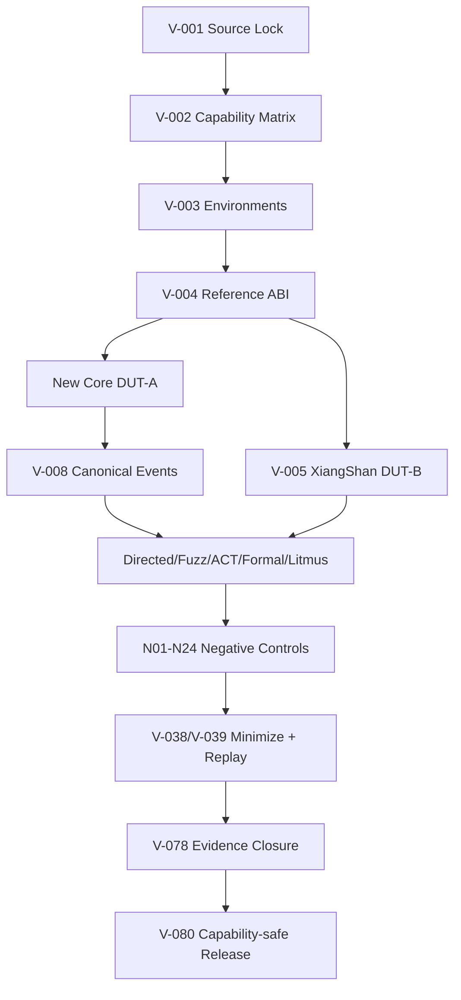

# 第6阶段：XiangShan/Verilator验证、参考模型、Formal、Litmus与失败复现

状态：**执行指南，不是已完成实现**。本分阶段文件供多人并行分配；所有命令、文件、测试和结果都必须等对应任务实现后产生。任何“完成”必须能引用真实 Git commit/artifact hash/日志，不凭口头状态。

## 1. 这个子系统是做什么的

建立可审计的程序化正确性证据：upstream来源闭合、真实reference ABI、负控制、ACT/fuzz/formal/litmus、XiangShan第二DUT对照和failure replay。

## 2. 为什么存在 / 上游输入

- 上游输入：S0合同；逐阶段与S1-S5并行。
- 已有依赖：冻结ISA/profile、XiangShan/Difftest/NEMU/Spike/Sail/Verilator候选来源。
- 本阶段输出：物理timing/板级证据；所有外部论文性能复现。
- 首要原则：验证团队不是最后阶段：V-001应在任何RTL依赖工具前完成，负控制必须随每个新能力扩展。XiangShan不是oracle；参考能力交集决定能否比。

来源/环境团队锁闭包；adapter团队管event/reference；test团队管理有限集合；formal/litmus团队独立判语义；triage团队最小化与replay；release团队闭合账本。

## 3. 总体结构

图中的箭头是数据/控制依赖；性能策略不得在正确性前打开。每个分支可以分给不同负责人，但跨接口字段以 [implementation-plan.md](implementation-plan.md) §1.3 和本文件任务卡为准，不能各团队私改。

## 4. 团队分工与进度追踪

| Team | 负责任务 | 当前状态 | Owner | 证据链接 | 下一动作 | Blocker |
|---|---|---|---|---|---|---|
| 验证负责人 | V-001 | Not started | 待定 | 待填 artifact/commit | 读取任务卡并建立输入锁 | 待填 |
| 验证负责人 | V-002 | Not started | 待定 | 待填 artifact/commit | 读取任务卡并建立输入锁 | 待填 |
| 验证负责人 | V-003 | Not started | 待定 | 待填 artifact/commit | 读取任务卡并建立输入锁 | 待填 |
| 验证负责人 | V-004 | Not started | 待定 | 待填 artifact/commit | 读取任务卡并建立输入锁 | 待填 |
| 验证负责人 | V-005 | Not started | 待定 | 待填 artifact/commit | 读取任务卡并建立输入锁 | 待填 |
| 验证负责人 | V-006 | Not started | 待定 | 待填 artifact/commit | 读取任务卡并建立输入锁 | 待填 |
| 验证负责人 | V-007 | Not started | 待定 | 待填 artifact/commit | 读取任务卡并建立输入锁 | 待填 |
| 验证负责人 | V-008 | Not started | 待定 | 待填 artifact/commit | 读取任务卡并建立输入锁 | 待填 |
| 验证负责人 | V-020 | Not started | 待定 | 待填 artifact/commit | 读取任务卡并建立输入锁 | 待填 |
| 验证负责人 | V-021 | Not started | 待定 | 待填 artifact/commit | 读取任务卡并建立输入锁 | 待填 |
| 验证负责人 | V-022 | Not started | 待定 | 待填 artifact/commit | 读取任务卡并建立输入锁 | 待填 |
| 验证负责人 | V-023 | Not started | 待定 | 待填 artifact/commit | 读取任务卡并建立输入锁 | 待填 |
| 验证负责人 | V-024 | Not started | 待定 | 待填 artifact/commit | 读取任务卡并建立输入锁 | 待填 |
| 验证负责人 | V-036 | Not started | 待定 | 待填 artifact/commit | 读取任务卡并建立输入锁 | 待填 |
| 验证负责人 | V-037 | Not started | 待定 | 待填 artifact/commit | 读取任务卡并建立输入锁 | 待填 |
| 验证负责人 | V-038 | Not started | 待定 | 待填 artifact/commit | 读取任务卡并建立输入锁 | 待填 |
| 验证负责人 | V-039 | Not started | 待定 | 待填 artifact/commit | 读取任务卡并建立输入锁 | 待填 |
| 验证负责人 | V-040 | Not started | 待定 | 待填 artifact/commit | 读取任务卡并建立输入锁 | 待填 |
| 验证负责人 | V-041 | Not started | 待定 | 待填 artifact/commit | 读取任务卡并建立输入锁 | 待填 |
| 验证负责人 | V-042 | Not started | 待定 | 待填 artifact/commit | 读取任务卡并建立输入锁 | 待填 |
| 验证负责人 | V-043 | Not started | 待定 | 待填 artifact/commit | 读取任务卡并建立输入锁 | 待填 |
| 多hart验证负责人 | V-075 | Not started | 待定 | 待填 artifact/commit | 读取任务卡并建立输入锁 | 待填 |
| 多hart验证负责人 | V-077 | Not started | 待定 | 待填 artifact/commit | 读取任务卡并建立输入锁 | 待填 |
| 多hart验证负责人 | V-078 | Not started | 待定 | 待填 artifact/commit | 读取任务卡并建立输入锁 | 待填 |
| 多hart验证负责人 | V-079 | Not started | 待定 | 待填 artifact/commit | 读取任务卡并建立输入锁 | 待填 |
| 多hart验证负责人 | V-080 | Not started | 待定 | 待填 artifact/commit | 读取任务卡并建立输入锁 | 待填 |
| p0集成负责人 | I-080 | Not started | 待定 | 待填 artifact/commit | 读取任务卡并建立输入锁 | 待填 |
| 硬件集成负责人 | I-081 | Not started | 待定 | 待填 artifact/commit | 读取任务卡并建立输入锁 | 待填 |
| p2集成负责人 | I-082 | Not started | 待定 | 待填 artifact/commit | 读取任务卡并建立输入锁 | 待填 |
| p3集成负责人 | I-083 | Not started | 待定 | 待填 artifact/commit | 读取任务卡并建立输入锁 | 待填 |
| 研究集成负责人 | I-084 | Not started | 待定 | 待填 artifact/commit | 读取任务卡并建立输入锁 | 待填 |
| ASIC集成负责人 | I-085 | Not started | 待定 | 待填 artifact/commit | 读取任务卡并建立输入锁 | 待填 |
| release负责人 | I-086 | Not started | 待定 | 待填 artifact/commit | 读取任务卡并建立输入锁 | 待填 |

状态只能取 `Not started / Inputs locked / In progress / Blocked / Evidence complete / Accepted`。Accepted 需要阶段负责人和验证负责人同时签字；Blocked 必须写最小外部事实、影响范围、请求对象和下一日期，不写“快好了”。

## 5. 可跟踪任务卡

每张卡先给设计者/审查者看的工程合同，再给执行者看的自然语言说明。说明不是替代规格，而是告诉执行者如何按规格工作：先做什么、不能猜什么、什么时候停下来、拿什么证据证明完成。完成定义：对应 `Pass` 全部有直接证据，相关负控制也工作；不是“代码写完”或“仿真曾跑过”。

### V-001 — 冻结上游闭包与来源账本

- **负责/门禁**：验证负责人；验证证据闭合。
- **前置依赖**：none；仍受 implementation-plan 集成依赖表约束。
- **做什么**：在实施环境收集 XiangShan 递归 gitlinks、NEMU config、参考库构建 provenance、工具版本及文件 hash；解析容器 tag 为 digest，区分源码重建库与预编译库。
- **输入数据/接口**：第 1 节 SHA、上游主源、架构 ISA 决议里程碑。
- **输出与交接**：不含浮动 branch/latest 的 source-lock 清单及来源证据。
- **设计取舍**：有限集合/模型边界明确，不用样本数冒充形式证明
- **实现微步骤**：冻结该任务输入、版本与capability交集；展开有限case/seed/budget manifest；实现真实检查器并接入负控制；执行正控制和故障注入；闭合计划/执行/通过/失败/unsupported计数；最小化失败并建立replay；阶段负责人签收或阻断后续gate。
- **主要阻塞风险**：静默skip、mock echo、空覆盖率、把deferred当成功；阻断规则：缺失子模块、配置混版、库来源未知、tag/digest 不一致或靠主机偶然 PATH。
- **验收证据**：每个可执行输入都有不可变标识、来源和许可证；表内 SHA 对应实际 checkout；未核实组合明确不进入执行 gate。；验证口径：每个可执行输入都有不可变标识、来源和许可证；表内 SHA 对应实际 checkout；未核实组合明确不进入执行 gate。
- **失败/回退动作**：缺失子模块、配置混版、库来源未知、tag/digest 不一致或靠主机偶然 PATH。
- **来源覆盖**：SRC-03 §XiangShan 的工程方法很适合借鉴；可重现性。；来源 VR-001, VR-002, VR-003, VR-004, VR-008。
- **执行者目标**：把“冻结上游闭包与来源账本”做成一个可复核的小交付：接收明确输入，产出可验证证据，并在失败时给出可回退的安全状态。
- **执行者须知**：先证明检查器能抓到真实错误，再接受正例。每个测试必须物化输入/seed/期望和排除账本；不可用空套件、mock echo或静默skip取得通过。完成前加入一个负控制并保存首个差异。
- **建议工作顺序**：冻结该任务输入、版本与capability交集；展开有限case/seed/budget manifest；实现真实检查器并接入负控制；执行正控制和故障注入；闭合计划/执行/通过/失败/unsupported计数；最小化失败并建立replay；阶段负责人签收或阻断后续gate。
- **可接受完成**：每个可执行输入都有不可变标识、来源和许可证；表内 SHA 对应实际 checkout；未核实组合明确不进入执行 gate。
- **何时停止求助**：主要风险是静默skip、mock echo、空覆盖率、把deferred当成功。遇到缺失输入、互相矛盾的合同、工具/板卡不可用或验证无法区分错误时，不要猜测；把任务标为Blocked，记录最小事实和需要的上游决定。
- **交付说明**：交接时提供输出：不含浮动 branch/latest 的 source-lock 清单及来源证据。；同时更新Track Log、状态、证据hash/commit和下一步。不要把未验证的半成品标成Evidence complete。
- **参考资料**：VR-001, VR-002, VR-003, VR-004, VR-008。
- **进度日志**：2026-09-29 规划生成——未开始；后续每次状态变化追加日期、commit/artifact、证据和下一步。

### V-002 — 建立 capability 交集而非扩展并集

- **负责/门禁**：验证负责人；验证证据闭合。
- **前置依赖**：V-001；仍受 implementation-plan 集成依赖表约束。
- **做什么**：为 DUT、XiangShan、NEMU、Spike、Sail、ACT4 分别列 XLEN、扩展版本、CSR、PMP/PMA、地址宽度、VLEN/ELEN、misaligned policy、trap 可选行为；计算逐 workload 可比交集及明确 unsupported 原因。
- **输入数据/接口**：ISA/privilege/profile 决议、编译器选项、各模型精确配置。
- **输出与交接**：capability-matrix 与每 suite 的适用/拒绝集合。
- **设计取舍**：有限集合/模型边界明确，不用样本数冒充形式证明
- **实现微步骤**：冻结该任务输入、版本与capability交集；展开有限case/seed/budget manifest；实现真实检查器并接入负控制；执行正控制和故障注入；闭合计划/执行/通过/失败/unsupported计数；最小化失败并建立replay；阶段负责人签收或阻断后续gate。
- **主要阻塞风险**：静默skip、mock echo、空覆盖率、把deferred当成功；阻断规则：把 `G` 当 IM、把 upstream config 的 V/H/Sv48 当本核承诺、缺功能被误记通过。
- **验收证据**：p0 只生成 RV64IM_Zicsr_Zifencei/M-mode 程序；交集之外的测试不能执行后才悄悄 skip；后续扩展保留待验收行。；验证口径：p0 只生成 RV64IM_Zicsr_Zifencei/M-mode 程序；交集之外的测试不能执行后才悄悄 skip；后续扩展保留待验收行。
- **失败/回退动作**：把 `G` 当 IM、把 upstream config 的 V/H/Sv48 当本核承诺、缺功能被误记通过。
- **来源覆盖**：SRC-03 §最小原型应该是 Scalar Elastic Backend、§RVV 与 CPU—GPU 连续体。；来源 VR-003, VR-005, VR-006, VR-007, VR-009, VR-013。
- **执行者目标**：把“建立 capability 交集而非扩展并集”做成一个可复核的小交付：接收明确输入，产出可验证证据，并在失败时给出可回退的安全状态。
- **执行者须知**：先证明检查器能抓到真实错误，再接受正例。每个测试必须物化输入/seed/期望和排除账本；不可用空套件、mock echo或静默skip取得通过。完成前加入一个负控制并保存首个差异。
- **建议工作顺序**：冻结该任务输入、版本与capability交集；展开有限case/seed/budget manifest；实现真实检查器并接入负控制；执行正控制和故障注入；闭合计划/执行/通过/失败/unsupported计数；最小化失败并建立replay；阶段负责人签收或阻断后续gate。
- **可接受完成**：p0 只生成 RV64IM_Zicsr_Zifencei/M-mode 程序；交集之外的测试不能执行后才悄悄 skip；后续扩展保留待验收行。
- **何时停止求助**：主要风险是静默skip、mock echo、空覆盖率、把deferred当成功。遇到缺失输入、互相矛盾的合同、工具/板卡不可用或验证无法区分错误时，不要猜测；把任务标为Blocked，记录最小事实和需要的上游决定。
- **交付说明**：交接时提供输出：capability-matrix 与每 suite 的适用/拒绝集合。；同时更新Track Log、状态、证据hash/commit和下一步。不要把未验证的半成品标成Evidence complete。
- **参考资料**：VR-003, VR-005, VR-006, VR-007, VR-009, VR-013。
- **进度日志**：2026-09-29 规划生成——未开始；后续每次状态变化追加日期、commit/artifact、证据和下一步。

### V-003 — 校准隔离环境与失败退出

- **负责/门禁**：验证负责人；验证证据闭合。
- **前置依赖**：V-001；仍受 implementation-plan 集成依赖表约束。
- **做什么**：在未来实施环境建立 A/B 两套锁定环境，运行版本/帮助检查及缺库、错误架构库、无写权限输出目录三个失败场景；记录构建资源峰值但不改硬件预算。
- **输入数据/接口**：容器/主机依赖清单、未来 CLI 契约。
- **输出与交接**：环境证据包与 CLI 退出码对照。
- **设计取舍**：有限集合/模型边界明确，不用样本数冒充形式证明
- **实现微步骤**：冻结该任务输入、版本与capability交集；展开有限case/seed/budget manifest；实现真实检查器并接入负控制；执行正控制和故障注入；闭合计划/执行/通过/失败/unsupported计数；最小化失败并建立replay；阶段负责人签收或阻断后续gate。
- **主要阻塞风险**：静默skip、mock echo、空覆盖率、把deferred当成功；阻断规则：自动回退无 reference、联网获取未锁依赖、把工具 crash 记为 DUT PASS。
- **验收证据**：所有工具与锁一致；三种故障明确非零并有诊断；从空输出目录开始可独立重建同一输入集合。；验证口径：所有工具与锁一致；三种故障明确非零并有诊断；从空输出目录开始可独立重建同一输入集合。
- **失败/回退动作**：自动回退无 reference、联网获取未锁依赖、把工具 crash 记为 DUT PASS。
- **来源覆盖**：SRC-03 §FPGA 原型与验证路线；可复现宿主环境。；来源 VR-002, VR-005, VR-006, VR-007, VR-008, VR-009。
- **执行者目标**：把“校准隔离环境与失败退出”做成一个可复核的小交付：接收明确输入，产出可验证证据，并在失败时给出可回退的安全状态。
- **执行者须知**：先证明检查器能抓到真实错误，再接受正例。每个测试必须物化输入/seed/期望和排除账本；不可用空套件、mock echo或静默skip取得通过。完成前加入一个负控制并保存首个差异。
- **建议工作顺序**：冻结该任务输入、版本与capability交集；展开有限case/seed/budget manifest；实现真实检查器并接入负控制；执行正控制和故障注入；闭合计划/执行/通过/失败/unsupported计数；最小化失败并建立replay；阶段负责人签收或阻断后续gate。
- **可接受完成**：所有工具与锁一致；三种故障明确非零并有诊断；从空输出目录开始可独立重建同一输入集合。
- **何时停止求助**：主要风险是静默skip、mock echo、空覆盖率、把deferred当成功。遇到缺失输入、互相矛盾的合同、工具/板卡不可用或验证无法区分错误时，不要猜测；把任务标为Blocked，记录最小事实和需要的上游决定。
- **交付说明**：交接时提供输出：环境证据包与 CLI 退出码对照。；同时更新Track Log、状态、证据hash/commit和下一步。不要把未验证的半成品标成Evidence complete。
- **参考资料**：VR-002, VR-005, VR-006, VR-007, VR-008, VR-009。
- **进度日志**：2026-09-29 规划生成——未开始；后续每次状态变化追加日期、commit/artifact、证据和下一步。

### V-004 — 验证 NEMU ABI 与序列化布局

- **负责/门禁**：验证负责人；验证证据闭合。
- **前置依赖**：V-001, V-002, V-003；仍受 implementation-plan 集成依赖表约束。
- **做什么**：逐符号核对原型、bool/enum/struct 布局和宏；用独立状态写入/读回、已知两条算术指令及一次 store 验证方向；再加载缺符号与错误布局库确认 fail-closed。
- **输入数据/接口**：冻结 refproxy、NEMU reference 库、canonical-state 定义。
- **输出与交接**：ABI manifest、状态 round-trip、实际 reference-step 语义与负控制日志。
- **设计取舍**：有限集合/模型边界明确，不用样本数冒充形式证明
- **实现微步骤**：冻结该任务输入、版本与capability交集；展开有限case/seed/budget manifest；实现真实检查器并接入负控制；执行正控制和故障注入；闭合计划/执行/通过/失败/unsupported计数；最小化失败并建立replay；阶段负责人签收或阻断后续gate。
- **主要阻塞风险**：静默skip、mock echo、空覆盖率、把deferred当成功；阻断规则：两参数 regcpy 误接三参数 ABI、状态截断、大小相等但字段顺序错误、缺扩展符号静默忽略。
- **验收证据**：所有字段按预期读回且 reference 真正执行产生已知结果；错库在任何 DUT 执行前拒绝；不能只做 mock echo。；验证口径：所有字段按预期读回且 reference 真正执行产生已知结果；错库在任何 DUT 执行前拒绝；不能只做 mock echo。
- **失败/回退动作**：两参数 regcpy 误接三参数 ABI、状态截断、大小相等但字段顺序错误、缺扩展符号静默忽略。
- **来源覆盖**：SRC-03 §XiangShan 的工程方法很适合借鉴；reference adapter。；来源 VR-003, VR-004, VR-005。
- **执行者目标**：把“NEMU ABI 与序列化布局”做成一个可复核的小交付：接收明确输入，产出可验证证据，并在失败时给出可回退的安全状态。
- **执行者须知**：先证明检查器能抓到真实错误，再接受正例。每个测试必须物化输入/seed/期望和排除账本；不可用空套件、mock echo或静默skip取得通过。完成前加入一个负控制并保存首个差异。
- **建议工作顺序**：冻结该任务输入、版本与capability交集；展开有限case/seed/budget manifest；实现真实检查器并接入负控制；执行正控制和故障注入；闭合计划/执行/通过/失败/unsupported计数；最小化失败并建立replay；阶段负责人签收或阻断后续gate。
- **可接受完成**：所有字段按预期读回且 reference 真正执行产生已知结果；错库在任何 DUT 执行前拒绝；不能只做 mock echo。
- **何时停止求助**：主要风险是静默skip、mock echo、空覆盖率、把deferred当成功。遇到缺失输入、互相矛盾的合同、工具/板卡不可用或验证无法区分错误时，不要猜测；把任务标为Blocked，记录最小事实和需要的上游决定。
- **交付说明**：交接时提供输出：ABI manifest、状态 round-trip、实际 reference-step 语义与负控制日志。；同时更新Track Log、状态、证据hash/commit和下一步。不要把未验证的半成品标成Evidence complete。
- **参考资料**：VR-003, VR-004, VR-005。
- **进度日志**：2026-09-29 规划生成——未开始；后续每次状态变化追加日期、commit/artifact、证据和下一步。

### V-005 — 执行 XiangShan 上游环境正控制

- **负责/门禁**：验证负责人；验证证据闭合。
- **前置依赖**：V-003, V-004；仍受 implementation-plan 集成依赖表约束。
- **做什么**：未来按第 2 节原例构建并运行 XiangShan+NEMU；保存完整 build 配置、Difftest 开启证据、退出原因及首尾 commit；不将样例迁就成 p0。
- **输入数据/接口**：来源闭合的上游组合、ready-to-run coremark、上游 README 示例。
- **输出与交接**：独立 DUT-B 环境校准记录。
- **设计取舍**：有限集合/模型边界明确，不用样本数冒充形式证明
- **实现微步骤**：冻结该任务输入、版本与capability交集；展开有限case/seed/budget manifest；实现真实检查器并接入负控制；执行正控制和故障注入；闭合计划/执行/通过/失败/unsupported计数；最小化失败并建立replay；阶段负责人签收或阻断后续gate。
- **主要阻塞风险**：静默skip、mock echo、空覆盖率、把deferred当成功；阻断规则：没加载 reference、只看进程退出 0、替换 workload/配置后仍称上游原例通过。
- **验收证据**：样例按其退出协议完成、比较器确实工作且无 mismatch；结果只证明该环境路径。；验证口径：样例按其退出协议完成、比较器确实工作且无 mismatch；结果只证明该环境路径。
- **失败/回退动作**：没加载 reference、只看进程退出 0、替换 workload/配置后仍称上游原例通过。
- **来源覆盖**：SRC-03 §XiangShan 的工程方法很适合借鉴。；来源 VR-002, VR-004。
- **执行者目标**：把“执行 XiangShan 上游环境正控制”做成一个可复核的小交付：接收明确输入，产出可验证证据，并在失败时给出可回退的安全状态。
- **执行者须知**：先证明检查器能抓到真实错误，再接受正例。每个测试必须物化输入/seed/期望和排除账本；不可用空套件、mock echo或静默skip取得通过。完成前加入一个负控制并保存首个差异。
- **建议工作顺序**：冻结该任务输入、版本与capability交集；展开有限case/seed/budget manifest；实现真实检查器并接入负控制；执行正控制和故障注入；闭合计划/执行/通过/失败/unsupported计数；最小化失败并建立replay；阶段负责人签收或阻断后续gate。
- **可接受完成**：样例按其退出协议完成、比较器确实工作且无 mismatch；结果只证明该环境路径。
- **何时停止求助**：主要风险是静默skip、mock echo、空覆盖率、把deferred当成功。遇到缺失输入、互相矛盾的合同、工具/板卡不可用或验证无法区分错误时，不要猜测；把任务标为Blocked，记录最小事实和需要的上游决定。
- **交付说明**：交接时提供输出：独立 DUT-B 环境校准记录。；同时更新Track Log、状态、证据hash/commit和下一步。不要把未验证的半成品标成Evidence complete。
- **参考资料**：VR-002, VR-004。
- **进度日志**：2026-09-29 规划生成——未开始；后续每次状态变化追加日期、commit/artifact、证据和下一步。

### V-006 — 校准独立 Spike 与 Sail 语义

- **负责/门禁**：验证负责人；验证证据闭合。
- **前置依赖**：V-002, V-003；仍受 implementation-plan 集成依赖表约束。
- **做什么**：使用各模型官方 CLI/配置运行同一 ISA 交集程序，比较寄存器/签名与明确语义；记录 C++ API 或日志 adapter 的版本边界，遇分歧最小化并查规范。
- **输入数据/接口**：主线 Spike pin、Sail 0.14.1、12 个无外设依赖的小程序。
- **输出与交接**：三参考三角对照表、模型差异记录。
- **设计取舍**：有限集合/模型边界明确，不用样本数冒充形式证明
- **实现微步骤**：冻结该任务输入、版本与capability交集；展开有限case/seed/budget manifest；实现真实检查器并接入负控制；执行正控制和故障注入；闭合计划/执行/通过/失败/unsupported计数；最小化失败并建立replay；阶段负责人签收或阻断后续gate。
- **主要阻塞风险**：静默skip、mock echo、空覆盖率、把deferred当成功；阻断规则：把主线 Spike 当 NEMU ABI `.so`、默认 Sail 最大配置冒充 p0、用二比一投票解决规范争议。
- **验收证据**：12 个程序在确定性字段一致；允许差异由规范条款解释且有独立合法性检查。；验证口径：12 个程序在确定性字段一致；允许差异由规范条款解释且有独立合法性检查。
- **失败/回退动作**：把主线 Spike 当 NEMU ABI `.so`、默认 Sail 最大配置冒充 p0、用二比一投票解决规范争议。
- **来源覆盖**：SRC-03 §Retire/architectural correctness 建议。；来源 VR-005, VR-006, VR-007。
- **执行者目标**：把“校准独立 Spike 与 Sail 语义”做成一个可复核的小交付：接收明确输入，产出可验证证据，并在失败时给出可回退的安全状态。
- **执行者须知**：先证明检查器能抓到真实错误，再接受正例。每个测试必须物化输入/seed/期望和排除账本；不可用空套件、mock echo或静默skip取得通过。完成前加入一个负控制并保存首个差异。
- **建议工作顺序**：冻结该任务输入、版本与capability交集；展开有限case/seed/budget manifest；实现真实检查器并接入负控制；执行正控制和故障注入；闭合计划/执行/通过/失败/unsupported计数；最小化失败并建立replay；阶段负责人签收或阻断后续gate。
- **可接受完成**：12 个程序在确定性字段一致；允许差异由规范条款解释且有独立合法性检查。
- **何时停止求助**：主要风险是静默skip、mock echo、空覆盖率、把deferred当成功。遇到缺失输入、互相矛盾的合同、工具/板卡不可用或验证无法区分错误时，不要猜测；把任务标为Blocked，记录最小事实和需要的上游决定。
- **交付说明**：交接时提供输出：三参考三角对照表、模型差异记录。；同时更新Track Log、状态、证据hash/commit和下一步。不要把未验证的半成品标成Evidence complete。
- **参考资料**：VR-005, VR-006, VR-007。
- **进度日志**：2026-09-29 规划生成——未开始；后续每次状态变化追加日期、commit/artifact、证据和下一步。

### V-007 — 固定通用 ELF 与平台入口

- **负责/门禁**：验证负责人；验证证据闭合。
- **前置依赖**：V-002, V-006；仍受 implementation-plan 集成依赖表约束。
- **做什么**：生成 freestanding/static LP64 ELF，反汇编审计实际 ISA，固定 entry、stack、BSS、RAM、trap vector；导出 PT_LOAD 内容及 binary 转换 provenance，禁用未经审计的 libc/编译器扩展。
- **输入数据/接口**：交叉工具链、p0 平台描述、linker/startup/退出协议实现里程碑。
- **输出与交接**：兼容 ELF 契约及首个跨环境程序包。
- **设计取舍**：有限集合/模型边界明确，不用样本数冒充形式证明
- **实现微步骤**：冻结该任务输入、版本与capability交集；展开有限case/seed/budget manifest；实现真实检查器并接入负控制；执行正控制和故障注入；闭合计划/执行/通过/失败/unsupported计数；最小化失败并建立replay；阶段负责人签收或阻断后续gate。
- **主要阻塞风险**：静默skip、mock echo、空覆盖率、把deferred当成功；阻断规则：默认编译器悄悄使用 C/A/F、把用户态 ELF 当 bare-metal、假设不同 reset ROM 相同。
- **验收证据**：指令、初始化字节、entry 与终止协议均在 DUT/ref 交集；原 ELF 与转换 image 在声明加载地址的字节一致。；验证口径：指令、初始化字节、entry 与终止协议均在 DUT/ref 交集；原 ELF 与转换 image 在声明加载地址的字节一致。
- **失败/回退动作**：默认编译器悄悄使用 C/A/F、把用户态 ELF 当 bare-metal、假设不同 reset ROM 相同。
- **来源覆盖**：SRC-03 §software sees normal RISC-V、§最小原型应该是 Scalar Elastic Backend。；来源 VR-002, VR-005, VR-006, VR-007, VR-009。
- **执行者目标**：把“固定通用 ELF 与平台入口”做成一个可复核的小交付：接收明确输入，产出可验证证据，并在失败时给出可回退的安全状态。
- **执行者须知**：先证明检查器能抓到真实错误，再接受正例。每个测试必须物化输入/seed/期望和排除账本；不可用空套件、mock echo或静默skip取得通过。完成前加入一个负控制并保存首个差异。
- **建议工作顺序**：冻结该任务输入、版本与capability交集；展开有限case/seed/budget manifest；实现真实检查器并接入负控制；执行正控制和故障注入；闭合计划/执行/通过/失败/unsupported计数；最小化失败并建立replay；阶段负责人签收或阻断后续gate。
- **可接受完成**：指令、初始化字节、entry 与终止协议均在 DUT/ref 交集；原 ELF 与转换 image 在声明加载地址的字节一致。
- **何时停止求助**：主要风险是静默skip、mock echo、空覆盖率、把deferred当成功。遇到缺失输入、互相矛盾的合同、工具/板卡不可用或验证无法区分错误时，不要猜测；把任务标为Blocked，记录最小事实和需要的上游决定。
- **交付说明**：交接时提供输出：兼容 ELF 契约及首个跨环境程序包。；同时更新Track Log、状态、证据hash/commit和下一步。不要把未验证的半成品标成Evidence complete。
- **参考资料**：VR-002, VR-005, VR-006, VR-007, VR-009。
- **进度日志**：2026-09-29 规划生成——未开始；后续每次状态变化追加日期、commit/artifact、证据和下一步。

### V-008 — 冻结 architectural event 接口

- **负责/门禁**：验证负责人；验证证据闭合。
- **前置依赖**：V-002, V-004；仍受 implementation-plan 集成依赖表约束。
- **做什么**：编写每字段宽度、有效性、边界顺序与采样时刻；对两条同周期指令加 trap、store drain 的实际序列手工推导事件，分别经 SV/C++ 序列化校验。
- **输入数据/接口**：第 3 节 event schema、退休接口实现里程碑、路线 A/B 选择。
- **输出与交接**：版本化 schema、探针映射与逐步期望事件表。
- **设计取舍**：有限集合/模型边界明确，不用样本数冒充形式证明
- **实现微步骤**：冻结该任务输入、版本与capability交集；展开有限case/seed/budget manifest；实现真实检查器并接入负控制；执行正控制和故障注入；闭合计划/执行/通过/失败/unsupported计数；最小化失败并建立replay；阶段负责人签收或阻断后续gate。
- **主要阻塞风险**：静默skip、mock echo、空覆盖率、把deferred当成功；阻断规则：只暴露执行结果不暴露退休状态、多个退休共享一份错误快照、vector 被固定截为低 128 位。
- **验收证据**：每个 architectural effect 可定位到唯一 hart/指令；没有无定义字段或跨周期错位；路线 B 生成物与软件端完全同版。；验证口径：每个 architectural effect 可定位到唯一 hart/指令；没有无定义字段或跨周期错位；路线 B 生成物与软件端完全同版。
- **失败/回退动作**：只暴露执行结果不暴露退休状态、多个退休共享一份错误快照、vector 被固定截为低 128 位。
- **来源覆盖**：SRC-03 §uOP 不应该只是传统 CPU 的 micro-op、§Per-Hart Commit Domain。；来源 VR-003, VR-008, VR-011。
- **执行者目标**：把“冻结 architectural event 接口”做成一个可复核的小交付：接收明确输入，产出可验证证据，并在失败时给出可回退的安全状态。
- **执行者须知**：先证明检查器能抓到真实错误，再接受正例。每个测试必须物化输入/seed/期望和排除账本；不可用空套件、mock echo或静默skip取得通过。完成前加入一个负控制并保存首个差异。
- **建议工作顺序**：冻结该任务输入、版本与capability交集；展开有限case/seed/budget manifest；实现真实检查器并接入负控制；执行正控制和故障注入；闭合计划/执行/通过/失败/unsupported计数；最小化失败并建立replay；阶段负责人签收或阻断后续gate。
- **可接受完成**：每个 architectural effect 可定位到唯一 hart/指令；没有无定义字段或跨周期错位；路线 B 生成物与软件端完全同版。
- **何时停止求助**：主要风险是静默skip、mock echo、空覆盖率、把deferred当成功。遇到缺失输入、互相矛盾的合同、工具/板卡不可用或验证无法区分错误时，不要猜测；把任务标为Blocked，记录最小事实和需要的上游决定。
- **交付说明**：交接时提供输出：版本化 schema、探针映射与逐步期望事件表。；同时更新Track Log、状态、证据hash/commit和下一步。不要把未验证的半成品标成Evidence complete。
- **参考资料**：VR-003, VR-008, VR-011。
- **进度日志**：2026-09-29 规划生成——未开始；后续每次状态变化追加日期、commit/artifact、证据和下一步。

### V-020 — 禁止静默 exclusions 与 reference skip

- **负责/门禁**：验证负责人；验证证据闭合。
- **前置依赖**：V-017, V-019；仍受 implementation-plan 集成依赖表约束。
- **做什么**：枚举所有禁用 checker、skip、CSR waive、未实现 reference feature、超时与生成失败；每项记录原因、规范依据、替代验证、受影响 case/字段和结束条件；未登记项故意触发拒绝。
- **输入数据/接口**：每个 source/profile 比较规则、ACT4 默认 exclusion、Difftest waive/skip 路径。
- **输出与交接**：机器可读 exclusion ledger 与计数闭合报告。
- **设计取舍**：有限集合/模型边界明确，不用样本数冒充形式证明
- **实现微步骤**：冻结该任务输入、版本与capability交集；展开有限case/seed/budget manifest；实现真实检查器并接入负控制；执行正控制和故障注入；闭合计划/执行/通过/失败/unsupported计数；最小化失败并建立replay；阶段负责人签收或阻断后续gate。
- **主要阻塞风险**：静默skip、mock echo、空覆盖率、把deferred当成功；阻断规则：用 broad skip/ignore_illegal_mem_access 掩盖错误，测试被 filter 后不在总数，waive 同步 DUT→REF 后缺独立检查。
- **验收证据**：未登记排除为 0；任何已承诺功能不能仅以 waiver 获得验收；新规则必须通过负控制。；验证口径：未登记排除为 0；任何已承诺功能不能仅以 waiver 获得验收；新规则必须通过负控制。
- **失败/回退动作**：用 broad skip/ignore_illegal_mem_access 掩盖错误，测试被 filter 后不在总数，waive 同步 DUT→REF 后缺独立检查。
- **来源覆盖**：SRC-03 §architectural verification retirement boundary；验证可信性。；来源 VR-003, VR-009。
- **执行者目标**：把“禁止静默 exclusions 与 reference skip”做成一个可复核的小交付：接收明确输入，产出可验证证据，并在失败时给出可回退的安全状态。
- **执行者须知**：先证明检查器能抓到真实错误，再接受正例。每个测试必须物化输入/seed/期望和排除账本；不可用空套件、mock echo或静默skip取得通过。完成前加入一个负控制并保存首个差异。
- **建议工作顺序**：冻结该任务输入、版本与capability交集；展开有限case/seed/budget manifest；实现真实检查器并接入负控制；执行正控制和故障注入；闭合计划/执行/通过/失败/unsupported计数；最小化失败并建立replay；阶段负责人签收或阻断后续gate。
- **可接受完成**：未登记排除为 0；任何已承诺功能不能仅以 waiver 获得验收；新规则必须通过负控制。
- **何时停止求助**：主要风险是静默skip、mock echo、空覆盖率、把deferred当成功。遇到缺失输入、互相矛盾的合同、工具/板卡不可用或验证无法区分错误时，不要猜测；把任务标为Blocked，记录最小事实和需要的上游决定。
- **交付说明**：交接时提供输出：机器可读 exclusion ledger 与计数闭合报告。；同时更新Track Log、状态、证据hash/commit和下一步。不要把未验证的半成品标成Evidence complete。
- **参考资料**：VR-003, VR-009。
- **进度日志**：2026-09-29 规划生成——未开始；后续每次状态变化追加日期、commit/artifact、证据和下一步。

### V-021 — 注入真实整数与 CSR 差异

- **负责/门禁**：验证负责人；验证证据闭合。
- **前置依赖**：V-013, V-017, V-020；仍受 implementation-plan 集成依赖表约束。
- **做什么**：在已执行路径翻转 ALU add 结果、x0 写保护、sign extension、CSR 一位；F 启用后额外破坏 sticky fflags；同程序运行无故障/有故障两构建，保存首次受影响 retire。
- **输入数据/接口**：可运行 DUT 及独立故障注入构建、calibration-v1。
- **输出与交接**：故障 site→checker→首次差异矩阵。
- **设计取舍**：有限集合/模型边界明确，不用样本数冒充形式证明
- **实现微步骤**：冻结该任务输入、版本与capability交集；展开有限case/seed/budget manifest；实现真实检查器并接入负控制；执行正控制和故障注入；闭合计划/执行/通过/失败/unsupported计数；最小化失败并建立replay；阶段负责人签收或阻断后续gate。
- **主要阻塞风险**：静默skip、mock echo、空覆盖率、把deferred当成功；阻断规则：只改 expected 文件、mock mismatch、注入点没执行、错误被状态同步消掉、仅检测最终 checksum 却漏首差异。
- **验收证据**：无故障正控制全过；每个注入确实改变 DUT architectural state，且比较器在首个应检查边界报非零。；验证口径：无故障正控制全过；每个注入确实改变 DUT architectural state，且比较器在首个应检查边界报非零。
- **失败/回退动作**：只改 expected 文件、mock mismatch、注入点没执行、错误被状态同步消掉、仅检测最终 checksum 却漏首差异。
- **来源覆盖**：SRC-03 §Retire architectural destination/CSR effects。；来源 VR-003, VR-011。
- **执行者目标**：把“注入真实整数与 CSR 差异”做成一个可复核的小交付：接收明确输入，产出可验证证据，并在失败时给出可回退的安全状态。
- **执行者须知**：先证明检查器能抓到真实错误，再接受正例。每个测试必须物化输入/seed/期望和排除账本；不可用空套件、mock echo或静默skip取得通过。完成前加入一个负控制并保存首个差异。
- **建议工作顺序**：冻结该任务输入、版本与capability交集；展开有限case/seed/budget manifest；实现真实检查器并接入负控制；执行正控制和故障注入；闭合计划/执行/通过/失败/unsupported计数；最小化失败并建立replay；阶段负责人签收或阻断后续gate。
- **可接受完成**：无故障正控制全过；每个注入确实改变 DUT architectural state，且比较器在首个应检查边界报非零。
- **何时停止求助**：主要风险是静默skip、mock echo、空覆盖率、把deferred当成功。遇到缺失输入、互相矛盾的合同、工具/板卡不可用或验证无法区分错误时，不要猜测；把任务标为Blocked，记录最小事实和需要的上游决定。
- **交付说明**：交接时提供输出：故障 site→checker→首次差异矩阵。；同时更新Track Log、状态、证据hash/commit和下一步。不要把未验证的半成品标成Evidence complete。
- **参考资料**：VR-003, VR-011。
- **进度日志**：2026-09-29 规划生成——未开始；后续每次状态变化追加日期、commit/artifact、证据和下一步。

### V-022 — 注入 PC、trap 与 interrupt 错误

- **负责/门禁**：验证负责人；验证证据闭合。
- **前置依赖**：V-014, V-015, V-016, V-020；仍受 implementation-plan 集成依赖表约束。
- **做什么**：分别改 branch target 一位、mepc 偏移、mcause、IRQ enable 判断、trap 后 younger-retire；对每项证明路径激活后检查器报告对应字段。
- **输入数据/接口**：branch/trap/IRQ 正控制、可定位 RTL 注入点。
- **输出与交接**：控制流故障检测证据。
- **设计取舍**：有限集合/模型边界明确，不用样本数冒充形式证明
- **实现微步骤**：冻结该任务输入、版本与capability交集；展开有限case/seed/budget manifest；实现真实检查器并接入负控制；执行正控制和故障注入；闭合计划/执行/通过/失败/unsupported计数；最小化失败并建立replay；阶段负责人签收或阻断后续gate。
- **主要阻塞风险**：静默skip、mock echo、空覆盖率、把deferred当成功；阻断规则：checker 只看 rd 无法发现错误 PC/trap，缺 IRQ event 被当合法延迟，timeout 被当 mismatch 的替代证据。
- **验收证据**：所有实际注入均在正确事件定位；trap 没有成功退休时仍能检出。；验证口径：所有实际注入均在正确事件定位；trap 没有成功退休时仍能检出。
- **失败/回退动作**：checker 只看 rd 无法发现错误 PC/trap，缺 IRQ event 被当合法延迟，timeout 被当 mismatch 的替代证据。
- **来源覆盖**：SRC-03 §No older unresolved exception、§Branch recovery。；来源 VR-003, VR-012。
- **执行者目标**：把“注入 PC、trap 与 interrupt 错误”做成一个可复核的小交付：接收明确输入，产出可验证证据，并在失败时给出可回退的安全状态。
- **执行者须知**：先证明检查器能抓到真实错误，再接受正例。每个测试必须物化输入/seed/期望和排除账本；不可用空套件、mock echo或静默skip取得通过。完成前加入一个负控制并保存首个差异。
- **建议工作顺序**：冻结该任务输入、版本与capability交集；展开有限case/seed/budget manifest；实现真实检查器并接入负控制；执行正控制和故障注入；闭合计划/执行/通过/失败/unsupported计数；最小化失败并建立replay；阶段负责人签收或阻断后续gate。
- **可接受完成**：所有实际注入均在正确事件定位；trap 没有成功退休时仍能检出。
- **何时停止求助**：主要风险是静默skip、mock echo、空覆盖率、把deferred当成功。遇到缺失输入、互相矛盾的合同、工具/板卡不可用或验证无法区分错误时，不要猜测；把任务标为Blocked，记录最小事实和需要的上游决定。
- **交付说明**：交接时提供输出：控制流故障检测证据。；同时更新Track Log、状态、证据hash/commit和下一步。不要把未验证的半成品标成Evidence complete。
- **参考资料**：VR-003, VR-012。
- **进度日志**：2026-09-29 规划生成——未开始；后续每次状态变化追加日期、commit/artifact、证据和下一步。

### V-023 — 注入 store、MMIO 与 vector 高位错误

- **负责/门禁**：验证负责人；验证证据闭合。
- **前置依赖**：V-018, V-019, V-020；仍受 implementation-plan 集成依赖表约束。
- **做什么**：修改 store byte-enable、PA、数据，制造重复 MMIO 写；V 启用后改变向量高 64-bit、mask bit、vstart、被保护 inactive element 与 FOF 最终 vl，分别运行。
- **输入数据/接口**：memory/设备正控制；vector 里程碑启用时追加高位正控制。
- **输出与交接**：不依赖普通 GPR 的故障检测矩阵。
- **设计取舍**：有限集合/模型边界明确，不用样本数冒充形式证明
- **实现微步骤**：冻结该任务输入、版本与capability交集；展开有限case/seed/budget manifest；实现真实检查器并接入负控制；执行正控制和故障注入；闭合计划/执行/通过/失败/unsupported计数；最小化失败并建立replay；阶段负责人签收或阻断后续gate。
- **主要阻塞风险**：静默skip、mock echo、空覆盖率、把deferred当成功；阻断规则：仅最终 GPR 一致便通过、vec trace 截断、全屏蔽 agnostic region 导致非法值通过。
- **验收证据**：可见内存/设备/向量错误全部被对应 checker 检出；未启用 vector 明确为 deferred 且阻止 V gate。；验证口径：可见内存/设备/向量错误全部被对应 checker 检出；未启用 vector 明确为 deferred 且阻止 V gate。
- **失败/回退动作**：仅最终 GPR 一致便通过、vec trace 截断、全屏蔽 agnostic region 导致非法值通过。
- **来源覆盖**：SRC-03 §Memory Fabric、§Vector Macro-uOP、§precise semantics。；来源 VR-003, VR-013, VR-014。
- **执行者目标**：把“注入 store、MMIO 与 vector 高位错误”做成一个可复核的小交付：接收明确输入，产出可验证证据，并在失败时给出可回退的安全状态。
- **执行者须知**：先证明检查器能抓到真实错误，再接受正例。每个测试必须物化输入/seed/期望和排除账本；不可用空套件、mock echo或静默skip取得通过。完成前加入一个负控制并保存首个差异。
- **建议工作顺序**：冻结该任务输入、版本与capability交集；展开有限case/seed/budget manifest；实现真实检查器并接入负控制；执行正控制和故障注入；闭合计划/执行/通过/失败/unsupported计数；最小化失败并建立replay；阶段负责人签收或阻断后续gate。
- **可接受完成**：可见内存/设备/向量错误全部被对应 checker 检出；未启用 vector 明确为 deferred 且阻止 V gate。
- **何时停止求助**：主要风险是静默skip、mock echo、空覆盖率、把deferred当成功。遇到缺失输入、互相矛盾的合同、工具/板卡不可用或验证无法区分错误时，不要猜测；把任务标为Blocked，记录最小事实和需要的上游决定。
- **交付说明**：交接时提供输出：不依赖普通 GPR 的故障检测矩阵。；同时更新Track Log、状态、证据hash/commit和下一步。不要把未验证的半成品标成Evidence complete。
- **参考资料**：VR-003, VR-013, VR-014。
- **进度日志**：2026-09-29 规划生成——未开始；后续每次状态变化追加日期、commit/artifact、证据和下一步。

### V-024 — 注入 trace 丢失、重复与乱序

- **负责/门禁**：验证负责人；验证证据闭合。
- **前置依赖**：V-008, V-020；仍受 implementation-plan 集成依赖表约束。
- **做什么**：在 DUT 事件传输边界丢一个 commit、复制一个 store、交换同 hart 相邻事件、错 hart ID、截断文件；与原始 trace 分别 replay。
- **输入数据/接口**：真实 DUT canonical event trace、transport checker。
- **输出与交接**：事件完整性故障检测记录。
- **设计取舍**：有限集合/模型边界明确，不用样本数冒充形式证明
- **实现微步骤**：冻结该任务输入、版本与capability交集；展开有限case/seed/budget manifest；实现真实检查器并接入负控制；执行正控制和故障注入；闭合计划/执行/通过/失败/unsupported计数；最小化失败并建立replay；阶段负责人签收或阻断后续gate。
- **主要阻塞风险**：静默skip、mock echo、空覆盖率、把deferred当成功；阻断规则：只以末尾 pass magic 判成功、按 PC 去重合法重复 loop、跨 hart 事件串扰未报。
- **验收证据**：五类故障均因明确完整性/语义检查失败；不能通过补齐猜测事件得到 PASS。；验证口径：五类故障均因明确完整性/语义检查失败；不能通过补齐猜测事件得到 PASS。
- **失败/回退动作**：只以末尾 pass magic 判成功、按 PC 去重合法重复 loop、跨 hart 事件串扰未报。
- **来源覆盖**：SRC-03 §Hierarchical completion fabric、§per-hart retirement。；来源 VR-003, VR-011。
- **执行者目标**：把“注入 trace 丢失、重复与乱序”做成一个可复核的小交付：接收明确输入，产出可验证证据，并在失败时给出可回退的安全状态。
- **执行者须知**：先证明检查器能抓到真实错误，再接受正例。每个测试必须物化输入/seed/期望和排除账本；不可用空套件、mock echo或静默skip取得通过。完成前加入一个负控制并保存首个差异。
- **建议工作顺序**：冻结该任务输入、版本与capability交集；展开有限case/seed/budget manifest；实现真实检查器并接入负控制；执行正控制和故障注入；闭合计划/执行/通过/失败/unsupported计数；最小化失败并建立replay；阶段负责人签收或阻断后续gate。
- **可接受完成**：五类故障均因明确完整性/语义检查失败；不能通过补齐猜测事件得到 PASS。
- **何时停止求助**：主要风险是静默skip、mock echo、空覆盖率、把deferred当成功。遇到缺失输入、互相矛盾的合同、工具/板卡不可用或验证无法区分错误时，不要猜测；把任务标为Blocked，记录最小事实和需要的上游决定。
- **交付说明**：交接时提供输出：事件完整性故障检测记录。；同时更新Track Log、状态、证据hash/commit和下一步。不要把未验证的半成品标成Evidence complete。
- **参考资料**：VR-003, VR-011。
- **进度日志**：2026-09-29 规划生成——未开始；后续每次状态变化追加日期、commit/artifact、证据和下一步。

### V-036 — 物化 seed、刺激与套件 manifest

- **负责/门禁**：验证负责人；验证证据闭合。
- **前置依赖**：V-002, V-020；仍受 implementation-plan 集成依赖表约束。
- **做什么**：运行前展开每 case 及 seed，分离生成 seed、内存延迟 seed、外部事件 seed；冻结程序 hash、预算与 expected termination，验证重复/缺失 ID 被拒绝。
- **输入数据/接口**：第 4 节有限集合、generator/tool locks、future verify CLI。
- **输出与交接**：可审计 suite-manifest 与覆盖分母。
- **设计取舍**：有限集合/模型边界明确，不用样本数冒充形式证明
- **实现微步骤**：冻结该任务输入、版本与capability交集；展开有限case/seed/budget manifest；实现真实检查器并接入负控制；执行正控制和故障注入；闭合计划/执行/通过/失败/unsupported计数；最小化失败并建立replay；阶段负责人签收或阻断后续gate。
- **主要阻塞风险**：静默skip、mock echo、空覆盖率、把deferred当成功；阻断规则：只保留一个 PRNG seed 却漏 host nondeterminism、生成失败未计数、case collision。
- **验收证据**：每个计划实例唯一可定位；种子足以配合锁版本重建输入；运行后不能改 manifest 解释失败。；验证口径：每个计划实例唯一可定位；种子足以配合锁版本重建输入；运行后不能改 manifest 解释失败。
- **失败/回退动作**：只保留一个 PRNG seed 却漏 host nondeterminism、生成失败未计数、case collision。
- **来源覆盖**：SRC-03 §FPGA 原型与验证路线；确定性测试管理。；来源 VR-009, VR-010。
- **执行者目标**：把“物化 seed、刺激与套件 manifest”做成一个可复核的小交付：接收明确输入，产出可验证证据，并在失败时给出可回退的安全状态。
- **执行者须知**：先证明检查器能抓到真实错误，再接受正例。每个测试必须物化输入/seed/期望和排除账本；不可用空套件、mock echo或静默skip取得通过。完成前加入一个负控制并保存首个差异。
- **建议工作顺序**：冻结该任务输入、版本与capability交集；展开有限case/seed/budget manifest；实现真实检查器并接入负控制；执行正控制和故障注入；闭合计划/执行/通过/失败/unsupported计数；最小化失败并建立replay；阶段负责人签收或阻断后续gate。
- **可接受完成**：每个计划实例唯一可定位；种子足以配合锁版本重建输入；运行后不能改 manifest 解释失败。
- **何时停止求助**：主要风险是静默skip、mock echo、空覆盖率、把deferred当成功。遇到缺失输入、互相矛盾的合同、工具/板卡不可用或验证无法区分错误时，不要猜测；把任务标为Blocked，记录最小事实和需要的上游决定。
- **交付说明**：交接时提供输出：可审计 suite-manifest 与覆盖分母。；同时更新Track Log、状态、证据hash/commit和下一步。不要把未验证的半成品标成Evidence complete。
- **参考资料**：VR-009, VR-010。
- **进度日志**：2026-09-29 规划生成——未开始；后续每次状态变化追加日期、commit/artifact、证据和下一步。

### V-037 — 执行标量 constrained fuzz

- **负责/门禁**：验证负责人；验证证据闭合。
- **前置依赖**：V-025, V-026, V-036；仍受 implementation-plan 集成依赖表约束。
- **做什么**：生成 seeds 0–999 的合法/定向非法混合程序，控制可终止分支、地址区域、陷阱恢复与寄存器依赖；每例 2,048 目标指令，运行四种确定性 memory-delay 配置。
- **输入数据/接口**：scalar-random-v1、能力交集与已校准比较器。
- **输出与交接**：所有 ELF/输入 hash、功能 bin 及每例结果。
- **设计取舍**：有限集合/模型边界明确，不用样本数冒充形式证明
- **实现微步骤**：冻结该任务输入、版本与capability交集；展开有限case/seed/budget manifest；实现真实检查器并接入负控制；执行正控制和故障注入；闭合计划/执行/通过/失败/unsupported计数；最小化失败并建立replay；阶段负责人签收或阻断后续gate。
- **主要阻塞风险**：静默skip、mock echo、空覆盖率、把deferred当成功；阻断规则：RISCV-DV README 未承诺的 RVV 能力被假定存在、UVM generator 未验证可在 Verilator 使用、超时 program 被重抽 seed 替换。
- **验收证据**：所有实例完成或给出可定位失败；非法指令按预期 trap 而非删去；达到预先声明的依赖/异常 bins。；验证口径：所有实例完成或给出可定位失败；非法指令按预期 trap 而非删去；达到预先声明的依赖/异常 bins。
- **失败/回退动作**：RISCV-DV README 未承诺的 RVV 能力被假定存在、UVM generator 未验证可在 Verilator 使用、超时 program 被重抽 seed 替换。
- **来源覆盖**：SRC-03 §Scalar Elastic Backend、§useful work in flight。；来源 VR-010；若不用 UVM，项目生成器必须另行独立校准。
- **执行者目标**：把“执行标量 constrained fuzz”做成一个可复核的小交付：接收明确输入，产出可验证证据，并在失败时给出可回退的安全状态。
- **执行者须知**：先证明检查器能抓到真实错误，再接受正例。每个测试必须物化输入/seed/期望和排除账本；不可用空套件、mock echo或静默skip取得通过。完成前加入一个负控制并保存首个差异。
- **建议工作顺序**：冻结该任务输入、版本与capability交集；展开有限case/seed/budget manifest；实现真实检查器并接入负控制；执行正控制和故障注入；闭合计划/执行/通过/失败/unsupported计数；最小化失败并建立replay；阶段负责人签收或阻断后续gate。
- **可接受完成**：所有实例完成或给出可定位失败；非法指令按预期 trap 而非删去；达到预先声明的依赖/异常 bins。
- **何时停止求助**：主要风险是静默skip、mock echo、空覆盖率、把deferred当成功。遇到缺失输入、互相矛盾的合同、工具/板卡不可用或验证无法区分错误时，不要猜测；把任务标为Blocked，记录最小事实和需要的上游决定。
- **交付说明**：交接时提供输出：所有 ELF/输入 hash、功能 bin 及每例结果。；同时更新Track Log、状态、证据hash/commit和下一步。不要把未验证的半成品标成Evidence complete。
- **参考资料**：VR-010；若不用 UVM，项目生成器必须另行独立校准。
- **进度日志**：2026-09-29 规划生成——未开始；后续每次状态变化追加日期、commit/artifact、证据和下一步。

### V-038 — 最小化失败而不改变故障性质

- **负责/门禁**：验证负责人；验证证据闭合。
- **前置依赖**：V-024, V-037；仍受 implementation-plan 集成依赖表约束。
- **做什么**：删除无关指令/数据/刺激，保持目标 opcode、trap 前提、hart 数与调度故障可达；每次缩减用实际 DUT+REF 复核，禁止以改变 skip/mask 换取“复现”。
- **输入数据/接口**：真实 mismatch case、首差异指纹与 immutable manifest。
- **输出与交接**：最小 ELF、原始到最小化 provenance 与 reduction log。
- **设计取舍**：有限集合/模型边界明确，不用样本数冒充形式证明
- **实现微步骤**：冻结该任务输入、版本与capability交集；展开有限case/seed/budget manifest；实现真实检查器并接入负控制；执行正控制和故障注入；闭合计划/执行/通过/失败/unsupported计数；最小化失败并建立replay；阶段负责人签收或阻断后续gate。
- **主要阻塞风险**：静默skip、mock echo、空覆盖率、把deferred当成功；阻断规则：mismatch 缩成另一个 timeout、只在 reference 运行、改平台/异常前提却宣称同一 bug。
- **验收证据**：最小 case 在固定环境重复三次产生同一首差异类别和相关字段；原始 case 永久保留。；验证口径：最小 case 在固定环境重复三次产生同一首差异类别和相关字段；原始 case 永久保留。
- **失败/回退动作**：mismatch 缩成另一个 timeout、只在 reference 运行、改平台/异常前提却宣称同一 bug。
- **来源覆盖**：SRC-03 §XiangShan 工程方法；failure triage。；来源 VR-003, VR-010。
- **执行者目标**：把“最小化失败而不改变故障性质”做成一个可复核的小交付：接收明确输入，产出可验证证据，并在失败时给出可回退的安全状态。
- **执行者须知**：先证明检查器能抓到真实错误，再接受正例。每个测试必须物化输入/seed/期望和排除账本；不可用空套件、mock echo或静默skip取得通过。完成前加入一个负控制并保存首个差异。
- **建议工作顺序**：冻结该任务输入、版本与capability交集；展开有限case/seed/budget manifest；实现真实检查器并接入负控制；执行正控制和故障注入；闭合计划/执行/通过/失败/unsupported计数；最小化失败并建立replay；阶段负责人签收或阻断后续gate。
- **可接受完成**：最小 case 在固定环境重复三次产生同一首差异类别和相关字段；原始 case 永久保留。
- **何时停止求助**：主要风险是静默skip、mock echo、空覆盖率、把deferred当成功。遇到缺失输入、互相矛盾的合同、工具/板卡不可用或验证无法区分错误时，不要猜测；把任务标为Blocked，记录最小事实和需要的上游决定。
- **交付说明**：交接时提供输出：最小 ELF、原始到最小化 provenance 与 reduction log。；同时更新Track Log、状态、证据hash/commit和下一步。不要把未验证的半成品标成Evidence complete。
- **参考资料**：VR-003, VR-010。
- **进度日志**：2026-09-29 规划生成——未开始；后续每次状态变化追加日期、commit/artifact、证据和下一步。

### V-039 — 验证从零与 checkpoint 的 replay

- **负责/门禁**：验证负责人；验证证据闭合。
- **前置依赖**：V-038；仍受 implementation-plan 集成依赖表约束。
- **做什么**：对一个真实故障分别从 reset 和最近 snapshot 重放，比较事件 hash 直到首差异；若采用 LightSSS，遵循其禁止混用的 debug flags 并验证 fork/thread 行为。
- **输入数据/接口**：DUT/reference/RAM/device/PRNG/lease/event cursor 状态、波形 ROI。
- **输出与交接**：replay bundle 与状态完整性证明。
- **设计取舍**：有限集合/模型边界明确，不用样本数冒充形式证明
- **实现微步骤**：冻结该任务输入、版本与capability交集；展开有限case/seed/budget manifest；实现真实检查器并接入负控制；执行正控制和故障注入；闭合计划/执行/通过/失败/unsupported计数；最小化失败并建立replay；阶段负责人签收或阻断后续gate。
- **主要阻塞风险**：静默skip、mock echo、空覆盖率、把deferred当成功；阻断规则：只保存 CPU register、fork 后线程丢失、device/host time 未固定、打开 trace 改变故障但无解释。
- **验收证据**：两条重放路径复现同一首差异；snapshot 显式包括全部外部非确定性和事务状态。；验证口径：两条重放路径复现同一首差异；snapshot 显式包括全部外部非确定性和事务状态。
- **失败/回退动作**：只保存 CPU register、fork 后线程丢失、device/host time 未固定、打开 trace 改变故障但无解释。
- **来源覆盖**：SRC-03 §XiangShan 的工程方法很适合借鉴。；来源 VR-003, VR-008。
- **执行者目标**：把“从零与 checkpoint 的 replay”做成一个可复核的小交付：接收明确输入，产出可验证证据，并在失败时给出可回退的安全状态。
- **执行者须知**：先证明检查器能抓到真实错误，再接受正例。每个测试必须物化输入/seed/期望和排除账本；不可用空套件、mock echo或静默skip取得通过。完成前加入一个负控制并保存首个差异。
- **建议工作顺序**：冻结该任务输入、版本与capability交集；展开有限case/seed/budget manifest；实现真实检查器并接入负控制；执行正控制和故障注入；闭合计划/执行/通过/失败/unsupported计数；最小化失败并建立replay；阶段负责人签收或阻断后续gate。
- **可接受完成**：两条重放路径复现同一首差异；snapshot 显式包括全部外部非确定性和事务状态。
- **何时停止求助**：主要风险是静默skip、mock echo、空覆盖率、把deferred当成功。遇到缺失输入、互相矛盾的合同、工具/板卡不可用或验证无法区分错误时，不要猜测；把任务标为Blocked，记录最小事实和需要的上游决定。
- **交付说明**：交接时提供输出：replay bundle 与状态完整性证明。；同时更新Track Log、状态、证据hash/commit和下一步。不要把未验证的半成品标成Evidence complete。
- **参考资料**：VR-003, VR-008。
- **进度日志**：2026-09-29 规划生成——未开始；后续每次状态变化追加日期、commit/artifact、证据和下一步。

### V-040 — 关闭 functional coverage 空洞

- **负责/门禁**：验证负责人；验证证据闭合。
- **前置依赖**：V-028, V-035, V-037；仍受 implementation-plan 集成依赖表约束。
- **做什么**：审查 opcode×依赖×异常×route×backpressure 的必需组合，逐一补充最小确定性 case；对不可达 bin 给出设计/形式证据，不用代码覆盖百分比替代。
- **输入数据/接口**：requirement→case→bin 映射、实际 hit/miss 数据。
- **输出与交接**：功能覆盖义务闭合表与不可达证明。
- **设计取舍**：有限集合/模型边界明确，不用样本数冒充形式证明
- **实现微步骤**：冻结该任务输入、版本与capability交集；展开有限case/seed/budget manifest；实现真实检查器并接入负控制；执行正控制和故障注入；闭合计划/执行/通过/失败/unsupported计数；最小化失败并建立replay；阶段负责人签收或阻断后续gate。
- **主要阻塞风险**：静默skip、mock echo、空覆盖率、把deferred当成功；阻断规则：用 line/toggle 大数字代替异常/恢复覆盖、将失败 bin 标为不可达、只统计总退休数。
- **验收证据**：所有声明 mandatory bin 均已命中或有可审阅的不可达证据；未达项明确阻断相关 gate。；验证口径：所有声明 mandatory bin 均已命中或有可审阅的不可达证据；未达项明确阻断相关 gate。
- **失败/回退动作**：用 line/toggle 大数字代替异常/恢复覆盖、将失败 bin 标为不可达、只统计总退休数。
- **来源覆盖**：SRC-03 §全部验证 invariants、§IPC/throughput 指标区别。；来源 VR-009, VR-010, VR-011。
- **执行者目标**：把“关闭 functional coverage 空洞”做成一个可复核的小交付：接收明确输入，产出可验证证据，并在失败时给出可回退的安全状态。
- **执行者须知**：先证明检查器能抓到真实错误，再接受正例。每个测试必须物化输入/seed/期望和排除账本；不可用空套件、mock echo或静默skip取得通过。完成前加入一个负控制并保存首个差异。
- **建议工作顺序**：冻结该任务输入、版本与capability交集；展开有限case/seed/budget manifest；实现真实检查器并接入负控制；执行正控制和故障注入；闭合计划/执行/通过/失败/unsupported计数；最小化失败并建立replay；阶段负责人签收或阻断后续gate。
- **可接受完成**：所有声明 mandatory bin 均已命中或有可审阅的不可达证据；未达项明确阻断相关 gate。
- **何时停止求助**：主要风险是静默skip、mock echo、空覆盖率、把deferred当成功。遇到缺失输入、互相矛盾的合同、工具/板卡不可用或验证无法区分错误时，不要猜测；把任务标为Blocked，记录最小事实和需要的上游决定。
- **交付说明**：交接时提供输出：功能覆盖义务闭合表与不可达证明。；同时更新Track Log、状态、证据hash/commit和下一步。不要把未验证的半成品标成Evidence complete。
- **参考资料**：VR-009, VR-010, VR-011。
- **进度日志**：2026-09-29 规划生成——未开始；后续每次状态变化追加日期、commit/artifact、证据和下一步。

### V-041 — 绑定 RVFI 并验证标量形式性质

- **负责/门禁**：验证负责人；验证证据闭合。
- **前置依赖**：V-008, V-025；仍受 implementation-plan 集成依赖表约束。
- **做什么**：对已覆盖指令与 commit 数据建立 RVFI，运行指令/寄存器/PC/唯一性/因果检查；明确每项 bounded/unbounded、深度、环境 assume，并加入 reachability cover 防 vacuity。
- **输入数据/接口**：RVFI wrapper 实现、riscv-formal/Yosys/solver 锁、RV64I 支持范围。
- **输出与交接**：proof manifest、proof/cex、assumption/coverage 报告。
- **设计取舍**：有限集合/模型边界明确，不用样本数冒充形式证明
- **实现微步骤**：冻结该任务输入、版本与capability交集；展开有限case/seed/budget manifest；实现真实检查器并接入负控制；执行正控制和故障注入；闭合计划/执行/通过/失败/unsupported计数；最小化失败并建立replay；阶段负责人签收或阻断后续gate。
- **主要阻塞风险**：静默skip、mock echo、空覆盖率、把deferred当成功；阻断规则：一次 bounded PASS 称全处理器证明、假设 DUT 结论本身、宣称现成 riscv-formal 完整证明 RVV/多 hart。
- **验收证据**：声称证明的范围均有有效 proof，关键状态可达；未知/timeout 独立失败；trace wrapper 不改变功能有证据。；验证口径：声称证明的范围均有有效 proof，关键状态可达；未知/timeout 独立失败；trace wrapper 不改变功能有证据。
- **失败/回退动作**：一次 bounded PASS 称全处理器证明、假设 DUT 结论本身、宣称现成 riscv-formal 完整证明 RVV/多 hart。
- **来源覆盖**：SRC-03 §architectural order、§precise retire。；来源 VR-011。
- **执行者目标**：把“绑定 RVFI 并标量形式性质”做成一个可复核的小交付：接收明确输入，产出可验证证据，并在失败时给出可回退的安全状态。
- **执行者须知**：先证明检查器能抓到真实错误，再接受正例。每个测试必须物化输入/seed/期望和排除账本；不可用空套件、mock echo或静默skip取得通过。完成前加入一个负控制并保存首个差异。
- **建议工作顺序**：冻结该任务输入、版本与capability交集；展开有限case/seed/budget manifest；实现真实检查器并接入负控制；执行正控制和故障注入；闭合计划/执行/通过/失败/unsupported计数；最小化失败并建立replay；阶段负责人签收或阻断后续gate。
- **可接受完成**：声称证明的范围均有有效 proof，关键状态可达；未知/timeout 独立失败；trace wrapper 不改变功能有证据。
- **何时停止求助**：主要风险是静默skip、mock echo、空覆盖率、把deferred当成功。遇到缺失输入、互相矛盾的合同、工具/板卡不可用或验证无法区分错误时，不要猜测；把任务标为Blocked，记录最小事实和需要的上游决定。
- **交付说明**：交接时提供输出：proof manifest、proof/cex、assumption/coverage 报告。；同时更新Track Log、状态、证据hash/commit和下一步。不要把未验证的半成品标成Evidence complete。
- **参考资料**：VR-011。
- **进度日志**：2026-09-29 规划生成——未开始；后续每次状态变化追加日期、commit/artifact、证据和下一步。

### V-042 — 证明 Fabric 局部协议不变量

- **负责/门禁**：验证负责人；验证证据闭合。
- **前置依赖**：V-031, V-032, V-034；仍受 implementation-plan 集成依赖表约束。
- **做什么**：分别证明无双 owner、无 stale write、credit conservation、kill 后不能 commit、重配发布前旧代排空；用非空 traffic cover 和故意移除 guard 的变异版检验性质非空。
- **输入数据/接口**：小实例 formal wrappers、tag/credit/lease 不变量。
- **输出与交接**：每不变量独立 proof/反例与参数推广边界。
- **设计取舍**：有限集合/模型边界明确，不用样本数冒充形式证明
- **实现微步骤**：冻结该任务输入、版本与capability交集；展开有限case/seed/budget manifest；实现真实检查器并接入负控制；执行正控制和故障注入；闭合计划/执行/通过/失败/unsupported计数；最小化失败并建立replay；阶段负责人签收或阻断后续gate。
- **主要阻塞风险**：静默skip、mock echo、空覆盖率、把deferred当成功；阻断规则：所有输入 assume 无冲突、无 cover、只检查 final output 忽略中间 architectural 污染。
- **验收证据**：小实例性质证明且 mutant 至少产生预期反例；大容量参数推广有数学/归纳说明，否则只宣称小实例。；验证口径：小实例性质证明且 mutant 至少产生预期反例；大容量参数推广有数学/归纳说明，否则只宣称小实例。
- **失败/回退动作**：所有输入 assume 无冲突、无 cover、只检查 final output 忽略中间 architectural 污染。
- **来源覆盖**：SRC-03 §uOP tags、§Completion Fabric、§Dynamic reconfiguration。；来源 SRC-03:130-369, SRC-03:1273-1595, VR-011。
- **执行者目标**：把“证明 Fabric 局部协议不变量”做成一个可复核的小交付：接收明确输入，产出可验证证据，并在失败时给出可回退的安全状态。
- **执行者须知**：先证明检查器能抓到真实错误，再接受正例。每个测试必须物化输入/seed/期望和排除账本；不可用空套件、mock echo或静默skip取得通过。完成前加入一个负控制并保存首个差异。
- **建议工作顺序**：冻结该任务输入、版本与capability交集；展开有限case/seed/budget manifest；实现真实检查器并接入负控制；执行正控制和故障注入；闭合计划/执行/通过/失败/unsupported计数；最小化失败并建立replay；阶段负责人签收或阻断后续gate。
- **可接受完成**：小实例性质证明且 mutant 至少产生预期反例；大容量参数推广有数学/归纳说明，否则只宣称小实例。
- **何时停止求助**：主要风险是静默skip、mock echo、空覆盖率、把deferred当成功。遇到缺失输入、互相矛盾的合同、工具/板卡不可用或验证无法区分错误时，不要猜测；把任务标为Blocked，记录最小事实和需要的上游决定。
- **交付说明**：交接时提供输出：每不变量独立 proof/反例与参数推广边界。；同时更新Track Log、状态、证据hash/commit和下一步。不要把未验证的半成品标成Evidence complete。
- **参考资料**：SRC-03:130-369, SRC-03:1273-1595, VR-011。
- **进度日志**：2026-09-29 规划生成——未开始；后续每次状态变化追加日期、commit/artifact、证据和下一步。

### V-043 — 运行 ACT4 全部适用 architectural tests

- **负责/门禁**：验证负责人；验证证据闭合。
- **前置依赖**：V-007, V-017, V-020, V-025, V-036；仍受 implementation-plan 集成依赖表约束。
- **做什么**：对齐 UDB/sail.json/rvtest_config 与平台；展开默认 EXCLUDE_EXTENSIONS 与 include_priv_tests，生成全部适用 ELF，记录精确 N 后在 DUT 执行并捕获每个 pass/fail。
- **输入数据/接口**：ACT4/UDB/Sail 版本闭包、DUT linker/rvmodel_macros、实际支持 profile。
- **输出与交接**：N 个 ELF hash/结果、签名来源、规范 coverpoint 与排除 ledger。
- **设计取舍**：有限集合/模型边界明确，不用样本数冒充形式证明
- **实现微步骤**：冻结该任务输入、版本与capability交集；展开有限case/seed/budget manifest；实现真实检查器并接入负控制；执行正控制和故障注入；闭合计划/执行/通过/失败/unsupported计数；最小化失败并建立replay；阶段负责人签收或阻断后续gate。
- **主要阻塞风险**：静默skip、mock echo、空覆盖率、把deferred当成功；阻断规则：沿用废弃 RISCOF 命令而不锁旧流程、只运行样例、默认排除已承诺 S 功能、Sail 配置不符。
- **验收证据**：N 个实际运行全部通过，N 与生成清单闭合；自检 PASS 宏已校准；不把官方测试视作充分验证/认证授权。；验证口径：N 个实际运行全部通过，N 与生成清单闭合；自检 PASS 宏已校准；不把官方测试视作充分验证/认证授权。
- **失败/回退动作**：沿用废弃 RISCOF 命令而不锁旧流程、只运行样例、默认排除已承诺 S 功能、Sail 配置不符。
- **来源覆盖**：SRC-03 §software sees normal RISC-V、§retirement verification。；来源 VR-007, VR-009。
- **执行者目标**：把“运行 ACT4 全部适用 architectural tests”做成一个可复核的小交付：接收明确输入，产出可验证证据，并在失败时给出可回退的安全状态。
- **执行者须知**：先证明检查器能抓到真实错误，再接受正例。每个测试必须物化输入/seed/期望和排除账本；不可用空套件、mock echo或静默skip取得通过。完成前加入一个负控制并保存首个差异。
- **建议工作顺序**：冻结该任务输入、版本与capability交集；展开有限case/seed/budget manifest；实现真实检查器并接入负控制；执行正控制和故障注入；闭合计划/执行/通过/失败/unsupported计数；最小化失败并建立replay；阶段负责人签收或阻断后续gate。
- **可接受完成**：N 个实际运行全部通过，N 与生成清单闭合；自检 PASS 宏已校准；不把官方测试视作充分验证/认证授权。
- **何时停止求助**：主要风险是静默skip、mock echo、空覆盖率、把deferred当成功。遇到缺失输入、互相矛盾的合同、工具/板卡不可用或验证无法区分错误时，不要猜测；把任务标为Blocked，记录最小事实和需要的上游决定。
- **交付说明**：交接时提供输出：N 个 ELF hash/结果、签名来源、规范 coverpoint 与排除 ledger。；同时更新Track Log、状态、证据hash/commit和下一步。不要把未验证的半成品标成Evidence complete。
- **参考资料**：VR-007, VR-009。
- **进度日志**：2026-09-29 规划生成——未开始；后续每次状态变化追加日期、commit/artifact、证据和下一步。

### V-075 — 同一参考下运行 XiangShan 与新核

- **负责/门禁**：多hart验证负责人；验证证据闭合。
- **前置依赖**：V-005, V-007, V-074；仍受 implementation-plan 集成依赖表约束。
- **做什么**：对相同 ELF PT_LOAD 内容/输入分别运行 XiangShan+Difftest+NEMU 与新核+adapter+同源 NEMU；优先同一可配置参考二进制，若 ISA/CSR 参数是编译期配置则记录两个库 hash/配置差异并校准共同语义；必要 boot shim 单独 hash，在共同 GPR/内存/入口已核实相同的边界开始比较；全部 36 baseline 再用 Spike/Sail 独立核对。
- **输入数据/接口**：交集 workload 清单、两 DUT 平台适配、相同 reference source SHA 与共同 ISA 语义，分别声明的实现参数。
- **输出与交接**：DUT-A/REF、DUT-B/REF、A/B defined-result 三份结果及不可比原因。
- **设计取舍**：有限集合/模型边界明确，不用样本数冒充形式证明
- **实现微步骤**：冻结该任务输入、版本与capability交集；展开有限case/seed/budget manifest；实现真实检查器并接入负控制；执行正控制和故障注入；闭合计划/执行/通过/失败/unsupported计数；最小化失败并建立replay；阶段负责人签收或阻断后续gate。
- **主要阻塞风险**：静默skip、mock echo、空覆盖率、把deferred当成功；阻断规则：XiangShan 直接当 oracle、把不同 reset/设备差异归咎 DUT、给不同 ISA 的二进制贴“同 ELF”标签、共用错误 adapter 没独立校准。
- **验收证据**：每 DUT 独立参考检查通过；共同程序可见起点、ISA/ABI、输入与内存语义一致；misa/mhartid/实现相关 CSR 分别对自身 profile 核对，不强求两 DUT 相同，也不屏蔽各自实现错误；周期/内部 uOP 不比较。；验证口径：每 DUT 独立参考检查通过；共同程序可见起点、ISA/ABI、输入与内存语义一致；misa/mhartid/实现相关 CSR 分别对自身 profile 核对，不强求两 DUT 相同，也不屏蔽各自实现错误；周期/内部 uOP 不比较。
- **失败/回退动作**：XiangShan 直接当 oracle、把不同 reset/设备差异归咎 DUT、给不同 ISA 的二进制贴“同 ELF”标签、共用错误 adapter 没独立校准。
- **来源覆盖**：SRC-03 §XiangShan 工程方法与高性能基线；用户要求的 programmatic correctness validation。；来源 VR-002, VR-003, VR-005, VR-006, VR-007。
- **执行者目标**：把“同一参考下运行 XiangShan 与新核”做成一个可复核的小交付：接收明确输入，产出可验证证据，并在失败时给出可回退的安全状态。
- **执行者须知**：先证明检查器能抓到真实错误，再接受正例。每个测试必须物化输入/seed/期望和排除账本；不可用空套件、mock echo或静默skip取得通过。完成前加入一个负控制并保存首个差异。
- **建议工作顺序**：冻结该任务输入、版本与capability交集；展开有限case/seed/budget manifest；实现真实检查器并接入负控制；执行正控制和故障注入；闭合计划/执行/通过/失败/unsupported计数；最小化失败并建立replay；阶段负责人签收或阻断后续gate。
- **可接受完成**：每 DUT 独立参考检查通过；共同程序可见起点、ISA/ABI、输入与内存语义一致；misa/mhartid/实现相关 CSR 分别对自身 profile 核对，不强求两 DUT 相同，也不屏蔽各自实现错误；周期/内部 uOP 不比较。
- **何时停止求助**：主要风险是静默skip、mock echo、空覆盖率、把deferred当成功。遇到缺失输入、互相矛盾的合同、工具/板卡不可用或验证无法区分错误时，不要猜测；把任务标为Blocked，记录最小事实和需要的上游决定。
- **交付说明**：交接时提供输出：DUT-A/REF、DUT-B/REF、A/B defined-result 三份结果及不可比原因。；同时更新Track Log、状态、证据hash/commit和下一步。不要把未验证的半成品标成Evidence complete。
- **参考资料**：VR-002, VR-003, VR-005, VR-006, VR-007。
- **进度日志**：2026-09-29 规划生成——未开始；后续每次状态变化追加日期、commit/artifact、证据和下一步。

### V-077 — 将同一证据协议带到真实 FPGA

- **负责/门禁**：多hart验证负责人；验证证据闭合。
- **前置依赖**：V-012, V-024, V-039, V-075；仍受 implementation-plan 集成依赖表约束。
- **做什么**：每个平台运行其容量 profile 的同一 ELF/输入；板上保存 signature、首末 commit、trap/IRQ、overflow flags，经 host 离线 reference replay；高带宽 trace 不足时分窗口重跑并保留窗口连接 checkpoint。
- **输入数据/接口**：GW5A、Zynq、Virtex UltraScale+ 平台实现与板卡决策里程碑、硬件 trace/装载协议。
- **输出与交接**：平台/run/profile 关联的硬件证据包。
- **设计取舍**：有限集合/模型边界明确，不用样本数冒充形式证明
- **实现微步骤**：冻结该任务输入、版本与capability交集；展开有限case/seed/budget manifest；实现真实检查器并接入负控制；执行正控制和故障注入；闭合计划/执行/通过/失败/unsupported计数；最小化失败并建立replay；阶段负责人签收或阻断后续gate。
- **主要阻塞风险**：静默skip、mock echo、空覆盖率、把deferred当成功；阻断规则：只综合便称板测、JTAG 下载成功当程序通过、带宽不足无声抽样却声称完整差分。
- **验收证据**：真实器件运行可确认、trace 无丢失或显式 overflow 失败，结果与仿真及 reference 一致；无法全 trace 的结论范围明确降为已观察窗口/签名。；验证口径：真实器件运行可确认、trace 无丢失或显式 overflow 失败，结果与仿真及 reference 一致；无法全 trace 的结论范围明确降为已观察窗口/签名。
- **失败/回退动作**：只综合便称板测、JTAG 下载成功当程序通过、带宽不足无声抽样却声称完整差分。
- **来源覆盖**：SRC-03 §FPGA 原型与验证路线；GW5A/Zynq/Virtex UltraScale+ 用户平台要求。；来源 VR-003, VR-008；具体器件与工具主源见 platform-plan.md。
- **执行者目标**：把“将同一证据协议带到真实 FPGA”做成一个可复核的小交付：接收明确输入，产出可验证证据，并在失败时给出可回退的安全状态。
- **执行者须知**：先证明检查器能抓到真实错误，再接受正例。每个测试必须物化输入/seed/期望和排除账本；不可用空套件、mock echo或静默skip取得通过。完成前加入一个负控制并保存首个差异。
- **建议工作顺序**：冻结该任务输入、版本与capability交集；展开有限case/seed/budget manifest；实现真实检查器并接入负控制；执行正控制和故障注入；闭合计划/执行/通过/失败/unsupported计数；最小化失败并建立replay；阶段负责人签收或阻断后续gate。
- **可接受完成**：真实器件运行可确认、trace 无丢失或显式 overflow 失败，结果与仿真及 reference 一致；无法全 trace 的结论范围明确降为已观察窗口/签名。
- **何时停止求助**：主要风险是静默skip、mock echo、空覆盖率、把deferred当成功。遇到缺失输入、互相矛盾的合同、工具/板卡不可用或验证无法区分错误时，不要猜测；把任务标为Blocked，记录最小事实和需要的上游决定。
- **交付说明**：交接时提供输出：平台/run/profile 关联的硬件证据包。；同时更新Track Log、状态、证据hash/commit和下一步。不要把未验证的半成品标成Evidence complete。
- **参考资料**：VR-003, VR-008；具体器件与工具主源见 platform-plan.md。
- **进度日志**：2026-09-29 规划生成——未开始；后续每次状态变化追加日期、commit/artifact、证据和下一步。

### V-078 — 生成分阶段验收证据与阻断结论

- **负责/门禁**：多hart验证负责人；验证证据闭合。
- **前置依赖**：V-040, V-041, V-042, V-043, V-075；仍受 implementation-plan 集成依赖表约束。
- **做什么**：对每个阶段计算计划/执行/通过/失败/unsupported/infra/timeout 闭合；列未完成后续功能，不允许为了发布缩小已承诺能力；每项性能实验也链接 correctness run。
- **输入数据/接口**：全部运行 manifests、失败 triage、源覆盖图、阶段 capability。
- **输出与交接**：阶段验收报告、可复现命令和 artifact hash 索引。
- **设计取舍**：有限集合/模型边界明确，不用样本数冒充形式证明
- **实现微步骤**：冻结该任务输入、版本与capability交集；展开有限case/seed/budget manifest；实现真实检查器并接入负控制；执行正控制和故障注入；闭合计划/执行/通过/失败/unsupported计数；最小化失败并建立replay；阶段负责人签收或阻断后续gate。
- **主要阻塞风险**：静默skip、mock echo、空覆盖率、把deferred当成功；阻断规则：以本任务 Depends 的最小基础列表代替后续阶段全部义务、未完成任务说成 future optional、任何未知状态被统计为通过。
- **验收证据**：baseline 必需项全过且零未登记 exclusions；后续 V/C/A/priv/FP/cohort/pod/硬件阶段各引用对应 V 任务证据后才放行。；验证口径：baseline 必需项全过且零未登记 exclusions；后续 V/C/A/priv/FP/cohort/pod/硬件阶段各引用对应 V 任务证据后才放行。
- **失败/回退动作**：以本任务 Depends 的最小基础列表代替后续阶段全部义务、未完成任务说成 future optional、任何未知状态被统计为通过。
- **来源覆盖**：SRC-03 全部架构与验证路线；完整交付边界。；来源 SRC-03:1-2528, VR-001–VR-015。
- **执行者目标**：把“生成分阶段验收证据与阻断结论”做成一个可复核的小交付：接收明确输入，产出可验证证据，并在失败时给出可回退的安全状态。
- **执行者须知**：先证明检查器能抓到真实错误，再接受正例。每个测试必须物化输入/seed/期望和排除账本；不可用空套件、mock echo或静默skip取得通过。完成前加入一个负控制并保存首个差异。
- **建议工作顺序**：冻结该任务输入、版本与capability交集；展开有限case/seed/budget manifest；实现真实检查器并接入负控制；执行正控制和故障注入；闭合计划/执行/通过/失败/unsupported计数；最小化失败并建立replay；阶段负责人签收或阻断后续gate。
- **可接受完成**：baseline 必需项全过且零未登记 exclusions；后续 V/C/A/priv/FP/cohort/pod/硬件阶段各引用对应 V 任务证据后才放行。
- **何时停止求助**：主要风险是静默skip、mock echo、空覆盖率、把deferred当成功。遇到缺失输入、互相矛盾的合同、工具/板卡不可用或验证无法区分错误时，不要猜测；把任务标为Blocked，记录最小事实和需要的上游决定。
- **交付说明**：交接时提供输出：阶段验收报告、可复现命令和 artifact hash 索引。；同时更新Track Log、状态、证据hash/commit和下一步。不要把未验证的半成品标成Evidence complete。
- **参考资料**：SRC-03:1-2528, VR-001–VR-015。
- **进度日志**：2026-09-29 规划生成——未开始；后续每次状态变化追加日期、commit/artifact、证据和下一步。

### V-079 — 验证观测逻辑可移除与平台可移植

- **负责/门禁**：多hart验证负责人；验证证据闭合。
- **前置依赖**：V-008, V-042, V-077；仍受 implementation-plan 集成依赖表约束。
- **做什么**：对探针开关进行顺序等价或相同输入 trace 比较；对 RAM read-during-write、端序/byte-enable、reset 值做合同测试；ASIC memory wrapper 同样复用此接口但独立进行时序签核。
- **输入数据/接口**：含/不含探针 RTL、不同 RAM wrapper/复位/端口模式的实现里程碑。
- **输出与交接**：instrumentation noninterference 与跨 wrapper 行为报告。
- **设计取舍**：有限集合/模型边界明确，不用样本数冒充形式证明
- **实现微步骤**：冻结该任务输入、版本与capability交集；展开有限case/seed/budget manifest；实现真实检查器并接入负控制；执行正控制和故障注入；闭合计划/执行/通过/失败/unsupported计数；最小化失败并建立replay；阶段负责人签收或阻断后续gate。
- **主要阻塞风险**：静默skip、mock echo、空覆盖率、把deferred当成功；阻断规则：仿真 DPI RAM 隐藏 FPGA collision 行为、删探针改变 arbitration、将 Verilator 测试当 ASIC equivalence/timing proof。
- **验收证据**：观测不反馈功能路径，wrapper 实现满足同一逻辑合同；厂商特定能力显式封装，不进入 core 语义。；验证口径：观测不反馈功能路径，wrapper 实现满足同一逻辑合同；厂商特定能力显式封装，不进入 core 语义。
- **失败/回退动作**：仿真 DPI RAM 隐藏 FPGA collision 行为、删探针改变 arbitration、将 Verilator 测试当 ASIC equivalence/timing proof。
- **来源覆盖**：SRC-03 §same architectural machine/dynamic physical substrate；可移植性与 ASIC 后续转换。；来源 VR-003, VR-008, VR-011。
- **执行者目标**：把“观测逻辑可移除与平台可移植”做成一个可复核的小交付：接收明确输入，产出可验证证据，并在失败时给出可回退的安全状态。
- **执行者须知**：先证明检查器能抓到真实错误，再接受正例。每个测试必须物化输入/seed/期望和排除账本；不可用空套件、mock echo或静默skip取得通过。完成前加入一个负控制并保存首个差异。
- **建议工作顺序**：冻结该任务输入、版本与capability交集；展开有限case/seed/budget manifest；实现真实检查器并接入负控制；执行正控制和故障注入；闭合计划/执行/通过/失败/unsupported计数；最小化失败并建立replay；阶段负责人签收或阻断后续gate。
- **可接受完成**：观测不反馈功能路径，wrapper 实现满足同一逻辑合同；厂商特定能力显式封装，不进入 core 语义。
- **何时停止求助**：主要风险是静默skip、mock echo、空覆盖率、把deferred当成功。遇到缺失输入、互相矛盾的合同、工具/板卡不可用或验证无法区分错误时，不要猜测；把任务标为Blocked，记录最小事实和需要的上游决定。
- **交付说明**：交接时提供输出：instrumentation noninterference 与跨 wrapper 行为报告。；同时更新Track Log、状态、证据hash/commit和下一步。不要把未验证的半成品标成Evidence complete。
- **参考资料**：VR-003, VR-008, VR-011。
- **进度日志**：2026-09-29 规划生成——未开始；后续每次状态变化追加日期、commit/artifact、证据和下一步。

### V-080 — 防止扩展广告超出实际验收

- **负责/门禁**：多hart验证负责人；验证证据闭合。
- **前置依赖**：V-002, V-043, V-078；仍受 implementation-plan 集成依赖表约束。
- **做什么**：逐项核对声明与通过证据；对 A/C/F/D/V/S/U/Sv39 尚未启用的指令/CSR/mode 执行规定非法或 WARL 测试；启用后撤销对应拒绝预期并运行全套扩展义务。
- **输入数据/接口**：每阶段 capability/ISA 字符串、misa、compiler flags、OS DTB/hwprobe 描述。
- **输出与交接**：软件可发现能力与验证证据的闭合矩阵。
- **设计取舍**：有限集合/模型边界明确，不用样本数冒充形式证明
- **实现微步骤**：冻结该任务输入、版本与capability交集；展开有限case/seed/budget manifest；实现真实检查器并接入负控制；执行正控制和故障注入；闭合计划/执行/通过/失败/unsupported计数；最小化失败并建立replay；阶段负责人签收或阻断后续gate。
- **主要阻塞风险**：静默skip、mock echo、空覆盖率、把deferred当成功；阻断规则：提前标 RV64GCV/RVA profile、misa 与编译器/设备树互相矛盾、缺少必选 V 指令仍声明 V、把 deferred 当 rejected 消失。
- **验收证据**：所有声明均有对应阶段完整证据；非法/保留行为符合冻结规范；完整 V/Linux 所需能力不由少数 demo 推断。；验证口径：所有声明均有对应阶段完整证据；非法/保留行为符合冻结规范；完整 V/Linux 所需能力不由少数 demo 推断。
- **失败/回退动作**：提前标 RV64GCV/RVA profile、misa 与编译器/设备树互相矛盾、缺少必选 V 指令仍声明 V、把 deferred 当 rejected 消失。
- **来源覆盖**：SRC-03 §保持标准 software model、§最终 EAF-V/MosaicRV 架构。；来源 VR-007, VR-009, VR-012, VR-013。
- **执行者目标**：把“防止扩展广告超出实际验收”做成一个可复核的小交付：接收明确输入，产出可验证证据，并在失败时给出可回退的安全状态。
- **执行者须知**：先证明检查器能抓到真实错误，再接受正例。每个测试必须物化输入/seed/期望和排除账本；不可用空套件、mock echo或静默skip取得通过。完成前加入一个负控制并保存首个差异。
- **建议工作顺序**：冻结该任务输入、版本与capability交集；展开有限case/seed/budget manifest；实现真实检查器并接入负控制；执行正控制和故障注入；闭合计划/执行/通过/失败/unsupported计数；最小化失败并建立replay；阶段负责人签收或阻断后续gate。
- **可接受完成**：所有声明均有对应阶段完整证据；非法/保留行为符合冻结规范；完整 V/Linux 所需能力不由少数 demo 推断。
- **何时停止求助**：主要风险是静默skip、mock echo、空覆盖率、把deferred当成功。遇到缺失输入、互相矛盾的合同、工具/板卡不可用或验证无法区分错误时，不要猜测；把任务标为Blocked，记录最小事实和需要的上游决定。
- **交付说明**：交接时提供输出：软件可发现能力与验证证据的闭合矩阵。；同时更新Track Log、状态、证据hash/commit和下一步。不要把未验证的半成品标成Evidence complete。
- **参考资料**：VR-007, VR-009, VR-012, VR-013。
- **进度日志**：2026-09-29 规划生成——未开始；后续每次状态变化追加日期、commit/artifact、证据和下一步。

### I-080 — 完成首次真正 p0 functional prototype gate

- **负责/门禁**：p0集成负责人；首次真实p0 release。
- **前置依赖**：I-020, I-029, I-037, I-038, I-047, I-076；仍受 implementation-plan 集成依赖表约束。
- **做什么**：从干净配置执行 make sim PROFILE=p0 与 tools/verify.py 的 scalar-directed-v1、scalar-random-v1、metamorphic-v1、fabric-transition-v1 适用子集；检查 trace 中真实 remote route、WB collision、OoO completion。
- **输入数据/接口**：两cluster OoO、precise memory、differential、negative controls
- **输出与交接**：p0 release candidate
- **设计取舍**：功能正确先于平台性能
- **实现微步骤**：冻结p0代码和corpus；执行全部适用V任务；证明remote/WB/OoO/recovery实际命中；分析exclusion ledger零未登记；完成known-limit表；接受第三方复跑；通过后启动H物理flow。
- **主要阻塞风险**：simplified path冒充、skip掩盖、动态路径未触发；阻断规则：只运行简化 I-008 路径，或靠禁用所有 remote/flush corner 获得通过。
- **验收证据**：所有声明 p0 instructions/CSR/traps 通过、零 mismatch/未解释 skip，negative controls 正确失败；动态路径确被触发。；验证口径：full finite correctness bundle
- **失败/回退动作**：回到失败子系统并禁止更高gate
- **来源覆盖**：functional processor prototype, instruction correctness。；来源 validation-plan.md。
- **执行者目标**：把“首次真正 p0 functional prototype gate”做成一个可复核的小交付：接收明确输入，产出可验证证据，并在失败时给出可回退的安全状态。
- **执行者须知**：先做合同和最小正确实现，再做优化。不要从相邻任务猜字段；所有身份、credit、reset、flush和背压边界必须来自本任务及implementation-plan。完成前至少覆盖一个正常路径、一个资源冲突和一个取消/恢复路径。
- **建议工作顺序**：冻结p0代码和corpus；执行全部适用V任务；证明remote/WB/OoO/recovery实际命中；分析exclusion ledger零未登记；完成known-limit表；接受第三方复跑；通过后启动H物理flow。
- **可接受完成**：所有声明 p0 instructions/CSR/traps 通过、零 mismatch/未解释 skip，negative controls 正确失败；动态路径确被触发。
- **何时停止求助**：主要风险是simplified path冒充、skip掩盖、动态路径未触发。遇到缺失输入、互相矛盾的合同、工具/板卡不可用或验证无法区分错误时，不要猜测；把任务标为Blocked，记录最小事实和需要的上游决定。
- **交付说明**：交接时提供输出：p0 release candidate；同时更新Track Log、状态、证据hash/commit和下一步。不要把未验证的半成品标成Evidence complete。
- **参考资料**：validation-plan.md。
- **进度日志**：2026-09-29 规划生成——未开始；后续每次状态变化追加日期、commit/artifact、证据和下一步。

### I-081 — 完成三家族共同 profile 硬件 gate

- **负责/门禁**：硬件集成负责人；三family portability。
- **前置依赖**：I-080；仍受 implementation-plan 集成依赖表约束。
- **做什么**：将同一 p0 ISA 与 corpus 在三家族都完成 vendor build、program、cold-reset、host signature comparison；差异仅允许已记录几何/clock/wrapper。
- **输入数据/接口**：GW5A/Zynq/Virtex exact boards、common corpus、evidence
- **输出与交接**：three-family hardware evidence
- **设计取舍**：几何可变ISA不变，结果独立
- **实现微步骤**：三family完成board/tool gates；用同一p0 corpus实测；核对build/image/serial ID；运行cold/warm和negative controls；生成跨平台矩阵；由H-032验收；未达family保持未完成。
- **主要阻塞风险**：单family代替全部、PS冒充PL、synthesis当board test；阻断规则：任一家只有 synthesis 或 simulation，或 Zynq PS 执行代替 PL RISC-V core。
- **验收证据**：三个 family 各有实板 ID/bitstream hash/tool/constraints/timing/log/signature/negative control，不能以另一板代替。；验证口径：physical bundle
- **失败/回退动作**：修复wrapper/geometry并重测
- **来源覆盖**：GW5A, Zynq, Virtex UltraScale+, real hardware portability。；来源 platform-plan.md。
- **执行者目标**：把“三家族共同 profile 硬件 gate”做成一个可复核的小交付：接收明确输入，产出可验证证据，并在失败时给出可回退的安全状态。
- **执行者须知**：先做合同和最小正确实现，再做优化。不要从相邻任务猜字段；所有身份、credit、reset、flush和背压边界必须来自本任务及implementation-plan。完成前至少覆盖一个正常路径、一个资源冲突和一个取消/恢复路径。
- **建议工作顺序**：三family完成board/tool gates；用同一p0 corpus实测；核对build/image/serial ID；运行cold/warm和negative controls；生成跨平台矩阵；由H-032验收；未达family保持未完成。
- **可接受完成**：三个 family 各有实板 ID/bitstream hash/tool/constraints/timing/log/signature/negative control，不能以另一板代替。
- **何时停止求助**：主要风险是单family代替全部、PS冒充PL、synthesis当board test。遇到缺失输入、互相矛盾的合同、工具/板卡不可用或验证无法区分错误时，不要猜测；把任务标为Blocked，记录最小事实和需要的上游决定。
- **交付说明**：交接时提供输出：three-family hardware evidence；同时更新Track Log、状态、证据hash/commit和下一步。不要把未验证的半成品标成Evidence complete。
- **参考资料**：platform-plan.md。
- **进度日志**：2026-09-29 规划生成——未开始；后续每次状态变化追加日期、commit/artifact、证据和下一步。

### I-082 — 完成 p2 vector/FP 软件可见 gate

- **负责/门禁**：p2集成负责人；完整FP/RVV能力。
- **前置依赖**：I-048, I-057, I-058, I-059；仍受 implementation-plan 集成依赖表约束。
- **做什么**：逐行核对 declared operations 的 directed/random/trap coverage，运行同 workload 于 reference、定制 DUT 与兼容 XiangShan profile。
- **输入数据/接口**：F/D/V all declared ops、vstart/FOF/mask、reference state
- **输出与交接**：p2 acceptance bundle
- **设计取舍**：只发布完整验收能力，不发布子集名义
- **实现微步骤**：核对完整capability矩阵；运行每family directed/random/ACT/formal；三参考和XiangShan交集对照；注入高位/mask/vstart故障；闭合zero unexplained skips；通过后发布p2；失败family明确deferred。
- **主要阻塞风险**：宽VLEN截断、未实现operation静默排除、agnostic任意；阻断规则：VLEN/state ABI 截断、未实现指令静默排除或 tail/mask 全部忽略。
- **验收证据**：所有声明 F/D/V 行均有 deterministic verdict；reference 不支持的语义由另一个受核实 oracle/性质覆盖而非 blanket skip。；验证口径：capability closure
- **失败/回退动作**：禁F/D/V广告
- **来源覆盖**：full advertised vector profile, XiangShan-assisted validation。；来源 IR-001, validation-plan.md。
- **执行者目标**：把“p2 vector/FP 软件可见 gate”做成一个可复核的小交付：接收明确输入，产出可验证证据，并在失败时给出可回退的安全状态。
- **执行者须知**：先做合同和最小正确实现，再做优化。不要从相邻任务猜字段；所有身份、credit、reset、flush和背压边界必须来自本任务及implementation-plan。完成前至少覆盖一个正常路径、一个资源冲突和一个取消/恢复路径。
- **建议工作顺序**：核对完整capability矩阵；运行每family directed/random/ACT/formal；三参考和XiangShan交集对照；注入高位/mask/vstart故障；闭合zero unexplained skips；通过后发布p2；失败family明确deferred。
- **可接受完成**：所有声明 F/D/V 行均有 deterministic verdict；reference 不支持的语义由另一个受核实 oracle/性质覆盖而非 blanket skip。
- **何时停止求助**：主要风险是宽VLEN截断、未实现operation静默排除、agnostic任意。遇到缺失输入、互相矛盾的合同、工具/板卡不可用或验证无法区分错误时，不要猜测；把任务标为Blocked，记录最小事实和需要的上游决定。
- **交付说明**：交接时提供输出：p2 acceptance bundle；同时更新Track Log、状态、证据hash/commit和下一步。不要把未验证的半成品标成Evidence complete。
- **参考资料**：IR-001, validation-plan.md。
- **进度日志**：2026-09-29 规划生成——未开始；后续每次状态变化追加日期、commit/artifact、证据和下一步。

### I-083 — 完成 p3 multi-hart memory/cohort gate

- **负责/门禁**：p3集成负责人；多hart/cohort正确。
- **前置依赖**：I-070, I-072, I-079, I-082；仍受 implementation-plan 集成依赖表约束。
- **做什么**：联合执行 coherence/RVWMO/atomic/cohort/reconfigure suites；shared memory 的合法多结果按模型判断，不强制单一 sequential trace。
- **输入数据/接口**：RVWMO、coherence、borrow、cohort、pod
- **输出与交接**：p3 acceptance bundle
- **设计取舍**：ISA正确性优先于融合率
- **实现微步骤**：闭合每hart isolation；运行memory execution/litmus/coherence；验证borrow和cohort独立fault；运行drain/reconfigure和pod tasks；闭合capability广告；通过后发布p3；负结果与限制记录。
- **主要阻塞风险**：SC参考代替weak model、共享FU污染、ordering错误；阻断规则：只逐 hart Spike 比寄存器就声称证明整个 RVWMO fabric。
- **验收证据**：零 prohibited memory outcomes、零跨 hart state 污染，negative controls 能检测 ordering/cohort identity 错误。；验证口径：multi-hart semantic evidence
- **失败/回退动作**：回退静态partition
- **来源覆盖**：multi-hart semantic correctness, cohort correctness。；来源 validation-plan.md, architecture-review.md。
- **执行者目标**：把“p3 multi-hart memory/cohort gate”做成一个可复核的小交付：接收明确输入，产出可验证证据，并在失败时给出可回退的安全状态。
- **执行者须知**：先做合同和最小正确实现，再做优化。不要从相邻任务猜字段；所有身份、credit、reset、flush和背压边界必须来自本任务及implementation-plan。完成前至少覆盖一个正常路径、一个资源冲突和一个取消/恢复路径。
- **建议工作顺序**：闭合每hart isolation；运行memory execution/litmus/coherence；验证borrow和cohort独立fault；运行drain/reconfigure和pod tasks；闭合capability广告；通过后发布p3；负结果与限制记录。
- **可接受完成**：零 prohibited memory outcomes、零跨 hart state 污染，negative controls 能检测 ordering/cohort identity 错误。
- **何时停止求助**：主要风险是SC参考代替weak model、共享FU污染、ordering错误。遇到缺失输入、互相矛盾的合同、工具/板卡不可用或验证无法区分错误时，不要猜测；把任务标为Blocked，记录最小事实和需要的上游决定。
- **交付说明**：交接时提供输出：p3 acceptance bundle；同时更新Track Log、状态、证据hash/commit和下一步。不要把未验证的半成品标成Evidence complete。
- **参考资料**：validation-plan.md, architecture-review.md。
- **进度日志**：2026-09-29 规划生成——未开始；后续每次状态变化追加日期、commit/artifact、证据和下一步。

### I-084 — 完成 advanced aggregation 决策 gate

- **负责/门禁**：研究集成负责人；高级架构结论。
- **前置依赖**：I-075, I-083, I-078；仍受 implementation-plan 集成依赖表约束。
- **做什么**：分别记录语义正确性、面积/频率/throughput/latency 与协议复杂度；为每研究特性出保留/修订/拒绝结论并保存失败复现。
- **输入数据/接口**：H1/H2/H3、distributed ROB、core fusion、pod scaling
- **输出与交接**：architecture decision records
- **设计取舍**：负性能结果也是合法交付，正确性不可交易
- **实现微步骤**：汇总fixed/dynamic等资源结果；汇总vector/LLB/coalescing结果；汇总borrow/cohort/QoS结果；审查distributed ROB/fusion协议成本；每项给出adopt/revise/reject；保存失败复现包；更新最终候选配置。
- **主要阻塞风险**：只保留成功样例、成本漏计、范围被早gate删；阻断规则：以“以后再做”替代 distributed ROB/core fusion 的已列任务，或隐藏不支持结论。
- **验收证据**：所有原报告高级特性都有已执行研究或明确尚需的单独 gate；没有用 early p0 gate 宣称完整研究完成。；验证口径：complete experiment evidence
- **失败/回退动作**：明确研究未完成，不宣称最终架构完成
- **来源覆盖**：source intent preservation, full processor research lifecycle。；来源 SRC-01/SRC-02/SRC-03, IR-004。
- **执行者目标**：把“advanced aggregation 决策 gate”做成一个可复核的小交付：接收明确输入，产出可验证证据，并在失败时给出可回退的安全状态。
- **执行者须知**：先做合同和最小正确实现，再做优化。不要从相邻任务猜字段；所有身份、credit、reset、flush和背压边界必须来自本任务及implementation-plan。完成前至少覆盖一个正常路径、一个资源冲突和一个取消/恢复路径。
- **建议工作顺序**：汇总fixed/dynamic等资源结果；汇总vector/LLB/coalescing结果；汇总borrow/cohort/QoS结果；审查distributed ROB/fusion协议成本；每项给出adopt/revise/reject；保存失败复现包；更新最终候选配置。
- **可接受完成**：所有原报告高级特性都有已执行研究或明确尚需的单独 gate；没有用 early p0 gate 宣称完整研究完成。
- **何时停止求助**：主要风险是只保留成功样例、成本漏计、范围被早gate删。遇到缺失输入、互相矛盾的合同、工具/板卡不可用或验证无法区分错误时，不要猜测；把任务标为Blocked，记录最小事实和需要的上游决定。
- **交付说明**：交接时提供输出：architecture decision records；同时更新Track Log、状态、证据hash/commit和下一步。不要把未验证的半成品标成Evidence complete。
- **参考资料**：SRC-01/SRC-02/SRC-03, IR-004。
- **进度日志**：2026-09-29 规划生成——未开始；后续每次状态变化追加日期、commit/artifact、证据和下一步。

### I-085 — 完成 ASIC-ready portability gate

- **负责/门禁**：ASIC集成负责人；技术转换证据。
- **前置依赖**：I-081, I-084；仍受 implementation-plan 集成依赖表约束。
- **做什么**：对最终 common RTL 实施 wrapper 替换与等价、ASIC synthesis/physical flow；逐 gate 审核，不从 FPGA Fmax 外推 silicon。
- **输入数据/接口**：PDK/libraries/SRAM/DFT/STA/physical/signoff
- **输出与交接**：ASIC conversion evidence
- **设计取舍**：缺PDK/signoff即阻断，不叫tapeout-ready
- **实现微步骤**：取得合法技术输入；转换SRAM/clock/reset/DFT；完成synthesis/equivalence/DFT；完成物理/STA/power/DRC-LVS；制定bring-up和acceptance；逐项审核claim等级；由H-047验收。
- **主要阻塞风险**：FPGA timing外推、开源flow误当foundry、scan不完整；阻断规则：仅成功运行 open-source synthesis 就宣称可流片。
- **验收证据**：每个必需 ASIC gate 有真报告；若 PDK/库/许可未提供，明确该阶段 blocked 且不声称 tapeout-ready。；验证口径：signoff report bundle
- **失败/回退动作**：报告外部依赖未完成
- **来源覆盖**：portable real design, later ASIC conversion。；来源 platform-plan.md。
- **执行者目标**：把“ASIC-ready portability gate”做成一个可复核的小交付：接收明确输入，产出可验证证据，并在失败时给出可回退的安全状态。
- **执行者须知**：先做合同和最小正确实现，再做优化。不要从相邻任务猜字段；所有身份、credit、reset、flush和背压边界必须来自本任务及implementation-plan。完成前至少覆盖一个正常路径、一个资源冲突和一个取消/恢复路径。
- **建议工作顺序**：取得合法技术输入；转换SRAM/clock/reset/DFT；完成synthesis/equivalence/DFT；完成物理/STA/power/DRC-LVS；制定bring-up和acceptance；逐项审核claim等级；由H-047验收。
- **可接受完成**：每个必需 ASIC gate 有真报告；若 PDK/库/许可未提供，明确该阶段 blocked 且不声称 tapeout-ready。
- **何时停止求助**：主要风险是FPGA timing外推、开源flow误当foundry、scan不完整。遇到缺失输入、互相矛盾的合同、工具/板卡不可用或验证无法区分错误时，不要猜测；把任务标为Blocked，记录最小事实和需要的上游决定。
- **交付说明**：交接时提供输出：ASIC conversion evidence；同时更新Track Log、状态、证据hash/commit和下一步。不要把未验证的半成品标成Evidence complete。
- **参考资料**：platform-plan.md。
- **进度日志**：2026-09-29 规划生成——未开始；后续每次状态变化追加日期、commit/artifact、证据和下一步。

### I-086 — 交付可复现 processor release

- **负责/门禁**：release负责人；可复现发布。
- **前置依赖**：I-085, I-091；仍受 implementation-plan 集成依赖表约束。
- **做什么**：从零重建各支持配置、重放有限验收集，归档 Git commit、submodule closure、日志、失败排除理由与用户操作手册；未达 gate 的功能不标 supported。
- **输入数据/接口**：Git/submodules/tools/artifacts/licenses/limits
- **输出与交接**：final release bundle
- **设计取舍**：不发布未证能力，证据不足即blocked
- **实现微步骤**：收集所有profile/manifests/source locks；从零重建与重放有限集合；审计第三方license和可发布性；写操作/恢复/限制手册；归档失败和deferred状态；独立执行者验证命令；发布release。
- **主要阻塞风险**：依赖本机环境、浮upstream、无恢复能力；阻断规则：引用工作目录未提交文件、变动 upstream branch 或无法恢复的本机环境。
- **验收证据**：独立执行者能用锁定输入得到相同 architectural signatures；每 hardware/ASIC claim 可追溯到具体产物。；验证口径：clean reproduction
- **失败/回退动作**：保持candidate而非release
- **来源覆盖**：end-to-end deliverable, reproducibility, reference tracking。；来源 validation-plan.md, platform-plan.md, references.md。
- **执行者目标**：把“交付可复现 processor release”做成一个可复核的小交付：接收明确输入，产出可验证证据，并在失败时给出可回退的安全状态。
- **执行者须知**：先做合同和最小正确实现，再做优化。不要从相邻任务猜字段；所有身份、credit、reset、flush和背压边界必须来自本任务及implementation-plan。完成前至少覆盖一个正常路径、一个资源冲突和一个取消/恢复路径。
- **建议工作顺序**：收集所有profile/manifests/source locks；从零重建与重放有限集合；审计第三方license和可发布性；写操作/恢复/限制手册；归档失败和deferred状态；独立执行者验证命令；发布release。
- **可接受完成**：独立执行者能用锁定输入得到相同 architectural signatures；每 hardware/ASIC claim 可追溯到具体产物。
- **何时停止求助**：主要风险是依赖本机环境、浮upstream、无恢复能力。遇到缺失输入、互相矛盾的合同、工具/板卡不可用或验证无法区分错误时，不要猜测；把任务标为Blocked，记录最小事实和需要的上游决定。
- **交付说明**：交接时提供输出：final release bundle；同时更新Track Log、状态、证据hash/commit和下一步。不要把未验证的半成品标成Evidence complete。
- **参考资料**：validation-plan.md, platform-plan.md, references.md。
- **进度日志**：2026-09-29 规划生成——未开始；后续每次状态变化追加日期、commit/artifact、证据和下一步。

## 6. 阶段级阻塞清单

| Blocker | 触发条件 | 立即动作 | 责任升级 |
|---|---|---|---|
| 合同缺失或互相矛盾 | 任一输入没有版本/hash，或两文档字段不一致 | 停止新增实现，更新合同并重跑负控制 | 阶段负责人 → 架构负责人 |
| 验证不能证明 | reference不支持、检查器跳过、trace溢出或空套件 | 标UNSUPPORTED并阻断相应能力，不降级为PASS | 验证负责人 |
| 资源/时序不适配 | synthesis/P&R失败、exact board不支持、ASIC库缺失 | 记录真实报告，缩小几何或请求器件/许可/库决策 | 平台/ASIC负责人 |
| 动态协议错误 | 丢/重packet、ABA、stale response、credit泄漏、drain卡死 | 冻结动态策略，回退到本卡保守模式，建立最小replay | 对应子系统负责人 |
| 性能假设被否定 | fixed/dynamic对照负收益或隐藏资源差异 | 保留负结果，关闭该策略默认路径，不把目标改成成功案例 | 研究集成负责人 |

## 7. 阶段 Track Log（持续追加）

| 日期 | 事件 | 证据 | 负责人 | 下一步 |
|---|---|---|---|---|
| 2026-09-29 | 初始团队指南由完整架构/验证/平台计划生成 | 本文件、source-inventory、references | 规划集成 | 各团队冻结输入并更新上表 |
| 2026-09-29 | 面向较小模型/新工程师补充自然语言执行说明 | 本文件任务卡的执行者目标/须知/建议顺序/停止条件 | 规划集成 | 实施团队按卡执行并回填证据 |
