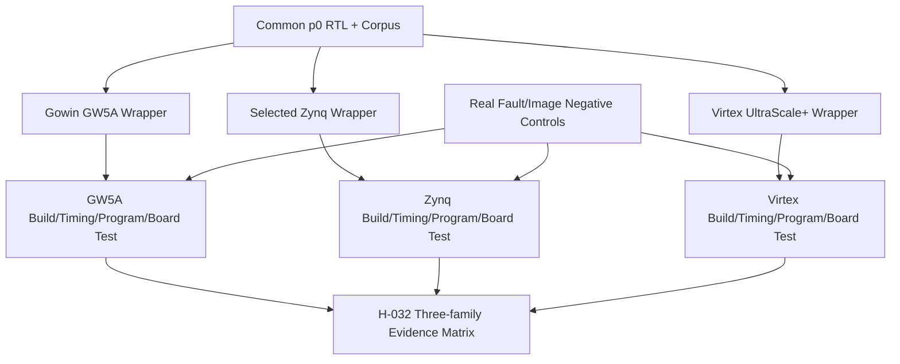

# 第7阶段：GW5A、Zynq、Virtex UltraScale+ 三家族实板验证

状态：**执行指南，不是已完成实现**。本分阶段文件供多人并行分配；所有命令、文件、测试和结果都必须等对应任务实现后产生。任何“完成”必须能引用真实 Git commit/artifact hash/日志，不凭口头状态。

## 1. 这个子系统是做什么的

同一ISA/common corpus在三个不同厂商family上完成独立构建、时序、编程、reset、程序签名和负控制，证明可移植物理原型。

## 2. 为什么存在 / 上游输入

- 上游输入：S0-S2的p0候选为最小起点，后续可接p1/p2。
- 已有依赖：I-080、exact boards、vendor tools/license、RAM/clock/reset contracts。
- 本阶段输出：ASIC timing/硅验证；未明确支持profile的全部硬件结果。
- 首要原则：三块板必须各自有真实证据。先用BRAM-only；PS/DDR、controller、外部memory在core正确后加入。错误part/旧bitstream/ARM PS输出都不能算。

公共平台团队管wrapper/CDC/report/host；GW5A团队独立工具与编程；Zynq团队区分7000/MPSoC和PS/PL；Virtex团队独立DDR/SLR/URAM；联合团队做跨平台矩阵。

## 3. 总体结构

图中的箭头是数据/控制依赖；性能策略不得在正确性前打开。每个分支可以分给不同负责人，但跨接口字段以 [implementation-plan.md](implementation-plan.md) §1.3 和本文件任务卡为准，不能各团队私改。

## 4. 团队分工与进度追踪

| Team | 负责任务 | 当前状态 | Owner | 证据链接 | 下一动作 | Blocker |
|---|---|---|---|---|---|---|
| 平台负责人 | H-001 | Not started | 待定 | 待填 artifact/commit | 读取任务卡并建立输入锁 | 待填 |
| 平台负责人 | H-002 | Not started | 待定 | 待填 artifact/commit | 读取任务卡并建立输入锁 | 待填 |
| 平台负责人 | H-003 | Not started | 待定 | 待填 artifact/commit | 读取任务卡并建立输入锁 | 待填 |
| 平台负责人 | H-004 | Not started | 待定 | 待填 artifact/commit | 读取任务卡并建立输入锁 | 待填 |
| 平台负责人 | H-005 | Not started | 待定 | 待填 artifact/commit | 读取任务卡并建立输入锁 | 待填 |
| 平台负责人 | H-006 | Not started | 待定 | 待填 artifact/commit | 读取任务卡并建立输入锁 | 待填 |
| 平台负责人 | H-007 | Not started | 待定 | 待填 artifact/commit | 读取任务卡并建立输入锁 | 待填 |
| 平台负责人 | H-008 | Not started | 待定 | 待填 artifact/commit | 读取任务卡并建立输入锁 | 待填 |
| 平台负责人 | H-009 | Not started | 待定 | 待填 artifact/commit | 读取任务卡并建立输入锁 | 待填 |
| 平台负责人 | H-010 | Not started | 待定 | 待填 artifact/commit | 读取任务卡并建立输入锁 | 待填 |
| 平台负责人 | H-011 | Not started | 待定 | 待填 artifact/commit | 读取任务卡并建立输入锁 | 待填 |
| 平台负责人 | H-012 | Not started | 待定 | 待填 artifact/commit | 读取任务卡并建立输入锁 | 待填 |
| 平台负责人 | H-013 | Not started | 待定 | 待填 artifact/commit | 读取任务卡并建立输入锁 | 待填 |
| 平台负责人 | H-014 | Not started | 待定 | 待填 artifact/commit | 读取任务卡并建立输入锁 | 待填 |
| 平台负责人 | H-015 | Not started | 待定 | 待填 artifact/commit | 读取任务卡并建立输入锁 | 待填 |
| 平台负责人 | H-016 | Not started | 待定 | 待填 artifact/commit | 读取任务卡并建立输入锁 | 待填 |
| 平台负责人 | H-017 | Not started | 待定 | 待填 artifact/commit | 读取任务卡并建立输入锁 | 待填 |
| 平台负责人 | H-018 | Not started | 待定 | 待填 artifact/commit | 读取任务卡并建立输入锁 | 待填 |
| 平台负责人 | H-019 | Not started | 待定 | 待填 artifact/commit | 读取任务卡并建立输入锁 | 待填 |
| 平台负责人 | H-020 | Not started | 待定 | 待填 artifact/commit | 读取任务卡并建立输入锁 | 待填 |
| 平台负责人 | H-021 | Not started | 待定 | 待填 artifact/commit | 读取任务卡并建立输入锁 | 待填 |
| 平台负责人 | H-022 | Not started | 待定 | 待填 artifact/commit | 读取任务卡并建立输入锁 | 待填 |
| 平台负责人 | H-023 | Not started | 待定 | 待填 artifact/commit | 读取任务卡并建立输入锁 | 待填 |
| 平台负责人 | H-024 | Not started | 待定 | 待填 artifact/commit | 读取任务卡并建立输入锁 | 待填 |
| 平台负责人 | H-025 | Not started | 待定 | 待填 artifact/commit | 读取任务卡并建立输入锁 | 待填 |
| 平台负责人 | H-026 | Not started | 待定 | 待填 artifact/commit | 读取任务卡并建立输入锁 | 待填 |
| 平台负责人 | H-027 | Not started | 待定 | 待填 artifact/commit | 读取任务卡并建立输入锁 | 待填 |
| 平台负责人 | H-028 | Not started | 待定 | 待填 artifact/commit | 读取任务卡并建立输入锁 | 待填 |
| 平台负责人 | H-029 | Not started | 待定 | 待填 artifact/commit | 读取任务卡并建立输入锁 | 待填 |
| 平台负责人 | H-030 | Not started | 待定 | 待填 artifact/commit | 读取任务卡并建立输入锁 | 待填 |
| 平台负责人 | H-031 | Not started | 待定 | 待填 artifact/commit | 读取任务卡并建立输入锁 | 待填 |
| 平台负责人 | H-032 | Not started | 待定 | 待填 artifact/commit | 读取任务卡并建立输入锁 | 待填 |
| 平台负责人 | H-033 | Not started | 待定 | 待填 artifact/commit | 读取任务卡并建立输入锁 | 待填 |
| 平台负责人 | H-034 | Not started | 待定 | 待填 artifact/commit | 读取任务卡并建立输入锁 | 待填 |
| 平台负责人 | H-035 | Not started | 待定 | 待填 artifact/commit | 读取任务卡并建立输入锁 | 待填 |
| 多hart验证负责人 | V-077 | Not started | 待定 | 待填 artifact/commit | 读取任务卡并建立输入锁 | 待填 |
| 多hart验证负责人 | V-079 | Not started | 待定 | 待填 artifact/commit | 读取任务卡并建立输入锁 | 待填 |

状态只能取 `Not started / Inputs locked / In progress / Blocked / Evidence complete / Accepted`。Accepted 需要阶段负责人和验证负责人同时签字；Blocked 必须写最小外部事实、影响范围、请求对象和下一日期，不写“快好了”。

## 5. 可跟踪任务卡

每张卡含实现接口、数据、设计取舍、步骤、交接、验证和回退。完成定义：对应 `Pass` 全部有直接证据，相关负控制也工作；不是“代码写完”或“仿真曾跑过”。

### H-001 — 确认三板身份与电气边界

- **负责/门禁**：平台负责人；物理/转换证据闭合。
- **前置依赖**：none；仍受 implementation-plan 集成依赖表约束。
- **做什么**：为三板分别填 §1.1 冻结表，核对电压、JTAG chain、reset/clock/UART pins 与 boot mode；Zynq 必须选择 7000 或 MPSoC 分支。
- **输入数据/接口**：用户三家族目标、实板/原理图/part marking、板厂手册。
- **输出与交接**：三份 board manifest、合法访问文档清单、未提供项的阻断记录。
- **设计取舍**：先最小安全物理路径，再扩展容量；FPGA和ASIC证据不互替
- **实现微步骤**：核对exact board/part/tool/license输入；冻结source/constraints/image与可复现脚本；执行单元/构建/时序或对应工艺任务；核对真实报告和设备/映像ID；运行共同corpus与negative controls；归档hash、日志、限制和恢复步骤；未满足门槛则明确blocked并反馈架构。
- **主要阻塞风险**：错误part、旧bitstream、PS/DDR/coherence假设、报告缺失仍绿灯；阻断规则：只填写 family、猜测 package/pin、电压不明或把示例板当用户实板。
- **验收证据**：每个必需字段有来源且器件/板版本一致；接线电平无未决风险。；验证口径：每个必需字段有来源且器件/板版本一致；接线电平无未决风险。
- **失败/回退动作**：只填写 family、猜测 package/pin、电压不明或把示例板当用户实板。
- **来源覆盖**：GW5A, Zynq, Virtex UltraScale+, hardware decision gates。；来源 HR-001, HR-003, HR-005, HR-006。
- **进度日志**：2026-09-29 规划生成——未开始；后续每次状态变化追加日期、commit/artifact、证据和下一步。

### H-002 — 冻结工具、器件支持与许可

- **负责/门禁**：平台负责人；物理/转换证据闭合。
- **前置依赖**：H-001；仍受 implementation-plan 集成依赖表约束。
- **做什么**：在未来授权环境核对 release 支持 exact part、RTL language、IP 和 programming 功能；记录安装 hash、版本和 license feature，锁工具但不提交密钥。
- **输入数据/接口**：board manifests、Gowin/Vivado 安装介质与授权条件。
- **输出与交接**：per-family tool-lock、license/part support evidence。
- **设计取舍**：先最小安全物理路径，再扩展容量；FPGA和ASIC证据不互替
- **实现微步骤**：核对exact board/part/tool/license输入；冻结source/constraints/image与可复现脚本；执行单元/构建/时序或对应工艺任务；核对真实报告和设备/映像ID；运行共同corpus与negative controls；归档hash、日志、限制和恢复步骤；未满足门槛则明确blocked并反馈架构。
- **主要阻塞风险**：错误part、旧bitstream、PS/DDR/coherence假设、报告缺失仍绿灯；阻断规则：假定免费版涵盖所有 UltraScale+，或用另一 part 完成综合代替目标。
- **验收证据**：目标 part 可在工具中选择且 required IP 合法可用；container/host 依赖可复现。；验证口径：目标 part 可在工具中选择且 required IP 合法可用；container/host 依赖可复现。
- **失败/回退动作**：假定免费版涵盖所有 UltraScale+，或用另一 part 完成综合代替目标。
- **来源覆盖**：reproducible vendor flow, legal prerequisites。；来源 HR-001, HR-002, HR-010。
- **进度日志**：2026-09-29 规划生成——未开始；后续每次状态变化追加日期、commit/artifact、证据和下一步。

### H-003 — 冻结 common top 与 wrapper 接口

- **负责/门禁**：平台负责人；物理/转换证据闭合。
- **前置依赖**：H-001；仍受 implementation-plan 集成依赖表约束。
- **做什么**：列出 core clocks/resets/RAM/IO/debug ports 与允许 vendor 替换点；对 vendor-only cells 建目录边界，固定 all family 相同 architectural memory map。
- **输入数据/接口**：I-001/I-002 的 ISA/接口合同、common p0 几何。
- **输出与交接**：platform interface contract、RTL/source file-list 分层。
- **设计取舍**：先最小安全物理路径，再扩展容量；FPGA和ASIC证据不互替
- **实现微步骤**：核对exact board/part/tool/license输入；冻结source/constraints/image与可复现脚本；执行单元/构建/时序或对应工艺任务；核对真实报告和设备/映像ID；运行共同corpus与negative controls；归档hash、日志、限制和恢复步骤；未满足门槛则明确blocked并反馈架构。
- **主要阻塞风险**：错误part、旧bitstream、PS/DDR/coherence假设、报告缺失仍绿灯；阻断规则：common PRF 直接依赖 RAMB/BSRAM primitive 或板名条件分支修改 instruction behavior。
- **验收证据**：common core 不要求 vendor library 即可 Verilator elaboration，wrapper 差异不改变 ISA/异常/顺序。；验证口径：common core 不要求 vendor library 即可 Verilator elaboration，wrapper 差异不改变 ISA/异常/顺序。
- **失败/回退动作**：common PRF 直接依赖 RAMB/BSRAM primitive 或板名条件分支修改 instruction behavior。
- **来源覆盖**：portable processor RTL, vendor isolation。；来源 implementation-plan.md, architecture-review.md。
- **进度日志**：2026-09-29 规划生成——未开始；后续每次状态变化追加日期、commit/artifact、证据和下一步。

### H-004 — 验证 RAM wrapper 的可观察一致性

- **负责/门禁**：平台负责人；物理/转换证据闭合。
- **前置依赖**：H-002, H-003；仍受 implementation-plan 集成依赖表约束。
- **做什么**：对每个 wrapper 执行全地址 walking pattern、byte mask、同址 read/write、双 port collision、enable/output latency；未定义 collision 由上层仲裁禁止并断言。
- **输入数据/接口**：I-006、target RAM guides、generic/vendor simulation models。
- **输出与交接**：RAM semantics matrix、CASE=ram.collision_matrix 的三平台结果。
- **设计取舍**：先最小安全物理路径，再扩展容量；FPGA和ASIC证据不互替
- **实现微步骤**：核对exact board/part/tool/license输入；冻结source/constraints/image与可复现脚本；执行单元/构建/时序或对应工艺任务；核对真实报告和设备/映像ID；运行共同corpus与negative controls；归档hash、日志、限制和恢复步骤；未满足门槛则明确blocked并反馈架构。
- **主要阻塞风险**：错误part、旧bitstream、PS/DDR/coherence假设、报告缺失仍绿灯；阻断规则：以 vendor simulation 的 X 被 Verilator 变零掩盖问题，或仅比较写后最后值。
- **验收证据**：允许交易的输出值/延迟一致，所有禁止情形可被 assertion 捕获；综合实际推断期望 RAM。；验证口径：允许交易的输出值/延迟一致，所有禁止情形可被 assertion 捕获；综合实际推断期望 RAM。
- **失败/回退动作**：以 vendor simulation 的 X 被 Verilator 变零掩盖问题，或仅比较写后最后值。
- **来源覆盖**：BRAM/BSRAM/VRF/cache portability。；来源 HR-003, HR-004, HR-011, implementation-plan.md。
- **进度日志**：2026-09-29 规划生成——未开始；后续每次状态变化追加日期、commit/artifact、证据和下一步。

### H-005 — 验证 clock/reset 与 CDC/RDC

- **负责/门禁**：平台负责人；物理/转换证据闭合。
- **前置依赖**：H-003, H-004；仍受 implementation-plan 集成依赖表约束。
- **做什么**：同步解除 reset、处理 PLL lock 丢失、UART/JTAG CDC；对多位跨域用 handshake/FIFO，列 CDC/RDC crossings 和例外理由。
- **输入数据/接口**：每板 clock/reset 电路、PLL wrapper、异步外部输入。
- **输出与交接**：clock/reset diagram、CDC/RDC report、reset phase stress log。
- **设计取舍**：先最小安全物理路径，再扩展容量；FPGA和ASIC证据不互替
- **实现微步骤**：核对exact board/part/tool/license输入；冻结source/constraints/image与可复现脚本；执行单元/构建/时序或对应工艺任务；核对真实报告和设备/映像ID；运行共同corpus与negative controls；归档hash、日志、限制和恢复步骤；未满足门槛则明确blocked并反馈架构。
- **主要阻塞风险**：错误part、旧bitstream、PS/DDR/coherence假设、报告缺失仍绿灯；阻断规则：全局 set_false_path 代替同步器，或 gate clock 用普通 LUT 组合逻辑。
- **验收证据**：每条 crossing 有正确同步策略，无未解释 critical CDC；reset 不产生伪 commit 或设备写。；验证口径：每条 crossing 有正确同步策略，无未解释 critical CDC；reset 不产生伪 commit 或设备写。
- **失败/回退动作**：全局 set_false_path 代替同步器，或 gate clock 用普通 LUT 组合逻辑。
- **来源覆盖**：safe physical clocks, reset, metastability boundaries。；来源 HR-010, platform-plan.md。
- **进度日志**：2026-09-29 规划生成——未开始；后续每次状态变化追加日期、commit/artifact、证据和下一步。

### H-006 — 建立安全的 bring-up top

- **负责/门禁**：平台负责人；物理/转换证据闭合。
- **前置依赖**：H-004, H-005；仍受 implementation-plan 集成依赖表约束。
- **做什么**：只用 on-chip RAM 和单 core clock，挂出 build ID、reset cause、cycle/retire counter、last trap；先禁 DDR/复杂 host DMA。
- **输入数据/接口**：common RAM、boot ROM、UART/result window、I-080 p0 候选。
- **输出与交接**：BRAM-only top、boot image mapping、debug observation contract。
- **设计取舍**：先最小安全物理路径，再扩展容量；FPGA和ASIC证据不互替
- **实现微步骤**：核对exact board/part/tool/license输入；冻结source/constraints/image与可复现脚本；执行单元/构建/时序或对应工艺任务；核对真实报告和设备/映像ID；运行共同corpus与negative controls；归档hash、日志、限制和恢复步骤；未满足门槛则明确blocked并反馈架构。
- **主要阻塞风险**：错误part、旧bitstream、PS/DDR/coherence假设、报告缺失仍绿灯；阻断规则：heartbeat 仅由独立计数器输出却算 processor 执行成功。
- **验收证据**：所有观察值来自本项目 PL core；诊断不修改正常 architectural state。；验证口径：所有观察值来自本项目 PL core；诊断不修改正常 architectural state。
- **失败/回退动作**：heartbeat 仅由独立计数器输出却算 processor 执行成功。
- **来源覆盖**：functional hardware prototype, minimal observability。；来源 implementation-plan.md, validation-plan.md。
- **进度日志**：2026-09-29 规划生成——未开始；后续每次状态变化追加日期、commit/artifact、证据和下一步。

### H-007 — 固定 pin/clock/IO 时序约束

- **负责/门禁**：平台负责人；物理/转换证据闭合。
- **前置依赖**：H-001, H-005, H-006；仍受 implementation-plan 集成依赖表约束。
- **做什么**：逐 port 绑定 pin/bank voltage/IO standard；声明 primary/generated clocks、IO delays、reset/crossing exceptions，逐条审阅其结构理由。
- **输入数据/接口**：原理图、timing contract、oscillator frequency、IO timing。
- **输出与交接**：versioned CST/SDC 或 XDC、constraint coverage 表。
- **设计取舍**：先最小安全物理路径，再扩展容量；FPGA和ASIC证据不互替
- **实现微步骤**：核对exact board/part/tool/license输入；冻结source/constraints/image与可复现脚本；执行单元/构建/时序或对应工艺任务；核对真实报告和设备/映像ID；运行共同corpus与negative controls；归档hash、日志、限制和恢复步骤；未满足门槛则明确blocked并反馈架构。
- **主要阻塞风险**：错误part、旧bitstream、PS/DDR/coherence假设、报告缺失仍绿灯；阻断规则：用默认 pin 或 blanket async/false path 隐藏真实路径。
- **验收证据**：未定位 IO=0，intended clock/IO path 未约束项=0；任何例外与具体同步结构匹配。；验证口径：未定位 IO=0，intended clock/IO path 未约束项=0；任何例外与具体同步结构匹配。
- **失败/回退动作**：用默认 pin 或 blanket async/false path 隐藏真实路径。
- **来源覆盖**：physical constraints, portability safety。；来源 HR-001, HR-010。
- **进度日志**：2026-09-29 规划生成——未开始；后续每次状态变化追加日期、commit/artifact、证据和下一步。

### H-008 — 实现实板 host runner 与签名比对

- **负责/门禁**：平台负责人；物理/转换证据闭合。
- **前置依赖**：H-006；仍受 implementation-plan 集成依赖表约束。
- **做什么**：runner 读取 build/board ID、加载或选择镜像、reset、采集完整 result records、校验 sequence/CRC/signature/termination；分别拒绝错设备、错镜像与超时。
- **输入数据/接口**：V-036 corpus manifest、serial/JTAG/device identity、reference expected files。
- **输出与交接**：host runner CLI、52-case manifest、evidence schema。
- **设计取舍**：先最小安全物理路径，再扩展容量；FPGA和ASIC证据不互替
- **实现微步骤**：核对exact board/part/tool/license输入；冻结source/constraints/image与可复现脚本；执行单元/构建/时序或对应工艺任务；核对真实报告和设备/映像ID；运行共同corpus与negative controls；归档hash、日志、限制和恢复步骤；未满足门槛则明确blocked并反馈架构。
- **主要阻塞风险**：错误part、旧bitstream、PS/DDR/coherence假设、报告缺失仍绿灯；阻断规则：只匹配一行 PASS、USB重枚举连错板仍通过或串口丢包后补猜数据。
- **验收证据**：每 case 唯一 verdict，缺记录不算成功；host mismatch 负控制明确非零。；验证口径：每 case 唯一 verdict，缺记录不算成功；host mismatch 负控制明确非零。
- **失败/回退动作**：只匹配一行 PASS、USB重枚举连错板仍通过或串口丢包后补猜数据。
- **来源覆盖**：real-hardware correctness evidence, automated validation。；来源 validation-plan.md。
- **进度日志**：2026-09-29 规划生成——未开始；后续每次状态变化追加日期、commit/artifact、证据和下一步。

### H-009 — 校准 timing/resource 报告验收器

- **负责/门禁**：平台负责人；物理/转换证据闭合。
- **前置依赖**：H-002, H-007；仍受 implementation-plan 集成依赖表约束。
- **做什么**：提取 setup/hold、unconstrained paths、unrouted nets、DRC/CDC 与实际 RAM/DSP 使用；用已知失败报告/错误约束确认不能绿灯。
- **输入数据/接口**：工具报告格式、明确时钟目标、per-profile resource budget。
- **输出与交接**：per-vendor report parser、阈值与必要字段清单。
- **设计取舍**：先最小安全物理路径，再扩展容量；FPGA和ASIC证据不互替
- **实现微步骤**：核对exact board/part/tool/license输入；冻结source/constraints/image与可复现脚本；执行单元/构建/时序或对应工艺任务；核对真实报告和设备/映像ID；运行共同corpus与negative controls；归档hash、日志、限制和恢复步骤；未满足门槛则明确blocked并反馈架构。
- **主要阻塞风险**：错误part、旧bitstream、PS/DDR/coherence假设、报告缺失仍绿灯；阻断规则：仅检测工具进程 code 0 或 synthesis utilization 即宣布 fit。
- **验收证据**：缺报告/不识别字段/负 slack/critical error 均失败；报告对应同一已实现 netlist hash。；验证口径：缺报告/不识别字段/负 slack/critical error 均失败；报告对应同一已实现 netlist hash。
- **失败/回退动作**：仅检测工具进程 code 0 或 synthesis utilization 即宣布 fit。
- **来源覆盖**：deterministic physical acceptance。；来源 HR-010, HR-001。
- **进度日志**：2026-09-29 规划生成——未开始；后续每次状态变化追加日期、commit/artifact、证据和下一步。

### H-010 — 建立跨平台证据归档与负控制流程

- **负责/门禁**：平台负责人；物理/转换证据闭合。
- **前置依赖**：H-008, H-009；仍受 implementation-plan 集成依赖表约束。
- **做什么**：归档每次 program/reset/run 的输入与日志；分离 host-checker 负例、真实 datapath mutation 和 image-ID 错误；明确恢复良好映像步骤。
- **输入数据/接口**：§3 evidence schema、diagnostic bitstream policy。
- **输出与交接**：immutable run manifest、negative-control checklist、restoration record。
- **设计取舍**：先最小安全物理路径，再扩展容量；FPGA和ASIC证据不互替
- **实现微步骤**：核对exact board/part/tool/license输入；冻结source/constraints/image与可复现脚本；执行单元/构建/时序或对应工艺任务；核对真实报告和设备/映像ID；运行共同corpus与negative controls；归档hash、日志、限制和恢复步骤；未满足门槛则明确blocked并反馈架构。
- **主要阻塞风险**：错误part、旧bitstream、PS/DDR/coherence假设、报告缺失仍绿灯；阻断规则：失败后覆盖旧日志、注入未触达或测试结束残留故障 boot image。
- **验收证据**：所有错误类别均能归因且不能混作正常 PASS；设备最终处于记录的良好映像。；验证口径：所有错误类别均能归因且不能混作正常 PASS；设备最终处于记录的良好映像。
- **失败/回退动作**：失败后覆盖旧日志、注入未触达或测试结束残留故障 boot image。
- **来源覆盖**：reproducibility, validation credibility, hardware safety。；来源 validation-plan.md。
- **进度日志**：2026-09-29 规划生成——未开始；后续每次状态变化追加日期、commit/artifact、证据和下一步。

### H-011 — 建立 exact-GW5A 工程与批处理入口

- **负责/门禁**：平台负责人；物理/转换证据闭合。
- **前置依赖**：H-002, H-003, H-007；仍受 implementation-plan 集成依赖表约束。
- **做什么**：GUI 新建 exact part 工程，加入 common+Gowin wrappers/CST/SDC/image，导出当前版本支持的项目/Tcl；在帮助中核实 batch invocation，保留完整命令而不照抄未读取的 PDF 示例。
- **输入数据/接口**：正确器件的 Gowin EDA、安装的 Tcl/软件手册、source lists。
- **输出与交接**：Gowin project/script、版本化 file list、运行说明。
- **设计取舍**：先最小安全物理路径，再扩展容量；FPGA和ASIC证据不互替
- **实现微步骤**：核对exact board/part/tool/license输入；冻结source/constraints/image与可复现脚本；执行单元/构建/时序或对应工艺任务；核对真实报告和设备/映像ID；运行共同corpus与negative controls；归档hash、日志、限制和恢复步骤；未满足门槛则明确blocked并反馈架构。
- **主要阻塞风险**：错误part、旧bitstream、PS/DDR/coherence假设、报告缺失仍绿灯；阻断规则：GUI 工程漏文件，命令行用错误 part 或只在作者机器可用。
- **验收证据**：从空 build 目录可按记录重建同一输入集合，device/constraints 没有隐式 GUI 状态。；验证口径：从空 build 目录可按记录重建同一输入集合，device/constraints 没有隐式 GUI 状态。
- **失败/回退动作**：GUI 工程漏文件，命令行用错误 part 或只在作者机器可用。
- **来源覆盖**：GW5A reproducible build。；来源 HR-001, HR-011。
- **进度日志**：2026-09-29 规划生成——未开始；后续每次状态变化追加日期、commit/artifact、证据和下一步。

### H-012 — 验证 GW5A RAM/PLL 推断

- **负责/门禁**：平台负责人；物理/转换证据闭合。
- **前置依赖**：H-011, H-004, H-005；仍受 implementation-plan 集成依赖表约束。
- **做什么**：单独综合 PRF/cache/boot-RAM/PLL 小实例，检查资源类型、读延迟、mask 粒度和 reset inference；必要的 native IP 只留 wrapper 内。
- **输入数据/接口**：exact-part BSRAM/SSRAM/PLL 文档、wrapper unit results。
- **输出与交接**：GW5A memory/clock mapping report、IP config hashes。
- **设计取舍**：先最小安全物理路径，再扩展容量；FPGA和ASIC证据不互替
- **实现微步骤**：核对exact board/part/tool/license输入；冻结source/constraints/image与可复现脚本；执行单元/构建/时序或对应工艺任务；核对真实报告和设备/映像ID；运行共同corpus与negative controls；归档hash、日志、限制和恢复步骤；未满足门槛则明确blocked并反馈架构。
- **主要阻塞风险**：错误part、旧bitstream、PS/DDR/coherence假设、报告缺失仍绿灯；阻断规则：推断成 FF 后仍沿用 BRAM 预算，或从 GW1N RAM 推断 GW5A collision 语义。
- **验收证据**：没有意外全阵列 FF reset 或容量爆炸；所用模式都有可取得手册/模型证据。；验证口径：没有意外全阵列 FF reset 或容量爆炸；所用模式都有可取得手册/模型证据。
- **失败/回退动作**：推断成 FF 后仍沿用 BRAM 预算，或从 GW1N RAM 推断 GW5A collision 语义。
- **来源覆盖**：GW5A portability primitives。；来源 HR-001, HR-011。
- **进度日志**：2026-09-29 规划生成——未开始；后续每次状态变化追加日期、commit/artifact、证据和下一步。

### H-013 — 运行 GW5A 全核 synthesis

- **负责/门禁**：平台负责人；物理/转换证据闭合。
- **前置依赖**：H-012, H-006, I-080；仍受 implementation-plan 集成依赖表约束。
- **做什么**：执行 synthesis，检查 latch/unconnected/truncated width、RAM/FU instance count 与两 cluster 连通；按 warning 类别逐条 disposition。
- **输入数据/接口**：p0 candidate、冻结 Gowin project、BRAM-only top。
- **输出与交接**：synthesis netlist、utilization/inference/warning reports。
- **设计取舍**：先最小安全物理路径，再扩展容量；FPGA和ASIC证据不互替
- **实现微步骤**：核对exact board/part/tool/license输入；冻结source/constraints/image与可复现脚本；执行单元/构建/时序或对应工艺任务；核对真实报告和设备/映像ID；运行共同corpus与negative controls；归档hash、日志、限制和恢复步骤；未满足门槛则明确blocked并反馈架构。
- **主要阻塞风险**：错误part、旧bitstream、PS/DDR/coherence假设、报告缺失仍绿灯；阻断规则：工具优化掉整个 processor、ISA feature被条件编译移除或关键 warning 未处理。
- **验收证据**：exact part 可容纳，两个 cluster 保留，未解释 latch/width/driver 错误=0。；验证口径：exact part 可容纳，两个 cluster 保留，未解释 latch/width/driver 错误=0。
- **失败/回退动作**：工具优化掉整个 processor、ISA feature被条件编译移除或关键 warning 未处理。
- **来源覆盖**：GW5A synthesizable processor。；来源 HR-001, implementation-plan.md。
- **进度日志**：2026-09-29 规划生成——未开始；后续每次状态变化追加日期、commit/artifact、证据和下一步。

### H-014 — 运行 GW5A place/route/STA

- **负责/门禁**：平台负责人；物理/转换证据闭合。
- **前置依赖**：H-013, H-009；仍受 implementation-plan 集成依赖表约束。
- **做什么**：执行完整 implementation，导出最坏 setup/hold、clock/IO coverage、route/congestion；失效时定位 PRF/wakeup/global fanout，修改架构后重跑正确性。
- **输入数据/接口**：冻结 clock/CST/SDC、synthesized netlist、resource budget。
- **输出与交接**：routed netlist、timing/resource reports、完整决策日志。
- **设计取舍**：先最小安全物理路径，再扩展容量；FPGA和ASIC证据不互替
- **实现微步骤**：核对exact board/part/tool/license输入；冻结source/constraints/image与可复现脚本；执行单元/构建/时序或对应工艺任务；核对真实报告和设备/映像ID；运行共同corpus与negative controls；归档hash、日志、限制和恢复步骤；未满足门槛则明确blocked并反馈架构。
- **主要阻塞风险**：错误part、旧bitstream、PS/DDR/coherence假设、报告缺失仍绿灯；阻断规则：只降报告目标不降实际 oscillator/divider，或 skip hold/unconstrained 检查。
- **验收证据**：§1.1 timing/route 门槛均满足，所有 clocks 为实际运行目标，无不实 timing exception。；验证口径：§1.1 timing/route 门槛均满足，所有 clocks 为实际运行目标，无不实 timing exception。
- **失败/回退动作**：只降报告目标不降实际 oscillator/divider，或 skip hold/unconstrained 检查。
- **来源覆盖**：GW5A physical feasibility。；来源 HR-001, HR-011。
- **进度日志**：2026-09-29 规划生成——未开始；后续每次状态变化追加日期、commit/artifact、证据和下一步。

### H-015 — 生成并核对 GW5A 配置映像

- **负责/门禁**：平台负责人；物理/转换证据闭合。
- **前置依赖**：H-014, H-010；仍受 implementation-plan 集成依赖表约束。
- **做什么**：生成所选器件/配置方式映像，检查 boot RAM 数据与 build ID；先选择可恢复的易失配置路径，flash 操作需明确范围/备份/授权。
- **输入数据/接口**：routed design、boot image hash、Programmer/board ID。
- **输出与交接**：image hash、configuration settings、programming recipe。
- **设计取舍**：先最小安全物理路径，再扩展容量；FPGA和ASIC证据不互替
- **实现微步骤**：核对exact board/part/tool/license输入；冻结source/constraints/image与可复现脚本；执行单元/构建/时序或对应工艺任务；核对真实报告和设备/映像ID；运行共同corpus与negative controls；归档hash、日志、限制和恢复步骤；未满足门槛则明确blocked并反馈架构。
- **主要阻塞风险**：错误part、旧bitstream、PS/DDR/coherence假设、报告缺失仍绿灯；阻断规则：从旧输出目录取错 bitstream 或 programming 操作超出授权。
- **验收证据**：映像 part 与硬件 ID 一致、输入来源闭合；不覆盖未知用户 flash 内容。；验证口径：映像 part 与硬件 ID 一致、输入来源闭合；不覆盖未知用户 flash 内容。
- **失败/回退动作**：从旧输出目录取错 bitstream 或 programming 操作超出授权。
- **来源覆盖**：GW5A programming safety, provenance。；来源 HR-001, H-001。
- **进度日志**：2026-09-29 规划生成——未开始；后续每次状态变化追加日期、commit/artifact、证据和下一步。

### H-016 — 执行 GW5A cold/warm board regression

- **负责/门禁**：平台负责人；物理/转换证据闭合。
- **前置依赖**：H-015, H-008；仍受 implementation-plan 集成依赖表约束。
- **做什么**：下载后核对 ID，按 §3 运行 3 次 cold power 和 10 次 warm reset 的完整集合；保留 UART/JTAG 与板时钟测量。
- **输入数据/接口**：实际 GW5A 板、52-case corpus、host runner。
- **输出与交接**：GW5A physical evidence bundle、全部 expected/actual signatures。
- **设计取舍**：先最小安全物理路径，再扩展容量；FPGA和ASIC证据不互替
- **实现微步骤**：核对exact board/part/tool/license输入；冻结source/constraints/image与可复现脚本；执行单元/构建/时序或对应工艺任务；核对真实报告和设备/映像ID；运行共同corpus与negative controls；归档hash、日志、限制和恢复步骤；未满足门槛则明确blocked并反馈架构。
- **主要阻塞风险**：错误part、旧bitstream、PS/DDR/coherence假设、报告缺失仍绿灯；阻断规则：只有 simulation/log复制、LED心跳或单次 arithmetic demo。
- **验收证据**：每次每 case 结果匹配，无 hang/CRC/timeout；负控制检出并恢复良好映像。；验证口径：每次每 case 结果匹配，无 hang/CRC/timeout；负控制检出并恢复良好映像。
- **失败/回退动作**：只有 simulation/log复制、LED心跳或单次 arithmetic demo。
- **来源覆盖**：mandatory GW5A real-hardware validation。；来源 validation-plan.md, H-010。
- **进度日志**：2026-09-29 规划生成——未开始；后续每次状态变化追加日期、commit/artifact、证据和下一步。

### H-017 — 扩展 GW5A 外部存储与高 profile

- **负责/门禁**：平台负责人；物理/转换证据闭合。
- **前置依赖**：H-016, I-048；仍受 implementation-plan 集成依赖表约束。
- **做什么**：先 controller calibration/地址walking/burst边界/错误注入，再 core 接入；无 DDR 的板保持有据的 RAM profile，不能凭 family 名称假定有 DDR。
- **输入数据/接口**：所选板实际存储类型/接口、vendor controller、p1/p2/p3需要。
- **输出与交接**：external-memory adapter、memory-test evidence、per-profile fit matrix。
- **设计取舍**：先最小安全物理路径，再扩展容量；FPGA和ASIC证据不互替
- **实现微步骤**：核对exact board/part/tool/license输入；冻结source/constraints/image与可复现脚本；执行单元/构建/时序或对应工艺任务；核对真实报告和设备/映像ID；运行共同corpus与negative controls；归档hash、日志、限制和恢复步骤；未满足门槛则明确blocked并反馈架构。
- **主要阻塞风险**：错误part、旧bitstream、PS/DDR/coherence假设、报告缺失仍绿灯；阻断规则：calibration成功即当CPU正确，或额外存储不可用仍宣称Linux/RVV容量已满足。
- **验收证据**：只有真实存在且验证过的 memory 才进平台描述；每新增 profile 重新跑 timing与corpus。；验证口径：只有真实存在且验证过的 memory 才进平台描述；每新增 profile 重新跑 timing与corpus。
- **失败/回退动作**：calibration成功即当CPU正确，或额外存储不可用仍宣称Linux/RVV容量已满足。
- **来源覆盖**：GW5A scaling, memory integration。；来源 HR-001, implementation-plan.md。
- **进度日志**：2026-09-29 规划生成——未开始；后续每次状态变化追加日期、commit/artifact、证据和下一步。

### H-018 — 冻结 Zynq PS/PL 职责

- **负责/门禁**：平台负责人；物理/转换证据闭合。
- **前置依赖**：H-001, H-003；仍受 implementation-plan 集成依赖表约束。
- **做什么**：明确 BRAM-only 是否用板 oscillator 或 PS FCLK；PS 若只加载/串口服务，仍由PL RISC-V执行测试；列 PS boot、DDR init、clock/reset release顺序。
- **输入数据/接口**：selected Zynq branch、board clock/reset/DDR连接、UG585或UG1085。
- **输出与交接**：Zynq boot ownership diagram、PL/PS memory map。
- **设计取舍**：先最小安全物理路径，再扩展容量；FPGA和ASIC证据不互替
- **实现微步骤**：核对exact board/part/tool/license输入；冻结source/constraints/image与可复现脚本；执行单元/构建/时序或对应工艺任务；核对真实报告和设备/映像ID；运行共同corpus与negative controls；归档hash、日志、限制和恢复步骤；未满足门槛则明确blocked并反馈架构。
- **主要阻塞风险**：错误part、旧bitstream、PS/DDR/coherence假设、报告缺失仍绿灯；阻断规则：把Zynq-7000 FSBL与MPSoC PMU/firmware链路混用。
- **验收证据**：不存在未启动PS却依赖其FCLK/DDR的隐含循环；branch特有boot组件明确。；验证口径：不存在未启动PS却依赖其FCLK/DDR的隐含循环；branch特有boot组件明确。
- **失败/回退动作**：把Zynq-7000 FSBL与MPSoC PMU/firmware链路混用。
- **来源覆盖**：Zynq-7000, Zynq UltraScale+ MPSoC decision gate。；来源 HR-005, HR-006。
- **进度日志**：2026-09-29 规划生成——未开始；后续每次状态变化追加日期、commit/artifact、证据和下一步。

### H-019 — 建立 Zynq wrapper 与 RAM profile

- **负责/门禁**：平台负责人；物理/转换证据闭合。
- **前置依赖**：H-018, H-004, H-005；仍受 implementation-plan 集成依赖表约束。
- **做什么**：选择相应memory primitive/IP wrapper，移除不适用URAM/clock属性；BRAM-only路径先不接PS DDR，测所有RAM collision合同。
- **输入数据/接口**：7-series 或 UltraScale+ PL 类型、BRAM resources、clock/reset source。
- **输出与交接**：selected-Zynq top、RAM/clock unit evidence。
- **设计取舍**：先最小安全物理路径，再扩展容量；FPGA和ASIC证据不互替
- **实现微步骤**：核对exact board/part/tool/license输入；冻结source/constraints/image与可复现脚本；执行单元/构建/时序或对应工艺任务；核对真实报告和设备/映像ID；运行共同corpus与negative controls；归档hash、日志、限制和恢复步骤；未满足门槛则明确blocked并反馈架构。
- **主要阻塞风险**：错误part、旧bitstream、PS/DDR/coherence假设、报告缺失仍绿灯；阻断规则：利用错误memory读延迟使模拟通过但实板失败。
- **验收证据**：synthesis绑定所选family的正确cells，不能把UltraScale-specific primitive带入Zynq-7000。；验证口径：synthesis绑定所选family的正确cells，不能把UltraScale-specific primitive带入Zynq-7000。
- **失败/回退动作**：利用错误memory读延迟使模拟通过但实板失败。
- **来源覆盖**：Zynq-specific portability。；来源 HR-003, HR-004, HR-005。
- **进度日志**：2026-09-29 规划生成——未开始；后续每次状态变化追加日期、commit/artifact、证据和下一步。

### H-020 — 定义 Zynq AXI 与非一致性 handoff

- **负责/门禁**：平台负责人；物理/转换证据闭合。
- **前置依赖**：H-019, I-047；仍受 implementation-plan 集成依赖表约束。
- **做什么**：对load/reset/signature memory分别定义owner；PS cache clean/invalidate和barrier按所选端口协议执行；测试backpressure/错误response/未对齐禁止条件。
- **输入数据/接口**：PS/PL所选AXI端口、数据宽度/ID/outstanding、host loader。
- **输出与交接**：AXI adapter、CASE=zynq.ps_pl_handoff、cache-maintenance protocol。
- **设计取舍**：先最小安全物理路径，再扩展容量；FPGA和ASIC证据不互替
- **实现微步骤**：核对exact board/part/tool/license输入；冻结source/constraints/image与可复现脚本；执行单元/构建/时序或对应工艺任务；核对真实报告和设备/映像ID；运行共同corpus与negative controls；归档hash、日志、限制和恢复步骤；未满足门槛则明确blocked并反馈架构。
- **主要阻塞风险**：错误part、旧bitstream、PS/DDR/coherence假设、报告缺失仍绿灯；阻断规则：将HP等普通端口自动当coherent，或ARM执行期望值代替读PL结果。
- **验收证据**：host写入的镜像和core写出的签名真实可见；不存在PS stale cache掩盖core错误。；验证口径：host写入的镜像和core写出的签名真实可见；不存在PS stale cache掩盖core错误。
- **失败/回退动作**：将HP等普通端口自动当coherent，或ARM执行期望值代替读PL结果。
- **来源覆盖**：Zynq PS integration, memory visibility。；来源 HR-005, HR-008。
- **进度日志**：2026-09-29 规划生成——未开始；后续每次状态变化追加日期、commit/artifact、证据和下一步。

### H-021 — 建立 Zynq 可复现 Vivado 工程

- **负责/门禁**：平台负责人；物理/转换证据闭合。
- **前置依赖**：H-019, H-002, H-007；仍受 implementation-plan 集成依赖表约束。
- **做什么**：生成batch Tcl及IP配置，固定所有IP version和board preset；校验block design/地址分配，避免必须手点未记录GUI配置。
- **输入数据/接口**：exact part/board、common file list、必要PS/block-design配置。
- **输出与交接**：Zynq build Tcl、IP locks、recreation instructions。
- **设计取舍**：先最小安全物理路径，再扩展容量；FPGA和ASIC证据不互替
- **实现微步骤**：核对exact board/part/tool/license输入；冻结source/constraints/image与可复现脚本；执行单元/构建/时序或对应工艺任务；核对真实报告和设备/映像ID；运行共同corpus与negative controls；归档hash、日志、限制和恢复步骤；未满足门槛则明确blocked并反馈架构。
- **主要阻塞风险**：错误part、旧bitstream、PS/DDR/coherence假设、报告缺失仍绿灯；阻断规则：本地board_files未跟踪或预设隐含错误DDR/pin。
- **验收证据**：干净目录重建所选branch相同逻辑配置，工具报告没有自动upgrade后未记录变化。；验证口径：干净目录重建所选branch相同逻辑配置，工具报告没有自动upgrade后未记录变化。
- **失败/回退动作**：本地board_files未跟踪或预设隐含错误DDR/pin。
- **来源覆盖**：reproducible Zynq implementation。；来源 HR-010, HR-005。
- **进度日志**：2026-09-29 规划生成——未开始；后续每次状态变化追加日期、commit/artifact、证据和下一步。

### H-022 — 校准 Vivado build/report Tcl

- **负责/门禁**：平台负责人；物理/转换证据闭合。
- **前置依赖**：H-002, H-003, H-007, H-009；仍受 implementation-plan 集成依赖表约束。
- **做什么**：通过`vivado -version`与Tcl帮助确认命令；脚本运行synth/opt/place/route并生成§2.1报告，error立即非零，保留journal和checkpoint。
- **输入数据/接口**：所锁Vivado help、tool capability、report acceptance schema。
- **输出与交接**：validated Tcl runner、all mandatory reports、script failure controls。
- **设计取舍**：先最小安全物理路径，再扩展容量；FPGA和ASIC证据不互替
- **实现微步骤**：核对exact board/part/tool/license输入；冻结source/constraints/image与可复现脚本；执行单元/构建/时序或对应工艺任务；核对真实报告和设备/映像ID；运行共同corpus与negative controls；归档hash、日志、限制和恢复步骤；未满足门槛则明确blocked并反馈架构。
- **主要阻塞风险**：错误part、旧bitstream、PS/DDR/coherence假设、报告缺失仍绿灯；阻断规则：catch吞error、空设计report、仅synth report充当post-route证据。
- **验收证据**：checkpoint stage/hash与报告对应；缺run/时序失败不会因Tcl流程正常退出误报成功。；验证口径：checkpoint stage/hash与报告对应；缺run/时序失败不会因Tcl流程正常退出误报成功。
- **失败/回退动作**：catch吞error、空设计report、仅synth report充当post-route证据。
- **来源覆盖**：AMD implementation automation, timing evidence。；来源 HR-010。
- **进度日志**：2026-09-29 规划生成——未开始；后续每次状态变化追加日期、commit/artifact、证据和下一步。

### H-023 — 验收 Zynq routed design

- **负责/门禁**：平台负责人；物理/转换证据闭合。
- **前置依赖**：H-022, I-080；仍受 implementation-plan 集成依赖表约束。
- **做什么**：完成synthesis/P&R，检查clock interaction、CDC、RAM inference、setup/hold与IO constraints；读取full utilization而非只看LUT。
- **输入数据/接口**：p0 RTL、XDC、selected-Zynq wrapper。
- **输出与交接**：Zynq routed checkpoint、timing/resource/DRC bundle。
- **设计取舍**：先最小安全物理路径，再扩展容量；FPGA和ASIC证据不互替
- **实现微步骤**：核对exact board/part/tool/license输入；冻结source/constraints/image与可复现脚本；执行单元/构建/时序或对应工艺任务；核对真实报告和设备/映像ID；运行共同corpus与negative controls；归档hash、日志、限制和恢复步骤；未满足门槛则明确blocked并反馈架构。
- **主要阻塞风险**：错误part、旧bitstream、PS/DDR/coherence假设、报告缺失仍绿灯；阻断规则：未约束FCLK路径、incorrect async grouping或physically unrouted design。
- **验收证据**：§1.1门槛全部满足，PS/PL接口和真实core clock被约束。；验证口径：§1.1门槛全部满足，PS/PL接口和真实core clock被约束。
- **失败/回退动作**：未约束FCLK路径、incorrect async grouping或physically unrouted design。
- **来源覆盖**：Zynq physical implementation。；来源 HR-003, HR-005, HR-010。
- **进度日志**：2026-09-29 规划生成——未开始；后续每次状态变化追加日期、commit/artifact、证据和下一步。

### H-024 — 下载 Zynq 并运行共同板测

- **负责/门禁**：平台负责人；物理/转换证据闭合。
- **前置依赖**：H-023, H-008, H-010；仍受 implementation-plan 集成依赖表约束。
- **做什么**：先JTAG/受控易失加载，核对PL build ID；按§3 cold/warm回归和负控制运行，不让PS替代执行；需要持久启动时另冻结boot image构成。
- **输入数据/接口**：真实Zynq板、正确boot/PS初始化链、bitstream/ELF hashes。
- **输出与交接**：Zynq physical evidence bundle、reset/boot/serial记录。
- **设计取舍**：先最小安全物理路径，再扩展容量；FPGA和ASIC证据不互替
- **实现微步骤**：核对exact board/part/tool/license输入；冻结source/constraints/image与可复现脚本；执行单元/构建/时序或对应工艺任务；核对真实报告和设备/映像ID；运行共同corpus与negative controls；归档hash、日志、限制和恢复步骤；未满足门槛则明确blocked并反馈架构。
- **主要阻塞风险**：错误part、旧bitstream、PS/DDR/coherence假设、报告缺失仍绿灯；阻断规则：Linux在ARM上启动或软件host打印PASS被计为RISC-V验证。
- **验收证据**：52-case每次全过，真实PL cycles/retire前进且签名来自PL core；错误映像可恢复。；验证口径：52-case每次全过，真实PL cycles/retire前进且签名来自PL core；错误映像可恢复。
- **失败/回退动作**：Linux在ARM上启动或软件host打印PASS被计为RISC-V验证。
- **来源覆盖**：mandatory Zynq real-hardware validation。；来源 HR-005, HR-006, validation-plan.md。
- **进度日志**：2026-09-29 规划生成——未开始；后续每次状态变化追加日期、commit/artifact、证据和下一步。

### H-025 — 扩展 Zynq DDR 与 OS/vector profile

- **负责/门禁**：平台负责人；物理/转换证据闭合。
- **前置依赖**：H-024, H-020, I-048；仍受 implementation-plan 集成依赖表约束。
- **做什么**：独立DDR压力与PS/PL共享一致性检查后引入RISC-V boot；测试page faults、interrupt、atomic、DMA/coherence维护与长运行。
- **输入数据/接口**：PS DDR初始化、core AXI、firmware/DTB、p1/p2/p3。
- **输出与交接**：DDR/boot adapter、profile-specific timing和program evidence。
- **设计取舍**：先最小安全物理路径，再扩展容量；FPGA和ASIC证据不互替
- **实现微步骤**：核对exact board/part/tool/license输入；冻结source/constraints/image与可复现脚本；执行单元/构建/时序或对应工艺任务；核对真实报告和设备/映像ID；运行共同corpus与negative controls；归档hash、日志、限制和恢复步骤；未满足门槛则明确blocked并反馈架构。
- **主要阻塞风险**：错误part、旧bitstream、PS/DDR/coherence假设、报告缺失仍绿灯；阻断规则：DDR可读就跳过cache coherence、以PS/Linux console冒充PL/OS日志。
- **验收证据**：RISC-V用户程序在PL核完成预期签名/退出；各profile fit和ISA支持逐项记录。；验证口径：RISC-V用户程序在PL核完成预期签名/退出；各profile fit和ISA支持逐项记录。
- **失败/回退动作**：DDR可读就跳过cache coherence、以PS/Linux console冒充PL/OS日志。
- **来源覆盖**：Zynq advanced system validation。；来源 HR-005, HR-008, implementation-plan.md。
- **进度日志**：2026-09-29 规划生成——未开始；后续每次状态变化追加日期、commit/artifact、证据和下一步。

### H-026 — 冻结 Virtex 板级 clock/配置/SLR 路径

- **负责/门禁**：平台负责人；物理/转换证据闭合。
- **前置依赖**：H-001, H-002, H-003；仍受 implementation-plan 集成依赖表约束。
- **做什么**：不依赖Zynq PS，选择板clock/PLL、JTAG和UART/host桥；记录跨SLR链路以及configuration flash边界。
- **输入数据/接口**：exact Virtex UltraScale+ part、board manual、SLR/DDR/IO布局。
- **输出与交接**：Virtex top contract、floorplan建议与pin/clock来源。
- **设计取舍**：先最小安全物理路径，再扩展容量；FPGA和ASIC证据不互替
- **实现微步骤**：核对exact board/part/tool/license输入；冻结source/constraints/image与可复现脚本；执行单元/构建/时序或对应工艺任务；核对真实报告和设备/映像ID；运行共同corpus与negative controls；归档hash、日志、限制和恢复步骤；未满足门槛则明确blocked并反馈架构。
- **主要阻塞风险**：错误part、旧bitstream、PS/DDR/coherence假设、报告缺失仍绿灯；阻断规则：复制VCU118 pinout到未知板，或假定每款器件有相同URAM/DDR能力。
- **验收证据**：所有平台服务有该板真实提供路径，所需IP/工具授权匹配part。；验证口径：所有平台服务有该板真实提供路径，所需IP/工具授权匹配part。
- **失败/回退动作**：复制VCU118 pinout到未知板，或假定每款器件有相同URAM/DDR能力。
- **来源覆盖**：Virtex UltraScale+ board specificity。；来源 HR-002, HR-007, HR-004。
- **进度日志**：2026-09-29 规划生成——未开始；后续每次状态变化追加日期、commit/artifact、证据和下一步。

### H-027 — 验证 Virtex BRAM/URAM adapter

- **负责/门禁**：平台负责人；物理/转换证据闭合。
- **前置依赖**：H-026, H-004；仍受 implementation-plan 集成依赖表约束。
- **做什么**：先BRAM实现共同profile；URAM作为独立容量优化，显式处理其端口/byte write/reset/读延迟限制，不以同一wrapper名字隐藏额外cycle。
- **输入数据/接口**：selected-part memory resources、p0 PRF/cache latency contract。
- **输出与交接**：memory mapping/inference report、adapter equivalence cases。
- **设计取舍**：先最小安全物理路径，再扩展容量；FPGA和ASIC证据不互替
- **实现微步骤**：核对exact board/part/tool/license输入；冻结source/constraints/image与可复现脚本；执行单元/构建/时序或对应工艺任务；核对真实报告和设备/映像ID；运行共同corpus与negative controls；归档hash、日志、限制和恢复步骤；未满足门槛则明确blocked并反馈架构。
- **主要阻塞风险**：错误part、旧bitstream、PS/DDR/coherence假设、报告缺失仍绿灯；阻断规则：将URAM当任意多口BRAM的直接替代。
- **验收证据**：每种允许memory实现均满足core contract；不支持模式通过外置逻辑实现或拒绝配置。；验证口径：每种允许memory实现均满足core contract；不支持模式通过外置逻辑实现或拒绝配置。
- **失败/回退动作**：将URAM当任意多口BRAM的直接替代。
- **来源覆盖**：Virtex storage scaling, RAM portability。；来源 HR-004, platform-plan.md。
- **进度日志**：2026-09-29 规划生成——未开始；后续每次状态变化追加日期、commit/artifact、证据和下一步。

### H-028 — 构建 Virtex Vivado flow 与约束

- **负责/门禁**：平台负责人；物理/转换证据闭合。
- **前置依赖**：H-027, H-007, H-022；仍受 implementation-plan 集成依赖表约束。
- **做什么**：为Virtex单独生成工程和IP配置，保留共同runner而不是共同pinout；必要时给cluster和RAM软floorplan，先不以过紧pblock隐藏问题。
- **输入数据/接口**：exact part/file list、Virtex XDC、已校准Vivado runner。
- **输出与交接**：reproducible Virtex batch flow、constraints、IP locks。
- **设计取舍**：先最小安全物理路径，再扩展容量；FPGA和ASIC证据不互替
- **实现微步骤**：核对exact board/part/tool/license输入；冻结source/constraints/image与可复现脚本；执行单元/构建/时序或对应工艺任务；核对真实报告和设备/映像ID；运行共同corpus与negative controls；归档hash、日志、限制和恢复步骤；未满足门槛则明确blocked并反馈架构。
- **主要阻塞风险**：错误part、旧bitstream、PS/DDR/coherence假设、报告缺失仍绿灯；阻断规则：三个平台共用一个手改project而无法恢复各自配置。
- **验收证据**：无Zynq PS cell/地址依赖；build标识清楚区分Zynq/Virtex。；验证口径：无Zynq PS cell/地址依赖；build标识清楚区分Zynq/Virtex。
- **失败/回退动作**：三个平台共用一个手改project而无法恢复各自配置。
- **来源覆盖**：Virtex reproducibility, vendor wrapper reuse。；来源 HR-010, HR-007。
- **进度日志**：2026-09-29 规划生成——未开始；后续每次状态变化追加日期、commit/artifact、证据和下一步。

### H-029 — 验收 Virtex route 与网络时序

- **负责/门禁**：平台负责人；物理/转换证据闭合。
- **前置依赖**：H-028, I-080, H-009；仍受 implementation-plan 集成依赖表约束。
- **做什么**：synth/P&R/STA，检查长线、fanout、SLR crossings与completion回路；必要pipeline cut回到Verilator回归，不仅调实现seed。
- **输入数据/接口**：p0候选、clock target、inter-cluster/SLR crossings。
- **输出与交接**：routed/timing/resource/CDC report、pipeline与配置hash。
- **设计取舍**：先最小安全物理路径，再扩展容量；FPGA和ASIC证据不互替
- **实现微步骤**：核对exact board/part/tool/license输入；冻结source/constraints/image与可复现脚本；执行单元/构建/时序或对应工艺任务；核对真实报告和设备/映像ID；运行共同corpus与negative controls；归档hash、日志、限制和恢复步骤；未满足门槛则明确blocked并反馈架构。
- **主要阻塞风险**：错误part、旧bitstream、PS/DDR/coherence假设、报告缺失仍绿灯；阻断规则：高IPC但实际时钟失守、跨SLR关键路径被错标false path。
- **验收证据**：§1.1门槛满足，physical增加latency后architectural suites仍通过。；验证口径：§1.1门槛满足，physical增加latency后architectural suites仍通过。
- **失败/回退动作**：高IPC但实际时钟失守、跨SLR关键路径被错标false path。
- **来源覆盖**：Virtex physical scalability。；来源 HR-010, architecture-review.md。
- **进度日志**：2026-09-29 规划生成——未开始；后续每次状态变化追加日期、commit/artifact、证据和下一步。

### H-030 — 下载 Virtex 并执行共同板测

- **负责/门禁**：平台负责人；物理/转换证据闭合。
- **前置依赖**：H-029, H-008, H-010；仍受 implementation-plan 集成依赖表约束。
- **做什么**：核对hardware ID和image hash后编程，执行cold/warm回归、真实mutation负例及恢复；采集实际core clock/retire/签名。
- **输入数据/接口**：真实Virtex UltraScale+板、合法programmer、52-case corpus。
- **输出与交接**：Virtex physical evidence bundle。
- **设计取舍**：先最小安全物理路径，再扩展容量；FPGA和ASIC证据不互替
- **实现微步骤**：核对exact board/part/tool/license输入；冻结source/constraints/image与可复现脚本；执行单元/构建/时序或对应工艺任务；核对真实报告和设备/映像ID；运行共同corpus与negative controls；归档hash、日志、限制和恢复步骤；未满足门槛则明确blocked并反馈架构。
- **主要阻塞风险**：错误part、旧bitstream、PS/DDR/coherence假设、报告缺失仍绿灯；阻断规则：用其他UltraScale+板日志、软件仿真或只跑CoreMark作为完整证明。
- **验收证据**：完整回归零mismatch/timeout，证据属于该板该bitstream且host独立核对。；验证口径：完整回归零mismatch/timeout，证据属于该板该bitstream且host独立核对。
- **失败/回退动作**：用其他UltraScale+板日志、软件仿真或只跑CoreMark作为完整证明。
- **来源覆盖**：mandatory Virtex UltraScale+ real-hardware validation。；来源 validation-plan.md, HR-007。
- **进度日志**：2026-09-29 规划生成——未开始；后续每次状态变化追加日期、commit/artifact、证据和下一步。

### H-031 — 扩展 Virtex DDR 与宽 fabric

- **负责/门禁**：平台负责人；物理/转换证据闭合。
- **前置依赖**：H-030, I-048, I-072；仍受 implementation-plan 集成依赖表约束。
- **做什么**：先独立controller校准和地址/byte/burst检查，再连接processor；2/4/8 lane/pod每一配置独立route与回归，量化interconnect成本。
- **输入数据/接口**：该板实际DDR/controller、p1/p2/p3、wide/pod profile。
- **输出与交接**：advanced-profile fit表、DDR/controller与程序证据。
- **设计取舍**：先最小安全物理路径，再扩展容量；FPGA和ASIC证据不互替
- **实现微步骤**：核对exact board/part/tool/license输入；冻结source/constraints/image与可复现脚本；执行单元/构建/时序或对应工艺任务；核对真实报告和设备/映像ID；运行共同corpus与negative controls；归档hash、日志、限制和恢复步骤；未满足门槛则明确blocked并反馈架构。
- **主要阻塞风险**：错误part、旧bitstream、PS/DDR/coherence假设、报告缺失仍绿灯；阻断规则：单个小profile成功后外推所有宽度线性扩展。
- **验收证据**：每个被宣称支持profile有对应硬件/时序/correctness记录，失败配置保持失败状态。；验证口径：每个被宣称支持profile有对应硬件/时序/correctness记录，失败配置保持失败状态。
- **失败/回退动作**：单个小profile成功后外推所有宽度线性扩展。
- **来源覆盖**：Virtex advanced fabric/DDR validation。；来源 HR-007, HR-010, implementation-plan.md。
- **进度日志**：2026-09-29 规划生成——未开始；后续每次状态变化追加日期、commit/artifact、证据和下一步。

### H-032 — 比较三平台共同 corpus

- **负责/门禁**：平台负责人；物理/转换证据闭合。
- **前置依赖**：H-016, H-024, H-030；仍受 implementation-plan 集成依赖表约束。
- **做什么**：对齐case IDs/ISA/字节映像与defined signatures，分别报告频率、周期和几何；不对允许nondeterminism盲目bitwise比较。
- **输入数据/接口**：三份真实board bundles、相同ELF/input/reference manifest。
- **输出与交接**：three-family portability evidence matrix。
- **设计取舍**：先最小安全物理路径，再扩展容量；FPGA和ASIC证据不互替
- **实现微步骤**：核对exact board/part/tool/license输入；冻结source/constraints/image与可复现脚本；执行单元/构建/时序或对应工艺任务；核对真实报告和设备/映像ID；运行共同corpus与negative controls；归档hash、日志、限制和恢复步骤；未满足门槛则明确blocked并反馈架构。
- **主要阻塞风险**：错误part、旧bitstream、PS/DDR/coherence假设、报告缺失仍绿灯；阻断规则：少一family、静默删不通过case或只比较不同程序的PASS字符串。
- **验收证据**：三family全部52-case及cold/warm集合闭合；几何差异不产生architectural差异。；验证口径：三family全部52-case及cold/warm集合闭合；几何差异不产生architectural差异。
- **失败/回退动作**：少一family、静默删不通过case或只比较不同程序的PASS字符串。
- **来源覆盖**：end-to-end portability validation, user three-platform criterion。；来源 validation-plan.md, implementation-plan.md。
- **进度日志**：2026-09-29 规划生成——未开始；后续每次状态变化追加日期、commit/artifact、证据和下一步。

### H-033 — 测量板上性能而非推断功耗

- **负责/门禁**：平台负责人；物理/转换证据闭合。
- **前置依赖**：H-032, I-077；仍受 implementation-plan 集成依赖表约束。
- **做什么**：在fixed/dynamic同等资源和已route频率下量周期/时间；有仪器才测电压电流/温度，记录idle subtraction/rails/采样误差；估算与实测分列。
- **输入数据/接口**：paired workloads、实际clock、计数器校准、可选仪器。
- **输出与交接**：reproducible performance与可选power报告。
- **设计取舍**：先最小安全物理路径，再扩展容量；FPGA和ASIC证据不互替
- **实现微步骤**：核对exact board/part/tool/license输入；冻结source/constraints/image与可复现脚本；执行单元/构建/时序或对应工艺任务；核对真实报告和设备/映像ID；运行共同corpus与negative controls；归档hash、日志、限制和恢复步骤；未满足门槛则明确blocked并反馈架构。
- **主要阻塞风险**：错误part、旧bitstream、PS/DDR/coherence假设、报告缺失仍绿灯；阻断规则：IPC×假定Fmax、vendor power estimate冒充实测、删除负收益样本。
- **验收证据**：useful-work/second与完整成本同报，所有energy结论有真实measurement来源或明确estimate标签。；验证口径：useful-work/second与完整成本同报，所有energy结论有真实measurement来源或明确estimate标签。
- **失败/回退动作**：IPC×假定Fmax、vendor power estimate冒充实测、删除负收益样本。
- **来源覆盖**：performance hypotheses, physical evidence integrity。；来源 SRC-02:932-1032, architecture-review.md。
- **进度日志**：2026-09-29 规划生成——未开始；后续每次状态变化追加日期、commit/artifact、证据和下一步。

### H-034 — 定义可选 DFX 研究 gate

- **负责/门禁**：平台负责人；物理/转换证据闭合。
- **前置依赖**：H-032, I-031；仍受 implementation-plan 集成依赖表约束。
- **做什么**：先记录runtime routing为何不足；若值得做，划region/interface、isolation、clock/reset、inflight drain、partial image identity；否则保留量化no-go结论，不把DFX混进per-uOP路由。
- **输入数据/接口**：真正需要coarse功能替换的研究理由、selected device/tool DFX support与许可。
- **输出与交接**：DFX architecture decision、isolated-region contract或有据拒绝结果。
- **设计取舍**：先最小安全物理路径，再扩展容量；FPGA和ASIC证据不互替
- **实现微步骤**：核对exact board/part/tool/license输入；冻结source/constraints/image与可复现脚本；执行单元/构建/时序或对应工艺任务；核对真实报告和设备/映像ID；运行共同corpus与negative controls；归档hash、日志、限制和恢复步骤；未满足门槛则明确blocked并反馈架构。
- **主要阻塞风险**：错误part、旧bitstream、PS/DDR/coherence假设、报告缺失仍绿灯；阻断规则：为instruction N动态生成ALU的说法、在有inflight memory时直接重配区域。
- **验收证据**：决策明确功能/资源收益与切换成本；任何实现需证明旧事务排空、隔离与恢复后签名相同。；验证口径：决策明确功能/资源收益与切换成本；任何实现需证明旧事务排空、隔离与恢复后签名相同。
- **失败/回退动作**：为instruction N动态生成ALU的说法、在有inflight memory时直接重配区域。
- **来源覆盖**：SRC-02 partial reconfiguration, advanced research preservation。；来源 architecture-review.md, SRC-02:1033-1070。
- **进度日志**：2026-09-29 规划生成——未开始；后续每次状态变化追加日期、commit/artifact、证据和下一步。

### H-035 — 冻结 FPGA release evidence

- **负责/门禁**：平台负责人；物理/转换证据闭合。
- **前置依赖**：H-032, H-033, H-017, H-025, H-031；仍受 implementation-plan 集成依赖表约束。
- **做什么**：独立重建与重放每family，列supported/blocked/failed profile；文档写明program/run/recover步骤，不发布许可证/受限IP源。
- **输入数据/接口**：common与已支持advanced profiles、全部锁定输入/报告/physical logs。
- **输出与交接**：FPGA release manifest、board operation guide、完整已知限制。
- **设计取舍**：先最小安全物理路径，再扩展容量；FPGA和ASIC证据不互替
- **实现微步骤**：核对exact board/part/tool/license输入；冻结source/constraints/image与可复现脚本；执行单元/构建/时序或对应工艺任务；核对真实报告和设备/映像ID；运行共同corpus与negative controls；归档hash、日志、限制和恢复步骤；未满足门槛则明确blocked并反馈架构。
- **主要阻塞风险**：错误part、旧bitstream、PS/DDR/coherence假设、报告缺失仍绿灯；阻断规则：仅一份bitstream无源配置，或使用未经授权的第三方IP归档。
- **验收证据**：每claim可定位同part/tool/image/ELF/signature，未知板/未fit profile不算成功。；验证口径：每claim可定位同part/tool/image/ELF/signature，未知板/未fit profile不算成功。
- **失败/回退动作**：仅一份bitstream无源配置，或使用未经授权的第三方IP归档。
- **来源覆盖**：reproducible real prototype deliverable。；来源 references.md, validation-plan.md。
- **进度日志**：2026-09-29 规划生成——未开始；后续每次状态变化追加日期、commit/artifact、证据和下一步。

### V-077 — 将同一证据协议带到真实 FPGA

- **负责/门禁**：多hart验证负责人；验证证据闭合。
- **前置依赖**：V-012, V-024, V-039, V-075；仍受 implementation-plan 集成依赖表约束。
- **做什么**：每个平台运行其容量 profile 的同一 ELF/输入；板上保存 signature、首末 commit、trap/IRQ、overflow flags，经 host 离线 reference replay；高带宽 trace 不足时分窗口重跑并保留窗口连接 checkpoint。
- **输入数据/接口**：GW5A、Zynq、Virtex UltraScale+ 平台实现与板卡决策里程碑、硬件 trace/装载协议。
- **输出与交接**：平台/run/profile 关联的硬件证据包。
- **设计取舍**：有限集合/模型边界明确，不用样本数冒充形式证明
- **实现微步骤**：冻结该任务输入、版本与capability交集；展开有限case/seed/budget manifest；实现真实检查器并接入负控制；执行正控制和故障注入；闭合计划/执行/通过/失败/unsupported计数；最小化失败并建立replay；阶段负责人签收或阻断后续gate。
- **主要阻塞风险**：静默skip、mock echo、空覆盖率、把deferred当成功；阻断规则：只综合便称板测、JTAG 下载成功当程序通过、带宽不足无声抽样却声称完整差分。
- **验收证据**：真实器件运行可确认、trace 无丢失或显式 overflow 失败，结果与仿真及 reference 一致；无法全 trace 的结论范围明确降为已观察窗口/签名。；验证口径：真实器件运行可确认、trace 无丢失或显式 overflow 失败，结果与仿真及 reference 一致；无法全 trace 的结论范围明确降为已观察窗口/签名。
- **失败/回退动作**：只综合便称板测、JTAG 下载成功当程序通过、带宽不足无声抽样却声称完整差分。
- **来源覆盖**：SRC-03 §FPGA 原型与验证路线；GW5A/Zynq/Virtex UltraScale+ 用户平台要求。；来源 VR-003, VR-008；具体器件与工具主源见 platform-plan.md。
- **进度日志**：2026-09-29 规划生成——未开始；后续每次状态变化追加日期、commit/artifact、证据和下一步。

### V-079 — 验证观测逻辑可移除与平台可移植

- **负责/门禁**：多hart验证负责人；验证证据闭合。
- **前置依赖**：V-008, V-042, V-077；仍受 implementation-plan 集成依赖表约束。
- **做什么**：对探针开关进行顺序等价或相同输入 trace 比较；对 RAM read-during-write、端序/byte-enable、reset 值做合同测试；ASIC memory wrapper 同样复用此接口但独立进行时序签核。
- **输入数据/接口**：含/不含探针 RTL、不同 RAM wrapper/复位/端口模式的实现里程碑。
- **输出与交接**：instrumentation noninterference 与跨 wrapper 行为报告。
- **设计取舍**：有限集合/模型边界明确，不用样本数冒充形式证明
- **实现微步骤**：冻结该任务输入、版本与capability交集；展开有限case/seed/budget manifest；实现真实检查器并接入负控制；执行正控制和故障注入；闭合计划/执行/通过/失败/unsupported计数；最小化失败并建立replay；阶段负责人签收或阻断后续gate。
- **主要阻塞风险**：静默skip、mock echo、空覆盖率、把deferred当成功；阻断规则：仿真 DPI RAM 隐藏 FPGA collision 行为、删探针改变 arbitration、将 Verilator 测试当 ASIC equivalence/timing proof。
- **验收证据**：观测不反馈功能路径，wrapper 实现满足同一逻辑合同；厂商特定能力显式封装，不进入 core 语义。；验证口径：观测不反馈功能路径，wrapper 实现满足同一逻辑合同；厂商特定能力显式封装，不进入 core 语义。
- **失败/回退动作**：仿真 DPI RAM 隐藏 FPGA collision 行为、删探针改变 arbitration、将 Verilator 测试当 ASIC equivalence/timing proof。
- **来源覆盖**：SRC-03 §same architectural machine/dynamic physical substrate；可移植性与 ASIC 后续转换。；来源 VR-003, VR-008, VR-011。
- **进度日志**：2026-09-29 规划生成——未开始；后续每次状态变化追加日期、commit/artifact、证据和下一步。

## 6. 阶段级阻塞清单

| Blocker | 触发条件 | 立即动作 | 责任升级 |
|---|---|---|---|
| 合同缺失或互相矛盾 | 任一输入没有版本/hash，或两文档字段不一致 | 停止新增实现，更新合同并重跑负控制 | 阶段负责人 → 架构负责人 |
| 验证不能证明 | reference不支持、检查器跳过、trace溢出或空套件 | 标UNSUPPORTED并阻断相应能力，不降级为PASS | 验证负责人 |
| 资源/时序不适配 | synthesis/P&R失败、exact board不支持、ASIC库缺失 | 记录真实报告，缩小几何或请求器件/许可/库决策 | 平台/ASIC负责人 |
| 动态协议错误 | 丢/重packet、ABA、stale response、credit泄漏、drain卡死 | 冻结动态策略，回退到本卡保守模式，建立最小replay | 对应子系统负责人 |
| 性能假设被否定 | fixed/dynamic对照负收益或隐藏资源差异 | 保留负结果，关闭该策略默认路径，不把目标改成成功案例 | 研究集成负责人 |

## 7. 阶段 Track Log（持续追加）

| 日期 | 事件 | 证据 | 负责人 | 下一步 |
|---|---|---|---|---|
| 2026-09-29 | 初始团队指南由完整架构/验证/平台计划生成 | 本文件、source-inventory、references | 规划集成 | 各团队冻结输入并更新上表 |
