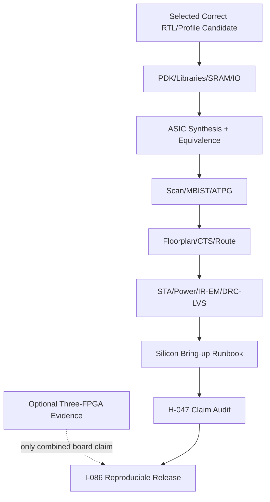

# 第8阶段：ASIC转换、Signoff 边界与可复现发布

状态：**执行指南，不是已完成实现**。本分阶段文件供多人并行分配；所有命令、文件、测试和结果都必须等对应任务实现后产生。任何“完成”必须能引用真实 Git commit/artifact hash/日志，不凭口头状态。

## 1. 这个子系统是做什么的

将本次已验收的 common RTL 候选按声明等级转换为有真实技术输入、DFT/STA/物理签核边界的 ASIC 设计，并独立发布证据不越界的可复现 release；最终高性能候选另由 I-084 的实测决策选定。

## 2. 为什么存在 / 上游输入

- 上游输入：I-080 功能正确性候选、同版 ASIC H-036–H-046 物理链；联合广告三板时另收 S7/H-035，最终高性能声明另收 I-084。
- 已有依赖：已选 RTL/profile、合法 PDK/libraries/SRAM/IO/DFT/foundry 规则，不以 FPGA 三板作为 ASIC 的先决条件。
- 本阶段输出：本次规划不承诺流片；缺PDK/硅样品则相应阶段blocked。
- 首要原则：ASIC不是FPGA wrapper替换。PDK/SRAM/scan/STA/power/DRC-LVS每个都真实gate；没有foundry认可的signoff不能叫tapeout-ready。

技术负责人冻结PDK/library；memory/clock团队转换macro/ICG；DFT团队scan/MBIST/ATPG；physical团队floorplan/CTS/route；signoff团队STA/power/DRC；release团队闭合证据。

## 3. 总体结构

图中的箭头是数据/控制依赖；性能策略不得在正确性前打开。每个分支可以分给不同负责人，但跨接口字段以 [implementation-plan.md](implementation-plan.md) §1.3 和本文件任务卡为准，不能各团队私改。

## 4. 团队分工与进度追踪

| Team | 负责任务 | 当前状态 | Owner | 证据链接 | 下一动作 | Blocker |
|---|---|---|---|---|---|---|
| ASIC负责人 | H-036 | Not started | 待定 | 待填 artifact/commit | 读取任务卡并建立输入锁 | 待填 |
| ASIC负责人 | H-037 | Not started | 待定 | 待填 artifact/commit | 读取任务卡并建立输入锁 | 待填 |
| ASIC负责人 | H-038 | Not started | 待定 | 待填 artifact/commit | 读取任务卡并建立输入锁 | 待填 |
| ASIC负责人 | H-039 | Not started | 待定 | 待填 artifact/commit | 读取任务卡并建立输入锁 | 待填 |
| ASIC负责人 | H-040 | Not started | 待定 | 待填 artifact/commit | 读取任务卡并建立输入锁 | 待填 |
| ASIC负责人 | H-041 | Not started | 待定 | 待填 artifact/commit | 读取任务卡并建立输入锁 | 待填 |
| ASIC负责人 | H-042 | Not started | 待定 | 待填 artifact/commit | 读取任务卡并建立输入锁 | 待填 |
| ASIC负责人 | H-043 | Not started | 待定 | 待填 artifact/commit | 读取任务卡并建立输入锁 | 待填 |
| ASIC负责人 | H-044 | Not started | 待定 | 待填 artifact/commit | 读取任务卡并建立输入锁 | 待填 |
| ASIC负责人 | H-045 | Not started | 待定 | 待填 artifact/commit | 读取任务卡并建立输入锁 | 待填 |
| ASIC负责人 | H-046 | Not started | 待定 | 待填 artifact/commit | 读取任务卡并建立输入锁 | 待填 |
| ASIC负责人 | H-047 | Not started | 待定 | 待填 artifact/commit | 读取任务卡并建立输入锁 | 待填 |
| ASIC集成负责人 | I-085 | Not started | 待定 | 待填 artifact/commit | 读取任务卡并建立输入锁 | 待填 |
| release负责人 | I-086 | Not started | 待定 | 待填 artifact/commit | 读取任务卡并建立输入锁 | 待填 |

状态只能取 `Not started / Inputs locked / In progress / Blocked / Evidence complete / Accepted`。Accepted 需要阶段负责人和验证负责人同时签字；Blocked 必须写最小外部事实、影响范围、请求对象和下一日期，不写“快好了”。

## 5. 可跟踪任务卡

每张卡先给设计者/审查者看的工程合同，再给执行者看的自然语言说明。说明不是替代规格，而是告诉执行者如何按规格工作：先做什么、不能猜什么、什么时候停下来、拿什么证据证明完成。完成定义：对应 `Pass` 全部有直接证据，相关负控制也工作；不是“代码写完”或“仿真曾跑过”。

### H-036 — 冻结 ASIC 产品/工艺输入

- **负责/门禁**：ASIC负责人；物理/转换证据闭合。
- **前置依赖**：H-003；仍受 implementation-plan 集成依赖表约束。
- **做什么**：记录exact process/library revisions、PVT/corner、foundry签核要求与license；若未提供则明确阻断physical signoff，不假设SKY130等开源PDK生产就绪。
- **输入数据/接口**：目标用途、工艺/PDK合法访问、standard cell/SRAM/IO/PLL库、工作电压温度、封装与test预算。
- **输出与交接**：ASIC technology manifest、corner/mode/signoff matrix、外部依赖。
- **设计取舍**：先最小安全物理路径，再扩展容量；FPGA和ASIC证据不互替
- **实现微步骤**：核对exact board/part/tool/license输入；冻结source/constraints/image与可复现脚本；执行单元/构建/时序或对应工艺任务；核对真实报告和设备/映像ID；运行共同corpus与negative controls；归档hash、日志、限制和恢复步骤；未满足门槛则明确blocked并反馈架构。
- **主要阻塞风险**：错误part、旧bitstream、PS/DDR/coherence假设、报告缺失仍绿灯；阻断规则：FPGA成功直接推断ASIC可制造，或把教学PDK运行当production signoff。
- **验收证据**：每必需库/模型可合法取得且覆盖目标corner；缺项有明确owner/action而不是伪fallback。；验证口径：每必需库/模型可合法取得且覆盖目标corner；缺项有明确owner/action而不是伪fallback。
- **失败/回退动作**：FPGA成功直接推断ASIC可制造，或把教学PDK运行当production signoff。
- **来源覆盖**：later real-design conversion, ASIC prerequisites。；来源 HR-009, HR-012。
- **执行者目标**：把“冻结 ASIC 产品/工艺输入”做成一个可复核的小交付：接收明确输入，产出可验证证据，并在失败时给出可回退的安全状态。
- **执行者须知**：先锁定exact part/tool/license和接口，再构建。所有bitstream、约束、时序报告和板卡日志必须对应同一source hash；禁止用仿真或另一family代替实板证据。
- **建议工作顺序**：核对exact board/part/tool/license输入；冻结source/constraints/image与可复现脚本；执行单元/构建/时序或对应工艺任务；核对真实报告和设备/映像ID；运行共同corpus与negative controls；归档hash、日志、限制和恢复步骤；未满足门槛则明确blocked并反馈架构。
- **可接受完成**：每必需库/模型可合法取得且覆盖目标corner；缺项有明确owner/action而不是伪fallback。
- **何时停止求助**：主要风险是错误part、旧bitstream、PS/DDR/coherence假设、报告缺失仍绿灯。遇到缺失输入、互相矛盾的合同、工具/板卡不可用或验证无法区分错误时，不要猜测；把任务标为Blocked，记录最小事实和需要的上游决定。
- **交付说明**：交接时提供输出：ASIC technology manifest、corner/mode/signoff matrix、外部依赖。；同时更新Track Log、状态、证据hash/commit和下一步。不要把未验证的半成品标成Evidence complete。
- **参考资料**：HR-009, HR-012。
- **进度日志**：2026-09-29 规划生成——未开始；后续每次状态变化追加日期、commit/artifact、证据和下一步。

### H-037 — 实现 SRAM macro adapter 与 BIST 访问合同

- **负责/门禁**：ASIC负责人；物理/转换证据闭合。
- **前置依赖**：H-036, H-004；仍受 implementation-plan 集成依赖表约束。
- **做什么**：映射RAM到合法macro组合，处理width/depth banking、collision与reset差异；boot ROM方式与power-up unknown显式化，测试端口不得破坏功能协议。
- **输入数据/接口**：macro端口/latency/mask/ECC/repair/test规格、PRF/VRF/cache需求。
- **输出与交接**：SRAM/ROM adapters、macro placement list、functional equivalence cases。
- **设计取舍**：先最小安全物理路径，再扩展容量；FPGA和ASIC证据不互替
- **实现微步骤**：核对exact board/part/tool/license输入；冻结source/constraints/image与可复现脚本；执行单元/构建/时序或对应工艺任务；核对真实报告和设备/映像ID；运行共同corpus与negative controls；归档hash、日志、限制和恢复步骤；未满足门槛则明确blocked并反馈架构。
- **主要阻塞风险**：错误part、旧bitstream、PS/DDR/coherence假设、报告缺失仍绿灯；阻断规则：继续依赖FPGA INIT或BRAM read-first默认行为。
- **验收证据**：所有合法memory访问与generic模型一致；macro不可支持模式通过明确逻辑解决且面积时序计入。；验证口径：所有合法memory访问与generic模型一致；macro不可支持模式通过明确逻辑解决且面积时序计入。
- **失败/回退动作**：继续依赖FPGA INIT或BRAM read-first默认行为。
- **来源覆盖**：ASIC memory portability, MBIST foundation。；来源 implementation-plan.md, HR-009。
- **执行者目标**：把“SRAM macro adapter 与 BIST 访问合同”做成一个可复核的小交付：接收明确输入，产出可验证证据，并在失败时给出可回退的安全状态。
- **执行者须知**：先锁定exact part/tool/license和接口，再构建。所有bitstream、约束、时序报告和板卡日志必须对应同一source hash；禁止用仿真或另一family代替实板证据。
- **建议工作顺序**：核对exact board/part/tool/license输入；冻结source/constraints/image与可复现脚本；执行单元/构建/时序或对应工艺任务；核对真实报告和设备/映像ID；运行共同corpus与negative controls；归档hash、日志、限制和恢复步骤；未满足门槛则明确blocked并反馈架构。
- **可接受完成**：所有合法memory访问与generic模型一致；macro不可支持模式通过明确逻辑解决且面积时序计入。
- **何时停止求助**：主要风险是错误part、旧bitstream、PS/DDR/coherence假设、报告缺失仍绿灯。遇到缺失输入、互相矛盾的合同、工具/板卡不可用或验证无法区分错误时，不要猜测；把任务标为Blocked，记录最小事实和需要的上游决定。
- **交付说明**：交接时提供输出：SRAM/ROM adapters、macro placement list、functional equivalence cases。；同时更新Track Log、状态、证据hash/commit和下一步。不要把未验证的半成品标成Evidence complete。
- **参考资料**：implementation-plan.md, HR-009。
- **进度日志**：2026-09-29 规划生成——未开始；后续每次状态变化追加日期、commit/artifact、证据和下一步。

### H-038 — 定义 ASIC clock/reset/DFT modes

- **负责/门禁**：ASIC负责人；物理/转换证据闭合。
- **前置依赖**：H-036, H-005；仍受 implementation-plan 集成依赖表约束。
- **做什么**：使用library ICG和test enable，定义reset sequencing/RDC/scan override；单电源单频为默认，DVFS/多电源必须单独新增mode/UPF契约。
- **输入数据/接口**：functional/test clocks、reset sources、PLL/clock-gating cells、power domains。
- **输出与交接**：clock/reset architecture、mode table、gating checks。
- **设计取舍**：先最小安全物理路径，再扩展容量；FPGA和ASIC证据不互替
- **实现微步骤**：核对exact board/part/tool/license输入；冻结source/constraints/image与可复现脚本；执行单元/构建/时序或对应工艺任务；核对真实报告和设备/映像ID；运行共同corpus与negative controls；归档hash、日志、限制和恢复步骤；未满足门槛则明确blocked并反馈架构。
- **主要阻塞风险**：错误part、旧bitstream、PS/DDR/coherence假设、报告缺失仍绿灯；阻断规则：普通组合门代替ICG或DFT模式未纳入时序。
- **验收证据**：functional/scan/reset模式无时钟毛刺、每域解除受控，所有clock crossing有策略。；验证口径：functional/scan/reset模式无时钟毛刺、每域解除受控，所有clock crossing有策略。
- **失败/回退动作**：普通组合门代替ICG或DFT模式未纳入时序。
- **来源覆盖**：ASIC clocks, reset, CDC/RDC。；来源 HR-009, platform-plan.md。
- **执行者目标**：把“定义 ASIC clock/reset/DFT modes”做成一个可复核的小交付：接收明确输入，产出可验证证据，并在失败时给出可回退的安全状态。
- **执行者须知**：先锁定exact part/tool/license和接口，再构建。所有bitstream、约束、时序报告和板卡日志必须对应同一source hash；禁止用仿真或另一family代替实板证据。
- **建议工作顺序**：核对exact board/part/tool/license输入；冻结source/constraints/image与可复现脚本；执行单元/构建/时序或对应工艺任务；核对真实报告和设备/映像ID；运行共同corpus与negative controls；归档hash、日志、限制和恢复步骤；未满足门槛则明确blocked并反馈架构。
- **可接受完成**：functional/scan/reset模式无时钟毛刺、每域解除受控，所有clock crossing有策略。
- **何时停止求助**：主要风险是错误part、旧bitstream、PS/DDR/coherence假设、报告缺失仍绿灯。遇到缺失输入、互相矛盾的合同、工具/板卡不可用或验证无法区分错误时，不要猜测；把任务标为Blocked，记录最小事实和需要的上游决定。
- **交付说明**：交接时提供输出：clock/reset architecture、mode table、gating checks。；同时更新Track Log、状态、证据hash/commit和下一步。不要把未验证的半成品标成Evidence complete。
- **参考资料**：HR-009, platform-plan.md。
- **进度日志**：2026-09-29 规划生成——未开始；后续每次状态变化追加日期、commit/artifact、证据和下一步。

### H-039 — 进行 technology-mapped synthesis 与等价

- **负责/门禁**：ASIC负责人；物理/转换证据闭合。
- **前置依赖**：H-037, H-038；仍受 implementation-plan 集成依赖表约束。
- **做什么**：lint/elaboration/synthesis，检查latches/multidrivers/uninitialized controls；RTL→gate sequential equivalence覆盖真实reset和macro假设，明确cutpoints。
- **输入数据/接口**：common RTL release、libraries、SDC、blackbox/macro功能模型。
- **输出与交接**：gate netlist、area/timing、equivalence proof/failed obligations。
- **设计取舍**：先最小安全物理路径，再扩展容量；FPGA和ASIC证据不互替
- **实现微步骤**：核对exact board/part/tool/license输入；冻结source/constraints/image与可复现脚本；执行单元/构建/时序或对应工艺任务；核对真实报告和设备/映像ID；运行共同corpus与negative controls；归档hash、日志、限制和恢复步骤；未满足门槛则明确blocked并反馈架构。
- **主要阻塞风险**：错误part、旧bitstream、PS/DDR/coherence假设、报告缺失仍绿灯；阻断规则：只verilog编译成功或数百unproven points仍称等价。
- **验收证据**：等价范围闭合、没有用blackbox屏蔽架构状态；综合资源映射与合同一致。；验证口径：等价范围闭合、没有用blackbox屏蔽架构状态；综合资源映射与合同一致。
- **失败/回退动作**：只verilog编译成功或数百unproven points仍称等价。
- **来源覆盖**：ASIC functional preservation, synthesis correctness。；来源 HR-009, validation-plan.md。
- **执行者目标**：把“进行 technology-mapped synthesis 与等价”做成一个可复核的小交付：接收明确输入，产出可验证证据，并在失败时给出可回退的安全状态。
- **执行者须知**：先锁定exact part/tool/license和接口，再构建。所有bitstream、约束、时序报告和板卡日志必须对应同一source hash；禁止用仿真或另一family代替实板证据。
- **建议工作顺序**：核对exact board/part/tool/license输入；冻结source/constraints/image与可复现脚本；执行单元/构建/时序或对应工艺任务；核对真实报告和设备/映像ID；运行共同corpus与negative controls；归档hash、日志、限制和恢复步骤；未满足门槛则明确blocked并反馈架构。
- **可接受完成**：等价范围闭合、没有用blackbox屏蔽架构状态；综合资源映射与合同一致。
- **何时停止求助**：主要风险是错误part、旧bitstream、PS/DDR/coherence假设、报告缺失仍绿灯。遇到缺失输入、互相矛盾的合同、工具/板卡不可用或验证无法区分错误时，不要猜测；把任务标为Blocked，记录最小事实和需要的上游决定。
- **交付说明**：交接时提供输出：gate netlist、area/timing、equivalence proof/failed obligations。；同时更新Track Log、状态、证据hash/commit和下一步。不要把未验证的半成品标成Evidence complete。
- **参考资料**：HR-009, validation-plan.md。
- **进度日志**：2026-09-29 规划生成——未开始；后续每次状态变化追加日期、commit/artifact、证据和下一步。

### H-040 — 插入 scan 并验证模式隔离

- **负责/门禁**：ASIC负责人；物理/转换证据闭合。
- **前置依赖**：H-039；仍受 implementation-plan 集成依赖表约束。
- **做什么**：用所选DFT流程做scan replacement/chain stitching，定义跨clock lockup/test ordering；验证functional scan-enable=0等价和shift/capture模式。
- **输入数据/接口**：scan-cell library、clock/reset/test mode、chain length/IO预算。
- **输出与交接**：scan netlist、chain map、DFT DRC与功能等价结果。
- **设计取舍**：先最小安全物理路径，再扩展容量；FPGA和ASIC证据不互替
- **实现微步骤**：核对exact board/part/tool/license输入；冻结source/constraints/image与可复现脚本；执行单元/构建/时序或对应工艺任务；核对真实报告和设备/映像ID；运行共同corpus与negative controls；归档hash、日志、限制和恢复步骤；未满足门槛则明确blocked并反馈架构。
- **主要阻塞风险**：错误part、旧bitstream、PS/DDR/coherence假设、报告缺失仍绿灯；阻断规则：仅OpenROAD插入chain就宣称ATPG/制造测试完成。
- **验收证据**：所有目标flops有明确scan/合法例外，chain连接和capture可达；scan改动不改变functional逻辑。；验证口径：所有目标flops有明确scan/合法例外，chain连接和capture可达；scan改动不改变functional逻辑。
- **失败/回退动作**：仅OpenROAD插入chain就宣称ATPG/制造测试完成。
- **来源覆盖**：DFT, scan, functional/test separation。；来源 HR-009。
- **执行者目标**：把“插入 scan 并模式隔离”做成一个可复核的小交付：接收明确输入，产出可验证证据，并在失败时给出可回退的安全状态。
- **执行者须知**：先锁定exact part/tool/license和接口，再构建。所有bitstream、约束、时序报告和板卡日志必须对应同一source hash；禁止用仿真或另一family代替实板证据。
- **建议工作顺序**：核对exact board/part/tool/license输入；冻结source/constraints/image与可复现脚本；执行单元/构建/时序或对应工艺任务；核对真实报告和设备/映像ID；运行共同corpus与negative controls；归档hash、日志、限制和恢复步骤；未满足门槛则明确blocked并反馈架构。
- **可接受完成**：所有目标flops有明确scan/合法例外，chain连接和capture可达；scan改动不改变functional逻辑。
- **何时停止求助**：主要风险是错误part、旧bitstream、PS/DDR/coherence假设、报告缺失仍绿灯。遇到缺失输入、互相矛盾的合同、工具/板卡不可用或验证无法区分错误时，不要猜测；把任务标为Blocked，记录最小事实和需要的上游决定。
- **交付说明**：交接时提供输出：scan netlist、chain map、DFT DRC与功能等价结果。；同时更新Track Log、状态、证据hash/commit和下一步。不要把未验证的半成品标成Evidence complete。
- **参考资料**：HR-009。
- **进度日志**：2026-09-29 规划生成——未开始；后续每次状态变化追加日期、commit/artifact、证据和下一步。

### H-041 — 制定 ATPG/MBIST/repair 验收

- **负责/门禁**：ASIC负责人；物理/转换证据闭合。
- **前置依赖**：H-040, H-037；仍受 implementation-plan 集成依赖表约束。
- **做什么**：生成ATPG fault list/patterns与覆盖分母，审查untestable/excluded faults；MBIST覆盖地址/数据/byte masks/repair路径，定义test-time与tester接口。
- **输入数据/接口**：stuck-at/transition fault模型、SRAM test/repair能力、manufacturing要求。
- **输出与交接**：ATPG/MBIST报告、fault coverage目标与签核阈值、pattern provenance。
- **设计取舍**：先最小安全物理路径，再扩展容量；FPGA和ASIC证据不互替
- **实现微步骤**：核对exact board/part/tool/license输入；冻结source/constraints/image与可复现脚本；执行单元/构建/时序或对应工艺任务；核对真实报告和设备/映像ID；运行共同corpus与negative controls；归档hash、日志、限制和恢复步骤；未满足门槛则明确blocked并反馈架构。
- **主要阻塞风险**：错误part、旧bitstream、PS/DDR/coherence假设、报告缺失仍绿灯；阻断规则：只pattern数量非零即通过，或把functional程序跑通代替manufacturing coverage。
- **验收证据**：数值目标在运行前按产品要求冻结且实际报告达标；所有排除有理由，repair后功能复验。；验证口径：数值目标在运行前按产品要求冻结且实际报告达标；所有排除有理由，repair后功能复验。
- **失败/回退动作**：只pattern数量非零即通过，或把functional程序跑通代替manufacturing coverage。
- **来源覆盖**：real ASIC manufacturing test。；来源 HR-009, H-036。
- **执行者目标**：把“制定 ATPG/MBIST/repair 验收”做成一个可复核的小交付：接收明确输入，产出可验证证据，并在失败时给出可回退的安全状态。
- **执行者须知**：先锁定exact part/tool/license和接口，再构建。所有bitstream、约束、时序报告和板卡日志必须对应同一source hash；禁止用仿真或另一family代替实板证据。
- **建议工作顺序**：核对exact board/part/tool/license输入；冻结source/constraints/image与可复现脚本；执行单元/构建/时序或对应工艺任务；核对真实报告和设备/映像ID；运行共同corpus与negative controls；归档hash、日志、限制和恢复步骤；未满足门槛则明确blocked并反馈架构。
- **可接受完成**：数值目标在运行前按产品要求冻结且实际报告达标；所有排除有理由，repair后功能复验。
- **何时停止求助**：主要风险是错误part、旧bitstream、PS/DDR/coherence假设、报告缺失仍绿灯。遇到缺失输入、互相矛盾的合同、工具/板卡不可用或验证无法区分错误时，不要猜测；把任务标为Blocked，记录最小事实和需要的上游决定。
- **交付说明**：交接时提供输出：ATPG/MBIST报告、fault coverage目标与签核阈值、pattern provenance。；同时更新Track Log、状态、证据hash/commit和下一步。不要把未验证的半成品标成Evidence complete。
- **参考资料**：HR-009, H-036。
- **进度日志**：2026-09-29 规划生成——未开始；后续每次状态变化追加日期、commit/artifact、证据和下一步。

### H-042 — 实施 floorplan/PDN/macro placement

- **负责/门禁**：ASIC负责人；物理/转换证据闭合。
- **前置依赖**：H-039, H-040；仍受 implementation-plan 集成依赖表约束。
- **做什么**：将PRF/FU/IQ/completion置于局部岛，约束pod间长线；布PDN/macro halos/channels并检查拥塞、pin access与供电连通。
- **输入数据/接口**：macro/IO尺寸、utilization目标、power grid规则、cluster locality。
- **输出与交接**：floorplan/PDN数据库、拥塞/连接报告、面积分解。
- **设计取舍**：先最小安全物理路径，再扩展容量；FPGA和ASIC证据不互替
- **实现微步骤**：核对exact board/part/tool/license输入；冻结source/constraints/image与可复现脚本；执行单元/构建/时序或对应工艺任务；核对真实报告和设备/映像ID；运行共同corpus与negative controls；归档hash、日志、限制和恢复步骤；未满足门槛则明确blocked并反馈架构。
- **主要阻塞风险**：错误part、旧bitstream、PS/DDR/coherence假设、报告缺失仍绿灯；阻断规则：用零wire延迟推定fabric Fmax或只看standard-cell面积忽略RAM/路由。
- **验收证据**：无macro重叠/未供电cell/不可布区域，预计长路径与协议pipeline一致。；验证口径：无macro重叠/未供电cell/不可布区域，预计长路径与协议pipeline一致。
- **失败/回退动作**：用零wire延迟推定fabric Fmax或只看standard-cell面积忽略RAM/路由。
- **来源覆盖**：ASIC physical architecture, locality cost。；来源 HR-012, architecture-review.md。
- **执行者目标**：把“实施 floorplan/PDN/macro placement”做成一个可复核的小交付：接收明确输入，产出可验证证据，并在失败时给出可回退的安全状态。
- **执行者须知**：先锁定exact part/tool/license和接口，再构建。所有bitstream、约束、时序报告和板卡日志必须对应同一source hash；禁止用仿真或另一family代替实板证据。
- **建议工作顺序**：核对exact board/part/tool/license输入；冻结source/constraints/image与可复现脚本；执行单元/构建/时序或对应工艺任务；核对真实报告和设备/映像ID；运行共同corpus与negative controls；归档hash、日志、限制和恢复步骤；未满足门槛则明确blocked并反馈架构。
- **可接受完成**：无macro重叠/未供电cell/不可布区域，预计长路径与协议pipeline一致。
- **何时停止求助**：主要风险是错误part、旧bitstream、PS/DDR/coherence假设、报告缺失仍绿灯。遇到缺失输入、互相矛盾的合同、工具/板卡不可用或验证无法区分错误时，不要猜测；把任务标为Blocked，记录最小事实和需要的上游决定。
- **交付说明**：交接时提供输出：floorplan/PDN数据库、拥塞/连接报告、面积分解。；同时更新Track Log、状态、证据hash/commit和下一步。不要把未验证的半成品标成Evidence complete。
- **参考资料**：HR-012, architecture-review.md。
- **进度日志**：2026-09-29 规划生成——未开始；后续每次状态变化追加日期、commit/artifact、证据和下一步。

### H-043 — 完成 CTS、route 与多角 STA

- **负责/门禁**：ASIC负责人；物理/转换证据闭合。
- **前置依赖**：H-042, H-038；仍受 implementation-plan 集成依赖表约束。
- **做什么**：placement/CTS/route/extraction后检查setup/hold、recovery/removal、pulse width、gating、max transition/capacitance；逐条审查exceptions，处理OCV及foundry要求。
- **输入数据/接口**：MCMM modes/corners、clock uncertainties、derates、IO/false/multicycle exceptions。
- **输出与交接**：routed netlist/parasitics、全corner timing与clock reports。
- **设计取舍**：先最小安全物理路径，再扩展容量；FPGA和ASIC证据不互替
- **实现微步骤**：核对exact board/part/tool/license输入；冻结source/constraints/image与可复现脚本；执行单元/构建/时序或对应工艺任务；核对真实报告和设备/映像ID；运行共同corpus与negative controls；归档hash、日志、限制和恢复步骤；未满足门槛则明确blocked并反馈架构。
- **主要阻塞风险**：错误part、旧bitstream、PS/DDR/coherence假设、报告缺失仍绿灯；阻断规则：只typical corner满足、pre-route timing冒充signoff或为绿灯放宽真实路径。
- **验收证据**：所有签核mode/corner达冻结目标，intended paths无未约束，例外有结构证明。；验证口径：所有签核mode/corner达冻结目标，intended paths无未约束，例外有结构证明。
- **失败/回退动作**：只typical corner满足、pre-route timing冒充signoff或为绿灯放宽真实路径。
- **来源覆盖**：ASIC STA, timing closure。；来源 HR-012, H-036。
- **执行者目标**：把“CTS、route 与多角 STA”做成一个可复核的小交付：接收明确输入，产出可验证证据，并在失败时给出可回退的安全状态。
- **执行者须知**：先锁定exact part/tool/license和接口，再构建。所有bitstream、约束、时序报告和板卡日志必须对应同一source hash；禁止用仿真或另一family代替实板证据。
- **建议工作顺序**：核对exact board/part/tool/license输入；冻结source/constraints/image与可复现脚本；执行单元/构建/时序或对应工艺任务；核对真实报告和设备/映像ID；运行共同corpus与negative controls；归档hash、日志、限制和恢复步骤；未满足门槛则明确blocked并反馈架构。
- **可接受完成**：所有签核mode/corner达冻结目标，intended paths无未约束，例外有结构证明。
- **何时停止求助**：主要风险是错误part、旧bitstream、PS/DDR/coherence假设、报告缺失仍绿灯。遇到缺失输入、互相矛盾的合同、工具/板卡不可用或验证无法区分错误时，不要猜测；把任务标为Blocked，记录最小事实和需要的上游决定。
- **交付说明**：交接时提供输出：routed netlist/parasitics、全corner timing与clock reports。；同时更新Track Log、状态、证据hash/commit和下一步。不要把未验证的半成品标成Evidence complete。
- **参考资料**：HR-012, H-036。
- **进度日志**：2026-09-29 规划生成——未开始；后续每次状态变化追加日期、commit/artifact、证据和下一步。

### H-044 — 验证 power intent、IR/EM 与热边界

- **负责/门禁**：ASIC负责人；物理/转换证据闭合。
- **前置依赖**：H-043；仍受 implementation-plan 集成依赖表约束。
- **做什么**：用真实activity与保守worst-case评估功耗、IR drop/EM/thermal；若多电源，检查isolation/level shifting/retention及掉电恢复，与动态lease协议联动。
- **输入数据/接口**：workload activity、power model/corners、PDN、可选UPF。
- **输出与交接**：power/IR/EM/thermal reports、UPF equivalence与power-state tests（适用时）。
- **设计取舍**：先最小安全物理路径，再扩展容量；FPGA和ASIC证据不互替
- **实现微步骤**：核对exact board/part/tool/license输入；冻结source/constraints/image与可复现脚本；执行单元/构建/时序或对应工艺任务；核对真实报告和设备/映像ID；运行共同corpus与negative controls；归档hash、日志、限制和恢复步骤；未满足门槛则明确blocked并反馈架构。
- **主要阻塞风险**：错误part、旧bitstream、PS/DDR/coherence假设、报告缺失仍绿灯；阻断规则：FPGA板功耗直接当ASIC功耗，或隔离单元缺失仍允许运行时power gating。
- **验收证据**：按所选工艺/封装限制全部达标；未使用多电源时明确not applicable并提供单域结构证据。；验证口径：按所选工艺/封装限制全部达标；未使用多电源时明确not applicable并提供单域结构证据。
- **失败/回退动作**：FPGA板功耗直接当ASIC功耗，或隔离单元缺失仍允许运行时power gating。
- **来源覆盖**：ASIC power integrity, dynamic resource safety。；来源 H-036, architecture-review.md。
- **执行者目标**：把“power intent、IR/EM 与热边界”做成一个可复核的小交付：接收明确输入，产出可验证证据，并在失败时给出可回退的安全状态。
- **执行者须知**：先锁定exact part/tool/license和接口，再构建。所有bitstream、约束、时序报告和板卡日志必须对应同一source hash；禁止用仿真或另一family代替实板证据。
- **建议工作顺序**：核对exact board/part/tool/license输入；冻结source/constraints/image与可复现脚本；执行单元/构建/时序或对应工艺任务；核对真实报告和设备/映像ID；运行共同corpus与negative controls；归档hash、日志、限制和恢复步骤；未满足门槛则明确blocked并反馈架构。
- **可接受完成**：按所选工艺/封装限制全部达标；未使用多电源时明确not applicable并提供单域结构证据。
- **何时停止求助**：主要风险是错误part、旧bitstream、PS/DDR/coherence假设、报告缺失仍绿灯。遇到缺失输入、互相矛盾的合同、工具/板卡不可用或验证无法区分错误时，不要猜测；把任务标为Blocked，记录最小事实和需要的上游决定。
- **交付说明**：交接时提供输出：power/IR/EM/thermal reports、UPF equivalence与power-state tests（适用时）。；同时更新Track Log、状态、证据hash/commit和下一步。不要把未验证的半成品标成Evidence complete。
- **参考资料**：H-036, architecture-review.md。
- **进度日志**：2026-09-29 规划生成——未开始；后续每次状态变化追加日期、commit/artifact、证据和下一步。

### H-045 — 完成 DRC/LVS/ERC 与 post-route 等价

- **负责/门禁**：ASIC负责人；物理/转换证据闭合。
- **前置依赖**：H-043, H-044, H-041；仍受 implementation-plan 集成依赖表约束。
- **做什么**：执行DRC/LVS/ERC/antenna及需要的可靠性检查；post-route网表等价与必要SDF reset/IO smoke；全waiver逐项审查。
- **输入数据/接口**：foundry规则deck、extracted layout、schematic/netlist、scan/functional modes。
- **输出与交接**：foundry-required signoff reports、GDS/netlist checksum闭合。
- **设计取舍**：先最小安全物理路径，再扩展容量；FPGA和ASIC证据不互替
- **实现微步骤**：核对exact board/part/tool/license输入；冻结source/constraints/image与可复现脚本；执行单元/构建/时序或对应工艺任务；核对真实报告和设备/映像ID；运行共同corpus与negative controls；归档hash、日志、限制和恢复步骤；未满足门槛则明确blocked并反馈架构。
- **主要阻塞风险**：错误part、旧bitstream、PS/DDR/coherence假设、报告缺失仍绿灯；阻断规则：开源flow的“flow complete”替代foundry认可签核。
- **验收证据**：无未批准的signoff error/waiver，layout与提交netlist/库一致，新增buffer/scan不破坏功能。；验证口径：无未批准的signoff error/waiver，layout与提交netlist/库一致，新增buffer/scan不破坏功能。
- **失败/回退动作**：开源flow的“flow complete”替代foundry认可签核。
- **来源覆盖**：real physical-design conversion, tapeout boundary。；来源 HR-009, HR-012, H-036。
- **执行者目标**：把“DRC/LVS/ERC 与 post-route 等价”做成一个可复核的小交付：接收明确输入，产出可验证证据，并在失败时给出可回退的安全状态。
- **执行者须知**：先锁定exact part/tool/license和接口，再构建。所有bitstream、约束、时序报告和板卡日志必须对应同一source hash；禁止用仿真或另一family代替实板证据。
- **建议工作顺序**：核对exact board/part/tool/license输入；冻结source/constraints/image与可复现脚本；执行单元/构建/时序或对应工艺任务；核对真实报告和设备/映像ID；运行共同corpus与negative controls；归档hash、日志、限制和恢复步骤；未满足门槛则明确blocked并反馈架构。
- **可接受完成**：无未批准的signoff error/waiver，layout与提交netlist/库一致，新增buffer/scan不破坏功能。
- **何时停止求助**：主要风险是错误part、旧bitstream、PS/DDR/coherence假设、报告缺失仍绿灯。遇到缺失输入、互相矛盾的合同、工具/板卡不可用或验证无法区分错误时，不要猜测；把任务标为Blocked，记录最小事实和需要的上游决定。
- **交付说明**：交接时提供输出：foundry-required signoff reports、GDS/netlist checksum闭合。；同时更新Track Log、状态、证据hash/commit和下一步。不要把未验证的半成品标成Evidence complete。
- **参考资料**：HR-009, HR-012, H-036。
- **进度日志**：2026-09-29 规划生成——未开始；后续每次状态变化追加日期、commit/artifact、证据和下一步。

### H-046 — 冻结封装、板测与首硅 bring-up 计划

- **负责/门禁**：ASIC负责人；物理/转换证据闭合。
- **前置依赖**：H-045；仍受 implementation-plan 集成依赖表约束。
- **做什么**：定义power sequencing、电气测量、JTAG ID、scan/MBIST、ROM/UART、同一architectural signatures、PVT/frequency sweep与failure binning。
- **输入数据/接口**：pad/package/rail/clock/debug/test接口、ATPG/MBIST、RISC-V corpus。
- **输出与交接**：silicon bring-up runbook、tester/board需求、acceptance matrix。
- **设计取舍**：先最小安全物理路径，再扩展容量；FPGA和ASIC证据不互替
- **实现微步骤**：核对exact board/part/tool/license输入；冻结source/constraints/image与可复现脚本；执行单元/构建/时序或对应工艺任务；核对真实报告和设备/映像ID；运行共同corpus与negative controls；归档hash、日志、限制和恢复步骤；未满足门槛则明确blocked并反馈架构。
- **主要阻塞风险**：错误part、旧bitstream、PS/DDR/coherence假设、报告缺失仍绿灯；阻断规则：FPGA实板测试被称为真实ASIC硅后验证。
- **验收证据**：每个制造/功能/时序目标有测点与pass/fail，工具/板/样片access明确；样片未回则状态仅为计划。；验证口径：每个制造/功能/时序目标有测点与pass/fail，工具/板/样片access明确；样片未回则状态仅为计划。
- **失败/回退动作**：FPGA实板测试被称为真实ASIC硅后验证。
- **来源覆盖**：later physical silicon validation, processor lifecycle。；来源 H-036, validation-plan.md。
- **执行者目标**：把“冻结封装、板测与首硅 bring-up 计划”做成一个可复核的小交付：接收明确输入，产出可验证证据，并在失败时给出可回退的安全状态。
- **执行者须知**：先锁定exact part/tool/license和接口，再构建。所有bitstream、约束、时序报告和板卡日志必须对应同一source hash；禁止用仿真或另一family代替实板证据。
- **建议工作顺序**：核对exact board/part/tool/license输入；冻结source/constraints/image与可复现脚本；执行单元/构建/时序或对应工艺任务；核对真实报告和设备/映像ID；运行共同corpus与negative controls；归档hash、日志、限制和恢复步骤；未满足门槛则明确blocked并反馈架构。
- **可接受完成**：每个制造/功能/时序目标有测点与pass/fail，工具/板/样片access明确；样片未回则状态仅为计划。
- **何时停止求助**：主要风险是错误part、旧bitstream、PS/DDR/coherence假设、报告缺失仍绿灯。遇到缺失输入、互相矛盾的合同、工具/板卡不可用或验证无法区分错误时，不要猜测；把任务标为Blocked，记录最小事实和需要的上游决定。
- **交付说明**：交接时提供输出：silicon bring-up runbook、tester/board需求、acceptance matrix。；同时更新Track Log、状态、证据hash/commit和下一步。不要把未验证的半成品标成Evidence complete。
- **参考资料**：H-036, validation-plan.md。
- **进度日志**：2026-09-29 规划生成——未开始；后续每次状态变化追加日期、commit/artifact、证据和下一步。

### H-047 — 审核 ASIC-ready 与 tapeout 声明

- **负责/门禁**：ASIC负责人；物理/转换证据闭合。
- **前置依赖**：H-046；只在联合广告 FPGA 三板时另收 H-035，不把 FPGA 验收作为 ASIC 审核的无条件前置。
- **做什么**：对同一 ASIC candidate 的 source/profile/工艺/mode/许可逐声明审核，区分 portable RTL、ASIC synthesized、routed、signoff complete、taped out、silicon validated。
- **输入数据/接口**：H-036–H-046 原始报告和批准记录、候选 RTL/config/netlist/layout hash、foundry 许可与 waiver；联合三板 claim 才附 H-035。
- **输出与交接**：逐等级 PASS/BLOCKED/NOT_CLAIMED 的 ASIC readiness report、缺口及责任人交 I-085。
- **设计取舍**：板卡证据与 ASIC 工艺证据相互独立；下级已证明等级可列出，但不能借此称流片完成。
- **实现微步骤**：锁 candidate/hash 与声明等级→检查库/PDK 权限→逐 mode/corner 核 H-039–H-045 与 H-046 bring-up 测点→审 waivers 和 reviewer signoff→按等级出结论及原始 artifact 路径。
- **主要阻塞风险**：错候选报告、缺工艺许可、把开源综合视为签核、把尚未制造/收到的样片称已验收；只阻断受影响 ASIC 声明。
- **验收证据**：所广告等级的每项同版物理/DFT/许可门禁真实 PASS；缺 PDK/许可/硅样本的高等级保持 BLOCKED 或 NOT_CLAIMED。
- **失败/回退动作**：阻断缺报告/许可/批准的 ASIC 等级，保留已有可证明的更低等级与 candidate hash；不回填伪 PASS。
- **来源覆盖**：portability to real design, honest end-to-end evidence。；来源 references.md, verification.md。
- **执行者目标**：审核实际声称的 ASIC 等级并给 I-085 一份可复查的逐级证据结论。
- **执行者须知**：报告必须来自同一候选工艺与版本；H-035 只用于另外声称的 FPGA 三板，不把跨技术平台的成功拼作一个 ASIC 签核。
- **建议工作顺序**：冻结声明/候选→核许可→按等级查签核项目与批准人→核哈希/waiver→逐声明 PASS 或阻断。
- **可接受完成**：真实报告支撑每个广告等级；缺失外部输入有负责人与恢复动作但不能签通过。
- **何时停止求助**：库/PDK、签核模式、审批者或候选身份缺失时保存具体缺口并交 owner，不能臆测通过。
- **交付说明**：交付 candidate/mode/corner 索引、逐等级 verdict、原始报告与 blocker ledger 给 I-085；更新 Track Log。
- **参考资料**：references.md, verification.md。
- **进度日志**：2026-09-29 规划生成——未开始；后续每次状态变化追加日期、commit/artifact、证据和下一步。

### I-085 — 完成 ASIC-ready portability gate

- **负责/门禁**：ASIC集成负责人；技术转换证据。
- **前置依赖**：I-080；另经 implementation-plan 集成表要求 H-047；最终高性能 ASIC 配置另取 I-084，同一 ASIC 目标不依赖三板 I-081。
- **做什么**：仅在广告ASIC-ready时对该候选common RTL做wrapper替换与等价、synthesis/DFT和目标工艺的physical/signoff；不以FPGA Fmax外推硅指标，也不作为普通p0发布前置。
- **输入数据/接口**：声明等级及RTL/profile/source hash、授权PDK/libraries/SRAM/clock/DFT模型、SDC/modes/corners、H-036..H-047候选对应的报告。
- **输出与交接**：按候选hash/工艺/mode索引的ASIC conversion evidence及声明等级/缺口账本，交I-086仅用于广告的ASIC claim。
- **设计取舍**：portable RTL、synthesized、routed、signoff complete、taped out、silicon validated分别声明；缺PDK/signoff不能称tapeout-ready。
- **实现微步骤**：冻结候选和授权输入；转换SRAM/clock/reset/DFT；核对等价与故障覆盖；逐mode核对多corner route STA、power/IR/EM、DRC/LVS/ERC/post-route等价及waivers；经H-047审阅每种声明的最高可证明等级。
- **主要阻塞风险**：FPGA timing外推、open-source synthesis冒充foundry signoff、报告跨候选或scan遗漏；标明受影响ASIC claim与责任人，不转移到p0。
- **验收证据**：对应宣传等级的每项必需ASIC gate均有同候选真实报告；缺PDK/库/许可时只保留可证明的较低等级，不宣传tapeout-ready。
- **失败/回退动作**：标该ASIC claim blocked，附候选hash、具体工艺/许可/报告缺口和外部owner；普通p0 release独立推进。
- **来源覆盖**：portable real design, later ASIC conversion；来源 platform-plan.md。
- **执行者目标**：确定ASIC-ready声明实际由哪一级工艺证据支撑，而不是使ASIC转换成为软件/FPGA发布的必经关卡。
- **执行者须知**：只对明确广告的ASIC候选审计；同一候选与corner/mode证据不得拼接其他版本。
- **建议工作顺序**：锁候选/授权→逐gate核对报告→列waiver/缺口→H-047审计→交I-086声明等级。
- **可接受完成**：广告的等级与H-047和逐项报告一致；缺失输入仅阻断相应ASIC claim。
- **何时停止求助**：PDK、library、DFT/foundry报告或候选身份缺失时交上游owner并记录原始失败记录，不推测通过。
- **交付说明**：提供候选/工艺/mode报告路径、hash、声明等级与阻断项；更新Track Log，不预填结果。
- **参考资料**：platform-plan.md。
- **进度日志**：2026-09-29 规划生成——未开始；后续每次状态变化追加日期、commit/artifact、证据和下一步。

### I-086 — 交付可复现 processor release

- **负责/门禁**：release负责人；可复现发布。
- **前置依赖**：I-080, V-080；仅广告的可选claim需另过其claim gate（例如三板FPGA H-035、RVA23三板H-050、ASIC-ready I-085、ASIC Secure H-051、DCLS I-091以及按目标H-048/H-049）；仍受 implementation-plan 集成依赖表约束。
- **做什么**：从零重建实际支持的配置，重放有限验收集；对每个广告claim核对独立门禁，不让ASIC、RVA23或DCLS的可选失败阻断p0处理器发布。
- **输入数据/接口**：I-080/V-080的p0验收、claim/profile矩阵、Git/submodules/tools/artifacts/licenses/limits；广告硬件或安全能力时加入对应实板/工艺/故障证据。
- **输出与交接**：按profile/board/mode列广告声明、gate、证据hash和unsupported/blocked理由的final release bundle、操作/恢复指南。
- **设计取舍**：静态Depends只列无条件先决；未过条件门禁的能力不得广告，p0 cacheless ordered-memory two-cluster RV64IM仍可独立发布。
- **实现微步骤**：冻结p0与可选声明表；清洁重建/重放p0；按实际广告逐项审H-035/H-050/I-085/H-051/I-091/H-048/H-049适用门禁；核对同源part/tool/image/ELF/签名或ASIC candidate/mode/corner；审license，交独立执行者执行program/run/recover。
- **主要阻塞风险**：浮动upstream、未提交文件、无恢复步骤、把模拟/其他板或其他候选代替目标证据；记录仅受影响的claim及owner。
- **验收证据**：独立执行者用锁定输入重现p0 architectural signatures；每一广告硬件/安全/ASIC claim均有其对应门禁和可追溯产物，未广告能力不成为p0阻塞。
- **失败/回退动作**：撤销未闭合可选claim及能力广告；p0未闭合则保留整体candidate而非release，并交出失败命令、hash、日志和owner。
- **来源覆盖**：end-to-end deliverable, reproducibility, reference tracking；来源 validation-plan.md, platform-plan.md, references.md。
- **执行者目标**：发布可复现p0，并只在附加门禁通过后发布各可选能力。
- **执行者须知**：I-091是DCLS功能验收，不等于安全认证；RVA23 I-098是上板前验收，硬件声明还需H-050；ASIC-ready I-085不属于所有release的依赖。
- **建议工作顺序**：冻结claim矩阵→重建p0→逐条匹配广告与gate→删未通过的广告→独立重放→归档许可、恢复和限制。
- **可接受完成**：p0重放成立且广告仅覆盖已闭合gate；安全等级或硅后状态未经正式证据不得宣称。
- **何时停止求助**：p0复现失败则整体阻断；可选证据缺失时只隔离对应claim，记证据位置、缺项与责任人。
- **交付说明**：提交逐claim证据路径/版本/hash及撤销的广告清单，更新Track Log而不预填测试结果。
- **参考资料**：validation-plan.md, platform-plan.md, references.md。
- **进度日志**：2026-09-29 规划生成——未开始；后续每次状态变化追加日期、commit/artifact、证据和下一步。

## 6. 阶段级阻塞清单

| Blocker | 触发条件 | 立即动作 | 责任升级 |
|---|---|---|---|
| 合同缺失或互相矛盾 | 任一输入没有版本/hash，或两文档字段不一致 | 停止新增实现，更新合同并重跑负控制 | 阶段负责人 → 架构负责人 |
| 验证不能证明 | reference不支持、检查器跳过、trace溢出或空套件 | 标UNSUPPORTED并阻断相应能力，不降级为PASS | 验证负责人 |
| 资源/时序不适配 | synthesis/P&R失败、exact board不支持、ASIC库缺失 | 记录真实报告，缩小几何或请求器件/许可/库决策 | 平台/ASIC负责人 |
| 动态协议错误 | 丢/重packet、ABA、stale response、credit泄漏、drain卡死 | 冻结动态策略，回退到本卡保守模式，建立最小replay | 对应子系统负责人 |
| 性能假设被否定 | fixed/dynamic对照负收益或隐藏资源差异 | 保留负结果，关闭该策略默认路径，不把目标改成成功案例 | 研究集成负责人 |

## 7. 阶段 Track Log（持续追加）

| 日期 | 事件 | 证据 | 负责人 | 下一步 |
|---|---|---|---|---|
| 2026-09-29 | 初始团队指南由完整架构/验证/平台计划生成 | 本文件、source-inventory、references | 规划集成 | 各团队冻结输入并更新上表 |
| 2026-09-29 | 面向较小模型/新工程师补充自然语言执行说明 | 本文件任务卡的执行者目标/须知/建议顺序/停止条件 | 规划集成 | 实施团队按卡执行并回填证据 |
