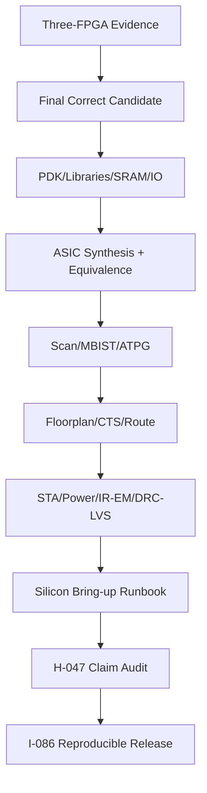

# 第8阶段：ASIC转换、Signoff 边界与可复现发布

状态：**执行指南，不是已完成实现**。本分阶段文件供多人并行分配；所有命令、文件、测试和结果都必须等对应任务实现后产生。任何“完成”必须能引用真实 Git commit/artifact hash/日志，不凭口头状态。

## 1. 这个子系统是做什么的

将最终候选common RTL转换为有真实技术输入、DFT/STA/物理签核边界的ASIC设计，并发布能力不超出证据的可复现release。

## 2. 为什么存在 / 上游输入

- 上游输入：S1-S7最终候选与全部correctness/hardware证据。
- 已有依赖：最终架构候选、合法PDK/libraries/SRAM/IO/DFT/foundry规则。
- 本阶段输出：本次规划不承诺流片；缺PDK/硅样品则相应阶段blocked。
- 首要原则：ASIC不是FPGA wrapper替换。PDK/SRAM/scan/STA/power/DRC-LVS每个都真实gate；没有foundry认可的signoff不能叫tapeout-ready。

技术负责人冻结PDK/library；memory/clock团队转换macro/ICG；DFT团队scan/MBIST/ATPG；physical团队floorplan/CTS/route；signoff团队STA/power/DRC；release团队闭合证据。

## 3. 总体结构

图中的箭头是数据/控制依赖；性能策略不得在正确性前打开。每个分支可以分给不同负责人，但跨接口字段以 [implementation-plan.md](implementation-plan.md) §1.3 和本文件任务卡为准，不能各团队私改。

## 4. 团队分工与进度追踪

| Team | 负责任务 | 当前状态 | Owner | 证据链接 | 下一动作 | Blocker |
|---|---|---|---|---|---|---|
| ASIC负责人 | H-036 | Not started | 待定 | 待填 artifact/commit | 读取任务卡并建立输入锁 | 待填 |
| ASIC负责人 | H-037 | Not started | 待定 | 待填 artifact/commit | 读取任务卡并建立输入锁 | 待填 |
| ASIC负责人 | H-038 | Not started | 待定 | 待填 artifact/commit | 读取任务卡并建立输入锁 | 待填 |
| ASIC负责人 | H-039 | Not started | 待定 | 待填 artifact/commit | 读取任务卡并建立输入锁 | 待填 |
| ASIC负责人 | H-040 | Not started | 待定 | 待填 artifact/commit | 读取任务卡并建立输入锁 | 待填 |
| ASIC负责人 | H-041 | Not started | 待定 | 待填 artifact/commit | 读取任务卡并建立输入锁 | 待填 |
| ASIC负责人 | H-042 | Not started | 待定 | 待填 artifact/commit | 读取任务卡并建立输入锁 | 待填 |
| ASIC负责人 | H-043 | Not started | 待定 | 待填 artifact/commit | 读取任务卡并建立输入锁 | 待填 |
| ASIC负责人 | H-044 | Not started | 待定 | 待填 artifact/commit | 读取任务卡并建立输入锁 | 待填 |
| ASIC负责人 | H-045 | Not started | 待定 | 待填 artifact/commit | 读取任务卡并建立输入锁 | 待填 |
| ASIC负责人 | H-046 | Not started | 待定 | 待填 artifact/commit | 读取任务卡并建立输入锁 | 待填 |
| ASIC负责人 | H-047 | Not started | 待定 | 待填 artifact/commit | 读取任务卡并建立输入锁 | 待填 |
| ASIC集成负责人 | I-085 | Not started | 待定 | 待填 artifact/commit | 读取任务卡并建立输入锁 | 待填 |
| release负责人 | I-086 | Not started | 待定 | 待填 artifact/commit | 读取任务卡并建立输入锁 | 待填 |

状态只能取 `Not started / Inputs locked / In progress / Blocked / Evidence complete / Accepted`。Accepted 需要阶段负责人和验证负责人同时签字；Blocked 必须写最小外部事实、影响范围、请求对象和下一日期，不写“快好了”。

## 5. 可跟踪任务卡

每张卡含实现接口、数据、设计取舍、步骤、交接、验证和回退。完成定义：对应 `Pass` 全部有直接证据，相关负控制也工作；不是“代码写完”或“仿真曾跑过”。

### H-036 — 冻结 ASIC 产品/工艺输入

- **负责/门禁**：ASIC负责人；物理/转换证据闭合。
- **前置依赖**：H-003；仍受 implementation-plan 集成依赖表约束。
- **做什么**：记录exact process/library revisions、PVT/corner、foundry签核要求与license；若未提供则明确阻断physical signoff，不假设SKY130等开源PDK生产就绪。
- **输入数据/接口**：目标用途、工艺/PDK合法访问、standard cell/SRAM/IO/PLL库、工作电压温度、封装与test预算。
- **输出与交接**：ASIC technology manifest、corner/mode/signoff matrix、外部依赖。
- **设计取舍**：先最小安全物理路径，再扩展容量；FPGA和ASIC证据不互替
- **实现微步骤**：核对exact board/part/tool/license输入；冻结source/constraints/image与可复现脚本；执行单元/构建/时序或对应工艺任务；核对真实报告和设备/映像ID；运行共同corpus与negative controls；归档hash、日志、限制和恢复步骤；未满足门槛则明确blocked并反馈架构。
- **主要阻塞风险**：错误part、旧bitstream、PS/DDR/coherence假设、报告缺失仍绿灯；阻断规则：FPGA成功直接推断ASIC可制造，或把教学PDK运行当production signoff。
- **验收证据**：每必需库/模型可合法取得且覆盖目标corner；缺项有明确owner/action而不是伪fallback。；验证口径：每必需库/模型可合法取得且覆盖目标corner；缺项有明确owner/action而不是伪fallback。
- **失败/回退动作**：FPGA成功直接推断ASIC可制造，或把教学PDK运行当production signoff。
- **来源覆盖**：later real-design conversion, ASIC prerequisites。；来源 HR-009, HR-012。
- **进度日志**：2026-09-29 规划生成——未开始；后续每次状态变化追加日期、commit/artifact、证据和下一步。

### H-037 — 实现 SRAM macro adapter 与 BIST 访问合同

- **负责/门禁**：ASIC负责人；物理/转换证据闭合。
- **前置依赖**：H-036, H-004；仍受 implementation-plan 集成依赖表约束。
- **做什么**：映射RAM到合法macro组合，处理width/depth banking、collision与reset差异；boot ROM方式与power-up unknown显式化，测试端口不得破坏功能协议。
- **输入数据/接口**：macro端口/latency/mask/ECC/repair/test规格、PRF/VRF/cache需求。
- **输出与交接**：SRAM/ROM adapters、macro placement list、functional equivalence cases。
- **设计取舍**：先最小安全物理路径，再扩展容量；FPGA和ASIC证据不互替
- **实现微步骤**：核对exact board/part/tool/license输入；冻结source/constraints/image与可复现脚本；执行单元/构建/时序或对应工艺任务；核对真实报告和设备/映像ID；运行共同corpus与negative controls；归档hash、日志、限制和恢复步骤；未满足门槛则明确blocked并反馈架构。
- **主要阻塞风险**：错误part、旧bitstream、PS/DDR/coherence假设、报告缺失仍绿灯；阻断规则：继续依赖FPGA INIT或BRAM read-first默认行为。
- **验收证据**：所有合法memory访问与generic模型一致；macro不可支持模式通过明确逻辑解决且面积时序计入。；验证口径：所有合法memory访问与generic模型一致；macro不可支持模式通过明确逻辑解决且面积时序计入。
- **失败/回退动作**：继续依赖FPGA INIT或BRAM read-first默认行为。
- **来源覆盖**：ASIC memory portability, MBIST foundation。；来源 implementation-plan.md, HR-009。
- **进度日志**：2026-09-29 规划生成——未开始；后续每次状态变化追加日期、commit/artifact、证据和下一步。

### H-038 — 定义 ASIC clock/reset/DFT modes

- **负责/门禁**：ASIC负责人；物理/转换证据闭合。
- **前置依赖**：H-036, H-005；仍受 implementation-plan 集成依赖表约束。
- **做什么**：使用library ICG和test enable，定义reset sequencing/RDC/scan override；单电源单频为默认，DVFS/多电源必须单独新增mode/UPF契约。
- **输入数据/接口**：functional/test clocks、reset sources、PLL/clock-gating cells、power domains。
- **输出与交接**：clock/reset architecture、mode table、gating checks。
- **设计取舍**：先最小安全物理路径，再扩展容量；FPGA和ASIC证据不互替
- **实现微步骤**：核对exact board/part/tool/license输入；冻结source/constraints/image与可复现脚本；执行单元/构建/时序或对应工艺任务；核对真实报告和设备/映像ID；运行共同corpus与negative controls；归档hash、日志、限制和恢复步骤；未满足门槛则明确blocked并反馈架构。
- **主要阻塞风险**：错误part、旧bitstream、PS/DDR/coherence假设、报告缺失仍绿灯；阻断规则：普通组合门代替ICG或DFT模式未纳入时序。
- **验收证据**：functional/scan/reset模式无时钟毛刺、每域解除受控，所有clock crossing有策略。；验证口径：functional/scan/reset模式无时钟毛刺、每域解除受控，所有clock crossing有策略。
- **失败/回退动作**：普通组合门代替ICG或DFT模式未纳入时序。
- **来源覆盖**：ASIC clocks, reset, CDC/RDC。；来源 HR-009, platform-plan.md。
- **进度日志**：2026-09-29 规划生成——未开始；后续每次状态变化追加日期、commit/artifact、证据和下一步。

### H-039 — 进行 technology-mapped synthesis 与等价

- **负责/门禁**：ASIC负责人；物理/转换证据闭合。
- **前置依赖**：H-037, H-038；仍受 implementation-plan 集成依赖表约束。
- **做什么**：lint/elaboration/synthesis，检查latches/multidrivers/uninitialized controls；RTL→gate sequential equivalence覆盖真实reset和macro假设，明确cutpoints。
- **输入数据/接口**：common RTL release、libraries、SDC、blackbox/macro功能模型。
- **输出与交接**：gate netlist、area/timing、equivalence proof/failed obligations。
- **设计取舍**：先最小安全物理路径，再扩展容量；FPGA和ASIC证据不互替
- **实现微步骤**：核对exact board/part/tool/license输入；冻结source/constraints/image与可复现脚本；执行单元/构建/时序或对应工艺任务；核对真实报告和设备/映像ID；运行共同corpus与negative controls；归档hash、日志、限制和恢复步骤；未满足门槛则明确blocked并反馈架构。
- **主要阻塞风险**：错误part、旧bitstream、PS/DDR/coherence假设、报告缺失仍绿灯；阻断规则：只verilog编译成功或数百unproven points仍称等价。
- **验收证据**：等价范围闭合、没有用blackbox屏蔽架构状态；综合资源映射与合同一致。；验证口径：等价范围闭合、没有用blackbox屏蔽架构状态；综合资源映射与合同一致。
- **失败/回退动作**：只verilog编译成功或数百unproven points仍称等价。
- **来源覆盖**：ASIC functional preservation, synthesis correctness。；来源 HR-009, validation-plan.md。
- **进度日志**：2026-09-29 规划生成——未开始；后续每次状态变化追加日期、commit/artifact、证据和下一步。

### H-040 — 插入 scan 并验证模式隔离

- **负责/门禁**：ASIC负责人；物理/转换证据闭合。
- **前置依赖**：H-039；仍受 implementation-plan 集成依赖表约束。
- **做什么**：用所选DFT流程做scan replacement/chain stitching，定义跨clock lockup/test ordering；验证functional scan-enable=0等价和shift/capture模式。
- **输入数据/接口**：scan-cell library、clock/reset/test mode、chain length/IO预算。
- **输出与交接**：scan netlist、chain map、DFT DRC与功能等价结果。
- **设计取舍**：先最小安全物理路径，再扩展容量；FPGA和ASIC证据不互替
- **实现微步骤**：核对exact board/part/tool/license输入；冻结source/constraints/image与可复现脚本；执行单元/构建/时序或对应工艺任务；核对真实报告和设备/映像ID；运行共同corpus与negative controls；归档hash、日志、限制和恢复步骤；未满足门槛则明确blocked并反馈架构。
- **主要阻塞风险**：错误part、旧bitstream、PS/DDR/coherence假设、报告缺失仍绿灯；阻断规则：仅OpenROAD插入chain就宣称ATPG/制造测试完成。
- **验收证据**：所有目标flops有明确scan/合法例外，chain连接和capture可达；scan改动不改变functional逻辑。；验证口径：所有目标flops有明确scan/合法例外，chain连接和capture可达；scan改动不改变functional逻辑。
- **失败/回退动作**：仅OpenROAD插入chain就宣称ATPG/制造测试完成。
- **来源覆盖**：DFT, scan, functional/test separation。；来源 HR-009。
- **进度日志**：2026-09-29 规划生成——未开始；后续每次状态变化追加日期、commit/artifact、证据和下一步。

### H-041 — 制定 ATPG/MBIST/repair 验收

- **负责/门禁**：ASIC负责人；物理/转换证据闭合。
- **前置依赖**：H-040, H-037；仍受 implementation-plan 集成依赖表约束。
- **做什么**：生成ATPG fault list/patterns与覆盖分母，审查untestable/excluded faults；MBIST覆盖地址/数据/byte masks/repair路径，定义test-time与tester接口。
- **输入数据/接口**：stuck-at/transition fault模型、SRAM test/repair能力、manufacturing要求。
- **输出与交接**：ATPG/MBIST报告、fault coverage目标与签核阈值、pattern provenance。
- **设计取舍**：先最小安全物理路径，再扩展容量；FPGA和ASIC证据不互替
- **实现微步骤**：核对exact board/part/tool/license输入；冻结source/constraints/image与可复现脚本；执行单元/构建/时序或对应工艺任务；核对真实报告和设备/映像ID；运行共同corpus与negative controls；归档hash、日志、限制和恢复步骤；未满足门槛则明确blocked并反馈架构。
- **主要阻塞风险**：错误part、旧bitstream、PS/DDR/coherence假设、报告缺失仍绿灯；阻断规则：只pattern数量非零即通过，或把functional程序跑通代替manufacturing coverage。
- **验收证据**：数值目标在运行前按产品要求冻结且实际报告达标；所有排除有理由，repair后功能复验。；验证口径：数值目标在运行前按产品要求冻结且实际报告达标；所有排除有理由，repair后功能复验。
- **失败/回退动作**：只pattern数量非零即通过，或把functional程序跑通代替manufacturing coverage。
- **来源覆盖**：real ASIC manufacturing test。；来源 HR-009, H-036。
- **进度日志**：2026-09-29 规划生成——未开始；后续每次状态变化追加日期、commit/artifact、证据和下一步。

### H-042 — 实施 floorplan/PDN/macro placement

- **负责/门禁**：ASIC负责人；物理/转换证据闭合。
- **前置依赖**：H-039, H-040；仍受 implementation-plan 集成依赖表约束。
- **做什么**：将PRF/FU/IQ/completion置于局部岛，约束pod间长线；布PDN/macro halos/channels并检查拥塞、pin access与供电连通。
- **输入数据/接口**：macro/IO尺寸、utilization目标、power grid规则、cluster locality。
- **输出与交接**：floorplan/PDN数据库、拥塞/连接报告、面积分解。
- **设计取舍**：先最小安全物理路径，再扩展容量；FPGA和ASIC证据不互替
- **实现微步骤**：核对exact board/part/tool/license输入；冻结source/constraints/image与可复现脚本；执行单元/构建/时序或对应工艺任务；核对真实报告和设备/映像ID；运行共同corpus与negative controls；归档hash、日志、限制和恢复步骤；未满足门槛则明确blocked并反馈架构。
- **主要阻塞风险**：错误part、旧bitstream、PS/DDR/coherence假设、报告缺失仍绿灯；阻断规则：用零wire延迟推定fabric Fmax或只看standard-cell面积忽略RAM/路由。
- **验收证据**：无macro重叠/未供电cell/不可布区域，预计长路径与协议pipeline一致。；验证口径：无macro重叠/未供电cell/不可布区域，预计长路径与协议pipeline一致。
- **失败/回退动作**：用零wire延迟推定fabric Fmax或只看standard-cell面积忽略RAM/路由。
- **来源覆盖**：ASIC physical architecture, locality cost。；来源 HR-012, architecture-review.md。
- **进度日志**：2026-09-29 规划生成——未开始；后续每次状态变化追加日期、commit/artifact、证据和下一步。

### H-043 — 完成 CTS、route 与多角 STA

- **负责/门禁**：ASIC负责人；物理/转换证据闭合。
- **前置依赖**：H-042, H-038；仍受 implementation-plan 集成依赖表约束。
- **做什么**：placement/CTS/route/extraction后检查setup/hold、recovery/removal、pulse width、gating、max transition/capacitance；逐条审查exceptions，处理OCV及foundry要求。
- **输入数据/接口**：MCMM modes/corners、clock uncertainties、derates、IO/false/multicycle exceptions。
- **输出与交接**：routed netlist/parasitics、全corner timing与clock reports。
- **设计取舍**：先最小安全物理路径，再扩展容量；FPGA和ASIC证据不互替
- **实现微步骤**：核对exact board/part/tool/license输入；冻结source/constraints/image与可复现脚本；执行单元/构建/时序或对应工艺任务；核对真实报告和设备/映像ID；运行共同corpus与negative controls；归档hash、日志、限制和恢复步骤；未满足门槛则明确blocked并反馈架构。
- **主要阻塞风险**：错误part、旧bitstream、PS/DDR/coherence假设、报告缺失仍绿灯；阻断规则：只typical corner满足、pre-route timing冒充signoff或为绿灯放宽真实路径。
- **验收证据**：所有签核mode/corner达冻结目标，intended paths无未约束，例外有结构证明。；验证口径：所有签核mode/corner达冻结目标，intended paths无未约束，例外有结构证明。
- **失败/回退动作**：只typical corner满足、pre-route timing冒充signoff或为绿灯放宽真实路径。
- **来源覆盖**：ASIC STA, timing closure。；来源 HR-012, H-036。
- **进度日志**：2026-09-29 规划生成——未开始；后续每次状态变化追加日期、commit/artifact、证据和下一步。

### H-044 — 验证 power intent、IR/EM 与热边界

- **负责/门禁**：ASIC负责人；物理/转换证据闭合。
- **前置依赖**：H-043；仍受 implementation-plan 集成依赖表约束。
- **做什么**：用真实activity与保守worst-case评估功耗、IR drop/EM/thermal；若多电源，检查isolation/level shifting/retention及掉电恢复，与动态lease协议联动。
- **输入数据/接口**：workload activity、power model/corners、PDN、可选UPF。
- **输出与交接**：power/IR/EM/thermal reports、UPF equivalence与power-state tests（适用时）。
- **设计取舍**：先最小安全物理路径，再扩展容量；FPGA和ASIC证据不互替
- **实现微步骤**：核对exact board/part/tool/license输入；冻结source/constraints/image与可复现脚本；执行单元/构建/时序或对应工艺任务；核对真实报告和设备/映像ID；运行共同corpus与negative controls；归档hash、日志、限制和恢复步骤；未满足门槛则明确blocked并反馈架构。
- **主要阻塞风险**：错误part、旧bitstream、PS/DDR/coherence假设、报告缺失仍绿灯；阻断规则：FPGA板功耗直接当ASIC功耗，或隔离单元缺失仍允许运行时power gating。
- **验收证据**：按所选工艺/封装限制全部达标；未使用多电源时明确not applicable并提供单域结构证据。；验证口径：按所选工艺/封装限制全部达标；未使用多电源时明确not applicable并提供单域结构证据。
- **失败/回退动作**：FPGA板功耗直接当ASIC功耗，或隔离单元缺失仍允许运行时power gating。
- **来源覆盖**：ASIC power integrity, dynamic resource safety。；来源 H-036, architecture-review.md。
- **进度日志**：2026-09-29 规划生成——未开始；后续每次状态变化追加日期、commit/artifact、证据和下一步。

### H-045 — 完成 DRC/LVS/ERC 与 post-route 等价

- **负责/门禁**：ASIC负责人；物理/转换证据闭合。
- **前置依赖**：H-043, H-044, H-041；仍受 implementation-plan 集成依赖表约束。
- **做什么**：执行DRC/LVS/ERC/antenna及需要的可靠性检查；post-route网表等价与必要SDF reset/IO smoke；全waiver逐项审查。
- **输入数据/接口**：foundry规则deck、extracted layout、schematic/netlist、scan/functional modes。
- **输出与交接**：foundry-required signoff reports、GDS/netlist checksum闭合。
- **设计取舍**：先最小安全物理路径，再扩展容量；FPGA和ASIC证据不互替
- **实现微步骤**：核对exact board/part/tool/license输入；冻结source/constraints/image与可复现脚本；执行单元/构建/时序或对应工艺任务；核对真实报告和设备/映像ID；运行共同corpus与negative controls；归档hash、日志、限制和恢复步骤；未满足门槛则明确blocked并反馈架构。
- **主要阻塞风险**：错误part、旧bitstream、PS/DDR/coherence假设、报告缺失仍绿灯；阻断规则：开源flow的“flow complete”替代foundry认可签核。
- **验收证据**：无未批准的signoff error/waiver，layout与提交netlist/库一致，新增buffer/scan不破坏功能。；验证口径：无未批准的signoff error/waiver，layout与提交netlist/库一致，新增buffer/scan不破坏功能。
- **失败/回退动作**：开源flow的“flow complete”替代foundry认可签核。
- **来源覆盖**：real physical-design conversion, tapeout boundary。；来源 HR-009, HR-012, H-036。
- **进度日志**：2026-09-29 规划生成——未开始；后续每次状态变化追加日期、commit/artifact、证据和下一步。

### H-046 — 冻结封装、板测与首硅 bring-up 计划

- **负责/门禁**：ASIC负责人；物理/转换证据闭合。
- **前置依赖**：H-045；仍受 implementation-plan 集成依赖表约束。
- **做什么**：定义power sequencing、电气测量、JTAG ID、scan/MBIST、ROM/UART、同一architectural signatures、PVT/frequency sweep与failure binning。
- **输入数据/接口**：pad/package/rail/clock/debug/test接口、ATPG/MBIST、RISC-V corpus。
- **输出与交接**：silicon bring-up runbook、tester/board需求、acceptance matrix。
- **设计取舍**：先最小安全物理路径，再扩展容量；FPGA和ASIC证据不互替
- **实现微步骤**：核对exact board/part/tool/license输入；冻结source/constraints/image与可复现脚本；执行单元/构建/时序或对应工艺任务；核对真实报告和设备/映像ID；运行共同corpus与negative controls；归档hash、日志、限制和恢复步骤；未满足门槛则明确blocked并反馈架构。
- **主要阻塞风险**：错误part、旧bitstream、PS/DDR/coherence假设、报告缺失仍绿灯；阻断规则：FPGA实板测试被称为真实ASIC硅后验证。
- **验收证据**：每个制造/功能/时序目标有测点与pass/fail，工具/板/样片access明确；样片未回则状态仅为计划。；验证口径：每个制造/功能/时序目标有测点与pass/fail，工具/板/样片access明确；样片未回则状态仅为计划。
- **失败/回退动作**：FPGA实板测试被称为真实ASIC硅后验证。
- **来源覆盖**：later physical silicon validation, processor lifecycle。；来源 H-036, validation-plan.md。
- **进度日志**：2026-09-29 规划生成——未开始；后续每次状态变化追加日期、commit/artifact、证据和下一步。

### H-047 — 审核 ASIC-ready 与 tapeout 声明

- **负责/门禁**：ASIC负责人；物理/转换证据闭合。
- **前置依赖**：H-046, H-035；仍受 implementation-plan 集成依赖表约束。
- **做什么**：逐claim检查对应artifact/责任人/approval；区分portable RTL、ASIC synthesized、routed、signoff complete、taped out、silicon validated六种状态。
- **输入数据/接口**：RTL/profile/source locks、三板证据、全部ASIC signoff与license记录。
- **输出与交接**：release readiness report、已完成/外部阻断清单。
- **设计取舍**：先最小安全物理路径，再扩展容量；FPGA和ASIC证据不互替
- **实现微步骤**：核对exact board/part/tool/license输入；冻结source/constraints/image与可复现脚本；执行单元/构建/时序或对应工艺任务；核对真实报告和设备/映像ID；运行共同corpus与negative controls；归档hash、日志、限制和恢复步骤；未满足门槛则明确blocked并反馈架构。
- **主要阻塞风险**：错误part、旧bitstream、PS/DDR/coherence假设、报告缺失仍绿灯；阻断规则：把某工具返回0作为跨阶段总完成标准。
- **验收证据**：每声明不超证据范围；未获PDK/许可/硅样品的阶段明确阻断而非伪完成。；验证口径：每声明不超证据范围；未获PDK/许可/硅样品的阶段明确阻断而非伪完成。
- **失败/回退动作**：把某工具返回0作为跨阶段总完成标准。
- **来源覆盖**：portability to real design, honest end-to-end evidence。；来源 references.md, verification.md。
- **进度日志**：2026-09-29 规划生成——未开始；后续每次状态变化追加日期、commit/artifact、证据和下一步。

### I-085 — 完成 ASIC-ready portability gate

- **负责/门禁**：ASIC集成负责人；技术转换证据。
- **前置依赖**：I-081, I-084；仍受 implementation-plan 集成依赖表约束。
- **做什么**：对最终 common RTL 实施 wrapper 替换与等价、ASIC synthesis/physical flow；逐 gate 审核，不从 FPGA Fmax 外推 silicon。
- **输入数据/接口**：PDK/libraries/SRAM/DFT/STA/physical/signoff
- **输出与交接**：ASIC conversion evidence
- **设计取舍**：缺PDK/signoff即阻断，不叫tapeout-ready
- **实现微步骤**：取得合法技术输入；转换SRAM/clock/reset/DFT；完成synthesis/equivalence/DFT；完成物理/STA/power/DRC-LVS；制定bring-up和acceptance；逐项审核claim等级；由H-047验收。
- **主要阻塞风险**：FPGA timing外推、开源flow误当foundry、scan不完整；阻断规则：仅成功运行 open-source synthesis 就宣称可流片。
- **验收证据**：每个必需 ASIC gate 有真报告；若 PDK/库/许可未提供，明确该阶段 blocked 且不声称 tapeout-ready。；验证口径：signoff report bundle
- **失败/回退动作**：报告外部依赖未完成
- **来源覆盖**：portable real design, later ASIC conversion。；来源 platform-plan.md。
- **进度日志**：2026-09-29 规划生成——未开始；后续每次状态变化追加日期、commit/artifact、证据和下一步。

### I-086 — 交付可复现 processor release

- **负责/门禁**：release负责人；可复现发布。
- **前置依赖**：I-085；仍受 implementation-plan 集成依赖表约束。
- **做什么**：从零重建各支持配置、重放有限验收集，归档 Git commit、submodule closure、日志、失败排除理由与用户操作手册；未达 gate 的功能不标 supported。
- **输入数据/接口**：Git/submodules/tools/artifacts/licenses/limits
- **输出与交接**：final release bundle
- **设计取舍**：不发布未证能力，证据不足即blocked
- **实现微步骤**：收集所有profile/manifests/source locks；从零重建与重放有限集合；审计第三方license和可发布性；写操作/恢复/限制手册；归档失败和deferred状态；独立执行者验证命令；发布release。
- **主要阻塞风险**：依赖本机环境、浮upstream、无恢复能力；阻断规则：引用工作目录未提交文件、变动 upstream branch 或无法恢复的本机环境。
- **验收证据**：独立执行者能用锁定输入得到相同 architectural signatures；每 hardware/ASIC claim 可追溯到具体产物。；验证口径：clean reproduction
- **失败/回退动作**：保持candidate而非release
- **来源覆盖**：end-to-end deliverable, reproducibility, reference tracking。；来源 validation-plan.md, platform-plan.md, references.md。
- **进度日志**：2026-09-29 规划生成——未开始；后续每次状态变化追加日期、commit/artifact、证据和下一步。

## 6. 阶段级阻塞清单

| Blocker | 触发条件 | 立即动作 | 责任升级 |
|---|---|---|---|
| 合同缺失或互相矛盾 | 任一输入没有版本/hash，或两文档字段不一致 | 停止新增实现，更新合同并重跑负控制 | 阶段负责人 → 架构负责人 |
| 验证不能证明 | reference不支持、检查器跳过、trace溢出或空套件 | 标UNSUPPORTED并阻断相应能力，不降级为PASS | 验证负责人 |
| 资源/时序不适配 | synthesis/P&R失败、exact board不支持、ASIC库缺失 | 记录真实报告，缩小几何或请求器件/许可/库决策 | 平台/ASIC负责人 |
| 动态协议错误 | 丢/重packet、ABA、stale response、credit泄漏、drain卡死 | 冻结动态策略，回退到本卡保守模式，建立最小replay | 对应子系统负责人 |
| 性能假设被否定 | fixed/dynamic对照负收益或隐藏资源差异 | 保留负结果，关闭该策略默认路径，不把目标改成成功案例 | 研究集成负责人 |

## 7. 阶段 Track Log（持续追加）

| 日期 | 事件 | 证据 | 负责人 | 下一步 |
|---|---|---|---|---|
| 2026-09-29 | 初始团队指南由完整架构/验证/平台计划生成 | 本文件、source-inventory、references | 规划集成 | 各团队冻结输入并更新上表 |
