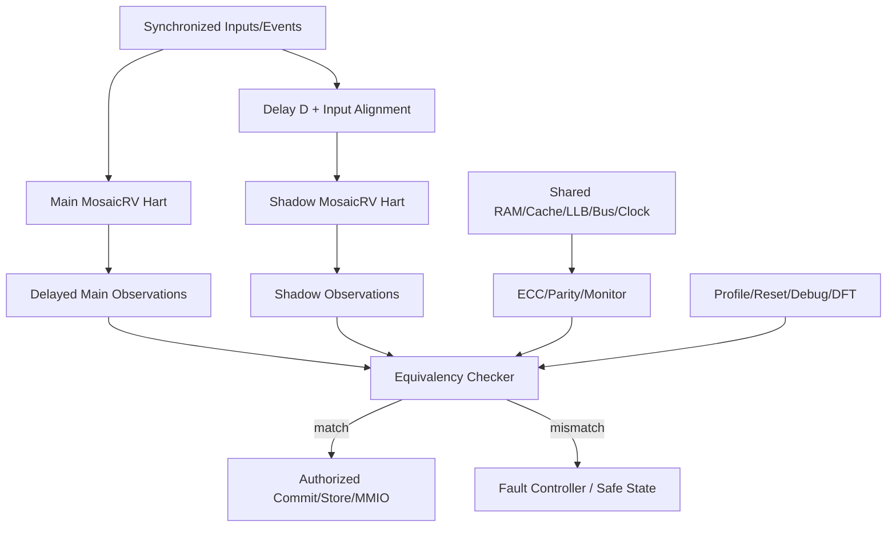

# 第9阶段：可选 Lockstep / DCLS 安全执行域

状态：**规划，不是已实现安全处理器**。本阶段把用户新增的 lockstep 需求作为可选 profile，而不是默认处理器语义。所有硬件、故障注入和安全结论都必须等对应任务实现后产生；不能仅凭架构文档宣称 ASIL/SIL 合规。

## 1. 这个子系统是做什么的

让一个 logical RISC-V hart 由两个独立 main/shadow replicas 执行同一合法输入流，在 architectural side effect 发布前比较定义过的状态，发现非公共副本错误并 fail-closed。DCLS/DMR 只做检测，不自动纠错；TMR voter 是后续研究，不在首版承诺。

## 2. 为什么存在 / 上游输入

- 上游输入：用户新增 optional lockstep；architecture-review §11.1；VeeR EL2 DCLS 与 TI functional-safety证据。
- 已有依赖：S0-S3 的单 hart 正确性、resource broker、memory/SoC、trace/reference 和 fault-injection基础设施。
- 本阶段输出：可选 DCLS profile、physical redundancy evidence、fault campaign、ASIC DFT/signoff边界。
- 首要原则：lockstep不改变ISA，不把shadow当第二个architectural hart，不把cohort成员当shadow，不把DCLS当TMR。

该阶段与动态 execution fabric 的关系：resource ownership 可改变，但 main/shadow 必须获得等价的合法输入、资源和观测点；不能把 dynamic route 差异直接塞进逐拍 comparator。

## 3. 总体结构

## 4. 团队分工与进度追踪

| Team | 负责任务 | 当前状态 | Owner | 证据链接 | 下一动作 | Blocker |
|---|---|---|---|---|---|---|
| 安全架构负责人 | I-087 | Not started | 待定 | 待填 artifact/commit | 冻结故障模型与profile | 待填 |
| Lockstep RTL负责人 | I-088 | Not started | 待定 | 待填 artifact/commit | 建立main/shadow输入对齐 | 待填 |
| 比较器负责人 | I-089 | Not started | 待定 | 待填 artifact/commit | 定义observation schema | 待填 |
| 物理冗余负责人 | I-090 | Not started | 待定 | 待填 artifact/commit | 审查shared domain与synthesis barriers | 待填 |
| 安全验收负责人 | I-091 | Not started | 待定 | 待填 artifact/commit | 汇总fault campaign与release claim | 待填 |
| 验证负责人 | V-081 | Not started | 待定 | 待填 artifact/commit | 校准无故障等价性 | 待填 |
| 验证负责人 | V-082 | Not started | 待定 | 待填 artifact/commit | 建立fault injection matrix | 待填 |
| 验证负责人 | V-083 | Not started | 待定 | 待填 artifact/commit | 验证reset/debug/reconfigure公平 | 待填 |
| 验证负责人 | V-084 | Not started | 待定 | 待填 artifact/commit | 核对shared-domain保护 | 待填 |
| FPGA平台负责人 | H-048 | Not started | 待定 | 待填 artifact/commit | 三家族物理冗余约束 | 待填 |
| ASIC负责人 | H-049 | Not started | 待定 | 待填 artifact/commit | DFT/STA/制造测试边界 | 待填 |

状态只能取 `Not started / Inputs locked / In progress / Blocked / Evidence complete / Accepted`。`Accepted` 必须有对应故障注入、无副作用发布和可复现证据；不能用“没观察到错误”代替故障覆盖。

## 5. 可跟踪任务卡

每张卡先给设计者/审查者看的工程合同，再给执行者看的自然语言说明。说明不是替代规格，而是告诉执行者如何按规格工作：先做什么、不能猜什么、什么时候停下来、拿什么证据证明完成。

### I-087 — 定义可选 lockstep profile、故障模型与输出策略

- **负责/门禁**：安全架构负责人；lockstep profile冻结。
- **前置依赖**：I-001, I-002。
- **做什么**：逐profile声明none/DCLS/TMR、delay、观测点、shared-domain保护、debug/reset/reconfigure与fail-closed动作。
- **输入数据/接口**：architecture-review §11.1、目标安全需求、profile、资源预算。
- **输出与交接**：lockstep manifest、fault model、残余common-mode fault清单。
- **设计取舍**：DCLS检测优先，TMR恢复后置；安全模式不改ISA。
- **实现微步骤**：分类复制/共享/不复制状态；定义输入同步与比较点；定义mismatch阻断动作；定义debug/scan状态；列残余故障；由架构/验证/平台三方签收。
- **主要阻塞风险**：把lockstep当cohort；把DCLS当TMR；共享RAM/clock不受保护。
- **验收证据**：每个状态有明确分类和保护；模式广告与能力一致。
- **失败/回退动作**：不启用lockstep profile，而不是给出不完整安全声明。
- **来源覆盖**：optional lockstep, safety boundaries；来源 AR-019, AR-020, AR-021。
- **执行者目标**：把可选安全模式变成一份没有歧义的合同：别人读后能知道复制什么、比较什么、出错时阻断什么。
- **执行者须知**：先定义边界，再写任何RTL。不要凭直觉决定哪些共享资源“应该安全”；每一个资源都要有保护证据或残余风险记录。
- **建议工作顺序**：冻结profile；列复制/共享/不复制清单；定义D与比较点；定义fail-closed动作；列debug/reset规则；列残余故障；三方评审。
- **可接受完成**：每个声明状态有分类，每个共享资源有保护或风险记录，没有TMR/认证过度声明。
- **何时停止求助**：目标安全等级、D范围、可接受残余故障或profile边界不明确时停止；不要自行扩大到TMR。
- **交付说明**：提交lockstep manifest和fault model；更新Track Log、证据hash与下一步。
- **参考资料**：AR-019, AR-020, AR-021。
- **进度日志**：2026-09-29 新增用户需求后规划——未开始。

### I-088 — 实现 redundant replicas 与延迟输入/输出对齐

- **负责/门禁**：Lockstep RTL负责人；副本同步与公平。
- **前置依赖**：I-087, I-017, I-024。
- **做什么**：实例化main/shadow副本；输入同步/延迟，main输出延迟比较；确保shadow资源不被永久饿死。
- **输入数据/接口**：D值、同步器、resource grants、reset/CSR/中断事件。
- **输出与交接**：lockstep pair RTL、delay alignment表、grant公平证据。
- **设计取舍**：动态fabric可提供等价资源，但不能制造不可比较实现差异。
- **实现微步骤**：同步异步输入；构建D拍输入/输出shift；绑定resource pair；覆盖reset与trap边界；测试D的合法范围；比较正常trace。
- **主要阻塞风险**：异步输入false mismatch、shadow饥饿、未比较输出提前发布。
- **验收证据**：同一合法trace、无注入不触发、D配置覆盖。
- **失败/回退动作**：退回同cycle spatial DCLS；仍失败则不启用。
- **来源覆盖**：DCLS construction；来源 AR-019, AR-020。
- **执行者目标**：让两个副本在同一逻辑输入下得到同一架构结果，同时不因资源分配差别造成假错误。
- **执行者须知**：不要直接复制异步信号；先同步，再按D对齐。动态调度可以存在，但两个副本必须得到等价合法资源。
- **建议工作顺序**：建立同步器；实例化副本；实现延迟路径；绑定资源grant；覆盖reset/trap/interrupt；运行normal/DCLS对照。
- **可接受完成**：D合法范围全部通过；shadow grant有界；无注入无mismatch。
- **何时停止求助**：两个副本因动态策略无法保证同一观测语义时停止，不要隐藏差异。
- **交付说明**：提交RTL、alignment表、grant trace和replay证据；更新Track Log。
- **参考资料**：AR-019, AR-020。
- **进度日志**：2026-09-29 新增用户需求后规划——未开始。

### I-089 — 实现 architectural comparison 与 fail-closed 发布

- **负责/门禁**：比较器负责人；故障阻断。
- **前置依赖**：I-088, I-026, I-034, I-019。
- **做什么**：比较PC/result/CSR/trap/interrupt/memory/vector观测点，mismatch时阻断commit/store/MMIO。
- **输入数据/接口**：observation schema、commit/store/MMIO/CSR授权点、multibit status。
- **输出与交接**：equivalency checker、fault event、blocked-effect audit。
- **设计取舍**：只在architecture边界比较，不比较内部合法OoO差异。
- **实现微步骤**：定义字段；接入授权门；记录首差异；覆盖vector element；故障注入矩阵；验证无注入等价。
- **主要阻塞风险**：比较过晚、副作用已发布、只比UART文本。
- **验收证据**：每个注入被检测且阻断对应副作用。
- **失败/回退动作**：关闭lockstep profile并保留失败证据。
- **来源覆盖**：lockstep comparator；来源 AR-019, AR-020, validation-plan.md。
- **执行者目标**：确保任何声明的副本错误都不会变成外部可见的错误状态。
- **执行者须知**：比较必须在授权之前完成；不要等结果已经写到设备或CSR后再报告。内部OoO顺序差异不比较，最终架构效果必须比较。
- **建议工作顺序**：定义观测点；接授权门；实现首差异记录；加入错误注入；覆盖正常/异常/vector/memory路径；核对无副作用泄漏。
- **可接受完成**：每个声明故障被检测，未发布副作用；无故障时与normal模式一致。
- **何时停止求助**：如果某副作用已不可逆而无法阻断，立即停止并要求重新划定授权边界。
- **交付说明**：提交comparator、fault-event接口、注入矩阵和最小replays；更新Track Log。
- **参考资料**：AR-019, AR-020, validation-plan.md。
- **进度日志**：2026-09-29 新增用户需求后规划——未开始。

### I-090 — 保护 shared domains 与防止冗余被优化移除

- **负责/门禁**：物理冗余负责人；common-mode和综合存活。
- **前置依赖**：I-089, I-006, I-038；cache/LLB 等仅在相应 advanced profile 出现时另取 I-047 及相关证据。
- **做什么**：从p0共享RAM/clock/bus/debug开始分类保护域及残余风险，规定冗余保留的综合约束；若声明具体FPGA/ASIC物理DCLS，另由V-084和H-048/H-049实证post-synthesis/post-route存活。
- **输入数据/接口**：按profile共享域图、ECC/parity/CRC方案、keep/dont_touch/size_only约束、CDC/reset/test状态；可选cache/LLB只按广告加入。
- **输出与交接**：按模式保护图、综合约束与可验证生存条件、共享故障的残余风险；物理门禁接收具体target的约束/报告。
- **设计取舍**：功能DCLS验收识别保护与残余风险，不能冒充FPGA/ASIC实物安全证据。
- **实现微步骤**：枚举p0共享路径并定保护/风险；检查副本与checker保留约束；为每个可选物理target记录所需netlist/placement检查；注入共享故障并核对阻断；仅在支持advanced时扩展cache/LLB图。
- **主要阻塞风险**：共享memory错误同时污染副本、工具合并冗余、debug关闭检测；物理证明缺口隔离到相应target。
- **验收证据**：p0每个共享路径有保护或明确风险及故障检查；广告物理DCLS时另以对应V-084/H-048/H-049证明综合/布局存活。
- **失败/回退动作**：不能保证功能比较/阻断则关闭DCLS；物理报告缺失只阻断该target的物理声明。
- **来源覆盖**：common-mode faults, synthesis survivability；来源 AR-020, HR-008, HR-009。
- **执行者目标**：建立p0共享资源和冗余保留的明确合同，并将具体板/工艺的物理证明交给目标门禁。
- **执行者须知**：RTL仿真不能证明最终副本没有被合并；也不能以可选cache的缺失阻断p0。
- **建议工作顺序**：列p0共享域→选择保护/残余风险→约束副本保留→故障检查→交物理target审计。
- **可接受完成**：功能模式有保护图和故障结果；广告物理模式另有同目标netlist和布局证据。
- **何时停止求助**：功能共享路径无可验证保护或故障阻断失败时停止DCLS功能验收；特定工具不能保留冗余则阻断该物理target，提交工具/netlist与owner。
- **交付说明**：提交p0保护图、故障记录及可选target所需约束；物理存活报告由V-084/H-048/H-049各自交付；更新Track Log。
- **参考资料**：AR-020, HR-008, HR-009。
- **进度日志**：2026-09-29 新增用户需求后规划——未开始。

### I-091 — 完成 lockstep 安全 profile 验收 gate

- **负责/门禁**：安全验收负责人；可选p0 DCLS功能验收，不是安全认证。
- **前置依赖**：I-080, I-090, V-081, V-082, V-083。
- **做什么**：在已通过的普通p0上重放无故障和注入故障的DCLS modes，检查比较、可见副作用阻断、reset/debug/reconfigure恢复与资源/性能代价；只为明确广告的目标另收物理门禁。
- **输入数据/接口**：p0 I-080、D/模式manifest、V-081观测/对齐、V-082故障矩阵及V-083状态转换证据、I-090共享域保护/残余风险；若广告具体FPGA/ASIC DCLS则取V-084和H-048/H-049相应target证据。
- **输出与交接**：按mode/target索引的DCLS功能acceptance bundle、fault seed/site/time/观测/恢复日志、代价及残余风险、可广告范围；交I-086。
- **设计取舍**：p0功能DCLS门禁独立于normal p0；三板物理或ASIC声称独立加门禁，不把功能通过称ASIL/SIL、TMR纠错或物理认证。
- **实现微步骤**：锁定p0与D配置；回放无故障normal/DCLS签名；逐故障注入核对检测延迟和store/MMIO等副作用阻断；回放reset/debug/reconfigure；比较资源/性能；对照每个广告target的V-084、H-048/H-049；记录残余故障并审广告。
- **主要阻塞风险**：未经注入便声称故障覆盖、把DCLS当TMR、某target缺物理证据或无法阻断副作用。
- **验收证据**：p0功能模式有确定性故障/无故障/恢复证据；声称某family物理DCLS须该family H-048通过，声称ASIC DCLS须同候选H-049通过；未正式评估不得宣称ASIL/SIL。
- **失败/回退动作**：功能阻断失败则不启用DCLS，保留normal p0；某target证据不足仅撤销该target物理声明。
- **来源覆盖**：optional lockstep gate；来源 AR-019, AR-020, AR-021。
- **执行者目标**：先验收DCLS检测与fail-closed功能，再逐target判断是否能广告物理冗余。
- **执行者须知**：I-091不等于认证；三板/ASIC数据仅对实际广告的物理target必需，不能用另一板或FPGA替ASIC。
- **建议工作顺序**：锁p0→重放无故障→故障/副作用→状态恢复→代价对照→目标证据核对→缩小或发布可广告范围。
- **可接受完成**：声明的mode有闭合功能证据，声明的target另有独立物理证据，所有残余风险明确。
- **何时停止求助**：比较失配或副作用泄漏先阻断整个DCLS模式；target报告缺失时列target/mode、所缺hash/报告及owner，不影响normal p0。
- **交付说明**：向I-086交付模式/目标claim矩阵、原始故障replay与阻断项；更新Track Log，不预填故障结果。
- **参考资料**：AR-019, AR-020, AR-021。
- **进度日志**：2026-09-29 新增用户需求后规划——未开始。

### V-081 — 校准 lockstep 观测点与输入等价

- **负责/门禁**：验证负责人；观测语义校准。
- **前置依赖**：V-008, V-020, V-033。
- **做什么**：列出比较字段、D、输入同步、公平grant和不比较字段；normal/DCLS metamorphic对照。
- **输入数据/接口**：lockstep manifest、D值、同步器、observation schema。
- **输出与交接**：observation manifest、delay calibration、metamorphic报告。
- **设计取舍**：合法实现差异不进入逐拍比较；输出仍在架构边界对齐。
- **实现微步骤**：运行同一程序；对齐输入事件；比较每个声明观测点；记录无注入无fault；测试D边界。
- **主要阻塞风险**：异步输入分开复制、比较粗糙周期末状态。
- **验收证据**：无注入时同一合法ISA trace，无安全信号误触发。
- **失败/回退动作**：修正observation schema或禁用该配置。
- **来源覆盖**：optional DCLS, delayed lockstep；来源 AR-019, AR-020。
- **执行者目标**：先证明“没故障时两个副本看起来一样”，否则后续故障注入结果无法解释。
- **执行者须知**：不要比较内部微架构差异；所有输入必须先同步。发现false mismatch时先怀疑对齐，不是先加mask。
- **建议工作顺序**：确认输入同步；跑normal；跑DCLS；逐观测点对照；测D边界；保存manifest。
- **可接受完成**：无注入时全观测点一致或差异有明确豁免；negative control仍能触发。
- **何时停止求助**：无法解释两个副本在合法输入下的差异时停止。
- **交付说明**：提交metamorphic报告、manifest和首个差异证据；更新Track Log。
- **参考资料**：AR-019, AR-020。
- **进度日志**：2026-09-29 新增用户需求后规划——未开始。

### V-082 — 注入 replica 内部状态与输出故障

- **负责/门禁**：验证负责人；真实故障检测。
- **前置依赖**：V-081, V-021, V-027, V-042。
- **做什么**：向shadow输入、main输出、register file、CSR、branch、LSQ、FU、vector、comparator control注入单点错误。
- **输入数据/接口**：main/shadow状态和故障注入接口。
- **输出与交接**：fault site→detection latency→blocked effect矩阵。
- **设计取舍**：注入必须真实改变执行，不是mock mismatch。
- **实现微步骤**：逐站点注入；记录首差异；检查检测延迟；检查副作用未发布；无注入负例；保留最小replays。
- **主要阻塞风险**：故障未触达、比较器只看输出、副作用已提交。
- **验收证据**：每个声明点在latency内检测并阻断。
- **失败/回退动作**：阻断相应观测点/模式并修复。
- **来源覆盖**：lockstep fault containment；来源 AR-019, AR-020。
- **执行者目标**：证明错误真的会被发现，而且在变成外部效果之前被阻断。
- **执行者须知**：不要只改expected文件；每个注入都要确认实际执行路径被污染，且系统没有继续发布副作用。
- **建议工作顺序**：列站点；逐一注入；记录检测位置和时间；检查commit/store/MMIO；保存最小replay；运行无注入对照。
- **可接受完成**：所有声明故障都有检测和阻断证据，负控制不误报。
- **何时停止求助**：如果无法判断故障是否真实到达，停止并补观测点。
- **交付说明**：提交fault matrix、logs、replay bundles；更新Track Log。
- **参考资料**：AR-019, AR-020。
- **进度日志**：2026-09-29 新增用户需求后规划——未开始。

### V-083 — 验证 reset、debug、reconfiguration 与资源公平

- **负责/门禁**：验证负责人；模式切换安全。
- **前置依赖**：V-015, V-034, V-082。
- **做什么**：覆盖同时reset、延迟退出、debug、配置切换、lease drain、shadow饥饿。
- **输入数据/接口**：reset/debug/scan/DFT/enable状态机、broker。
- **输出与交接**：mode transition trace、grant histogram、fault-controller状态证据。
- **设计取舍**：任何非lockstep状态显式发布，不能静默关闭检测。
- **实现微步骤**：测每状态转换；模拟shadow资源压力；验证旧结果完成/丢弃；确认debug关闭时capability变化；检查credit守恒。
- **主要阻塞风险**：shadow永久饥饿、单边reset、debug后仍宣称DCLS。
- **验收证据**：两副本有界服务；模式切换不产生半配置。
- **失败/回退动作**：保守到spatial mode或禁profile。
- **来源覆盖**：mode transitions, fairness；来源 AR-019, AR-020, AR-021。
- **执行者目标**：证明系统进入或离开lockstep时不会保留一半旧状态，也不会把shadow饿死。
- **执行者须知**：reset、debug、scan和重配置是故障覆盖的常见漏洞；每个状态转换都要有明确开始/结束和capability广告。
- **建议工作顺序**：列状态机；测同步reset；测debug；测lease drain；测资源饥饿；核对credit和最终状态。
- **可接受完成**：所有转换完整、公平、有界，非保护状态不会冒充保护状态。
- **何时停止求助**：任一状态无法回到干净边界或无法证明两副本服务公平。
- **交付说明**：提交状态trace、grant统计和故障恢复证据；更新Track Log。
- **参考资料**：AR-019, AR-020, AR-021。
- **进度日志**：2026-09-29 新增用户需求后规划——未开始。

### V-084 — 证明 shared-domain 保护与综合冗余存活

- **负责/门禁**：验证负责人；common-mode闭合。
- **前置依赖**：V-067, V-079, V-083。
- **做什么**：共享memory/bus注入可检测错误；核对ECC/parity/CRC；检查综合后shadow/checker存在；跑post-synthesis/implemented测试。
- **输入数据/接口**：shared RAM/cache/LLB/clock/bus/debug保护图、综合netlist。
- **输出与交接**：common-mode ledger、survivability证据、physical protection report。
- **设计取舍**：FPGA和ASIC证据不互替；每个工艺/板重新验证。
- **实现微步骤**：列共享路径；注入保护路径故障；核对netlist属性；运行综合后故障测试；记录残余风险。
- **主要阻塞风险**：duplicate logic被优化、共享错误无检测、只仿真不查netlist。
- **验收证据**：所有声明保护路径触发；冗余在最终实现中可观测。
- **失败/回退动作**：重新综合/布局或标记该实现不支持lockstep。
- **来源覆盖**：shared-domain protection；来源 AR-019, AR-020, HR-009。
- **执行者目标**：把“共享资源是否会同时弄坏两份副本”变成逐项有证据的问题。
- **执行者须知**：不要只看RTL；必须检查综合/实现后结构。共享memory、clock、bus、debug都要列出保护或风险。
- **建议工作顺序**：列shared paths；核保护机制；注入故障；查netlist；跑综合后测试；记录残余风险。
- **可接受完成**：每条路径有保护证据或明确不支持的阻断结论。
- **何时停止求助**：综合后无法证明冗余存在或共享路径无保护时停止。
- **交付说明**：提交ledger、netlist证据、fault结果和限制；更新Track Log。
- **参考资料**：AR-019, AR-020, HR-009。
- **进度日志**：2026-09-29 新增用户需求后规划——未开始。

### H-048 — 验证三家族 lockstep 物理分离与故障注入

- **负责/门禁**：FPGA平台负责人；三家族物理证据。
- **前置依赖**：H-010, I-089；本卡按实际广告的family/mode产出物理证据，不是normal p0的前置。
- **做什么**：逐GW5A、Zynq、Virtex目标板/mode约束main/shadow分区与共同资源，实板执行正常corpus和定点故障注入。
- **输入数据/接口**：锁定的part/tool/source、I-089 D/模式与fault model、fault controller、placement/clock/reset约束、已知无故障ELF/signature。
- **输出与交接**：按board/mode索引的source/constraints/bitstream/ELF hash、fit/timing与netlist/placement、device ID、fault seed/site/time、检测/副作用/恢复trace；交I-091及I-086。
- **设计取舍**：每个广告目标独立证明；三家族广告才要求三家族闭合，不能以任一板替另一板。
- **实现微步骤**：冻结每板part/tool和DCLS模式；保留副本并检查综合/布局；生成bitstream，核对设备与build ID；运行无故障基线；注入目标故障并检查检测延迟、store/MMIO授权、reset/recovery；保存资源、时序与原始日志。
- **主要阻塞风险**：某板资源/时序不够、shadow被优化、比较器不能阻断设备写、只见host注入而没有设备观测。
- **验收证据**：每个广告的board/mode均有真实物理冗余、正常/故障负控制、未发布副作用和恢复的同源证据；三家族声明须三个bundle。
- **失败/回退动作**：撤销受影响board/mode DCLS声明，恢复normal image并交该板owner提供fit、故障trace与缺少输入；normal p0不因此阻断。
- **来源覆盖**：FPGA lockstep；来源 AR-019, AR-020, platform-plan.md。
- **执行者目标**：在声称的实际设备上证明冗余确实存在且可检测并阻断故障。
- **执行者须知**：RTL/Verilator结果不能代替实板故障和同源bitstream证据。
- **建议工作顺序**：锁设备/映像→route并查冗余→核设备ID→跑正常→注故障→核副作用→恢复→交付按board/mode矩阵。
- **可接受完成**：所有广告板/mode的fit/timing、netlist、signature、fault、recovery日志闭合。
- **何时停止求助**：设备/许可证缺失或fit、时序、物理分区、阻断失败时停止该claim，附报告hash及目标owner。
- **交付说明**：提交逐目标构建/故障/恢复证据及blocked列表；更新Track Log。
- **参考资料**：AR-019, AR-020, platform-plan.md。
- **进度日志**：2026-09-29 新增用户需求后规划——未开始。

### H-049 — 审核 ASIC lockstep 的物理与制造测试边界

- **负责/门禁**：ASIC负责人；物理/DFT/安全边界。
- **前置依赖**：H-038, H-041, H-043, H-044, H-045, I-090；只在广告ASIC DCLS时作为该声明门禁。
- **做什么**：对同一DCLS候选审查replica/checker floorplan、clock/power/shared SRAM；把function/test/power模式纳入DFT、routed多corner STA、IR/EM/热及post-route等价和DRC/LVS/ERC。
- **输入数据/接口**：候选hash、routed netlist/寄生参数、shared-domain保护图、fault模型、scan/MBIST/ATPG故障分母、H-043各corner STA、H-044 power/IR/EM/thermal、H-045 post-route和foundry检查报告及waivers。
- **输出与交接**：以候选/mode/corner索引的ASIC DCLS signoff报告、故障覆盖排除项和残余风险，交I-091和ASIC声明owner。
- **设计取舍**：H-038/H-041只是时钟/DFT前提，不能替代H-043..H-045的已布线实证；没有正式认证不得广告ASIL/SIL。
- **实现微步骤**：核副本/checker物理分离；检查shared domains；复核scan/MBIST/ATPG；逐mode/corner核routed STA与power；核DRC/LVS/ERC及post-route等价、waiver和候选hash；复查fault阻断及残余风险。
- **主要阻塞风险**：跨候选拼报告、共享RAM/clock无保护、DFT漏副本、FPGA fault campaign冒充ASIC signoff。
- **验收证据**：同一DCLS候选H-043、H-044、H-045全套报告闭合，副本/checker与共享域的DFT/物理/故障边界明确。
- **失败/回退动作**：ASIC DCLS声明blocked，标具体candidate/mode/corner/waiver缺口与负责工艺/DFT owner；不阻断normal p0或未广告DCLS的ASIC声明。
- **来源覆盖**：ASIC lockstep, DFT；来源 AR-019, AR-020, AR-021, HR-009。
- **执行者目标**：证实DCLS候选的布线后时序/电源/物理/制造测试边界，不能只交RTL fault结果。
- **执行者须知**：H-043..H-045报告须对应同一DCLS候选；没有PDK/foundry授权不得推断signoff完成。
- **建议工作顺序**：锁候选与授权→核物理分离/共享域→DFT→MCMM STA→power/IR/EM→DRC/LVS/ERC/等价→waiver/残余风险。
- **可接受完成**：仅同候选全gate和故障证据齐备时允许ASIC DCLS claim，不自动给ASIL/SIL结论。
- **何时停止求助**：缺PDK/library/tester、任一corner/mode不闭合或风险不可接受时移交具体报告与owner。
- **交付说明**：提交同候选signoff bundle和claim boundary；更新Track Log，不预填结果。
- **参考资料**：AR-019, AR-020, AR-021, HR-009。
- **进度日志**：2026-09-29 新增用户需求后规划——未开始。

## 6. 阶段级阻塞清单

| Blocker | 触发条件 | 立即动作 | 责任升级 |
|---|---|---|---|
| 观测点不完整 | 有architectural side effect未列入比较/保护 | 停止lockstep验收，补观测点并重跑故障注入 | 安全架构负责人 |
| 共享资源单点 | RAM/cache/clock/bus错误同时污染两副本且无ECC/monitor | 标残余风险；无接受标准则不支持lockstep | 物理冗余负责人 |
| 动态fabric不等价 | main/shadow获得不同资源导致不可比较或shadow饥饿 | 限制为成对资源grant，必要时退回静态分配 | fabric负责人 |
| 副作用发布过早 | mismatch发现前store/MMIO/CSR已发布 | 修复授权门并重跑全部fault cases | 比较器负责人 |
| 综合优化移除 | duplicate logic/checker被合并或优化 | 修改constraints/barrier并检查netlist | 平台/ASIC负责人 |
| 安全claim越界 | 没有正式评估却宣称ASIL/SIL/TMR恢复 | 删除claim，改为检测-only可选profile | release负责人 |

## 7. 阶段 Track Log（持续追加）

| 日期 | 事件 | 证据 | 负责人 | 下一步 |
|---|---|---|---|---|
| 2026-09-29 | 用户新增optional lockstep需求；查阅VeeR EL2 DCLS、Antmicro、TI functional-safety一手资料 | architecture-review §11.1、I-087–I-091、V-081–V-084、H-048/H-049、AR-019–AR-021/HR-013/HR-014 | 规划集成 | 冻结故障模型与profile |
| 2026-09-29 | 补充自然语言执行说明，适配较小模型/新工程师 | 本文件任务卡新增执行者目标、须知、顺序、停止条件和交付说明 | 规划集成 | 实施团队按卡执行并回填证据 |

## 8. 2026-10-02 追加：推测研究与 DCLS 的故障封闭边界

本节是设计追加，不声称已实现Safety处理器、故障覆盖或认证。当前accepted事实以 [`implementation_status.json`](../config/status/implementation_status.json)、最新 [`PROGRESS.md`](../results/PROGRESS.md)/reports为准，历史团队表/`REVISION.md`不是当前ledger。MP/EF/VX子卡仍PROPOSED/BLOCKED，不增加原239 I/V/H；DCLS仍optional、一个main/shadow pair只算一个logical hart，检测不等于纠错/TMR。研究路线见 [实施计划 §13](implementation-plan.md)、验证矩阵见 [验证计划 §10](validation-plan.md)。

### 8.1 区分两种 shadow 与模式许可

VX-01的 **shadow window/runahead helper** 是不提交的性能推测域；I-088的 **DCLS shadow replica** 是独立冗余执行同一architectural输入的检查副本，两者绝不能混名/共用一个执行结果当作冗余证明。未闭合fault model/恢复/模式配额前，DCLS默认固定资源、关闭MPP/helper/earlyconsume/arbitrary-value/dualpath；L/T/criticality/RC/fusion/表示压缩/controller逐模式独立验收后才可允许。strict-security与DCLS模式都不能被controller自动越权重开。

### 8.2 架构上有后果的状态必须冗余或比较保护

owner为I-087–I-090/V-081–V-084的Safety+fabric+memory/PRF负责人；个人研究尚无签收。不能以“预测不提交所以不重要”豁免能改变后续retire/store/exception/服务进展的状态。以下每项先决定独立复制并延迟对齐，或采用有故障覆盖的比较/保护后才允许影响architectural state；共享单份状态必须登记common-mode残余风险，不能由两副本输出相同推出安全。

| 新研究 state / consequential decision | 独立/比较合同及实际观察点 | 故障注入与fail-closed要求 |
|---|---|---|
| MPP/IMC/token/context/permission/line-version | preview admission及真实AGU/LSQ消费校验；hart/ASID/VMID/root/privilege/PMP/PMA/generation/owner/data来源绑定；返回输入同步只记录一次合法external transaction，不让checker以main算出的许可直接喂shadow | 翻转地址/权限/context/token-gen/版本、晚到复活、waiter错路由；非法数据不得被两个副本共同接受，confirmed load/event不一致先阻断 |
| L/T/criticality/locality/RC | route/grant成对公平，RC源tag+gen/value/source-pin/durable可比较；资源决策可不同但architectural事件必须对齐且shadow有有界服务，选定比较策略明确 | oldRC值、错误owner/kill、earlywake、低criticality饥饿；异常或延迟上界触发fault-controller，不允许无限等待“迟早一致” |
| Fusion/member/representation | 每member原PC/ROB/destination/fflags/trap/retire和intermediate可观测值；vectorvl/vtype/vstart/mask/partialprogress/materialization独立保护，比较合法ISA结果集合 | 丢member、错序、counter漏增、中间值未恢复、uniform/affinemetadata错误、partialtrap错；拒绝把多个退休边界一并发布 |
| Helpers/shadow window | helper不能架构写/CSR/store/MMIO或trap，poison/lease/MSHR/drop/kill及main资源服务保护；helper fault不压掉main真实fault | helper写memory/跨domainfill/poison地址/credit泄漏；即便尚无retire差异也检查外部事务与服务上界；无法封闭则禁用该helper模式 |
| Bottleneck controller/config/owner-generation | 真实PMU输入、sampling/residence/hysteresis、许可mode与原STOP_ADMIT/DRAIN/ACK/PUBLISHFSM受保护；DCLS成对grant/stop/drain ack | 单副本计数/决策bit翻转、绕过strictmode、未drain换owner、取消一副本而保另一；停止新工作、保留诊断，不继续发布副作用 |
| Late ownership/earlyconsume | coherenceownership请求作为额外外部可见事务纳入故障模型；predicteddata不得写共享状态；descendantepoch/checkpoint/validate独立或受覆盖保护 | speculative store、错误预测仍confirm、dependent slice漏kill；无完整证明不允许DCLS下该mode，也不能以事后replay纠正已外显错误 |

比较必须在irreversible store/MMIO/CSR/interrupt acknowledgement和architectural retire授权**之前**达到所选合同的匹配；外部coherence/cache/预取流量虽然非retire也可能有物理/安全后果，明确哪些先比较、哪些由权限/ECC/独立监控保护、哪些被禁止。helperfault suppression只是丢性能请求，不是屏蔽Safetyerror。checker、输入同步/延迟buffer、授权gate、clock/reset/bus/sharedRAM/cache/PMU均属故障域；DCLS不能覆盖未知共享common-mode问题。

### 8.3 对齐、恢复、物理证明与接受

V-081–V-083逐模式冻结delay D、最大shadow服务/compare窗口、backpressure与resource公平假设，正常trace和real sitefault分开。inject地址/context/version/RCvalue/fusionmember/vectorprogress/controllerdecision/credit/kill/comparegate/shareddomain错误，必须证明命中活跃路径、namedfirstfailure、检测时限和无earlyexternal effect；DCLS本身mismatch转fault-controller安全状态，不自动把main值当正确继续，也不冒TMR恢复。reset/recover只按显式系统合同，从已知安全候选/输入重新开始，保留firstdifference。

物理DCLS另需V-084/H-048/H-049，同image/netlist/candidate/mode/corner验证两个副本及checker实际存在、未综合合并、floorplan/clock/power/shareddomain保护、routedtiming与test/DFT覆盖；simulation逻辑latency不是physicaltiming。privateL0不消除cache/PTW/interconnect侧信道，DIEL不等于fault或侧信道免疫，安全/ASILSIL结论仍需独立正式评估。

初始新增推测模式均BLOCKED（无DCLS研究fault/physical证据），不会阻断未广告Safety的normalp0。Accept需要原I-091所声明profile和本节每启用研究mode的normal/fault/恢复/物理适用证据双owner签收；未验模式显式关闭/NOT_CLAIMED。本次仅文档整合，未执行faultcampaign、构建、测试、检查器或formatter；原DCLS检测-only、common-mode、cohort/p3/三板/ASIC独立claim边界不变。
