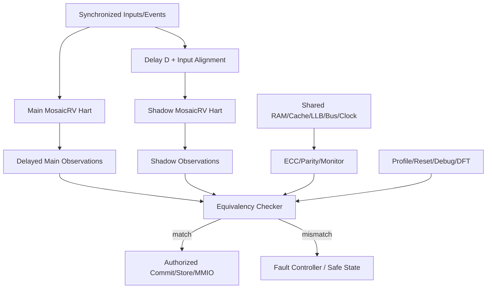

# 第9阶段：可选 Lockstep / DCLS 安全执行域

状态：**规划，不是已实现安全处理器**。本阶段把用户新增的 lockstep 需求作为可选 profile，而不是默认处理器语义。所有硬件、故障注入和安全结论都必须等对应任务实现后产生；不能仅凭架构文档宣称 ASIL/SIL 合规。

## 1. 这个子系统是做什么的

让一个 logical RISC-V hart 由两个独立 main/shadow replicas 执行同一合法输入流，在 architectural side effect 发布前比较定义过的状态，发现非公共副本错误并 fail-closed。DCLS/DMR 只做检测，不自动纠错；TMR voter 是后续研究，不在首版承诺。

## 2. 为什么存在 / 上游输入

- 上游输入：用户新增 optional lockstep；architecture-review §11.1；VeeR EL2 DCLS 与 TI functional-safety证据。
- 已有依赖：S0-S3 的单 hart 正确性、resource broker、memory/SoC、trace/reference 和 fault-injection基础设施。
- 本阶段输出：可选 DCLS profile、physical redundancy evidence、fault campaign、ASIC DFT/signoff边界。
- 首要原则：lockstep不改变ISA，不把shadow当第二个architectural hart，不把cohort成员当shadow，不把DCLS当TMR。

该阶段与动态 execution fabric 的关系：resource ownership 可改变，但 main/shadow 必须获得等价的合法输入、资源和观测点；不能把 dynamic route 差异直接塞进逐拍 comparator。

## 3. 总体结构

## 4. 团队分工与进度追踪

| Team | 负责任务 | 当前状态 | Owner | 证据链接 | 下一动作 | Blocker |
|---|---|---|---|---|---|---|
| 安全架构负责人 | I-087 | Not started | 待定 | 待填 artifact/commit | 冻结故障模型与profile | 待填 |
| Lockstep RTL负责人 | I-088 | Not started | 待定 | 待填 artifact/commit | 建立main/shadow输入对齐 | 待填 |
| 比较器负责人 | I-089 | Not started | 待定 | 待填 artifact/commit | 定义observation schema | 待填 |
| 物理冗余负责人 | I-090 | Not started | 待定 | 待填 artifact/commit | 审查shared domain与synthesis barriers | 待填 |
| 安全验收负责人 | I-091 | Not started | 待定 | 待填 artifact/commit | 汇总fault campaign与release claim | 待填 |
| 验证负责人 | V-081 | Not started | 待定 | 待填 artifact/commit | 校准无故障等价性 | 待填 |
| 验证负责人 | V-082 | Not started | 待定 | 待填 artifact/commit | 建立fault injection matrix | 待填 |
| 验证负责人 | V-083 | Not started | 待定 | 待填 artifact/commit | 验证reset/debug/reconfigure公平 | 待填 |
| 验证负责人 | V-084 | Not started | 待定 | 待填 artifact/commit | 核对shared-domain保护 | 待填 |
| FPGA平台负责人 | H-048 | Not started | 待定 | 待填 artifact/commit | 三家族物理冗余约束 | 待填 |
| ASIC负责人 | H-049 | Not started | 待定 | 待填 artifact/commit | DFT/STA/制造测试边界 | 待填 |

状态只能取 `Not started / Inputs locked / In progress / Blocked / Evidence complete / Accepted`。`Accepted` 必须有对应故障注入、无副作用发布和可复现证据；不能用“没观察到错误”代替故障覆盖。

## 5. 可跟踪任务卡

每张卡先给设计者/审查者看的工程合同，再给执行者看的自然语言说明。说明不是替代规格，而是告诉执行者如何按规格工作：先做什么、不能猜什么、什么时候停下来、拿什么证据证明完成。

### I-087 — 定义可选 lockstep profile、故障模型与输出策略

- **负责/门禁**：安全架构负责人；lockstep profile冻结。
- **前置依赖**：I-001, I-002。
- **做什么**：逐profile声明none/DCLS/TMR、delay、观测点、shared-domain保护、debug/reset/reconfigure与fail-closed动作。
- **输入数据/接口**：architecture-review §11.1、目标安全需求、profile、资源预算。
- **输出与交接**：lockstep manifest、fault model、残余common-mode fault清单。
- **设计取舍**：DCLS检测优先，TMR恢复后置；安全模式不改ISA。
- **实现微步骤**：分类复制/共享/不复制状态；定义输入同步与比较点；定义mismatch阻断动作；定义debug/scan状态；列残余故障；由架构/验证/平台三方签收。
- **主要阻塞风险**：把lockstep当cohort；把DCLS当TMR；共享RAM/clock不受保护。
- **验收证据**：每个状态有明确分类和保护；模式广告与能力一致。
- **失败/回退动作**：不启用lockstep profile，而不是给出不完整安全声明。
- **来源覆盖**：optional lockstep, safety boundaries；来源 AR-019, AR-020, AR-021。
- **执行者目标**：把可选安全模式变成一份没有歧义的合同：别人读后能知道复制什么、比较什么、出错时阻断什么。
- **执行者须知**：先定义边界，再写任何RTL。不要凭直觉决定哪些共享资源“应该安全”；每一个资源都要有保护证据或残余风险记录。
- **建议工作顺序**：冻结profile；列复制/共享/不复制清单；定义D与比较点；定义fail-closed动作；列debug/reset规则；列残余故障；三方评审。
- **可接受完成**：每个声明状态有分类，每个共享资源有保护或风险记录，没有TMR/认证过度声明。
- **何时停止求助**：目标安全等级、D范围、可接受残余故障或profile边界不明确时停止；不要自行扩大到TMR。
- **交付说明**：提交lockstep manifest和fault model；更新Track Log、证据hash与下一步。
- **参考资料**：AR-019, AR-020, AR-021。
- **进度日志**：2026-09-29 新增用户需求后规划——未开始。

### I-088 — 实现 redundant replicas 与延迟输入/输出对齐

- **负责/门禁**：Lockstep RTL负责人；副本同步与公平。
- **前置依赖**：I-087, I-017, I-024。
- **做什么**：实例化main/shadow副本；输入同步/延迟，main输出延迟比较；确保shadow资源不被永久饿死。
- **输入数据/接口**：D值、同步器、resource grants、reset/CSR/中断事件。
- **输出与交接**：lockstep pair RTL、delay alignment表、grant公平证据。
- **设计取舍**：动态fabric可提供等价资源，但不能制造不可比较实现差异。
- **实现微步骤**：同步异步输入；构建D拍输入/输出shift；绑定resource pair；覆盖reset与trap边界；测试D的合法范围；比较正常trace。
- **主要阻塞风险**：异步输入false mismatch、shadow饥饿、未比较输出提前发布。
- **验收证据**：同一合法trace、无注入不触发、D配置覆盖。
- **失败/回退动作**：退回同cycle spatial DCLS；仍失败则不启用。
- **来源覆盖**：DCLS construction；来源 AR-019, AR-020。
- **执行者目标**：让两个副本在同一逻辑输入下得到同一架构结果，同时不因资源分配差别造成假错误。
- **执行者须知**：不要直接复制异步信号；先同步，再按D对齐。动态调度可以存在，但两个副本必须得到等价合法资源。
- **建议工作顺序**：建立同步器；实例化副本；实现延迟路径；绑定资源grant；覆盖reset/trap/interrupt；运行normal/DCLS对照。
- **可接受完成**：D合法范围全部通过；shadow grant有界；无注入无mismatch。
- **何时停止求助**：两个副本因动态策略无法保证同一观测语义时停止，不要隐藏差异。
- **交付说明**：提交RTL、alignment表、grant trace和replay证据；更新Track Log。
- **参考资料**：AR-019, AR-020。
- **进度日志**：2026-09-29 新增用户需求后规划——未开始。

### I-089 — 实现 architectural comparison 与 fail-closed 发布

- **负责/门禁**：比较器负责人；故障阻断。
- **前置依赖**：I-088, I-026, I-034, I-019。
- **做什么**：比较PC/result/CSR/trap/interrupt/memory/vector观测点，mismatch时阻断commit/store/MMIO。
- **输入数据/接口**：observation schema、commit/store/MMIO/CSR授权点、multibit status。
- **输出与交接**：equivalency checker、fault event、blocked-effect audit。
- **设计取舍**：只在architecture边界比较，不比较内部合法OoO差异。
- **实现微步骤**：定义字段；接入授权门；记录首差异；覆盖vector element；故障注入矩阵；验证无注入等价。
- **主要阻塞风险**：比较过晚、副作用已发布、只比UART文本。
- **验收证据**：每个注入被检测且阻断对应副作用。
- **失败/回退动作**：关闭lockstep profile并保留失败证据。
- **来源覆盖**：lockstep comparator；来源 AR-019, AR-020, validation-plan.md。
- **执行者目标**：确保任何声明的副本错误都不会变成外部可见的错误状态。
- **执行者须知**：比较必须在授权之前完成；不要等结果已经写到设备或CSR后再报告。内部OoO顺序差异不比较，最终架构效果必须比较。
- **建议工作顺序**：定义观测点；接授权门；实现首差异记录；加入错误注入；覆盖正常/异常/vector/memory路径；核对无副作用泄漏。
- **可接受完成**：每个声明故障被检测，未发布副作用；无故障时与normal模式一致。
- **何时停止求助**：如果某副作用已不可逆而无法阻断，立即停止并要求重新划定授权边界。
- **交付说明**：提交comparator、fault-event接口、注入矩阵和最小replays；更新Track Log。
- **参考资料**：AR-019, AR-020, validation-plan.md。
- **进度日志**：2026-09-29 新增用户需求后规划——未开始。

### I-090 — 保护 shared domains 与防止冗余被优化移除

- **负责/门禁**：物理冗余负责人；common-mode和综合存活。
- **前置依赖**：I-089, I-047, I-006。
- **做什么**：保护shared cache/RAM/LLB/clock/bus/debug；加synthesis barriers；验证netlist中冗余仍存在。
- **输入数据/接口**：shared-domain图、ECC/parity/CRC、keep/dont_touch/size_only约束、CDC/reset/test状态。
- **输出与交接**：protection map、netlist survivability证据、物理测试矩阵。
- **设计取舍**：共享结构可接受但必须显式保护或列为残余风险。
- **实现微步骤**：列共享资源；加错误检测；审查综合属性；核对post-synthesis/post-route；测debug/scan关闭行为。
- **主要阻塞风险**：综合合并重复逻辑、共享memory错误同时污染两副本、debug关闭检测。
- **验收证据**：每个shared path有证据；冗余不被移除；故障注入覆盖保护路径。
- **失败/回退动作**：修改wrapper/约束或标记该profile不支持。
- **来源覆盖**：common-mode faults, synthesis survivability；来源 AR-020, HR-008, HR-009。
- **执行者目标**：证明冗余不是纸面结构，而是经过综合/布局后仍真实存在且共享资源有保护。
- **执行者须知**：RTL仿真不能证明synthesis没有合并副本；shared RAM不在lockstep comparator内时，必须有ECC/parity/monitor。
- **建议工作顺序**：画shared-domain图；为每路径选择保护；加barrier/约束；检查netlist；运行fault campaign；记录残余风险。
- **可接受完成**：所有共享architectural-data路径有证据，综合后副本与checker存在。
- **何时停止求助**：工具或器件无法保留冗余、无法保护共享memory时停止并标记不支持。
- **交付说明**：提交protection map、netlist证据、fault结果和限制；更新Track Log。
- **参考资料**：AR-020, HR-008, HR-009。
- **进度日志**：2026-09-29 新增用户需求后规划——未开始。

### I-091 — 完成 lockstep 安全 profile 验收 gate

- **负责/门禁**：安全验收负责人；最终安全证据闭合。
- **前置依赖**：I-080, I-083, I-090。
- **做什么**：重跑全部适用功能/形式/物理测试，执行fault campaign和performance/area对照，限定安全claim。
- **输入数据/接口**：p0/p3基线、fault结果、三板/ASIC证据、fault-controller状态。
- **输出与交接**：lockstep acceptance bundle、残余故障、能力广告。
- **设计取舍**：安全证据是独立gate，不能替代普通ISA正确性。
- **实现微步骤**：无故障等价；故障检测/阻断；资源/频率/面积对照；残余故障列表；claim审计；release签名。
- **主要阻塞风险**：把DCLS当TMR、把原型当认证、隐藏不支持模式。
- **验收证据**：所有声明模式均有对应证据，ASIL/SIL未正式评估则不宣称。
- **失败/回退动作**：保留normal profile，不发布lockstep能力。
- **来源覆盖**：optional lockstep gate；来源 AR-019, AR-020, AR-021。
- **执行者目标**：把lockstep从“有代码”变成“有证据的可选能力”，并明确哪些安全结论不能说。
- **执行者须知**：先收齐基础正确性，再收lockstep证据；不要省略性能/面积代价；不要代替认证机构下结论。
- **建议工作顺序**：核对基础gates；汇总fault campaign；汇总三平台/ASIC证据；比较资源与性能；审阅claim；发布或阻断。
- **可接受完成**：所有声明模式证据闭合，残余风险和安全边界清楚。
- **何时停止求助**：任何证据缺口、认证边界不清或副作用阻断失败时停止。
- **交付说明**：提交acceptance bundle、已知限制和release decision；更新Track Log。
- **参考资料**：AR-019, AR-020, AR-021。
- **进度日志**：2026-09-29 新增用户需求后规划——未开始。

### V-081 — 校准 lockstep 观测点与输入等价

- **负责/门禁**：验证负责人；观测语义校准。
- **前置依赖**：V-008, V-020, V-033。
- **做什么**：列出比较字段、D、输入同步、公平grant和不比较字段；normal/DCLS metamorphic对照。
- **输入数据/接口**：lockstep manifest、D值、同步器、observation schema。
- **输出与交接**：observation manifest、delay calibration、metamorphic报告。
- **设计取舍**：合法实现差异不进入逐拍比较；输出仍在架构边界对齐。
- **实现微步骤**：运行同一程序；对齐输入事件；比较每个声明观测点；记录无注入无fault；测试D边界。
- **主要阻塞风险**：异步输入分开复制、比较粗糙周期末状态。
- **验收证据**：无注入时同一合法ISA trace，无安全信号误触发。
- **失败/回退动作**：修正observation schema或禁用该配置。
- **来源覆盖**：optional DCLS, delayed lockstep；来源 AR-019, AR-020。
- **执行者目标**：先证明“没故障时两个副本看起来一样”，否则后续故障注入结果无法解释。
- **执行者须知**：不要比较内部微架构差异；所有输入必须先同步。发现false mismatch时先怀疑对齐，不是先加mask。
- **建议工作顺序**：确认输入同步；跑normal；跑DCLS；逐观测点对照；测D边界；保存manifest。
- **可接受完成**：无注入时全观测点一致或差异有明确豁免；negative control仍能触发。
- **何时停止求助**：无法解释两个副本在合法输入下的差异时停止。
- **交付说明**：提交metamorphic报告、manifest和首个差异证据；更新Track Log。
- **参考资料**：AR-019, AR-020。
- **进度日志**：2026-09-29 新增用户需求后规划——未开始。

### V-082 — 注入 replica 内部状态与输出故障

- **负责/门禁**：验证负责人；真实故障检测。
- **前置依赖**：V-081, V-021, V-027, V-042。
- **做什么**：向shadow输入、main输出、register file、CSR、branch、LSQ、FU、vector、comparator control注入单点错误。
- **输入数据/接口**：main/shadow状态和故障注入接口。
- **输出与交接**：fault site→detection latency→blocked effect矩阵。
- **设计取舍**：注入必须真实改变执行，不是mock mismatch。
- **实现微步骤**：逐站点注入；记录首差异；检查检测延迟；检查副作用未发布；无注入负例；保留最小replays。
- **主要阻塞风险**：故障未触达、比较器只看输出、副作用已提交。
- **验收证据**：每个声明点在latency内检测并阻断。
- **失败/回退动作**：阻断相应观测点/模式并修复。
- **来源覆盖**：lockstep fault containment；来源 AR-019, AR-020。
- **执行者目标**：证明错误真的会被发现，而且在变成外部效果之前被阻断。
- **执行者须知**：不要只改expected文件；每个注入都要确认实际执行路径被污染，且系统没有继续发布副作用。
- **建议工作顺序**：列站点；逐一注入；记录检测位置和时间；检查commit/store/MMIO；保存最小replay；运行无注入对照。
- **可接受完成**：所有声明故障都有检测和阻断证据，负控制不误报。
- **何时停止求助**：如果无法判断故障是否真实到达，停止并补观测点。
- **交付说明**：提交fault matrix、logs、replay bundles；更新Track Log。
- **参考资料**：AR-019, AR-020。
- **进度日志**：2026-09-29 新增用户需求后规划——未开始。

### V-083 — 验证 reset、debug、reconfiguration 与资源公平

- **负责/门禁**：验证负责人；模式切换安全。
- **前置依赖**：V-015, V-034, V-082。
- **做什么**：覆盖同时reset、延迟退出、debug、配置切换、lease drain、shadow饥饿。
- **输入数据/接口**：reset/debug/scan/DFT/enable状态机、broker。
- **输出与交接**：mode transition trace、grant histogram、fault-controller状态证据。
- **设计取舍**：任何非lockstep状态显式发布，不能静默关闭检测。
- **实现微步骤**：测每状态转换；模拟shadow资源压力；验证旧结果完成/丢弃；确认debug关闭时capability变化；检查credit守恒。
- **主要阻塞风险**：shadow永久饥饿、单边reset、debug后仍宣称DCLS。
- **验收证据**：两副本有界服务；模式切换不产生半配置。
- **失败/回退动作**：保守到spatial mode或禁profile。
- **来源覆盖**：mode transitions, fairness；来源 AR-019, AR-020, AR-021。
- **执行者目标**：证明系统进入或离开lockstep时不会保留一半旧状态，也不会把shadow饿死。
- **执行者须知**：reset、debug、scan和重配置是故障覆盖的常见漏洞；每个状态转换都要有明确开始/结束和capability广告。
- **建议工作顺序**：列状态机；测同步reset；测debug；测lease drain；测资源饥饿；核对credit和最终状态。
- **可接受完成**：所有转换完整、公平、有界，非保护状态不会冒充保护状态。
- **何时停止求助**：任一状态无法回到干净边界或无法证明两副本服务公平。
- **交付说明**：提交状态trace、grant统计和故障恢复证据；更新Track Log。
- **参考资料**：AR-019, AR-020, AR-021。
- **进度日志**：2026-09-29 新增用户需求后规划——未开始。

### V-084 — 证明 shared-domain 保护与综合冗余存活

- **负责/门禁**：验证负责人；common-mode闭合。
- **前置依赖**：V-067, V-079, V-083。
- **做什么**：共享memory/bus注入可检测错误；核对ECC/parity/CRC；检查综合后shadow/checker存在；跑post-synthesis/implemented测试。
- **输入数据/接口**：shared RAM/cache/LLB/clock/bus/debug保护图、综合netlist。
- **输出与交接**：common-mode ledger、survivability证据、physical protection report。
- **设计取舍**：FPGA和ASIC证据不互替；每个工艺/板重新验证。
- **实现微步骤**：列共享路径；注入保护路径故障；核对netlist属性；运行综合后故障测试；记录残余风险。
- **主要阻塞风险**：duplicate logic被优化、共享错误无检测、只仿真不查netlist。
- **验收证据**：所有声明保护路径触发；冗余在最终实现中可观测。
- **失败/回退动作**：重新综合/布局或标记该实现不支持lockstep。
- **来源覆盖**：shared-domain protection；来源 AR-019, AR-020, HR-009。
- **执行者目标**：把“共享资源是否会同时弄坏两份副本”变成逐项有证据的问题。
- **执行者须知**：不要只看RTL；必须检查综合/实现后结构。共享memory、clock、bus、debug都要列出保护或风险。
- **建议工作顺序**：列shared paths；核保护机制；注入故障；查netlist；跑综合后测试；记录残余风险。
- **可接受完成**：每条路径有保护证据或明确不支持的阻断结论。
- **何时停止求助**：综合后无法证明冗余存在或共享路径无保护时停止。
- **交付说明**：提交ledger、netlist证据、fault结果和限制；更新Track Log。
- **参考资料**：AR-019, AR-020, HR-009。
- **进度日志**：2026-09-29 新增用户需求后规划——未开始。

### H-048 — 验证三家族 lockstep 物理分离与故障注入

- **负责/门禁**：FPGA平台负责人；三家族物理证据。
- **前置依赖**：H-010, I-089。
- **做什么**：为GW5A/Zynq/Virtex分别约束main/shadow分区和共同资源，执行真实fault注入。
- **输入数据/接口**：lockstep build、fault controller、placement/clock/reset约束。
- **输出与交接**：每family lockstep bundle、placement/timing/fault report。
- **设计取舍**：每个family独立证明，不能以任一板代替。
- **实现微步骤**：选择lockstep profile；约束冗余区域；生成bitstream；核对ID；执行corpus与fault campaign；记录资源/时序/检测延迟。
- **主要阻塞风险**：资源不足、shadow被优化、比较器不能阻断设备写。
- **验收证据**：三家族都有真实检测与阻断证据。
- **失败/回退动作**：该family profile blocked，不发布lockstep支持。
- **来源覆盖**：FPGA lockstep；来源 AR-019, AR-020, platform-plan.md。
- **执行者目标**：在每个目标FPGA上证明冗余真实存在，而不是只在Verilator里存在。
- **执行者须知**：不能用另一family的结果替代；每个板的bitstream、约束、故障注入和签名都要同源。
- **建议工作顺序**：冻结part；布局冗余；构建；核对device/build ID；运行正常corpus；注入故障；恢复好映像。
- **可接受完成**：三家族各有完整bundle和negative controls。
- **何时停止求助**：器件放不下、约束无法保护或设备不可用。
- **交付说明**：提交build/log/fault evidence；更新Track Log。
- **参考资料**：AR-019, AR-020, platform-plan.md。
- **进度日志**：2026-09-29 新增用户需求后规划——未开始。

### H-049 — 审核 ASIC lockstep 的物理与制造测试边界

- **负责/门禁**：ASIC负责人；物理/DFT/安全边界。
- **前置依赖**：H-038, H-041, I-090。
- **做什么**：审查replica floorplan/clock/power/shared SRAM；把lockstep纳入scan/MBIST/ATPG、STA、等价和安全分析。
- **输入数据/接口**：floorplan、shared macros、scan/MBIST/ATPG、fault model。
- **输出与交接**：ASIC lockstep signoff report、fault coverage scope、残余风险。
- **设计取舍**：没有正式安全评估就不能发布ASIL/SIL结论。
- **实现微步骤**：检查物理分离；覆盖replica/checker scan；验证shared memories ECC；多mode STA；post-route等价；审阅waiver；记录认证边界。
- **主要阻塞风险**：共享SRAM/clock未保护、DFT漏掉replica、把FPGA fault campaign当ASIC signoff。
- **验收证据**：每个安全机制有设计和验证/制造测试证据。
- **失败/回退动作**：保持ASIC lockstep blocked。
- **来源覆盖**：ASIC lockstep, DFT；来源 AR-019, AR-020, AR-021, HR-009。
- **执行者目标**：把ASIC安全边界写清楚：哪些由RTL/验证证明，哪些由DFT/制造测试证明，哪些仍需正式安全评估。
- **执行者须知**：FPGA fault injection不是ASIC signoff；scan、MBIST、ATPG、STA、power和DRC各自独立。
- **建议工作顺序**：审查物理分离；检查共享memory保护；验证scan/MBIST；跑STA/等价；写残余风险；审阅安全claim。
- **可接受完成**：每个声明机制有对应证据；没有证据的阶段明确blocked。
- **何时停止求助**：PDK/library/tester/安全评估不可用或发现无法签核的风险。
- **交付说明**：提交signoff bundle和claim boundary；更新Track Log。
- **参考资料**：AR-019, AR-020, AR-021, HR-009。
- **进度日志**：2026-09-29 新增用户需求后规划——未开始。

## 6. 阶段级阻塞清单

| Blocker | 触发条件 | 立即动作 | 责任升级 |
|---|---|---|---|
| 观测点不完整 | 有architectural side effect未列入比较/保护 | 停止lockstep验收，补观测点并重跑故障注入 | 安全架构负责人 |
| 共享资源单点 | RAM/cache/clock/bus错误同时污染两副本且无ECC/monitor | 标残余风险；无接受标准则不支持lockstep | 物理冗余负责人 |
| 动态fabric不等价 | main/shadow获得不同资源导致不可比较或shadow饥饿 | 限制为成对资源grant，必要时退回静态分配 | fabric负责人 |
| 副作用发布过早 | mismatch发现前store/MMIO/CSR已发布 | 修复授权门并重跑全部fault cases | 比较器负责人 |
| 综合优化移除 | duplicate logic/checker被合并或优化 | 修改constraints/barrier并检查netlist | 平台/ASIC负责人 |
| 安全claim越界 | 没有正式评估却宣称ASIL/SIL/TMR恢复 | 删除claim，改为检测-only可选profile | release负责人 |

## 7. 阶段 Track Log（持续追加）

| 日期 | 事件 | 证据 | 负责人 | 下一步 |
|---|---|---|---|---|
| 2026-09-29 | 用户新增optional lockstep需求；查阅VeeR EL2 DCLS、Antmicro、TI functional-safety一手资料 | architecture-review §11.1、I-087–I-091、V-081–V-084、H-048/H-049、AR-019–AR-021/HR-013/HR-014 | 规划集成 | 冻结故障模型与profile |
| 2026-09-29 | 补充自然语言执行说明，适配较小模型/新工程师 | 本文件任务卡新增执行者目标、须知、顺序、停止条件和交付说明 | 规划集成 | 实施团队按卡执行并回填证据 |
