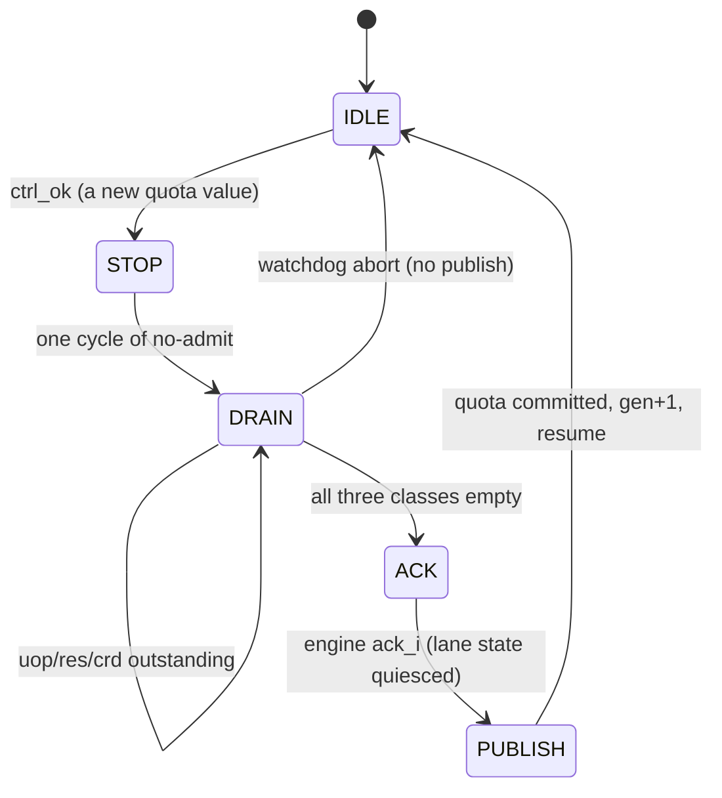

# I-059 — the runtime lane-quota broker

Work package I-059 (`docs/implementation-plan.md` §8), case
**`rvv.lane_resize_boundary`** (top `mosaic_core_tb`, driver
`sim/unit/tb_core_vec.cpp`, `pending: true` until the integration lead flips it).

| | |
|---|---|
| Verdict | **PASS from a clean build** (`--case rvv.lane_resize_boundary`, seed 1, 4 000 000 cycles) |
| Checks | 111 checks, 7 phases |
| RESULT | `checks=111 phases=7 seed=1 lane8_quota=8 lane8_elems=32 lane4_quota=4 lane4_elems=32 lane4_high_elems=0 resize_quota=8 resizes=2 acks=2` |
| Shipping binary | `sha256 ce53d1bea68239bfe305dbe2481d2ddb9e4a5bd5d7ee2829c260bf551ef93b36` |
| Controls | `python3 tools/run_lane_resize_controls.py` → 4/4 mutants caught (below) |

---

## 1. The rule, as a rule

> **The lane quota changes how many lanes work on the elements, never which
> elements exist.** A change takes effect only at a vector instruction boundary,
> after the macro in flight has drained; the old quota's lane state is
> acknowledged before the new quota is published; `vl` and `vlenb` do not move;
> and no element that a lane still owed is discarded.

Two mechanisms enforce it, and both are single points rather than conventions:

1. **The quota is committed only by DRAIN→ACK→PUBLISH.** The broker instantiates
   `mosaic_owner_fsm` (I-031) and binds its three settle classes to the engine's
   three obligations: a staged macro (`uop`), a launched macro's element work
   (`res`), and an uncollected macro completion (`crd`). A quota request is
   accepted by the FSM and then waits until *every* class is empty. New macro
   admission is stopped for the whole transition (`o_stop_admit` gates
   `sys_ins_ready_int`), so the boundary the change lands on is a real
   inter-instruction boundary, not luck.
2. **The element→lane plan is a per-macro snapshot.** The plan is latched from
   the committed quota at the macro's *launch* and never recomputed, so a lane
   that goes away afterwards cannot change which elements the running macro
   owns. The fail mode "shut a lane down = discard the elements it still owed"
   is therefore unreachable in the shipping build by construction, and the
   `DISCARD_REST` control makes it reachable on purpose to prove the case sees
   it.



## 2. What was reused, what was added

**Reused (not re-invented):**

- **`mosaic_owner_fsm` (I-031)** is *instantiated*, not copied. The broker is a
  binding of its three settle classes to vector work, plus a quota register and
  the request/commit logic. The STOP_ADMIT / DRAIN / ACK / PUBLISH order, the
  generation, the watchdog abort and the unmatched-settle accounting are I-031's
  proven protocol, unchanged.
- **The VRF's runtime lane-count input (I-053).** `mosaic_vrf.lane_count_i` and
  `mosaic_vec_desc.lane_count_i` were tied to `4'd1` in the core; they are now
  driven by the broker's committed quota, so the quota the broker commits is the
  share the register file and the descriptor see. The VRF's rule — "an eligible
  slot has index < lane_count_i; it is a throughput knob and never enters the
  address rule" — is the invariance this package relies on, and the case
  confirms the architectural result and the configuration are identical at every
  quota. (With the core's single read slot the input is behaviourally neutral;
  §6 states that limit.)
- **The chaining network's accepted element packets (I-058).** The per-lane
  attribution counts `vec_chain_accept_valid/index` — the packets the chain has
  already validated for generation and `vl` bounds — so the lane evidence is
  built on the same identity discipline the rest of the engine uses.
- **I-031's `MOSAIC_OWNER_MUTANT_NO_ACK`** is reused as the "cleanup accepted
  without acknowledgement" control rather than duplicated under a new name.

**Added:**

- `rtl/core/mosaic_lane_broker.sv` — the broker: the request/commit logic, the
  quota register, the settle binding, the evidence counters, and the
  `MOSAIC_LANE_MUTANT_MID_MACRO` control.
- `mosaic_core.sv` — the broker instantiation; the admission gate
  (`sys_ins_ready_int`); the per-macro lane plan and eight per-lane element
  counters; the lane evidence ports; the `DISCARD_REST` and `VLEN_LEAK`
  controls.
- `mosaic_core_tb.sv` — two non-architectural inputs (`lane_quota_req_i`,
  `lane_quota_val_i`) and the lane evidence outputs.
- `tb_core_vec.cpp` — three additive phases (5–7) and the resize stimulus. The
  driver is shared with `vec.integrated`, so that case also runs the new phases;
  it stays green (the phases are additive, each with its own reset and program).
- `tools/run_lane_resize_controls.py` — the four controls.

The quota request is a **non-architectural control port**, like `fab_dyn_i` and
`cache_en_i`: the quota is a resource share, not architectural state, and giving
it a CSR would have made "the resize changed `vl`/`vlenb`" a question about
which CSR rather than a question about the configuration. Every driver that
predates the vector work leaves `lane_quota_req_i` low, so the quota stays at
its reset value 8 and their behaviour is unchanged.

## 3. The one-workload-at-8 versus two-workloads-at-4 equivalence

**The construction, stated honestly.** This is a single-hart machine. "Two
workloads" is realized as **two independent vector streams over two disjoint
register-file regions**, interleaved by the program at macro granularity:
workload P uses `v0..v3` and writes `C[0..3]`, workload Q uses `v8..v11` and
writes `C[4..7]`. They are two descriptor chains standing in for two harts, not
two harts; a real two-hart version is out of scope here (§6).

- **One workload across 8 lanes:** `vsetvli e16, m1` with `AVL = x0` → `VLMAX =
  128/16 = 8`; one chain `vle16, vle16, vadd.vv, vse16` computes `C[0..7]`.
- **Two workloads across 4 lanes each:** `vsetvli e16, m1` with `AVL = 4` → `vl
  = 4`; workload P computes `C[0..3]`, workload Q computes `C[4..7]`.

The host model is C `uint16_t` addition over the same input arrays; the DUT's
arithmetic is never consulted.

| i | A[i] | B[i] | C8[i] (one workload ×8) | C4a[i] / C4b[i] (two ×4) |
|---|---|---|---|---|
| 0 | 0x0001 | 0x0002 | 0x0003 | C4a[0] = 0x0003 |
| 1 | 0x7FFF | 0x0001 | 0x8000 | C4a[1] = 0x8000 |
| 2 | 0xFFFF | 0x0003 | 0x0002 | C4a[2] = 0x0002 |
| 3 | 0x1234 | 0x0001 | 0x1235 | C4a[3] = 0x1235 |
| 4 | 0x0020 | 0x0004 | 0x0024 | C4b[0] = 0x0024 |
| 5 | 0x0100 | 0x0010 | 0x0110 | C4b[1] = 0x0110 |
| 6 | 0x00FF | 0x0001 | 0x0100 | C4b[2] = 0x0100 |
| 7 | 0xABCD | 0x0002 | 0xABCF | C4b[3] = 0xABCF |

The case checks every row against the host and checks the equivalence
directly (`C8[0..3] == C4a[0..3]`, `C8[4..7] == C4b[0..3]`).

**The lane attribution is the second half of the claim.** With the plan latched
at launch, element `e` of a macro launched at quota `Q` belongs to lane
`e mod Q`:

| run | quota | elements executed | lanes used | lanes above the share | measured |
|---|---|---|---|---|---|
| one workload | 8 | 32 (4 macros × 8) | 0–7, four each | — | `lane8_elems=32` |
| two workloads | 4 | 32 (8 macros × 4) | 0–3, eight each | 4–7 = 0 | `lane4_elems=32 lane4_high_elems=0` |

No element is lost at either share (both sums are exactly the 32 element
completions the engine owed), and at quota 4 no lane above the share is used.

## 4. The acknowledgement

The ACK state is the participant's own statement, not a restatement of the
broker's counters: the engine asserts `lane_ack` when it is genuinely quiesced —

```
lane_ack = (vec_state_q == VEC_IDLE) && !vec_valid_q && !vec_wb_pending_q
```

— and the FSM will not publish without it. The case requires, for the
`lane-resize` phase, `publish_ctr == 2`, `ack_req_ctr == 2`, `ack_ctr == 2`,
`abort_ctr == 0`, `pub_mid_macro_ctr == 0`, and `req_mid_macro_ctr >= 1`; the
last two are the direct statements of the boundary and mid-macro-attempt rules.
`ack_req_ctr` counts *entries into ACK* — that the transition demanded an
acknowledgement for every resize, not that one happened to arrive.

Measured in the shipping run: `resizes=2 acks=2`; in `lane-two-4` (one resize at
the start): `publish=1 ack_req=1 ack=1 abort=0`.

The visible configuration is also **sampled in the cycle each change is
committed** and required to be `vl = 8`, `vlenb = 16` at both: `vl` and `vlenb`
are unchanged *across every change*, observed rather than inferred from the end
state. (`MOSAIC_LANE_MUTANT_VLEN_LEAK` is caught on the architectural `csrr`
path earlier still, in the `vs-off` phase.)

## 5. Controls

Four `-D` mutants, each built from a **deleted build directory** with its `-D`
in that build's command (`build/p0/lane_resize_controls/<define>/build_command.txt`),
each a binary differing from shipping, each exiting 1 with the named first
failure. Reproduce with `python3 tools/run_lane_resize_controls.py`.

| mutant (`-D`) | source | binary sha256 | first named failure |
|---|---|---|---|
| `MOSAIC_LANE_MUTANT_DISCARD_REST` | `rtl/core/mosaic_core.sv` | `6acf4621edfd3c8f9c1e97dd583ec7af0de1d17770012554c6feb408682fb2cd` | `CHECK FAILED: lane-resize: C1[4] = A+B, expected 36 got 4` |
| `MOSAIC_LANE_MUTANT_VLEN_LEAK` | `rtl/core/mosaic_core.sv` | `1bf1e12d6a69e9a8fbaf8f70a442a4ccb3b03db4e526c57c13e7ec0610882988` | `CHECK FAILED: vs-off: vlenb is 16, got 24` |
| `MOSAIC_LANE_MUTANT_MID_MACRO` | `rtl/core/mosaic_lane_broker.sv` | `c42acc57e13b487302f0f5ede0e643841582fc743875dfee92fdfd5e4110d225` | `CHECK FAILED: lane-resize: every quota change lands at a macro boundary (cycle 82: 4->8 with a macro live)` |
| `MOSAIC_OWNER_MUTANT_NO_ACK` | `rtl/core/mosaic_owner_fsm.sv` | `715c12be3460f14eed11e302f560a4e9e8fd1a01c38f3076f24fcc9ed4e07d7f` | `CHECK FAILED: lane-two-4: every resize was acknowledged (publish=1 ack_req=0 ack=0 abort=0)` |

What each mutation injects:

- **DISCARD_REST** — a shrinking resize is read as "the elements the closed lanes
  still owed are discarded": every element whose launch-time plan lane the
  smaller quota no longer covers has its destination write dropped. The result
  loses exactly those elements. (The write *handshake* is left intact, so the
  macro still completes and the failure is a wrong result, not a hang.)
- **VLEN_LEAK** — the quota leaks into `vlenb`: a `csrr vlenb` returns `16 +
  quota`, so the visible VLEN moves with the resize. (It also leaks into the
  exported `o_vec_vlenb`; the case's first failure is the architectural read.)
- **MID_MACRO** — the requested share takes effect the cycle it is presented,
  without the drain, so the case records a quota change with a macro live.
- **NO_ACK** — I-031's proven control: the new quota is published as soon as the
  drain looks complete, without the engine's acknowledgement.

Positive controls: the shipping build passes 111/111 checks and the mutants fail
the *named* check; `MOSAIC_LANE_MUTANT_DISCARD_REST` and friends exist in the
named sources (the script refuses a `-D` no `#ifdef` reads).

## 6. Not covered (honest limits)

- **In-flight packet migration is unsupported, deliberately.** The plan says so
  and this broker does not implement it: a quota change waits for the macro in
  flight to *drain*, and the lane plan is a launch-time snapshot. Moving
  partially executed element packets between lanes mid-macro is a separate
  experiment with its own correctness argument and is not claimed here.
- **The quota is a resource share, not a datapath width.** In this integration
  the engine has one VRF read slot and one ALU lane (`LANES_MAX = 1`), so
  "8 lanes" is realized as an element→lane attribution and as the VRF/descriptor
  runtime lane-count input, not as eight parallel element lanes. The case's
  acceptance is the invariance (identical architectural result, `vl`/`vlenb`
  unmoved, no element discarded from its lane's obligation) and the protocol, not
  a throughput claim. Parallel element execution across the eight lanes would
  need the engine to instantiate `LANES_MAX = 8` read slots and per-lane element
  datapaths; that is not this package.
- **Only quotas 8 and 4 are exercised end to end.** The broker accepts 2, 4 and
  8 and ignores anything else; 2 is accepted but not driven by the case.
- **Two workloads are not two harts.** §3's construction is one hart with two
  register regions and two interleaved descriptor chains. A multi-hart version
  would need (a) a lane pool owned by the cohort rather than by the hart — the
  broker's FSM per hart is not enough, because the pool is shared — with a
  cross-hart arbitration and a generation stamped per hart; (b) the shared lane
  resource's ownership transition to arbitrate *between* harts' drains (one
  hart's in-flight macro must not block another's forever); and (c) `mosaic_vrf`
  to be either replicated per hart or made coherent, since the VRF is
  architectural and per-hart today. The single-hart protocol here is the
  per-hart half of that, and the generation/discipline are the right shape, but
  the cross-hart half is not built.
- **I-084 and the lane-quota dimension.** I-084 is the advanced-aggregation
  decision gate; its stated discipline is "same ISA, visible memory, FU/PRF/cache
  capacity, program inputs and workload, one policy variable at a time", and its
  pre-registered capacities include 1/2/4/8 slices. A lane quota of 2/4/8 is
  exactly such a one-variable knob, and **this case supplies the precondition
  I-084 needs — that the architectural result is identical at every quota and
  `vl`/`vlenb` are unmoved** — so yes, an I-084-style comparison *can* include a
  lane-quota dimension. It can only be a **throughput/area** comparison once the
  engine actually has the parallel lanes (§ above); until then the comparison
  would measure attribution and protocol cost, not work per cycle, and should be
  labelled as such rather than reported as a performance result.
- **Profile note.** `lint_rtl` is clean for p0, p1 and p2. p3 has pre-existing
  `WIDTHEXPAND` warnings for a 1-bit `hart` assignment into a 2-bit field in
  `mosaic_core.sv`, `mosaic_fp_unit.sv` and `mosaic_cluster.sv`; none is in the
  lane broker or the lane plumbing, and none was introduced by this package.

## 7. Files

| file | change |
|---|---|
| `rtl/core/mosaic_lane_broker.sv` | new module (broker + MID_MACRO control) |
| `rtl/core/mosaic_core.sv` | broker instantiation; admission gate; lane plan + per-lane counters; lane ports; DISCARD_REST and VLEN_LEAK controls |
| `sim/tb/mosaic_core_tb.sv` | lane request inputs + lane evidence outputs |
| `sim/unit/tb_core_vec.cpp` | phases 5–7, the resize stimulus, per-lane collection |
| `tools/run_lane_resize_controls.py` | new controls driver |
| `tests/unit/registry.json` | `mosaic_lane_broker.sv` and `mosaic_owner_fsm.sv` added to the build list of every case that instantiates `mosaic_core` (a build-manifest necessity; no status or ownership change) |

## 8. Re-run evidence (this session)

- `make unit CASE=rvv.lane_resize_boundary` — PASS, 111 checks, 7 phases.
- `python3 tools/run_lane_resize_controls.py` — 4/4 mutants caught.
- Protected cases kept green: `vec.integrated`, `rvv.chaining_hazards`,
  `rvv.partial_fault_restart`, `rvv.integer_mask_permute`, `rvv.memory_modes`,
  `rvv.fp_flags_reduction`, `rvv.descriptor_legality`, `rvv.vset_boundaries`,
  `rvv.vtype_layout`, `vrf.mapping_aliases`, `fabric.integrated`,
  `core.corpus_sweep`; `core.act_dut` (p1) — **127/127**.
- Gates: `make check` green; `lint_rtl` p0/p1/p2 clean; `slang-tidy` exit 0;
  `check_records` green; `check_exclusions` + `--negative` green; `lint-cpp`
  clean (all `p0` core cases rebuilt first so their generated headers match the
  new wrapper ports).
